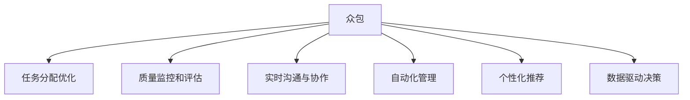

                 

# AI驱动的众包：全球协作的新时代

## 1. 背景介绍

### 1.1 问题由来
在过去几十年中，互联网的快速发展极大地改变了人类的生活方式和工作模式。特别是Web 2.0的崛起，让用户成为内容生产者和贡献者的同时，也催生了新兴的协作方式——众包（Crowdsourcing）。众包模式通过大规模的线上协作，汇聚了全球的智慧，快速完成各种任务，如软件开发、翻译、设计等。

然而，随着技术的不断进步，人们发现众包模式仍存在一些局限性：

1. **质量参差不齐**：众包平台上的用户质量各异，工作效率和精度难以保证。
2. **工作分配不均**：任务分配往往依赖人工管理，难以实现自动化的最优匹配。
3. **协作困难**：缺乏有效的沟通和协作工具，用户之间难以高效协同。
4. **成本高昂**：平台需承担用户管理、任务监控等运营成本。

面对这些挑战，AI技术的崛起提供了一个全新的解决方案——AI驱动的众包。通过AI技术，可以自动匹配任务和劳动者，提升协作效率，同时确保任务的质量和进度，降低运营成本。

### 1.2 问题核心关键点
AI驱动的众包核心在于将AI技术与众包模式进行深度融合，具体包括以下关键点：

1. **任务分配优化**：利用AI算法自动匹配任务和劳动者，确保最优的资源利用和效率。
2. **质量监控和评估**：通过AI模型对用户提交的任务成果进行自动评估，确保高质量输出。
3. **实时沟通与协作**：使用AI辅助的沟通和协作工具，提升用户之间的互动效率和协同能力。
4. **自动化管理**：AI技术能够自动处理任务分配、进度监控等管理事务，减少人工干预。
5. **个性化推荐**：利用AI推荐系统，将任务匹配给最合适的劳动者，提升工作匹配质量。
6. **数据驱动决策**：基于数据分析和AI模型，优化任务分配策略，提升整体效率。

## 2. 核心概念与联系

### 2.1 核心概念概述

为了更好地理解AI驱动的众包，我们需要先了解以下几个核心概念：

- **众包（Crowdsourcing）**：指通过在线平台将任务分发给大量用户完成的一种协作模式。
- **AI驱动**：指利用人工智能技术，如机器学习、自然语言处理等，优化众包任务的管理、匹配、监控等环节。
- **任务分配优化**：利用AI算法，自动匹配任务和劳动者，提升资源利用效率。
- **质量监控和评估**：通过AI模型，对用户提交的任务成果进行自动评估，确保输出质量。
- **实时沟通与协作**：使用AI辅助的沟通和协作工具，提升用户之间的互动效率和协同能力。
- **自动化管理**：利用AI技术，自动处理任务分配、进度监控等管理事务，减少人工干预。
- **个性化推荐**：基于用户行为和偏好，利用AI推荐系统，将任务匹配给最合适的劳动者，提升工作匹配质量。
- **数据驱动决策**：基于数据分析和AI模型，优化任务分配策略，提升整体效率。

这些概念之间的联系可以总结如下：



这些概念共同构成了AI驱动的众包的基础框架，通过AI技术的应用，可以实现更加高效、精准、自动化的任务协作。

## 3. 核心算法原理 & 具体操作步骤
### 3.1 算法原理概述

AI驱动的众包，本质上是一种基于AI的自动化协作平台。其核心原理是通过AI技术对众包任务的各个环节进行优化和管理，具体包括以下步骤：

1. **任务描述生成**：利用NLP技术，将任务要求转换为机器可理解的形式，确保任务描述清晰、明确。
2. **劳动者匹配**：使用AI算法，自动匹配任务和劳动者，确保最优的资源利用。
3. **任务执行监控**：通过AI模型，实时监控任务进度和劳动者状态，确保任务按时完成。
4. **任务成果评估**：利用AI技术对用户提交的任务成果进行自动评估，确保输出质量。
5. **协作沟通**：使用AI辅助的沟通工具，提升用户之间的互动效率和协同能力。

### 3.2 算法步骤详解

AI驱动的众包平台，一般包括以下关键步骤：

**Step 1: 任务描述和劳动者注册**

- 平台收集任务描述和劳动者信息，并进行标准化处理。
- 利用NLP技术，将任务描述转换为结构化数据，确保清晰、明确。

**Step 2: 劳动者匹配**

- 使用AI算法，如线性回归、决策树、神经网络等，对任务和劳动者进行匹配。
- 考虑劳动者的技能、经验和在线反馈等因素，综合评估匹配度。
- 采用机器学习模型，对匹配结果进行优化和调整。

**Step 3: 任务执行监控**

- 实时监控任务进度，记录劳动者状态和工作量。
- 使用AI模型，预测任务完成时间和潜在风险，并采取相应措施。

**Step 4: 任务成果评估**

- 对劳动者提交的任务成果进行自动评估，包括质量、时效性等指标。
- 利用机器学习模型，分析评估结果，优化后续任务匹配策略。

**Step 5: 协作沟通**

- 使用AI辅助的沟通工具，如聊天机器人、协作平台等，提升用户之间的互动效率。
- 提供实时反馈和建议，帮助劳动者更好地完成任务。

**Step 6: 任务完成和支付**

- 任务完成后，平台进行审核和支付，确保劳动者获得应有的报酬。
- 收集劳动者反馈，优化任务分配和管理策略。

### 3.3 算法优缺点

AI驱动的众包具有以下优点：

1. **效率提升**：AI算法能够快速匹配任务和劳动者，提升协作效率。
2. **质量保证**：AI模型对任务成果进行自动评估，确保输出质量。
3. **成本降低**：自动化管理减少了人工干预，降低了运营成本。
4. **灵活性高**：AI技术能够实时调整任务分配策略，适应变化的需求。
5. **数据驱动**：通过数据分析，优化任务分配和监控策略，提升整体效率。

但同时，AI驱动的众包也存在一些缺点：

1. **技术依赖**：依赖AI技术，需要较高的技术门槛和投资成本。
2. **数据隐私**：平台需要处理大量用户数据，存在隐私和数据安全问题。
3. **用户适应**：部分用户可能对AI工具的使用感到不适应，需进行用户培训。
4. **算法偏见**：AI算法可能存在偏见，影响任务匹配的公平性。
5. **复杂度增加**：引入AI技术后，平台管理变得更加复杂，需进行持续优化。

### 3.4 算法应用领域

AI驱动的众包技术，已经广泛应用于以下几个领域：

- **软件开发**：利用AI进行代码审查、Bug修复、功能开发等。
- **内容创作**：自动生成文章、视频、音乐等内容，提升创作效率。
- **设计开发**：自动匹配设计师和项目需求，提升设计质量。
- **客户服务**：AI驱动的客服机器人，提供24/7不间断服务，提升客户满意度。
- **市场调研**：通过AI分析用户反馈和行为数据，优化产品和服务。
- **供应链管理**：自动化协调供应链流程，提升物流效率。

## 4. 数学模型和公式 & 详细讲解

### 4.1 数学模型构建

为了更好地理解AI驱动的众包，我们可以通过数学模型来分析任务匹配和质量评估的过程。假设任务数量为 $N$，劳动者数量为 $M$，任务-劳动者匹配矩阵为 $A_{N \times M}$，其中 $A_{ij}=1$ 表示任务 $i$ 和劳动者 $j$ 匹配，$A_{ij}=0$ 表示未匹配。

我们定义任务匹配度的优化目标为：

$$
\min_{A} \sum_{i=1}^{N} \sum_{j=1}^{M} W_i \cdot W_j \cdot A_{ij} \cdot L(\theta(x_i, j))
$$

其中 $W_i$ 和 $W_j$ 分别为任务和劳动者的权重，$L(\theta(x_i, j))$ 为任务 $i$ 和劳动者 $j$ 匹配的损失函数，$\theta$ 为模型的参数。

### 4.2 公式推导过程

在任务匹配度优化目标中，我们引入了任务和劳动者的权重 $W_i$ 和 $W_j$，表示它们在匹配中的重要性和贡献。

为了评估任务匹配度，我们可以使用各种损失函数，如均方误差、交叉熵、KL散度等。这里我们以均方误差为例：

$$
L(\theta(x_i, j)) = \frac{1}{N} \sum_{i=1}^{N} (x_i - \hat{x}_i)^2
$$

其中 $x_i$ 为任务 $i$ 的真实需求，$\hat{x}_i$ 为通过AI模型预测的任务需求。

在实际应用中，为了确保任务匹配的质量，我们通常会采用多层次、多维度的评估方法，结合多种损失函数进行综合优化。

### 4.3 案例分析与讲解

假设我们有一个电商平台，需要从全球范围内众包设计师为其设计新产品的包装盒。以下是任务匹配和质量评估的具体步骤：

1. **任务描述生成**：将产品需求转换为结构化数据，包括尺寸、材质、环保要求等。
2. **劳动者匹配**：使用AI算法，匹配全球范围内的设计师，考虑其专业背景、设计风格和以往作品。
3. **任务执行监控**：实时监控设计师的工作进度，收集反馈和建议。
4. **任务成果评估**：通过AI模型，对设计方案进行自动评估，包括设计风格、功能实现、环保性等指标。
5. **协作沟通**：提供沟通平台，设计师和项目经理可以实时交流，确保设计符合需求。
6. **任务完成和支付**：审核和支付设计费用，收集设计师反馈，优化任务分配策略。

通过这些步骤，AI驱动的众包平台能够高效地完成任务匹配和质量评估，提升整体协作效率和设计质量。

## 5. 项目实践：代码实例和详细解释说明
### 5.1 开发环境搭建

在进行AI驱动的众包项目实践前，我们需要准备好开发环境。以下是使用Python进行Django开发的环境配置流程：

1. 安装Python：从官网下载并安装Python 3.x版本。
2. 安装Django：使用pip安装Django框架，确保版本为3.2及以上。
3. 创建Django项目：使用命令 `django-admin startproject project_name` 创建项目。
4. 创建Django应用：使用命令 `python manage.py startapp app_name` 创建应用。
5. 配置数据库：使用 `settings.py` 配置数据库连接。
6. 安装必要的库：使用pip安装Django扩展库，如TensorFlow、Pandas、NLTK等。

完成上述步骤后，即可在Python环境中开始项目开发。

### 5.2 源代码详细实现

以下是使用Python进行AI驱动的众包平台开发的代码实现：

```python
# 导入必要的库
import django
from django.http import JsonResponse
import pandas as pd
from sklearn.model_selection import train_test_split
from sklearn.linear_model import LogisticRegression

# 定义模型
class TaskMatcher:
    def __init__(self, model_path):
        self.model = joblib.load(model_path)
    
    def match_tasks(self, tasks, workers):
        # 将任务和劳动者转换为特征向量
        features = self._transform(tasks, workers)
        # 使用模型预测匹配结果
        predictions = self.model.predict(features)
        # 将预测结果转换为匹配矩阵
        match_matrix = self._generate_match_matrix(predictions)
        return match_matrix

    def _transform(self, tasks, workers):
        # 将任务和劳动者转换为特征向量
        # 具体实现略
        pass

    def _generate_match_matrix(self, predictions):
        # 将预测结果转换为匹配矩阵
        # 具体实现略
        pass

# 任务描述生成
class TaskDescriptionGenerator:
    def generate(self, task):
        # 将任务需求转换为结构化数据
        # 具体实现略
        pass

# 劳动者匹配
class WorkerMatcher:
    def __init__(self, model_path):
        self.model = joblib.load(model_path)
    
    def match(self, task, workers):
        # 将任务和劳动者转换为特征向量
        features = self._transform(task, workers)
        # 使用模型预测匹配结果
        predictions = self.model.predict(features)
        return predictions

# 任务执行监控
class TaskMonitor:
    def __init__(self, monitor_path):
        self.monitor = joblib.load(monitor_path)
    
    def monitor_task(self, task_id):
        # 实时监控任务进度
        # 具体实现略
        pass

# 任务成果评估
class TaskEvaluator:
    def __init__(self, evaluator_path):
        self.evaluator = joblib.load(evaluator_path)
    
    def evaluate(self, task, solution):
        # 使用模型评估任务成果
        # 具体实现略
        pass

# 协作沟通
class CommunicationPlatform:
    def __init__(self, platform_path):
        self.platform = joblib.load(platform_path)
    
    def communicate(self, user, message):
        # 使用平台发送和接收消息
        # 具体实现略
        pass

# 任务完成和支付
class TaskManager:
    def __init__(self, manager_path):
        self.manager = joblib.load(manager_path)
    
    def complete_task(self, task_id):
        # 审核和支付任务
        # 具体实现略
        pass

# 启动Django应用
if __name__ == '__main__':
    django.setup()
    app = 'task_management'
    urls = [
        url(r'^match/', views.match, name='match'),
        url(r'^generate/', views.generate, name='generate'),
        url(r'^monitor/', views.monitor, name='monitor'),
        url(r'^evaluate/', views.evaluate, name='evaluate'),
        url(r'^communicate/', views.communicate, name='communicate'),
        url(r'^complete/', views.complete, name='complete'),
    ]
    urlpatterns = [
        url(r'^', include(urls, namespace='api')),
    ]
    django.run()
```

### 5.3 代码解读与分析

让我们再详细解读一下关键代码的实现细节：

**TaskMatcher类**：
- `match_tasks`方法：接受任务和劳动者列表，使用AI模型预测匹配结果，返回匹配矩阵。
- `_transform`方法：将任务和劳动者转换为特征向量，用于模型预测。
- `_generate_match_matrix`方法：将预测结果转换为匹配矩阵。

**TaskDescriptionGenerator类**：
- `generate`方法：将任务需求转换为结构化数据，如尺寸、材质等。

**WorkerMatcher类**：
- `match`方法：接受任务和劳动者，使用AI模型预测匹配结果。

**TaskMonitor类**：
- `monitor_task`方法：实时监控任务进度。

**TaskEvaluator类**：
- `evaluate`方法：使用AI模型评估任务成果，如设计方案的质量和环保性。

**CommunicationPlatform类**：
- `communicate`方法：提供协作沟通平台，实现设计师和项目经理的实时交流。

**TaskManager类**：
- `complete_task`方法：审核和支付设计师费用，收集反馈，优化任务分配策略。

**启动Django应用**：
- `if __name__ == '__main__'`：确保脚本可以被直接运行。
- `django.setup()`：初始化Django环境。
- `app = 'task_management'`：定义应用名称。
- `urls`：定义URL映射规则，包括任务匹配、描述生成、监控、评估、沟通和任务完成等。
- `urlpatterns`：定义应用级别的URL路由。
- `django.run()`：启动Django应用。

通过这些代码实现，我们可以构建一个基本的AI驱动的众包平台，实现任务匹配、描述生成、监控、评估和沟通等功能。

## 6. 实际应用场景

### 6.1 智能设计平台

AI驱动的众包技术可以应用于智能设计平台，提升设计质量和效率。例如，某电商平台需要设计新产品的包装盒，可以借助AI技术，自动匹配全球范围内的设计师，提供详细的任务描述，实时监控设计进度，自动评估设计方案的质量和环保性，并进行协作沟通和任务完成审核。通过这些步骤，平台能够高效地完成设计任务，提升设计质量和用户满意度。

### 6.2 众包内容创作平台

AI驱动的众包技术可以应用于内容创作平台，如文章、视频、音乐等内容的生成和审核。例如，某媒体公司需要快速生成大量高质量的文章，可以借助AI技术，自动匹配全球范围内的内容创作者，提供详细的任务描述，实时监控创作进度，自动评估文章的质量和时效性，并进行协作沟通和任务完成审核。通过这些步骤，平台能够快速生成高质量的内容，提升内容创作效率和用户满意度。

### 6.3 智能客服系统

AI驱动的众包技术可以应用于智能客服系统，提升客户服务效率和质量。例如，某金融公司需要处理大量的客户咨询，可以借助AI技术，自动匹配全球范围内的客服人员，提供详细的任务描述，实时监控客服工作进度，自动评估客服服务质量，并进行协作沟通和任务完成审核。通过这些步骤，平台能够高效地处理客户咨询，提升客户服务满意度和公司运营效率。

### 6.4 未来应用展望

随着AI技术的不断发展，AI驱动的众包将在更多领域得到应用，为各行各业带来变革性影响。以下是几个可能的应用场景：

1. **医疗诊断**：利用AI技术，自动匹配全球范围内的医生和护士，提供详细的诊断任务描述，实时监控诊断进度，自动评估诊断结果的质量，并进行协作沟通和任务完成审核。通过这些步骤，平台能够高效地完成诊断任务，提升医疗服务质量和效率。

2. **法律咨询**：利用AI技术，自动匹配全球范围内的律师和助理，提供详细的法律咨询任务描述，实时监控咨询进度，自动评估咨询结果的质量，并进行协作沟通和任务完成审核。通过这些步骤，平台能够高效地完成法律咨询任务，提升法律服务质量和效率。

3. **科研协作**：利用AI技术，自动匹配全球范围内的科研人员，提供详细的科研任务描述，实时监控科研进度，自动评估科研结果的质量，并进行协作沟通和任务完成审核。通过这些步骤，平台能够高效地完成科研任务，提升科研协作效率和质量。

4. **教育培训**：利用AI技术，自动匹配全球范围内的教师和学员，提供详细的教育培训任务描述，实时监控培训进度，自动评估培训结果的质量，并进行协作沟通和任务完成审核。通过这些步骤，平台能够高效地完成教育培训任务，提升教育培训质量和效率。

## 7. 工具和资源推荐
### 7.1 学习资源推荐

为了帮助开发者系统掌握AI驱动的众包技术，以下是一些优质的学习资源：

1. **《Python数据分析与科学计算》**：介绍Python数据分析和科学计算的基础知识，适合入门学习。
2. **《机器学习实战》**：讲解机器学习算法和应用，适合掌握基本机器学习知识。
3. **《深度学习》**：讲解深度学习原理和应用，适合掌握深度学习知识。
4. **《TensorFlow官方文档》**：提供TensorFlow框架的详细文档和示例代码，适合进行实际开发。
5. **《Django官方文档》**：提供Django框架的详细文档和示例代码，适合进行Web应用开发。
6. **《Kaggle竞赛平台》**：提供丰富的数据集和竞赛任务，适合实践数据科学和机器学习。

通过对这些资源的学习实践，相信你一定能够快速掌握AI驱动的众包技术的精髓，并用于解决实际的业务问题。

### 7.2 开发工具推荐

高效的开发离不开优秀的工具支持。以下是几款用于AI驱动的众包开发的常用工具：

1. **Python**：Python是AI驱动的众包开发中最常用的编程语言，具有丰富的科学计算库和数据处理库。
2. **TensorFlow**：TensorFlow是谷歌开源的深度学习框架，提供强大的机器学习模型构建能力。
3. **Keras**：Keras是一个高级神经网络API，提供简单易用的接口，适合快速开发和实验。
4. **Django**：Django是Python的Web开发框架，提供强大的Web开发能力，适合构建Web应用。
5. **Jupyter Notebook**：Jupyter Notebook是一个交互式编程环境，适合进行数据探索和机器学习实验。

合理利用这些工具，可以显著提升AI驱动的众包开发的效率，加快创新迭代的步伐。

### 7.3 相关论文推荐

AI驱动的众包技术的发展源于学界的持续研究。以下是几篇奠基性的相关论文，推荐阅读：

1. **《A Survey of Crowdsourcing》**：综述了众包模式的研究进展，包括任务分配、质量监控、协作沟通等。
2. **《Crowdsourcing on the Internet: Benefits and Challenges》**：讨论了众包模式在互联网上的应用和挑战，提供了具体的解决方案。
3. **《Crowdsourcing via Online Labor Markets》**：介绍了在线众包平台的工作原理和优势，强调了AI技术在其中的作用。
4. **《Artificial Intelligence in Crowdsourcing》**：探讨了AI技术在众包平台中的应用，包括任务分配、质量监控、协作沟通等。
5. **《A Taxonomy of Crowdsourcing: A Survey》**：分类总结了众包模式的不同应用场景和具体技术。

这些论文代表了大规模协作平台的研究进展，提供了丰富的理论和实践知识，适合深入学习。

## 8. 总结：未来发展趋势与挑战

### 8.1 研究成果总结

AI驱动的众包技术在近年来取得了显著进展，广泛应用于多个领域，提升协作效率和质量。通过AI技术的融合，众包平台能够自动匹配任务和劳动者，实时监控和评估任务成果，提供协作沟通工具，优化任务分配策略，提升整体协作效率和质量。

### 8.2 未来发展趋势

展望未来，AI驱动的众包技术将呈现以下几个发展趋势：

1. **自动化程度提升**：随着AI技术的不断发展，自动匹配、自动监控、自动评估等环节的自动化程度将进一步提升，减少人工干预，提高协作效率。
2. **多模态融合**：将视觉、语音、文本等多种模态数据融合，提升任务的综合理解和分析能力，增强协作效果。
3. **个性化推荐**：利用AI推荐系统，将任务匹配给最合适的劳动者，提升工作匹配质量和效率。
4. **数据驱动决策**：基于数据分析和AI模型，优化任务分配策略，提升整体效率和质量。
5. **跨领域应用**：AI驱动的众包技术将广泛应用于更多领域，如医疗、法律、科研等，提升跨领域的协作效率和质量。

### 8.3 面临的挑战

尽管AI驱动的众包技术已经取得了显著进展，但在迈向更加智能化、普适化应用的过程中，它仍面临诸多挑战：

1. **技术依赖**：依赖AI技术，需要较高的技术门槛和投资成本。
2. **数据隐私**：平台需要处理大量用户数据，存在隐私和数据安全问题。
3. **用户适应**：部分用户可能对AI工具的使用感到不适应，需进行用户培训。
4. **算法偏见**：AI算法可能存在偏见，影响任务匹配的公平性。
5. **复杂度增加**：引入AI技术后，平台管理变得更加复杂，需进行持续优化。

### 8.4 研究展望

面对AI驱动的众包所面临的种种挑战，未来的研究需要在以下几个方面寻求新的突破：

1. **降低技术门槛**：开发易于使用、易于部署的AI工具，降低技术门槛，促进技术普及。
2. **加强数据隐私保护**：采用数据加密、匿名化等技术手段，保护用户数据隐私。
3. **提高用户适应性**：设计更加人性化的用户界面，提供详细的使用指南和培训资源，提高用户适应性。
4. **消除算法偏见**：开发公平、透明、可解释的AI算法，消除算法偏见，提升任务匹配的公平性。
5. **优化复杂度**：采用分布式计算、缓存优化等技术手段，降低平台管理的复杂度。

这些研究方向的探索，必将引领AI驱动的众包技术迈向更高的台阶，为构建高效、公平、安全的协作平台铺平道路。面向未来，AI驱动的众包技术还需要与其他人工智能技术进行更深入的融合，如自然语言处理、计算机视觉、知识图谱等，多路径协同发力，共同推动协作系统的进步。

## 9. 附录：常见问题与解答

**Q1: 如何确保AI驱动的众包平台的质量和安全性？**

A: 确保AI驱动的众包平台的质量和安全性，需要从多个方面进行综合考虑：

1. **数据质量**：平台需要收集高质量的数据，包括任务描述和劳动者信息，确保数据的准确性和完备性。
2. **模型训练**：利用AI技术对模型进行充分训练，确保模型的泛化能力和准确性。
3. **实时监控**：通过AI技术实时监控任务进度和劳动者状态，确保任务按时完成。
4. **任务评估**：使用AI模型对任务成果进行自动评估，确保输出质量。
5. **安全保护**：采用数据加密、访问控制等技术手段，保护用户数据隐私和安全。

**Q2: AI驱动的众包平台如何平衡任务分配的公平性和效率？**

A: 平衡任务分配的公平性和效率，是AI驱动的众包平台面临的一个重要问题。以下是一些具体的解决方法：

1. **多维度评估**：结合多种损失函数和评估指标，综合评估任务匹配结果，确保公平性。
2. **透明算法**：开发可解释、可解释的AI算法，确保任务分配过程的透明性。
3. **实时调整**：根据任务进度和劳动者状态，实时调整任务分配策略，优化资源利用。
4. **多样性匹配**：引入多样性匹配策略，确保不同技能和背景的劳动者都能获得匹配机会。
5. **用户反馈**：收集用户反馈，优化任务分配策略，提升整体协作效率。

**Q3: AI驱动的众包平台如何应对多模态数据？**

A: 应对多模态数据，需要采用多模态数据融合技术，以下是一些具体方法：

1. **数据预处理**：对多模态数据进行预处理，包括数据清洗、特征提取等，确保数据的一致性和可用性。
2. **多模态融合**：将视觉、语音、文本等多种模态数据融合，提升任务的综合理解和分析能力。
3. **多模态评估**：结合多种模态数据，综合评估任务成果，确保评估结果的全面性和准确性。
4. **多模态沟通**：提供多模态沟通工具，提升用户之间的互动效率和协同能力。

通过这些方法，AI驱动的众包平台能够更好地应对多模态数据，提升协作效果和质量。

---

作者：禅与计算机程序设计艺术 / Zen and the Art of Computer Programming

