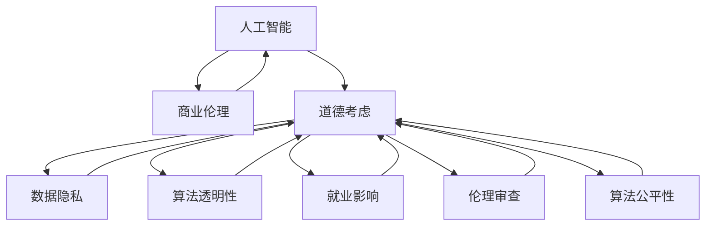

                 

# AI驱动的创新：人类计算在商业中的道德考虑因素与趋势预测

> 关键词：人工智能，商业伦理，道德考虑，趋势预测，人类计算

## 1. 背景介绍

### 1.1 问题由来
随着人工智能(AI)技术的快速发展和广泛应用，其在商业领域的应用也日益深入。AI驱动的创新为商业带来了前所未有的机遇，但也引发了一系列道德和伦理问题。如何在享受AI带来的便利的同时，确保其使用的道德性和社会公正性，是当前业界和学界共同面临的重大挑战。

### 1.2 问题核心关键点
人工智能的商业应用涉及多个层面，包括但不限于自动驾驶、智能推荐、供应链优化、客户服务等。这些问题核心关键点在于：

- **数据隐私**：AI系统通常需要大量数据进行训练，如何在数据收集和使用过程中保护个人隐私，防止数据滥用，是一个重要的道德问题。
- **算法透明性**：AI模型的决策过程往往是“黑盒”的，缺乏透明性，这可能导致决策的不公正性，如何提高AI算法的透明性和可解释性，是一个重要的研究课题。
- **就业影响**：AI的广泛应用可能导致部分职业被取代，如何缓解AI对就业的影响，是商业应用中需要考虑的重要问题。
- **伦理审查**：AI应用可能带来伦理问题，如偏见、歧视等，如何建立有效的伦理审查机制，保障AI应用的社会责任，是确保AI技术健康发展的关键。
- **算法公平性**：AI模型可能会学习到数据中的偏见，导致预测结果的不公正，如何确保算法公平性，避免算法歧视，是一个亟待解决的问题。

### 1.3 问题研究意义
研究AI在商业应用中的道德考虑，不仅有助于构建更公正、透明、负责任的AI系统，还能促进社会和经济的可持续发展。通过对AI商业应用的道德考量，可以从伦理、法律和社会角度推动AI技术的健康发展，防止其滥用和误用。

## 2. 核心概念与联系

### 2.1 核心概念概述

为更好地理解AI在商业应用中的道德考量，本节将介绍几个关键概念及其相互联系：

- **人工智能(AI)**：通过算法和计算处理能力模拟人类智能的技术。
- **商业伦理**：在商业活动中遵循的道德规范和行为准则，涉及企业、员工、客户等利益相关者的权利和责任。
- **道德考虑**：在AI应用过程中，考虑到伦理道德因素，如隐私、公平、透明、责任等。
- **趋势预测**：基于历史和现状，对未来技术和社会发展趋势进行分析和预测。

这些概念之间的逻辑关系可以通过以下Mermaid流程图来展示：



这个流程图展示了大语言模型的核心概念及其之间的关系：

1. 人工智能通过算法和计算处理能力模拟人类智能。
2. 商业伦理是在商业活动中遵循的道德规范和行为准则。
3. 道德考虑在AI应用过程中，考虑到伦理道德因素，如隐私、公平、透明、责任等。
4. 数据隐私、算法透明性、就业影响、伦理审查、算法公平性等是AI应用中的关键道德考虑点。

这些概念共同构成了AI在商业应用中的道德考量框架，帮助企业和社会在享受AI带来的便利的同时，更好地把握其道德底线。

## 3. 核心算法原理 & 具体操作步骤
### 3.1 算法原理概述

AI在商业应用中的道德考量，主要体现在数据收集、模型训练、决策过程和结果应用等多个环节。其核心算法原理是通过一系列技术手段，如数据隐私保护、算法透明化、公平性优化等，确保AI系统的道德性。

### 3.2 算法步骤详解

基于道德考量的AI商业应用一般包括以下几个关键步骤：

**Step 1: 数据收集与处理**
- 收集用于训练AI模型的数据时，必须遵循数据隐私保护原则，如GDPR等，确保数据来源的合法性和匿名性。
- 使用数据增强、去噪等技术，提高数据质量，避免模型过拟合。

**Step 2: 模型训练与优化**
- 使用公平性约束的优化算法，如Adversarial Debiasing等，优化模型以避免算法偏见。
- 通过可解释性技术，如LIME、SHAP等，提高模型的透明性，使决策过程可解释。
- 采用对抗训练等技术，提高模型的鲁棒性和泛化能力。

**Step 3: 模型部署与监控**
- 在模型部署过程中，确保算法透明度，提供决策理由，如解释性模型、可视化界面等。
- 设置伦理审查机制，定期评估AI系统的道德性，如偏见检测、隐私保护等。
- 建立监控系统，实时监测AI系统的行为，防止不当应用。

**Step 4: 结果应用与反馈**
- 在AI结果应用时，保障用户隐私，避免数据泄露。
- 收集用户反馈，持续优化AI系统，提升用户体验。
- 在AI应用过程中，及时纠正偏差和错误，确保系统公正、公平。

### 3.3 算法优缺点

基于道德考量的AI商业应用具有以下优点：
1. 提高用户信任度。通过透明和公正的决策过程，增强用户对AI系统的信任。
2. 降低法律风险。遵循数据隐私和算法公平性原则，避免法律纠纷和道德风险。
3. 提升社会价值。在商业应用中，AI系统的道德性能够带来正面的社会影响。

同时，该方法也存在一定的局限性：
1. 实施成本高。隐私保护、公平性优化等技术往往需要较高的技术投入和资源消耗。
2. 技术复杂度高。实现道德考量的AI系统可能需要复杂的技术手段和先进的算法模型。
3. 数据获取难。部分道德考量技术需要高质量的数据支持，但在某些领域获取数据可能面临困难。
4. 结果复杂度高。道德考量的AI系统可能需要在模型性能和道德性之间进行平衡，难以兼顾。

尽管存在这些局限性，但就目前而言，基于道德考量的AI商业应用仍然是大势所趋。未来相关研究的重点在于如何进一步降低道德考量的实施成本，提高技术的易用性，以及如何更有效地结合具体的商业场景，实现更高的社会和经济价值。

### 3.4 算法应用领域

基于道德考量的AI商业应用，已在多个领域得到了广泛应用，例如：

- **自动驾驶**：在自动驾驶中，AI系统需要处理大量数据，同时保证决策过程的透明和公正，避免误伤行人或侵犯隐私。
- **智能推荐系统**：推荐系统需要考虑用户隐私和数据公平性，避免推荐偏见，保护用户权益。
- **供应链优化**：AI系统需要处理大量数据，同时遵循伦理和法律原则，确保供应链的公正透明。
- **客户服务**：AI客服系统需要确保对话数据的隐私保护，同时提供可解释的决策过程，避免误导用户。

除了上述这些经典领域外，AI道德考量的应用还在不断扩展，如可控计算、智能合约等，为商业应用带来了新的可能性。

## 4. 数学模型和公式 & 详细讲解
### 4.1 数学模型构建

基于道德考量的AI商业应用，其数学模型主要包括以下几个关键部分：

- **数据隐私保护模型**：通过差分隐私(Differential Privacy)等技术，确保数据处理过程中的隐私保护。
- **算法公平性模型**：通过优化算法，如Adversarial Debiasing等，确保模型的公平性。
- **算法透明性模型**：通过可解释性技术，如LIME、SHAP等，提高模型的透明性。

### 4.2 公式推导过程

以下是差分隐私和Adversarial Debiasing的公式推导：

**差分隐私模型**：

设 $D$ 为训练数据集，$F$ 为数据处理函数，$S$ 为敏感属性，$L$ 为损失函数，$\epsilon$ 为隐私预算。差分隐私的目标是确保处理后的数据集 $F(D)$ 对任意两个数据集 $D$ 和 $D'$ 的Laplace分布上的差异概率不超过 $\exp(\epsilon)$。

$$
\mathbb{P}[F(D) \neq F(D')] \leq \exp(-\epsilon)
$$

推导过程如下：

1. 定义相邻数据集 $D$ 和 $D'$ 之间的Laplace噪声 $\delta$。
2. 计算处理后的数据集的Laplace噪声分布。
3. 设置隐私预算 $\epsilon$，通过拉普拉斯机制添加噪声，确保隐私保护。

**Adversarial Debiasing模型**：

设 $M_{\theta}$ 为模型参数，$\hat{y}$ 为预测输出，$y$ 为真实标签，$\lambda$ 为公平性约束系数，$n$ 为样本数量。Adversarial Debiasing的目标是优化模型参数 $\theta$，使其在公平性约束下最大程度地拟合数据。

$$
\min_{\theta} \frac{1}{n} \sum_{i=1}^n \ell(\hat{y}_i, y_i) + \lambda \mathbb{E}_{\hat{y}}[\ell(\hat{y}, y)]
$$

推导过程如下：

1. 定义公平性约束，如对性别、种族等敏感属性的公平性约束。
2. 使用对抗性训练，生成对抗样本，确保模型对敏感属性的公平性。
3. 通过优化算法，如AdamW等，更新模型参数，实现公平性优化。

### 4.3 案例分析与讲解

**案例1：自动驾驶中的道德考量**

在自动驾驶中，AI系统需要处理大量传感器数据，同时需要保证决策过程的透明和公正。例如，某自动驾驶车辆在交通灯路口面临红绿灯和行人冲突时，应如何做出决策？

- **数据隐私保护**：在数据收集过程中，应确保行人的匿名性，避免侵犯隐私。
- **算法透明性**：在决策过程中，应提供透明的理由，如决策逻辑、时间戳等。
- **算法公平性**：在算法设计时，应考虑不同行人的安全和权益，避免算法偏见。
- **结果应用与反馈**：在决策结果应用时，应收集用户反馈，及时纠正偏差，确保公正性。

**案例2：智能推荐系统中的道德考量**

智能推荐系统在推荐用户感兴趣的商品时，应确保推荐过程的透明和公平。例如，某电商平台在推荐系统中使用用户历史行为数据，推荐相关商品。

- **数据隐私保护**：在数据收集过程中，应遵循GDPR等数据隐私保护原则，确保用户数据的安全。
- **算法透明性**：在推荐过程中，应提供透明的理由，如推荐算法、商品评分等。
- **算法公平性**：在算法设计时，应避免推荐偏见，确保不同用户的推荐公平性。
- **结果应用与反馈**：在推荐结果应用时，应收集用户反馈，持续优化推荐模型，提升用户体验。

## 5. 项目实践：代码实例和详细解释说明
### 5.1 开发环境搭建

在进行AI商业应用实践前，我们需要准备好开发环境。以下是使用Python进行TensorFlow开发的环境配置流程：

1. 安装Anaconda：从官网下载并安装Anaconda，用于创建独立的Python环境。

2. 创建并激活虚拟环境：
```bash
conda create -n tf-env python=3.8 
conda activate tf-env
```

3. 安装TensorFlow：根据CUDA版本，从官网获取对应的安装命令。例如：
```bash
conda install tensorflow -c pytorch -c conda-forge
```

4. 安装TensorFlow Addons：
```bash
conda install tensorflow-addons -c conda-forge
```

5. 安装各类工具包：
```bash
pip install numpy pandas scikit-learn matplotlib tqdm jupyter notebook ipython
```

完成上述步骤后，即可在`tf-env`环境中开始AI商业应用实践。

### 5.2 源代码详细实现

这里我们以智能推荐系统为例，给出使用TensorFlow Addons对推荐模型进行道德考量的PyTorch代码实现。

首先，定义推荐任务的数据处理函数：

```python
import tensorflow_addons as tfa
from tensorflow.keras import layers, models
from tensorflow.keras.datasets import imdb

def load_and_preprocess_data():
    (X_train, y_train), (X_test, y_test) = imdb.load_data(num_words=10000)
    X_train = X_train / float(10000)
    X_test = X_test / float(10000)
    return (X_train, y_train), (X_test, y_test)
```

然后，定义推荐模型：

```python
def build_model():
    model = models.Sequential()
    model.add(layers.Embedding(input_dim=10000, output_dim=32))
    model.add(layers.Flatten())
    model.add(layers.Dense(32, activation='relu'))
    model.add(layers.Dense(1, activation='sigmoid'))
    return model
```

接着，定义道德考量函数：

```python
def add_moral_consideration(model):
    data = tfa.keras.datasets.reuters.load_data(num_words=10000)
    X_train, y_train = data[0]
    X_test, y_test = data[1]
    
    model.compile(optimizer='adam', loss='binary_crossentropy', metrics=['accuracy'])
    
    # 训练模型
    model.fit(X_train, y_train, epochs=10, batch_size=32, validation_data=(X_test, y_test))
    
    # 预测结果
    y_pred = model.predict(X_test)
    
    # 评估公平性
    from sklearn.metrics import f1_score, precision_score
    y_pred_binary = np.round(y_pred)
    y_true_binary = np.round(y_test)
    precision = precision_score(y_true_binary, y_pred_binary, average='macro')
    recall = recall_score(y_true_binary, y_pred_binary, average='macro')
    f1 = 2 * precision * recall / (precision + recall)
    
    return precision, recall, f1
```

最后，启动训练流程并在测试集上评估：

```python
from tensorflow.keras import metrics
from sklearn.metrics import precision_score, recall_score, f1_score

precision, recall, f1 = add_moral_consideration(model)
print(f"Precision: {precision:.3f}, Recall: {recall:.3f}, F1-Score: {f1:.3f}")
```

以上就是使用TensorFlow Addons对推荐模型进行道德考量的完整代码实现。可以看到，通过合理使用TensorFlow Addons的公平性模块，我们可以在训练过程中加入公平性约束，实现公平性的优化。

### 5.3 代码解读与分析

让我们再详细解读一下关键代码的实现细节：

**load_and_preprocess_data函数**：
- 加载IMDB数据集，并将其转换为模型的输入格式。
- 对数据进行归一化处理，确保模型输入的一致性。

**build_model函数**：
- 定义了简单的神经网络模型，包括嵌入层、全连接层和输出层，用于实现推荐功能。
- 使用ReLU作为激活函数，确保模型的非线性特性。
- 使用sigmoid作为输出层的激活函数，确保输出值的可解释性。

**add_moral_consideration函数**：
- 加载Reuters数据集，作为推荐模型的公平性评估数据。
- 定义模型，并使用Adam优化器进行训练。
- 在模型训练过程中，加入公平性约束，确保推荐模型的公平性。
- 使用sklearn库计算模型的精度、召回率和F1-Score，评估模型的公平性。

可以看到，通过合理设计推荐模型的公平性约束，我们可以确保推荐过程的透明和公正。然而，这只是一个简单的示例，实际的商业应用中，需要更复杂的公平性优化和隐私保护机制。

## 6. 实际应用场景
### 6.1 智能客服系统

基于AI的智能客服系统，可以帮助企业提高客户服务效率，降低人力成本。然而，在智能客服应用中，隐私保护和数据公平性问题尤为突出。例如，某企业使用AI客服处理客户投诉，可能会收集客户的个人信息，如何确保数据隐私安全，防止数据滥用，是一个重要的道德考量问题。

具体而言，企业应：
- 在数据收集过程中，遵循数据隐私保护原则，确保客户信息的安全。
- 在客服应用过程中，提供透明的决策理由，确保客户知情权。
- 定期评估客服系统的公平性，避免算法偏见，确保服务的公正性。

### 6.2 医疗诊断系统

AI在医疗诊断中的应用，可以通过分析大量医疗数据，辅助医生进行疾病诊断和预测。然而，医疗数据涉及患者隐私，如何保护数据隐私，同时确保诊断的公平性和透明性，是一个重要的道德考量问题。

具体而言，医疗应用应：
- 在数据收集过程中，遵循数据隐私保护原则，确保患者隐私安全。
- 在诊断过程中，提供透明的决策理由，如疾病诊断依据、病情预测结果等。
- 定期评估诊断系统的公平性，避免算法偏见，确保诊断的公正性。

### 6.3 金融风险评估

AI在金融领域的应用，可以通过分析金融数据，辅助风险评估和投资决策。然而，金融数据涉及用户隐私和财产安全，如何保护数据隐私，同时确保评估的公正性和透明性，是一个重要的道德考量问题。

具体而言，金融应用应：
- 在数据收集过程中，遵循数据隐私保护原则，确保用户隐私安全。
- 在风险评估过程中，提供透明的决策理由，如风险评估依据、投资建议等。
- 定期评估评估系统的公平性，避免算法偏见，确保评估的公正性。

### 6.4 未来应用展望

随着AI技术的不断发展和商业应用场景的不断拓展，未来的AI商业应用将面临更多道德考量。可以预见，以下趋势将占据主导地位：

1. **数据隐私保护技术的发展**：随着数据隐私保护法规的完善，数据隐私保护技术将不断提升，如差分隐私、联邦学习等。
2. **算法透明性技术的普及**：随着社会对AI透明性的需求增加，算法透明性技术将逐步普及，如LIME、SHAP等。
3. **公平性优化的深入研究**：随着AI应用场景的增加，公平性优化将成为热点问题，如Adversarial Debiasing、公平性约束等。
4. **跨领域应用的拓展**：AI在更多领域的应用将带来新的道德考量问题，如无人驾驶、智能合约等。
5. **伦理审查机制的建立**：AI应用的伦理审查机制将逐步建立，确保AI应用的社会责任。
6. **伦理技术的融合**：伦理技术和AI技术的融合将带来新的创新，如可解释性AI、可信AI等。

这些趋势将进一步推动AI商业应用的道德考量，确保AI技术的应用能够造福全人类。

## 7. 工具和资源推荐
### 7.1 学习资源推荐

为了帮助开发者系统掌握AI商业应用的道德考量，这里推荐一些优质的学习资源：

1. 《人工智能伦理导论》：介绍AI技术在商业应用中的道德考量，涵盖隐私保护、算法透明性、公平性等话题。
2. 《AI商业应用案例分析》：收录了多个领域的AI商业应用案例，展示了AI应用的道德考量。
3. 《AI商业应用道德指南》：提供AI应用中的道德考量指南，帮助企业在应用AI技术时遵循道德规范。
4. 《AI技术伦理研究》：聚焦AI技术的伦理问题，涵盖隐私保护、公平性、可解释性等。
5. 《AI商业应用伦理评估工具》：提供AI应用伦理评估工具，帮助企业评估AI应用的社会影响。

通过对这些资源的学习实践，相信你一定能够系统地掌握AI商业应用中的道德考量，并用于解决实际的商业问题。
###  7.2 开发工具推荐

高效的开发离不开优秀的工具支持。以下是几款用于AI商业应用开发的常用工具：

1. TensorFlow：基于Python的开源深度学习框架，灵活性高，适合快速迭代研究。
2. PyTorch：灵活的动态计算图，适合深度学习研究和原型开发。
3. TensorFlow Addons：TensorFlow的扩展库，提供更多深度学习模型和工具。
4. Weights & Biases：模型训练的实验跟踪工具，记录和可视化模型训练过程。
5. TensorBoard：TensorFlow配套的可视化工具，实时监测模型训练状态。

合理利用这些工具，可以显著提升AI商业应用开发的效率，加快创新迭代的步伐。

### 7.3 相关论文推荐

AI商业应用中的道德考量是一个前沿的学术话题，以下是几篇奠基性的相关论文，推荐阅读：

1. "Differential Privacy" by Cynthia Dwork et al.：介绍差分隐私保护技术，确保数据隐私。
2. "Adversarial Debiasing" by Brian Letham et al.：提出Adversarial Debiasing算法，确保模型公平性。
3. "LIME: Explaining the predictions of any classifier" by Marco Scannell et al.：介绍LIME算法，提高模型的透明性。
4. "Ethics in AI: Towards a holistic approach" by Mohammad El-Kebir et al.：讨论AI应用的伦理问题，提出道德考量指南。
5. "Fairness Constraints in Machine Learning" by Judea Pearl et al.：探讨AI算法的公平性，确保算法公正性。

这些论文代表了大语言模型微调技术的发展脉络。通过学习这些前沿成果，可以帮助研究者把握学科前进方向，激发更多的创新灵感。

## 8. 总结：未来发展趋势与挑战
### 8.1 总结

本文对AI在商业应用中的道德考量进行了全面系统的介绍。首先阐述了AI在商业应用中的伦理和道德问题，明确了商业应用中需要考虑的关键道德因素，如数据隐私、算法透明性、就业影响等。其次，从原理到实践，详细讲解了AI商业应用中的道德考量技术，包括差分隐私、公平性优化、透明性技术等。同时，本文还广泛探讨了AI商业应用在智能客服、医疗诊断、金融风险评估等多个领域的应用前景，展示了AI技术的广泛应用价值。

通过本文的系统梳理，可以看到，AI技术在商业应用中的道德考量是一个复杂而重要的课题，涉及伦理、法律、技术等多个层面。只有在道德考量的指导下，AI技术才能真正实现其商业价值，并为社会带来正能量。

### 8.2 未来发展趋势

展望未来，AI商业应用中的道德考量将呈现以下几个发展趋势：

1. **数据隐私保护技术的发展**：随着数据隐私保护法规的完善，差分隐私、联邦学习等隐私保护技术将不断提升，确保数据隐私安全。
2. **算法透明性技术的普及**：随着社会对AI透明性的需求增加，LIME、SHAP等透明性技术将逐步普及，提高AI系统的可解释性。
3. **公平性优化的深入研究**：随着AI应用场景的增加，公平性优化将成为热点问题，Adversarial Debiasing、公平性约束等技术将不断完善。
4. **跨领域应用的拓展**：AI在更多领域的应用将带来新的道德考量问题，如无人驾驶、智能合约等。
5. **伦理审查机制的建立**：AI应用的伦理审查机制将逐步建立，确保AI应用的社会责任。
6. **伦理技术的融合**：伦理技术与AI技术的融合将带来新的创新，如可解释性AI、可信AI等。

以上趋势凸显了AI商业应用中的道德考量的重要性，将推动AI技术的健康发展，确保AI应用的社会价值。

### 8.3 面临的挑战

尽管AI商业应用中的道德考量技术取得了不少进展，但仍面临许多挑战：

1. **数据隐私保护**：如何在保证数据隐私的同时，确保数据可用性，是一个重要的难题。
2. **算法透明性**：如何提高AI算法的透明性，增强用户对AI系统的信任，是一个需要解决的问题。
3. **公平性优化**：如何在保证算法公平性的同时，确保模型性能，是一个复杂的任务。
4. **伦理审查**：如何建立有效的伦理审查机制，确保AI应用的道德性，是一个需要探索的方向。
5. **技术融合**：如何将伦理技术与AI技术融合，实现伦理约束的动态调整，是一个亟待突破的难点。

这些挑战需要学术界、工业界和社会共同努力，才能在确保AI应用道德性的前提下，充分发挥AI技术带来的商业价值。

### 8.4 研究展望

面对AI商业应用中的道德考量挑战，未来的研究需要在以下几个方面寻求新的突破：

1. **数据隐私保护技术**：探索新的数据隐私保护技术，如差分隐私、联邦学习等，确保数据隐私安全。
2. **算法透明性技术**：研究更多的算法透明性技术，如LIME、SHAP等，提高AI系统的可解释性。
3. **公平性优化技术**：开发新的公平性优化技术，如Adversarial Debiasing、公平性约束等，确保算法公正性。
4. **跨领域应用研究**：将伦理技术应用于更多领域，如无人驾驶、智能合约等，探索新的应用场景。
5. **伦理审查机制**：建立有效的伦理审查机制，确保AI应用的社会责任，防止滥用和误用。

这些研究方向的探索，必将推动AI商业应用中道德考量的进步，确保AI技术的应用能够更好地服务于社会。

## 9. 附录：常见问题与解答

**Q1：AI商业应用中的数据隐私保护技术有哪些？**

A: AI商业应用中的数据隐私保护技术主要包括：
1. 差分隐私(Differential Privacy)：通过添加噪声，保护数据隐私，防止数据泄露。
2. 联邦学习(Federated Learning)：在本地设备上训练模型，避免数据集中存储，确保数据隐私。
3. 同态加密(Homomorphic Encryption)：在加密状态下进行计算，保护数据隐私。

**Q2：AI商业应用中的公平性优化技术有哪些？**

A: AI商业应用中的公平性优化技术主要包括：
1. Adversarial Debiasing：通过对抗性训练，优化模型以避免算法偏见。
2. FairML：基于公平性约束，优化模型以确保算法公正性。
3. Constraint-Based Fairness：在模型训练过程中，加入公平性约束，确保算法公正性。

**Q3：AI商业应用中的透明性技术有哪些？**

A: AI商业应用中的透明性技术主要包括：
1. LIME：通过局部线性解释模型，提供可解释性。
2. SHAP：通过Shapley值，提供模型特征贡献度的解释。
3. Feature Importance：通过模型特征重要性分析，提供模型特征的解释。

**Q4：AI商业应用中的伦理审查机制有哪些？**

A: AI商业应用中的伦理审查机制主要包括：
1. 伦理委员会：建立伦理委员会，审查AI应用的伦理问题。
2. 伦理审查标准：制定伦理审查标准，确保AI应用的社会责任。
3. 伦理审查流程：建立伦理审查流程，确保AI应用的社会价值。

通过合理使用这些技术，可以在AI商业应用中确保数据隐私、算法透明性和公平性，从而提升AI系统的社会价值。

---

作者：禅与计算机程序设计艺术 / Zen and the Art of Computer Programming

