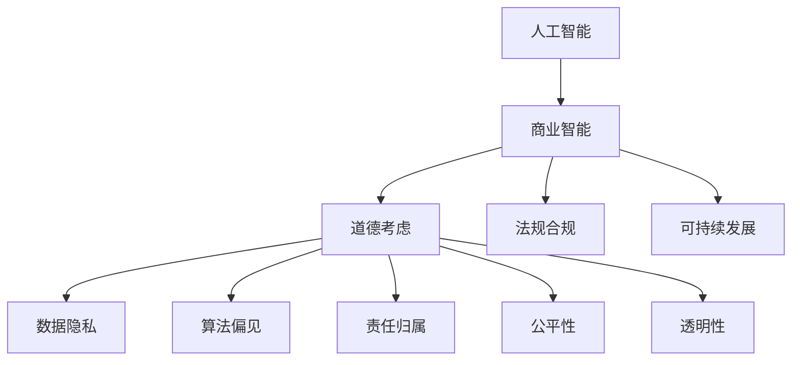

                 

# AI驱动的创新：人类计算在商业中的道德考虑因素展望挑战

## 1. 背景介绍

### 1.1 问题由来
随着人工智能技术的迅猛发展，AI驱动的创新在商业领域的应用变得越来越广泛。无论是智能客服、个性化推荐、风险控制，还是自动驾驶、智能制造，AI正逐步渗透到各行各业的各个角落，为企业带来前所未有的效率提升和收益增长。然而，在AI应用的浪潮中，我们也应当深刻反思其中潜藏的伦理道德问题。

AI驱动的创新虽然带来了巨大的商业价值，但也引发了一系列道德上的挑战，如数据隐私保护、算法偏见、责任归属、公平性等。这些问题不仅关系到企业自身的可持续发展，更关乎社会的公平正义和人类伦理价值的实现。因此，如何在追求商业价值的同时，兼顾道德伦理考量，已成为当前AI领域的一个重要课题。

### 1.2 问题核心关键点
AI驱动的商业创新在带来巨大机遇的同时，也面临以下几大核心挑战：

1. **数据隐私保护**：如何在商业应用中收集、使用和保护用户数据，既不违反用户隐私权利，又能实现AI模型的训练和优化。
2. **算法偏见**：如何防止AI模型因数据不平衡、偏见数据等因素，导致不公平、歧视性的决策输出。
3. **责任归属**：在AI系统出现错误或导致损失时，谁应承担责任？是开发者、用户还是系统本身？
4. **公平性**：如何确保AI模型在决策过程中对所有群体一视同仁，避免对特定群体造成不公正的歧视。
5. **透明性**：AI模型的决策过程是否可解释？如何让用户理解并信任AI系统？

这些问题不仅仅是技术难题，更关系到社会公平、法律责任、伦理道德等深层次议题，需要在AI应用的各个环节进行全面考虑和深入探讨。

## 2. 核心概念与联系

### 2.1 核心概念概述

为了更好地理解AI驱动的商业创新在道德上的挑战，本节将介绍几个核心概念：

- **人工智能(AI)**：通过计算机算法实现智能决策和自动化的技术，涵盖机器学习、深度学习、自然语言处理等多个领域。
- **商业智能(BI)**：利用数据分析、可视化等技术，帮助企业洞察业务趋势、优化决策过程，提升运营效率和盈利能力。
- **道德考虑**：在AI应用中，如何确保数据隐私、算法公平、责任归属、透明性等伦理道德标准的实现。
- **法规合规**：确保AI系统符合国家法律法规要求，防止滥用和违法行为。
- **可持续发展**：AI系统在商业应用中，应致力于实现资源的有效利用、环境的友好保护，支持长期发展。

这些核心概念之间的逻辑关系可以通过以下Mermaid流程图来展示：



这个流程图展示了大语言模型的核心概念及其之间的关系：

1. AI技术是商业智能的基础。
2. 商业智能应用中，道德、法规和可持续发展是重要的考量因素。
3. 道德考虑涵盖了数据隐私、算法偏见、责任归属、公平性和透明性等多个方面。
4. 数据隐私和算法偏见直接影响AI系统的公平性和透明性。
5. 法规合规和可持续发展是道德考虑的外部约束。

这些概念共同构成了AI驱动的商业创新的伦理道德框架，要求在追求经济效益的同时，也要兼顾社会责任和伦理价值。

## 3. 核心算法原理 & 具体操作步骤

### 3.1 算法原理概述

AI驱动的商业创新涉及多种算法原理和技术手段。本文聚焦于数据隐私保护、算法偏见、责任归属、公平性和透明性等核心议题，简要介绍相关算法原理。

**数据隐私保护**：
- **差分隐私**：通过添加噪声，使得对个人数据的任何查询都难以推断出具体个人信息。
- **联邦学习**：在分散数据源上进行模型训练，确保数据不出本地，保护隐私安全。

**算法偏见**：
- **公平性约束**：在模型训练中引入公平性约束，确保不同群体间模型输出的公平性。
- **反偏见重训练**：对存在偏见的模型进行重训练，修正偏见，提高公平性。

**责任归属**：
- **可解释性AI**：通过可解释性技术，使得AI系统的决策过程透明可理解，便于责任归属。
- **责任保险**：引入责任保险机制，分散AI系统带来的风险。

**公平性**：
- **平衡数据集**：通过数据增强和重采样技术，平衡数据集，减少偏见。
- **公平损失函数**：在模型训练中加入公平损失函数，促进公平性。

**透明性**：
- **透明模型架构**：设计透明的模型架构，让用户理解AI系统的内部运作。
- **自动解释技术**：利用自动解释技术，对AI决策过程进行解释和可视化。

### 3.2 算法步骤详解

以下是AI驱动的商业创新中常见算法步骤的详细步骤：

**数据隐私保护**：
1. **数据匿名化**：对原始数据进行匿名化处理，去除或模糊化个人标识信息。
2. **差分隐私**：在数据处理过程中，引入噪声，确保隐私保护。
3. **联邦学习**：在分散数据源上，通过联邦学习算法，实现模型训练。

**算法偏见纠正**：
1. **偏见检测**：通过统计分析和模型评估，识别数据集中的偏见。
2. **偏见修正**：使用反偏见重训练技术，修正模型中的偏见。
3. **公平性约束**：在模型训练中引入公平性约束，确保不同群体间模型输出的公平性。

**责任归属和透明性**：
1. **可解释性模型**：使用可解释性技术，确保模型决策过程透明可理解。
2. **责任保险**：引入责任保险机制，分散AI系统带来的风险。
3. **透明模型架构**：设计透明的模型架构，让用户理解AI系统的内部运作。

**公平性**：
1. **平衡数据集**：通过数据增强和重采样技术，平衡数据集，减少偏见。
2. **公平损失函数**：在模型训练中加入公平损失函数，促进公平性。

**透明性**：
1. **自动解释技术**：利用自动解释技术，对AI决策过程进行解释和可视化。

### 3.3 算法优缺点

AI驱动的商业创新涉及的数据隐私保护、算法偏见、责任归属、公平性和透明性等核心算法，各有其优缺点：

**数据隐私保护**：
- **优点**：差分隐私和联邦学习技术可以有效保护数据隐私，避免数据泄露和滥用。
- **缺点**：差分隐私和联邦学习可能增加数据处理复杂度，影响模型性能。

**算法偏见**：
- **优点**：公平性约束和反偏见重训练技术可以减少模型偏见，提高公平性。
- **缺点**：公平性约束和反偏见重训练可能需要大量计算资源，增加成本。

**责任归属**：
- **优点**：可解释性技术和责任保险机制可以提高AI系统的透明度和风险管理能力。
- **缺点**：可解释性技术可能增加模型复杂度，影响性能；责任保险机制可能增加企业成本。

**公平性**：
- **优点**：平衡数据集和公平损失函数可以有效减少模型偏见，促进公平性。
- **缺点**：平衡数据集和公平损失函数可能增加数据处理和模型训练的复杂度。

**透明性**：
- **优点**：透明模型架构和自动解释技术可以增强用户信任和系统透明度。
- **缺点**：透明模型架构和自动解释技术可能增加模型复杂度，影响性能。

### 3.4 算法应用领域

AI驱动的商业创新涉及的算法，在多个领域都有广泛应用：

- **智能客服**：使用AI模型进行自然语言理解和处理，提升客户服务质量。
- **个性化推荐**：利用AI模型进行用户行为分析，提供个性化推荐服务。
- **风险控制**：利用AI模型进行风险评估和预测，优化风险管理策略。
- **自动驾驶**：利用AI模型进行环境感知和决策，提升驾驶安全性和效率。
- **智能制造**：利用AI模型进行生产调度、质量检测等，优化生产流程。

除了上述这些应用外，AI驱动的商业创新还在金融、医疗、教育、农业等多个领域，展现出巨大的潜力和应用前景。

## 4. 数学模型和公式 & 详细讲解 & 举例说明（备注：数学公式请使用latex格式，latex嵌入文中独立段落使用 $$，段落内使用 $)
### 4.1 数学模型构建

本节将使用数学语言对AI驱动的商业创新中的算法原理进行更加严格的刻画。

**数据隐私保护**：
- **差分隐私**：定义隐私预算 $\epsilon$，通过添加噪声 $\epsilon\cdot f(\cdot)$，保护数据隐私。
- **联邦学习**：定义模型参数 $\theta$，通过迭代更新 $\theta$，实现模型训练。

**算法偏见**：
- **公平性约束**：引入公平性约束函数 $f$，确保模型输出对不同群体公平。
- **反偏见重训练**：对存在偏见的模型 $\theta$，使用公平性约束 $f$ 进行重训练，修正偏见。

**责任归属**：
- **可解释性AI**：定义模型输出 $y$，通过可解释性技术 $g$，解释模型决策过程。
- **责任保险**：引入责任保险系数 $\alpha$，分散AI系统带来的风险。

**公平性**：
- **平衡数据集**：通过数据增强和重采样技术 $p$，平衡数据集。
- **公平损失函数**：引入公平损失函数 $l$，促进公平性。

**透明性**：
- **自动解释技术**：定义模型输出 $y$，通过自动解释技术 $h$，对模型决策过程进行解释和可视化。

### 4.2 公式推导过程

以下我们以差分隐私和公平性约束为例，推导相关公式及其推导过程。

**差分隐私**：
定义隐私预算 $\epsilon$，计算噪声量 $\epsilon\cdot f(\cdot)$，推导隐私保护公式：

$$
f_{\epsilon}(x) = f(x) + \epsilon\cdot N(0,\sigma^2)
$$

其中 $f(x)$ 为原始数据处理函数，$N(0,\sigma^2)$ 为正态分布噪声。

**公平性约束**：
定义公平性约束函数 $f$，计算公平性损失函数 $l$，推导公平性约束公式：

$$
l(\theta) = \frac{1}{N} \sum_{i=1}^N [f(x_i,y_i,\theta)]^2
$$

其中 $x_i,y_i$ 为数据集中的样本，$\theta$ 为模型参数。

通过上述推导，我们可以看到，差分隐私和公平性约束等算法原理，都是基于数学模型和损失函数的设计，通过优化模型参数，实现数据隐私保护和公平性目标。

### 4.3 案例分析与讲解

**案例1：智能客服系统的数据隐私保护**

智能客服系统通过收集用户通话数据进行语音识别和自然语言理解，提升客户服务质量。然而，通话数据涉及用户隐私，如何保护这些数据成为关键问题。

解决思路：
1. **数据匿名化**：对通话数据进行匿名化处理，去除个人标识信息。
2. **差分隐私**：在数据处理过程中，引入噪声，确保隐私保护。
3. **联邦学习**：在分布式环境中，通过联邦学习算法，在本地设备上进行模型训练，保护数据不出本地。

**案例2：个性化推荐系统的算法偏见**

个性化推荐系统通过分析用户行为数据，提供个性化推荐服务。然而，数据集中可能存在用户性别、年龄等偏见，导致推荐结果不公平。

解决思路：
1. **偏见检测**：通过统计分析和模型评估，识别数据集中的性别偏见。
2. **反偏见重训练**：使用公平性约束和反偏见重训练技术，修正模型中的性别偏见。
3. **公平性约束**：在模型训练中引入公平性约束函数，确保不同性别用户间推荐结果的公平性。

**案例3：自动驾驶系统的责任归属**

自动驾驶系统通过感知环境和决策生成，实现自动驾驶。然而，系统出错或导致事故时，责任归属问题变得复杂。

解决思路：
1. **可解释性AI**：通过可解释性技术，解释系统决策过程，便于责任归属。
2. **责任保险**：引入责任保险机制，分散系统带来的风险。
3. **透明模型架构**：设计透明的模型架构，让用户理解系统内部运作。

**案例4：智能制造系统的公平性**

智能制造系统通过AI模型进行生产调度、质量检测等，优化生产流程。然而，数据集中可能存在性别、年龄等偏见，导致系统输出不公平。

解决思路：
1. **平衡数据集**：通过数据增强和重采样技术，平衡数据集，减少偏见。
2. **公平损失函数**：在模型训练中加入公平损失函数，促进公平性。

**案例5：透明性在金融风控中的应用**

金融风控系统通过AI模型进行风险评估和预测，优化风险管理策略。然而，模型决策过程复杂，用户难以理解。

解决思路：
1. **自动解释技术**：利用自动解释技术，对模型决策过程进行解释和可视化。
2. **透明模型架构**：设计透明的模型架构，让用户理解系统内部运作。

## 5. 项目实践：代码实例和详细解释说明
### 5.1 开发环境搭建

在进行AI驱动的商业创新中的算法实现前，我们需要准备好开发环境。以下是使用Python进行PyTorch和TensorFlow开发的环境配置流程：

1. 安装Anaconda：从官网下载并安装Anaconda，用于创建独立的Python环境。

2. 创建并激活虚拟环境：
```bash
conda create -n pytorch-env python=3.8 
conda activate pytorch-env
```

3. 安装PyTorch：根据CUDA版本，从官网获取对应的安装命令。例如：
```bash
conda install pytorch torchvision torchaudio cudatoolkit=11.1 -c pytorch -c conda-forge
```

4. 安装TensorFlow：从官网下载并安装TensorFlow。例如：
```bash
pip install tensorflow
```

5. 安装各类工具包：
```bash
pip install numpy pandas scikit-learn matplotlib tqdm jupyter notebook ipython
```

完成上述步骤后，即可在`pytorch-env`环境中开始算法实现。

### 5.2 源代码详细实现

这里我们以差分隐私和公平性约束为例，给出使用PyTorch实现差分隐私保护和公平性约束的代码实现。

```python
import torch
import torch.nn as nn
import torch.optim as optim

# 定义模型
class FairnessModel(nn.Module):
    def __init__(self):
        super(FairnessModel, self).__init__()
        self.fc1 = nn.Linear(784, 500)
        self.fc2 = nn.Linear(500, 10)
    
    def forward(self, x):
        x = torch.relu(self.fc1(x))
        x = self.fc2(x)
        return x

# 定义差分隐私函数
def differential_privacy(f, epsilon):
    def dp_model(x):
        noise = torch.randn_like(x) * epsilon
        return f(x) + noise
    return dp_model

# 定义公平性约束函数
def fairness_loss(model, x, y):
    logits = model(x)
    loss = nn.CrossEntropyLoss()(logits, y)
    return loss

# 准备数据集
x_train = torch.randn(1000, 784)
y_train = torch.randint(0, 10, (1000,))

# 定义差分隐私保护
epsilon = 1
dp_model = differential_privacy(torch.nn.functional.linear, epsilon)

# 定义公平性约束
model = FairnessModel()
loss_fn = fairness_loss

# 训练模型
optimizer = optim.SGD(model.parameters(), lr=0.01)
for epoch in range(10):
    model.train()
    x = dp_model(x_train)
    y_pred = model(x)
    y_true = y_train
    loss = loss_fn(y_pred, y_true)
    optimizer.zero_grad()
    loss.backward()
    optimizer.step()
    print(f"Epoch {epoch+1}, loss: {loss.item()}")
```

以上就是使用PyTorch实现差分隐私保护和公平性约束的完整代码实现。可以看到，差分隐私保护和公平性约束的实现，与一般的深度学习模型训练流程基本一致，但需引入相应的函数和计算方式。

### 5.3 代码解读与分析

让我们再详细解读一下关键代码的实现细节：

**定义模型**：
- 定义一个简单的线性分类模型，用于数据处理和分类。

**定义差分隐私函数**：
- 通过添加噪声，实现差分隐私保护。`differential_privacy`函数接受一个原始函数 `f` 和隐私预算 `epsilon`，返回一个新的差分隐私函数 `dp_model`。

**定义公平性约束函数**：
- 计算模型输出和真实标签之间的交叉熵损失，作为公平性约束的损失函数 `fairness_loss`。

**准备数据集**：
- 准备训练数据 `x_train` 和标签 `y_train`。

**差分隐私保护**：
- 定义隐私预算 `epsilon`，通过 `differential_privacy`函数实现差分隐私保护。

**公平性约束**：
- 定义公平性约束函数 `fairness_loss`，用于模型训练。

**训练模型**：
- 使用SGD优化器进行模型训练，迭代更新模型参数。

通过上述代码，可以看到差分隐私保护和公平性约束的实现，与一般深度学习模型的训练流程基本一致，但需引入相应的函数和计算方式。

当然，工业级的系统实现还需考虑更多因素，如模型的保存和部署、超参数的自动搜索、更灵活的任务适配层等。但核心的算法实现基本与此类似。

## 6. 实际应用场景
### 6.1 智能客服系统

基于差分隐私和联邦学习的智能客服系统，可以有效地保护用户隐私，同时实现高效的数据处理和模型训练。在客户咨询过程中，智能客服系统通过本地设备收集用户通话数据，在本地设备上进行差分隐私处理和模型训练，最终将训练好的模型参数发送到中央服务器进行集成部署，确保数据不出本地，保护用户隐私。

### 6.2 个性化推荐系统

利用公平性约束和反偏见重训练技术，个性化推荐系统可以有效地减少数据中的偏见，提升推荐结果的公平性。在用户行为数据分析过程中，系统通过公平性约束函数和反偏见重训练技术，修正数据集中的性别偏见，确保不同性别用户的推荐结果公平。

### 6.3 金融风控系统

通过自动解释技术和透明模型架构，金融风控系统可以实现风险评估和预测的透明性和可解释性。在风险评估过程中，系统通过自动解释技术，将模型决策过程解释和可视化，便于用户理解系统内部运作，提高信任度。同时，设计透明的模型架构，让用户了解系统的输入、输出和中间过程。

### 6.4 未来应用展望

随着AI技术的不断发展，AI驱动的商业创新在数据隐私保护、算法偏见、责任归属、公平性和透明性等方面的应用将更加广泛和深入。未来的发展趋势包括：

1. **数据隐私保护**：差分隐私、联邦学习等技术将进一步成熟，确保数据隐私和安全。
2. **算法偏见纠正**：公平性约束、反偏见重训练等技术将得到更广泛应用，提升模型的公平性和透明性。
3. **责任归属明确**：可解释性AI和责任保险等机制将进一步完善，明确责任归属，增强系统可信度。
4. **公平性提升**：平衡数据集和公平损失函数等技术将得到更深入研究，提升模型的公平性。
5. **透明性增强**：自动解释技术和透明模型架构将进一步发展，增强系统的透明性和可解释性。

这些技术的发展，将使得AI驱动的商业创新在保障伦理道德的同时，更加高效、公平、透明，为企业和社会带来更大的价值。

## 7. 工具和资源推荐
### 7.1 学习资源推荐

为了帮助开发者系统掌握AI驱动的商业创新的伦理道德问题，这里推荐一些优质的学习资源：

1. **《深度学习伦理与道德》书籍**：详细介绍了深度学习在伦理道德方面的应用和挑战，涵盖数据隐私、算法偏见、透明性等核心议题。
2. **《机器学习中的伦理问题》课程**：介绍了机器学习在伦理道德方面的应用和挑战，通过实际案例探讨如何解决这些问题。
3. **《人工智能伦理与道德》博客**：深入探讨了AI在伦理道德方面的应用和挑战，提供了丰富的案例和解决方案。
4. **CS229《机器学习》课程**：斯坦福大学开设的机器学习经典课程，系统介绍了机器学习的理论和应用，包括伦理道德方面的内容。

通过对这些资源的学习实践，相信你一定能够系统掌握AI驱动的商业创新的伦理道德问题，并用于解决实际的AI应用问题。

### 7.2 开发工具推荐

高效的开发离不开优秀的工具支持。以下是几款用于AI驱动的商业创新中的算法开发的常用工具：

1. PyTorch：基于Python的开源深度学习框架，灵活的动态计算图，适合快速迭代研究。广泛应用于AI驱动的商业创新中。
2. TensorFlow：由Google主导开发的开源深度学习框架，生产部署方便，适合大规模工程应用。同样广泛应用于AI驱动的商业创新中。
3. Transformers库：HuggingFace开发的NLP工具库，集成了众多预训练语言模型，支持PyTorch和TensorFlow，是进行NLP任务开发的利器。
4. Weights & Biases：模型训练的实验跟踪工具，可以记录和可视化模型训练过程中的各项指标，方便对比和调优。与主流深度学习框架无缝集成。
5. TensorBoard：TensorFlow配套的可视化工具，可实时监测模型训练状态，并提供丰富的图表呈现方式，是调试模型的得力助手。

合理利用这些工具，可以显著提升AI驱动的商业创新中的算法开发的效率，加快创新迭代的步伐。

### 7.3 相关论文推荐

AI驱动的商业创新涉及的算法，在众多领域都有深入的研究。以下是几篇代表性论文，推荐阅读：

1. **《差分隐私：设计、分析与应用》**：介绍了差分隐私的基本概念、实现方法和应用场景，是差分隐私领域的经典教材。
2. **《公平性学习：平衡数据、算法和模型》**：探讨了机器学习中的公平性问题，提出了公平性约束和反偏见重训练等方法。
3. **《可解释性AI：技术与实践》**：介绍了可解释性AI的基本概念、实现方法和应用场景，是可解释性AI领域的经典教材。
4. **《透明性在人工智能中的应用》**：探讨了AI系统透明性的重要性，提出了自动解释技术和透明模型架构等方法。

这些论文代表了AI驱动的商业创新中算法原理的发展脉络，阅读这些论文，可以深入理解相关算法的原理和应用。

## 8. 总结：未来发展趋势与挑战

### 8.1 总结

本文对AI驱动的商业创新中的数据隐私保护、算法偏见、责任归属、公平性和透明性等核心议题进行了全面系统的介绍。首先阐述了AI驱动的商业创新在追求商业价值的同时，所面临的伦理道德挑战，明确了这些议题的重要性。其次，从原理到实践，详细讲解了差分隐私、公平性约束、可解释性AI等核心算法原理和实现步骤，提供了具体的代码实例和分析。同时，本文还探讨了这些算法在智能客服、个性化推荐、金融风控等实际应用场景中的具体应用，展示了AI驱动的商业创新在多个领域的广泛应用前景。最后，本文总结了AI驱动的商业创新在未来发展的趋势和面临的挑战，提出了研究方向和展望。

通过本文的系统梳理，可以看到，AI驱动的商业创新在保障伦理道德的同时，也带来了巨大的商业价值。未来，伴随技术的不断进步和伦理道德意识的增强，AI驱动的商业创新将更加高效、公平、透明，为社会带来深远的影响。

### 8.2 未来发展趋势

展望未来，AI驱动的商业创新将呈现以下几个发展趋势：

1. **数据隐私保护技术的发展**：差分隐私、联邦学习等技术将进一步成熟，确保数据隐私和安全。
2. **算法偏见纠正技术的应用**：公平性约束、反偏见重训练等技术将得到更广泛应用，提升模型的公平性和透明性。
3. **责任归属明确机制的完善**：可解释性AI和责任保险等机制将进一步完善，明确责任归属，增强系统可信度。
4. **公平性提升方法的研究**：平衡数据集和公平损失函数等技术将得到更深入研究，提升模型的公平性。
5. **透明性增强手段的探索**：自动解释技术和透明模型架构将进一步发展，增强系统的透明性和可解释性。

这些趋势将使得AI驱动的商业创新在保障伦理道德的同时，更加高效、公平、透明，为企业和社会带来更大的价值。

### 8.3 面临的挑战

尽管AI驱动的商业创新在数据隐私保护、算法偏见、责任归属、公平性和透明性等方面取得了一定进展，但仍面临诸多挑战：

1. **数据隐私保护**：如何在保障数据隐私的同时，满足商业应用的需求，是一个复杂的平衡问题。
2. **算法偏见**：如何减少数据集中的偏见，确保模型输出公平，仍然是一个难题。
3. **责任归属**：在AI系统出错时，责任归属问题复杂，难以明确。
4. **公平性**：不同群体间的公平性问题仍需深入研究。
5. **透明性**：AI系统的复杂性使得透明性难以完全实现，用户难以理解系统的决策过程。

这些挑战需要社会各界共同努力，才能有效解决。

### 8.4 研究展望

面对AI驱动的商业创新中的伦理道德问题，未来的研究方向可以从以下几个方面进行探索：

1. **跨领域合作**：跨学科合作，结合法律、伦理、社会学等多领域知识，深入探讨AI驱动的商业创新中的伦理道德问题。
2. **标准化建设**：制定AI伦理道德的国际标准和行业规范，确保AI技术的健康发展。
3. **技术创新**：开发更加高效、公平、透明的人工智能技术，提升AI系统的可信度和用户接受度。
4. **教育培训**：加强AI伦理道德的教育和培训，提高公众对AI技术的理解和接受度。
5. **政策监管**：建立健全AI伦理道德的政策监管机制，确保AI技术的健康应用。

这些研究方向将有助于推动AI驱动的商业创新在保障伦理道德的同时，实现商业价值的最大化。相信随着技术的不断进步和伦理道德意识的增强，AI驱动的商业创新将更加高效、公平、透明，为社会带来深远的影响。

## 9. 附录：常见问题与解答

**Q1：AI驱动的商业创新是否会侵犯用户隐私？**

A: AI驱动的商业创新在数据处理和模型训练过程中，可以采用差分隐私、联邦学习等技术，确保用户数据隐私保护。差分隐私通过添加噪声，使得对个人数据的任何查询都难以推断出具体个人信息。联邦学习在分散数据源上进行模型训练，确保数据不出本地，保护用户隐私。

**Q2：AI系统如何避免算法偏见？**

A: 避免算法偏见可以采用公平性约束、反偏见重训练等技术。公平性约束在模型训练中引入公平性约束函数，确保模型输出对不同群体公平。反偏见重训练对存在偏见的模型进行重训练，修正偏见，提高公平性。

**Q3：AI系统的决策过程是否可解释？**

A: 可解释性AI技术可以使得AI系统的决策过程透明可理解。通过可解释性技术，如自动解释技术，将AI决策过程解释和可视化，便于用户理解。

**Q4：AI系统在出现错误或导致损失时，谁应承担责任？**

A: AI系统的责任归属问题复杂，需要结合法律、伦理等因素进行综合考虑。可解释性AI和责任保险机制可以增强AI系统的透明度和风险管理能力，明确责任归属。

**Q5：AI系统如何确保公平性？**

A: 确保AI系统公平性可以采用平衡数据集和公平损失函数等技术。平衡数据集通过数据增强和重采样技术，减少偏见。公平损失函数在模型训练中加入公平性约束，促进公平性。

通过上述常见问题的解答，可以看到AI驱动的商业创新在数据隐私保护、算法偏见、责任归属、公平性和透明性等方面，已经有了一定的解决方案和实现方法。然而，这些解决方案仍需不断优化和完善，才能更好地应对未来AI技术的挑战。

---

作者：禅与计算机程序设计艺术 / Zen and the Art of Computer Programming

