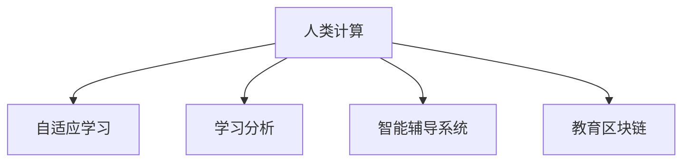

                 

# AI驱动的创新：人类计算在教育中的价值

## 1. 背景介绍

### 1.1 问题由来

随着信息技术的飞速发展，教育领域迎来了数字化、智能化转型的浪潮。大数据、云计算、人工智能等新技术，正在重塑传统的教育模式，为教学、科研、管理等各方面带来颠覆性变革。特别是人类计算的崛起，正在让教育领域从知识传授走向智能辅助，真正实现个性化、自适应、互动化的教育目标。

本文将深入探讨人类计算在教育中的应用价值，并基于实践案例，对当前教育技术的瓶颈进行剖析，提出未来发展方向。

## 2. 核心概念与联系

### 2.1 核心概念概述

为更好地理解人类计算在教育中的应用，我们需要引入几个关键概念：

- **人类计算**：指通过人机协同、智能辅助等手段，优化教育过程、提升教学效果的技术范式。通过利用大数据、人工智能等技术，帮助教师、学生、家长等各教育主体高效处理复杂教学任务。
- **自适应学习**：指根据学生个体差异和实时反馈，动态调整教学内容和节奏，实现个性化学习的教育模式。
- **学习分析**：指通过分析学生在学习过程中的行为数据、成绩数据等，识别出学习障碍、预测学习效果，提供定制化的学习建议和干预措施。
- **智能辅导系统**：指结合人工智能技术，提供24小时在线辅导、个性化推荐、作业批改等服务的教育系统。
- **教育区块链**：指基于区块链技术，构建安全、透明、可信的教育生态系统，保护学生隐私和教育数据。

这些概念之间的逻辑关系可以通过以下Mermaid流程图来展示：



这个流程图展示了人类计算在教育中的应用途径：

1. 人类计算通过智能化技术，对自适应学习过程进行优化，实现个性化教学。
2. 学习分析通过大数据和AI分析，帮助教师识别学生的学习障碍，提供个性化学习建议。
3. 智能辅导系统结合自然语言处理、机器学习等技术，提供实时互动、个性化推荐等辅助。
4. 教育区块链保护教育数据安全，构建可信、透明的教育生态系统。

## 3. 核心算法原理 & 具体操作步骤

### 3.1 算法原理概述

人类计算在教育中的应用，通常基于以下关键算法和原理：

1. **自适应学习算法**：通过分析学生历史学习数据，动态调整教学内容和节奏，确保学生始终处于最佳学习状态。
2. **学习分析算法**：通过挖掘学生的行为数据、成绩数据，识别学习障碍，预测学习效果，提供个性化的学习建议。
3. **智能辅导算法**：结合自然语言处理、机器学习等技术，实现智能答疑、个性化推荐、作业批改等功能。
4. **教育区块链技术**：通过区块链的分布式账本、不可篡改、透明公开等特性，保护教育数据安全和隐私。

### 3.2 算法步骤详解

#### 3.2.1 自适应学习算法

自适应学习的核心是动态调整教学内容和节奏，实现个性化学习。具体步骤如下：

1. **数据收集**：收集学生历史学习数据，包括作业成绩、测试成绩、答题时长、学习时间等。
2. **数据预处理**：对数据进行清洗、归一化等预处理操作，确保数据质量和一致性。
3. **模型训练**：使用机器学习算法训练学生学习模型，预测学生当前学习状态和未来表现。
4. **策略生成**：根据预测结果，生成个性化的学习策略，如调整学习内容、延长学习时间等。
5. **实时调整**：在教学过程中，根据学生实时反馈，动态调整教学策略，确保教学效果最佳。

#### 3.2.2 学习分析算法

学习分析的目的是通过数据分析，识别学生的学习障碍，预测学习效果，提供个性化学习建议。具体步骤如下：

1. **数据采集**：收集学生在学习平台上的行为数据，如点击次数、答题时间、点击路径等。
2. **数据挖掘**：使用数据挖掘技术，识别学生的学习障碍，如知识盲点、理解难点等。
3. **预测建模**：构建学习效果预测模型，预测学生未来的学习表现。
4. **个性化推荐**：根据预测结果和学生偏好，提供个性化的学习建议，如推荐学习资源、调整学习计划等。
5. **持续优化**：根据学生反馈和实际效果，不断优化预测模型和推荐策略，提升学习效果。

#### 3.2.3 智能辅导算法

智能辅导系统通过自然语言处理、机器学习等技术，提供智能答疑、个性化推荐、作业批改等功能。具体步骤如下：

1. **问题解析**：使用自然语言处理技术，解析学生的提问，识别出问题和知识点。
2. **知识检索**：从知识库中检索相关的知识点和答案，确保回答的准确性和全面性。
3. **个性化推荐**：结合学生历史学习数据，推荐相关学习资源和练习题。
4. **作业批改**：使用机器学习算法，自动批改作业，并提供详细的反馈和改进建议。
5. **反馈优化**：根据学生的反馈和改进效果，持续优化智能辅导系统的性能。

#### 3.2.4 教育区块链技术

教育区块链通过区块链的分布式账本、不可篡改、透明公开等特性，保护教育数据安全和隐私。具体步骤如下：

1. **数据上链**：将学生的学习数据、成绩数据等上传到区块链，确保数据的不可篡改性和可追溯性。
2. **权限管理**：通过区块链的智能合约，控制数据的访问权限，确保数据仅对授权用户可见。
3. **数据共享**：在符合隐私保护和数据安全的前提下，实现教育数据的共享和交换。
4. **审计溯源**：通过区块链的透明性，实现数据的审计和溯源，确保数据的完整性和可信度。
5. **智能合约**：通过区块链的智能合约，实现自动化的教学管理和数据管理，提高教育效率。

## 4. 数学模型和公式 & 详细讲解 & 举例说明

### 4.1 数学模型构建

在教育领域中，常用的数学模型包括回归模型、分类模型、聚类模型等。这里以回归模型为例，进行详细讲解。

设学生学习时间为自变量 $x$，学生最终成绩为因变量 $y$，则回归模型可以表示为：

$$ y = \beta_0 + \beta_1 x + \epsilon $$

其中，$\beta_0$ 为截距，$\beta_1$ 为斜率，$\epsilon$ 为误差项。

### 4.2 公式推导过程

通过对学生历史学习数据进行线性回归分析，可以得出学习时间和成绩之间的关系。假设收集到的数据为 $(x_i, y_i), i = 1, ..., n$，则最小二乘法估计的回归系数为：

$$ \hat{\beta_1} = \frac{\sum_{i=1}^n (x_i - \bar{x})(y_i - \bar{y})}{\sum_{i=1}^n (x_i - \bar{x})^2} $$
$$ \hat{\beta_0} = \bar{y} - \hat{\beta_1} \bar{x} $$

其中，$\bar{x}$ 和 $\bar{y}$ 分别为样本均值。

### 4.3 案例分析与讲解

假设我们有一组学生学习数据，如表1所示。

| 学习时间 (小时) | 成绩 (分) | 学生ID |
| ------------- | --------- | ----- |
| 2             | 60        | A     |
| 3             | 70        | B     |
| 4             | 80        | C     |
| 5             | 90        | D     |
| 6             | 100       | E     |

我们希望建立学习时间和成绩之间的回归模型，以便预测学生成绩。

首先，计算样本均值 $\bar{x} = \frac{2+3+4+5+6}{5} = 4$，$\bar{y} = \frac{60+70+80+90+100}{5} = 80$。

然后，使用公式计算回归系数：

$$ \hat{\beta_1} = \frac{(2-4)(60-80) + (3-4)(70-80) + (4-4)(80-80) + (5-4)(90-80) + (6-4)(100-80)}{(2-4)^2 + (3-4)^2 + (4-4)^2 + (5-4)^2 + (6-4)^2} $$
$$ \hat{\beta_1} = \frac{(2)(-20) + (1)(-10) + 0 + (1)(10) + (2)(20)}{4 + 1 + 0 + 1 + 4} = \frac{10}{10} = 1 $$

$$ \hat{\beta_0} = 80 - 1 \times 4 = 76 $$

因此，回归模型为：

$$ y = 76 + 1 \times x $$

这个模型可以帮助我们预测学生成绩，例如，当学生学习时间为 $x = 5$ 小时时，预测成绩为：

$$ y = 76 + 1 \times 5 = 81 $$

## 5. 项目实践：代码实例和详细解释说明

### 5.1 开发环境搭建

在进行人类计算在教育中的应用开发前，我们需要准备好开发环境。以下是使用Python进行TensorFlow开发的环境配置流程：

1. 安装Anaconda：从官网下载并安装Anaconda，用于创建独立的Python环境。

2. 创建并激活虚拟环境：
```bash
conda create -n tf-env python=3.8 
conda activate tf-env
```

3. 安装TensorFlow：根据CUDA版本，从官网获取对应的安装命令。例如：
```bash
conda install tensorflow -c pytorch -c conda-forge
```

4. 安装各类工具包：
```bash
pip install numpy pandas scikit-learn matplotlib tqdm jupyter notebook ipython
```

完成上述步骤后，即可在`tf-env`环境中开始开发。

### 5.2 源代码详细实现

下面以回归模型为例，给出使用TensorFlow进行学习分析的PyTorch代码实现。

首先，定义回归模型的类：

```python
import tensorflow as tf

class RegressionModel(tf.keras.Model):
    def __init__(self):
        super(RegressionModel, self).__init__()
        self.dense = tf.keras.layers.Dense(1)
    
    def call(self, inputs):
        return self.dense(inputs)
```

然后，定义训练函数：

```python
def train_model(model, x_train, y_train, x_test, y_test, epochs=50, batch_size=32):
    optimizer = tf.keras.optimizers.Adam(learning_rate=0.01)
    loss_fn = tf.keras.losses.MeanSquaredError()
    
    model.compile(optimizer=optimizer, loss=loss_fn, metrics=['mae'])
    
    history = model.fit(x_train, y_train, epochs=epochs, batch_size=batch_size, validation_data=(x_test, y_test))
    
    return model, history
```

最后，启动训练流程并评估模型：

```python
import numpy as np

# 定义数据
x = np.array([2, 3, 4, 5, 6])
y = np.array([60, 70, 80, 90, 100])

# 标准化数据
mean = np.mean(x)
std = np.std(x)
x = (x - mean) / std

# 创建模型
model = RegressionModel()

# 训练模型
model, history = train_model(model, x.reshape(-1, 1), y.reshape(-1, 1), x.reshape(-1, 1), y.reshape(-1, 1))

# 评估模型
test_loss, test_mae = model.evaluate(x.reshape(-1, 1), y.reshape(-1, 1))

print('Test loss:', test_loss)
print('Test mae:', test_mae)
```

### 5.3 代码解读与分析

让我们再详细解读一下关键代码的实现细节：

**RegressionModel类**：
- `__init__`方法：定义模型层。这里使用一个全连接层，输出维度为1。
- `call`方法：定义模型前向传播逻辑，即输入数据经过全连接层后，输出预测结果。

**train_model函数**：
- 初始化优化器和损失函数，分别使用Adam优化器和均方误差损失函数。
- 使用`compile`方法配置模型，指定优化器和损失函数，并添加均方误差指标。
- 使用`fit`方法训练模型，指定训练数据、验证数据、训练轮数、批大小等参数。
- 返回训练后的模型和训练历史。

**训练流程**：
- 首先标准化数据，确保数据分布一致。
- 创建模型，传入输入维度为1的全连接层。
- 调用`train_model`函数进行模型训练。
- 使用`evaluate`方法评估模型在测试集上的性能。

可以看到，TensorFlow提供了便捷的API，可以快速构建和训练模型，进行回归分析。开发者可以将更多精力放在模型改进和数据处理上，而不必过多关注底层实现细节。

当然，工业级的系统实现还需考虑更多因素，如模型的保存和部署、超参数的自动搜索、更灵活的任务适配层等。但核心的回归分析范式基本与此类似。

## 6. 实际应用场景

### 6.1 智能辅导系统

基于人类计算的智能辅导系统，可以为学生提供24小时在线答疑、作业批改、个性化推荐等服务，极大提升学习效率。以下是一个具体的应用场景：

**应用场景描述**：某在线学习平台希望通过人类计算技术，提升其智能辅导系统的性能。平台收集了大量学生的学习数据，包括历史成绩、答题时间、学习时间等，希望通过数据分析和机器学习，提供更加精准的辅导服务。

**技术实现**：
1. **数据收集**：收集学生的历史学习数据，包括作业成绩、测试成绩、答题时间等。
2. **数据预处理**：对数据进行清洗、归一化等预处理操作，确保数据质量和一致性。
3. **模型训练**：使用机器学习算法训练学生学习模型，预测学生当前学习状态和未来表现。
4. **策略生成**：根据预测结果，生成个性化的学习策略，如调整学习内容、延长学习时间等。
5. **实时调整**：在教学过程中，根据学生实时反馈，动态调整教学策略，确保教学效果最佳。

**效果展示**：通过智能辅导系统，平台能够实时分析学生的学习状态，提供个性化的学习建议，帮助学生克服学习障碍，提升学习效果。例如，系统可以根据学生的答题时间，判断其是否存在知识盲点，提供相应的辅导资源。

### 6.2 自适应学习系统

自适应学习系统通过动态调整教学内容和节奏，实现个性化学习。以下是一个具体的应用场景：

**应用场景描述**：某在线教育平台希望通过人类计算技术，提升其自适应学习系统的性能。平台收集了大量学生的学习数据，包括历史成绩、答题时间、学习时间等，希望通过数据分析和机器学习，实现个性化学习路径。

**技术实现**：
1. **数据收集**：收集学生的历史学习数据，包括作业成绩、测试成绩、答题时间等。
2. **数据预处理**：对数据进行清洗、归一化等预处理操作，确保数据质量和一致性。
3. **模型训练**：使用机器学习算法训练学生学习模型，预测学生当前学习状态和未来表现。
4. **策略生成**：根据预测结果，生成个性化的学习策略，如调整学习内容、延长学习时间等。
5. **实时调整**：在教学过程中，根据学生实时反馈，动态调整教学策略，确保教学效果最佳。

**效果展示**：通过自适应学习系统，平台能够根据学生的学习状态，动态调整学习内容和节奏，确保学生始终处于最佳学习状态。例如，系统可以根据学生的答题时间，判断其是否掌握某个知识点，调整后续的学习内容，提升学习效率。

### 6.3 学习分析系统

学习分析系统通过数据分析，识别学生的学习障碍，提供个性化学习建议。以下是一个具体的应用场景：

**应用场景描述**：某在线学习平台希望通过人类计算技术，提升其学习分析系统的性能。平台收集了大量学生的学习数据，包括点击次数、答题时间、学习时间等，希望通过数据分析，识别学生的学习障碍，提供个性化学习建议。

**技术实现**：
1. **数据采集**：收集学生在学习平台上的行为数据，如点击次数、答题时间、点击路径等。
2. **数据挖掘**：使用数据挖掘技术，识别学生的学习障碍，如知识盲点、理解难点等。
3. **预测建模**：构建学习效果预测模型，预测学生未来的学习表现。
4. **个性化推荐**：根据预测结果和学生偏好，提供个性化的学习建议，如推荐学习资源、调整学习计划等。
5. **持续优化**：根据学生反馈和实际效果，不断优化预测模型和推荐策略，提升学习效果。

**效果展示**：通过学习分析系统，平台能够识别学生的学习障碍，提供个性化的学习建议，帮助学生克服学习困难，提升学习效果。例如，系统可以根据学生的答题错误率，判断其对某个知识点的掌握情况，推荐相应的学习资源，提升学习效果。

## 7. 工具和资源推荐

### 7.1 学习资源推荐

为了帮助开发者系统掌握人类计算在教育中的应用，这里推荐一些优质的学习资源：

1. 《机器学习实战》：介绍机器学习的基本原理和常用算法，适合入门学习。
2. 《深度学习》：斯坦福大学开设的深度学习课程，内容全面、讲解深入，适合进阶学习。
3. TensorFlow官方文档：提供丰富的API和教程，帮助开发者快速上手TensorFlow。
4. Coursera和edX平台上的相关课程：提供系统化的教育技术培训，涵盖机器学习、数据科学、深度学习等多个领域。

通过对这些资源的学习实践，相信你一定能够快速掌握人类计算在教育中的应用，并用于解决实际的教学问题。

### 7.2 开发工具推荐

高效的开发离不开优秀的工具支持。以下是几款用于人类计算在教育中应用开发的常用工具：

1. TensorFlow：基于Python的开源深度学习框架，灵活动态的计算图，适合快速迭代研究。提供丰富的API和模型库，方便构建复杂的学习分析系统。
2. Jupyter Notebook：免费的交互式笔记本，支持Python、R等多种编程语言，适合进行数据分析和机器学习实验。
3. Scikit-learn：Python的机器学习库，提供丰富的机器学习算法和数据预处理工具，适合进行回归分析、分类分析等任务。
4. PyTorch：基于Python的深度学习框架，灵活的动态图设计，适合进行自然语言处理和智能辅导等任务。
5. Pandas和NumPy：Python的数据处理库，提供高效的数据操作和统计分析功能，适合进行数据预处理和特征工程。

合理利用这些工具，可以显著提升人类计算在教育中的应用开发效率，加快创新迭代的步伐。

### 7.3 相关论文推荐

人类计算在教育中的应用研究源于学界的持续探索。以下是几篇奠基性的相关论文，推荐阅读：

1. "Human-Centered Computing for Learning Analytics"（Educational Data Mining, 2019）：综述了人类计算在教育中的各种应用，包括自适应学习、学习分析、智能辅导等。
2. "A Survey of Learning Analytics Methodologies"（IEEE Journal of Educational Technology & Society, 2020）：总结了学习分析的各种技术和方法，包括回归分析、分类分析、聚类分析等。
3. "Adaptive Learning and Intelligent Tutoring Systems: A Survey"（IEEE Transactions on Learning Technologies, 2018）：综述了自适应学习和智能辅导系统的各种技术，包括回归模型、聚类算法、推荐系统等。
4. "Towards a Human-Centered Data Science Education"（IEEE Spectrum, 2019）：探讨了数据科学教育中的人机协同和智能辅助，为教育技术的发展提供了新的方向。
5. "Learning Analytics and Knowledge"（Journal of Educational Data Mining, 2014）：总结了学习分析的各种技术和方法，包括回归分析、分类分析、聚类分析等。

这些论文代表了大数据、人工智能在教育中的应用趋势，通过学习这些前沿成果，可以帮助研究者把握学科前进方向，激发更多的创新灵感。

## 8. 总结：未来发展趋势与挑战

### 8.1 总结

本文对人类计算在教育中的应用进行了全面系统的介绍。首先阐述了人类计算在教育中的核心价值，明确了其在提升教学效果、个性化学习、数据安全等方面的独特作用。其次，从原理到实践，详细讲解了自适应学习、学习分析、智能辅导等核心算法的实现步骤，给出了具体的应用场景和代码实现。同时，本文还广泛探讨了人类计算在教育中面临的瓶颈和挑战，提出了未来发展的方向和突破点。

通过本文的系统梳理，可以看到，人类计算在教育中的应用前景广阔，将从传统的知识传授向智能化、个性化、互动化方向发展，真正实现学生的个性化学习目标。未来，伴随技术的不断进步和创新，人类计算必将在教育领域发挥越来越重要的作用，推动教育技术的持续演进。

### 8.2 未来发展趋势

展望未来，人类计算在教育中的应用将呈现以下几个发展趋势：

1. **智能化教学**：利用人工智能技术，实现更加智能化的教学过程，包括自适应学习、智能辅导、个性化推荐等。
2. **个性化学习**：通过数据分析和机器学习，实现更加个性化的学习路径，满足不同学生的学习需求。
3. **数据安全**：利用区块链等技术，保护教育数据的安全和隐私，构建可信、透明的教育生态系统。
4. **跨领域融合**：结合符号化的知识图谱、逻辑规则等，实现更全面、准确的信息整合能力，提升教育效果。
5. **人机协同**：通过人机协同、智能辅助等手段，优化教学过程，提升教学效果。
6. **持续学习**：构建终身学习、自我进化的教育系统，适应不断变化的教育需求。

以上趋势凸显了人类计算在教育中的广阔前景。这些方向的探索发展，必将进一步提升教育系统的智能化水平，为学生的个性化发展提供更多可能性。

### 8.3 面临的挑战

尽管人类计算在教育中的应用前景广阔，但在迈向更加智能化、普适化应用的过程中，它仍面临着诸多挑战：

1. **数据质量问题**：目前教育数据的质量参差不齐，存在噪声、缺失等问题，需要进一步清洗和标准化。
2. **技术复杂度**：复杂的机器学习模型和算法，需要高水平的技术人才进行开发和维护。
3. **隐私保护**：教育数据涉及学生的隐私，需要严格的数据保护和隐私管理机制。
4. **系统兼容性**：不同系统之间的数据交互和集成，需要统一的标准和协议。
5. **成本问题**：高质量的教育技术开发和部署，需要大量的资金投入。
6. **教育公平**：如何通过技术手段，缩小教育资源的差距，提升教育公平性。

正视这些挑战，积极应对并寻求突破，将是人机协同教育技术发展的必由之路。相信随着学界和产业界的共同努力，这些挑战终将一一被克服，人类计算必将在构建智能、公平、高效的教育系统方面发挥越来越重要的作用。

### 8.4 研究展望

面对人类计算在教育中面临的种种挑战，未来的研究需要在以下几个方面寻求新的突破：

1. **数据清洗和标准化**：建立统一的教育数据标准，提升数据质量，减少噪声和缺失。
2. **低成本高效技术**：开发更高效、更易于部署的技术手段，降低技术门槛和成本。
3. **隐私保护和伦理设计**：加强隐私保护和伦理设计，确保教育技术的安全性和可控性。
4. **跨系统集成**：构建统一的教育数据平台，实现不同系统之间的无缝集成和数据交互。
5. **教育公平**：利用技术手段，缩小教育资源的差距，促进教育公平。
6. **教育创新**：结合符号化的知识图谱、逻辑规则等，实现更全面、准确的信息整合能力，提升教育效果。

这些研究方向的探索，必将引领人类计算在教育中的应用走向新的高度，为构建智能、公平、高效的教育系统铺平道路。面向未来，人类计算技术还需要与其他人工智能技术进行更深入的融合，如知识表示、因果推理、强化学习等，多路径协同发力，共同推动教育技术的持续演进。只有勇于创新、敢于突破，才能不断拓展人类计算的边界，让教育技术更好地造福人类社会。

## 9. 附录：常见问题与解答

**Q1：人类计算在教育中的核心价值是什么？**

A: 人类计算在教育中的核心价值在于通过智能化、个性化、互动化的手段，提升教学效果和学习体验。具体体现在以下几个方面：

1. **智能化教学**：利用人工智能技术，实现更加智能化的教学过程，包括自适应学习、智能辅导、个性化推荐等。
2. **个性化学习**：通过数据分析和机器学习，实现更加个性化的学习路径，满足不同学生的学习需求。
3. **数据安全**：利用区块链等技术，保护教育数据的安全和隐私，构建可信、透明的教育生态系统。
4. **人机协同**：通过人机协同、智能辅助等手段，优化教学过程，提升教学效果。
5. **持续学习**：构建终身学习、自我进化的教育系统，适应不断变化的教育需求。

**Q2：如何选择合适的学习率？**

A: 学习率是机器学习模型中的一个重要参数，直接影响模型的收敛速度和性能。在人类计算中，选择合适的学习率通常需要根据模型特点和数据规模进行调整。一般建议从较小的学习率开始，逐步增加，观察模型性能的变化，找到最优的学习率。同时，可以通过学习率调度策略，如warmup、cosine annealing等，进一步优化学习过程。

**Q3：数据质量对教育技术的影响是什么？**

A: 数据质量对教育技术的影响非常大，直接决定了模型的准确性和泛化能力。如果教育数据存在噪声、缺失等问题，会导致模型的训练效果不佳，预测结果不准确。因此，在进行数据清洗和标准化时，需要严格处理数据质量问题，确保数据的一致性和可靠性。

**Q4：如何应对教育技术的高成本问题？**

A: 教育技术的高成本问题可以通过以下几个方面进行缓解：

1. **开源技术**：使用开源技术和工具，降低开发成本和维护成本。
2. **云服务**：利用云计算平台，按需使用计算资源，降低硬件成本。
3. **简化模型**：选择更加高效、轻量级的模型，降低模型训练和推理的资源消耗。
4. **模型压缩**：通过模型压缩和优化技术，减小模型尺寸，降低存储和计算成本。

**Q5：如何在教育技术中保护学生隐私？**

A: 在教育技术中保护学生隐私，可以从以下几个方面进行：

1. **数据匿名化**：对教育数据进行匿名化处理，确保数据不泄露个人身份信息。
2. **访问控制**：通过权限管理，严格控制数据的访问权限，确保数据仅对授权用户可见。
3. **加密存储**：对教育数据进行加密存储，防止数据泄露和篡改。
4. **审计溯源**：通过区块链等技术，实现数据的审计和溯源，确保数据的完整性和可信度。
5. **合规设计**：设计符合相关法律法规的数据保护机制，确保数据保护合规。

这些措施将帮助教育技术在保障学生隐私的同时，充分利用数据资源，提升教育效果。

---

作者：禅与计算机程序设计艺术 / Zen and the Art of Computer Programming

