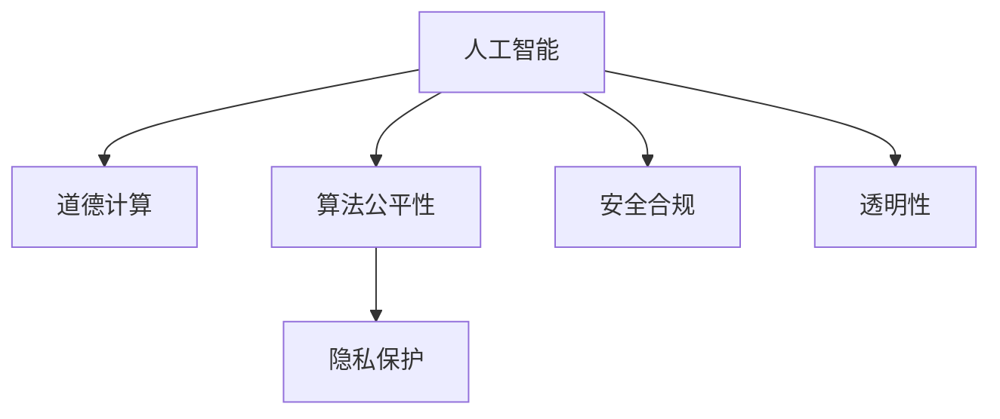

                 

# AI驱动的创新：人类计算在金融行业的道德考虑

> 关键词：人工智能,道德计算,金融行业,算法公平性,隐私保护,安全合规

## 1. 背景介绍

### 1.1 问题由来

金融行业是人工智能应用最为活跃的领域之一，无论是客户服务、风险控制、财务分析，还是投资策略，都可以看到AI技术的身影。然而，随着AI技术的深度融入金融行业，随之而来的伦理和道德问题也愈发凸显。

近年来，由于数据泄露、算法偏见、模型黑箱等问题的频繁曝光，公众对AI在金融领域应用的信任度大幅下降。如何在保障金融业务安全、合规的同时，充分考虑伦理道德问题，成为了亟待解决的重大课题。

### 1.2 问题核心关键点

在金融行业中，AI驱动的创新主要体现在以下几个方面：

- **自动化决策**：AI可以实时分析海量交易数据，快速作出交易决策。
- **风险预测**：通过深度学习算法，AI可以预测市场走势，辅助决策。
- **客户服务**：AI驱动的聊天机器人、智能投顾等应用提升了客户体验。
- **欺诈检测**：AI可以快速识别异常交易，防止金融欺诈。
- **个性化推荐**：AI能够基于用户历史行为进行金融产品推荐，增加用户粘性。

同时，这些AI应用也带来了伦理道德上的挑战：

- **算法公平性**：AI模型在数据输入、训练和决策过程中是否公平无偏，是否对少数群体造成歧视。
- **隐私保护**：如何确保用户数据的安全，防止数据泄露和滥用。
- **安全合规**：AI应用是否符合法律法规，如GDPR、CCPA等。
- **透明性**：AI决策过程是否透明，是否可解释，是否容易被误解或滥用。

## 2. 核心概念与联系

### 2.1 核心概念概述

为了更好地理解AI在金融行业的伦理和道德问题，本节将介绍几个关键概念：

- **人工智能(AI)**：通过模拟人类智能过程，使计算机能够自主地执行复杂任务的技术。
- **道德计算(Ethical Computing)**：在技术开发和应用过程中，注重伦理道德的考量，避免技术滥用，确保技术造福人类。
- **算法公平性(Algorithmic Fairness)**：确保AI算法在所有群体中的表现公平，无偏见。
- **隐私保护(Privacy Protection)**：确保用户数据的安全，防止未经授权的访问和使用。
- **安全合规(Security Compliance)**：确保AI应用符合各类法律法规和行业标准。
- **透明性(Transparency)**：AI决策过程的可解释性，使得用户和监管机构能够理解和信任模型的输出。

这些概念之间的逻辑关系可以通过以下Mermaid流程图来展示：



这个流程图展示了我文章中提到的关键概念及其之间的联系：

1. 人工智能是整个话题的基础，在各个环节中都要考虑到AI的伦理道德问题。
2. 道德计算贯穿于AI开发和应用的各个阶段，确保AI技术的良性发展。
3. 算法公平性、隐私保护、安全合规和透明性是道德计算的子领域，分别从不同角度对AI应用进行伦理道德的考量。

## 3. 核心算法原理 & 具体操作步骤

### 3.1 算法原理概述

AI在金融行业的应用，主要基于机器学习和深度学习算法。其核心思想是通过大量数据训练模型，使机器能够自主学习和决策。但由于这些算法本身具有黑箱性质，使得其在应用过程中容易出现算法偏见、数据泄露等问题。

### 3.2 算法步骤详解

基于道德计算的AI在金融行业应用的基本步骤包括：

1. **数据收集与预处理**：
   - 确保数据来源合法，符合隐私保护的要求。
   - 对数据进行清洗、去重、标注等预处理，确保数据质量。

2. **模型训练与优化**：
   - 使用无偏、无歧视的算法，训练公平、透明的AI模型。
   - 采用联邦学习、差分隐私等技术，保护用户隐私。
   - 进行安全合规的审计，确保模型符合法律法规。

3. **模型部署与监控**：
   - 在生产环境中部署模型，进行实时监控和评估。
   - 引入自动异常检测和预警机制，防止模型误用。
   - 定期更新模型，保持其最新的性能和公平性。

4. **用户反馈与迭代**：
   - 收集用户反馈，评估模型的实际效果。
   - 根据反馈结果，对模型进行迭代和优化。

### 3.3 算法优缺点

AI在金融行业的应用，具有以下优点：

- **高效决策**：AI可以处理海量数据，快速作出决策。
- **准确预测**：AI模型通过学习历史数据，能够准确预测市场趋势。
- **个性化服务**：AI能够根据用户行为提供个性化推荐，提升用户体验。
- **防范风险**：AI可以快速识别异常交易，预防金融欺诈。

同时，也存在以下缺点：

- **算法偏见**：AI模型可能因训练数据存在偏见而产生不公平的决策。
- **数据隐私**：AI模型需要大量数据进行训练，可能侵犯用户隐私。
- **安全合规**：AI应用需要符合各类法律法规，如GDPR等。
- **透明度不足**：AI模型通常具有黑箱性质，难以解释其决策过程。

### 3.4 算法应用领域

AI在金融行业的应用领域非常广泛，主要包括：

- **客户服务**：智能客服、智能投顾、聊天机器人等。
- **风险控制**：信用评分、欺诈检测、市场预测等。
- **投资策略**：量化交易、高频交易、算法套利等。
- **财务管理**：财务报告分析、自动记账、智能支付等。
- **合规审计**：合规检测、审计追踪、自动化合规报告等。

这些应用领域覆盖了金融行业的方方面面，对提升金融业务效率、降低风险、增强用户体验具有重要意义。

## 4. 数学模型和公式 & 详细讲解 & 举例说明

### 4.1 数学模型构建

基于道德计算的AI在金融行业应用，主要依赖机器学习和深度学习算法。以信用评分模型为例，其数学模型如下：

$$
P(x)=\frac{e^{x}}{1+e^{x}}
$$

其中 $P(x)$ 表示用户申请贷款的信用评分，$x$ 为输入变量，包括用户历史还款记录、收入、负债等。

### 4.2 公式推导过程

信用评分模型的推导过程如下：

- 设用户申请贷款的概率为 $P(x)$，假设用户历史还款记录为 $x$，其他输入变量为 $u$。
- 通过大量历史数据训练得到信用评分模型：$P(x)=\frac{e^{x}}{1+e^{x}}$。
- 将新用户的历史记录输入模型，得到其信用评分 $P(x)$。
- 根据信用评分，决定是否批准贷款申请，以及贷款的利率和额度。

### 4.3 案例分析与讲解

以信贷审批为例，假设有两家公司分别利用AI和传统信用评分模型进行信贷审批。AI模型通过训练大量历史数据，发现种族、性别等因素与信用评分高度相关，导致模型对少数群体产生歧视。而传统信用评分模型则更注重经济指标，较少考虑种族、性别等因素。

## 5. 项目实践：代码实例和详细解释说明

### 5.1 开发环境搭建

在进行AI应用开发前，需要准备以下开发环境：

1. 安装Python：选择Python 3.8版本，使用Anaconda进行环境管理。
2. 安装TensorFlow：选择最新版本，使用pip进行安装。
3. 安装Pandas和Scikit-learn：用于数据处理和模型评估。
4. 安装OpenAI Gym：用于模拟训练环境。
5. 安装Jupyter Notebook：用于编写和执行代码。

### 5.2 源代码详细实现

以下是一个基于TensorFlow的信用评分模型的代码实现：

```python
import tensorflow as tf
import pandas as pd
from sklearn.model_selection import train_test_split

# 读取数据
data = pd.read_csv('credit_data.csv')

# 数据预处理
X = data.drop(['loan_status'], axis=1)
y = data['loan_status']

# 数据分割
X_train, X_test, y_train, y_test = train_test_split(X, y, test_size=0.2, random_state=42)

# 构建模型
model = tf.keras.Sequential([
    tf.keras.layers.Dense(64, activation='relu'),
    tf.keras.layers.Dense(32, activation='relu'),
    tf.keras.layers.Dense(1, activation='sigmoid')
])

# 编译模型
model.compile(optimizer='adam', loss='binary_crossentropy', metrics=['accuracy'])

# 训练模型
model.fit(X_train, y_train, epochs=10, batch_size=32, validation_data=(X_test, y_test))

# 评估模型
model.evaluate(X_test, y_test)
```

### 5.3 代码解读与分析

**信用评分模型**：
- 使用TensorFlow的Keras API构建神经网络模型。
- 输入层包含多个特征，输出层为单神经元sigmoid激活函数，输出0到1之间的概率。
- 使用binary_crossentropy作为损失函数，优化器为adam。
- 模型训练10个epoch，使用32个样本进行批处理。
- 在测试集上评估模型性能，输出准确率和损失值。

## 6. 实际应用场景

### 6.1 智能客服

智能客服是AI在金融行业的重要应用之一。金融机构利用AI技术构建聊天机器人，实时解答用户咨询，提升客户体验。然而，在构建智能客服时，需要注意以下几点：

- **算法偏见**：确保训练数据不含有种族、性别等偏见，避免模型在服务过程中产生歧视。
- **隐私保护**：用户聊天记录属于敏感信息，需要采取加密、去标识等措施，确保数据安全。
- **安全合规**：确保聊天机器人符合GDPR等法律法规，防止数据滥用。
- **透明性**：用户需要能够理解聊天机器人的回答逻辑，增加信任度。

### 6.2 风险控制

金融机构利用AI进行风险控制，通过分析用户历史行为和市场数据，识别异常交易，防止欺诈。但在使用AI进行风险控制时，需要注意：

- **算法偏见**：AI模型可能因数据偏差而产生不公平的决策。
- **数据隐私**：分析用户行为数据，需要获得用户同意，防止数据泄露。
- **安全合规**：确保模型符合监管要求，防止模型被滥用。
- **透明性**：需要向用户解释风险控制决策的逻辑，增加透明度。

### 6.3 投资策略

金融机构利用AI进行量化交易和算法套利，通过数据分析和模型预测，寻找投资机会。然而，在使用AI进行投资决策时，需要注意：

- **算法偏见**：AI模型可能因训练数据偏差而产生不公平的决策。
- **数据隐私**：分析用户投资行为，需要获得用户同意，防止数据泄露。
- **安全合规**：确保模型符合监管要求，防止模型被滥用。
- **透明性**：需要向用户解释投资决策的逻辑，增加透明度。

### 6.4 未来应用展望

未来，AI在金融行业的应用将更加广泛和深入，但同时面临更多的伦理和道德挑战。展望未来，AI在金融行业的发展将呈现以下几个趋势：

1. **伦理计算标准**：建立AI伦理计算的标准和规范，引导AI技术的良性发展。
2. **公平透明算法**：开发公平、透明、可解释的AI算法，消除算法偏见。
3. **隐私保护技术**：采用先进的隐私保护技术，确保用户数据安全。
4. **安全合规机制**：建立健全的安全合规机制，防止模型滥用。
5. **跨学科合作**：加强AI与伦理学、社会学等多学科的合作，推动AI技术的可持续发展。

## 7. 工具和资源推荐

### 7.1 学习资源推荐

为了帮助开发者更好地理解和应用道德计算的AI技术，推荐以下学习资源：

1. **Coursera《AI伦理学》课程**：涵盖AI伦理学的基本概念和实际应用，由知名大学开设。
2. **IEEE《AI与伦理》系列论文**：IEEE发布的AI与伦理研究的经典论文集，值得深入学习。
3. **Google AI博客**：Google AI团队发布的伦理计算和AI技术博客，包含丰富的实际案例和研究进展。
4. **《道德计算：AI伦理和社会挑战》书籍**：深入探讨AI伦理和社会挑战，适合深入理解。
5. **Kaggle《AI伦理竞赛》**：通过实际竞赛，提升对AI伦理问题的理解和应用能力。

### 7.2 开发工具推荐

为了实现道德计算的AI技术，推荐以下开发工具：

1. **TensorFlow**：流行的深度学习框架，支持分布式训练和模型部署。
2. **PyTorch**：灵活的深度学习框架，支持动态图和静态图计算。
3. **Keras**：高层次的深度学习API，适合快速原型设计和模型训练。
4. **Hugging Face Transformers**：包含多种预训练语言模型的库，适合NLP任务开发。
5. **Scikit-learn**：流行的机器学习库，支持多种算法和模型评估。

### 7.3 相关论文推荐

为了深入了解AI伦理和道德计算的研究进展，推荐以下相关论文：

1. **《公平学习：无偏见、公平的AI算法》**：探讨如何消除AI算法中的偏见，确保公平性。
2. **《隐私保护技术综述》**：详细介绍各种隐私保护技术，如差分隐私、联邦学习等。
3. **《AI伦理与监管综述》**：涵盖AI伦理和监管的最新研究成果，适合深入理解。
4. **《道德计算：伦理、法律和技术》**：探讨AI伦理计算的道德、法律和技术问题，适合多学科研究。

## 8. 总结：未来发展趋势与挑战

### 8.1 总结

本文对基于道德计算的AI在金融行业的应用进行了系统介绍。首先，阐述了AI在金融行业的应用背景和面临的伦理道德问题，明确了AI应用中的核心关键点。其次，详细讲解了道德计算的AI在金融行业应用的数学模型和实际操作步骤，给出了代码实例和详细解释。最后，探讨了AI在金融行业的实际应用场景，并提出了未来发展趋势和挑战。

通过本文的系统梳理，可以看到，AI在金融行业的伦理和道德问题需要从多个维度进行考虑，如算法公平性、隐私保护、安全合规和透明性等。AI技术的发展需要与伦理计算相结合，才能更好地造福社会。

### 8.2 未来发展趋势

展望未来，基于道德计算的AI在金融行业将呈现以下几个发展趋势：

1. **伦理计算标准**：随着AI技术的广泛应用，建立AI伦理计算的标准和规范，引导AI技术的良性发展。
2. **公平透明算法**：开发公平、透明、可解释的AI算法，消除算法偏见，确保AI决策的公正性。
3. **隐私保护技术**：采用先进的隐私保护技术，确保用户数据安全，防止数据滥用。
4. **安全合规机制**：建立健全的安全合规机制，防止模型滥用，确保AI应用的合规性。
5. **跨学科合作**：加强AI与伦理学、社会学等多学科的合作，推动AI技术的可持续发展。

### 8.3 面临的挑战

尽管基于道德计算的AI在金融行业的应用取得了一定进展，但仍面临以下挑战：

1. **数据隐私保护**：AI模型需要大量数据进行训练，如何确保数据隐私是一个重大问题。
2. **算法偏见**：AI模型在训练和应用过程中，容易产生算法偏见，影响决策的公平性。
3. **透明性不足**：AI模型通常具有黑箱性质，难以解释其决策过程，增加了伦理和合规的风险。
4. **安全合规**：AI应用需要符合各类法律法规，如GDPR等，增加了合规的复杂性。

### 8.4 研究展望

未来的研究需要在以下几个方面寻求新的突破：

1. **隐私保护技术**：开发先进的隐私保护技术，确保用户数据安全。
2. **公平透明算法**：开发公平、透明、可解释的AI算法，消除算法偏见。
3. **跨学科合作**：加强AI与伦理学、社会学等多学科的合作，推动AI技术的可持续发展。
4. **伦理计算标准**：建立AI伦理计算的标准和规范，引导AI技术的良性发展。

这些研究方向的探索，必将引领AI技术在金融行业的道德计算，为构建安全、可靠、可解释、可控的智能系统铺平道路。

## 9. 附录：常见问题与解答

**Q1：AI在金融行业应用时，如何确保数据隐私？**

A: 在AI模型训练和应用过程中，可以采用以下措施确保数据隐私：
1. 数据去标识化：将用户数据中的个人信息去除或匿名化，防止数据泄露。
2. 数据加密：采用加密技术保护数据，防止数据在传输和存储过程中被非法访问。
3. 差分隐私：使用差分隐私技术，在保护用户隐私的同时，仍能进行数据分析和模型训练。
4. 联邦学习：采用联邦学习技术，在各个节点本地训练模型，不传输原始数据，保护用户隐私。

**Q2：如何开发公平、透明、可解释的AI算法？**

A: 开发公平、透明、可解释的AI算法，可以采用以下方法：
1. 公平性约束：在模型训练过程中，加入公平性约束，确保模型在所有群体中的表现公平。
2. 透明性解释：使用可解释的模型结构，如决策树、线性回归等，使模型的决策过程透明可解释。
3. 可视化工具：使用可视化工具，展示模型的决策过程和关键特征，帮助用户理解和信任模型。
4. 自动解释：使用自动解释技术，如LIME、SHAP等，自动生成模型解释，帮助用户理解模型输出。

**Q3：AI在金融行业应用时，如何确保安全合规？**

A: 确保AI在金融行业应用时符合安全合规要求，可以采用以下措施：
1. 合规审计：定期对AI模型进行合规审计，确保符合GDPR、CCPA等法律法规。
2. 合规培训：对AI开发者和应用方进行合规培训，提高合规意识和能力。
3. 合规工具：使用合规工具，如自动化合规检测工具，帮助检测和修复合规问题。
4. 合规报告：定期生成合规报告，记录AI应用过程中的合规情况，接受监管机构的审查。

这些措施的实施，将有助于确保AI在金融行业应用的合规性和安全性，防止模型滥用和数据滥用。

---

作者：禅与计算机程序设计艺术 / Zen and the Art of Computer Programming

