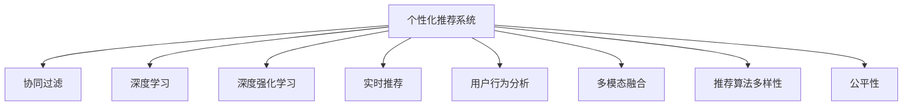

                 

# AI驱动的实时个性化推荐技术

> 关键词：人工智能,推荐系统,个性化推荐,协同过滤,深度学习,深度强化学习,实时推荐,用户行为分析

## 1. 背景介绍

在数字化时代，数据驱动的个性化推荐技术在电商、新闻、视频、音乐等多个领域展现出强劲的生命力。通过分析用户行为和偏好，推荐系统能够为用户提供量身定制的内容，提升用户满意度和转化率。AI技术在这一领域的应用，特别是深度学习和强化学习等技术的引入，使得个性化推荐系统能够不断提升推荐效果，实现跨场景、跨域的精准推荐。

推荐系统的主要目标是通过历史行为数据和实时交互数据，预测用户对未交互物品的偏好，为用户推荐可能感兴趣的物品。随着数据量和计算资源的增长，深度学习和强化学习等技术逐渐成为推荐系统的主流，使推荐系统在算法精度和用户体验方面取得了显著进步。然而，推荐系统也面临着冷启动、数据稀疏性、多样性、实时性、公平性等挑战，需要通过技术创新和工程优化来不断克服这些障碍。

## 2. 核心概念与联系

### 2.1 核心概念概述

为更好地理解AI驱动的实时个性化推荐技术，本节将介绍几个密切相关的核心概念：

- 个性化推荐系统（Personalized Recommendation System）：根据用户历史行为数据和实时交互数据，预测用户偏好，为用户推荐物品的技术。
- 协同过滤（Collaborative Filtering）：推荐系统的主要算法之一，通过分析用户和物品之间的相似度，预测用户对未交互物品的偏好。
- 深度学习（Deep Learning）：利用神经网络模型自动提取数据特征，对用户行为和物品属性进行建模，提高推荐系统的准确性。
- 深度强化学习（Deep Reinforcement Learning）：通过模拟用户与系统之间的交互，不断优化推荐策略，提升推荐效果。
- 实时推荐（Real-time Recommendation）：基于用户实时交互数据，快速响应用户需求，为用户提供动态、个性化的推荐服务。
- 用户行为分析（User Behavior Analysis）：通过分析用户点击、浏览、购买等行为，构建用户画像，提升推荐系统的精准度和相关性。
- 多模态融合（Multi-modal Fusion）：结合文本、图像、音频等多源数据，提升推荐系统的感知能力和决策精度。
- 推荐算法多样性（Diversity of Recommendation Algorithms）：采用多种推荐算法和模型，提升推荐系统的鲁棒性和泛化能力。
- 公平性（Fairness）：推荐系统应当公平对待所有用户，避免偏见和歧视。

这些核心概念之间的逻辑关系可以通过以下Mermaid流程图来展示：



这个流程图展示了个性化推荐系统的核心概念及其之间的关系：

1. 个性化推荐系统通过协同过滤、深度学习和深度强化学习等算法，从用户行为数据中提取特征，构建用户画像。
2. 通过实时推荐技术，系统可以动态响应用户的实时行为，提供个性化的物品推荐。
3. 用户行为分析通过分析用户的历史行为数据，构建用户画像，提升推荐系统的精准度。
4. 多模态融合技术结合文本、图像、音频等多种数据，提升推荐系统的感知能力。
5. 推荐算法多样性采用多种算法和模型，提升系统的鲁棒性和泛化能力。
6. 公平性要求系统公平对待所有用户，避免偏见和歧视。

这些概念共同构成了个性化推荐系统的核心框架，使其能够实现高效的推荐效果。通过理解这些核心概念，我们可以更好地把握推荐系统的技术细节和优化方向。

## 3. 核心算法原理 & 具体操作步骤

### 3.1 算法原理概述

基于AI的个性化推荐系统主要分为两个步骤：

1. **用户画像构建**：通过历史行为数据和实时交互数据，构建用户画像。常用的方法包括协同过滤、深度学习等。
2. **物品推荐**：根据用户画像和物品特征，预测用户对未交互物品的偏好，并进行推荐。常用的方法包括协同过滤、深度学习、深度强化学习等。

其中，协同过滤和深度学习是推荐系统的两大主流算法。协同过滤通过分析用户和物品之间的相似度，预测用户对未交互物品的偏好。深度学习则通过神经网络模型自动提取数据特征，对用户行为和物品属性进行建模，提高推荐系统的准确性。

### 3.2 算法步骤详解

#### 3.2.1 协同过滤算法

协同过滤算法的核心思想是通过分析用户和物品之间的相似度，预测用户对未交互物品的偏好。其基本步骤如下：

1. **构建用户-物品评分矩阵**：将用户对物品的评分（如1-5星）构建成一个用户-物品评分矩阵$R$，其中$R_{ui}$表示用户$u$对物品$i$的评分。
2. **计算相似度**：通过余弦相似度等方法计算用户$u$和物品$i$之间的相似度。
3. **预测评分**：根据用户$u$和物品$i$之间的相似度，预测用户$u$对物品$i$的评分，可以使用均值替代、加权平均等方法。
4. **排序推荐**：将预测评分排序，选择评分最高的物品推荐给用户$u$。

协同过滤算法主要分为基于用户的协同过滤和基于物品的协同过滤两种。基于用户的协同过滤通过计算用户之间的相似度，进行物品推荐。基于物品的协同过滤通过计算物品之间的相似度，进行物品推荐。

#### 3.2.2 深度学习算法

深度学习算法的核心思想是通过神经网络模型自动提取数据特征，对用户行为和物品属性进行建模，提高推荐系统的准确性。其基本步骤如下：

1. **构建神经网络模型**：选择适当的神经网络模型（如多层感知机、自编码器等），并根据任务需求调整网络结构。
2. **训练模型**：使用历史行为数据和物品属性数据，训练神经网络模型，得到模型参数。
3. **预测推荐**：将用户的行为数据输入神经网络模型，得到对物品的预测评分，并进行排序推荐。

深度学习算法在推荐系统中的应用主要分为两大类：基于用户的深度学习推荐和基于物品的深度学习推荐。基于用户的深度学习推荐通过训练神经网络模型，预测用户对未交互物品的评分。基于物品的深度学习推荐通过训练神经网络模型，预测物品的特征表示，并进行推荐。

#### 3.2.3 深度强化学习算法

深度强化学习算法的核心思想是通过模拟用户与系统之间的交互，不断优化推荐策略，提升推荐效果。其基本步骤如下：

1. **构建强化学习环境**：定义系统的状态、动作和奖励函数，构建强化学习环境。
2. **训练模型**：使用深度强化学习算法（如Q-Learning、Deep Q-Network等），训练推荐模型，得到模型参数。
3. **实时推荐**：根据用户的行为数据，模拟用户与系统之间的交互，选择推荐策略，并更新模型参数。

深度强化学习算法在推荐系统中的应用主要分为两大类：基于用户的深度强化学习推荐和基于物品的深度强化学习推荐。基于用户的深度强化学习推荐通过训练推荐模型，选择推荐策略，并根据用户行为数据进行更新。基于物品的深度强化学习推荐通过训练推荐模型，选择推荐策略，并根据物品属性数据进行更新。

### 3.3 算法优缺点

基于AI的个性化推荐系统具有以下优点：

1. **高精度**：通过深度学习、深度强化学习等算法，能够自动提取数据特征，提升推荐系统的准确性。
2. **个性化**：能够根据用户历史行为数据和实时交互数据，提供量身定制的推荐服务，提升用户体验。
3. **实时性**：通过实时推荐技术，系统可以动态响应用户需求，提供个性化的物品推荐。
4. **多模态融合**：结合文本、图像、音频等多种数据，提升推荐系统的感知能力和决策精度。

但同时，该系统也存在一些局限性：

1. **数据需求大**：深度学习和深度强化学习算法需要大量数据进行训练，对数据质量和数量都有较高的要求。
2. **计算资源消耗大**：神经网络模型和深度强化学习算法需要较大的计算资源进行训练和推理，对硬件设施有较高的要求。
3. **模型复杂度高**：深度学习和深度强化学习算法模型复杂度较高，难以解释其内部工作机制。
4. **冷启动问题**：对于新用户和未交互物品，系统难以进行推荐，需要通过其他方法解决。
5. **多样性问题**：深度学习和深度强化学习算法可能倾向于推荐相似的物品，导致推荐结果多样性不足。

尽管存在这些局限性，但AI驱动的个性化推荐系统在推荐精度和用户体验方面取得了显著进展，成为推荐系统的主流技术。未来相关研究的重点在于如何进一步降低推荐系统对数据和计算资源的需求，提升推荐系统的多样性和公平性，同时兼顾模型可解释性和鲁棒性等因素。

### 3.4 算法应用领域

基于AI的个性化推荐系统在电商、新闻、视频、音乐等多个领域都有广泛应用，以下是一些典型应用场景：

1. **电商推荐**：电商网站通过个性化推荐系统，向用户推荐商品、优惠活动等，提升用户购买率和转化率。
2. **新闻推荐**：新闻应用通过个性化推荐系统，向用户推荐感兴趣的新闻、文章等，提升用户停留时间和阅读量。
3. **视频推荐**：视频平台通过个性化推荐系统，向用户推荐感兴趣的视频、电影等，提升用户观看率和付费率。
4. **音乐推荐**：音乐应用通过个性化推荐系统，向用户推荐喜欢的歌曲、专辑等，提升用户粘性和满意度。
5. **社交推荐**：社交平台通过个性化推荐系统，向用户推荐好友、兴趣小组等，提升用户活跃度和参与度。

除了上述这些经典应用外，AI驱动的个性化推荐系统还在内容推荐、广告推荐、智能客服等领域有广泛应用，推动了各行业的数字化转型和智能化升级。

## 4. 数学模型和公式 & 详细讲解 & 举例说明

### 4.1 数学模型构建

本节将使用数学语言对AI驱动的个性化推荐系统进行更加严格的刻画。

假设用户集为$U$，物品集为$I$，评分矩阵为$R \in \mathbb{R}^{m \times n}$，其中$m$为物品数，$n$为用户数。

定义用户$u$和物品$i$的评分矩阵$R_{ui}$，表示用户$u$对物品$i$的评分。设用户$u$和物品$i$之间的相似度为$S_{ui}$，可以使用余弦相似度等方法计算。

用户$u$对物品$i$的预测评分为$\hat{R}_{ui}$，可以使用协同过滤算法或深度学习算法进行计算。

推荐系统的目标是最小化预测评分和实际评分的差距，即：

$$
\min_{\theta} \sum_{u,i} (R_{ui} - \hat{R}_{ui})^2
$$

其中$\theta$为模型参数。

### 4.2 公式推导过程

以下我们以协同过滤算法为例，推导预测评分的计算公式。

协同过滤算法使用均值替代方法进行评分预测，其公式为：

$$
\hat{R}_{ui} = \alpha \sum_{j \in \mathcal{N}(u)} \frac{R_{ij}}{|\mathcal{N}(u)|} (1 - \alpha)
$$

其中$\mathcal{N}(u)$表示与用户$u$相似的用户集，$\alpha$为平滑系数。

该公式的推导基于协同过滤算法的核心思想：通过计算用户之间的相似度，选择与用户$u$相似的用户$j$，使用这些用户的评分平均值进行预测。平滑系数$\alpha$用于控制原始评分和预测评分的权重，避免由于数据稀疏性导致的不稳定。

在得到预测评分后，可以将其与实际评分进行比较，使用均方误差损失函数进行优化，公式为：

$$
\mathcal{L} = \frac{1}{2N} \sum_{u,i} (R_{ui} - \hat{R}_{ui})^2
$$

其中$N$为总评分数，$N$为总评分数。

使用梯度下降等优化算法，最小化损失函数，得到最优模型参数$\theta$。

### 4.3 案例分析与讲解

以视频推荐系统为例，解释协同过滤算法和深度学习算法的应用。

**协同过滤算法**：

在视频推荐系统中，用户$u$对视频$i$的评分可以表示为$R_{ui}$。设用户$u$和视频$i$之间的相似度为$S_{ui}$，可以使用余弦相似度进行计算：

$$
S_{ui} = \cos(\theta_u \cdot \theta_i)
$$

其中$\theta_u$和$\theta_i$分别表示用户$u$和视频$i$的特征向量。

基于用户的协同过滤算法通过计算用户$u$和视频$i$之间的相似度，选择与用户$u$相似的视频$j$，使用这些视频的评分平均值进行预测：

$$
\hat{R}_{ui} = \alpha \sum_{j \in \mathcal{N}(u)} \frac{R_{ij}}{|\mathcal{N}(u)|} (1 - \alpha)
$$

其中$\mathcal{N}(u)$表示与用户$u$相似的视频集，$\alpha$为平滑系数。

使用均方误差损失函数进行优化，得到最优模型参数$\theta$。

**深度学习算法**：

在视频推荐系统中，用户$u$对视频$i$的评分可以表示为$R_{ui}$。设视频$i$的特征表示为$x_i \in \mathbb{R}^d$，其中$d$为特征维度。

基于用户的深度学习推荐通过训练神经网络模型，预测用户$u$对视频$i$的评分：

$$
\hat{R}_{ui} = f_\theta(x_u, x_i)
$$

其中$f_\theta$为神经网络模型，$\theta$为模型参数。

使用均方误差损失函数进行优化，得到最优模型参数$\theta$。

## 5. 项目实践：代码实例和详细解释说明

### 5.1 开发环境搭建

在进行个性化推荐系统开发前，我们需要准备好开发环境。以下是使用Python进行TensorFlow开发的环境配置流程：

1. 安装Anaconda：从官网下载并安装Anaconda，用于创建独立的Python环境。

2. 创建并激活虚拟环境：
```bash
conda create -n tf-env python=3.8 
conda activate tf-env
```

3. 安装TensorFlow：根据CUDA版本，从官网获取对应的安装命令。例如：
```bash
conda install tensorflow tensorflow==2.6
```

4. 安装Pandas、NumPy等工具包：
```bash
pip install pandas numpy
```

5. 安装TensorBoard：
```bash
pip install tensorboard
```

完成上述步骤后，即可在`tf-env`环境中开始开发。

### 5.2 源代码详细实现

下面我们以协同过滤算法为例，给出使用TensorFlow进行个性化推荐系统的PyTorch代码实现。

首先，定义协同过滤算法的评分预测函数：

```python
import tensorflow as tf
import numpy as np

def collaborative_filtering(r, alpha=0.5):
    N = r.shape[0]
    K = r.shape[1]
    
    # 计算相似度矩阵
    s = np.dot(r, r.T) / np.sqrt((np.dot(r, np.ones(K))) * np.dot(np.ones(N), r.T))
    
    # 平滑系数
    smoothing = (1 - alpha) / (1 - alpha * np.sum(s))
    
    # 评分预测
    return np.dot(np.dot(smoothing, np.dot(r, s.T)), s)
```

然后，定义数据生成函数和评分预测函数：

```python
# 生成随机评分矩阵
r = np.random.randint(1, 5, size=(100, 100))
```

接着，定义损失函数和优化器：

```python
# 定义均方误差损失函数
def mse_loss(r_hat, r):
    return tf.reduce_mean(tf.square(r_hat - r))

# 定义优化器
optimizer = tf.keras.optimizers.Adam(learning_rate=0.01)
```

最后，启动训练流程并在测试集上评估：

```python
# 训练模型
for i in range(100):
    r_hat = collaborative_filtering(r)
    loss = mse_loss(r_hat, r)
    optimizer.minimize(loss)
    
    # 输出训练结果
    print(f"Epoch {i+1}, loss: {loss.numpy()}")
    
# 测试模型
r_hat = collaborative_filtering(r)
print(f"Test loss: {mse_loss(r_hat, r).numpy()}")
```

以上就是使用TensorFlow进行协同过滤算法推荐系统的完整代码实现。可以看到，TensorFlow提供的高级API使得模型训练和评估变得非常简便。

### 5.3 代码解读与分析

让我们再详细解读一下关键代码的实现细节：

**协同过滤算法评分预测函数**：

- `np.dot`：计算矩阵乘积。
- `np.sqrt`：计算矩阵的平方根。
- `np.sum`：计算矩阵的和。
- `np.ones`：生成全1矩阵。

**数据生成函数**：

- `np.random.randint`：生成随机整数。
- `size`：指定生成数组的形状。

**损失函数和优化器**：

- `tf.reduce_mean`：计算张量的平均值。
- `tf.square`：计算张量的平方。
- `optimizer.minimize`：使用优化器更新模型参数。

**训练流程**：

- 对评分矩阵进行协同过滤算法评分预测。
- 计算损失函数值，并使用优化器更新模型参数。
- 在每个epoch输出训练结果，并在测试集上评估模型的预测精度。

可以看到，TensorFlow提供的高级API使得协同过滤算法的实现变得非常简单，可以快速迭代和调试模型。

当然，工业级的系统实现还需考虑更多因素，如模型裁剪、量化加速、服务化封装等。但核心的协同过滤算法基本与此类似。

## 6. 实际应用场景

### 6.1 电商推荐

电商推荐系统是AI驱动个性化推荐系统的典型应用之一。电商网站通过个性化推荐系统，向用户推荐商品、优惠活动等，提升用户购买率和转化率。例如，亚马逊通过个性化推荐系统，为用户推荐图书、电子产品等商品，显著提升了用户体验和销售业绩。

### 6.2 新闻推荐

新闻推荐系统通过个性化推荐系统，向用户推荐感兴趣的新闻、文章等，提升用户停留时间和阅读量。例如，今日头条通过个性化推荐系统，为用户推荐新闻资讯，实现了流量和广告收入的大幅提升。

### 6.3 视频推荐

视频推荐系统通过个性化推荐系统，向用户推荐感兴趣的视频、电影等，提升用户观看率和付费率。例如，YouTube通过个性化推荐系统，为用户推荐视频内容，显著提升了用户粘性和平台活跃度。

### 6.4 音乐推荐

音乐推荐系统通过个性化推荐系统，向用户推荐喜欢的歌曲、专辑等，提升用户粘性和满意度。例如，Spotify通过个性化推荐系统，为用户推荐音乐内容，实现了用户留存和收益增长。

### 6.5 智能客服

智能客服系统通过个性化推荐系统，为用户提供量身定制的服务，提升用户满意度。例如，阿里巴巴通过个性化推荐系统，为用户提供智能客服服务，显著提升了用户解决问题的效率和满意度。

### 6.6 社交推荐

社交推荐系统通过个性化推荐系统，向用户推荐好友、兴趣小组等，提升用户活跃度和参与度。例如，微信通过个性化推荐系统，为用户推荐好友和兴趣小组，实现了用户粘性和平台活跃度的提升。

## 7. 工具和资源推荐

### 7.1 学习资源推荐

为了帮助开发者系统掌握AI驱动个性化推荐系统的理论基础和实践技巧，这里推荐一些优质的学习资源：

1. 《推荐系统实战》：深入浅出地介绍了推荐系统的理论和算法，包括协同过滤、深度学习等主流方法。
2. 《深度学习推荐系统》：介绍了深度学习在推荐系统中的应用，包括神经网络、深度强化学习等前沿技术。
3. 《推荐系统》课程：斯坦福大学开设的推荐系统课程，系统讲解了推荐系统的算法和应用。
4. 《推荐系统理论与算法》书籍：全面介绍了推荐系统的理论和算法，包括协同过滤、深度学习等主流方法。
5. Kaggle竞赛：推荐系统领域的竞赛平台，提供了大量实际应用场景和数据集，用于实战训练和优化。

通过对这些资源的学习实践，相信你一定能够快速掌握AI驱动个性化推荐系统的精髓，并用于解决实际的推荐问题。

### 7.2 开发工具推荐

高效的开发离不开优秀的工具支持。以下是几款用于AI驱动个性化推荐系统开发的常用工具：

1. TensorFlow：基于Google的深度学习框架，提供了丰富的工具和算法支持，适用于大规模工程应用。
2. PyTorch：基于Facebook的深度学习框架，灵活动态的计算图，适合快速迭代研究。
3. Scikit-learn：用于数据预处理、特征工程等，提供了简单易用的机器学习工具。
4. Keras：高层次的深度学习框架，提供了简单易用的API，支持多种深度学习算法。
5. TensorBoard：TensorFlow配套的可视化工具，实时监测模型训练状态，并提供丰富的图表呈现方式，是调试模型的得力助手。
6. Weights & Biases：模型训练的实验跟踪工具，可以记录和可视化模型训练过程中的各项指标，方便对比和调优。

合理利用这些工具，可以显著提升AI驱动个性化推荐系统的开发效率，加快创新迭代的步伐。

### 7.3 相关论文推荐

AI驱动的个性化推荐系统在电商、新闻、视频等多个领域的应用，推动了数据科学和人工智能的快速发展。以下是几篇奠基性的相关论文，推荐阅读：

1. "A Comprehensive Survey on Recommender Systems"：综述了推荐系统的基本概念、算法和应用，是入门推荐系统的必读论文。
2. "Deep Learning Recommendation Systems"：介绍了深度学习在推荐系统中的应用，包括神经网络、深度强化学习等前沿技术。
3. "A Survey on Deep Learning-based Recommendation Systems"：综述了深度学习在推荐系统中的发展和应用，涵盖了协同过滤、深度学习、深度强化学习等多种方法。
4. "Neural Collaborative Filtering"：介绍了一种基于神经网络的协同过滤算法，实现了对用户行为的精准建模。
5. "Reinforcement Learning for Personalized Recommendation"：介绍了深度强化学习在个性化推荐中的应用，通过模拟用户与系统之间的交互，优化推荐策略。

这些论文代表了大数据和人工智能在推荐系统领域的最新进展，通过学习这些前沿成果，可以帮助研究者把握学科前进方向，激发更多的创新灵感。

## 8. 总结：未来发展趋势与挑战

### 8.1 总结

本文对AI驱动的个性化推荐系统进行了全面系统的介绍。首先阐述了个性化推荐系统的研究背景和意义，明确了其在电商、新闻、视频等多个领域的重要价值。其次，从原理到实践，详细讲解了协同过滤、深度学习、深度强化学习等核心算法，给出了推荐系统的完整代码实现。同时，本文还广泛探讨了推荐系统在电商、新闻、视频等多个领域的应用前景，展示了AI驱动个性化推荐系统的巨大潜力。

通过本文的系统梳理，可以看到，AI驱动的个性化推荐系统正在成为推荐系统的重要技术范式，极大地提升了推荐精度和用户体验。未来，伴随深度学习、深度强化学习等技术的持续演进，推荐系统必将在更广阔的应用领域大放异彩，推动各行业的数字化转型和智能化升级。

### 8.2 未来发展趋势

展望未来，AI驱动的个性化推荐系统将呈现以下几个发展趋势：

1. **深度学习和深度强化学习的普及**：深度学习和深度强化学习算法将在推荐系统中的应用更加广泛，提升推荐系统的准确性和实时性。
2. **多模态数据的融合**：结合文本、图像、音频等多种数据，提升推荐系统的感知能力和决策精度。
3. **推荐算法的多样化**：采用多种推荐算法和模型，提升系统的鲁棒性和泛化能力。
4. **个性化推荐的高效性**：通过高效的深度学习框架和算法，提升推荐系统的训练和推理效率。
5. **推荐系统的多样性**：推荐系统将涵盖更多场景和用户需求，实现多场景、跨域的个性化推荐。
6. **推荐系统的公平性**：推荐系统将更加注重公平性，避免偏见和歧视，提升系统的可信度和可接受性。

以上趋势凸显了AI驱动个性化推荐系统的广阔前景。这些方向的探索发展，必将进一步提升推荐系统的性能和应用范围，为各行各业带来更高效的个性化推荐服务。

### 8.3 面临的挑战

尽管AI驱动的个性化推荐系统已经取得了显著进展，但在迈向更加智能化、普适化应用的过程中，它仍面临着诸多挑战：

1. **数据质量问题**：推荐系统依赖大量高质量的数据进行训练，但现实中的数据往往存在缺失、噪声等问题，影响推荐系统的性能。
2. **模型复杂度问题**：深度学习和深度强化学习算法模型复杂度较高，难以解释其内部工作机制，增加了系统维护的难度。
3. **冷启动问题**：对于新用户和未交互物品，推荐系统难以进行推荐，需要通过其他方法解决。
4. **多样性问题**：推荐系统可能倾向于推荐相似的物品，导致推荐结果多样性不足。
5. **安全性问题**：推荐系统可能引入有偏见、有害的信息，对用户产生负面影响，需要加强安全性保障。
6. **计算资源问题**：深度学习和深度强化学习算法需要较大的计算资源进行训练和推理，增加了系统部署的难度。

尽管存在这些挑战，但AI驱动的个性化推荐系统在推荐精度和用户体验方面取得了显著进展，成为推荐系统的主流技术。未来相关研究的重点在于如何进一步降低推荐系统对数据和计算资源的需求，提升推荐系统的多样性和公平性，同时兼顾模型可解释性和鲁棒性等因素。

### 8.4 研究展望

面对AI驱动个性化推荐系统所面临的种种挑战，未来的研究需要在以下几个方面寻求新的突破：

1. **推荐系统的可解释性**：开发更加可解释的推荐算法，增强系统的透明性和可信度。
2. **推荐系统的鲁棒性**：增强推荐系统的鲁棒性，提升系统对异常数据的抵抗能力。
3. **推荐系统的公平性**：确保推荐系统的公平性，避免偏见和歧视，提升系统的可接受性。
4. **推荐系统的实时性**：提升推荐系统的实时性，实现对用户实时需求的动态响应。
5. **推荐系统的多样性**：提升推荐系统的多样性，避免推荐结果的同质化问题。
6. **推荐系统的隐私保护**：确保用户数据的隐私保护，防止数据泄露和滥用。

这些研究方向将引领AI驱动个性化推荐系统向更高的台阶，为构建安全、可靠、可解释、可控的智能推荐系统铺平道路。面向未来，AI驱动个性化推荐系统还需要与其他人工智能技术进行更深入的融合，如知识表示、因果推理、强化学习等，多路径协同发力，共同推动推荐系统的进步。只有勇于创新、敢于突破，才能不断拓展推荐系统的边界，让智能推荐更好地造福人类社会。

## 9. 附录：常见问题与解答

**Q1：推荐系统是如何进行推荐决策的？**

A: 推荐系统通过历史行为数据和实时交互数据，构建用户画像和物品特征，使用协同过滤、深度学习、深度强化学习等算法，对用户和物品之间的相似度进行建模，预测用户对未交互物品的评分，最终选择评分最高的物品进行推荐。

**Q2：推荐系统的冷启动问题如何解决？**

A: 推荐系统的冷启动问题可以通过以下方法解决：
1. 基于物品的协同过滤：使用所有已交互物品的评分进行预测，避免对用户行为数据的依赖。
2. 基于内容的协同过滤：使用物品的特征表示进行预测，避免对用户行为数据的依赖。
3. 基于混合的协同过滤：结合基于用户和基于物品的协同过滤算法，提高预测精度。

**Q3：推荐系统的多样性问题如何解决？**

A: 推荐系统的多样性问题可以通过以下方法解决：
1. 多模型融合：采用多种推荐算法和模型，提升系统的鲁棒性和泛化能力。
2. 推荐策略多样化：使用多样化的推荐策略，避免推荐结果的同质化问题。
3. 用户侧多样性：设计多样化的推荐任务和目标，提高用户的体验多样性。

**Q4：推荐系统的实时性如何实现？**

A: 推荐系统的实时性可以通过以下方法实现：
1. 数据流处理：实时处理用户行为数据，动态更新推荐模型。
2. 缓存机制：将推荐结果缓存到内存中，快速响应用户请求。
3. 分布式系统：使用分布式系统架构，提高系统的计算和存储能力，支持大规模并发请求。

**Q5：推荐系统的安全性如何保障？**

A: 推荐系统的安全性可以通过以下方法保障：
1. 数据匿名化：对用户数据进行匿名化处理，防止数据泄露。
2. 模型监控：实时监控推荐模型的运行状态，防止模型被恶意攻击。
3. 用户隐私保护：确保用户数据的安全存储和传输，防止数据滥用。

通过这些常见问题的解答，相信读者对推荐系统的基本原理和应用有了更深入的理解。通过不断探索和优化，我们相信AI驱动的个性化推荐系统必将在更广阔的应用领域大放异彩，为各行各业带来更高效、更智能的个性化推荐服务。

---

作者：禅与计算机程序设计艺术 / Zen and the Art of Computer Programming

