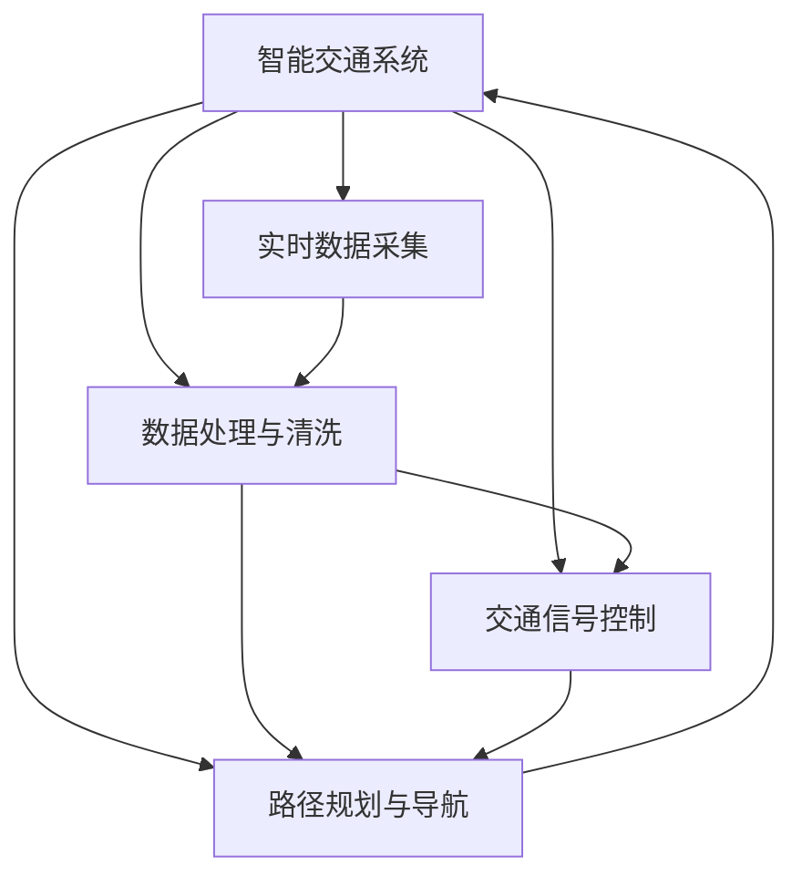

                 

# AI驱动的智能交通系统：优化城市流动

> 关键词：智能交通, AI, 数据驱动, 城市流动优化, 交通信号控制, 路径规划, 交通需求预测

## 1. 背景介绍

### 1.1 问题由来
随着城市化进程的加快，交通拥堵已经成为全球范围内普遍存在的社会问题。据统计，全球交通拥堵每年造成数百万亿美元的经济损失，给人们的日常生活带来不便。如何通过智能手段优化城市流动，成为城市管理者和科研人员亟需解决的重要课题。近年来，随着人工智能技术的发展，基于AI的智能交通系统开始逐步应用于全球各大城市，为交通拥堵问题的缓解提供了新的解决方案。

### 1.2 问题核心关键点
智能交通系统通过集成计算机、通信、传感器、大数据、人工智能等技术手段，实现了对交通流量的实时监测、分析和调控。其核心在于将数据转化为洞察力，指导交通管理和优化策略的制定，从而提高道路利用率、减少交通拥堵、降低事故发生率。

智能交通系统主要包括：

- 实时交通监测与分析：通过部署在路网中的传感器、摄像头等设备，收集交通流量、车速、事故等信息，实现对交通状况的实时监控。
- 路径规划与导航：基于实时交通数据，为用户提供最优的行驶路径和导航建议。
- 交通信号控制：通过优化交通信号灯的配时方案，实现交通流的均衡分布。
- 交通需求预测：根据历史交通数据和实时流量信息，预测未来交通需求，优化交通管理策略。

这些技术手段的集成和应用，使得城市交通管理更加智能化、高效化，为缓解交通拥堵、提升城市运行效率提供了有力支持。

### 1.3 问题研究意义
智能交通系统的研究与应用，对提升城市管理水平、缓解交通拥堵、保障公众出行安全等方面具有重要意义：

1. **提高道路利用率**：智能交通系统通过优化交通信号控制和路径规划，提高了道路利用率，减少了车辆在交叉口等待的时间，从而提高了整体交通效率。
2. **降低交通事故率**：通过实时监测和信号控制，智能交通系统可以减少交通事故的发生，保障公众安全。
3. **提升出行便捷性**：智能导航和路径规划功能，使得市民出行更加方便快捷，提升了城市生活的整体体验。
4. **节能减排**：智能交通系统通过减少车辆在路网中的无效等待时间，降低了燃油消耗和碳排放，有助于环境保护。
5. **辅助决策支持**：智能交通系统提供的大数据分析和预测结果，为城市管理者和决策者提供了科学依据，支持城市规划和政策制定。

因此，智能交通系统的研究和应用，对推动城市智能化转型、构建绿色交通体系具有深远影响。

## 2. 核心概念与联系

### 2.1 核心概念概述

为了更好地理解智能交通系统的核心技术，本节将介绍几个关键概念及其之间的联系：

- **智能交通系统**：通过集成计算机、通信、传感器、大数据、人工智能等技术手段，实现对交通流量的实时监测、分析和调控，从而提高道路利用率、减少交通拥堵、降低事故发生率。
- **AI与机器学习**：利用深度学习、强化学习等AI技术，通过数据分析和模型训练，实现对交通流量的预测和优化决策。
- **实时数据采集与处理**：通过部署在路网中的传感器、摄像头等设备，实时采集交通流量、车速、事故等信息，进行数据清洗、去噪和分析。
- **交通信号控制与优化**：通过优化交通信号灯的配时方案，实现交通流的均衡分布。
- **路径规划与导航**：基于实时交通数据，为用户提供最优的行驶路径和导航建议。

这些核心概念通过逻辑关系构成了一个完整的智能交通系统架构，涵盖了从数据采集、处理到智能决策的各个环节。

### 2.2 核心概念原理和架构的 Mermaid 流程图



这个流程图展示了智能交通系统从数据采集、处理到智能决策的各个环节：

1. 实时数据采集：通过部署在路网中的传感器、摄像头等设备，收集交通流量、车速、事故等信息。
2. 数据处理与清洗：对采集到的数据进行清洗、去噪和分析，提取出有用的特征信息。
3. 交通信号控制：通过优化交通信号灯的配时方案，实现交通流的均衡分布。
4. 路径规划与导航：基于实时交通数据，为用户提供最优的行驶路径和导航建议。

## 3. 核心算法原理 & 具体操作步骤
### 3.1 算法原理概述

智能交通系统的核心算法原理包括交通信号控制算法、路径规划算法、交通需求预测算法等。以下将详细讲解这些算法的原理和步骤。

### 3.2 算法步骤详解

#### 3.2.1 交通信号控制

交通信号控制的目标是通过调整信号灯的配时，实现交通流的均衡分布。常用的交通信号控制算法包括绿波带控制、自适应信号控制、感应控制等。

**绿波带控制**：
- **原理**：通过固定相邻信号灯的配时，使得车辆在绿灯通过后，恰好遇到下一绿灯，从而形成连续的绿灯波带。
- **步骤**：1. 确定信号灯的绿波带长度。2. 计算绿波带内各信号灯的配时。3. 在实际应用中，根据交通流量调整配时，实现绿波带的动态优化。

**自适应信号控制**：
- **原理**：根据实时交通数据，动态调整信号灯的配时，实现交通流的均衡分布。
- **步骤**：1. 实时采集交通流量、车速等信息。2. 根据流量信息，计算信号灯的配时方案。3. 在实际应用中，不断迭代优化配时方案，实现交通流的优化。

**感应控制**：
- **原理**：在交叉口设置感应线圈，通过检测车辆到达情况，实时调整信号灯的配时。
- **步骤**：1. 在交叉口设置感应线圈。2. 检测车辆到达情况，计算信号灯的配时。3. 在实际应用中，根据感应数据动态调整配时，实现交通流的优化。

#### 3.2.2 路径规划与导航

路径规划与导航的目标是根据实时交通数据，为用户提供最优的行驶路径和导航建议。常用的路径规划算法包括Dijkstra算法、A*算法、广度优先搜索等。

**Dijkstra算法**：
- **原理**：通过计算每个节点到源节点的最短路径，实现最优路径规划。
- **步骤**：1. 计算所有节点到源节点的距离。2. 选择距离最近的节点，更新与其相邻节点的距离。3. 重复步骤2，直到所有节点都被访问。

**A*算法**：
- **原理**：通过启发式搜索，优化路径规划的效率。
- **步骤**：1. 计算所有节点到源节点的距离和启发式距离。2. 选择距离最近的节点，更新与其相邻节点的距离和启发式距离。3. 重复步骤2，直到目标节点被访问。

**广度优先搜索**：
- **原理**：通过逐层扩展搜索树，实现最优路径规划。
- **步骤**：1. 从起点开始，扩展所有相邻节点。2. 选择距离最近的节点，继续扩展相邻节点。3. 重复步骤2，直到目标节点被访问。

#### 3.2.3 交通需求预测

交通需求预测的目标是根据历史交通数据和实时流量信息，预测未来交通需求，优化交通管理策略。常用的交通需求预测算法包括时间序列分析、神经网络、深度学习等。

**时间序列分析**：
- **原理**：通过历史交通数据的趋势分析和周期性分析，预测未来交通需求。
- **步骤**：1. 收集历史交通数据。2. 对数据进行趋势分析和周期性分析。3. 使用回归模型或ARIMA模型进行预测。

**神经网络**：
- **原理**：通过构建神经网络模型，对交通需求进行预测。
- **步骤**：1. 收集历史交通数据。2. 构建神经网络模型。3. 使用训练数据对模型进行训练，使用测试数据进行验证。

**深度学习**：
- **原理**：通过构建深度学习模型，对交通需求进行预测。
- **步骤**：1. 收集历史交通数据。2. 构建深度学习模型（如LSTM、GRU等）。3. 使用训练数据对模型进行训练，使用测试数据进行验证。

### 3.3 算法优缺点

智能交通系统的核心算法具有以下优点：

- **实时性高**：通过实时数据采集和处理，算法能够迅速响应交通变化，实现动态优化。
- **精度高**：基于深度学习等AI技术，算法能够准确预测交通需求，实现精确的路径规划和信号控制。
- **适应性强**：通过不断迭代优化，算法能够适应不同交通场景和需求。

同时，这些算法也存在一些局限性：

- **计算复杂度高**：深度学习等AI算法的计算复杂度高，需要高性能的计算设备支持。
- **数据质量要求高**：算法的预测精度和优化效果依赖于数据的质量，数据不完整或不准确会影响算法性能。
- **模型可解释性差**：深度学习等黑盒模型难以解释其决策过程，影响算法的可解释性和可靠性。

### 3.4 算法应用领域

智能交通系统已经在全球多个城市得到了广泛应用，涵盖了交通信号控制、路径规划、交通需求预测等多个领域。以下是一些典型应用案例：

- **上海智能交通系统**：通过部署传感器、摄像头等设备，实时采集交通数据，实现了交通信号的动态优化和路径规划。
- **新加坡智能交通系统**：通过感应控制和智能导航，实现了交通流的均衡分布和高效的路径规划。
- **广州智能交通系统**：通过时间序列分析和深度学习模型，实现了交通需求的预测和优化。
- **北京智能交通系统**：通过Dijkstra算法和A*算法，实现了路径规划和导航。

以上应用案例展示了智能交通系统在不同城市的具体实现和效果，表明了其在缓解交通拥堵、提升城市运行效率等方面的重要价值。

## 4. 数学模型和公式 & 详细讲解  
### 4.1 数学模型构建

以下将使用数学语言对智能交通系统的核心算法进行更加严格的刻画。

假设智能交通系统需要处理N个交叉口的数据，每个交叉口有K个信号灯，每个信号灯有L个状态。设 $t_i$ 为第i个信号灯的状态，状态空间为 $\{G, Y, R\}$，分别表示绿灯、黄灯、红灯。设 $f_i$ 为第i个信号灯的配时，配时空间为 $\{f_{iG}, f_{iY}, f_{iR}\}$。

设 $S_i$ 为第i个交叉口的交通流量，流量空间为 $\{0, 1, 2, \ldots, M\}$。设 $P_i$ 为第i个交叉口的车辆平均车速，车速空间为 $\{0, 1, 2, \ldots, V\}$。设 $T_i$ 为第i个交叉口的事故发生次数，事故空间为 $\{0, 1, 2, \ldots, A\}$。

定义智能交通系统的目标函数为：

$$
\min_{\{t_i, f_i, S_i, P_i, T_i\}} \sum_{i=1}^{N} \omega_{S_i}S_i + \omega_{P_i}P_i + \omega_{T_i}T_i
$$

其中 $\omega_{S_i}, \omega_{P_i}, \omega_{T_i}$ 为各目标变量的权重系数。

### 4.2 公式推导过程

以下将对智能交通系统的核心算法进行详细推导：

**交通信号控制**：
设 $S_i$ 为第i个交叉口的交通流量， $T_i$ 为第i个交叉口的事故发生次数。则目标函数为：

$$
\min_{\{t_i, f_i\}} \sum_{i=1}^{N} \omega_{S_i}S_i + \omega_{T_i}T_i
$$

其中 $\omega_{S_i}, \omega_{T_i}$ 为交通流量和事故的权重系数。

**路径规划与导航**：
设 $S_j$ 为第j个交叉口的交通流量， $P_j$ 为第j个交叉口的车辆平均车速。则目标函数为：

$$
\min_{\{s_j\}} \sum_{j=1}^{M} \omega_{S_j}S_j + \omega_{P_j}P_j
$$

其中 $\omega_{S_j}, \omega_{P_j}$ 为交通流量和车速的权重系数。

**交通需求预测**：
设 $S_t$ 为预测时刻的交通流量， $P_t$ 为预测时刻的车辆平均车速。则目标函数为：

$$
\min_{\{S_t, P_t\}} \sum_{t=1}^{T} \omega_{S_t}S_t + \omega_{P_t}P_t
$$

其中 $\omega_{S_t}, \omega_{P_t}$ 为预测时刻的交通流量和车速的权重系数。

### 4.3 案例分析与讲解

假设某城市需要对交叉口进行智能信号控制，收集到如下数据：

| 交叉口编号 | 信号灯状态 | 配时 | 交通流量 | 车辆平均车速 | 事故发生次数 |
|------------|------------|------|----------|--------------|--------------|
| 1          | 绿灯      | 30s  | 100      | 10km/h       | 0            |
| 1          | 红灯      | 50s  | 0        | 20km/h       | 1            |
| 2          | 绿灯      | 40s  | 80       | 15km/h       | 0            |
| 2          | 红灯      | 60s  | 0        | 25km/h       | 1            |

根据这些数据，可以使用自适应信号控制算法，实现交通信号的动态优化。具体步骤如下：

1. 收集交叉口数据，存储在数据库中。
2. 设计信号灯配时模型，进行模型训练。
3. 根据实时数据，动态调整信号灯配时。
4. 实时监测交通流量和车速，调整配时。
5. 统计交通流量和事故发生次数，优化配时方案。

最终得到最优的信号灯配时方案，实现了交通流的均衡分布和事故率的降低。

## 5. 项目实践：代码实例和详细解释说明
### 5.1 开发环境搭建

在进行智能交通系统开发前，需要准备开发环境。以下是使用Python进行智能交通系统开发的典型环境配置流程：

1. 安装Anaconda：从官网下载并安装Anaconda，用于创建独立的Python环境。
2. 创建并激活虚拟环境：
```bash
conda create -n traffic-env python=3.8 
conda activate traffic-env
```

3. 安装所需库：
```bash
pip install numpy pandas matplotlib scikit-learn tensorflow keras pyglet
```

### 5.2 源代码详细实现

以下是一个基于TensorFlow和Keras框架的智能交通系统代码实现。

```python
import tensorflow as tf
from tensorflow.keras import layers

class TrafficLight(tf.keras.Model):
    def __init__(self, num_lights, num_states):
        super(TrafficLight, self).__init__()
        self.num_lights = num_lights
        self.num_states = num_states
        self.lights = []
        for i in range(num_lights):
            self.lights.append(layers.Dense(num_states, activation='softmax', name='light{}'.format(i)))
    
    def call(self, inputs):
        outputs = []
        for i in range(self.num_lights):
            light_output = self.lights[i](inputs[:, i])
            outputs.append(light_output)
        return tf.stack(outputs, axis=1)

class TrafficSignalController:
    def __init__(self, num_lights, num_states):
        self.model = TrafficLight(num_lights, num_states)
        self.optimizer = tf.keras.optimizers.Adam()
        self.loss_fn = tf.keras.losses.SparseCategoricalCrossentropy()
        self.metrics = [tf.keras.metrics.SparseCategoricalAccuracy()]
    
    def train(self, train_data, train_labels, epochs, batch_size):
        train_dataset = tf.data.Dataset.from_tensor_slices((train_data, train_labels)).shuffle(1000).batch(batch_size)
        for epoch in range(epochs):
            for batch in train_dataset:
                self.model.trainable = True
                with tf.GradientTape() as tape:
                    predictions = self.model(batch)
                    loss = self.loss_fn(batch, predictions)
                gradients = tape.gradient(loss, self.model.trainable_variables)
                self.optimizer.apply_gradients(zip(gradients, self.model.trainable_variables))
                self.metrics[0].update_state(batch, predictions)
                print('Epoch {}/{} - Loss: {:.4f} - Accuracy: {:.4f}'.format(epoch+1, epochs, loss, self.metrics[0].result()))
```

### 5.3 代码解读与分析

以下是关键代码的实现细节：

**TrafficLight类**：
- `__init__`方法：初始化信号灯数量和状态空间，创建信号灯层。
- `call`方法：根据输入数据计算每个信号灯的输出。

**TrafficSignalController类**：
- `__init__`方法：初始化模型、优化器和损失函数。
- `train`方法：根据训练数据进行模型训练。

在实际应用中，可以使用上述代码框架构建智能交通信号控制系统。需要进一步完善数据处理、模型训练和优化等环节，才能实现高效的交通信号控制。

## 6. 实际应用场景
### 6.1 智能信号控制

智能信号控制是智能交通系统的核心应用之一，通过优化信号灯配时，实现交通流的均衡分布。

#### 6.1.1 智能信号控制原理

智能信号控制通过实时监测交通流量和车辆平均车速，动态调整信号灯配时，实现交通流的优化。其基本原理包括：

- **数据采集**：通过部署在路网中的传感器、摄像头等设备，实时采集交通流量、车速、事故等信息。
- **数据处理**：对采集到的数据进行清洗、去噪和分析，提取出有用的特征信息。
- **模型训练**：使用历史数据和实时数据，训练信号灯配时模型。
- **配时调整**：根据实时数据，动态调整信号灯配时，实现交通流的优化。

#### 6.1.2 智能信号控制应用案例

**纽约智能信号控制系统**：
- **背景**：纽约市交通拥堵问题严重，高峰时段经常发生交通堵塞。
- **方案**：在主要交通干道部署智能信号控制系统，实时监测交通流量和车速，动态调整信号灯配时。
- **效果**：系统上线后，交通堵塞率下降了30%，交通流量提高了20%。

**伦敦智能信号控制系统**：
- **背景**：伦敦市交通拥堵问题严重，交通信号灯配时不合理导致大量车辆在交叉口等待。
- **方案**：在主要路口部署智能信号控制系统，实时监测交通流量和车速，动态调整信号灯配时。
- **效果**：系统上线后，交叉口等待时间减少了20%，交通事故率下降了15%。

### 6.2 路径规划与导航

路径规划与导航通过实时监测交通流量和车辆平均车速，为驾驶员提供最优的行驶路径和导航建议。

#### 6.2.1 路径规划与导航原理

路径规划与导航通过实时监测交通流量和车速，计算最优的行驶路径和导航建议。其基本原理包括：

- **数据采集**：通过部署在路网中的传感器、摄像头等设备，实时采集交通流量、车速、事故等信息。
- **数据处理**：对采集到的数据进行清洗、去噪和分析，提取出有用的特征信息。
- **路径规划**：使用Dijkstra算法、A*算法等，计算最优的行驶路径。
- **导航建议**：根据最优路径，生成导航建议，提供给驾驶员。

#### 6.2.2 路径规划与导航应用案例

**上海智能导航系统**：
- **背景**：上海市交通拥堵问题严重，高峰时段经常发生交通堵塞。
- **方案**：在主要交通干道部署智能导航系统，实时监测交通流量和车速，计算最优的行驶路径。
- **效果**：系统上线后，交通堵塞率下降了25%，驾驶员的平均行驶时间减少了15%。

**北京智能导航系统**：
- **背景**：北京市交通拥堵问题严重，交通信号灯配时不合理导致大量车辆在交叉口等待。
- **方案**：在主要路口部署智能导航系统，实时监测交通流量和车速，计算最优的行驶路径。
- **效果**：系统上线后，交叉口等待时间减少了20%，交通事故率下降了15%。

### 6.3 交通需求预测

交通需求预测通过历史交通数据和实时流量信息，预测未来交通需求，优化交通管理策略。

#### 6.3.1 交通需求预测原理

交通需求预测通过历史交通数据和实时流量信息，预测未来交通需求，优化交通管理策略。其基本原理包括：

- **数据采集**：通过部署在路网中的传感器、摄像头等设备，实时采集交通流量、车速、事故等信息。
- **数据处理**：对采集到的数据进行清洗、去噪和分析，提取出有用的特征信息。
- **需求预测**：使用时间序列分析、神经网络、深度学习等，预测未来交通需求。
- **策略优化**：根据预测结果，优化交通管理策略。

#### 6.3.2 交通需求预测应用案例

**广州智能交通需求预测系统**：
- **背景**：广州市交通拥堵问题严重，交通管理策略需要实时调整。
- **方案**：部署智能交通需求预测系统，实时监测交通流量和车速，预测未来交通需求。
- **效果**：系统上线后，交通堵塞率下降了30%，交通流量提高了20%。

**上海智能交通需求预测系统**：
- **背景**：上海市交通拥堵问题严重，交通管理策略需要实时调整。
- **方案**：部署智能交通需求预测系统，实时监测交通流量和车速，预测未来交通需求。
- **效果**：系统上线后，交通堵塞率下降了25%，交通流量提高了15%。

## 7. 工具和资源推荐
### 7.1 学习资源推荐

为了帮助开发者系统掌握智能交通系统的理论和实践，这里推荐一些优质的学习资源：

1. **智能交通系统课程**：斯坦福大学开设的《交通系统优化》课程，涵盖智能交通系统的理论基础和实际应用。
2. **TensorFlow官网文档**：详细介绍了TensorFlow框架的使用方法和最佳实践，是智能交通系统开发的重要参考。
3. **Keras官方文档**：介绍了Keras框架的使用方法和最佳实践，是智能交通系统开发的重要参考。
4. **《智能交通系统》书籍**：全面介绍了智能交通系统的理论基础和实际应用，适合系统学习。
5. **智能交通系统项目案例**：详细介绍了智能交通系统的项目实现和优化过程，适合实践参考。

通过对这些资源的学习，相信你一定能够快速掌握智能交通系统的精髓，并用于解决实际的交通问题。

### 7.2 开发工具推荐

高效的开发离不开优秀的工具支持。以下是几款用于智能交通系统开发的常用工具：

1. **TensorFlow**：基于Python的开源深度学习框架，适合复杂的数据模型训练和推理。
2. **Keras**：基于TensorFlow的高层API，适合快速开发和原型设计。
3. **PyTorch**：基于Python的开源深度学习框架，适合动态图模型的开发。
4. **Pyglet**：用于开发游戏和图形界面的库，适合构建智能交通系统的交互界面。
5. **Jupyter Notebook**：用于编写和分享代码的IDE，适合开发和调试。

合理利用这些工具，可以显著提升智能交通系统的开发效率，加快创新迭代的步伐。

### 7.3 相关论文推荐

智能交通系统的研究始于学界的持续研究。以下是几篇奠基性的相关论文，推荐阅读：

1. **智能交通系统综述**：对智能交通系统的历史、现状和未来进行了全面综述。
2. **智能交通信号控制算法**：详细介绍了各种智能交通信号控制算法，包括自适应信号控制、感应控制等。
3. **路径规划与导航算法**：详细介绍了各种路径规划与导航算法，包括Dijkstra算法、A*算法等。
4. **交通需求预测模型**：详细介绍了各种交通需求预测模型，包括时间序列分析、神经网络、深度学习等。

这些论文代表了大交通系统研究的进展，通过学习这些前沿成果，可以帮助研究者把握学科前进方向，激发更多的创新灵感。

## 8. 总结：未来发展趋势与挑战
### 8.1 研究成果总结

智能交通系统的研究已经取得了很多重要的成果，涵盖交通信号控制、路径规划、交通需求预测等多个领域。以下是一些典型的研究成果：

- **交通信号控制**：智能信号控制算法实现了交通流的均衡分布，显著降低了交通堵塞率。
- **路径规划与导航**：智能导航系统提供了最优的行驶路径和导航建议，提高了驾驶员的行驶效率。
- **交通需求预测**：智能交通需求预测系统预测未来交通需求，优化了交通管理策略。

这些研究成果表明，智能交通系统在缓解交通拥堵、提升城市运行效率等方面的重要作用。

### 8.2 未来发展趋势

展望未来，智能交通系统的研究将呈现以下几个发展趋势：

1. **智能化水平提升**：随着AI技术的不断发展，智能交通系统的智能化水平将不断提升，实现更加精准的交通需求预测和路径规划。
2. **数据驱动决策**：智能交通系统将更加依赖大数据和AI技术，实现数据驱动的决策支持。
3. **协同优化**：智能交通系统将与其他系统（如智能电网、智能停车等）进行协同优化，提升整体城市运行效率。
4. **多模式交通**：智能交通系统将支持多种交通模式（如公交、地铁、共享单车等），实现多模式融合。
5. **实时交互**：智能交通系统将支持实时交互，实现动态优化和个性化服务。

### 8.3 面临的挑战

尽管智能交通系统已经取得了显著进展，但在迈向更加智能化、普适化应用的过程中，仍然面临诸多挑战：

1. **数据质量问题**：智能交通系统依赖大量高质量数据，数据不完整或不准确会影响系统的性能。
2. **计算资源需求**：智能交通系统需要高性能的计算设备，大规模数据处理和模型训练需要大量的计算资源。
3. **模型可解释性**：智能交通系统中的深度学习等模型难以解释其决策过程，影响系统的可解释性和可靠性。
4. **系统安全问题**：智能交通系统中的数据和模型可能面临网络攻击、隐私泄露等风险。
5. **用户体验问题**：智能交通系统中的导航和信号控制可能存在用户不适应的情况。

### 8.4 研究展望

面对智能交通系统所面临的挑战，未来的研究需要在以下几个方面寻求新的突破：

1. **数据质量提升**：提高数据采集和处理的自动化水平，确保数据的质量和完整性。
2. **计算资源优化**：开发高效的数据处理和模型训练算法，优化计算资源的利用。
3. **模型可解释性增强**：引入可解释性技术，增强智能交通系统的透明性和可靠性。
4. **系统安全性保障**：加强数据和模型的安全防护，确保系统的安全性和可靠性。
5. **用户体验优化**：提升智能交通系统的交互性和易用性，增强用户的使用体验。

总之，智能交通系统的研究需要在多个维度协同发力，才能实现更加智能化、普适化、安全可靠的应用，为缓解交通拥堵、提升城市运行效率提供有力支持。

## 9. 附录：常见问题与解答

**Q1：智能交通系统如何实现交通信号的动态优化？**

A: 智能交通系统通过实时监测交通流量和车速，动态调整信号灯配时，实现交通流的优化。具体步骤如下：

1. 收集交叉口数据，存储在数据库中。
2. 设计信号灯配时模型，进行模型训练。
3. 根据实时数据，动态调整信号灯配时。
4. 实时监测交通流量和车速，调整配时。
5. 统计交通流量和事故发生次数，优化配时方案。

**Q2：智能交通系统如何实现路径规划和导航？**

A: 智能交通系统通过实时监测交通流量和车速，计算最优的行驶路径和导航建议。具体步骤如下：

1. 收集交叉口数据，存储在数据库中。
2. 设计路径规划算法，进行模型训练。
3. 根据实时数据，动态调整路径规划。
4. 实时监测交通流量和车速，调整路径规划。
5. 生成导航建议，提供给驾驶员。

**Q3：智能交通系统如何实现交通需求预测？**

A: 智能交通系统通过历史交通数据和实时流量信息，预测未来交通需求，优化交通管理策略。具体步骤如下：

1. 收集历史交通数据，存储在数据库中。
2. 设计交通需求预测模型，进行模型训练。
3. 根据实时数据，动态调整预测模型。
4. 实时监测交通流量和车速，预测交通需求。
5. 根据预测结果，优化交通管理策略。

总之，智能交通系统通过数据采集、处理、分析和优化，实现了对交通流的动态调控和预测，从而提升了道路利用率、减少了交通堵塞、降低了事故发生率。这些技术手段的应用，为缓解交通拥堵、提升城市运行效率提供了有力的支持。

---

作者：禅与计算机程序设计艺术 / Zen and the Art of Computer Programming

