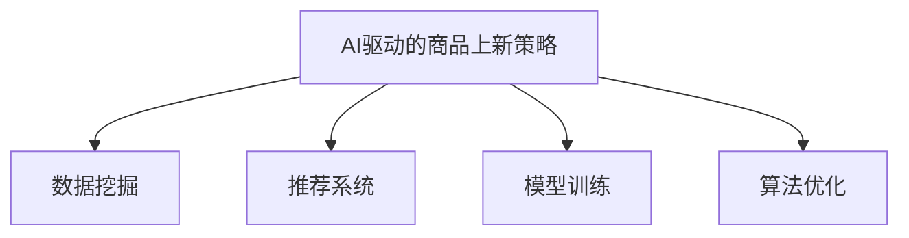

                 

# AI驱动的电商平台商品上新策略

> 关键词：AI驱动、电商平台、商品上新、数据挖掘、推荐系统、模型训练、算法优化、应用实践

## 1. 背景介绍

### 1.1 问题由来

随着互联网的迅猛发展，电商平台已经从传统的“搜索-展示-购买”模式，逐步向“推荐-展示-购买”模式转变。大数据、人工智能等技术的普及，使得电商平台在商品推荐、广告投放、市场分析等方面实现了智能化升级，吸引了更多消费者的注意力，并大幅提升了销售转化率。而商品上新作为电商平台的重要环节，其策略的选择对电商平台的用户体验、购买转化率、库存管理等方面有着深远的影响。

商品上新策略的有效性取决于其对市场趋势、用户需求、库存管理等多方面因素的综合把握。传统上，商品上新策略主要依赖人工经验，往往存在决策主观性强、速度慢、响应不及时等问题。因此，借助人工智能技术，特别是机器学习、深度学习等算法，能够更加科学、高效地制定商品上新策略。

### 1.2 问题核心关键点

商品上新策略的核心在于如何根据历史数据和实时数据，预测未来的用户需求，从而制定合理的商品上新计划。具体来说，包括以下几个关键点：

- **用户需求预测**：预测用户对特定商品的需求量，如点击率、购买量等。
- **市场趋势分析**：分析商品的市场热度、季节性等趋势，辅助决策。
- **库存管理优化**：结合库存量、成本等因素，优化商品上架时机。
- **个性化推荐**：针对不同用户群体，提供个性化的商品推荐，提高用户满意度。

## 2. 核心概念与联系

### 2.1 核心概念概述

为更好地理解AI驱动的商品上新策略，本节将介绍几个密切相关的核心概念：

- **AI驱动的商品上新策略**：基于大数据和机器学习算法，自动化地预测用户需求、优化商品上架时机，提升电商平台的运营效率。
- **数据挖掘**：从海量数据中提取有用信息和知识，辅助商品上新策略的制定。
- **推荐系统**：利用用户行为数据，推荐用户可能感兴趣的商品。
- **模型训练**：通过历史数据训练预测模型，辅助商品上新策略的制定。
- **算法优化**：通过调参、优化算法等手段，提升商品上新策略的效果。

这些核心概念之间的逻辑关系可以通过以下Mermaid流程图来展示：



这个流程图展示了大语言模型的核心概念及其之间的关系：

1. AI驱动的商品上新策略通过数据挖掘、推荐系统和模型训练，从多维度获取数据支持，制定科学合理的商品上新策略。
2. 算法优化则进一步提升策略的准确性和效率。

## 3. 核心算法原理 & 具体操作步骤
### 3.1 算法原理概述

AI驱动的商品上新策略本质上是一个综合运用大数据、机器学习、深度学习等技术的决策过程。其核心思想是：通过历史数据和实时数据，构建预测模型，自动分析市场趋势、用户需求等关键因素，制定科学合理的商品上新计划。

具体而言，步骤如下：

1. **数据采集与预处理**：收集电商平台的历史交易数据、用户行为数据、市场趋势数据等，进行清洗和预处理。
2. **特征提取与选择**：从数据中提取有用的特征，如用户购买行为、商品价格、季节性变化等，并选择最相关的特征。
3. **模型训练与优化**：使用机器学习或深度学习模型（如线性回归、随机森林、神经网络等），训练预测模型，并对模型进行优化，以提高预测准确性和效率。
4. **策略制定与实施**：根据预测结果，制定商品上新计划，并在电商平台上实施。

### 3.2 算法步骤详解

以下是AI驱动的商品上新策略的具体操作步骤：

**Step 1: 数据采集与预处理**

1. **收集数据**：从电商平台的交易记录、用户行为日志、市场分析报告等渠道，获取历史数据和实时数据。
2. **数据清洗**：对数据进行去重、去噪、处理缺失值等操作，确保数据质量。
3. **数据集成**：将不同来源的数据进行集成，形成统一的数据集。

**Step 2: 特征提取与选择**

1. **特征工程**：提取与商品上新相关的特征，如用户购买频率、用户评价、商品类别、季节性等。
2. **特征选择**：使用特征选择算法（如卡方检验、信息增益等）选择最相关的特征，减少噪音干扰。

**Step 3: 模型训练与优化**

1. **模型选择**：根据问题的特性选择合适的预测模型，如线性回归、随机森林、深度神经网络等。
2. **模型训练**：使用历史数据训练预测模型，并通过交叉验证等技术进行调参优化。
3. **模型评估**：使用测试集评估模型预测性能，根据评估结果调整模型参数或选择其他模型。

**Step 4: 策略制定与实施**

1. **策略制定**：根据模型预测结果，制定商品上新计划，考虑库存、成本、用户需求等因素，进行综合评估。
2. **实施上新**：在电商平台上实施商品上新计划，监控上新效果，根据实时数据进行反馈调整。

### 3.3 算法优缺点

AI驱动的商品上新策略具有以下优点：

1. **决策科学化**：通过数据驱动，自动分析和预测市场趋势、用户需求等，提升决策的科学性和准确性。
2. **响应迅速**：能够实时分析数据，快速制定和实施上新策略，提高运营效率。
3. **成本低廉**：相比传统的人工经验方法，使用AI驱动策略可以减少人力成本。

同时，该策略也存在以下局限性：

1. **数据依赖**：模型的效果依赖于数据的质量和量，需要大量的高质量数据支持。
2. **复杂度高**：构建和优化预测模型需要较高的技术水平和资源投入。
3. **解释性差**：AI驱动策略的预测结果通常是黑箱模型，难以解释其内部工作机制。
4. **鲁棒性不足**：模型容易受到异常数据的影响，对异常情况的适应性有待提高。

尽管存在这些局限性，但就目前而言，AI驱动的商品上新策略仍是电商运营的重要手段。未来相关研究的重点在于如何进一步降低对数据的依赖，提高模型的可解释性和鲁棒性。

### 3.4 算法应用领域

AI驱动的商品上新策略已经在电商平台的多个环节得到应用，例如：

- **商品推荐**：通过分析用户行为数据，预测用户需求，推荐可能感兴趣的商品，提高用户满意度和购买率。
- **库存管理**：结合预测结果和实时库存信息，优化商品上架时机，减少库存积压和缺货现象。
- **市场分析**：利用市场趋势数据，预测未来市场变化，调整商品上新策略，提升市场响应速度。
- **个性化定价**：根据用户特征和需求，动态调整商品价格，提高销售转化率。

此外，AI驱动的商品上新策略还应用于智能客服、广告投放、品牌管理等环节，为电商平台的智能化运营提供了有力支持。

## 4. 数学模型和公式 & 详细讲解 & 举例说明

### 4.1 数学模型构建

在本节中，我们将以预测商品销售量为例子，构建预测模型。假设销售量 $y$ 由特征 $x_1, x_2, \ldots, x_n$ 决定，则线性回归模型为：

$$
y = \beta_0 + \beta_1 x_1 + \beta_2 x_2 + \ldots + \beta_n x_n + \epsilon
$$

其中 $\beta_0, \beta_1, \ldots, \beta_n$ 为回归系数，$\epsilon$ 为随机误差。

### 4.2 公式推导过程

1. **数据准备**：将销售量 $y$ 和特征 $x_1, x_2, \ldots, x_n$ 组成训练集 $\mathcal{D}=\{(y_i, x_i)\}_{i=1}^N$。
2. **模型训练**：使用最小二乘法求解回归系数 $\beta$，即 $\hat{\beta} = (X^TX)^{-1}X^Ty$，其中 $X = [x_1, x_2, \ldots, x_n]$。
3. **预测和评估**：使用训练好的模型对新数据 $x_{new}$ 进行预测，并使用均方误差等指标评估模型性能。

### 4.3 案例分析与讲解

以一家电商平台的季度销售预测为例：

1. **数据采集**：收集平台各季度商品的销售量、用户点击量、价格、促销活动等信息，并清洗数据。
2. **特征选择**：选择与销售量相关的特征，如价格、促销活动、用户点击量等。
3. **模型训练**：使用历史数据训练线性回归模型，并根据交叉验证结果调整回归系数。
4. **策略制定**：根据预测结果，制定新商品的引入计划，如选择季度末进行上新，减少季节性波动对销售的影响。

## 5. 项目实践：代码实例和详细解释说明

### 5.1 开发环境搭建

在进行商品上新策略的开发实践前，我们需要准备好开发环境。以下是使用Python进行Scikit-learn和TensorFlow开发的环境配置流程：

1. 安装Anaconda：从官网下载并安装Anaconda，用于创建独立的Python环境。
2. 创建并激活虚拟环境：
```bash
conda create -n py3k python=3.8 
conda activate py3k
```

3. 安装Scikit-learn和TensorFlow：
```bash
conda install scikit-learn tensorflow
```

4. 安装各类工具包：
```bash
pip install numpy pandas scikit-learn matplotlib tqdm jupyter notebook ipython
```

完成上述步骤后，即可在`py3k`环境中开始商品上新策略的开发实践。

### 5.2 源代码详细实现

以下是使用Scikit-learn和TensorFlow进行线性回归模型训练的Python代码实现：

```python
from sklearn.linear_model import LinearRegression
import pandas as pd
import numpy as np
import matplotlib.pyplot as plt

# 加载数据集
data = pd.read_csv('sales_data.csv')
X = data[['price', 'promo', 'clicks']]
y = data['sales']

# 分割数据集
from sklearn.model_selection import train_test_split
X_train, X_test, y_train, y_test = train_test_split(X, y, test_size=0.2, random_state=42)

# 构建模型并训练
model = LinearRegression()
model.fit(X_train, y_train)

# 预测新数据
new_data = np.array([[5.0, 1, 10000]])
pred = model.predict(new_data)

# 输出结果
print('预测销售量：', pred)
```

### 5.3 代码解读与分析

让我们再详细解读一下关键代码的实现细节：

**数据加载**：
- `pd.read_csv('sales_data.csv')`：使用Pandas库加载销售数据，并将其转换为DataFrame格式。
- `X = data[['price', 'promo', 'clicks']]`：选择价格、促销活动、点击量作为特征。
- `y = data['sales']`：选择销售量作为目标变量。

**数据分割**：
- `train_test_split`：将数据集分为训练集和测试集，比例为80:20。

**模型训练**：
- `LinearRegression()`：使用Scikit-learn库的线性回归模型。
- `model.fit(X_train, y_train)`：在训练集上训练模型。

**预测新数据**：
- `new_data = np.array([[5.0, 1, 10000]])`：构造新的测试样本，其中价格为5元，促销活动为1，点击量为10000。
- `pred = model.predict(new_data)`：使用训练好的模型对新数据进行预测，并返回预测结果。

**结果输出**：
- `print('预测销售量：', pred)`：输出预测结果。

可以看到，上述代码通过Scikit-learn库实现了简单的线性回归模型训练和预测，能够帮助开发者快速理解模型构建和预测的基本流程。

## 6. 实际应用场景

### 6.1 电商平台商品推荐

商品上新策略的核心之一是预测用户需求，提供个性化的商品推荐。通过分析用户的历史购买行为、浏览记录、评价等数据，构建推荐模型，实现用户个性化推荐。

**场景示例**：用户A经常浏览运动鞋类商品，对其进行了一些高评价的评论。基于这些数据，推荐系统可以预测用户A对某新款运动鞋的需求，并将其推荐到用户A的页面上，提高转化率。

### 6.2 库存管理优化

商品上新策略还需要结合库存管理进行优化。通过分析库存水平、历史销售数据等，预测未来商品的需求量，及时补充库存，避免缺货或积压。

**场景示例**：平台发现某款商品库存量低于安全库存，预测其未来销售量将增加，于是提前采购，确保商品上架时间正好在促销活动期间，避免断货。

### 6.3 市场趋势分析

市场趋势分析是商品上新策略的重要组成部分。通过分析季节性、节假日等市场变化，调整商品上新计划，提升市场响应速度。

**场景示例**：平台通过分析近期的天气预报，预测将迎来降温天气，提前在平台上引入冬季服装，提高销售量。

### 6.4 未来应用展望

伴随AI技术的不断进步，商品上新策略将进一步智能化、个性化。未来可能的发展方向包括：

1. **深度学习模型**：使用神经网络模型替代线性回归，提高预测精度。
2. **时间序列分析**：结合时间序列模型（如ARIMA、LSTM等），提高市场趋势预测的准确性。
3. **多模态融合**：结合用户评论、社交媒体等非结构化数据，提高模型鲁棒性和可解释性。
4. **联邦学习**：保护用户隐私，在多终端设备上分布式训练模型，提高预测精度和效率。
5. **自适应学习**：实时更新模型参数，适应市场变化，提升预测效果。

这些方向的探索，将进一步提升商品上新策略的效果，为电商平台的运营带来更大的价值。

## 7. 工具和资源推荐

### 7.1 学习资源推荐

为了帮助开发者系统掌握商品上新策略的理论基础和实践技巧，这里推荐一些优质的学习资源：

1. **《机器学习实战》**：该书介绍了机器学习的基本概念和算法，并通过实例演示了如何在Python中实现这些算法，适合初学者。
2. **《Python深度学习》**：由Google深度学习专家撰写，详细介绍了深度学习的基础知识和应用，包括TensorFlow等工具的使用。
3. **《统计学习方法》**：该书是机器学习领域的经典教材，深入讲解了各种统计学习方法和算法。
4. **《Python数据科学手册》**：该书结合了数据科学和机器学习的基本概念，提供了丰富的示例代码，适合快速上手。

通过对这些资源的学习实践，相信你一定能够快速掌握商品上新策略的精髓，并用于解决实际的电商问题。

### 7.2 开发工具推荐

高效的开发离不开优秀的工具支持。以下是几款用于商品上新策略开发的常用工具：

1. **Scikit-learn**：基于Python的开源机器学习库，提供了丰富的机器学习算法和工具，适合快速开发模型。
2. **TensorFlow**：由Google主导开发的深度学习框架，提供了强大的计算能力和丰富的模型库。
3. **Keras**：基于TensorFlow等深度学习框架的高级API，提供了简单易用的接口，适合快速搭建模型。
4. **Jupyter Notebook**：交互式的数据科学和机器学习开发工具，支持多种编程语言，适合共享和协作开发。
5. **PyTorch**：Facebook开发的深度学习框架，支持动态计算图和高效的模型训练。

合理利用这些工具，可以显著提升商品上新策略的开发效率，加快创新迭代的步伐。

### 7.3 相关论文推荐

商品上新策略的研究源于学界的持续研究。以下是几篇奠基性的相关论文，推荐阅读：

1. **《基于时间序列分析的商品销售预测》**：该论文提出使用ARIMA模型对商品销售进行预测，适用于短期销售预测。
2. **《深度学习在电商平台中的应用》**：该论文介绍了深度学习在电商平台的多个应用场景，包括推荐系统、情感分析、个性化定价等。
3. **《自适应学习在电商平台中的应用》**：该论文探讨了自适应学习在商品推荐和市场分析中的应用，提高了电商平台的实时响应能力。
4. **《联邦学习在电商平台中的应用》**：该论文介绍了联邦学习在保护用户隐私的前提下，分布式训练电商推荐模型的技术方案。

这些论文代表了大语言模型微调技术的发展脉络。通过学习这些前沿成果，可以帮助研究者把握学科前进方向，激发更多的创新灵感。

## 8. 总结：未来发展趋势与挑战

### 8.1 总结

本文对AI驱动的商品上新策略进行了全面系统的介绍。首先阐述了商品上新策略的背景和意义，明确了其对电商平台运营效率的重要作用。其次，从原理到实践，详细讲解了商品上新策略的数学原理和关键步骤，给出了商品上新策略开发的完整代码实例。同时，本文还广泛探讨了商品上新策略在推荐系统、库存管理、市场趋势分析等多个环节的应用前景，展示了AI驱动策略的巨大潜力。此外，本文精选了商品上新策略的学习资源，力求为读者提供全方位的技术指引。

通过本文的系统梳理，可以看到，AI驱动的商品上新策略已经在电商平台的多个环节得到应用，为电商平台带来了显著的运营效率提升。未来，伴随AI技术的不断进步，商品上新策略将进一步智能化、个性化，为电商平台的智能化运营提供更强大的支持。

### 8.2 未来发展趋势

展望未来，商品上新策略将呈现以下几个发展趋势：

1. **深度学习模型**：使用深度学习模型替代传统算法，提高预测精度和鲁棒性。
2. **多模态融合**：结合用户评论、社交媒体等非结构化数据，提高模型鲁棒性和可解释性。
3. **实时学习**：结合实时数据，实时更新模型参数，提高市场响应速度和预测精度。
4. **联邦学习**：保护用户隐私，在多终端设备上分布式训练模型，提高预测精度和效率。
5. **自适应学习**：实时调整模型参数，适应市场变化，提升预测效果。

这些趋势将进一步提升商品上新策略的效果，为电商平台的运营带来更大的价值。

### 8.3 面临的挑战

尽管商品上新策略已经取得了显著的效果，但在迈向更加智能化、普适化应用的过程中，它仍面临着诸多挑战：

1. **数据依赖**：模型的效果依赖于数据的质量和量，需要大量的高质量数据支持。
2. **模型复杂性**：构建和优化预测模型需要较高的技术水平和资源投入。
3. **可解释性差**：AI驱动策略的预测结果通常是黑箱模型，难以解释其内部工作机制。
4. **鲁棒性不足**：模型容易受到异常数据的影响，对异常情况的适应性有待提高。

尽管存在这些挑战，但AI驱动的商品上新策略仍然是电商运营的重要手段。未来研究需要在降低数据依赖、提高模型可解释性和鲁棒性等方面寻求新的突破。

### 8.4 研究展望

面对商品上新策略所面临的种种挑战，未来的研究需要在以下几个方面寻求新的突破：

1. **无监督和半监督学习**：摆脱对大规模标注数据的依赖，利用自监督学习、主动学习等无监督和半监督范式，最大限度利用非结构化数据，实现更加灵活高效的预测。
2. **模型压缩与优化**：优化模型结构，压缩存储空间，提高计算效率。
3. **联邦学习**：保护用户隐私，在多终端设备上分布式训练模型，提高预测精度和效率。
4. **自适应学习**：实时调整模型参数，适应市场变化，提升预测效果。
5. **多模态融合**：结合用户评论、社交媒体等非结构化数据，提高模型鲁棒性和可解释性。

这些研究方向将引领商品上新策略的不断进步，为电商平台的智能化运营提供更强大的支持。

## 9. 附录：常见问题与解答

**Q1：商品上新策略是否适用于所有电商平台？**

A: 商品上新策略在大多数电商平台都可以使用，特别是那些拥有大量数据和计算资源的平台。但对于一些小型或初创平台，可能缺乏足够的资源和数据支持，需要结合自身情况进行调整。

**Q2：如何选择合适的预测模型？**

A: 选择预测模型需要考虑数据特性、问题规模等因素。对于电商平台的销售预测，线性回归、随机森林、深度神经网络等模型都可以考虑。可以尝试多种模型，根据效果和资源消耗进行选择。

**Q3：预测模型是否需要定期更新？**

A: 是的，电商平台的销售数据和市场趋势是动态变化的，预测模型需要定期更新，以适应新的市场环境。可以根据周期性或实时数据更新模型参数。

**Q4：如何评估预测模型的效果？**

A: 可以使用均方误差、平均绝对误差等指标评估模型预测效果。同时，可以使用交叉验证等方法进行模型调参和优化，确保模型在不同数据集上的稳健性。

**Q5：如何应对预测模型的不确定性？**

A: 可以通过置信区间、预测分布等方式评估预测结果的不确定性。同时，结合多模型融合、专家经验等方式，减少预测误差，提高决策的可靠性。

---

作者：禅与计算机程序设计艺术 / Zen and the Art of Computer Programming

