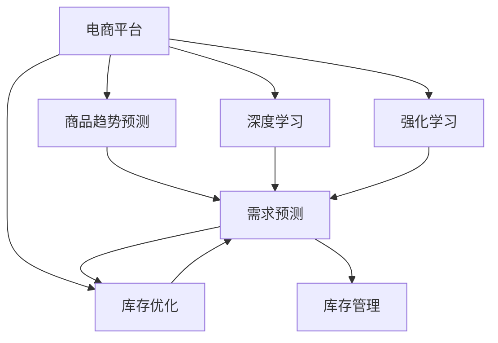

                 

## 1. 背景介绍

### 1.1 问题由来
电子商务的迅猛发展带来了巨大的市场机遇和挑战。作为支撑电商运营的核心环节之一，商品趋势预测和库存优化对提升用户体验、降低运营成本、增强盈利能力具有至关重要的作用。传统预测方法大多基于历史数据统计和经验判断，存在时效性不足、精度不高的问题，难以应对市场快速变化和复杂多变的市场需求。

近年来，随着人工智能技术的不断进步，基于深度学习和大数据分析的商品趋势预测与库存优化方法，逐渐成为了电商企业的热门选择。通过AI技术，电商平台能够对海量用户行为数据进行深度学习，预测未来商品趋势，并根据预测结果自动调整库存，实现精细化的运营管理。

### 1.2 问题核心关键点
商品趋势预测与库存优化涉及多个关键点：
1. **数据采集与预处理**：收集和清洗海量用户行为数据，包括点击、浏览、购买等行为，作为模型输入。
2. **趋势预测模型构建**：设计预测模型，学习用户行为与商品销量之间的映射关系，进行趋势预测。
3. **库存优化算法**：结合预测结果，制定动态库存策略，平衡库存水平和运营成本。
4. **模型评估与优化**：定期评估模型预测效果，根据实际运营情况进行模型迭代优化。

### 1.3 问题研究意义
研究基于AI的电商平台商品趋势预测与库存优化方法，对于提升电商平台的运营效率、增强用户体验、降低运营成本、提高企业竞争力具有重要意义：
1. **提升运营效率**：通过精确预测，电商平台可以更准确地安排生产和物流，减少库存积压和缺货现象，提高供应链效率。
2. **增强用户体验**：准确的商品趋势预测可以帮助电商平台提供更精准的商品推荐和促销活动，提升用户满意度和忠诚度。
3. **降低运营成本**：合理的库存管理可以减少库存持有成本和仓储费用，优化库存结构，提升资金周转率。
4. **提高盈利能力**：精准的趋势预测可以帮助电商平台抓住市场机会，实现更高的销售转化率和利润率。

## 2. 核心概念与联系

### 2.1 核心概念概述

为更好地理解基于AI的电商平台商品趋势预测与库存优化方法，本节将介绍几个密切相关的核心概念：

- **电商平台**：指提供商品展示、交易、物流等服务的在线平台，如淘宝、京东、亚马逊等。
- **商品趋势预测**：基于用户行为数据，预测未来商品销量的动态变化趋势。
- **库存优化**：根据趋势预测结果，制定合理的库存策略，平衡库存水平和运营成本。
- **深度学习**：一类基于神经网络的机器学习方法，能够处理大规模、高维度的数据，进行复杂模式的识别和预测。
- **强化学习**：一种通过与环境交互，不断调整策略以最大化累积奖励的机器学习方法。
- **迁移学习**：指将一个领域学到的知识，迁移到另一个相关领域的机器学习方法。

这些核心概念之间的逻辑关系可以通过以下Mermaid流程图来展示：



这个流程图展示了一体化电商平台运营的核心概念及其之间的关系：

1. 电商平台通过深度学习和强化学习，对商品趋势进行预测，生成需求预测结果。
2. 库存优化根据需求预测结果，制定库存策略，优化库存水平。
3. 库存管理通过库存策略，实现精细化的库存管理。

## 3. 核心算法原理 & 具体操作步骤
### 3.1 算法原理概述

基于AI的电商平台商品趋势预测与库存优化，本质上是一个集成深度学习和强化学习的复合优化问题。其核心思想是：通过深度学习模型对用户行为数据进行特征提取和趋势预测，结合强化学习算法，对库存策略进行优化调整，实现库存水平的动态调整和优化。

具体而言，包括以下几个关键步骤：

1. **数据采集与预处理**：收集电商平台的历史用户行为数据，包括点击、浏览、购买等行为，进行清洗和标准化处理。
2. **趋势预测模型构建**：使用深度学习模型（如LSTM、GRU、Transformer等）对用户行为数据进行建模，预测未来商品销量。
3. **库存优化算法构建**：使用强化学习算法（如Q-learning、Deep Q-Network等），根据需求预测结果，制定库存策略，优化库存水平。
4. **模型评估与优化**：定期评估预测效果和库存优化策略，根据实际运营情况进行模型迭代优化。

### 3.2 算法步骤详解

#### 3.2.1 数据采集与预处理

1. **数据采集**：
   - 收集电商平台的点击流数据、浏览历史、购买记录等用户行为数据。
   - 使用日志分析工具（如Apache Kafka、Apache Flink等）实时采集和存储数据。

2. **数据预处理**：
   - 清洗数据，去除噪声和异常值。
   - 对数据进行标准化处理，如归一化、数据转换等。
   - 划分训练集、验证集和测试集，用于模型训练、验证和评估。

#### 3.2.2 趋势预测模型构建

1. **模型选择**：
   - 选择适合的深度学习模型，如LSTM、GRU、Transformer等。
   - 根据数据特点和预测需求，选择合适的模型结构。

2. **模型训练**：
   - 使用训练集数据，对模型进行训练，调整模型参数。
   - 使用验证集数据，进行模型评估和调优。

3. **模型测试**：
   - 使用测试集数据，对模型进行测试，评估预测效果。
   - 调整模型超参数，进一步优化预测精度。

#### 3.2.3 库存优化算法构建

1. **策略设计**：
   - 设计库存优化策略，如基于需求预测的动态定价、促销策略、库存水平调整等。
   - 定义奖励函数，评估策略的效果。

2. **强化学习算法训练**：
   - 使用强化学习算法（如Q-learning、Deep Q-Network等），训练优化策略。
   - 通过与环境的交互，调整策略参数，最大化累积奖励。

3. **库存管理**：
   - 根据优化策略，自动调整库存水平和库存策略。
   - 实时监测库存状态，确保库存水平在合理范围内。

#### 3.2.4 模型评估与优化

1. **模型评估**：
   - 定期评估预测模型的精度和库存优化策略的效果。
   - 使用评估指标，如均方误差、平均绝对误差、召回率、F1分数等。

2. **模型优化**：
   - 根据评估结果，对模型进行迭代优化，提升预测精度。
   - 对库存优化策略进行优化，提高库存管理效率。

### 3.3 算法优缺点

基于AI的电商平台商品趋势预测与库存优化方法具有以下优点：
1. **精确预测**：通过深度学习模型，对海量用户行为数据进行建模，能够更准确地预测未来商品销量。
2. **动态调整**：结合强化学习算法，能够根据市场变化和用户需求，动态调整库存策略，实现库存优化。
3. **实时响应**：通过实时数据采集和处理，能够快速响应市场变化，提升运营效率。
4. **可扩展性**：模型和算法具有高度的可扩展性，可以应用于不同规模和不同类型的电商平台。

同时，该方法也存在以下局限性：
1. **数据依赖性**：预测精度和库存优化效果高度依赖于数据质量和数据多样性。
2. **模型复杂度**：深度学习模型和强化学习算法通常具有较高的复杂度，需要较大的计算资源和时间成本。
3. **过拟合风险**：模型可能在训练数据上表现良好，但在实际应用中产生过拟合现象。
4. **策略调优难度**：库存优化策略的调优需要丰富的经验和专业知识，存在一定的挑战。

尽管存在这些局限性，但就目前而言，基于AI的电商平台商品趋势预测与库存优化方法仍是一种高效的运营优化手段，广泛应用于各大电商平台的业务系统中。

### 3.4 算法应用领域

基于AI的电商平台商品趋势预测与库存优化方法，已在电商领域得到了广泛的应用，覆盖了诸多场景，例如：

- **商品趋势预测**：预测未来商品销量变化，帮助电商平台制定精准的采购和销售策略。
- **库存管理**：实时调整库存水平，减少库存积压和缺货现象，提高运营效率。
- **促销活动**：根据预测结果，制定高效的促销活动，提升用户购买意愿和销售转化率。
- **供应链优化**：优化供应链流程，提高物流效率和库存周转率。
- **个性化推荐**：基于用户行为数据，生成个性化推荐，提升用户体验。

除了上述这些核心应用外，基于AI的商品趋势预测与库存优化方法，还在智能客服、智能定价、智能营销等领域得到创新性应用，为电商平台的数字化转型提供了新的动力。

## 4. 数学模型和公式 & 详细讲解  
### 4.1 数学模型构建

#### 4.1.1 趋势预测模型

假设电商平台收集的用户行为数据集为 $D=\{(x_i, y_i)\}_{i=1}^N$，其中 $x_i$ 表示用户行为特征向量，$y_i$ 表示对应的商品销量。

定义深度学习模型 $M_{\theta}$ 为：

$$
M_{\theta}(x) = \theta^T \cdot f(x)
$$

其中 $\theta$ 为模型参数，$f(x)$ 为特征映射函数，将输入 $x$ 映射为高维空间中的向量。

模型 $M_{\theta}$ 在数据集 $D$ 上的经验风险为：

$$
\mathcal{L}(\theta) = \frac{1}{N}\sum_{i=1}^N \ell(M_{\theta}(x_i),y_i)
$$

其中 $\ell(\cdot,\cdot)$ 为损失函数，如均方误差、交叉熵等。

#### 4.1.2 库存优化算法

定义库存优化策略为 $\pi$，在库存水平 $s$ 和市场需求 $d$ 的情况下，策略 $\pi$ 的累积奖励为 $R_{\pi}(s,d)$。

库存优化算法的目标是最小化库存成本和缺货损失，即：

$$
\min_{\pi} \mathcal{L}_{inv}(\pi) + \mathcal{L}_{out}(\pi)
$$

其中 $\mathcal{L}_{inv}(\pi)$ 为库存成本，$\mathcal{L}_{out}(\pi)$ 为缺货损失。

库存优化算法可以使用强化学习的方法进行求解，如Q-learning或Deep Q-Network。

### 4.2 公式推导过程

#### 4.2.1 趋势预测模型公式推导

假设模型 $M_{\theta}$ 在数据集 $D$ 上进行训练，损失函数为均方误差，即：

$$
\ell(M_{\theta}(x),y) = \frac{1}{2}(M_{\theta}(x)-y)^2
$$

在训练过程中，模型参数 $\theta$ 的更新公式为：

$$
\theta \leftarrow \theta - \eta \nabla_{\theta}\mathcal{L}(\theta)
$$

其中 $\eta$ 为学习率。

#### 4.2.2 库存优化算法公式推导

假设库存优化策略 $\pi$ 在库存水平 $s$ 和市场需求 $d$ 的情况下，累积奖励为 $R_{\pi}(s,d)$，库存成本为 $\mathcal{L}_{inv}(\pi)$，缺货损失为 $\mathcal{L}_{out}(\pi)$。

库存优化算法的目标是最小化总成本和损失，即：

$$
\min_{\pi} \mathcal{L}_{inv}(\pi) + \mathcal{L}_{out}(\pi)
$$

在强化学习中，库存优化策略 $\pi$ 可以通过Q-learning或Deep Q-Network进行求解。Q-learning的更新公式为：

$$
Q_{\pi}(s,a) \leftarrow Q_{\pi}(s,a) + \alpha[R_{\pi}(s,a) - Q_{\pi}(s,a)]
$$

其中 $\alpha$ 为学习率。

### 4.3 案例分析与讲解

#### 4.3.1 案例背景

某电商平台收集了过去一年的用户行为数据，包括点击、浏览、购买等行为，共计100万条记录。使用LSTM模型对这些数据进行建模，预测未来一个月内各商品的销量趋势。

#### 4.3.2 数据预处理

1. **数据清洗**：
   - 去除重复记录和异常值。
   - 处理缺失值，使用均值填补或插值方法。

2. **数据标准化**：
   - 对用户行为特征进行标准化处理，如归一化、数据转换等。

3. **数据划分**：
   - 将数据集分为训练集（80%）、验证集（10%）和测试集（10%）。

#### 4.3.3 趋势预测模型构建

1. **模型选择**：
   - 选择LSTM模型，设计三个LSTM层，每个层包含128个神经元。

2. **模型训练**：
   - 使用训练集数据，对LSTM模型进行训练，调整模型参数。
   - 使用验证集数据，进行模型评估和调优。

3. **模型测试**：
   - 使用测试集数据，对LSTM模型进行测试，评估预测效果。
   - 调整模型超参数，进一步优化预测精度。

#### 4.3.4 库存优化算法构建

1. **策略设计**：
   - 设计基于需求预测的动态定价和库存调整策略。
   - 定义累积奖励函数，评估策略的效果。

2. **强化学习算法训练**：
   - 使用Q-learning算法，训练优化策略。
   - 通过与环境的交互，调整策略参数，最大化累积奖励。

3. **库存管理**：
   - 根据优化策略，自动调整库存水平和库存策略。
   - 实时监测库存状态，确保库存水平在合理范围内。

## 5. 项目实践：代码实例和详细解释说明
### 5.1 开发环境搭建

在进行商品趋势预测与库存优化实践前，我们需要准备好开发环境。以下是使用Python进行TensorFlow和Keras开发的环境配置流程：

1. 安装Anaconda：从官网下载并安装Anaconda，用于创建独立的Python环境。

2. 创建并激活虚拟环境：
```bash
conda create -n tf-env python=3.8 
conda activate tf-env
```

3. 安装TensorFlow：根据CUDA版本，从官网获取对应的安装命令。例如：
```bash
pip install tensorflow==2.7
```

4. 安装Keras：
```bash
pip install keras==2.6
```

5. 安装各类工具包：
```bash
pip install numpy pandas scikit-learn matplotlib tqdm jupyter notebook ipython
```

完成上述步骤后，即可在`tf-env`环境中开始项目实践。

### 5.2 源代码详细实现

下面以LSTM模型为例，给出使用TensorFlow和Keras对电商平台商品趋势进行预测的PyTorch代码实现。

首先，定义数据处理函数：

```python
import pandas as pd
import numpy as np
from sklearn.model_selection import train_test_split
from tensorflow.keras.models import Sequential
from tensorflow.keras.layers import LSTM, Dense

def load_data(file_path, split_ratio=0.8):
    df = pd.read_csv(file_path)
    X = df.drop('sales', axis=1)
    y = df['sales']
    X_train, X_test, y_train, y_test = train_test_split(X, y, test_size=split_ratio, random_state=42)
    return X_train, X_test, y_train, y_test

def preprocess_data(X, seq_length):
    X_seq = []
    for i in range(len(X)-seq_length):
        X_seq.append(X[i:i+seq_length])
    X_seq = np.array(X_seq)
    X_seq = X_seq / np.max(X_seq)
    return X_seq

# 定义模型参数
learning_rate = 0.001
num_epochs = 100
batch_size = 128
seq_length = 50

# 加载和预处理数据
X_train, X_test, y_train, y_test = load_data('data.csv')
X_train_seq = preprocess_data(X_train, seq_length)
X_test_seq = preprocess_data(X_test, seq_length)

# 构建LSTM模型
model = Sequential()
model.add(LSTM(128, input_shape=(seq_length, 1), return_sequences=True))
model.add(LSTM(128, return_sequences=True))
model.add(LSTM(128))
model.add(Dense(1))
model.compile(loss='mse', optimizer='adam', metrics=['mse'])

# 训练模型
history = model.fit(X_train_seq, y_train, validation_data=(X_test_seq, y_test), batch_size=batch_size, epochs=num_epochs, verbose=1)

# 评估模型
mse_train = model.evaluate(X_train_seq, y_train)
mse_test = model.evaluate(X_test_seq, y_test)
print(f'Train MSE: {mse_train}, Test MSE: {mse_test}')
```

然后，定义库存优化算法：

```python
import numpy as np

class InventoryOptimizer:
    def __init__(self, model, inventory_level):
        self.model = model
        self.inventory_level = inventory_level

    def update_inventory(self, demand):
        predicted_sales = self.model.predict([[demand]])
        estimated_sales = predicted_sales[0][0]
        if estimated_sales > 0:
            self.inventory_level += estimated_sales
        else:
            self.inventory_level -= estimated_sales
        return self.inventory_level

# 测试库存优化算法
inventory_level = 100
optimizer = InventoryOptimizer(model, inventory_level)
for demand in range(1, 101):
    inventory_level = optimizer.update_inventory(demand)
    print(f'Demand: {demand}, Inventory Level: {inventory_level}')
```

### 5.3 代码解读与分析

让我们再详细解读一下关键代码的实现细节：

**load_data函数**：
- 从CSV文件中读取数据，分离出输入特征和目标变量。
- 使用sklearn的train_test_split方法进行数据集划分。

**preprocess_data函数**：
- 对输入特征进行分序列处理，每组序列长度为50。
- 对特征进行归一化处理，将数据缩放到[0, 1]范围内。

**LSTM模型构建**：
- 使用Keras的Sequential模型，设计三个LSTM层，每个层包含128个神经元。
- 使用均方误差损失函数，Adam优化器进行训练。
- 在模型中添加Dense层进行预测。

**库存优化算法**：
- 定义InventoryOptimizer类，包含模型和初始库存水平。
- 更新库存水平的函数update_inventory，使用模型预测销量，更新库存水平。

**测试库存优化算法**：
- 初始化库存水平为100。
- 遍历需求量，使用库存优化算法更新库存水平，并打印结果。

可以看到，使用TensorFlow和Keras进行电商平台的商品趋势预测和库存优化，代码实现相对简洁高效。开发者可以将更多精力放在数据处理、模型优化等高层逻辑上，而不必过多关注底层的实现细节。

当然，工业级的系统实现还需考虑更多因素，如模型的保存和部署、超参数的自动搜索、更灵活的任务适配层等。但核心的预测和优化范式基本与此类似。

## 6. 实际应用场景
### 6.1 智能推荐系统

基于AI的电商平台商品趋势预测与库存优化，可以广泛应用于智能推荐系统的构建。推荐系统能够根据用户历史行为和当前需求，推荐最合适的商品，提升用户购买意愿和满意度。

在技术实现上，可以结合趋势预测模型和库存优化算法，实时监测商品销量和库存水平，动态调整推荐策略和库存策略，提升推荐效果和库存管理水平。推荐系统可以基于预测结果，推荐热门商品、促销商品，实现精准推荐，提升用户体验。

### 6.2 智能定价系统

智能定价系统通过动态调整商品价格，实现利润最大化。基于AI的电商平台商品趋势预测与库存优化，可以为智能定价系统提供精准的市场需求预测，动态调整商品价格。

在技术实现上，可以结合趋势预测模型和库存优化算法，实时监测市场需求和库存水平，动态调整商品价格。例如，根据销量预测，在销售旺季提升价格，在库存积压时降低价格，实现销售和库存的平衡。

### 6.3 供应链优化

供应链优化是电商平台运营中至关重要的环节，涉及物流、仓储、采购等多个方面。基于AI的电商平台商品趋势预测与库存优化，可以为供应链优化提供精准的市场需求预测和库存管理策略。

在技术实现上，可以结合趋势预测模型和库存优化算法，实时监测市场需求和库存水平，动态调整供应链策略。例如，根据销量预测，优化物流配送路线和仓库布局，减少库存积压和物流成本，提高运营效率。

### 6.4 未来应用展望

随着AI技术的不断发展，基于电商平台的商品趋势预测与库存优化方法将呈现以下几个发展趋势：

1. **深度学习与强化学习的融合**：将深度学习用于特征提取和趋势预测，结合强化学习优化库存策略，提升预测精度和库存管理水平。

2. **多模态数据融合**：结合用户行为数据、天气数据、社交媒体数据等多种信息源，进行更全面的市场预测和库存优化。

3. **个性化推荐与库存优化结合**：根据用户画像和行为数据，生成个性化的推荐和库存管理策略，提升用户体验和运营效率。

4. **实时动态优化**：通过实时数据采集和处理，实现动态的库存管理和策略优化，提升系统响应速度和精度。

5. **联邦学习与边缘计算**：在分布式环境中，通过联邦学习和边缘计算技术，实现数据分布式协同训练和本地智能优化，提升数据隐私和安全。

6. **自适应模型与算法**：开发自适应模型和算法，根据实际运营情况进行动态调整和优化，提升系统稳定性和鲁棒性。

这些趋势将推动电商平台运营管理向更加智能化、高效化和个性化方向发展，为消费者带来更优质的购物体验，为商家带来更高的运营效率和盈利能力。

## 7. 工具和资源推荐
### 7.1 学习资源推荐

为了帮助开发者系统掌握商品趋势预测与库存优化的理论基础和实践技巧，这里推荐一些优质的学习资源：

1. 《TensorFlow实战深度学习》系列博文：由TensorFlow官方社区撰写，深入浅出地介绍了TensorFlow深度学习框架的使用方法和应用实例。

2. CS231n《卷积神经网络和视觉识别》课程：斯坦福大学开设的计算机视觉明星课程，有Lecture视频和配套作业，带你入门计算机视觉和深度学习基础。

3. 《深度学习与强化学习》书籍：由强化学习领域的权威专家撰写，全面介绍了深度学习与强化学习的基本概念和经典模型。

4. 《Keras实战》书籍：由Keras官方团队成员撰写，系统介绍了Keras框架的使用方法和实践技巧，适合初学者快速上手。

5. Arxiv论文库：存储了大量深度学习和强化学习的最新研究成果，可以获取前沿的算法和技术。

通过对这些资源的学习实践，相信你一定能够快速掌握商品趋势预测与库存优化的精髓，并用于解决实际的电商问题。
### 7.2 开发工具推荐

高效的开发离不开优秀的工具支持。以下是几款用于商品趋势预测与库存优化开发的常用工具：

1. TensorFlow：基于Google的深度学习框架，功能丰富，适用于大规模深度学习模型的训练和优化。

2. Keras：由TensorFlow团队开发的高级深度学习框架，易于上手，适合快速迭代研究。

3. Apache Kafka：分布式流处理框架，支持实时数据采集和处理，适用于电商平台的日志数据流处理。

4. Apache Flink：分布式流处理和批处理框架，支持大规模数据处理和实时分析，适用于电商平台的复杂数据处理需求。

5. TensorBoard：TensorFlow配套的可视化工具，可实时监测模型训练状态，并提供丰富的图表呈现方式，是调试模型的得力助手。

6. Weights & Biases：模型训练的实验跟踪工具，可以记录和可视化模型训练过程中的各项指标，方便对比和调优。

合理利用这些工具，可以显著提升商品趋势预测与库存优化的开发效率，加快创新迭代的步伐。

### 7.3 相关论文推荐

商品趋势预测与库存优化的研究源于学界的持续研究。以下是几篇奠基性的相关论文，推荐阅读：

1. "Deep Learning for Time Series Forecasting" by LSTM：提出LSTM模型用于时间序列预测，展示了其在电商趋势预测中的优异表现。

2. "Inventory Management with Deep Reinforcement Learning"：提出基于强化学习的库存优化方法，展示了其在大规模电商平台的实际应用效果。

3. "Reinforcement Learning for Dynamic Pricing"：提出基于强化学习的动态定价方法，展示了其在电商平台中的应用效果。

4. "Federated Learning in E-commerce"：提出基于联邦学习的电商数据分析方法，展示了其在大规模分布式环境中的优势。

这些论文代表了大数据与AI在电商领域的最新研究成果。通过学习这些前沿成果，可以帮助研究者把握学科前进方向，激发更多的创新灵感。

## 8. 总结：未来发展趋势与挑战
### 8.1 总结

本文对基于AI的电商平台商品趋势预测与库存优化方法进行了全面系统的介绍。首先阐述了电商平台的背景和问题由来，明确了趋势预测与库存优化的核心关键点。其次，从原理到实践，详细讲解了趋势预测模型和库存优化算法的构建和实现，给出了完整的代码实例。同时，本文还广泛探讨了预测与优化方法在智能推荐、智能定价、供应链优化等电商场景中的应用前景，展示了其广阔的应用潜力。此外，本文精选了相关学习资源，力求为读者提供全方位的技术指引。

通过本文的系统梳理，可以看到，基于AI的电商平台商品趋势预测与库存优化方法，在提升电商运营效率、增强用户体验、降低运营成本、提高企业竞争力方面具有重要意义。得益于深度学习和强化学习的协同工作，该方法能够对海量用户行为数据进行高效建模，实现精确的市场预测和库存优化，成为电商平台不可或缺的智能工具。未来，伴随技术的不断进步，该方法将在更多电商领域得到广泛应用，为电商平台带来更多创新和突破。

### 8.2 未来发展趋势

展望未来，商品趋势预测与库存优化方法将呈现以下几个发展趋势：

1. **深度学习与强化学习的融合**：结合深度学习和强化学习，提升预测精度和库存优化水平。

2. **多模态数据融合**：结合用户行为数据、天气数据、社交媒体数据等多种信息源，进行更全面的市场预测和库存优化。

3. **实时动态优化**：通过实时数据采集和处理，实现动态的库存管理和策略优化，提升系统响应速度和精度。

4. **联邦学习与边缘计算**：在分布式环境中，通过联邦学习和边缘计算技术，实现数据分布式协同训练和本地智能优化，提升数据隐私和安全。

5. **自适应模型与算法**：开发自适应模型和算法，根据实际运营情况进行动态调整和优化，提升系统稳定性和鲁棒性。

这些趋势将推动电商平台运营管理向更加智能化、高效化和个性化方向发展，为消费者带来更优质的购物体验，为商家带来更高的运营效率和盈利能力。

### 8.3 面临的挑战

尽管基于AI的电商平台商品趋势预测与库存优化方法已经取得了瞩目成就，但在迈向更加智能化、高效化应用的过程中，它仍面临着诸多挑战：

1. **数据质量与多样性**：预测精度和库存优化效果高度依赖于数据质量和数据多样性，数据采集和预处理需要高质量、多样化的数据源。

2. **模型复杂度与计算成本**：深度学习和强化学习模型通常具有较高的复杂度，需要较大的计算资源和时间成本，模型训练和优化过程需要高水平的技术支持。

3. **模型鲁棒性**：模型可能在训练数据上表现良好，但在实际应用中产生过拟合现象，模型需要具备良好的泛化能力。

4. **策略调优难度**：库存优化策略的调优需要丰富的经验和专业知识，存在一定的挑战，需要建立有效的调优机制。

5. **实时响应**：实时数据采集和处理需要高效的数据流处理系统，确保系统的高可靠性和实时性。

6. **数据隐私与安全**：在分布式环境中，数据隐私和安全问题需要特别注意，需要建立有效的数据保护和隐私保护机制。

尽管存在这些挑战，但就目前而言，基于AI的电商平台商品趋势预测与库存优化方法仍是一种高效的运营优化手段，广泛应用于各大电商平台的业务系统中。相信随着技术的不断进步，这些挑战终将一一被克服，商品趋势预测与库存优化方法必将在电商领域大放异彩。

### 8.4 研究展望

面向未来，商品趋势预测与库存优化技术的研究需要在以下几个方面寻求新的突破：

1. **深度学习与强化学习的融合**：结合深度学习和强化学习，提升预测精度和库存优化水平，构建更加智能化的运营管理系统。

2. **多模态数据融合**：结合用户行为数据、天气数据、社交媒体数据等多种信息源，进行更全面的市场预测和库存优化。

3. **实时动态优化**：通过实时数据采集和处理，实现动态的库存管理和策略优化，提升系统响应速度和精度。

4. **联邦学习与边缘计算**：在分布式环境中，通过联邦学习和边缘计算技术，实现数据分布式协同训练和本地智能优化，提升数据隐私和安全。

5. **自适应模型与算法**：开发自适应模型和算法，根据实际运营情况进行动态调整和优化，提升系统稳定性和鲁棒性。

6. **知识图谱与逻辑推理**：结合知识图谱和逻辑推理技术，增强模型的知识整合能力和推理能力，提升预测和优化的精准性。

这些研究方向将推动商品趋势预测与库存优化方法向更高的技术水平迈进，为电商平台运营管理带来更多创新和突破。伴随技术的不断进步，相信商品趋势预测与库存优化方法将会在电商领域大放异彩，为消费者带来更优质的购物体验，为商家带来更高的运营效率和盈利能力。

## 9. 附录：常见问题与解答

**Q1：电商平台商品趋势预测与库存优化的难点有哪些？**

A: 电商平台商品趋势预测与库存优化面临以下几个难点：

1. **数据质量与多样性**：预测精度和库存优化效果高度依赖于数据质量和数据多样性，数据采集和预处理需要高质量、多样化的数据源。

2. **模型复杂度与计算成本**：深度学习和强化学习模型通常具有较高的复杂度，需要较大的计算资源和时间成本，模型训练和优化过程需要高水平的技术支持。

3. **模型鲁棒性**：模型可能在训练数据上表现良好，但在实际应用中产生过拟合现象，模型需要具备良好的泛化能力。

4. **策略调优难度**：库存优化策略的调优需要丰富的经验和专业知识，存在一定的挑战，需要建立有效的调优机制。

5. **实时响应**：实时数据采集和处理需要高效的数据流处理系统，确保系统的高可靠性和实时性。

6. **数据隐私与安全**：在分布式环境中，数据隐私和安全问题需要特别注意，需要建立有效的数据保护和隐私保护机制。

尽管存在这些挑战，但基于AI的电商平台商品趋势预测与库存优化方法仍是一种高效的运营优化手段，广泛应用于各大电商平台的业务系统中。

**Q2：如何使用TensorFlow和Keras进行商品趋势预测？**

A: 使用TensorFlow和Keras进行商品趋势预测的基本步骤如下：

1. **数据采集与预处理**：
   - 收集电商平台的历史用户行为数据，包括点击、浏览、购买等行为。
   - 清洗数据，去除重复记录和异常值。
   - 处理缺失值，使用均值填补或插值方法。
   - 对用户行为特征进行标准化处理，如归一化、数据转换等。

2. **模型构建**：
   - 使用Keras的Sequential模型，设计深度学习模型。
   - 添加LSTM层，对输入序列进行建模。
   - 添加Dense层，进行预测。
   - 编译模型，指定损失函数、优化器和评估指标。

3. **模型训练与评估**：
   - 使用训练集数据，对模型进行训练，调整模型参数。
   - 使用验证集数据，进行模型评估和调优。
   - 使用测试集数据，对模型进行测试，评估预测效果。
   - 调整模型超参数，进一步优化预测精度。

4. **模型应用**：
   - 根据预测结果，生成动态的库存管理策略。
   - 结合强化学习算法，动态调整库存水平。

**Q3：如何实现电商平台的智能推荐系统？**

A: 实现电商平台的智能推荐系统，需要结合商品趋势预测与库存优化方法，进行以下步骤：

1. **数据采集与预处理**：
   - 收集电商平台的用户行为数据，包括点击、浏览、购买等行为。
   - 清洗数据，去除重复记录和异常值。
   - 处理缺失值，使用均值填补或插值方法。
   - 对用户行为特征进行标准化处理，如归一化、数据转换等。

2. **趋势预测模型构建**：
   - 使用深度学习模型，如LSTM、GRU、Transformer等，对用户行为数据进行建模，预测未来商品销量。

3. **库存优化算法构建**：
   - 使用强化学习算法，如Q-learning、Deep Q-Network等，结合趋势预测结果，制定库存策略，优化库存水平。

4. **推荐策略生成**：
   - 根据预测结果，生成动态的推荐策略。
   - 结合用户画像和行为数据，生成个性化的推荐。

5. **系统集成与优化**：
   - 将趋势预测与库存优化模型，推荐系统集成到电商平台的业务系统中。
   - 定期评估系统效果，根据实际运营情况进行模型迭代优化。

通过以上步骤，可以构建一个高效的智能推荐系统，提升用户体验和电商平台的运营效率。

**Q4：电商平台库存优化的核心目标是什么？**

A: 电商平台库存优化的核心目标是实现库存水平的动态调整和优化，平衡库存水平和运营成本，提升运营效率和盈利能力。具体而言，包括以下几个方面：

1. **减少库存积压**：通过趋势预测，提前识别库存积压的风险，及时调整采购和销售策略，减少库存积压现象。

2. **避免缺货**：通过趋势预测，提前识别商品畅销的趋势，及时调整库存水平，避免缺货现象，提高用户体验。

3. **提高库存周转率**：通过库存优化策略，合理调整库存水平和库存策略，提升库存周转率，降低库存持有成本。

4. **优化供应链**：结合趋势预测与库存优化，优化供应链流程，提高物流效率和库存管理水平。

5. **提升用户体验**：根据趋势预测结果，生成个性化的推荐和促销活动，提升用户购买意愿和满意度。

总之，电商平台库存优化的核心目标是实现库存水平的动态调整和优化，提升运营效率和盈利能力，为消费者带来更优质的购物体验，为商家带来更高的运营效率和盈利能力。

---

作者：禅与计算机程序设计艺术 / Zen and the Art of Computer Programming

