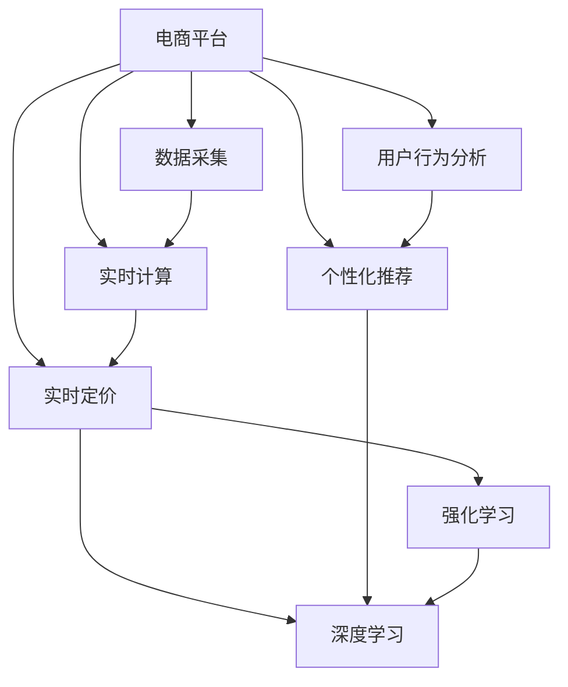

                 

# AI驱动的电商平台实时个性化定价系统

> 关键词：人工智能,电商平台,实时定价,个性化推荐,深度学习,强化学习,实时计算,机器学习,模型优化,推荐系统,动态定价,算法优化,电商智能化

## 1. 背景介绍

### 1.1 问题由来

随着电子商务的迅猛发展，电商平台已成为企业数字化的重要组成部分。如何提升销售额、提高用户满意度和提升运营效率，成为了电商企业面临的核心挑战。其中，商品定价策略直接关系到销售收入和用户体验，是电商运营中最为关键的一环。传统的定价策略往往基于固定规则或人工经验，难以适应不断变化的市场需求和用户行为。随着人工智能技术的快速发展，利用AI技术实现商品定价和推荐，已成为电商企业的重要创新方向。

### 1.2 问题核心关键点

电商平台的实时个性化定价系统，需要基于用户行为数据和市场动态，实时调整商品价格，以实现个性化推荐和动态定价。其核心关键点包括：

- **实时数据处理**：需要实时获取用户行为数据和市场动态，动态调整商品价格。
- **个性化推荐**：根据用户的历史行为和当前需求，推荐最合适的商品价格。
- **动态定价策略**：基于市场竞争、库存情况、促销活动等因素，动态调整商品价格。
- **优化算法**：需要高效的算法实现实时计算和动态更新，保证系统响应速度和稳定性。

## 2. 核心概念与联系

### 2.1 核心概念概述

为更好地理解电商平台实时个性化定价系统的核心技术，本节将介绍几个关键概念：

- **电商平台**：以线上方式进行商品交易的商业平台，通过提供商品展示、购物车、支付等功能，支持用户在线购物。
- **实时定价系统**：根据用户行为和市场动态，实时调整商品价格，实现动态定价的自动化系统。
- **个性化推荐系统**：通过用户历史行为数据，推荐最符合用户偏好的商品，提升用户体验。
- **深度学习**：一种基于神经网络的机器学习技术，擅长处理大规模非线性数据。
- **强化学习**：通过与环境互动，不断优化决策策略的学习范式。
- **实时计算**：在数据到达后，能够即时处理并产生输出的计算能力。

这些概念之间的逻辑关系可以通过以下Mermaid流程图来展示：



这个流程图展示了一些关键概念及其之间的关系：

1. 电商平台通过数据采集获取用户行为数据和市场动态，作为实时定价和个性化推荐的基础。
2. 深度学习和强化学习用于模型训练，优化定价和推荐策略。
3. 实时计算能力使得系统能够即时响应市场变化，实时调整商品价格。

## 3. 核心算法原理 & 具体操作步骤
### 3.1 算法原理概述

电商平台实时个性化定价系统基于深度学习技术，通过训练预测模型来实时调整商品价格。其核心算法原理如下：

- **用户行为分析**：收集用户历史浏览、购买、评价等行为数据，提取用户偏好和购买力。
- **市场动态分析**：获取市场竞争情况、促销活动、库存水平等实时数据，分析市场趋势。
- **价格预测**：基于用户行为和市场动态，训练预测模型，实时调整商品价格。
- **推荐策略优化**：根据用户行为和市场动态，优化推荐算法，提升用户购买意愿。

### 3.2 算法步骤详解

基于深度学习的电商平台实时定价系统，主要包括以下几个关键步骤：

**Step 1: 数据采集与预处理**

- 收集用户行为数据：包括浏览记录、购买历史、评价反馈等，存储到数据库中。
- 获取市场动态数据：包括市场竞争情况、促销活动、库存水平等，通过API接口实时获取。
- 数据清洗与预处理：对数据进行清洗、去重、归一化等处理，生成干净的数据集。

**Step 2: 模型训练与优化**

- 选择深度学习模型：如多层感知器、卷积神经网络、循环神经网络等，根据具体任务选择适当的模型。
- 设计损失函数：如均方误差、交叉熵等，用于衡量模型预测与真实值之间的差异。
- 优化算法：如梯度下降、Adam等，用于最小化损失函数，更新模型参数。
- 模型评估与验证：在验证集上评估模型性能，根据评估结果调整模型参数。

**Step 3: 实时定价与推荐**

- 实时数据处理：在数据到达后，实时计算并更新商品价格。
- 动态定价策略：根据市场动态和库存情况，动态调整商品价格。
- 个性化推荐：根据用户行为，推荐最符合用户偏好的商品。

**Step 4: 系统部署与监控**

- 系统部署：将训练好的模型部署到服务器或云平台，实现实时定价和推荐功能。
- 监控与优化：实时监控系统性能，根据用户反馈和业务需求，不断优化模型和算法。

### 3.3 算法优缺点

基于深度学习的电商平台实时定价系统，具有以下优点：

- **个性化推荐**：能够根据用户行为和偏好，推荐最合适的商品，提升用户购买意愿。
- **动态定价**：能够实时响应市场变化，调整商品价格，提高销售收入。
- **预测精准**：通过深度学习模型，可以实现高精度的价格预测和推荐。
- **实时响应**：具有强大的实时计算能力，能够即时响应市场变化。

同时，该方法也存在一些局限性：

- **高计算需求**：深度学习模型计算量大，对硬件设备要求较高。
- **数据隐私问题**：用户行为数据涉及隐私，需要进行严格的保护。
- **模型复杂度**：深度学习模型较为复杂，训练和调优过程较繁琐。
- **实时性要求高**：系统需要保证高实时性，避免因延迟影响用户体验。

尽管存在这些局限性，但就目前而言，基于深度学习的实时定价系统仍是目前最主流的方法。未来相关研究的重点在于如何进一步降低计算需求，提高数据隐私保护，优化模型复杂度，同时兼顾实时性和精度要求。

### 3.4 算法应用领域

电商平台实时定价系统已经在多个电商企业中得到应用，提升了销售业绩和用户体验。例如：

- **淘宝、京东等电商平台**：通过实时定价系统，根据用户行为和市场动态，动态调整商品价格，提升销售收入。
- **亚马逊**：利用个性化推荐系统，为用户推荐最合适的商品，提高用户购买意愿。
- **携程、飞猪等旅游平台**：通过实时定价系统，动态调整机票、酒店价格，提高预订率。

## 4. 数学模型和公式 & 详细讲解  
### 4.1 数学模型构建

本节将使用数学语言对电商平台实时定价系统的核心算法进行更加严格的刻画。

记电商平台的数据集为 $D=\{(x_i,y_i)\}_{i=1}^N$，其中 $x_i$ 为输入特征，$y_i$ 为输出标签，即商品价格。设深度学习模型为 $f_{\theta}(x)$，其中 $\theta$ 为模型参数。假设模型在训练集 $D$ 上的经验风险为：

$$
\mathcal{L}(\theta) = \frac{1}{N}\sum_{i=1}^N [y_i - f_{\theta}(x_i)]^2
$$

在模型训练过程中，通过最小化经验风险，找到最优参数：

$$
\theta^* = \mathop{\arg\min}_{\theta} \mathcal{L}(\theta)
$$

### 4.2 公式推导过程

以多层感知器(MLP)为例，推导其价格预测模型的损失函数及梯度计算公式。

假设输入特征 $x_i \in \mathbb{R}^d$，输出标签 $y_i \in \mathbb{R}$，多层感知器的结构为：

$$
f_{\theta}(x) = \sum_{k=1}^K w_k\sigma(\sum_{j=1}^d x_j v_{kj} + b_k)
$$

其中，$\sigma$ 为激活函数，如ReLU、Sigmoid等。模型参数包括权重矩阵 $W=\{w_k\}_{k=1}^K$ 和偏置向量 $B=\{b_k\}_{k=1}^K$，以及输入特征矩阵 $V=\{v_{kj}\}_{j=1}^d$。损失函数为均方误差：

$$
\mathcal{L}(\theta) = \frac{1}{N}\sum_{i=1}^N [y_i - f_{\theta}(x_i)]^2
$$

计算损失函数对权重矩阵 $W$ 的梯度：

$$
\frac{\partial \mathcal{L}(\theta)}{\partial W} = \frac{2}{N}\sum_{i=1}^N [f_{\theta}(x_i) - y_i]x_i^T\sigma'(\sum_{j=1}^d x_j v_{kj} + b_k)
$$

其中 $\sigma'$ 为激活函数的导数。

通过上述公式，可以不断更新模型参数，最小化经验风险，实现模型训练。

### 4.3 案例分析与讲解

以淘宝电商平台的实时定价系统为例，展示其实现过程：

1. **数据采集与预处理**：淘宝通过API接口获取用户的浏览记录、购买历史、评价反馈等行为数据，以及市场竞争情况、促销活动、库存水平等市场动态数据。对数据进行清洗、去重、归一化等处理，生成干净的数据集。

2. **模型训练与优化**：淘宝选择多层感知器作为预测模型，设计均方误差损失函数，使用Adam优化算法进行训练。在验证集上评估模型性能，根据评估结果调整模型参数。

3. **实时定价与推荐**：在用户浏览商品时，淘宝实时计算商品价格，并根据市场动态和库存情况，动态调整商品价格。同时，淘宝利用个性化推荐系统，根据用户行为，推荐最符合用户偏好的商品。

4. **系统部署与监控**：淘宝将训练好的模型部署到服务器或云平台，实现实时定价和推荐功能。实时监控系统性能，根据用户反馈和业务需求，不断优化模型和算法。

## 5. 项目实践：代码实例和详细解释说明
### 5.1 开发环境搭建

在进行实时定价系统开发前，我们需要准备好开发环境。以下是使用Python进行TensorFlow开发的环境配置流程：

1. 安装Anaconda：从官网下载并安装Anaconda，用于创建独立的Python环境。

2. 创建并激活虚拟环境：
```bash
conda create -n tf-env python=3.8 
conda activate tf-env
```

3. 安装TensorFlow：根据CUDA版本，从官网获取对应的安装命令。例如：
```bash
pip install tensorflow==2.3
```

4. 安装各类工具包：
```bash
pip install numpy pandas scikit-learn matplotlib tqdm jupyter notebook ipython
```

完成上述步骤后，即可在`tf-env`环境中开始实时定价系统开发。

### 5.2 源代码详细实现

这里我们以淘宝电商平台为例，给出使用TensorFlow实现实时定价系统的PyTorch代码实现。

首先，定义模型类：

```python
import tensorflow as tf
from tensorflow.keras import layers

class PricePredictor(tf.keras.Model):
    def __init__(self, input_dim, hidden_units, output_dim):
        super(PricePredictor, self).__init__()
        self.dense1 = layers.Dense(hidden_units, activation='relu', input_shape=(input_dim,))
        self.dense2 = layers.Dense(hidden_units, activation='relu')
        self.dense3 = layers.Dense(output_dim)
    
    def call(self, x):
        x = self.dense1(x)
        x = self.dense2(x)
        return self.dense3(x)
```

然后，定义数据集类：

```python
class Dataset(tf.keras.utils.Sequence):
    def __init__(self, x, y, batch_size):
        self.x = x
        self.y = y
        self.batch_size = batch_size
        
    def __len__(self):
        return len(self.x) // self.batch_size
    
    def __getitem__(self, item):
        batch_x = self.x[item * self.batch_size:(item + 1) * self.batch_size]
        batch_y = self.y[item * self.batch_size:(item + 1) * self.batch_size]
        return batch_x, batch_y
```

接着，定义训练函数：

```python
def train_model(model, x_train, y_train, x_val, y_val, epochs, batch_size):
    train_dataset = Dataset(x_train, y_train, batch_size)
    val_dataset = Dataset(x_val, y_val, batch_size)
    
    optimizer = tf.keras.optimizers.Adam(learning_rate=0.001)
    loss_fn = tf.keras.losses.MeanSquaredError()
    
    for epoch in range(epochs):
        model.trainable = True
        for x_batch, y_batch in train_dataset:
            with tf.GradientTape() as tape:
                y_pred = model(x_batch)
                loss = loss_fn(y_pred, y_batch)
            grads = tape.gradient(loss, model.trainable_variables)
            optimizer.apply_gradients(zip(grads, model.trainable_variables))
        
        model.trainable = False
        val_loss = loss_fn(model(x_val), y_val)
        print(f"Epoch {epoch+1}, train loss: {loss:.3f}, val loss: {val_loss:.3f}")
```

最后，启动训练流程：

```python
input_dim = 5
hidden_units = 32
output_dim = 1

model = PricePredictor(input_dim, hidden_units, output_dim)
train_x = # 训练集特征
train_y = # 训练集标签
val_x = # 验证集特征
val_y = # 验证集标签

epochs = 10
batch_size = 32

train_model(model, train_x, train_y, val_x, val_y, epochs, batch_size)
```

以上就是使用TensorFlow对淘宝电商平台进行实时定价系统开发的完整代码实现。可以看到，TensorFlow提供了强大的深度学习模型和优化算法，使得实时定价系统的开发变得更加便捷。

### 5.3 代码解读与分析

让我们再详细解读一下关键代码的实现细节：

**PricePredictor类**：
- `__init__`方法：初始化多层感知器的结构，包括两个隐藏层和一个输出层。
- `call`方法：前向传播计算模型输出，利用激活函数进行非线性变换。

**Dataset类**：
- `__init__`方法：初始化训练集和验证集数据。
- `__len__`方法：计算数据集的长度。
- `__getitem__`方法：获取单个批次的训练数据。

**train_model函数**：
- `tf.keras.optimizers.Adam`：Adam优化器，用于最小化损失函数。
- `tf.keras.losses.MeanSquaredError`：均方误差损失函数，用于衡量模型预测与真实值之间的差异。
- `with tf.GradientTape() as tape`：利用梯度带，计算损失函数对模型参数的梯度。
- `optimizer.apply_gradients`：应用梯度更新模型参数。

**训练流程**：
- 定义输入维度、隐藏层单元数、输出维度等超参数。
- 初始化模型。
- 定义训练集和验证集特征和标签。
- 启动训练流程，每个epoch对训练集进行一次迭代。
- 在每个epoch结束后，在验证集上评估模型性能。

可以看到，TensorFlow提供了丰富的工具和库，方便开发者构建和训练深度学习模型。合理利用这些工具，可以显著提升实时定价系统的开发效率，加速创新迭代的步伐。

当然，工业级的系统实现还需考虑更多因素，如模型的保存和部署、超参数的自动搜索、更灵活的任务适配层等。但核心的实时定价范式基本与此类似。

## 6. 实际应用场景
### 6.1 智能客服系统

基于实时定价系统，智能客服系统可以动态调整服务价格，以提升服务质量和用户满意度。例如：

- **客户服务定价**：根据客户的服务需求和历史行为，动态调整客服价格。
- **个性化推荐**：根据客户的历史购买记录和浏览行为，推荐最合适的产品和服务。
- **促销活动**：根据市场动态和促销活动，动态调整服务价格，吸引更多客户。

### 6.2 金融理财平台

实时定价系统在金融理财平台的应用，能够动态调整理财产品价格，提升用户投资体验。例如：

- **理财产品定价**：根据市场利率和用户投资偏好，动态调整理财产品价格。
- **投资组合推荐**：根据用户投资历史和风险偏好，推荐最合适的投资组合。
- **风险预警**：根据市场波动和用户投资行为，动态调整产品价格，预警潜在风险。

### 6.3 旅游平台

实时定价系统在旅游平台的应用，能够动态调整机票、酒店价格，提升用户体验和预订率。例如：

- **机票定价**：根据市场供需和用户出行偏好，动态调整机票价格。
- **酒店推荐**：根据用户预订历史和偏好，推荐最合适的酒店。
- **预订促销**：根据市场促销活动和用户预订行为，动态调整酒店价格，吸引更多预订。

### 6.4 未来应用展望

随着深度学习技术的发展，基于实时定价系统将在更多领域得到应用，为各行各业带来变革性影响。

在智慧医疗领域，实时定价系统可以动态调整医疗服务价格，提高服务质量和效率。例如：

- **医疗服务定价**：根据患者病情和历史就诊记录，动态调整医疗服务价格。
- **个性化推荐**：根据患者病史和偏好，推荐最合适的医疗服务。
- **资源优化**：根据医院资源利用情况，动态调整服务价格，优化资源配置。

在智能教育领域，实时定价系统可以动态调整教育资源价格，提升教育质量和用户体验。例如：

- **课程定价**：根据学生学习行为和历史成绩，动态调整课程价格。
- **个性化推荐**：根据学生学习偏好，推荐最合适的教育资源。
- **资源优化**：根据教育资源利用情况，动态调整课程价格，优化资源配置。

在智慧城市治理中，实时定价系统可以动态调整城市服务价格，提高城市管理效率。例如：

- **公共服务定价**：根据市民服务需求和历史行为，动态调整公共服务价格。
- **个性化推荐**：根据市民偏好，推荐最合适的公共服务。
- **资源优化**：根据城市资源利用情况，动态调整服务价格，优化资源配置。

此外，在企业生产、社会治理、文娱传媒等众多领域，基于实时定价系统的人工智能应用也将不断涌现，为经济社会发展注入新的动力。相信随着深度学习技术的持续演进，实时定价系统必将在更广阔的应用领域大放异彩。

## 7. 工具和资源推荐
### 7.1 学习资源推荐

为了帮助开发者系统掌握电商平台实时定价系统的理论基础和实践技巧，这里推荐一些优质的学习资源：

1. **《深度学习实战》书籍**：由TensorFlow开发者撰写，全面介绍了深度学习技术在电商定价、推荐系统等领域的应用。

2. **CS231n《深度学习计算机视觉》课程**：斯坦福大学开设的计算机视觉明星课程，涵盖了深度学习在视觉、语音、自然语言处理等多个领域的知识。

3. **DeepLearning.ai课程**：由深度学习领域的知名专家Andrew Ng教授主讲，涵盖深度学习理论、实践和应用，适合初学者和高级开发者。

4. **TensorFlow官方文档**：TensorFlow的官方文档，提供了详尽的模型和算法实现，适合学习深度学习模型和算法。

5. **Kaggle竞赛平台**：一个数据科学竞赛平台，提供了大量的数据集和模型竞赛，适合实践深度学习算法。

通过对这些资源的学习实践，相信你一定能够快速掌握电商平台实时定价系统的精髓，并用于解决实际的电商问题。

### 7.2 开发工具推荐

高效的开发离不开优秀的工具支持。以下是几款用于电商平台实时定价系统开发的常用工具：

1. **Jupyter Notebook**：一个交互式的开发环境，支持Python、R等多种语言，方便开发者进行模型训练和调试。

2. **TensorFlow**：由Google主导开发的深度学习框架，支持分布式计算、GPU加速等，适合构建大规模实时定价系统。

3. **PyTorch**：由Facebook开发的深度学习框架，支持动态计算图和高效优化，适合快速迭代研究。

4. **MXNet**：一个高效的深度学习框架，支持多种编程语言和硬件设备，适合构建实时定价系统。

5. **Scikit-learn**：一个常用的机器学习库，提供了多种回归、分类算法，适合进行模型训练和评估。

6. **NumPy**：一个高效的数值计算库，适合进行矩阵运算和数据处理。

合理利用这些工具，可以显著提升电商平台实时定价系统的开发效率，加快创新迭代的步伐。

### 7.3 相关论文推荐

电商平台实时定价系统的发展离不开学界的持续研究。以下是几篇奠基性的相关论文，推荐阅读：

1. **《深度学习在电商领域的应用》论文**：介绍了深度学习在电商定价、推荐系统、客服系统等领域的应用，涵盖了多种算法和模型。

2. **《强化学习在金融理财中的应用》论文**：研究了强化学习在金融理财平台中的应用，动态调整理财产品价格，提升用户投资体验。

3. **《实时定价系统的构建与优化》论文**：介绍了实时定价系统的构建流程和优化方法，提供了多种优化策略和案例分析。

4. **《基于深度学习的个性化推荐系统》论文**：研究了基于深度学习的个性化推荐系统，展示了其在大规模推荐任务中的表现。

5. **《实时定价系统的高效实现》论文**：研究了实时定价系统的实现技术，包括数据采集、模型训练、实时计算等方面，提供了多种实现方案。

这些论文代表了大语言模型微调技术的发展脉络。通过学习这些前沿成果，可以帮助研究者把握学科前进方向，激发更多的创新灵感。

## 8. 总结：未来发展趋势与挑战

### 8.1 总结

本文对电商平台实时定价系统进行了全面系统的介绍。首先阐述了实时定价系统的背景和意义，明确了实时定价系统在电商运营中的核心价值。其次，从原理到实践，详细讲解了实时定价的数学原理和关键步骤，给出了实时定价系统开发的完整代码实例。同时，本文还广泛探讨了实时定价系统在智能客服、金融理财、旅游平台等多个领域的应用前景，展示了实时定价系统的巨大潜力。此外，本文精选了实时定价系统的各类学习资源，力求为读者提供全方位的技术指引。

通过本文的系统梳理，可以看到，电商平台实时定价系统通过深度学习技术，实现了动态调整商品价格的目标，大幅提升了电商平台的运营效率和用户体验。未来，伴随深度学习技术的发展，实时定价系统必将在更广泛的领域得到应用，带来更加智能、高效的电商服务体验。

### 8.2 未来发展趋势

展望未来，电商平台实时定价系统将呈现以下几个发展趋势：

1. **实时计算能力提升**：随着计算资源的不断扩展，实时定价系统将能够处理更大规模的数据，实现更精确的价格预测和动态调整。

2. **深度学习模型优化**：未来将出现更加高效的深度学习模型，如Transformer、GNN等，提升实时定价系统的计算效率和预测精度。

3. **跨领域数据融合**：将多种数据源（如用户行为数据、市场动态数据、社交媒体数据等）进行融合，提升实时定价系统的决策能力。

4. **强化学习应用**：将强化学习引入实时定价系统，通过与市场动态的互动，动态调整商品价格，提升系统灵活性和响应速度。

5. **个性化推荐增强**：通过深度学习模型，实现更加精准的个性化推荐，提升用户体验和购买意愿。

6. **多模型集成**：将多种定价模型进行集成，提升系统的鲁棒性和泛化能力。

这些趋势凸显了电商平台实时定价系统的广阔前景。这些方向的探索发展，必将进一步提升系统性能和应用范围，为电商平台带来更高的运营效率和用户满意度。

### 8.3 面临的挑战

尽管电商平台实时定价系统已经取得了瞩目成就，但在迈向更加智能化、普适化应用的过程中，它仍面临着诸多挑战：

1. **数据隐私问题**：用户行为数据涉及隐私，需要进行严格的保护。如何在保护隐私的前提下，获取足够的数据支持，是一大难题。

2. **计算资源需求高**：深度学习模型计算量大，对硬件设备要求较高。如何在资源受限的环境下，实现高效的实时定价，是一大挑战。

3. **系统复杂度高**：实时定价系统涉及多个模块和组件，如何实现高效协同，提升系统稳定性，是一大难题。

4. **模型鲁棒性不足**：深度学习模型面对数据噪声和异常值时，容易产生不稳定预测。如何在模型设计中引入鲁棒性，是一大挑战。

5. **实时性要求高**：系统需要保证高实时性，避免因延迟影响用户体验。如何在高效计算和实时响应之间找到平衡，是一大难题。

6. **用户接受度低**：用户对动态定价的接受度较低，如何设计合理的价格调整策略，提升用户接受度，是一大难题。

这些挑战需要通过不断的技术创新和实践优化，逐步克服。只有通过多方协作，才能将电商平台实时定价系统推向新的高度。

### 8.4 研究展望

面对电商平台实时定价系统所面临的种种挑战，未来的研究需要在以下几个方面寻求新的突破：

1. **数据隐私保护**：引入差分隐私等技术，在保护用户隐私的前提下，获取足够的数据支持。

2. **高效计算技术**：引入分布式计算、混合精度计算等技术，提升实时定价系统的计算效率。

3. **模型鲁棒性增强**：引入鲁棒性正则化、对抗样本训练等技术，提升深度学习模型的鲁棒性。

4. **系统协同优化**：引入微服务架构、服务网格等技术，实现高效协同，提升系统稳定性。

5. **实时性优化**：引入模型压缩、量化加速等技术，提升实时定价系统的实时性。

6. **用户接受度提升**：设计更加透明、合理的价格调整策略，提升用户接受度。

这些研究方向的探索，必将引领电商平台实时定价系统迈向更高的台阶，为电商平台的智能化转型提供坚实的基础。面向未来，电商平台实时定价系统需要在保护隐私、提升效率、增强鲁棒性等方面不断进步，才能实现更高的用户满意度和运营效益。

## 9. 附录：常见问题与解答

**Q1：电商平台实时定价系统是否适用于所有电商平台？**

A: 电商平台实时定价系统适用于大多数电商平台，尤其是数据量较大、用户行为复杂的平台。但对于一些小型平台，由于数据量较小，可能难以发挥实时定价系统的优势。此时可以采用传统的定价策略，或进行部分功能优化，如商品分类、促销活动等。

**Q2：实时定价系统对计算资源有哪些要求？**

A: 电商平台实时定价系统对计算资源的要求较高，主要包括高性能CPU/GPU、大容量内存、高速存储等。在实际部署时，需要考虑计算资源的高效利用，避免资源浪费和性能瓶颈。

**Q3：实时定价系统如何保证数据隐私？**

A: 电商平台实时定价系统需要严格保护用户隐私，避免泄露敏感信息。具体措施包括：数据匿名化、差分隐私、安全计算等技术，确保用户数据的安全和隐私保护。

**Q4：实时定价系统如何进行模型优化？**

A: 电商平台实时定价系统的模型优化包括参数剪枝、量化加速、混合精度计算等技术，可以在保证性能的同时，减小模型规模，提升计算效率。同时，可以通过在线学习、增量学习等技术，不断更新模型，适应市场变化。

**Q5：实时定价系统如何应对市场动态？**

A: 电商平台实时定价系统需要及时响应市场动态，动态调整商品价格。具体措施包括：引入强化学习、在线学习等技术，不断优化定价策略，提升市场响应速度。同时，可以通过监控系统、异常告警等技术，实时监测市场动态，及时调整价格。

这些问题的答案展示了电商平台实时定价系统在实际应用中的关键问题和解决策略。通过这些指导，相信你一定能够更好地理解和应用电商平台实时定价系统，提升电商平台的运营效率和用户体验。

---

作者：禅与计算机程序设计艺术 / Zen and the Art of Computer Programming

