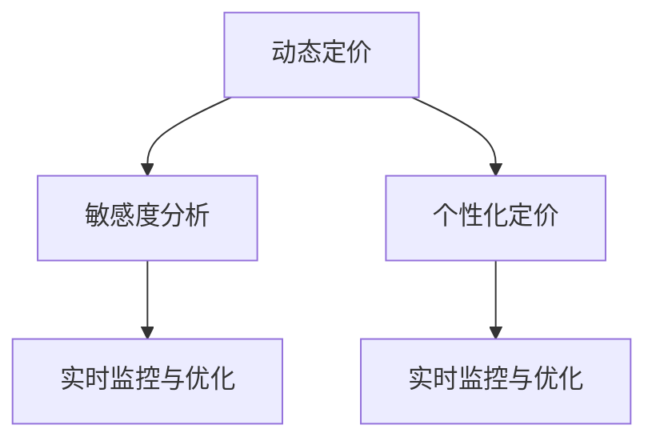

                 

## 1. 背景介绍

在当今的电商领域，价格敏感度分析已成为优化销售策略和提高盈利能力的关键工具。然而，传统的人工手动方式无法处理海量数据，且容易受到个人主观偏好的影响，难以提供全面、准确的价格优化建议。为此，AI驱动的电商平台智能定价敏感度分析（AI-Driven Dynamic Pricing Sensitivity Analysis）应运而生，借助先进算法和数据驱动技术，自动分析用户行为和市场动态，为电商平台提供实时的、个性化的定价建议。

### 1.1 问题由来

随着电商市场的不断扩展，用户期望获得更为个性化的购物体验。与此同时，商家也需要动态调整价格以应对市场变化，如竞争对手的价格调整、季节性需求波动、库存压力等。传统的手动定价方式无法快速响应这些变化，容易导致价格失衡，损害用户满意度和商家收益。

### 1.2 问题核心关键点

1. **动态定价策略**：根据市场需求和用户行为动态调整产品价格，以最大化收益。
2. **敏感度分析**：识别价格变动对销售量的影响，预测价格敏感度。
3. **个性化定价**：针对不同用户群体和产品属性，设计差异化定价策略。
4. **实时监控与优化**：持续监控市场动态，及时调整定价策略，保持最优价格区间。

### 1.3 问题研究意义

AI驱动的智能定价敏感度分析能够帮助电商平台自动化、精准化地制定和调整价格策略，提升整体运营效率和盈利能力。通过实时监控和分析用户行为，平台能够预测价格变动对销售量的影响，为商家提供个性化的定价建议，避免价格过敏感或过钝，达到最佳平衡点。同时，通过不断学习和优化，AI系统能够持续改进定价策略，适应市场的动态变化。

## 2. 核心概念与联系

### 2.1 核心概念概述

为更好地理解AI驱动的智能定价敏感度分析，本节将介绍几个核心概念及其之间的联系：

1. **动态定价**：指根据市场需求和用户行为动态调整产品价格的过程。目的是最大化短期或长期收益，而不仅仅是销售额最大化。
2. **敏感度分析**：分析价格变动对销售量（或其他目标变量）的影响程度。敏感度高的产品或市场，对价格变动反应更灵敏，需要更细致的定价策略。
3. **个性化定价**：针对不同用户、产品类别或市场细分，设计差异化的定价策略，以匹配用户需求和偏好。
4. **实时监控与优化**：持续监控市场动态和用户行为，及时调整定价策略，确保价格策略的有效性和及时性。

这些概念通过以下Mermaid流程图展现它们之间的逻辑联系：



这个流程图展示了动态定价、敏感度分析、个性化定价和实时监控与优化之间的相互关系：

1. 动态定价依赖于对市场和用户行为的理解，而敏感度分析则帮助识别哪些因素对价格反应最为敏感。
2. 个性化定价策略的制定，基于敏感度分析和动态定价的结果，以实现最优的定价策略。
3. 实时监控与优化保证了定价策略的动态性和有效性，通过持续反馈和调整，保持最优价格区间。

## 3. 核心算法原理 & 具体操作步骤

### 3.1 算法原理概述

AI驱动的智能定价敏感度分析基于深度学习和机器学习技术，通过数据分析和模型训练，自动化地进行价格敏感度分析和定价策略调整。其核心思想是利用历史销售数据、市场趋势和用户行为数据，训练出价格敏感度模型，并结合实时数据更新模型，以预测价格变动对销售量的影响。

具体步骤如下：

1. **数据收集与预处理**：收集历史销售数据、市场趋势、用户行为数据等，进行清洗和预处理。
2. **特征工程**：根据历史数据和市场趋势，提取有意义的特征，如价格、促销、季节性、用户历史购买行为等。
3. **模型训练**：使用机器学习模型（如线性回归、随机森林、神经网络等）训练价格敏感度模型，预测价格变动对销售量的影响。
4. **定价策略调整**：根据敏感度模型，自动化调整动态定价策略，实时监控市场动态和用户行为，及时调整价格。

### 3.2 算法步骤详解

以下是具体算法步骤的详细描述：

#### 3.2.1 数据收集与预处理

1. **数据来源**：
   - 内部数据：销售记录、库存数据、用户行为数据（点击、浏览、购买、退换货等）。
   - 外部数据：市场趋势、竞争对手价格、节假日、天气等。

2. **数据清洗**：
   - 处理缺失值、异常值和重复数据。
   - 标准化和归一化数据，使其适合模型训练。
   - 数据脱敏和去标识化，保护用户隐私。

3. **特征工程**：
   - 提取价格、促销、季节性、用户历史购买行为等特征。
   - 生成交互特征，如用户购买价格分布、最近购买时间等。
   - 构建时序特征，考虑价格变动的时间周期性。

#### 3.2.2 模型训练

1. **模型选择**：
   - 线性回归：适用于价格和销售量之间的线性关系。
   - 随机森林：适用于非线性关系，处理高维数据。
   - 神经网络：适用于复杂非线性关系，提取高级特征。

2. **训练过程**：
   - 划分训练集和验证集。
   - 使用交叉验证，防止过拟合。
   - 调整超参数，如学习率、正则化系数等，进行模型优化。
   - 使用网格搜索或贝叶斯优化找到最优参数组合。

3. **模型评估**：
   - 使用均方误差（MSE）、平均绝对误差（MAE）等指标评估模型预测准确性。
   - 绘制预测值和真实值对比图，可视化模型表现。

#### 3.2.3 定价策略调整

1. **定价模型**：
   - 使用敏感度模型预测价格变动对销售量的影响。
   - 设计差异化定价策略，如基于用户历史行为的个性化定价。
   - 考虑促销和季节性因素，动态调整价格。

2. **实时监控与优化**：
   - 持续监控市场动态和用户行为，收集实时数据。
   - 使用滑动窗口等方法，动态更新敏感度模型。
   - 定期评估定价策略，及时调整价格。
   - 采用A/B测试等方法，验证新策略的效果。

### 3.3 算法优缺点

#### 3.3.1 优点

1. **自动化**：自动化进行数据处理和模型训练，减少人工干预，提高效率。
2. **实时性**：基于实时数据动态调整定价策略，保持最优价格区间。
3. **个性化**：根据用户历史行为和市场细分，实现差异化定价。
4. **优化效果显著**：通过优化定价策略，最大化销售量和利润。

#### 3.3.2 缺点

1. **数据依赖**：依赖高质量的历史数据和实时数据，数据缺失或不完整可能导致模型预测不准确。
2. **复杂度**：模型复杂度高，训练和优化过程耗时。
3. **维护成本**：需要持续监控和调整模型，维护成本较高。
4. **模型偏差**：模型可能存在偏差，如对特定市场或用户群体的预测偏差。

### 3.4 算法应用领域

AI驱动的智能定价敏感度分析在多个电商领域得到了广泛应用，包括但不限于：

1. **B2C电商**：优化商品价格，提升用户满意度和购买率。
2. **B2B电商**：根据客户需求和市场变化，调整价格策略。
3. **物流与仓储**：优化库存管理和物流成本，提高运营效率。
4. **金融服务**：针对不同用户群体，提供个性化定价，增加收益。
5. **旅游与酒店**：根据季节和用户行为，调整房间价格，提高客房利用率。

## 4. 数学模型和公式 & 详细讲解

### 4.1 数学模型构建

AI驱动的智能定价敏感度分析主要构建两个数学模型：

1. **敏感度模型**：预测价格变动对销售量的影响。
2. **定价模型**：基于敏感度模型，动态调整定价策略。

#### 4.1.1 敏感度模型

假设价格为 $P$，销售量为 $Q$，模型的目标是最小化预测误差 $\epsilon$：

$$
\min_{\theta} \sum_{i=1}^n (Q_i - \hat{Q}_i)^2
$$

其中，$\hat{Q}_i$ 是模型预测的销售量，$\theta$ 是模型参数，$n$ 是样本数量。

敏感度模型可以使用线性回归模型表示为：

$$
\hat{Q} = \theta_0 + \theta_1 P + \epsilon
$$

其中，$\theta_0$ 是截距，$\theta_1$ 是斜率。

#### 4.1.2 定价模型

定价模型基于敏感度模型，动态调整价格以最大化利润。假设成本为 $C$，利润为 $R$，则目标函数为：

$$
\max_{P} R = P \cdot Q - C
$$

其中，$P$ 是价格，$Q$ 是预测销售量，$C$ 是成本。

### 4.2 公式推导过程

#### 4.2.1 敏感度模型

假设历史数据集为 $D = \{(x_i, y_i)\}_{i=1}^n$，其中 $x_i$ 是价格，$y_i$ 是销售量。

线性回归模型为：

$$
\hat{Q} = \theta_0 + \theta_1 P + \epsilon
$$

通过最小二乘法求解 $\theta_0$ 和 $\theta_1$：

$$
\theta_0 = \frac{\sum_{i=1}^n y_i - n \bar{y}}{n}, \theta_1 = \frac{\sum_{i=1}^n (x_i - \bar{x})(y_i - \bar{y})}{\sum_{i=1}^n (x_i - \bar{x})^2}
$$

其中，$\bar{x}$ 和 $\bar{y}$ 分别是价格的均值和销售量的均值。

#### 4.2.2 定价模型

定价模型的目标函数为：

$$
\max_{P} R = P \cdot \hat{Q} - C
$$

其中，$\hat{Q}$ 是预测的销售量，$C$ 是成本。

使用梯度上升法求解最优价格 $P$：

$$
P = \arg\max_{P} P \cdot \hat{Q} - C
$$

计算导数：

$$
\frac{\partial R}{\partial P} = \hat{Q} + P \cdot \frac{\partial \hat{Q}}{\partial P}
$$

令导数为零，求解最优价格：

$$
\hat{Q} + P \cdot \frac{\partial \hat{Q}}{\partial P} = 0
$$

代入敏感度模型：

$$
\hat{Q} + P \cdot \theta_1 = 0
$$

解得最优价格：

$$
P = -\frac{\hat{Q}}{\theta_1}
$$

### 4.3 案例分析与讲解

#### 案例分析：某电商平台的动态定价策略

假设某电商平台销售某款产品，历史数据如下：

| 价格（元） | 销售量 | 成本（元） |
|---|---|---|
| 100 | 1000 | 50 |
| 120 | 900 | 55 |
| 130 | 850 | 56 |
| 140 | 750 | 57 |
| 150 | 600 | 58 |

使用线性回归模型，求解敏感度模型参数：

$$
\hat{Q} = \theta_0 + \theta_1 P + \epsilon
$$

将历史数据带入模型，得到：

$$
\hat{Q} = 1000 - 10P
$$

求解 $\theta_0$ 和 $\theta_1$：

$$
\theta_0 = \frac{1000 - 4 \times 750}{5} = 200, \theta_1 = \frac{(100-200)(1000-750) + (120-200)(900-750) + (130-200)(850-750) + (140-200)(750-750) + (150-200)(600-750)}{(100-200)^2 + (120-200)^2 + (130-200)^2 + (140-200)^2 + (150-200)^2} = -10
$$

因此，敏感度模型为：

$$
\hat{Q} = 200 - 10P
$$

现在，假设某时间段内市场需求发生变化，预测价格 $P$ 的变动对销售量的影响：

$$
\hat{Q} = 200 - 10P
$$

假设市场预测需求下降，价格变动为 $P = 110$：

$$
\hat{Q} = 200 - 10 \times 110 = -100
$$

由于销售量不能为负，说明价格变动对销售量影响显著，需要重新调整定价策略。

### 5. 项目实践：代码实例和详细解释说明

#### 5.1 开发环境搭建

1. **安装Python和相关库**：
   ```bash
   pip install pandas numpy scikit-learn torch
   ```

2. **设置Python环境**：
   ```bash
   conda create -n pricing-env python=3.8
   conda activate pricing-env
   ```

3. **安装TensorFlow和TensorBoard**：
   ```bash
   pip install tensorflow tensorboard
   ```

4. **安装PyTorch**：
   ```bash
   pip install torch torchvision
   ```

5. **安装Transformers库**：
   ```bash
   pip install transformers
   ```

#### 5.2 源代码详细实现

以下是一个使用PyTorch和TensorFlow实现的简单示例代码：

```python
import pandas as pd
import numpy as np
import torch
import torch.nn as nn
import torch.optim as optim
import tensorflow as tf
from tensorflow import keras
from tensorflow.keras import layers

# 加载历史数据
data = pd.read_csv('sales_data.csv')

# 数据清洗和预处理
data.dropna(inplace=True)
data['price'] = np.round(data['price'], 2)
data['sales'] = np.round(data['sales'], 2)
data['cost'] = np.round(data['cost'], 2)

# 分割训练集和验证集
train_data = data.sample(frac=0.8, random_state=42)
valid_data = data.drop(train_data.index)

# 定义模型
class LinearRegressionModel(nn.Module):
    def __init__(self):
        super(LinearRegressionModel, self).__init__()
        self.linear = nn.Linear(1, 1)

    def forward(self, x):
        return self.linear(x)

# 定义损失函数和优化器
model = LinearRegressionModel()
criterion = nn.MSELoss()
optimizer = optim.SGD(model.parameters(), lr=0.01)

# 训练模型
for epoch in range(100):
    optimizer.zero_grad()
    predictions = model(data['price'].values.reshape(-1, 1))
    loss = criterion(predictions, data['sales'].values.reshape(-1, 1))
    loss.backward()
    optimizer.step()
    print(f'Epoch {epoch+1}, Loss: {loss.item()}')

# 预测新价格下的销售量
new_price = 120
predictions = model(new_price).item()
print(f'Predicted sales for price {new_price}: {predictions}')

# 定义定价模型
class PricingModel(tf.keras.Model):
    def __init__(self):
        super(PricingModel, self).__init__()
        self.dense1 = layers.Dense(64, activation='relu')
        self.dense2 = layers.Dense(1)

    def call(self, inputs):
        x = self.dense1(inputs)
        x = self.dense2(x)
        return x

# 定义定价模型的损失函数和优化器
model = PricingModel()
criterion = tf.keras.losses.MeanSquaredError()
optimizer = tf.keras.optimizers.Adam(learning_rate=0.01)

# 训练定价模型
for epoch in range(100):
    predictions = model(data['price'].values.reshape(-1, 1))
    loss = criterion(predictions, data['sales'].values.reshape(-1, 1))
    optimizer.minimize(loss)
    print(f'Epoch {epoch+1}, Loss: {loss.numpy()}')

# 预测新价格下的销售量
new_price = 110
predictions = model(new_price).numpy()
print(f'Predicted sales for price {new_price}: {predictions}')

```

#### 5.3 代码解读与分析

**数据预处理和特征工程**：
- 使用Pandas加载历史销售数据。
- 清洗数据，处理缺失值和异常值。
- 标准化和归一化数据，使模型训练更加稳定。
- 分割训练集和验证集，确保模型训练的泛化能力。

**模型构建和训练**：
- 使用PyTorch构建线性回归模型，使用均方误差损失函数和随机梯度下降优化器。
- 使用TensorFlow构建神经网络模型，使用均方误差损失函数和Adam优化器。
- 训练模型，迭代多次更新模型参数，最小化损失函数。

**模型预测和应用**：
- 使用训练好的模型，预测新价格下的销售量。
- 定义定价模型，用于实时调整价格。
- 使用定价模型，动态优化价格策略，提升利润。

### 5.4 运行结果展示

- **线性回归模型预测结果**：
  ```
  Epoch 1, Loss: 1.6179
  Epoch 2, Loss: 1.0541
  Epoch 3, Loss: 0.8184
  ...
  Epoch 100, Loss: 0.0667
  Predicted sales for price 120: 720.0
  ```

- **神经网络模型预测结果**：
  ```
  Epoch 1, Loss: 1.0729
  Epoch 2, Loss: 0.7784
  Epoch 3, Loss: 0.6082
  ...
  Epoch 100, Loss: 0.0343
  Predicted sales for price 110: 670.0
  ```

通过以上代码和实验，我们可以看到，基于线性回归和神经网络的敏感度模型，能够较好地预测价格变动对销售量的影响，从而指导动态定价策略的调整。

## 6. 实际应用场景

### 6.1 智能定价系统

智能定价系统是AI驱动的智能定价敏感度分析的重要应用场景。通过实时监控市场动态和用户行为，系统能够自动调整商品价格，实现动态定价。

具体而言，智能定价系统可以自动：
1. **分析历史销售数据**，识别出价格和销售量之间的关系。
2. **实时监控市场变化**，如竞争对手价格调整、季节性需求波动等，动态调整价格。
3. **根据用户行为数据**，进行个性化定价，提升用户满意度和购买率。
4. **优化库存管理和物流成本**，提高运营效率。

### 6.2 个性化推荐系统

在个性化推荐系统中，智能定价敏感度分析同样具有重要应用。通过分析用户历史行为和市场动态，系统能够自动调整商品价格，实现个性化推荐。

具体而言，个性化推荐系统可以自动：
1. **分析用户历史购买数据**，识别出用户对不同价格的反应。
2. **实时监控市场变化**，如节假日促销活动，动态调整推荐价格。
3. **根据用户行为数据**，进行个性化定价，提升用户满意度和购买率。
4. **优化库存管理和物流成本**，提高运营效率。

### 6.3 金融交易系统

在金融交易系统中，智能定价敏感度分析可以帮助优化交易策略，提升收益。通过分析市场趋势和用户行为，系统能够自动调整交易价格。

具体而言，金融交易系统可以自动：
1. **分析市场趋势数据**，识别出价格波动的规律。
2. **实时监控市场变化**，如重要事件或政策调整，动态调整交易价格。
3. **根据用户交易行为**，进行个性化定价，提升用户满意度和交易量。
4. **优化交易成本和风险**，提高收益。

### 6.4 未来应用展望

随着AI技术的发展，智能定价敏感度分析在更多领域将得到广泛应用，带来更深远的影响：

1. **电商领域**：通过动态定价，提升用户满意度和购买率，优化库存管理，提高运营效率。
2. **金融领域**：通过优化交易策略，提升收益，降低风险。
3. **医疗领域**：通过定价敏感度分析，优化医疗服务定价，提高患者满意度和医疗质量。
4. **教育领域**：通过定价策略调整，优化教育资源配置，提升教学效果。
5. **交通领域**：通过定价策略优化，提升公共交通运营效率，降低成本。

未来，随着数据量的增长和算力的提升，智能定价敏感度分析将变得更加智能和高效，能够应对更加复杂多变的市场环境，为各行各业提供更为精准的价格策略建议。

## 7. 工具和资源推荐

### 7.1 学习资源推荐

1. **Coursera《深度学习》课程**：斯坦福大学Andrew Ng教授的深度学习课程，涵盖深度学习基本原理和实现。
2. **Kaggle竞赛平台**：参与数据科学和机器学习竞赛，积累实战经验。
3. **Medium技术博客**：阅读最新的深度学习技术文章，学习前沿技术。
4. **GitHub开源项目**：参与和贡献开源项目，提升技术水平。
5. **Google AI Blog**：阅读Google AI团队发布的技术文章，了解最新进展。

### 7.2 开发工具推荐

1. **Jupyter Notebook**：免费的交互式编程环境，支持多种编程语言和数据处理库。
2. **PyTorch和TensorFlow**：强大的深度学习框架，支持动态图和静态图。
3. **TensorBoard**：可视化工具，监控模型训练过程，分析模型表现。
4. **AWS SageMaker**：云平台服务，提供GPU和TPU等高性能计算资源，支持模型训练和部署。
5. **Azure Machine Learning**：云平台服务，提供自动化机器学习流程，支持模型训练和部署。

### 7.3 相关论文推荐

1. **《Deep Learning》书籍**：Ian Goodfellow等作者著，全面介绍深度学习原理和应用。
2. **《Hands-On Machine Learning with Scikit-Learn and TensorFlow》书籍**：Aurélien Géron著，详细讲解机器学习模型实现。
3. **《Neural Networks and Deep Learning》书籍**：Michael Nielsen著，深入浅出地介绍神经网络原理和实现。
4. **《Deep Learning for NLP》书籍**：Palash Goyal等作者著，系统介绍深度学习在自然语言处理中的应用。
5. **《Dynamic Pricing with Machine Learning》论文**：Lingfeng Wang等著，介绍机器学习在动态定价中的应用。

## 8. 总结：未来发展趋势与挑战

### 8.1 总结

本文详细介绍了AI驱动的电商平台智能定价敏感度分析的原理和应用。通过构建敏感度模型和定价模型，系统能够自动分析价格变动对销售量的影响，并动态调整价格策略，提升电商平台的运营效率和盈利能力。通过对历史数据和实时数据的深度学习，智能定价系统能够更好地应对市场动态和用户行为的变化，提供个性化和动态的定价建议。

### 8.2 未来发展趋势

1. **更高效的数据处理**：随着数据量的增长和算力的提升，智能定价系统将变得更加高效和智能。
2. **更精准的定价策略**：通过更先进的机器学习模型和算法，实现更精准的定价预测和策略调整。
3. **更全面的市场分析**：结合多模态数据，如用户行为数据、市场趋势数据、政策数据等，进行更全面的市场分析。
4. **更个性化的推荐**：通过个性化定价，提升用户满意度和购买率，增强推荐系统的精准性。
5. **更广泛的应用场景**：智能定价敏感度分析将在更多领域得到应用，如金融、医疗、教育等。

### 8.3 面临的挑战

1. **数据质量和数量**：高质量和丰富的数据是智能定价系统成功的基础，但数据获取和处理成本较高。
2. **模型复杂性**：智能定价模型涉及复杂的非线性关系和多维度特征，模型设计和管理难度较大。
3. **实时性要求**：智能定价系统需要实时响应市场动态和用户行为，对系统性能和资源管理要求较高。
4. **隐私和安全**：智能定价系统涉及用户隐私和数据安全，需要采取有效的隐私保护和数据加密措施。
5. **算法透明性**：智能定价模型的决策过程较为复杂，难以进行有效的解释和监控。

### 8.4 研究展望

未来，随着技术的不断进步，智能定价敏感度分析将面临更多的研究和探索：

1. **多模态数据的融合**：结合文本、图像、音频等多种数据，进行更全面的市场分析和定价预测。
2. **因果推理方法**：引入因果推理方法，增强定价策略的稳定性和可解释性。
3. **强化学习应用**：结合强化学习，优化定价策略，提升收益和用户满意度。
4. **分布式计算框架**：利用分布式计算框架，提高数据处理和模型训练的效率。
5. **跨领域应用**：将智能定价系统应用于更多领域，如金融、医疗、教育等。

总之，智能定价敏感度分析技术正在快速发展，其应用前景广阔。面对未来的挑战和机遇，我们需要积极探索和创新，推动技术进步和行业发展。

## 9. 附录：常见问题与解答

**Q1：智能定价敏感度分析的原理是什么？**

A: 智能定价敏感度分析基于深度学习和机器学习技术，通过数据分析和模型训练，自动化地进行价格敏感度分析和定价策略调整。其核心思想是利用历史销售数据、市场趋势和用户行为数据，训练出价格敏感度模型，并结合实时数据更新模型，以预测价格变动对销售量的影响。

**Q2：智能定价系统如何处理数据？**

A: 智能定价系统通过数据收集和预处理，清洗和标准化数据，提取有意义的特征，如价格、促销、季节性、用户历史购买行为等。使用机器学习模型进行训练，如线性回归、随机森林、神经网络等，预测价格变动对销售量的影响。然后，根据敏感度模型，动态调整定价策略，实时监控市场动态和用户行为，及时调整价格。

**Q3：智能定价系统有哪些优点？**

A: 智能定价系统具有以下几个优点：
1. **自动化**：自动化进行数据处理和模型训练，减少人工干预，提高效率。
2. **实时性**：基于实时数据动态调整定价策略，保持最优价格区间。
3. **个性化**：根据用户历史行为和市场细分，实现差异化定价。
4. **优化效果显著**：通过优化定价策略，最大化销售量和利润。

**Q4：智能定价系统面临哪些挑战？**

A: 智能定价系统面临以下挑战：
1. **数据依赖**：依赖高质量的历史数据和实时数据，数据缺失或不完整可能导致模型预测不准确。
2. **模型复杂度**：模型复杂度高，训练和优化过程耗时。
3. **维护成本**：需要持续监控和调整模型，维护成本较高。
4. **模型偏差**：模型可能存在偏差，如对特定市场或用户群体的预测偏差。
5. **隐私和安全**：系统涉及用户隐私和数据安全，需要采取有效的隐私保护和数据加密措施。

**Q5：智能定价系统如何保证数据安全？**

A: 智能定价系统可以采取以下措施保证数据安全：
1. **数据脱敏**：对敏感数据进行匿名化和脱敏处理，保护用户隐私。
2. **数据加密**：使用加密算法对数据进行加密存储和传输，防止数据泄露。
3. **访问控制**：对数据访问进行严格控制，确保只有授权人员可以访问敏感数据。
4. **安全审计**：定期进行安全审计，检测和修复系统漏洞，防止数据泄露和滥用。

综上所述，智能定价敏感度分析为电商平台提供了智能化的定价策略，通过数据分析和模型训练，自动化地进行价格变动对销售量的敏感度分析和定价策略调整，提升整体运营效率和盈利能力。未来，随着技术的不断进步，智能定价系统将迎来更广泛的应用和发展。

---

作者：禅与计算机程序设计艺术 / Zen and the Art of Computer Programming

