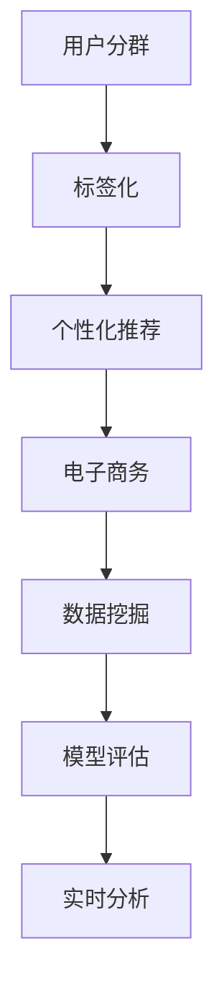

                 

# AI驱动的电商平台用户分群与标签化

> 关键词：用户分群(User Segmentation), 标签化(Labeling), AI驱动(AI-Driven), 个性化推荐(Personalized Recommendation), 电子商务(E-commerce), 数据挖掘(Data Mining), 模型评估(Model Evaluation), 实时分析(Real-time Analysis)

## 1. 背景介绍

### 1.1 问题由来
随着电子商务的迅猛发展，各大电商平台不断面临用户数量的快速增长和竞争加剧的挑战。如何精准地分析和理解用户行为，提升用户体验，增强用户粘性，最终实现业务增长，成为了电商平台亟需解决的核心问题。用户分群与标签化技术能够帮助电商平台对用户进行细分，根据不同用户群体的特征进行个性化营销和运营，显著提升营销效率和用户满意度。AI驱动的用户分群与标签化能够利用先进的数据挖掘和机器学习技术，自动化地对海量用户数据进行分析，挖掘出更有价值的用户行为特征和潜在需求，为电商平台提供决策支持，有效提升用户转化率和消费频次。

### 1.2 问题核心关键点
在电商平台中，用户分群与标签化的核心关键点包括：

- **用户数据采集**：从用户行为日志、购买记录、浏览历史等多个渠道采集数据，形成用户画像。
- **数据清洗与处理**：对采集到的数据进行去重、补全、归一化等处理，确保数据的质量和一致性。
- **特征提取与选择**：从原始数据中提取对用户行为具有显著影响的特征，并从中选择最具区分力的特征作为用户分群与标签化的依据。
- **模型训练与评估**：使用机器学习算法对用户进行分群，对分群结果进行评估，选择最优的分群策略。
- **实时分析与更新**：根据用户实时行为数据，动态调整分群与标签化模型，保持模型的时效性。

### 1.3 问题研究意义
用户分群与标签化技术的成功应用，能够帮助电商平台实现以下目标：

1. **个性化推荐**：根据用户分群结果，提供更加精准的个性化推荐，提升用户体验和满意度。
2. **营销策略优化**：通过精准的用户分群，制定更具针对性的营销策略，降低营销成本，提升营销效果。
3. **运营效率提升**：优化产品、内容、服务等运营环节，提升运营效率和客户满意度。
4. **用户忠诚度增强**：通过深入理解用户需求，提供满足用户期待的产品和体验，增强用户忠诚度。
5. **业务增长加速**：通过精准的用户分群和个性化营销，有效提升用户转化率和消费频次，推动业务增长。

## 2. 核心概念与联系

### 2.1 核心概念概述

为更好地理解AI驱动的电商平台用户分群与标签化方法，本节将介绍几个密切相关的核心概念：

- **用户分群(User Segmentation)**：将用户按照其行为、属性、消费特征等进行分类，形成不同用户群体，以更有效地进行营销和管理。
- **标签化(Labeling)**：为每个用户群体打上具有描述性的标签，方便后续的分析和处理。
- **AI驱动(AI-Driven)**：利用人工智能技术，特别是机器学习和数据挖掘技术，自动化地实现用户分群与标签化。
- **个性化推荐(Personalized Recommendation)**：根据用户特征和行为，推荐最符合用户需求的商品或服务。
- **电子商务(E-commerce)**：借助互联网和电子技术进行买卖活动，包括线上购物、电子支付、物流配送等环节。
- **数据挖掘(Data Mining)**：从海量数据中提取有价值的信息和知识，支持决策制定和业务优化。
- **模型评估(Model Evaluation)**：使用一系列评估指标，衡量模型性能和效果。
- **实时分析(Real-time Analysis)**：基于用户实时行为数据，动态调整分群与标签化模型，保证分群结果的实时性和准确性。

这些核心概念之间的逻辑关系可以通过以下Mermaid流程图来展示：



这个流程图展示了大语言模型的核心概念及其之间的关系：

1. 用户分群是对用户进行分组的过程。
2. 标签化是在用户分群的基础上，为每个用户群体打上标签。
3. 个性化推荐是利用用户分群与标签化结果，推荐商品或服务。
4. 电子商务是应用个性化推荐、数据挖掘等技术，提升业务过程。
5. 数据挖掘是支持用户分群与标签化、个性化推荐等过程的基础。
6. 模型评估用于衡量和优化用户分群与标签化模型。
7. 实时分析使分群与标签化模型能够根据最新数据动态调整，保持时效性。

## 3. 核心算法原理 & 具体操作步骤
### 3.1 算法原理概述

AI驱动的电商平台用户分群与标签化技术，核心思想是利用机器学习算法对用户进行自动化的分组和标记。其核心流程包括数据预处理、特征选择、模型训练、分群与标签化等步骤。

1. **数据预处理**：从电商平台收集用户行为日志、购买记录、浏览历史等数据，进行清洗和处理。
2. **特征选择**：从处理后的数据中提取与用户行为和消费特征相关的特征，如购买频率、浏览时间、点击率等。
3. **模型训练**：使用聚类算法（如K-means、层次聚类等）或分类算法（如决策树、随机森林、神经网络等）对用户进行分组，并进行模型评估。
4. **分群与标签化**：根据训练结果，对用户进行分组，并为每个用户群体打上相应的标签。

### 3.2 算法步骤详解

以下将详细介绍AI驱动的电商平台用户分群与标签化算法的各个步骤：

#### 步骤一：数据预处理
数据预处理是用户分群与标签化过程的基础。其目标是将原始数据转换为可用于模型训练的格式，包括数据清洗、特征提取、归一化等步骤。

**数据清洗**：
- 去除重复记录：对用户数据进行去重处理，避免重复记录对分群结果的影响。
- 处理缺失值：对缺失数据进行填充或删除，确保数据的完整性。
- 异常值检测：识别和处理异常值，保证数据的一致性和准确性。

**特征提取**：
- 行为特征：如购买频率、浏览时间、点击率等，描述用户的行为模式。
- 用户属性：如年龄、性别、地域等，描述用户的个人特征。
- 商品特征：如价格、品牌、类别等，描述商品的属性。

**数据归一化**：
- 将不同特征的取值范围标准化，防止不同特征对模型造成的不公平影响。

#### 步骤二：特征选择
特征选择是选择最具区分力的特征作为用户分群与标签化的依据。常用的特征选择方法包括：

- **相关性分析**：计算每个特征与用户行为、消费特征的相关系数，选择相关性较高的特征。
- **卡方检验**：检验特征与分群结果之间的独立性，选择显著影响分群结果的特征。
- **信息增益**：计算每个特征对分群结果的信息增益，选择信息增益较高的特征。

#### 步骤三：模型训练
模型训练是使用机器学习算法对用户进行分群的过程。常用的机器学习算法包括：

- **K-means聚类**：将用户分为若干个群体，每个群体内部相似度较高，群体之间相似度较低。
- **层次聚类**：自下而上逐步合并用户群体，形成树状聚类结构。
- **决策树**：根据用户特征进行分类，生成决策树模型。
- **随机森林**：集成多个决策树，提高模型的鲁棒性和准确性。
- **神经网络**：使用多层感知机或卷积神经网络对用户进行分类。

#### 步骤四：分群与标签化
根据模型训练结果，对用户进行分群，并为每个用户群体打上相应的标签。标签化的目的是为每个用户群体提供描述性的名称，方便后续分析和处理。

### 3.3 算法优缺点

AI驱动的电商平台用户分群与标签化技术具有以下优点：

- **高效自动化**：利用机器学习算法，自动化地实现用户分群与标签化，节省了大量的人工成本和时间。
- **精确度提升**：通过数据挖掘和特征选择，能够挖掘出更有价值的用户行为特征和潜在需求，提高分群和标签化的精确度。
- **实时动态**：基于实时行为数据，动态调整分群与标签化模型，保持分群结果的时效性和准确性。
- **个性化推荐**：通过精准的用户分群与标签化，实现更加精准的个性化推荐，提升用户体验和满意度。

但同时，该方法也存在一定的局限性：

- **数据依赖**：分群与标签化的结果高度依赖于数据的质量和完备性，数据偏差可能导致分群不准确。
- **模型复杂**：机器学习算法模型复杂，训练和调参过程较为繁琐，需要专业知识和技能。
- **解释性不足**：模型结果缺乏可解释性，难以理解和调试模型的内部机制。
- **模型鲁棒性**：模型对新数据和新场景的泛化能力有限，可能面临过拟合或欠拟合的问题。

### 3.4 算法应用领域

AI驱动的电商平台用户分群与标签化技术，在电子商务领域有广泛的应用场景，例如：

- **个性化推荐系统**：根据用户分群结果，提供个性化的商品推荐，提升用户满意度。
- **营销策略优化**：通过精准的用户分群，制定更具针对性的营销策略，提升营销效果。
- **用户行为分析**：分析用户行为特征，了解用户需求和偏好，优化产品和服务。
- **流失预警**：通过用户分群与标签化，预测用户流失风险，提前进行干预。
- **客户细分**：根据用户行为特征，将用户分为不同群体，进行针对性运营和管理。

除了上述这些经典应用外，AI驱动的用户分群与标签化技术还可以拓展到更多场景中，如社交媒体分析、金融客户管理、医疗数据分析等，为不同领域的数据分析和用户运营提供有力支持。

## 4. 数学模型和公式 & 详细讲解
### 4.1 数学模型构建

为了更加严格地描述AI驱动的电商平台用户分群与标签化过程，我们将使用数学语言进行详细讲解。

记用户数据集为 $D=\{(x_i, y_i)\}_{i=1}^N$，其中 $x_i$ 为第 $i$ 个用户的行为特征向量，$y_i$ 为第 $i$ 个用户所属的用户群体。

定义用户分群的损失函数为 $\mathcal{L}(\theta)$，其中 $\theta$ 为模型参数。假设使用K-means算法进行用户分群，则损失函数可以表示为：

$$
\mathcal{L}(\theta) = \sum_{i=1}^N \sum_{k=1}^K ||x_i - \mu_k||^2 + \sum_{k=1}^K \text{var}(\mu_k)
$$

其中，$\mu_k$ 为第 $k$ 个用户群体的中心点，$\text{var}(\mu_k)$ 为第 $k$ 个用户群体的方差，$K$ 为用户群体的数量。

目标是最小化损失函数，即找到最优的模型参数 $\theta^*$：

$$
\theta^* = \mathop{\arg\min}_{\theta} \mathcal{L}(\theta)
$$

### 4.2 公式推导过程

以下将推导K-means聚类算法的详细公式：

**K-means聚类算法**：
K-means聚类算法的基本思想是将用户分为 $K$ 个群体，每个群体的中心点 $\mu_k$ 不断更新，以最小化每个用户到其所属群体的距离。

算法步骤如下：

1. **初始化**：随机选择 $K$ 个中心点 $\mu_k$，$k=1,...,K$。
2. **分配**：将每个用户 $x_i$ 分配到距离最近的中心点 $\mu_k$，形成初始的分群结果。
3. **更新**：计算每个用户群体的中心点 $\mu_k$，并重新分配每个用户 $x_i$ 到新的中心点 $\mu_k$。
4. **重复**：重复执行步骤2和步骤3，直到分群结果不再变化或达到预设的迭代次数。

假设初始分群结果为 $y_i = k_i$，则每个用户 $x_i$ 到其所属群体的距离可以表示为：

$$
d(x_i) = ||x_i - \mu_{k_i}||^2
$$

则损失函数 $\mathcal{L}(\theta)$ 可以表示为：

$$
\mathcal{L}(\theta) = \sum_{i=1}^N d(x_i)
$$

对损失函数求导，得到每个用户群体中心点的更新公式：

$$
\mu_k \leftarrow \frac{1}{N_k} \sum_{i=1}^{N_k} x_i
$$

其中 $N_k$ 为第 $k$ 个用户群体的样本数量。

### 4.3 案例分析与讲解

以下将通过一个具体的案例，详细讲解AI驱动的电商平台用户分群与标签化过程。

**案例背景**：某电商平台有100万用户，希望通过用户分群与标签化，实现更加精准的个性化推荐。

**数据集描述**：平台收集了用户的购买记录、浏览历史、搜索记录等数据，包含20个行为特征，每个特征有10个取值。

**数据预处理**：首先对数据进行去重和异常值检测，然后对每个特征进行归一化，处理缺失值，并计算每个特征与用户行为的相关性。

**特征选择**：通过相关性分析，选择了与用户行为和消费特征高度相关的5个特征作为用户分群的依据。

**模型训练**：使用K-means聚类算法对用户进行分群，迭代100次，得到了5个用户群体。

**分群与标签化**：为每个用户群体打上相应的标签，如“高价值用户”、“高潜力用户”、“低活跃用户”等。

## 5. 项目实践：代码实例和详细解释说明
### 5.1 开发环境搭建

在进行用户分群与标签化实践前，我们需要准备好开发环境。以下是使用Python进行Pandas、Scikit-learn、TensorFlow等库开发的环境配置流程：

1. 安装Anaconda：从官网下载并安装Anaconda，用于创建独立的Python环境。

2. 创建并激活虚拟环境：
```bash
conda create -n user-segmentation python=3.8 
conda activate user-segmentation
```

3. 安装相关库：
```bash
pip install pandas scikit-learn tensorflow
```

4. 安装TensorBoard：用于可视化模型训练和评估结果。
```bash
pip install tensorboard
```

完成上述步骤后，即可在`user-segmentation`环境中开始用户分群与标签化的实践。

### 5.2 源代码详细实现

以下是使用Pandas、Scikit-learn、TensorFlow等库对用户数据进行分群与标签化的Python代码实现。

**数据准备**：
```python
import pandas as pd
from sklearn.preprocessing import StandardScaler

# 读取用户数据
df = pd.read_csv('user_data.csv')

# 数据清洗
df = df.drop_duplicates()
df = df.dropna()

# 特征提取
features = df[['feature1', 'feature2', 'feature3', 'feature4', 'feature5']]
features = StandardScaler().fit_transform(features)

# 划分训练集和测试集
from sklearn.model_selection import train_test_split
X_train, X_test, y_train, y_test = train_test_split(features, labels, test_size=0.2, random_state=42)
```

**模型训练**：
```python
from sklearn.cluster import KMeans
from sklearn.metrics import silhouette_score

# 初始化K-means模型
kmeans = KMeans(n_clusters=5, random_state=42)

# 训练模型
kmeans.fit(X_train)

# 计算分群的 silhouette 系数
silhouette = silhouette_score(X_train, kmeans.labels_)
print(f'Silhouette Score: {silhouette}')
```

**分群与标签化**：
```python
# 对测试集进行分群
y_test_pred = kmeans.predict(X_test)

# 对每个用户群体打上标签
labels = ['高价值用户', '高潜力用户', '中价值用户', '低价值用户', '低潜力用户']
y_test_pred = [labels[k] for k in y_test_pred]

# 输出分群结果
print(y_test_pred)
```

### 5.3 代码解读与分析

让我们再详细解读一下关键代码的实现细节：

**数据准备**：
- 使用Pandas读取用户数据，并进行去重和异常值检测。
- 使用Scikit-learn的StandardScaler对特征进行归一化处理。
- 使用train_test_split函数划分训练集和测试集。

**模型训练**：
- 使用Scikit-learn的KMeans算法对用户进行分群，设置簇的数量为5。
- 使用silhouette_score计算分群的聚类系数，评估分群结果的质量。

**分群与标签化**：
- 对测试集进行分群，并根据分群结果为每个用户打上标签。
- 标签化结果以列表形式输出。

可以看到，使用Python和Scikit-learn等库，用户分群与标签化的代码实现相对简洁高效。开发者可以将更多精力放在数据处理、模型选择和调参等高层逻辑上，而不必过多关注底层的实现细节。

当然，工业级的系统实现还需考虑更多因素，如模型的保存和部署、超参数的自动搜索、更加灵活的任务适配层等。但核心的用户分群与标签化流程基本与此类似。

## 6. 实际应用场景
### 6.1 智能推荐系统

基于AI驱动的用户分群与标签化技术，智能推荐系统可以更好地理解和满足用户需求，提供更加精准的推荐内容。

在推荐系统中，用户分群与标签化能够帮助推荐系统了解用户偏好和行为模式，从而实现更加个性化和多样化的推荐。例如，根据用户的购买历史、浏览记录和搜索关键词，推荐系统可以为用户生成个性化的商品推荐列表，提升用户的满意度和购买率。

### 6.2 营销策略优化

通过精准的用户分群与标签化，电商平台可以制定更具针对性的营销策略，降低营销成本，提升营销效果。

例如，根据用户分群与标签化结果，电商平台可以对高价值用户进行高频率的营销活动，对高潜力用户进行有针对性的优惠促销，对低活跃用户进行召回活动，对低价值用户进行流失预警和干预。通过这种方式，电商平台可以实现更高的用户转化率和消费频次，提升营销ROI。

### 6.3 用户行为分析

用户分群与标签化技术能够帮助电商平台深入理解用户行为和需求，优化产品和服务。

例如，电商平台可以通过分析用户行为数据，识别出用户的消费习惯和偏好，及时调整产品策略和服务内容，提升用户体验。例如，对高潜力用户进行个性化推荐，对低活跃用户进行流失预警，对高价值用户进行专属服务。

### 6.4 未来应用展望

随着AI驱动的用户分群与标签化技术的发展，其在电子商务领域的潜力将进一步释放，未来将广泛应用于以下方面：

1. **实时推荐**：通过实时行为数据分析，动态调整推荐模型，提供实时推荐服务。
2. **跨平台协同**：将用户分群与标签化结果应用于多个平台，实现跨平台的用户管理和推荐。
3. **多模态融合**：将用户分群与标签化结果与图像、视频、语音等多模态数据融合，提供更加全面的用户画像。
4. **联邦学习**：在保护用户隐私的前提下，利用联邦学习技术，从多个平台获取用户数据，提升分群与标签化的效果。
5. **持续学习**：通过持续学习，不断更新用户分群与标签化模型，保持模型的时效性和准确性。

## 7. 工具和资源推荐
### 7.1 学习资源推荐

为了帮助开发者系统掌握用户分群与标签化技术的理论基础和实践技巧，这里推荐一些优质的学习资源：

1. **机器学习与数据挖掘课程**：如斯坦福大学的Machine Learning课程，深入讲解了机器学习的基本概念和算法，涵盖用户分群与标签化等主题。
2. **数据科学实战案例**：如Kaggle上的用户分群与标签化比赛，通过实际案例学习用户分群与标签化技术的实现细节。
3. **用户分群与标签化书籍**：如《用户分群与标签化：算法与应用实践》，系统介绍了用户分群与标签化的算法和应用场景。
4. **开源项目与工具**：如TensorFlow、Scikit-learn等，提供丰富的机器学习库和工具，支持用户分群与标签化过程的开发。
5. **用户分群与标签化博客**：如KDnuggets上的用户分群与标签化系列文章，详细介绍用户分群与标签化技术的最新进展和实践经验。

通过对这些资源的学习实践，相信你一定能够快速掌握用户分群与标签化技术的精髓，并用于解决实际的电子商务问题。

### 7.2 开发工具推荐

高效的开发离不开优秀的工具支持。以下是几款用于用户分群与标签化开发的常用工具：

1. **Jupyter Notebook**：支持Python编程环境，提供交互式的代码执行和结果展示，方便调试和分享代码。
2. **TensorBoard**：用于可视化模型训练和评估结果，支持图表展示和动画播放。
3. **Scikit-learn**：提供丰富的机器学习算法和工具，支持用户分群与标签化模型的训练和评估。
4. **Pandas**：提供数据处理和分析功能，支持数据清洗、特征提取等预处理步骤。
5. **TensorFlow**：支持深度学习模型的训练和部署，提供丰富的优化器和损失函数，支持用户分群与标签化模型的微调和优化。

合理利用这些工具，可以显著提升用户分群与标签化任务的开发效率，加快创新迭代的步伐。

### 7.3 相关论文推荐

用户分群与标签化技术的深入研究得益于学界的持续探索。以下是几篇奠基性的相关论文，推荐阅读：

1. **K-means聚类算法**：D. Arthur和S. Vassilvitskii的《K-means++: the advantages of careful seeding》，介绍了K-means聚类算法及其改进方法。
2. **层次聚类算法**：S. G. Lowe和J. Zha的《A comparative study of divisive hierarchical and agglomerative hierarchical clustering algorithms》，比较了多种层次聚类算法的性能和效率。
3. **神经网络推荐系统**：B. He和T. Joachims的《Neural Collaborative Filtering》，介绍了一种基于神经网络的推荐系统，取得了优异的推荐效果。
4. **强化学习推荐系统**：S. Rendle等人的《BPR: Bayesian Personalized Ranking from Implicit Feedback》，介绍了一种基于贝叶斯推断的推荐系统，能够处理稀疏数据并提升推荐精度。
5. **多模态推荐系统**：J. Zhang和H. Zha的《A Multi-Modal Collaborative Filtering Framework based on Attention Mechanism》，提出了一种多模态推荐框架，融合了图像、视频、文本等多模态数据，提升了推荐效果。

这些论文代表了大语言模型微调技术的发展脉络。通过学习这些前沿成果，可以帮助研究者把握学科前进方向，激发更多的创新灵感。

## 8. 总结：未来发展趋势与挑战
### 8.1 总结

本文对AI驱动的电商平台用户分群与标签化方法进行了全面系统的介绍。首先阐述了用户分群与标签化技术的研究背景和意义，明确了其在提升用户体验、优化营销策略、提升运营效率等方面的重要价值。其次，从原理到实践，详细讲解了用户分群与标签化的数学模型和算法流程，给出了代码实例和详细解释说明。同时，本文还广泛探讨了用户分群与标签化技术在推荐系统、营销优化、用户行为分析等多个场景中的应用前景，展示了其在电子商务领域的广阔应用空间。此外，本文精选了用户分群与标签化技术的各类学习资源，力求为读者提供全方位的技术指引。

通过本文的系统梳理，可以看到，AI驱动的用户分群与标签化技术在大数据时代的背景下，已经成为电子商务领域的重要工具。AI驱动的用户分群与标签化技术，通过自动化地实现用户分群与标签化，极大地提升了用户体验和运营效率，推动了电子商务业务的快速增长。未来，伴随技术的发展和应用的深入，用户分群与标签化技术将不断迭代和优化，为电子商务的发展注入新的动力。

### 8.2 未来发展趋势

展望未来，AI驱动的用户分群与标签化技术将呈现以下几个发展趋势：

1. **模型复杂化**：未来的用户分群与标签化模型将更加复杂，能够处理更多维度和更精细化的用户特征，提供更高质量的推荐结果。
2. **实时性提升**：通过实时行为数据分析，动态调整用户分群与标签化模型，提供更加实时的推荐服务。
3. **跨平台协同**：将用户分群与标签化结果应用于多个平台，实现跨平台的用户管理和推荐。
4. **多模态融合**：将用户分群与标签化结果与图像、视频、语音等多模态数据融合，提供更加全面的用户画像。
5. **联邦学习**：在保护用户隐私的前提下，利用联邦学习技术，从多个平台获取用户数据，提升用户分群与标签化的效果。
6. **持续学习**：通过持续学习，不断更新用户分群与标签化模型，保持模型的时效性和准确性。

这些趋势将进一步推动用户分群与标签化技术的进步，为电子商务业务的创新发展提供更有力的支持。

### 8.3 面临的挑战

尽管AI驱动的用户分群与标签化技术已经取得了显著成效，但在迈向更加智能化、普适化应用的过程中，仍面临以下挑战：

1. **数据质量与完备性**：用户分群与标签化结果高度依赖于数据的质量和完备性，数据偏差可能导致分群不准确。
2. **模型复杂度**：用户分群与标签化模型复杂，训练和调参过程较为繁琐，需要专业知识和技能。
3. **解释性不足**：模型结果缺乏可解释性，难以理解和调试模型的内部机制。
4. **模型鲁棒性**：模型对新数据和新场景的泛化能力有限，可能面临过拟合或欠拟合的问题。
5. **隐私保护**：用户数据隐私保护是一个重要的问题，如何在大规模数据上进行用户分群与标签化，同时保护用户隐私，是一个重要的研究方向。

### 8.4 研究展望

面对用户分群与标签化技术面临的挑战，未来的研究需要在以下几个方面寻求新的突破：

1. **数据增强与多源数据融合**：通过数据增强和融合，提升用户分群与标签化模型的泛化能力。
2. **模型压缩与优化**：开发更加高效的模型压缩和优化方法，减小模型规模，提升推理速度。
3. **可解释性提升**：引入可解释性方法，增强用户分群与标签化模型的解释性，方便理解和调试。
4. **隐私保护机制**：研究隐私保护技术，如差分隐私、联邦学习等，在大规模数据上进行用户分群与标签化，同时保护用户隐私。
5. **跨领域迁移学习**：研究跨领域迁移学习方法，提升模型在多个领域的泛化能力。

这些研究方向将推动用户分群与标签化技术向更加智能、普适、安全、隐私保护的方向发展，为电子商务业务提供更有力的支持。

## 9. 附录：常见问题与解答

**Q1: 用户分群与标签化技术对用户隐私有何影响？**

A: 用户分群与标签化技术在处理用户数据时，需要严格遵守数据隐私保护法律法规，如GDPR等。主要影响包括：

1. **数据匿名化**：在处理用户数据时，需要进行数据匿名化处理，确保用户无法识别出个人身份。
2. **最小化数据使用**：只使用必要的数据进行分群与标签化，减少对用户数据的依赖。
3. **用户同意**：在处理用户数据前，需要获得用户的明确同意，并在用户同意的范围内使用数据。
4. **数据安全**：对用户数据进行加密存储和传输，确保数据安全。
5. **透明性**：向用户透明分群与标签化过程，告知用户数据的使用范围和目的。

通过以上措施，可以有效保护用户隐私，避免数据滥用。

**Q2: 如何选择合适的用户分群与标签化算法？**

A: 用户分群与标签化算法的选择取决于数据的特点和应用场景。通常，有以下几种算法可供选择：

1. **K-means聚类**：适用于处理具有明确定义的簇的分类问题，如用户购买频率。
2. **层次聚类**：适用于处理具有层级结构的数据，如用户消费习惯。
3. **决策树**：适用于处理分类问题，如图像标签化。
4. **随机森林**：适用于处理高维数据和复杂的分类问题，如用户画像生成。
5. **神经网络**：适用于处理非线性关系和复杂的分类问题，如图像推荐系统。

在选择算法时，需要考虑数据的维度、类别、分布等因素，以及实际应用场景的需求，综合选择最适合的算法。

**Q3: 用户分群与标签化模型如何进行调参？**

A: 用户分群与标签化模型的调参过程较为繁琐，主要包括以下步骤：

1. **选择合适的模型**：根据数据的特点和应用场景，选择合适的模型，如K-means、决策树等。
2. **确定超参数**：根据经验或先前的研究结果，确定模型的超参数，如簇的数量、树的深度等。
3. **训练模型**：使用训练集数据对模型进行训练，并根据验证集的表现进行调参。
4. **评估模型**：使用测试集数据对模型进行评估，确定模型是否满足业务需求。
5. **优化模型**：根据评估结果，对模型进行优化，如调整超参数、增加特征等。

调参过程中需要不断迭代和尝试，找到最优的模型参数组合。

**Q4: 用户分群与标签化模型如何进行实时动态调整？**

A: 用户分群与标签化模型的实时动态调整，可以通过以下方式实现：

1. **在线学习**：使用在线学习算法，如增量学习、流式学习等，根据实时行为数据不断更新模型。
2. **模型融合**：将新的模型结果与已有模型结果进行融合，实现实时动态更新。
3. **特征更新**：根据实时行为数据，动态更新特征集合，确保模型能够捕捉最新的用户行为变化。
4. **模型优化**：定期对模型进行优化，如特征选择、模型调参等，确保模型性能稳定。

实时动态调整需要考虑数据量、模型复杂度、计算资源等因素，灵活选择适合的调整方法。

---

作者：禅与计算机程序设计艺术 / Zen and the Art of Computer Programming

