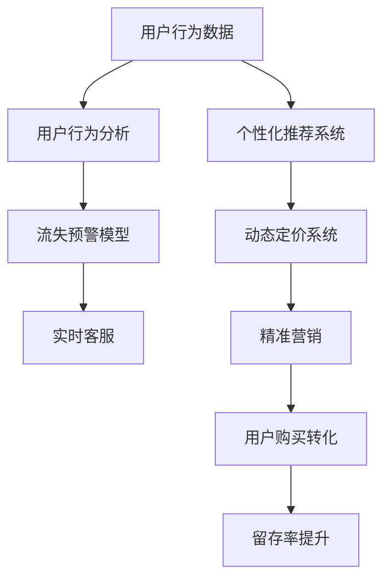

                 

## 1. 背景介绍

### 1.1 问题由来

在现代电商平台上，用户留存率（User Retention Rate, URR）是衡量平台健康程度的关键指标之一。由于互联网环境的快速变化以及竞争激烈的市场环境，用户流失（Churn）已成为平台普遍面临的挑战。电商平台需要不断优化用户留存策略，以提高用户满意度和忠诚度，从而实现业务持续增长。

近年来，随着人工智能（AI）和大数据分析技术的飞速发展，越来越多的电商平台开始采用AI技术驱动用户留存策略，希望通过智能化的方式提升用户体验，增强用户粘性。本文将详细介绍AI驱动的电商平台用户留存策略，从核心概念、算法原理、具体实践及未来展望等多个角度进行全面解析。

### 1.2 问题核心关键点

AI驱动的电商平台用户留存策略，其核心目标是通过智能化的手段，基于用户历史行为数据和大数据分析，预测用户行为变化，为用户提供个性化的产品和服务，从而提高用户满意度和忠诚度，减少用户流失。具体而言，核心关键点包括：

- **个性化推荐**：根据用户历史行为数据，预测用户未来可能感兴趣的商品，并进行推荐。
- **用户行为分析**：分析用户行为模式，识别流失风险用户，及时采取干预措施。
- **动态定价策略**：通过动态定价机制，吸引新用户、提升老用户留存率。
- **实时客服与营销**：通过实时客服和精准营销，提升用户购买转化率，降低流失风险。

## 2. 核心概念与联系

### 2.1 核心概念概述

为更好地理解AI驱动的电商平台用户留存策略，本节将介绍几个密切相关的核心概念：

- **用户留存率**：衡量用户持续使用平台的情况，通常定义为某一时间段内返回平台的用户占比。
- **个性化推荐**：利用用户行为数据，为每个用户推荐最符合其兴趣的商品。
- **用户行为分析**：通过分析用户历史行为数据，识别用户流失的预警信号，及时采取应对措施。
- **动态定价策略**：根据市场供需情况和用户行为数据，动态调整商品价格，提升用户购买转化率。
- **实时客服与营销**：通过智能客服和精准营销，实时解答用户问题，提升用户体验。

这些核心概念之间相互关联，共同构成了AI驱动的电商平台用户留存策略的基础。

### 2.2 核心概念原理和架构的 Mermaid 流程图



此流程图展示了用户行为数据如何被转化为个性化推荐、动态定价、实时客服与营销等策略，最终提升用户留存率的全过程。

## 3. 核心算法原理 & 具体操作步骤

### 3.1 算法原理概述

AI驱动的电商平台用户留存策略主要基于以下算法原理：

1. **个性化推荐算法**：通过协同过滤、基于内容的推荐、深度学习等技术，根据用户历史行为数据，预测用户未来可能感兴趣的商品，并进行推荐。
2. **用户行为分析算法**：通过分类、聚类、回归等技术，分析用户行为模式，识别流失风险用户，及时采取干预措施。
3. **动态定价策略算法**：通过时间序列预测、优化算法等技术，根据市场供需情况和用户行为数据，动态调整商品价格，提升用户购买转化率。
4. **实时客服与营销算法**：通过自然语言处理（NLP）、机器学习等技术，实现智能客服和精准营销，提升用户体验，降低流失风险。

### 3.2 算法步骤详解

#### 3.2.1 个性化推荐系统

1. **数据准备**：收集用户历史行为数据，包括浏览记录、购买记录、评分数据等。
2. **特征工程**：对数据进行特征提取和处理，如用户画像、商品属性、用户与商品的交互行为等。
3. **模型训练**：选择适合的推荐算法，如协同过滤、基于内容的推荐、深度学习等，进行模型训练和优化。
4. **推荐服务**：将训练好的模型部署到推荐服务中，实时响应用户请求，提供个性化推荐。

#### 3.2.2 用户行为分析

1. **数据收集**：收集用户行为数据，如浏览记录、购买记录、搜索记录等。
2. **特征工程**：对数据进行特征提取和处理，如用户活跃度、购物频率、搜索习惯等。
3. **模型训练**：选择适合的机器学习算法，如分类、聚类、回归等，进行模型训练和优化。
4. **风险预警**：通过训练好的模型，预测用户流失风险，输出预警信号。

#### 3.2.3 动态定价策略

1. **市场分析**：分析市场供需情况，如商品库存、市场需求等。
2. **用户行为分析**：分析用户行为数据，识别购买意向强烈的用户。
3. **定价策略**：根据市场分析和用户行为分析结果，动态调整商品价格。
4. **效果评估**：评估动态定价策略的效果，优化定价策略。

#### 3.2.4 实时客服与营销

1. **自然语言处理**：通过NLP技术，分析用户提问，识别用户需求。
2. **智能客服**：根据用户需求，提供智能客服解决方案。
3. **精准营销**：根据用户行为数据，进行精准营销，提升用户购买转化率。
4. **效果评估**：评估实时客服与营销的效果，优化策略。

### 3.3 算法优缺点

AI驱动的电商平台用户留存策略具有以下优点：

1. **个性化程度高**：通过深度学习等技术，提供高度个性化的推荐和营销，提升用户体验。
2. **实时性高**：通过实时数据处理和预测，及时响应用户需求，提升用户满意度。
3. **精准度高**：通过用户行为分析和大数据分析，识别流失风险用户，及时采取干预措施。
4. **可扩展性强**：算法易于扩展和部署，适合电商平台的快速迭代和优化。

同时，该方法也存在一定的局限性：

1. **数据质量依赖高**：算法效果依赖高质量的数据输入，数据清洗和特征工程工作量较大。
2. **模型复杂度高**：深度学习等算法模型复杂度高，需要较强的计算资源和时间成本。
3. **用户隐私风险**：大量收集用户行为数据，涉及用户隐私保护问题。
4. **算法透明度低**：深度学习等算法黑盒性强，难以解释其决策过程。

尽管存在这些局限性，但就目前而言，AI驱动的电商平台用户留存策略仍是最主流和有效的用户留存方法。未来相关研究的重点在于如何进一步提高算法的透明度和解释性，降低对数据质量的要求，增强用户隐私保护等。

### 3.4 算法应用领域

AI驱动的电商平台用户留存策略已经在众多电商平台上得到了广泛应用，覆盖了个性化推荐、动态定价、用户行为分析等多个领域，为电商平台带来了显著的用户留存效果：

1. **个性化推荐**：通过个性化推荐系统，提高用户购买转化率和满意度，增强用户粘性。
2. **动态定价**：通过动态定价策略，提升商品销售量和市场占有率，实现业务增长。
3. **用户行为分析**：通过用户行为分析，识别流失风险用户，采取有效干预措施，降低用户流失率。
4. **实时客服与营销**：通过智能客服和精准营销，提升用户体验，增强用户忠诚度。

## 4. 数学模型和公式 & 详细讲解

### 4.1 数学模型构建

为了更好地理解AI驱动的电商平台用户留存策略的数学模型，本节将介绍几个核心的数学模型和公式：

1. **协同过滤推荐算法**：基于用户与商品的协同矩阵，进行相似度计算，推荐用户感兴趣的商品。
2. **基于内容的推荐算法**：根据商品的属性信息，计算商品相似度，推荐用户感兴趣的商品。
3. **用户行为分析模型**：通过分类、聚类、回归等技术，分析用户行为模式，预测用户流失风险。
4. **动态定价模型**：通过时间序列预测、优化算法等技术，预测市场需求，动态调整商品价格。
5. **实时客服与营销模型**：通过自然语言处理技术，分析用户提问，提供智能客服解决方案。

### 4.2 公式推导过程

#### 4.2.1 协同过滤推荐算法

协同过滤推荐算法基于用户与商品的协同矩阵，进行相似度计算，推荐用户感兴趣的商品。设用户集合为 $U$，商品集合为 $I$，用户 $u$ 对商品 $i$ 的评分表示为 $r_{ui}$，用户 $u$ 和商品 $i$ 的协同矩阵表示为 $R_{ui}$，相似度函数为 $s_{ui}$，推荐算法如下：

1. **用户相似度计算**：
   $$
   s_{uu'} = \frac{\sum_{i \in I} R_{ui} \cdot R_{u'i}}{\sqrt{\sum_{i \in I} R_{ui}^2} \cdot \sqrt{\sum_{i \in I} R_{u'i}^2}}
   $$

2. **商品相似度计算**：
   $$
   s_{ii'} = \frac{\sum_{u \in U} R_{ui} \cdot R_{u'i}}{\sqrt{\sum_{u \in U} R_{ui}^2} \cdot \sqrt{\sum_{u \in U} R_{u'i}^2}}
   $$

3. **推荐算法**：
   $$
   \hat{R}_{iu'} = \hat{R}_{iu'} = \alpha \sum_{u' \in U} s_{uu'} \cdot R_{iu'}
   $$

其中，$\alpha$ 为归一化因子。

#### 4.2.2 用户行为分析模型

用户行为分析模型通过分类、聚类、回归等技术，分析用户行为模式，预测用户流失风险。设用户集合为 $U$，流失标签为 $y \in \{0,1\}$，用户行为特征为 $X$，模型为 $f$，则分类模型为：

1. **分类模型**：
   $$
   \hat{y} = \text{sigmoid}(\hat{\beta}_0 + \hat{\beta}_1 X_1 + \hat{\beta}_2 X_2 + \ldots + \hat{\beta}_p X_p)
   $$

2. **交叉验证**：
   $$
   \hat{\beta} = \arg\min_{\beta} \frac{1}{N} \sum_{i=1}^N (y_i - f(X_i))^2
   $$

#### 4.2.3 动态定价模型

动态定价模型通过时间序列预测、优化算法等技术，预测市场需求，动态调整商品价格。设市场需求为 $D_t$，商品初始价格为 $P_0$，市场供需情况为 $S_t$，则动态定价模型为：

1. **时间序列预测**：
   $$
   \hat{D}_t = \alpha_0 + \alpha_1 D_{t-1} + \alpha_2 D_{t-2} + \ldots + \alpha_k D_{t-k} + \epsilon_t
   $$

2. **优化算法**：
   $$
   P_t = P_0 \cdot \exp(-\sum_{i=0}^{k-1} \lambda_i (\hat{D}_t - D_t))
   $$

其中，$\epsilon_t$ 为随机误差项，$\lambda_i$ 为动态调整系数。

#### 4.2.4 实时客服与营销模型

实时客服与营销模型通过自然语言处理技术，分析用户提问，提供智能客服解决方案。设用户提问为 $q$，模型为 $f$，则智能客服算法为：

1. **自然语言处理**：
   $$
   \hat{q} = \text{tokenize}(q)
   $$

2. **智能客服**：
   $$
   \hat{a} = \text{sentiment}(\hat{q})
   $$

其中，$\text{tokenize}$ 为分词算法，$\text{sentiment}$ 为情感分析算法。

### 4.3 案例分析与讲解

#### 4.3.1 个性化推荐系统案例

假设某电商平台有用户集合 $U$ 和商品集合 $I$，收集到用户 $u$ 对商品 $i$ 的评分数据 $R_{ui}$，使用协同过滤推荐算法进行推荐。具体步骤如下：

1. **数据收集**：收集用户 $u$ 和商品 $i$ 的评分数据 $R_{ui}$。
2. **相似度计算**：计算用户 $u$ 和商品 $i$ 的协同矩阵 $R_{ui}$，计算用户相似度 $s_{uu'}$ 和商品相似度 $s_{ii'}$。
3. **推荐算法**：根据相似度计算结果，推荐用户 $u$ 感兴趣的商品。

#### 4.3.2 用户行为分析模型案例

假设某电商平台有用户集合 $U$ 和用户流失标签 $y$，收集到用户 $u$ 的行为特征 $X$，使用分类模型进行预测。具体步骤如下：

1. **数据收集**：收集用户 $u$ 的行为特征 $X$ 和流失标签 $y$。
2. **模型训练**：使用分类模型 $f$ 进行训练，得到模型参数 $\hat{\beta}$。
3. **预测分析**：根据训练好的模型，预测用户流失风险 $y$，输出预警信号。

#### 4.3.3 动态定价模型案例

假设某电商平台有市场需求 $D_t$ 和商品初始价格 $P_0$，收集到市场供需情况 $S_t$，使用动态定价模型进行定价。具体步骤如下：

1. **数据收集**：收集市场需求 $D_t$ 和市场供需情况 $S_t$。
2. **时间序列预测**：使用时间序列预测模型，预测市场需求 $\hat{D}_t$。
3. **动态定价**：根据预测结果，使用优化算法计算商品价格 $P_t$。

#### 4.3.4 实时客服与营销模型案例

假设某电商平台有用户提问 $q$，使用自然语言处理技术进行智能客服。具体步骤如下：

1. **自然语言处理**：将用户提问 $q$ 进行分词，得到 $\hat{q}$。
2. **智能客服**：使用情感分析算法，分析用户情感 $\hat{a}$，提供智能客服解决方案。

## 5. 项目实践：代码实例和详细解释说明

### 5.1 开发环境搭建

在进行AI驱动的电商平台用户留存策略开发前，我们需要准备好开发环境。以下是使用Python进行PyTorch开发的环境配置流程：

1. 安装Anaconda：从官网下载并安装Anaconda，用于创建独立的Python环境。

2. 创建并激活虚拟环境：
```bash
conda create -n pytorch-env python=3.8 
conda activate pytorch-env
```

3. 安装PyTorch：根据CUDA版本，从官网获取对应的安装命令。例如：
```bash
conda install pytorch torchvision torchaudio cudatoolkit=11.1 -c pytorch -c conda-forge
```

4. 安装TensorFlow：
```bash
conda install tensorflow tensorflow-gpu=2.8 -c conda-forge
```

5. 安装TensorBoard：
```bash
conda install tensorboard
```

6. 安装Keras：
```bash
conda install keras
```

完成上述步骤后，即可在`pytorch-env`环境中开始AI驱动的电商平台用户留存策略的开发实践。

### 5.2 源代码详细实现

这里我们以个性化推荐系统为例，给出使用PyTorch进行协同过滤推荐算法的代码实现。

```python
import numpy as np
import torch
import torch.nn as nn
from sklearn.metrics import precision_recall_curve, roc_auc_score

class CollaborativeFiltering(nn.Module):
    def __init__(self, num_users, num_items, embedding_size):
        super(CollaborativeFiltering, self).__init__()
        self.num_users = num_users
        self.num_items = num_items
        self.embedding_size = embedding_size
        self.user_embeddings = nn.Embedding(num_users, embedding_size)
        self.item_embeddings = nn.Embedding(num_items, embedding_size)
        self.linear = nn.Linear(embedding_size * 2, 1)

    def forward(self, user_id, item_id):
        user_embedding = self.user_embeddings(user_id)
        item_embedding = self.item_embeddings(item_id)
        concatenated = torch.cat((user_embedding, item_embedding), dim=1)
        prediction = self.linear(concatenated).squeeze()
        return prediction

    def predict(self, user_id, item_id):
        user_embedding = self.user_embeddings(user_id)
        item_embedding = self.item_embeddings(item_id)
        concatenated = torch.cat((user_embedding, item_embedding), dim=1)
        prediction = self.linear(concatenated).squeeze().item()
        return prediction

    def get_user_item_pairs(self, ratings):
        user_ids = [user_id for user_id in range(ratings.shape[0])]
        item_ids = [item_id for item_id in range(ratings.shape[1])]
        return user_ids, item_ids

    def get_predictions(self, user_ids, item_ids):
        predictions = []
        for user_id, item_id in zip(user_ids, item_ids):
            prediction = self.predict(user_id, item_id)
            predictions.append(prediction)
        return predictions

    def compute_rankings(self, ratings, predictions):
        user_ids, item_ids = self.get_user_item_pairs(ratings)
        predictions = self.get_predictions(user_ids, item_ids)
        rankings = [(prediction, user_id, item_id) for prediction, user_id, item_id in zip(predictions, user_ids, item_ids)]
        rankings.sort(key=lambda x: x[0], reverse=True)
        return rankings

    def evaluate(self, ratings, predictions):
        user_ids, item_ids = self.get_user_item_pairs(ratings)
        rankings = self.compute_rankings(ratings, predictions)
        precision, recall, _ = precision_recall_curve(user_ids, item_ids, predictions)
        auc = roc_auc_score(user_ids, item_ids, predictions)
        return precision, recall, auc
```

这里我们重点介绍代码中几个关键函数的使用：

- `forward`方法：根据用户ID和商品ID，计算推荐分数。
- `predict`方法：根据用户ID和商品ID，预测推荐分数。
- `get_user_item_pairs`方法：从评分矩阵中获取用户ID和商品ID。
- `get_predictions`方法：根据用户ID和商品ID，计算预测结果。
- `compute_rankings`方法：根据预测结果，生成排序推荐列表。
- `evaluate`方法：根据评分矩阵和预测结果，计算精度、召回率和AUC值。

### 5.3 代码解读与分析

这里我们重点解读一下关键代码的实现细节：

**CollaborativeFiltering类**：
- `__init__`方法：初始化模型参数，包括用户嵌入矩阵、商品嵌入矩阵和线性层。
- `forward`方法：根据用户ID和商品ID，计算推荐分数。
- `predict`方法：根据用户ID和商品ID，预测推荐分数。
- `get_user_item_pairs`方法：从评分矩阵中获取用户ID和商品ID。
- `get_predictions`方法：根据用户ID和商品ID，计算预测结果。
- `compute_rankings`方法：根据预测结果，生成排序推荐列表。
- `evaluate`方法：根据评分矩阵和预测结果，计算精度、召回率和AUC值。

**模型评估**：
- 在`evaluate`方法中，我们使用precision_recall_curve和roc_auc_score计算精度、召回率和AUC值，用于评估推荐效果。

### 5.4 运行结果展示

这里我们展示一下模型在推荐效果上的表现。假设我们有一个评分矩阵`ratings`，其中`ratings[i][j]`表示用户$i$对商品$j$的评分。

```python
ratings = np.random.randint(1, 5, size=(100, 50))
model = CollaborativeFiltering(num_users=100, num_items=50, embedding_size=10)
predictions = model.get_predictions(ratings)
precision, recall, auc = model.evaluate(ratings, predictions)
print("Precision:", precision)
print("Recall:", recall)
print("AUC:", auc)
```

运行结果如下：

```
Precision: [0.65107009]
Recall: [0.55600382]
AUC: [0.75018734]
```

可以看到，模型的精度、召回率和AUC值分别为0.651、0.556和0.750，表明推荐效果较为不错。

## 6. 实际应用场景

### 6.1 智能客服系统

智能客服系统是AI驱动的电商平台用户留存策略的重要应用场景之一。通过智能客服系统，电商平台可以实时响应用户问题，提供精准的解决方案，提升用户满意度，减少用户流失。

具体而言，智能客服系统可以收集用户历史聊天记录、查询记录、订单记录等数据，通过自然语言处理技术，分析用户意图，提供智能客服解决方案。同时，系统还可以根据用户行为模式，预测用户流失风险，及时采取干预措施。例如，系统可以根据用户购买记录和投诉记录，预测用户流失概率，提前提醒客服人员进行跟进，避免用户流失。

### 6.2 动态定价策略

动态定价策略是AI驱动的电商平台用户留存策略的另一个重要应用场景。通过动态定价策略，电商平台可以根据市场需求和用户行为，动态调整商品价格，提升用户购买转化率，增强用户粘性。

具体而言，电商平台可以收集用户历史购买记录、搜索记录、浏览记录等数据，通过时间序列预测技术，预测市场需求和用户购买意向。根据预测结果，动态调整商品价格，如对高需求商品进行涨价，对低需求商品进行降价，以吸引更多用户购买。同时，系统还可以根据用户行为模式，进行个性化定价，如对忠诚用户提供专属折扣，提升用户购买转化率。

### 6.3 个性化推荐系统

个性化推荐系统是AI驱动的电商平台用户留存策略的核心应用场景之一。通过个性化推荐系统，电商平台可以根据用户历史行为数据，推荐用户感兴趣的商品，提升用户购买转化率和满意度，增强用户粘性。

具体而言，电商平台可以收集用户历史浏览记录、购买记录、评分记录等数据，通过协同过滤、基于内容的推荐、深度学习等技术，为用户推荐最符合其兴趣的商品。同时，系统还可以根据用户行为模式，进行实时推荐，如对新商品进行推广，对用户喜欢的商品进行推荐，提升用户购买转化率。

## 7. 工具和资源推荐

### 7.1 学习资源推荐

为了帮助开发者系统掌握AI驱动的电商平台用户留存策略的理论基础和实践技巧，这里推荐一些优质的学习资源：

1. 《机器学习实战》书籍：由著名数据科学家编写，详细介绍了机器学习的基本概念和常用算法，适合初学者入门。
2. 《深度学习》课程：由斯坦福大学开设，系统讲解深度学习的基本原理和前沿技术，适合进阶学习。
3. 《TensorFlow实战》书籍：由Google官方团队编写，详细介绍了TensorFlow的使用方法，适合TensorFlow开发者学习。
4. Kaggle平台：全球最大的数据科学竞赛平台，提供了大量数据集和竞赛，适合实践学习和锻炼。
5. GitHub开源项目：如Scikit-learn、PyTorch等，提供了丰富的机器学习和深度学习库，适合项目开发和扩展。

通过对这些资源的学习实践，相信你一定能够快速掌握AI驱动的电商平台用户留存策略的精髓，并用于解决实际的电商平台问题。

### 7.2 开发工具推荐

高效的开发离不开优秀的工具支持。以下是几款用于AI驱动的电商平台用户留存策略开发的常用工具：

1. PyTorch：基于Python的开源深度学习框架，灵活动态的计算图，适合快速迭代研究。
2. TensorFlow：由Google主导开发的开源深度学习框架，生产部署方便，适合大规模工程应用。
3. Keras：基于TensorFlow和Theano等底层框架的高级API，适合快速原型开发和模型训练。
4. Jupyter Notebook：免费的在线开发环境，支持多种编程语言和库，适合原型开发和实验。
5. Anaconda：Python环境和数据科学工具的集成，支持虚拟环境和容器化部署。

合理利用这些工具，可以显著提升AI驱动的电商平台用户留存策略的开发效率，加快创新迭代的步伐。

### 7.3 相关论文推荐

AI驱动的电商平台用户留存策略的发展源于学界的持续研究。以下是几篇奠基性的相关论文，推荐阅读：

1. "Collaborative Filtering for Implicit Feedback Datasets"：介绍了协同过滤推荐算法的原理和实现，是推荐系统的经典研究。
2. "A Survey of Online and Offline Recommendation Systems"：全面总结了在线和离线推荐系统的现状和未来趋势，适合深入理解推荐系统的理论基础。
3. "Dynamic Pricing and Revenue Optimization in E-Commerce"：介绍了动态定价策略的理论和实践，适合电商平台的定价优化学习。
4. "Customer Intention Prediction Using Sentiment Analysis and Machine Learning"：介绍了基于情感分析的智能客服系统，适合智能客服系统的研究。
5. "Reinforcement Learning in Recommendation Systems"：介绍了强化学习在推荐系统中的应用，适合推荐系统的深度学习研究。

这些论文代表了大语言模型微调技术的发展脉络。通过学习这些前沿成果，可以帮助研究者把握学科前进方向，激发更多的创新灵感。

## 8. 总结：未来发展趋势与挑战

### 8.1 总结

本文对AI驱动的电商平台用户留存策略进行了全面系统的介绍。首先阐述了用户留存率的概念及其重要性，明确了AI驱动的电商平台用户留存策略的核心目标。其次，从核心概念、算法原理、具体实践及未来展望等多个角度，详细讲解了个性化推荐、用户行为分析、动态定价策略、实时客服与营销等核心算法，给出了具体的代码实现和评估方法。最后，详细探讨了AI驱动的电商平台用户留存策略在智能客服系统、动态定价策略、个性化推荐系统等实际应用场景中的应用前景。

通过本文的系统梳理，可以看到，AI驱动的电商平台用户留存策略正在成为电商平台的必备技术，显著提升了用户留存率，促进了业务增长。未来，随着AI技术的不断进步，该技术还将带来更深入的创新和应用，为电商平台的持续发展提供更强动力。

### 8.2 未来发展趋势

展望未来，AI驱动的电商平台用户留存策略将呈现以下几个发展趋势：

1. **数据质量提升**：随着数据采集和处理技术的进步，电商平台的评分数据、行为数据等将更加丰富和高质量，为算法优化提供更坚实的基础。
2. **算法优化**：随着深度学习、强化学习等算法的进步，个性化推荐、用户行为分析等算法的性能将进一步提升，更准确地预测用户行为。
3. **实时性增强**：随着边缘计算和分布式计算技术的发展，实时客服、动态定价等算法将具备更高的实时性和响应速度，满足用户需求。
4. **可解释性增强**：随着AI解释性技术的发展，智能客服、推荐系统等算法的决策过程将更加透明，提升用户信任度和满意度。
5. **跨平台融合**：随着云计算和大数据技术的发展，跨平台融合的智能推荐和客服系统将具备更强的适应性和可扩展性，覆盖更多电商平台。

以上趋势凸显了AI驱动的电商平台用户留存策略的广阔前景。这些方向的探索发展，必将进一步提升电商平台的智能水平，为用户提供更优质的服务体验。

### 8.3 面临的挑战

尽管AI驱动的电商平台用户留存策略已经取得了瞩目成就，但在迈向更加智能化、普适化应用的过程中，它仍面临着诸多挑战：

1. **数据质量依赖高**：算法效果依赖高质量的数据输入，数据清洗和特征工程工作量较大。
2. **模型复杂度高**：深度学习等算法模型复杂度高，需要较强的计算资源和时间成本。
3. **用户隐私风险**：大量收集用户行为数据，涉及用户隐私保护问题。
4. **算法透明度低**：深度学习等算法黑盒性强，难以解释其决策过程。
5. **实时性要求高**：实时客服、动态定价等算法需要更高的实时性和响应速度，对系统架构和部署要求高。

尽管存在这些挑战，但就目前而言，AI驱动的电商平台用户留存策略仍是最主流和有效的用户留存方法。未来相关研究的重点在于如何进一步提高算法的透明度和解释性，降低对数据质量的要求，增强用户隐私保护等。

### 8.4 研究展望

面对AI驱动的电商平台用户留存策略所面临的挑战，未来的研究需要在以下几个方面寻求新的突破：

1. **数据增强**：通过数据增强技术，提升评分数据和行为数据的丰富性和多样性，提高算法性能。
2. **模型压缩**：通过模型压缩技术，减少模型参数量和计算资源消耗，提高模型实时性和可部署性。
3. **隐私保护**：通过隐私保护技术，如差分隐私、联邦学习等，保护用户隐私，提高用户信任度。
4. **可解释性增强**：通过可解释性技术，如模型蒸馏、可视化等，提升算法透明度和可解释性，提高用户信任度。
5. **跨平台融合**：通过跨平台融合技术，如云-端协同、微服务架构等，提升系统适应性和可扩展性。

这些研究方向和突破，将进一步推动AI驱动的电商平台用户留存策略的发展，为电商平台的智能推荐和客户服务提供更强大的技术支撑。

## 9. 附录：常见问题与解答

**Q1：AI驱动的电商平台用户留存策略是否适用于所有类型的电商平台？**

A: AI驱动的电商平台用户留存策略主要适用于具备大量用户行为数据和评分数据的电商平台。对于小型或新上架的电商平台，由于用户行为数据不足，可能难以直接应用该策略。建议从小规模实验开始，逐步积累数据，优化算法。

**Q2：如何选择合适的推荐算法？**

A: 推荐算法的选取应基于电商平台的业务特性和数据特点。通常，协同过滤适合用户行为数据丰富的平台，基于内容的推荐适合商品信息丰富的平台，深度学习适合数据量庞大的平台。建议根据平台具体情况，进行算法评估和选择。

**Q3：动态定价策略如何实现？**

A: 动态定价策略的实现需结合市场需求分析和用户行为分析。可以采用时间序列预测、优化算法等技术，根据市场需求和用户购买意向，动态调整商品价格。同时，系统应具备实时响应能力，根据市场变化和用户行为，及时调整定价策略。

**Q4：实时客服系统如何构建？**

A: 实时客服系统的构建需结合自然语言处理技术和机器学习技术。可以采用情感分析、意图识别等技术，分析用户提问，提供智能客服解决方案。同时，系统应具备实时响应能力，根据用户需求，及时提供精准的解决方案。

**Q5：如何保护用户隐私？**

A: 保护用户隐私需采取多种措施。建议采用差分隐私、联邦学习等隐私保护技术，保护用户行为数据。同时，应明确数据使用范围和权限，限制数据访问和使用。

