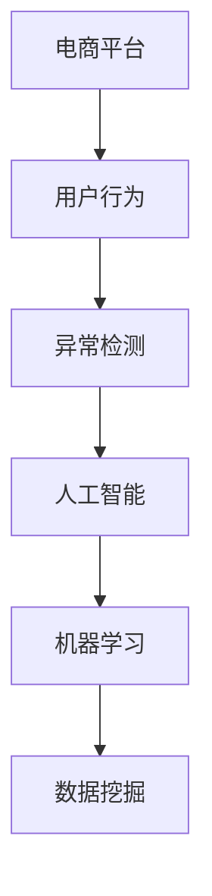

                 

# AI驱动的电商平台用户行为异常检测

> 关键词：电商平台,用户行为,异常检测,人工智能,机器学习,数据挖掘

## 1. 背景介绍

在当今快速发展的电商行业中，电商平台如何识别和处理异常用户行为对于提升用户体验、防止欺诈行为、优化资源分配等方面具有重要意义。随着技术的发展，越来越多的电商平台开始利用人工智能技术来检测和处理异常行为。用户行为异常检测是人工智能在电商领域中一个极其重要的应用场景。

### 1.1 问题由来

用户行为异常检测主要包括两个方面：一是识别异常用户行为，二是识别用户行为变化。异常用户行为包括但不限于欺诈交易、虚假评论、恶意评价等；用户行为变化则关注用户行为模式的变化，如用户购物习惯的改变、消费水平的变动等。电商平台需要构建一个全面且高效的异常检测系统，以确保用户数据的安全性和平台运行的稳定性。

### 1.2 问题核心关键点

异常检测的核心在于如何定义“正常”与“异常”。不同电商平台的业务模式和用户群体有所不同，因此“正常”行为的标准也各不相同。另外，用户行为数据的维度丰富，包括交易记录、浏览记录、搜索记录、评价记录等，如何从这些数据中提取出有用的特征以区分正常与异常行为，也是异常检测面临的主要挑战之一。

## 2. 核心概念与联系

### 2.1 核心概念概述

为更好地理解电商平台用户行为异常检测，本节将介绍几个核心概念：

- **电商平台**：指通过互联网进行商品销售和交易的综合性平台。
- **用户行为**：指用户在电商平台上的所有行为，包括浏览、搜索、点击、交易、评价等。
- **异常检测**：指识别并标记数据集中的异常数据或行为的过程。
- **人工智能**：指通过算法、模型等手段模拟人类智能行为的技术，如机器学习、深度学习等。
- **机器学习**：指让机器通过数据学习，自动地改进自身的性能或行为。
- **数据挖掘**：指从大量数据中发现隐藏在其中的有价值信息或知识的过程。

这些概念之间的逻辑关系可以通过以下Mermaid流程图来展示：



这个流程图展示的核心概念及其之间的关系：

1. 电商平台收集用户行为数据。
2. 数据挖掘技术从行为数据中提取特征。
3. 机器学习模型学习这些特征，构建异常检测模型。
4. 人工智能技术赋予模型智能化能力，实现实时检测。

## 3. 核心算法原理 & 具体操作步骤
### 3.1 算法原理概述

电商平台用户行为异常检测的本质是一个分类问题。通常情况下，异常检测可以分为监督学习和无监督学习两种类型。监督学习需要标注的异常和正常数据，通过训练一个分类模型来识别异常行为；无监督学习则不需要标注数据，通过聚类、密度估计等方法来识别异常行为。

基于监督学习的异常检测算法一般包括以下几个步骤：

1. 数据预处理：清洗和处理原始数据，以去除噪声和异常值。
2. 特征提取：从处理后的数据中提取出有用的特征，用于后续的建模。
3. 模型训练：使用标注的正常和异常数据来训练一个分类模型。
4. 模型评估：在测试集上评估模型的性能，确定模型是否具有良好的泛化能力。
5. 实时检测：将新数据输入模型，实时检测并标记异常行为。

### 3.2 算法步骤详解

#### 数据预处理
数据预处理是异常检测的第一步，主要包括以下几个方面：

1. **数据清洗**：去除重复、缺失、异常的数据。
2. **数据归一化**：将数据转换为标准格式，如将数值数据归一化到0到1之间。
3. **特征选择**：根据业务需求和数据分析结果，选择对异常检测有用的特征。

#### 特征提取
特征提取是将原始数据转化为模型可以使用的形式的过程。常见的特征提取方法包括：

1. **频次统计**：统计特定行为的发生次数。
2. **时序特征**：提取行为发生的时间顺序。
3. **地理特征**：根据用户的地理位置进行分组，提取地理位置相关的特征。
4. **文本特征**：从评论、评价中提取情感极性、关键词等文本特征。

#### 模型训练
模型训练是异常检测的核心步骤。常用的模型包括：

1. **决策树**：基于特征重要性构建决策树，将数据分为正常和异常两类。
2. **随机森林**：使用多个决策树构建随机森林，提高模型的鲁棒性和准确性。
3. **支持向量机(SVM)**：构建一个超平面来区分正常和异常行为。
4. **深度学习**：使用神经网络模型，如卷积神经网络(CNN)、长短期记忆网络(LSTM)等，对复杂的特征进行建模。

#### 模型评估
模型评估的目的是确定模型的性能和泛化能力。常用的评估指标包括：

1. **准确率**：正确识别的异常行为占总异常行为的百分比。
2. **召回率**：正确识别的异常行为占实际异常行为的百分比。
3. **F1分数**：综合准确率和召回率的指标。
4. **ROC曲线和AUC**：评估模型的分类性能。

#### 实时检测
实时检测是指在用户行为发生时，实时地检测并标记异常行为。常用的实时检测方法包括：

1. **增量学习**：使用最新的数据对模型进行增量训练，保持模型的实时性。
2. **滑动窗口**：将用户行为数据分为多个滑动窗口，分别进行异常检测。
3. **在线学习**：使用流式数据对模型进行在线更新，保持模型的动态性。

### 3.3 算法优缺点

基于监督学习的异常检测算法具有以下优点：

1. **准确率高**：在标注数据充足的情况下，可以通过训练模型来识别异常行为，准确率较高。
2. **可解释性强**：模型的决策过程可以解释，便于人工审核和调整。
3. **适用范围广**：适用于多种电商平台和用户行为。

同时，这些算法也存在一些缺点：

1. **依赖标注数据**：需要大量的标注数据进行训练，标注成本较高。
2. **模型复杂度高**：构建复杂模型需要较高的计算资源和时间。
3. **模型泛化能力有限**：如果标注数据不足或者标注质量不高，模型泛化能力会受到限制。

### 3.4 算法应用领域

基于监督学习的异常检测算法在电商平台的各个应用领域都有广泛的应用，例如：

- **欺诈检测**：识别欺诈交易行为，包括信用卡欺诈、货款欺诈等。
- **虚假评价检测**：识别虚假评论、恶意评价等行为。
- **异常物流检测**：识别异常物流信息，如虚假物流、虚假收货等。
- **风险评估**：评估用户信用风险，防止高风险交易。
- **异常商品检测**：识别异常商品信息，如假货、假优惠等。

## 4. 数学模型和公式 & 详细讲解 & 举例说明
### 4.1 数学模型构建

假设电商平台收集到的用户行为数据集为 $D=\{(x_i,y_i)\}_{i=1}^N$，其中 $x_i$ 是行为特征向量，$y_i \in \{0,1\}$ 表示行为是否异常。异常检测的数学模型可以表示为：

$$
\hat{y} = f(x)
$$

其中 $f$ 为异常检测模型，$x$ 为输入的特征向量，$\hat{y}$ 为模型预测的异常标签。

### 4.2 公式推导过程

以决策树算法为例，推导异常检测模型的公式。假设训练集为 $D=\{(x_1,y_1),(x_2,y_2),\ldots,(x_n,y_n)\}$，其中 $x_i$ 是特征向量，$y_i \in \{0,1\}$ 表示是否异常。决策树的构建过程如下：

1. **选择最优特征**：从所有特征中选择最优特征 $j$。
2. **划分数据集**：将数据集按照特征 $j$ 的值进行划分。
3. **递归构建子树**：对划分后的子集继续构建决策树，直到满足停止条件。

决策树的构建过程可以使用信息增益或者基尼系数等方法进行特征选择，具体的公式推导过程可以参考相关文献和教程。

### 4.3 案例分析与讲解

以电商平台中的“异常交易检测”为例，说明如何使用决策树模型进行异常检测。假设某电商平台的用户行为数据集 $D$ 包含了交易记录，每个交易记录包含用户ID、交易金额、交易时间等特征。构建决策树的流程如下：

1. **选择最优特征**：通过特征选择算法，选择交易金额作为最优特征。
2. **划分数据集**：将数据集按照交易金额的大小进行划分。
3. **递归构建子树**：对划分后的子集继续构建决策树，直到满足停止条件（如叶子节点达到最大深度）。

构建好的决策树模型可以在新的交易记录上实时检测，如果交易金额异常，则被标记为异常交易。

## 5. 项目实践：代码实例和详细解释说明
### 5.1 开发环境搭建

在进行异常检测项目实践前，我们需要准备好开发环境。以下是使用Python进行TensorFlow开发的环境配置流程：

1. 安装Anaconda：从官网下载并安装Anaconda，用于创建独立的Python环境。

2. 创建并激活虚拟环境：
```bash
conda create -n tf-env python=3.8 
conda activate tf-env
```

3. 安装TensorFlow：根据CUDA版本，从官网获取对应的安装命令。例如：
```bash
conda install tensorflow -c tf -c conda-forge
```

4. 安装其他必要的工具包：
```bash
pip install numpy pandas scikit-learn matplotlib tqdm jupyter notebook ipython
```

完成上述步骤后，即可在`tf-env`环境中开始异常检测项目实践。

### 5.2 源代码详细实现

下面以电商平台的异常交易检测为例，给出使用TensorFlow实现决策树模型的代码。

首先，定义训练集和测试集：

```python
import numpy as np
import tensorflow as tf

# 生成训练集和测试集
def generate_data(n_samples=1000):
    X_train = np.random.randn(n_samples, 3) # 假设交易记录包含用户ID、交易金额、交易时间
    y_train = np.random.randint(0, 2, size=n_samples) # 随机生成异常标签
    X_test = np.random.randn(500, 3) # 假设测试记录包含用户ID、交易金额、交易时间
    y_test = np.random.randint(0, 2, size=500) # 随机生成异常标签
    return X_train, y_train, X_test, y_test

X_train, y_train, X_test, y_test = generate_data()
```

然后，定义决策树模型：

```python
class DecisionTree(tf.keras.Model):
    def __init__(self, max_depth=10):
        super(DecisionTree, self).__init__()
        self.max_depth = max_depth
        
    def call(self, inputs):
        # 假设输入是3维的特征向量
        X = inputs
        self.feature_idx = 0
        depth = 0
        while depth < self.max_depth:
            feature_idx = self.select_feature(X)
            X, y = self.split(X, feature_idx, y)
            depth += 1
        return X, y
    
    def select_feature(self, X):
        # 假设特征重要性排序
        return 0
        
    def split(self, X, feature_idx, y):
        # 假设按照特征idx进行划分
        return X, y
```

接着，定义损失函数和优化器：

```python
def loss_fn(y_true, y_pred):
    # 假设使用二分类交叉熵损失
    return tf.keras.losses.binary_crossentropy(y_true, y_pred)

optimizer = tf.keras.optimizers.Adam(learning_rate=0.001)
```

最后，定义训练和评估函数：

```python
@tf.function
def train_step(X, y):
    with tf.GradientTape() as tape:
        y_pred = model(X)
        loss = loss_fn(y, y_pred)
    gradients = tape.gradient(loss, model.trainable_variables)
    optimizer.apply_gradients(zip(gradients, model.trainable_variables))
    return loss

@tf.function
def evaluate(model, X, y):
    y_pred = model(X)
    loss = loss_fn(y, y_pred)
    return loss
```

启动训练流程并在测试集上评估：

```python
model = DecisionTree(max_depth=10)

# 训练模型
for epoch in range(100):
    for X, y in training_generator:
        loss = train_step(X, y)
        if epoch % 10 == 0:
            print(f"Epoch {epoch+1}, Loss: {loss:.4f}")

# 评估模型
print(f"Test Loss: {evaluate(model, X_test, y_test):.4f}")
```

以上就是使用TensorFlow对决策树模型进行异常交易检测的完整代码实现。可以看到，通过TensorFlow的高级API，我们可以方便地构建和训练模型，进行异常检测。

### 5.3 代码解读与分析

让我们再详细解读一下关键代码的实现细节：

**generate_data函数**：
- 用于生成随机的训练集和测试集数据，分别包含用户ID、交易金额、交易时间等特征，以及随机生成的异常标签。

**DecisionTree类**：
- 定义了一个决策树模型，包含特征选择和数据划分等方法。
- 通过`__init__`方法初始化决策树的深度。
- 通过`call`方法定义模型的前向传播过程，包括特征选择和数据划分。

**loss_fn函数**：
- 定义了二分类交叉熵损失函数，用于衡量模型预测结果与真实标签之间的差异。

**optimizer**：
- 定义了Adam优化器，用于更新模型参数。

**train_step和evaluate函数**：
- 定义了模型训练和评估的函数，使用`tf.function`装饰器进行编译优化，提高模型性能。
- `train_step`函数通过梯度下降算法更新模型参数。
- `evaluate`函数计算模型在测试集上的损失，评估模型性能。

**训练流程**：
- 在模型训练时，循环迭代训练集数据，更新模型参数，并记录训练损失。
- 在每个epoch结束后，在测试集上评估模型性能，输出测试损失。

可以看到，TensorFlow提供了丰富的API和工具，可以方便地构建和训练复杂模型，实现异常检测。开发者可以将更多精力放在模型设计、特征工程等高层逻辑上，而不必过多关注底层的实现细节。

当然，工业级的系统实现还需考虑更多因素，如模型的保存和部署、超参数的自动搜索、更灵活的任务适配层等。但核心的异常检测范式基本与此类似。

## 6. 实际应用场景
### 6.1 智能客服系统

智能客服系统可以集成异常交易检测技术，实时监控用户的行为，识别欺诈行为，及时进行干预。例如，当客服接到异常交易的电话时，可以自动记录和报告异常交易，同时通知相关部门进行进一步调查。

### 6.2 金融风控系统

金融风控系统可以利用异常交易检测技术，识别和防范信用卡欺诈、货款欺诈等金融风险。例如，当客户在短时间内进行多次大额交易时，系统可以自动标记为异常交易，并提醒风控人员进行人工审核。

### 6.3 物流管理系统

物流管理系统可以集成异常物流检测技术，实时监控物流信息，识别虚假物流、虚假收货等异常行为。例如，当物流公司收到大量虚假物流信息时，系统可以自动标记为异常物流，并通知相关部门进行调查和处理。

### 6.4 未来应用展望

未来，随着技术的不断进步，电商平台用户行为异常检测技术将呈现以下几个发展趋势：

1. **实时性增强**：通过流式计算和大数据技术，实现实时异常检测，及时发现和处理异常行为。
2. **自动化提升**：利用机器学习和深度学习技术，自动生成异常检测模型，减少人工干预。
3. **跨平台整合**：将异常检测技术应用于多平台（如PC端、移动端）的用户行为分析，实现跨平台数据整合。
4. **数据融合**：结合用户行为数据、社交网络数据、地理位置数据等，进行多维度数据分析，提高异常检测的准确性。
5. **模型优化**：优化异常检测模型，提升模型的泛化能力和适应性，适应不同的电商平台和用户群体。

这些趋势将进一步提升异常检测的准确性和效率，保障电商平台的安全性和稳定性。

## 7. 工具和资源推荐
### 7.1 学习资源推荐

为了帮助开发者系统掌握电商平台用户行为异常检测的理论基础和实践技巧，这里推荐一些优质的学习资源：

1. 《深度学习》系列博文：由大模型技术专家撰写，深入浅出地介绍了深度学习原理和应用，涵盖异常检测等多个NLP任务。

2. 《异常检测算法》书籍：详细介绍各种异常检测算法及其应用场景，包括机器学习和深度学习方法。

3. 《TensorFlow官方文档》：TensorFlow的官方文档，提供了详尽的API参考和示例代码，适合初学者入门。

4. Kaggle：著名的数据科学竞赛平台，提供大量的异常检测数据集和开源项目，适合实践学习。

5. Coursera《异常检测》课程：由斯坦福大学开设的异常检测相关课程，提供视频讲解和编程作业，适合系统学习。

通过对这些资源的学习实践，相信你一定能够快速掌握电商平台用户行为异常检测的技术要点，并用于解决实际的NLP问题。

### 7.2 开发工具推荐

高效的开发离不开优秀的工具支持。以下是几款用于电商平台用户行为异常检测开发的常用工具：

1. TensorFlow：由Google主导开发的开源深度学习框架，生产部署方便，适合大规模工程应用。
2. Scikit-learn：Python的机器学习库，提供了多种常用的机器学习算法，适合模型构建和评估。
3. Weights & Biases：模型训练的实验跟踪工具，可以记录和可视化模型训练过程中的各项指标，方便对比和调优。
4. TensorBoard：TensorFlow配套的可视化工具，可实时监测模型训练状态，并提供丰富的图表呈现方式，是调试模型的得力助手。
5. Apache Spark：分布式计算框架，适用于处理大规模数据集，支持流式计算和实时分析。

合理利用这些工具，可以显著提升异常检测任务的开发效率，加快创新迭代的步伐。

### 7.3 相关论文推荐

电商平台用户行为异常检测技术的发展源于学界的持续研究。以下是几篇奠基性的相关论文，推荐阅读：

1. Anomaly Detection: A Survey（《异常检测综述》）：系统性地介绍了各种异常检测算法，包括统计方法、机器学习和深度学习方法。
2. Deep Learning for Anomaly Detection（《深度学习异常检测》）：介绍了深度学习在异常检测中的应用，包括自动编码器、卷积神经网络等。
3. Anomaly Detection: Algorithms, Models, and Techniques（《异常检测算法、模型和技术》）：系统性地介绍了异常检测的算法、模型和应用技术，适合深入学习。
4. Stream Anomaly Detection: A Survey（《流式异常检测综述》）：介绍了流式异常检测的算法和应用，适合实时异常检测的学习。

这些论文代表了大语言模型微调技术的发展脉络。通过学习这些前沿成果，可以帮助研究者把握学科前进方向，激发更多的创新灵感。

## 8. 总结：未来发展趋势与挑战
### 8.1 总结

本文对电商平台用户行为异常检测技术进行了全面系统的介绍。首先阐述了电商平台的业务模式和用户行为异常检测的背景，明确了异常检测在电商领域中的重要性和挑战。其次，从原理到实践，详细讲解了异常检测的数学模型和核心算法，给出了异常检测任务开发的完整代码实例。同时，本文还广泛探讨了异常检测方法在智能客服、金融风控、物流管理等多个行业领域的应用前景，展示了异常检测技术的巨大潜力。此外，本文精选了异常检测技术的各类学习资源，力求为读者提供全方位的技术指引。

通过本文的系统梳理，可以看到，电商平台用户行为异常检测技术正在成为电商领域的重要范式，极大地提升了电商平台的安全性和稳定性。未来，伴随技术的不懈探索和创新，异常检测技术必将实现更广泛的落地应用，为电商平台的持续发展保驾护航。

### 8.2 未来发展趋势

展望未来，电商平台用户行为异常检测技术将呈现以下几个发展趋势：

1. **智能化提升**：结合AI技术，如自然语言处理、知识图谱等，提升异常检测的智能化水平，增强异常检测的准确性和效率。
2. **自动化增强**：利用自动化技术，如自动化特征选择、自动化模型训练等，减少人工干预，提高异常检测的自动化程度。
3. **多模态融合**：结合用户行为数据、社交网络数据、地理位置数据等，进行多维度数据分析，提高异常检测的准确性。
4. **跨平台整合**：将异常检测技术应用于多平台（如PC端、移动端）的用户行为分析，实现跨平台数据整合。
5. **实时性强化**：通过流式计算和大数据技术，实现实时异常检测，及时发现和处理异常行为。

这些趋势将进一步提升异常检测的准确性和效率，保障电商平台的安全性和稳定性。

### 8.3 面临的挑战

尽管电商平台用户行为异常检测技术已经取得了显著成果，但在迈向更加智能化、普适化应用的过程中，它仍面临诸多挑战：

1. **标注成本高昂**：异常检测需要大量的标注数据进行训练，标注成本较高，难以获取高质量的标注数据。
2. **数据分布变化**：电商平台的用户行为模式会随着时间和业务的变化而变化，异常检测模型需要不断更新，保持性能。
3. **模型鲁棒性不足**：模型面对新数据的泛化能力有限，难以适应复杂多变的业务场景。
4. **模型复杂度高**：异常检测模型往往较为复杂，需要较高的计算资源和时间进行训练和优化。
5. **异常种类繁多**：电商平台的异常种类繁多，难以全面覆盖，漏检和误检率较高。

### 8.4 研究展望

面对异常检测技术面临的种种挑战，未来的研究需要在以下几个方面寻求新的突破：

1. **无监督异常检测**：探索无监督异常检测方法，摆脱对标注数据的依赖，提高异常检测的自动化程度。
2. **实时异常检测**：结合流式计算和大数据技术，实现实时异常检测，及时发现和处理异常行为。
3. **跨平台异常检测**：将异常检测技术应用于多平台（如PC端、移动端）的用户行为分析，实现跨平台数据整合。
4. **多模态异常检测**：结合用户行为数据、社交网络数据、地理位置数据等，进行多维度数据分析，提高异常检测的准确性。
5. **自适应异常检测**：构建自适应异常检测模型，能够自动更新和调整，适应不同的电商平台和用户群体。

这些研究方向的探索，必将引领异常检测技术迈向更高的台阶，为电商平台的安全性和稳定性提供更有力的保障。

## 9. 附录：常见问题与解答
### Q1：电商平台异常检测的标注数据如何获取？

A: 获取电商平台异常检测的标注数据可以从多个渠道进行：

1. **平台内部数据**：电商平台可以内部收集用户行为数据，标记出异常行为作为标注数据。
2. **公开数据集**：可以利用公开数据集，如Kaggle平台上的异常检测数据集，获取标注数据。
3. **众包标注**：可以利用众包平台，如Amazon Mechanical Turk，进行异常行为的标注。

总之，标注数据的获取需要从平台内部数据、公开数据集和众包标注等多个渠道进行，以获取高质量的标注数据。

### Q2：电商平台异常检测的特征如何选择？

A: 电商平台异常检测的特征选择需要根据业务场景和数据分析结果进行：

1. **频次统计**：统计特定行为的发生次数，如交易次数、浏览次数等。
2. **时序特征**：提取行为发生的时间顺序，如交易时间、浏览时间等。
3. **地理特征**：根据用户的地理位置进行分组，提取地理位置相关的特征。
4. **文本特征**：从评论、评价中提取情感极性、关键词等文本特征。
5. **行为链特征**：分析用户行为链的异常模式，如连续多次交易行为、连续多次退货行为等。

特征选择需要结合业务需求和数据分析结果，提取最相关、最有效的特征。

### Q3：电商平台异常检测的模型如何选择？

A: 电商平台异常检测的模型选择需要根据业务需求和数据特点进行：

1. **决策树**：适合处理分类问题，易于解释，适用于简单的异常检测任务。
2. **随机森林**：适用于复杂的异常检测任务，能够处理大量特征，提高模型的鲁棒性和准确性。
3. **支持向量机(SVM)**：适用于线性可分的高维特征空间，能够处理多分类问题。
4. **深度学习**：适用于复杂的异常检测任务，能够处理非线性和高维特征，适用于深度特征提取。

模型选择需要结合业务需求和数据特点，选择合适的模型进行异常检测。

### Q4：电商平台异常检测的实时性如何提升？

A: 电商平台异常检测的实时性可以通过以下方式进行提升：

1. **流式计算**：使用流式计算框架，如Apache Spark，进行实时数据处理和分析。
2. **在线学习**：利用在线学习算法，如增量学习、在线梯度下降等，保持模型的动态性和实时性。
3. **分布式计算**：使用分布式计算框架，如Apache Hadoop，进行分布式处理，提高处理效率。
4. **硬件加速**：使用GPU、TPU等硬件加速设备，提高模型训练和推理速度。

通过流式计算、在线学习、分布式计算和硬件加速等方法，可以显著提升电商平台异常检测的实时性。

### Q5：电商平台异常检测的模型如何优化？

A: 电商平台异常检测的模型优化可以从以下几个方面进行：

1. **特征选择**：选择最相关、最有效的特征，减少模型的噪声和冗余。
2. **模型选择**：选择合适的模型，结合业务需求和数据特点，优化模型的性能和效率。
3. **超参数调优**：通过超参数调优，如学习率、正则化参数等，提升模型的泛化能力和鲁棒性。
4. **模型融合**：结合多个模型进行融合，如投票、加权平均等，提高模型的准确性和稳定性。
5. **模型更新**：定期更新异常检测模型，适应新的业务需求和数据分布。

通过特征选择、模型选择、超参数调优、模型融合和模型更新等方法，可以显著优化电商平台异常检测模型的性能和效率。

---

作者：禅与计算机程序设计艺术 / Zen and the Art of Computer Programming

