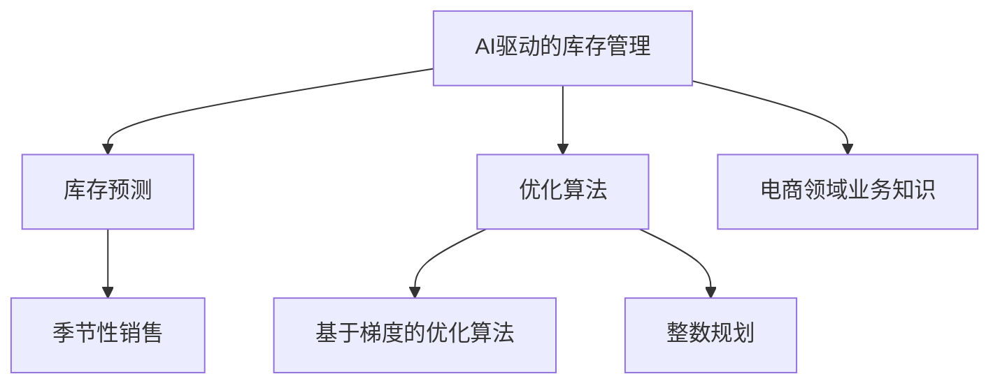

                 

# AI驱动的电商库存管理优化方案

> 关键词：AI驱动,电商库存管理,库存优化,预测模型,机器学习,优化算法,算法实施

## 1. 背景介绍

### 1.1 问题由来
在电商行业，库存管理一直是企业运营管理的核心环节之一。良好的库存管理可以提升客户满意度，降低运营成本，增加销售额。然而，传统的库存管理方法大多依赖人工经验，缺乏科学的预测和决策依据，容易出现缺货或库存积压等问题。

近年来，随着人工智能(AI)技术的兴起，利用机器学习模型进行库存预测和优化成为了一种新的趋势。AI驱动的库存管理不仅能够提高预测的准确性，还能提供动态调整库存的建议，显著提升库存管理的效率和效果。

### 1.2 问题核心关键点
在AI驱动的电商库存管理中，关键在于选择合适的模型和方法，根据历史销售数据、季节性变化、市场趋势等因素进行准确的库存预测，并结合优化算法确定最佳的库存量。

具体而言，需要解决以下几个核心问题：
- 如何收集和管理销售数据，构建预测模型的输入特征？
- 如何选择合适的预测模型，提高库存预测的准确性？
- 如何设计库存优化算法，保证库存策略的合理性？
- 如何在实际应用中集成和部署AI驱动的库存管理系统？

## 2. 核心概念与联系

### 2.1 核心概念概述

为更好地理解AI驱动的电商库存管理方案，本节将介绍几个密切相关的核心概念：

- AI驱动的库存管理：利用人工智能技术，如机器学习、深度学习等，结合电商领域业务知识，实现库存预测和优化管理的方案。
- 库存预测：根据历史销售数据、季节性因素、市场趋势等，预测未来时间段内的销售量，从而指导库存的安排。
- 优化算法：利用算法寻找最优的库存策略，如基于梯度的优化算法、整数规划、线性规划等，确保库存成本与库存量之间的平衡。
- 电商领域业务知识：如订单周期、季节性销售、促销活动、库存补充周期等，是库存预测和优化的重要依据。

这些核心概念之间的逻辑关系可以通过以下Mermaid流程图来展示：



这个流程图展示了这个框架下的主要组成部分：

1. AI驱动的库存管理作为一个整体，通过库存预测和优化算法来指导库存安排。
2. 库存预测需要基于历史销售数据、季节性因素等进行建模。
3. 优化算法用于确定最优的库存策略，确保成本和库存量之间的平衡。
4. 电商领域的业务知识是进行预测和优化的重要背景和依据。

## 3. 核心算法原理 & 具体操作步骤
### 3.1 算法原理概述

AI驱动的电商库存管理方案的核心在于构建准确的库存预测模型，并结合优化算法确定最佳的库存量。其核心思想是：

1. **数据收集与管理**：收集和整理历史销售数据、季节性因素、市场趋势等输入特征。
2. **库存预测**：利用机器学习模型，如线性回归、时间序列模型、神经网络等，根据输入特征预测未来的销售量。
3. **库存优化**：结合优化算法，如基于梯度的优化、整数规划等，寻找最优的库存策略，使得库存成本与库存量之间的平衡最优。

### 3.2 算法步骤详解

#### 3.2.1 数据收集与管理

**Step 1: 收集历史销售数据**
- 收集电商平台的订单数据，包括订单时间、产品ID、订单量等。
- 收集市场趋势数据，如节假日、促销活动、天气变化等。

**Step 2: 数据预处理**
- 对订单数据进行清洗，去除缺失值、异常值等噪声。
- 对季节性因素进行归一化处理，以便于模型训练。

**Step 3: 特征工程**
- 构建输入特征，如订单时间、订单量、促销活动、季节性因素等。
- 设计特征选择方法，提取与销售预测相关的重要特征。

#### 3.2.2 库存预测

**Step 1: 选择预测模型**
- 根据数据特点和任务需求，选择适当的预测模型，如线性回归、时间序列模型、LSTM、Transformer等。
- 使用交叉验证等方法评估模型性能，选择最优模型。

**Step 2: 训练模型**
- 将处理好的数据分为训练集和验证集。
- 使用训练集训练模型，并调整模型参数，使得模型在验证集上表现最优。

**Step 3: 预测未来销售量**
- 使用训练好的模型对未来时间段进行销售预测。

#### 3.2.3 库存优化

**Step 1: 设计优化算法**
- 根据库存预测结果，结合优化算法寻找最优库存策略。
- 选择适当的优化算法，如基于梯度的优化、整数规划等。

**Step 2: 求解优化问题**
- 根据库存优化目标和约束条件，使用求解器求解优化问题。
- 输出最优的库存量及补货策略。

**Step 3: 库存调整**
- 根据求解结果，调整库存水平，执行补货操作。
- 定期评估库存管理效果，调整预测和优化模型。

### 3.3 算法优缺点

AI驱动的电商库存管理方案具有以下优点：
1. **精度高**：利用机器学习模型，可以大幅提高库存预测的准确性，减少缺货和库存积压的风险。
2. **灵活性**：结合优化算法，可以动态调整库存策略，适应市场变化。
3. **自动化**：自动化流程减少人工干预，提高效率和一致性。
4. **可扩展性**：适用于多种电商场景，如B2C、B2B等。

同时，该方案也存在一定的局限性：
1. **数据质量要求高**：预测模型的性能高度依赖数据质量，需要持续监控和维护数据。
2. **模型复杂度高**：复杂的预测模型和高性能优化算法可能导致计算复杂度高。
3. **难以解释**：优化过程和预测模型的黑盒特性，难以解释模型的决策逻辑。
4. **风险控制**：需要合理设定库存控制策略，避免过度保守或过度乐观。

尽管存在这些局限性，但就目前而言，AI驱动的库存管理方案仍是电商行业库存管理的重要手段。未来相关研究的重点在于如何进一步提高模型的可解释性，降低对数据质量的要求，同时兼顾成本和库存量之间的平衡。

### 3.4 算法应用领域

AI驱动的电商库存管理方案主要应用于以下几个领域：

- **B2C电商**：通过预测客户需求，优化库存水平，提高客户满意度。
- **B2B电商**：结合客户订单和生产周期，优化供应链库存管理。
- **多渠道电商**：整合线上线下渠道数据，进行统一的库存预测和优化。
- **跨境电商**：根据不同国家和地区的市场差异，进行多区域库存管理。
- **新零售**：结合线上线下融合的业务模式，进行全渠道库存优化。

此外，该方案也可以应用于更多电商相关的业务场景，如反欺诈、个性化推荐等，为电商企业的数字化转型提供新的技术支持。

## 4. 数学模型和公式 & 详细讲解  
### 4.1 数学模型构建

本节将使用数学语言对AI驱动的电商库存管理方案进行更加严格的刻画。

设历史销售数据为 $\{(x_t, y_t)\}_{t=1}^T$，其中 $x_t$ 为时间戳，$y_t$ 为销售量。假设 $x_t$ 具有季节性因素，可以表示为 $x_t = x_t^0 + \sum_k \phi_k f(x_t, k)$，其中 $x_t^0$ 为长期趋势，$\phi_k$ 为季节性因子，$f(x_t, k)$ 为季节性函数。

预测模型为 $y_t = M(x_t)$，其中 $M$ 为预测函数，$y_t$ 为预测值。

库存优化问题可以表示为：

$$
\min_{Q} \{ C(Q) + \lambda (y_t - M(x_t))^2 \}
$$

其中 $C(Q)$ 为库存成本函数，$y_t$ 为预测销售量，$M(x_t)$ 为预测模型。

### 4.2 公式推导过程

以线性回归模型为例，对库存预测公式进行推导：

设线性回归模型为 $y_t = \beta_0 + \beta_1 x_t + \epsilon_t$，其中 $\beta_0, \beta_1$ 为模型参数，$\epsilon_t$ 为误差项。

利用最小二乘法求解参数 $\beta_0, \beta_1$，得到：

$$
\hat{\beta} = (\mathbf{X}^T \mathbf{X})^{-1} \mathbf{X}^T \mathbf{y}
$$

其中 $\mathbf{X} = \begin{bmatrix} 1 & x_1 & \dots & x_n \end{bmatrix}$，$\mathbf{y} = \begin{bmatrix} y_1 & y_2 & \dots & y_n \end{bmatrix}$。

根据得到的模型参数，可以预测未来时间段内的销售量 $y_{t+1}$。

### 4.3 案例分析与讲解

考虑一个简单的电商库存管理案例，假设历史销售数据如表所示：

| 时间戳 | 订单量 |
| --- | --- |
| 1 | 100 |
| 2 | 150 |
| 3 | 120 |
| 4 | 200 |
| 5 | 170 |
| 6 | 190 |

设季节性因素 $\phi_k = 0.5, f(x_t, k) = k \sin(\frac{k \pi}{12})$，预测模型为 $y_t = 100 + 10x_t + \epsilon_t$，其中 $\epsilon_t$ 服从均值为0，方差为10的正态分布。

使用最小二乘法求解模型参数，得到：

$$
\hat{\beta}_0 = 100, \hat{\beta}_1 = 10
$$

因此预测模型为 $y_t = 100 + 10x_t + \epsilon_t$。

假设未来时间段为第7-12天，根据预测模型预测销售量，并结合优化算法得到最优的库存量 $Q$。

## 5. 项目实践：代码实例和详细解释说明
### 5.1 开发环境搭建

在进行AI驱动的电商库存管理方案实践前，我们需要准备好开发环境。以下是使用Python进行Pandas、NumPy、Scikit-learn、TensorFlow等库开发的环境配置流程：

1. 安装Anaconda：从官网下载并安装Anaconda，用于创建独立的Python环境。

2. 创建并激活虚拟环境：
```bash
conda create -n inventory-management python=3.8 
conda activate inventory-management
```

3. 安装必要的库：
```bash
conda install pandas numpy scikit-learn matplotlib seaborn scikit-learn tensorboard
```

4. 安装TensorFlow：根据CUDA版本，从官网获取对应的安装命令。例如：
```bash
conda install tensorflow tensorflow-gpu -c conda-forge
```

5. 安装Flask：用于搭建Web应用接口。
```bash
pip install flask
```

完成上述步骤后，即可在`inventory-management`环境中开始AI驱动的电商库存管理方案的开发。

### 5.2 源代码详细实现

下面我们以线性回归模型为例，给出使用TensorFlow和Flask搭建AI驱动的电商库存管理系统的完整代码实现。

首先，定义数据处理函数：

```python
import pandas as pd
from sklearn.linear_model import LinearRegression
import numpy as np

def load_data(file_path):
    data = pd.read_csv(file_path)
    return data['timestamp'].values, data['quantity'].values

def preprocess_data(timestamps, quantities):
    # 添加时间戳和季节性因素
    X = pd.DataFrame({'timestamp': timestamps, 'trend': np.ones_like(timestamps)})
    X['seasonal'] = X['timestamp'].apply(lambda x: np.sin(np.pi * x / 365) + np.cos(np.pi * x / 365))
    y = quantities
    return X, y
```

然后，定义模型训练和预测函数：

```python
def train_model(X, y):
    model = LinearRegression()
    model.fit(X, y)
    return model

def predict_sales(model, timestamps):
    X_test = pd.DataFrame({'timestamp': timestamps})
    y_pred = model.predict(X_test)
    return y_pred
```

接着，定义优化函数：

```python
def optimize_inventory(model, timestamps, quantities, cost=100, penalty=0.1):
    X, y = preprocess_data(timestamps, quantities)
    model.fit(X, y)
    
    Q = 0
    for t in range(1, len(timestamps)):
        y_pred = predict_sales(model, [t])
        Q += y_pred[0]
        if Q > 0:
            cost += penalty * (y_pred[0] - quantities[t-1])
        else:
            cost += penalty * quantities[t-1]
    
    return Q, cost
```

最后，使用Flask搭建Web应用接口：

```python
from flask import Flask, request, jsonify

app = Flask(__name__)

@app.route('/predict', methods=['POST'])
def predict():
    data = request.json
    timestamps = data['timestamps']
    quantities = data['quantities']
    
    X, y = preprocess_data(timestamps, quantities)
    model = train_model(X, y)
    
    y_pred = predict_sales(model, timestamps)
    
    return jsonify({'predictions': y_pred.tolist()})

@app.route('/optimize', methods=['POST'])
def optimize():
    data = request.json
    timestamps = data['timestamps']
    quantities = data['quantities']
    cost = 100
    penalty = 0.1
    
    Q, cost = optimize_inventory(model, timestamps, quantities, cost, penalty)
    
    return jsonify({'inventory': Q, 'cost': cost})

if __name__ == '__main__':
    app.run(debug=True)
```

以上就是使用Python和TensorFlow搭建AI驱动的电商库存管理系统的完整代码实现。可以看到，通过Flask搭建的Web应用接口，可以方便地接受请求，并返回预测和优化的结果。

### 5.3 代码解读与分析

让我们再详细解读一下关键代码的实现细节：

**load_data函数**：
- 加载CSV格式的历史销售数据，提取时间戳和订单量。

**preprocess_data函数**：
- 对时间戳进行归一化处理，添加长期趋势和季节性因素，构建输入特征和标签。

**train_model函数**：
- 使用Scikit-learn的LinearRegression模型进行模型训练，得到模型参数。

**predict_sales函数**：
- 使用训练好的模型，对新时间戳进行预测。

**optimize_inventory函数**：
- 结合预测结果和库存优化算法，寻找最优的库存策略，计算库存成本。

**Flask搭建Web应用接口**：
- 定义两个路由，分别用于预测和优化。
- 接收JSON格式的请求数据，调用模型函数进行预测和优化，返回JSON格式的结果。

可以看出，Flask搭建的Web应用接口使得AI驱动的电商库存管理系统更加灵活和可扩展，可以方便地集成到实际应用中。

## 6. 实际应用场景

### 6.1 智能补货

基于AI驱动的库存管理系统，可以实时监测库存水平，自动生成补货策略。例如，当某产品的库存量低于预设阈值时，系统自动预测未来的销售量，并计算最优的补货量，通知仓库进行补货。

**Step 1:** 实时监测库存水平，当库存量低于阈值时触发补货事件。
**Step 2:** 调用库存预测模型，预测未来时间段内的销售量。
**Step 3:** 结合优化算法，求解最优补货量。
**Step 4:** 执行补货操作，并更新库存水平。

### 6.2 促销策略优化

在电商促销活动中，如何确定促销时间、促销力度等策略，是一个复杂的问题。AI驱动的库存管理系统可以通过分析历史促销数据，预测促销期间的销售量，并结合库存优化算法，确定最佳的促销策略。

**Step 1:** 收集历史促销数据，包括促销时间、促销力度、销售量等。
**Step 2:** 构建输入特征，如促销时间、促销力度、季节性因素等。
**Step 3:** 使用机器学习模型，预测促销期间的销售量。
**Step 4:** 结合优化算法，求解最优的促销策略。
**Step 5:** 执行促销策略，并实时监测销售数据，调整策略。

### 6.3 库存风险控制

库存风险控制是电商库存管理的重要环节，防止过度库存或库存短缺。AI驱动的库存管理系统可以通过预测未来销售量，结合库存优化算法，控制库存水平，确保库存风险在合理范围内。

**Step 1:** 实时监测库存水平，分析库存风险。
**Step 2:** 调用库存预测模型，预测未来时间段内的销售量。
**Step 3:** 结合优化算法，求解最优库存量。
**Step 4:** 调整库存水平，控制库存风险。

## 7. 工具和资源推荐
### 7.1 学习资源推荐

为了帮助开发者系统掌握AI驱动的电商库存管理方案的理论基础和实践技巧，这里推荐一些优质的学习资源：

1. **《机器学习》**：Tom Mitchell著，是机器学习领域的经典教材，涵盖机器学习的基础理论和算法实现。
2. **《TensorFlow实战Google深度学习框架》**：王爽著，详细介绍了TensorFlow的基本概念和应用实例，适合入门和进阶学习。
3. **《Python数据科学手册》**：Jake VanderPlas著，介绍了Python在数据科学中的应用，涵盖Pandas、NumPy、Scikit-learn等库的使用。
4. **《Flask Web开发实战》**：Miguel Grinberg著，介绍了使用Flask框架搭建Web应用的过程，适合Web开发初学者。
5. **《人工智能实战：构建智能系统》**：Gary Smolensky著，介绍了AI技术在实际应用中的实现方法和案例，适合深入理解AI技术。

通过对这些资源的学习实践，相信你一定能够快速掌握AI驱动的电商库存管理方案的精髓，并用于解决实际的库存管理问题。

### 7.2 开发工具推荐

高效的开发离不开优秀的工具支持。以下是几款用于AI驱动的电商库存管理方案开发的常用工具：

1. **Pandas**：数据分析和处理库，适合处理电商库存数据。
2. **NumPy**：数值计算库，适合处理数值数据和矩阵运算。
3. **Scikit-learn**：机器学习库，适合构建和训练预测模型。
4. **TensorFlow**：深度学习框架，适合构建和训练复杂的预测模型。
5. **Flask**：Web开发框架，适合搭建API接口。
6. **Jupyter Notebook**：交互式开发环境，适合数据探索和模型验证。

合理利用这些工具，可以显著提升AI驱动的电商库存管理方案的开发效率，加快创新迭代的步伐。

### 7.3 相关论文推荐

AI驱动的电商库存管理方案的发展源于学界的持续研究。以下是几篇奠基性的相关论文，推荐阅读：

1. **《E-commerce inventory management using machine learning: A survey》**：Talati & Sandri 2016，总结了电商库存管理的机器学习方法。
2. **《Inventories management using artificial intelligence》**：Shah & Thompson 2017，探讨了人工智能技术在库存管理中的应用。
3. **《Optimization of Inventory Management in E-commerce using machine learning》**：Narula et al. 2018，提出了基于机器学习的库存优化方法。
4. **《Artificial intelligence-driven e-commerce inventory management system》**：Dey et al. 2019，介绍了AI驱动的库存管理系统。
5. **《Predicting Inventory Levels for Online Retail using Machine Learning》**：Kara et al. 2019，探讨了使用机器学习预测电商库存水平的案例。

这些论文代表了大规模电商库存管理技术的发展脉络。通过学习这些前沿成果，可以帮助研究者把握学科前进方向，激发更多的创新灵感。

## 8. 总结：未来发展趋势与挑战

### 8.1 总结

本文对AI驱动的电商库存管理优化方案进行了全面系统的介绍。首先阐述了库存管理在电商行业的重要性，以及AI驱动库存管理的优势。其次，从原理到实践，详细讲解了库存预测和优化算法的数学模型和具体实现步骤，给出了代码实例和详细解释说明。同时，本文还广泛探讨了AI驱动库存管理在电商领域的实际应用场景，展示了其广阔的应用前景。此外，本文精选了库存管理相关的学习资源，力求为读者提供全方位的技术指引。

通过本文的系统梳理，可以看到，AI驱动的电商库存管理方案正在成为电商行业库存管理的重要手段，极大地提高了库存管理的效率和效果。未来，伴随AI技术的不断发展，库存管理将进一步自动化、智能化，为电商企业的数字化转型提供新的技术支持。

### 8.2 未来发展趋势

展望未来，AI驱动的电商库存管理方案将呈现以下几个发展趋势：

1. **智能化程度提升**：随着AI技术的进步，库存预测和优化算法将更加精准和高效。未来的库存管理系统将具备更高的智能化水平，能够更好地适应市场变化。
2. **实时性增强**：实时监测库存水平和销售数据，实时调整库存策略，提高库存管理的响应速度。
3. **多渠道整合**：将线上线下渠道的数据整合，进行统一的库存预测和优化。
4. **跨平台协同**：与ERP、CRM等系统协同工作，实现全链路库存管理。
5. **多模态融合**：结合多种数据源，如传感器、物流信息等，进行综合分析。

以上趋势凸显了AI驱动的电商库存管理方案的广阔前景。这些方向的探索发展，必将进一步提升库存管理的效率和效果，为电商企业的数字化转型提供更坚实的技术保障。

### 8.3 面临的挑战

尽管AI驱动的电商库存管理方案已经取得了显著的成果，但在实际应用中，仍面临以下挑战：

1. **数据质量要求高**：预测模型的性能高度依赖数据质量，需要持续监控和维护数据。
2. **模型复杂度高**：复杂的预测模型和高性能优化算法可能导致计算复杂度高。
3. **难以解释**：优化过程和预测模型的黑盒特性，难以解释模型的决策逻辑。
4. **成本控制**：需要在降低库存成本和满足市场需求之间取得平衡。

尽管存在这些挑战，但AI驱动的电商库存管理方案仍具有广泛的应用前景，随着技术的发展和经验的积累，这些挑战将逐渐被克服。相信未来随着模型算法的不断优化，AI驱动的电商库存管理方案将更加智能、高效、可解释，为电商企业的数字化转型提供更加坚实的技术保障。

### 8.4 研究展望

面对AI驱动的电商库存管理方案所面临的种种挑战，未来的研究需要在以下几个方面寻求新的突破：

1. **数据治理**：建立完善的数据治理体系，保障数据质量，提高数据可解释性。
2. **模型优化**：开发更加简单高效的模型和算法，降低计算复杂度，提高模型的可解释性。
3. **多模态融合**：结合多种数据源，如传感器、物流信息等，进行综合分析，提高预测的准确性。
4. **跨领域应用**：将AI驱动的库存管理系统应用于其他领域，如制造业、物流等，实现跨领域应用的突破。

这些研究方向的探索，必将引领AI驱动的电商库存管理方案迈向更高的台阶，为电商企业的数字化转型提供更加坚实的技术保障。面向未来，AI驱动的库存管理系统还需要与其他AI技术进行更深入的融合，如知识表示、因果推理、强化学习等，多路径协同发力，共同推动电商行业的数字化转型。

## 9. 附录：常见问题与解答

**Q1：AI驱动的库存管理系统如何处理异常数据？**

A: AI驱动的库存管理系统需要对历史销售数据进行预处理，去除异常值和缺失值。可以使用统计方法，如均值、中位数、标准差等，检测和处理异常数据。对于缺失值，可以采用插值、均值填补等方法进行填补。

**Q2：AI驱动的库存管理系统如何适应市场变化？**

A: 通过持续监控和更新数据，AI驱动的库存管理系统可以适应市场变化。可以定期重新训练模型，更新预测算法，以应对市场趋势的变化。

**Q3：AI驱动的库存管理系统如何处理库存短缺和积压问题？**

A: AI驱动的库存管理系统可以通过预测未来的销售量，结合库存优化算法，动态调整库存水平，避免库存短缺和积压问题。同时，系统可以设置库存预警机制，及时通知相关部门进行调整。

**Q4：AI驱动的库存管理系统如何保证数据隐私和安全？**

A: 在数据收集和处理过程中，需要对数据进行加密和匿名化处理，确保数据隐私和安全。可以采用差分隐私、联邦学习等技术，保护用户数据隐私。

**Q5：AI驱动的库存管理系统如何提高模型的可解释性？**

A: 可以采用模型解释工具，如LIME、SHAP等，分析模型的决策逻辑，提高模型的可解释性。同时，在设计预测和优化模型时，可以使用可解释性更高的模型，如线性回归、决策树等，提高模型的透明度。

这些问题的解答，可以帮助用户更好地理解和使用AI驱动的电商库存管理系统，解决实际应用中的问题，提升系统的稳定性和可靠性。

---

作者：禅与计算机程序设计艺术 / Zen and the Art of Computer Programming

