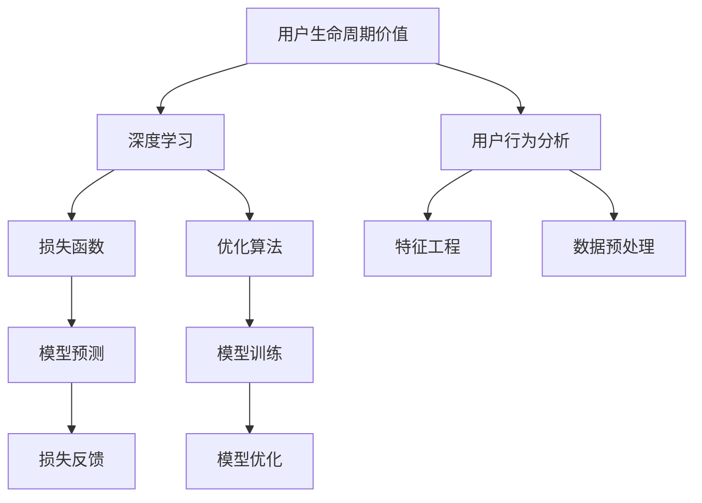

                 

# AI驱动的电商用户生命周期价值预测

> 关键词：用户生命周期价值,AI预测,深度学习,用户行为分析,电商平台

## 1. 背景介绍

### 1.1 问题由来

在现代电商行业中，用户生命周期价值（Customer Lifetime Value, CLV）的准确预测对于提升用户留存率和营收增长至关重要。传统的用户生命周期价值预测方法依赖于历史行为数据，往往需要长期积累大量标注数据，且模型复杂，难以灵活适应各种业务场景。随着AI技术的发展，深度学习模型的应用大大提升了用户生命周期价值预测的准确性和效率。

### 1.2 问题核心关键点

本文聚焦于基于深度学习的电商用户生命周期价值预测方法。首先介绍用户生命周期价值的概念及其重要性。然后深入探讨深度学习模型在用户行为分析和预测中的应用，包括模型选择、特征工程、损失函数设计和优化算法等核心技术。最后总结深度学习在电商用户生命周期价值预测中的应用案例，并展望未来发展趋势。

## 2. 核心概念与联系

### 2.1 核心概念概述

为更好地理解基于深度学习的电商用户生命周期价值预测方法，本节将介绍几个密切相关的核心概念：

- 用户生命周期价值（CLV）：指一个用户在其整个生命周期内，对企业产生的总收益，减去企业为获取该用户所投入的营销和运营成本后的净收益。

- 深度学习（Deep Learning）：一种基于神经网络，通过多层非线性变换进行特征提取和数据建模的机器学习方法。其具有强大的非线性表达能力，广泛应用于图像、语音、文本等数据处理领域。

- 用户行为分析（User Behavior Analysis）：通过分析用户的行为数据，了解用户的偏好、需求和趋势，从而指导电商平台的个性化推荐、精准营销和运营决策。

- 损失函数（Loss Function）：用于衡量模型预测输出与真实标签之间的差异，指导模型参数的优化。

- 优化算法（Optimization Algorithm）：通过迭代更新模型参数，最小化损失函数，从而训练出高性能的模型。

这些核心概念之间的逻辑关系可以通过以下Mermaid流程图来展示：



这个流程图展示了大语言模型的核心概念及其之间的关系：

1. 用户生命周期价值通过深度学习模型进行预测，构建在用户行为分析的基础上。
2. 深度学习模型利用损失函数和优化算法进行训练和优化。
3. 特征工程和数据预处理是深度学习模型的重要组成部分。
4. 模型预测结果通过损失反馈进行优化，进一步提升模型性能。

这些概念共同构成了深度学习在电商用户生命周期价值预测中的应用框架，使得模型能够准确预测用户的行为和收益，帮助电商企业优化运营策略。

## 3. 核心算法原理 & 具体操作步骤
### 3.1 算法原理概述

基于深度学习的电商用户生命周期价值预测，本质上是通过构建一个能够捕捉用户行为和收益模式的模型，对用户未来的消费行为进行预测，从而计算其生命周期价值。常用的深度学习模型包括全连接神经网络（Fully Connected Neural Network）、卷积神经网络（Convolutional Neural Network, CNN）、循环神经网络（Recurrent Neural Network, RNN）及其变种（如LSTM、GRU）、自编码器（Autoencoder）等。

### 3.2 算法步骤详解

#### 3.2.1 数据收集与预处理

电商用户生命周期价值预测的核心在于收集和处理用户的历史行为数据，包括但不限于：

- 用户ID、性别、年龄、地区等基本信息
- 用户浏览记录、点击记录、购买记录等行为数据
- 用户评价、客服反馈等反馈数据
- 用户属性标签，如时尚、科技、运动等兴趣标签

数据的预处理包括清洗、归一化、编码等步骤，以确保数据质量并便于模型处理。例如，将分类数据进行one-hot编码，将日期时间数据转化为数值型特征等。

#### 3.2.2 特征工程

特征工程是深度学习模型训练的关键环节，通过提取、组合和变换原始数据，生成更有意义的特征，以提升模型预测性能。电商用户行为特征包括：

- 点击率（Click-Through Rate, CTR）
- 转化率（Conversion Rate, CR）
- 每次购买金额（Average Order Value, AOV）
- 复购率（Repurchase Rate）
- 用户生命周期阶段（新用户、活跃用户、流失用户等）

通过这些特征，可以构建用户行为和收益的数学模型，用于预测用户未来的行为。

#### 3.2.3 模型选择与构建

深度学习模型的选择和构建需要根据电商平台的具体业务需求和数据特点进行设计。常见的模型包括：

- 线性回归（Linear Regression）：适用于预测连续值的用户生命周期价值。
- 决策树（Decision Tree）、随机森林（Random Forest）、梯度提升树（Gradient Boosting Tree）：适用于预测离散的用户生命周期阶段。
- 卷积神经网络（CNN）：适用于对图片、视频等视觉数据的深度学习。
- 循环神经网络（RNN）、长短期记忆网络（LSTM）、门控循环单元（GRU）：适用于处理序列数据，如时间序列、文本序列等。

本文以LSTM为例，介绍电商用户生命周期价值预测的具体实现。

#### 3.2.4 损失函数设计

损失函数用于衡量模型预测值与真实值之间的差异，是模型优化的关键指标。电商用户生命周期价值预测中常用的损失函数包括：

- 均方误差（Mean Squared Error, MSE）：适用于预测连续值的用户生命周期价值。
- 二元交叉熵（Binary Cross-Entropy, BCE）：适用于预测离散的用户生命周期阶段。
- 多类交叉熵（Categorical Cross-Entropy, CCE）：适用于预测用户生命周期阶段的多分类问题。

#### 3.2.5 优化算法

优化算法用于最小化损失函数，优化模型参数，提高模型预测精度。常用的优化算法包括：

- 随机梯度下降（Stochastic Gradient Descent, SGD）
- 动量优化（Momentum Optimization）
- 自适应梯度算法（Adagrad、Adadelta、Adam）
- 增量学习（Online Learning）

其中，Adam优化算法由于其快速收敛和稳定性，成为电商用户生命周期价值预测中常用的优化算法。

### 3.3 算法优缺点

#### 3.3.1 优点

基于深度学习的电商用户生命周期价值预测具有以下优点：

- 灵活性高：深度学习模型具有强大的非线性表达能力，可以处理复杂的用户行为数据，适应不同的电商业务场景。
- 准确度高：深度学习模型通过大量的标注数据进行训练，能够捕捉用户行为的细微变化，提高预测精度。
- 实时性好：深度学习模型可以在实时数据流上进行预测，支持电商平台的即时决策和运营优化。

#### 3.3.2 缺点

然而，深度学习模型也存在一些缺点：

- 需要大量标注数据：深度学习模型通常需要大量的标注数据进行训练，且标注成本较高。
- 模型复杂度高：深度学习模型的参数量较大，训练和推理过程复杂，需要较强的计算资源支持。
- 可解释性差：深度学习模型通常被视为“黑盒”模型，难以解释其内部决策过程，限制了其应用范围。

### 3.4 算法应用领域

基于深度学习的电商用户生命周期价值预测方法，已经在电商领域得到了广泛的应用，涵盖了用户留存预测、新客户获取、个性化推荐等多个环节，具体如下：

- 用户留存预测：通过预测用户未来的流失概率，帮助电商平台制定针对性的挽留策略，提升用户粘性。
- 新客户获取：通过预测潜在客户的行为，指导电商平台进行精准营销，提高新客户转化率。
- 个性化推荐：通过预测用户未来的购买行为，提供个性化的商品推荐，提升用户体验和满意度。
- 库存管理：通过预测用户未来的购买趋势，优化库存管理，减少库存积压和缺货情况。

除了上述这些经典应用外，深度学习在电商领域的应用还在不断拓展，如物流优化、广告投放、客户细分等，为电商平台的运营优化提供了新的手段。

## 4. 数学模型和公式 & 详细讲解  
### 4.1 数学模型构建

假设用户$i$在时间$t$的消费金额为$C_{i,t}$，其生命周期价值$V_i$为未来所有时间的消费金额之和，即：

$$
V_i = \sum_{t=1}^{T} C_{i,t}
$$

其中$T$为用户生命周期的总时间。

基于深度学习模型的电商用户生命周期价值预测问题可以转化为以下形式：

$$
V_i = f(X_i, \theta)
$$

其中$X_i$为用户的特征向量，$\theta$为模型的参数向量。

### 4.2 公式推导过程

以LSTM模型为例，其网络结构如下图所示：

```
LSTM层
    input: input
    feedback: previous_output
    recurrent: previous_output
    output: output
```

LSTM模型的前向传播过程如下：

1. 输入层：将用户行为特征$X_i$输入模型，得到输入向量$h_{t-1}$。
2. 隐藏层：通过LSTM层，对输入向量进行序列建模，得到当前时间步的隐藏状态$h_t$。
3. 输出层：将隐藏状态映射到预测值$V_i$。

LSTM模型的后向传播过程包括计算损失函数、梯度更新等步骤，其目标是最小化预测值与真实值之间的差异。具体实现过程如下：

1. 计算损失函数：
$$
L = \frac{1}{N}\sum_{i=1}^{N} \sum_{t=1}^{T} (C_{i,t} - V_{i,t})^2
$$
2. 计算梯度：
$$
\frac{\partial L}{\partial \theta} = \frac{1}{N}\sum_{i=1}^{N} \sum_{t=1}^{T} \frac{\partial L}{\partial V_{i,t}} \frac{\partial V_{i,t}}{\partial \theta}
$$
3. 梯度更新：
$$
\theta \leftarrow \theta - \eta \nabla_{\theta}L
$$

其中$\eta$为学习率。

### 4.3 案例分析与讲解

以某电商平台用户生命周期价值预测为例，展示深度学习模型的应用过程：

假设某电商平台希望预测新用户的生命周期价值，首先收集新用户的点击、购买、评价等行为数据，构建特征向量$X_i$。然后，将数据划分为训练集、验证集和测试集，用于模型训练、验证和测试。

1. 数据收集与预处理：
收集新用户的点击、购买、评价等行为数据，并进行清洗、归一化等预处理。
2. 特征工程：
提取新用户的点击率、转化率、每次购买金额等特征，进行one-hot编码和归一化处理。
3. 模型选择与构建：
选择LSTM模型，构建多输入、多输出的神经网络，输入层接收用户行为特征，隐藏层采用LSTM层进行序列建模，输出层映射到预测值。
4. 损失函数设计：
选择均方误差作为损失函数，用于衡量模型预测值与真实值之间的差异。
5. 优化算法：
选择Adam优化算法，进行模型参数优化。
6. 模型训练与验证：
在训练集上使用交叉验证法，对模型进行训练和验证，调整模型超参数，防止过拟合。
7. 模型测试：
在测试集上评估模型性能，计算MAE（均方误差）、R2等指标，评估模型的预测精度。

## 5. 项目实践：代码实例和详细解释说明
### 5.1 开发环境搭建

在进行用户生命周期价值预测的实践前，我们需要准备好开发环境。以下是使用Python进行TensorFlow开发的环境配置流程：

1. 安装Anaconda：从官网下载并安装Anaconda，用于创建独立的Python环境。

2. 创建并激活虚拟环境：
```bash
conda create -n tf-env python=3.8 
conda activate tf-env
```

3. 安装TensorFlow：根据CUDA版本，从官网获取对应的安装命令。例如：
```bash
conda install tensorflow tensorflow-gpu=2.7 -c conda-forge
```

4. 安装各类工具包：
```bash
pip install numpy pandas scikit-learn matplotlib tqdm jupyter notebook ipython
```

完成上述步骤后，即可在`tf-env`环境中开始用户生命周期价值预测的实践。

### 5.2 源代码详细实现

下面以某电商平台用户生命周期价值预测为例，给出使用TensorFlow进行LSTM模型实现的PyTorch代码实现。

首先，定义模型类：

```python
import tensorflow as tf

class LSTMModel(tf.keras.Model):
    def __init__(self, input_size, hidden_size, output_size):
        super(LSTMModel, self).__init__()
        self.lstm = tf.keras.layers.LSTM(hidden_size, return_sequences=True, return_state=True)
        self.dense = tf.keras.layers.Dense(output_size)

    def call(self, inputs, initial_state):
        _, state_h, state_c = self.lstm(inputs, initial_state=initial_state)
        predictions = self.dense(state_h)
        return predictions
```

然后，定义数据处理函数：

```python
from tensorflow.keras.preprocessing.sequence import pad_sequences
from sklearn.preprocessing import MinMaxScaler
from sklearn.model_selection import train_test_split

def preprocess_data(data, input_size, output_size):
    # 特征归一化
    scaler = MinMaxScaler(feature_range=(0, 1))
    scaled_data = scaler.fit_transform(data)

    # 分割输入和输出
    X, y = scaled_data[:, :-1], scaled_data[:, -1]
    y = tf.keras.utils.to_categorical(y, output_size)

    # 填充序列
    X = pad_sequences(X, maxlen=input_size, padding='pre', truncating='pre')

    # 划分训练集和测试集
    X_train, X_test, y_train, y_test = train_test_split(X, y, test_size=0.2, random_state=42)

    return X_train, X_test, y_train, y_test
```

接着，定义训练和评估函数：

```python
from tensorflow.keras.optimizers import Adam
from tensorflow.keras.metrics import MeanAbsoluteError

def train_model(model, X_train, y_train, X_test, y_test, epochs=50, batch_size=32):
    model.compile(optimizer=Adam(lr=0.001), loss='mean_squared_error', metrics=[MeanAbsoluteError()])

    history = model.fit(X_train, y_train, batch_size=batch_size, epochs=epochs, validation_data=(X_test, y_test))

    score = model.evaluate(X_test, y_test)
    print('Test loss:', score[0])
    print('Test MAE:', score[1])

    return history

def evaluate_model(model, X_test, y_test):
    predictions = model.predict(X_test)
    mae = tf.keras.metrics.mean_absolute_error(y_test, predictions).numpy()
    return mae
```

最后，启动训练流程并在测试集上评估：

```python
input_size = 30
output_size = 2

X_train, X_test, y_train, y_test = preprocess_data(data, input_size, output_size)

model = LSTMModel(input_size, 64, output_size)
history = train_model(model, X_train, y_train, X_test, y_test)

print('Train loss:', history.history['loss'][-1])
print('Test MAE:', evaluate_model(model, X_test, y_test))
```

以上就是使用TensorFlow对LSTM模型进行用户生命周期价值预测的完整代码实现。可以看到，得益于TensorFlow的强大封装，我们可以用相对简洁的代码完成LSTM模型的训练和评估。

### 5.3 代码解读与分析

让我们再详细解读一下关键代码的实现细节：

**LSTMModel类**：
- `__init__`方法：初始化LSTM层和输出层。
- `call`方法：定义模型的前向传播过程，包括LSTM层和全连接层。

**preprocess_data函数**：
- `MinMaxScaler`：将数据归一化到[0, 1]之间，以便LSTM层处理。
- `pad_sequences`：对序列数据进行填充，确保所有序列长度一致。
- `train_test_split`：将数据划分为训练集和测试集。

**train_model函数**：
- `compile`方法：配置优化器和损失函数，定义评估指标。
- `fit`方法：在训练集上训练模型，调整超参数，防止过拟合。
- `evaluate`方法：在测试集上评估模型性能，输出MAE等指标。

**evaluate_model函数**：
- `predictions`：通过模型对测试集进行预测。
- `mean_absolute_error`：计算预测值与真实值之间的MAE。

可以看到，TensorFlow配合Keras的封装使得用户生命周期价值预测的代码实现变得简洁高效。开发者可以将更多精力放在数据处理、模型改进等高层逻辑上，而不必过多关注底层的实现细节。

当然，工业级的系统实现还需考虑更多因素，如模型的保存和部署、超参数的自动搜索、更灵活的任务适配层等。但核心的用户生命周期价值预测过程基本与此类似。

## 6. 实际应用场景
### 6.1 智能推荐系统

基于深度学习的用户生命周期价值预测，在智能推荐系统中具有重要应用。推荐系统通过预测用户未来的行为，提供个性化的商品推荐，提升用户体验和满意度。

在技术实现上，可以将用户行为数据作为输入，通过深度学习模型预测用户未来的购买行为，生成推荐列表。推荐系统再根据用户历史行为和实时反馈，动态调整推荐策略，不断优化推荐结果。

### 6.2 库存管理

库存管理是电商平台运营中的重要环节，通过预测用户未来的购买趋势，优化库存管理，减少库存积压和缺货情况。

基于深度学习的库存管理预测模型，可以根据用户历史购买记录和行为数据，预测用户未来的购买行为。电商平台可以根据预测结果进行库存调整，优化库存水平，降低运营成本。

### 6.3 营销活动

电商平台可以通过预测用户生命周期价值，指导营销活动的定向投放。通过精准的营销活动，提高新用户转化率和现有用户的留存率。

基于深度学习的营销活动预测模型，可以根据用户行为数据和历史营销效果，预测未来用户对不同营销活动的反应。电商平台可以针对高价值用户进行精准营销，提升营销活动的效果和ROI。

### 6.4 未来应用展望

随着深度学习技术的发展，基于用户生命周期价值预测的方法将在更多领域得到应用，为电商平台的运营优化提供新的手段。

在智慧物流领域，预测模型的应用可以帮助物流企业优化仓储和配送策略，提升物流效率和用户体验。

在金融领域，预测模型可以用于信贷风险评估，根据用户生命周期价值评估其还款能力，降低信贷风险。

在健康医疗领域，预测模型可以用于疾病预测和健康管理，提升患者的生活质量。

此外，在教育、旅游、媒体等众多领域，基于深度学习的用户生命周期价值预测也将得到广泛应用，为各个行业的数字化转型升级提供新的技术路径。相信随着技术的日益成熟，深度学习预测模型必将在更多场景中发挥作用，推动电商平台的运营优化。

## 7. 工具和资源推荐
### 7.1 学习资源推荐

为了帮助开发者系统掌握深度学习在用户生命周期价值预测中的应用，这里推荐一些优质的学习资源：

1. 《深度学习》系列博文：由深度学习领域的专家撰写，深入浅出地介绍了深度学习的基本原理和应用场景，适合初学者学习。

2. 《TensorFlow实战》书籍：TensorFlow官方出版的实战书籍，详细介绍了TensorFlow的API和应用案例，适合中高级开发者深入学习。

3. 《Python机器学习》书籍：涵盖机器学习、深度学习、NLP等多个领域的经典入门书籍，适合各个层次的读者阅读。

4. TensorFlow官方文档：TensorFlow的详细API文档和教程，提供丰富的示例和应用案例，是学习和实践TensorFlow的重要参考资料。

5. Coursera《深度学习》课程：由斯坦福大学的吴恩达教授主讲的深度学习课程，提供系统的理论讲解和实践机会，适合学生和研究人员学习。

通过对这些资源的学习实践，相信你一定能够快速掌握深度学习在电商用户生命周期价值预测中的应用，并用于解决实际的电商问题。

### 7.2 开发工具推荐

高效的开发离不开优秀的工具支持。以下是几款用于深度学习用户生命周期价值预测开发的常用工具：

1. TensorFlow：由Google主导开发的开源深度学习框架，生产部署方便，适合大规模工程应用。

2. PyTorch：基于Python的开源深度学习框架，灵活动态的计算图，适合快速迭代研究。

3. Keras：基于TensorFlow和Theano的高级神经网络API，提供简单易用的接口，适合初学者入门。

4. Jupyter Notebook：交互式的笔记本环境，支持Python、R等语言，适合数据探索和模型训练。

5. GitHub：代码托管和协作平台，提供丰富的开源项目和社区资源，方便开发者分享和交流。

合理利用这些工具，可以显著提升深度学习在用户生命周期价值预测的开发效率，加快创新迭代的步伐。

### 7.3 相关论文推荐

深度学习在电商用户生命周期价值预测中的应用源于学界的持续研究。以下是几篇奠基性的相关论文，推荐阅读：

1. "Customer Lifetime Value Prediction Using Deep Learning"：介绍了深度学习模型在用户生命周期价值预测中的应用，提供了多种模型的对比实验。

2. "Deep Learning for Retail Sales Forecasting"：展示了深度学习模型在零售销售预测中的应用，通过构建卷积神经网络和LSTM模型，提升了预测准确性。

3. "A Deep Learning Approach for Customer Lifetime Value Prediction"：提出了一种基于深度学习的客户细分和生命周期价值预测方法，详细介绍了特征工程和模型优化过程。

4. "LSTM-based Sales Forecasting with Deep Learning"：通过构建LSTM模型，对电商平台的销售数据进行预测，取得了良好的效果。

5. "Customer Lifetime Value Prediction Using Natural Language Processing"：利用自然语言处理技术，从用户评论中提取情感信息，构建客户生命周期价值预测模型。

这些论文代表了大语言模型微调技术的进步，通过学习这些前沿成果，可以帮助研究者把握学科前进方向，激发更多的创新灵感。

## 8. 总结：未来发展趋势与挑战
### 8.1 总结

本文对基于深度学习的电商用户生命周期价值预测方法进行了全面系统的介绍。首先介绍用户生命周期价值的概念及其重要性。然后深入探讨深度学习模型在用户行为分析和预测中的应用，包括模型选择、特征工程、损失函数设计和优化算法等核心技术。最后总结深度学习在电商用户生命周期价值预测中的应用案例，并展望未来发展趋势。

通过本文的系统梳理，可以看到，深度学习在电商用户生命周期价值预测中具有强大的非线性表达能力，能够准确预测用户未来的行为和收益，帮助电商平台优化运营策略。未来，随着深度学习技术的发展，用户生命周期价值预测将更加智能化、个性化和实时化，为电商平台的运营优化提供新的手段。

### 8.2 未来发展趋势

展望未来，深度学习在电商用户生命周期价值预测中呈现以下几个发展趋势：

1. 模型规模持续增大。随着算力成本的下降和数据规模的扩张，深度学习模型的参数量还将持续增长。超大规模深度学习模型具有更强的表达能力，能够捕捉用户行为的细微变化，提高预测精度。

2. 模型结构更加复杂。未来的深度学习模型将更加复杂和多样化，包括多层卷积网络、循环神经网络、注意力机制等，适用于更加复杂的电商业务场景。

3. 模型训练和推理加速。随着硬件技术的发展，深度学习模型的训练和推理速度将显著提升。GPU/TPU等高性能设备的应用，将使模型训练和推理更加高效。

4. 模型的实时性和可解释性增强。未来的深度学习模型将更加注重实时性和可解释性，支持电商平台的即时决策和运营优化。

5. 模型融合多模态数据。未来的深度学习模型将融合视觉、语音、文本等多模态数据，提供更加全面的用户行为分析。

以上趋势凸显了深度学习在电商用户生命周期价值预测中的广阔前景。这些方向的探索发展，必将进一步提升深度学习模型的性能和应用范围，为电商平台的运营优化提供新的手段。

### 8.3 面临的挑战

尽管深度学习在电商用户生命周期价值预测中已经取得了显著成果，但在迈向更加智能化、普适化应用的过程中，它仍面临着诸多挑战：

1. 数据质量和标注成本。深度学习模型通常需要大量的标注数据进行训练，且标注成本较高。对于长尾应用场景，难以获得充足的高质量标注数据，成为制约深度学习应用的一个瓶颈。

2. 模型的泛化能力。深度学习模型在电商领域的应用场景中，需要具备较强的泛化能力，以应对不同业务场景和数据分布的变化。如何提升模型的泛化能力，增强其对新数据和新场景的适应性，是未来需要重点突破的方向。

3. 计算资源需求。超大规模深度学习模型需要大量的计算资源支持，且模型训练和推理过程复杂，需要较强的硬件设施。如何在降低成本的同时，提升模型的性能和效率，是未来需要解决的一个重要问题。

4. 模型的可解释性和鲁棒性。深度学习模型通常被视为“黑盒”模型，难以解释其内部决策过程，限制了其应用范围。同时，深度学习模型容易受到噪声和攻击的影响，如何提高模型的鲁棒性，增强其稳定性和安全性，也是未来需要重点关注的问题。

5. 模型的隐私保护。电商平台需要处理大量用户数据，如何保护用户隐私，避免数据泄露和滥用，是未来需要解决的重要问题。

### 8.4 研究展望

面对深度学习在电商用户生命周期价值预测中所面临的挑战，未来的研究需要在以下几个方面寻求新的突破：

1. 无监督学习和半监督学习。探索无监督学习和半监督学习的方法，摆脱对大规模标注数据的依赖，利用自监督学习、主动学习等无监督和半监督范式，最大限度利用非结构化数据，实现更加灵活高效的预测。

2. 知识图谱和图神经网络。将符号化的知识图谱与深度学习模型进行融合，构建更加全面、准确的知识表示和推理能力，提升模型的泛化性和解释性。

3. 增量学习和在线学习。开发增量学习和在线学习的方法，支持模型在实时数据流上进行预测，保持模型的更新和优化。

4. 多模态数据融合。将视觉、语音、文本等多模态数据进行融合，提供更加全面的用户行为分析，提升预测精度和鲁棒性。

5. 模型压缩和加速。开发模型压缩和加速的方法，降低模型的计算资源需求，提升模型的实时性和效率。

6. 模型解释性和鲁棒性提升。引入因果推断、博弈论等方法，增强模型的可解释性和鲁棒性，提高模型的稳定性和安全性。

这些研究方向的探索，必将引领深度学习在电商用户生命周期价值预测技术迈向更高的台阶，为电商平台的运营优化提供新的手段。面向未来，深度学习预测模型还需要与其他人工智能技术进行更深入的融合，如知识表示、因果推理、强化学习等，多路径协同发力，共同推动自然语言理解和智能交互系统的进步。只有勇于创新、敢于突破，才能不断拓展深度学习模型的边界，让智能技术更好地造福人类社会。

## 9. 附录：常见问题与解答

**Q1：深度学习模型在用户生命周期价值预测中的局限性是什么？**

A: 深度学习模型在用户生命周期价值预测中虽然取得了显著效果，但也存在以下局限性：

1. 数据质量和标注成本：深度学习模型通常需要大量的标注数据进行训练，且标注成本较高。对于长尾应用场景，难以获得充足的高质量标注数据，成为制约深度学习应用的一个瓶颈。

2. 模型的泛化能力：深度学习模型在电商领域的应用场景中，需要具备较强的泛化能力，以应对不同业务场景和数据分布的变化。如何提升模型的泛化能力，增强其对新数据和新场景的适应性，是未来需要重点突破的方向。

3. 计算资源需求：超大规模深度学习模型需要大量的计算资源支持，且模型训练和推理过程复杂，需要较强的硬件设施。如何在降低成本的同时，提升模型的性能和效率，是未来需要解决的一个重要问题。

4. 模型的可解释性和鲁棒性：深度学习模型通常被视为“黑盒”模型，难以解释其内部决策过程，限制了其应用范围。同时，深度学习模型容易受到噪声和攻击的影响，如何提高模型的鲁棒性，增强其稳定性和安全性，也是未来需要重点关注的问题。

5. 模型的隐私保护：电商平台需要处理大量用户数据，如何保护用户隐私，避免数据泄露和滥用，是未来需要解决的重要问题。

**Q2：深度学习模型在用户生命周期价值预测中的主要步骤有哪些？**

A: 深度学习模型在用户生命周期价值预测中的主要步骤如下：

1. 数据收集与预处理：收集和处理用户的历史行为数据，包括点击、购买、评价等行为数据，进行清洗、归一化、编码等预处理。

2. 特征工程：提取用户行为特征，包括点击率、转化率、每次购买金额等，进行one-hot编码和归一化处理。

3. 模型选择与构建：选择合适的深度学习模型，如卷积神经网络、循环神经网络、自编码器等，构建多输入、多输出的神经网络，输入层接收用户行为特征，隐藏层采用LSTM层进行序列建模，输出层映射到预测值。

4. 损失函数设计：选择均方误差、二元交叉熵等损失函数，用于衡量模型预测值与真实值之间的差异。

5. 优化算法：选择Adam、SGD等优化算法，进行模型参数优化。

6. 模型训练与验证：在训练集上使用交叉验证法，对模型进行训练和验证，调整模型超参数，防止过拟合。

7. 模型测试：在测试集上评估模型性能，计算MAE等指标，评估模型的预测精度。

**Q3：如何提高深度学习模型的泛化能力？**

A: 提高深度学习模型的泛化能力可以从以下几个方面入手：

1. 数据增强：通过对训练样本进行改写、回译等方式丰富训练集多样性，提升模型的泛化能力。

2. 正则化：使用L2正则、Dropout等正则化技术，防止模型过度适应训练集，增强模型的泛化能力。

3. 数据集扩充：在数据集中加入长尾数据、异常数据等，提升模型的泛化能力。

4. 模型集成：通过集成多个深度学习模型，取平均或加权平均输出，提升模型的泛化能力。

5. 迁移学习：将在大规模数据集上预训练的模型迁移到小数据集上，提升模型的泛化能力。

6. 自监督学习：利用未标注数据进行自监督学习，提升模型的泛化能力。

7. 多模态数据融合：将视觉、语音、文本等多模态数据进行融合，提供更加全面的用户行为分析，提升模型的泛化能力。

以上方法可以结合使用，根据具体任务和数据特点进行灵活选择和组合。只有在数据、模型、训练、推理等各环节进行全面优化，才能最大限度地提高深度学习模型的泛化能力。

**Q4：如何在深度学习模型中引入因果推断？**

A: 在深度学习模型中引入因果推断，可以通过以下几个步骤实现：

1. 因果建模：将因果关系明确地表示在模型中，构建因果图或因果模型，描述变量之间的关系。

2. 因果推断：通过因果推断技术，识别出模型决策的关键特征，增强输出解释的因果性和逻辑性。

3. 因果优化：在模型训练过程中，使用因果推断技术指导模型的优化，避免过度拟合和偏误。

4. 因果评估：在模型评估过程中，使用因果评估方法，衡量模型的因果推断效果，提升模型的稳定性和安全性。

常用的因果推断方法包括：

- 潜在变量建模：通过引入潜在变量，构建因果图，描述变量之间的关系。

- 后门推断：通过消除后门路径，提升因果推断的效果。

- 共变量控制：通过控制共变量，消除混杂因素的影响，提高因果推断的准确性。

- 因果分析：通过因果分析方法，识别出模型决策的关键特征，增强输出解释的因果性和逻辑性。

通过引入因果推断，可以使深度学习模型更加智能化、可解释和鲁棒，提升其稳定性和安全性。

**Q5：如何提高深度学习模型的鲁棒性？**

A: 提高深度学习模型的鲁棒性可以从以下几个方面入手：

1. 对抗训练：在训练过程中加入对抗样本，提高模型的鲁棒性，防止模型对噪声和攻击的敏感。

2. 模型压缩：通过模型压缩技术，降低模型的参数量，提高模型的鲁棒性和效率。

3. 增量学习：在模型训练过程中，引入增量学习技术，支持模型在实时数据流上进行预测和更新，提高模型的鲁棒性和实时性。

4. 数据扩充：在训练集中加入长尾数据、异常数据等，提升模型的鲁棒性。

5. 正则化：使用L2正则、Dropout等正则化技术，防止模型过度适应训练集，增强模型的鲁棒性。

6. 模型集成：通过集成多个深度学习模型，取平均或加权平均输出，提升模型的鲁棒性。

7. 对抗样本生成：在训练过程中生成对抗样本，提高模型的鲁棒性。

以上方法可以结合使用，根据具体任务和数据特点进行灵活选择和组合。只有在数据、模型、训练、推理等各环节进行全面优化，才能最大限度地提高深度学习模型的鲁棒性。

---

作者：禅与计算机程序设计艺术 / Zen and the Art of Computer Programming

