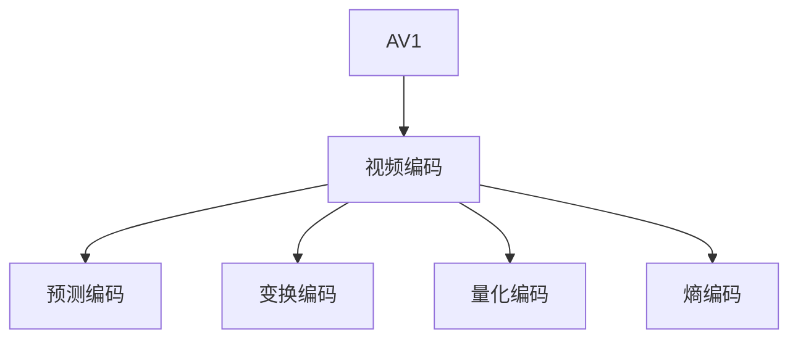

                 

# AV1 视频格式标准：下一代开放媒体编码的优势

## 1. 背景介绍

### 1.1 问题由来

随着高清视频技术的发展和普及，视频流的带宽、分辨率、帧率等指标持续提升，对视频编解码技术提出了更高要求。当前流行的视频编码标准如H.264、H.265等在压缩效率和兼容性上仍存在不足，难以满足未来视频应用的需求。与此同时，开放源代码和低许可费用的需求也日益增加，亟需新一代的视频编码标准。

在这样的背景下，AV1（Advanced Video Coding，先进视频编码）应运而生。作为一种由开放视频标准组织（Open Media Alliance）开发的免费开放编码标准，AV1旨在提供一个低成本、高效、兼容性强的视频编码解决方案，满足未来视频应用对高质量、低延迟和高效率的需求。

### 1.2 问题核心关键点

AV1的核心优势在于其高效压缩、低延迟和兼容性好等特点。这些优势来源于其基于现代视频编码技术的创新设计：

1. **高效压缩**：通过改进预测、变换、量化等技术，显著提升视频编码效率。
2. **低延迟**：采用快速处理、小延迟技术，支持实时和低延迟视频传输。
3. **兼容性**：设计为向后兼容，支持不同分辨率、帧率、色度采样格式等，可轻松适配各种应用场景。

AV1标准由Google等国际知名企业主导，吸引了各大视频平台和设备厂商的积极参与，已广泛应用于Netflix、YouTube、YouTube TV等主流视频服务，显示出强劲的市场前景。

## 2. 核心概念与联系

### 2.1 核心概念概述

为更好地理解AV1的视频编码原理和应用，本节将介绍几个密切相关的核心概念：

- **AV1**：由开放视频标准组织（Open Media Alliance）推出的免费开放编码标准，基于先进的视频编码技术，旨在提供高效、低延迟和兼容性强的高清视频解决方案。

- **视频编码**：将原始视频信号压缩为可传输的数据流，压缩过程中需要考虑视频内容的特征和编码效率，以在保证图像质量的同时，减小数据量。

- **预测编码**：利用视频帧间的相关性，预测当前帧的像素值，减少冗余信息，提升编码效率。

- **变换编码**：通过离散余弦变换（DCT）等数学工具，将视频数据转换为频域表示，提高压缩比。

- **量化编码**：将频域系数量化为一定范围的整数值，减少数据位数，达到压缩效果。

- **熵编码**：利用统计特性将量化后的数据进一步压缩，如Huffman编码、算术编码等。

这些核心概念之间的逻辑关系可以通过以下Mermaid流程图来展示：



这个流程图展示了AV1视频编码的核心技术流程，从原始视频数据到最终压缩流，每一步都充分利用了视频编码的基本原理。

## 3. 核心算法原理 & 具体操作步骤
### 3.1 算法原理概述

AV1视频编码基于H.264/AVC的改进，采用了全新的编码架构和技术。其核心算法原理主要包括以下几个方面：

1. **帧内预测**：利用像素间关系预测当前帧的像素值，减小编码冗余。
2. **帧间预测**：利用前后帧之间的相关性进行预测，进一步提升压缩效率。
3. **变换编码**：采用离散余弦变换（DCT）等数学工具将视频数据转换为频域表示，提升压缩比。
4. **量化编码**：将频域系数量化为一定范围的整数值，达到压缩效果。
5. **熵编码**：利用统计特性对量化后的数据进行进一步压缩，如Huffman编码、算术编码等。

AV1的编码流程主要分为以下几个步骤：

1. **帧内编码**：对每个帧进行独立编码。
2. **帧间编码**：利用前后帧之间的相关性进行预测编码。
3. **块内编码**：对每个宏块内的像素进行预测、变换、量化和熵编码。
4. **序列编码**：将帧内编码和帧间编码的结果进行综合，输出压缩流。

### 3.2 算法步骤详解

以下是AV1视频编码的具体步骤：

**Step 1: 帧内编码**
- 对每个帧进行独立编码，生成帧内编码流。

**Step 2: 帧间编码**
- 利用前后帧之间的相关性进行预测编码，生成帧间编码流。

**Step 3: 块内编码**
- 将每个宏块内的像素进行预测、变换、量化和熵编码，生成块内编码流。

**Step 4: 序列编码**
- 将帧内编码和帧间编码的结果进行综合，生成最终的视频压缩流。

### 3.3 算法优缺点

AV1视频编码方法具有以下优点：

1. **高效压缩**：通过改进预测、变换、量化等技术，显著提升视频编码效率。
2. **低延迟**：采用快速处理、小延迟技术，支持实时和低延迟视频传输。
3. **兼容性**：设计为向后兼容，支持不同分辨率、帧率、色度采样格式等，可轻松适配各种应用场景。

然而，AV1也存在一些局限性：

1. **解码复杂度高**：由于AV1采用了一些较新的编码技术，其解码实现可能较为复杂。
2. **硬件支持有限**：尽管AV1标准由Google主导，但硬件解码器的普及度相对较低。
3. **开发成本高**：AV1的开源社区和生态系统尚在初期，需要更多企业和社区的积极参与和支持。

### 3.4 算法应用领域

AV1作为一种新一代的视频编码标准，适用于各种高清视频应用场景：

- **流媒体**：如Netflix、YouTube等平台，支持实时视频播放。
- **直播电视**：如YouTube TV等，提供低延迟和高清晰度体验。
- **移动设备**：如智能手机、平板电脑等，支持高质量视频录制和播放。
- **AR/VR**：如虚拟现实头盔、增强现实设备等，需要高帧率和低延迟的编码。
- **物联网**：如智能监控、工业视觉等，要求视频编码高效、低延迟。

这些应用场景对视频编解码提出了不同需求，AV1通过灵活的配置和优化，能够满足这些需求，实现更高效的视频传输和播放。

## 4. 数学模型和公式 & 详细讲解
### 4.1 数学模型构建

AV1视频编码的数学模型主要涉及以下几个方面：

1. **预测模型**：利用像素间相关性，预测当前帧的像素值。
2. **变换模型**：采用离散余弦变换（DCT）等数学工具，将视频数据转换为频域表示。
3. **量化模型**：将频域系数量化为一定范围的整数值，减少数据位数。
4. **熵编码模型**：利用统计特性，对量化后的数据进行进一步压缩，如Huffman编码、算术编码等。

### 4.2 公式推导过程

以AV1中的帧内预测为例，其预测模型可表示为：

$$ y = \sum_{i=0}^{N-1} w_i x_i $$

其中 $y$ 为预测的像素值，$x_i$ 为参考像素值，$w_i$ 为预测系数。通过选择合适的权重，使得预测值尽可能接近真实值，减小编码冗余。

变换模型中，AV1采用了离散余弦变换（DCT），将视频数据转换为频域表示：

$$ Y_k = \sum_{n=0}^{N-1} x_n e^{-i \frac{2\pi k n}{N}} $$

其中 $Y_k$ 为频域系数，$x_n$ 为时域系数，$k$ 为频率系数。

量化模型中，AV1对频域系数进行量化，可表示为：

$$ q_k = Q(\text{round}(\frac{Y_k}{s})) $$

其中 $q_k$ 为量化后的系数，$Q(\cdot)$ 为量化函数，$\text{round}(\cdot)$ 为四舍五入函数，$s$ 为缩放因子。

熵编码模型中，AV1采用算术编码，对量化后的系数进行进一步压缩：

$$ C = \sum_{k=0}^{K-1} q_k 2^{-r_k} $$

其中 $C$ 为熵编码结果，$r_k$ 为量化后系数的概率，$K$ 为量化后的系数总数。

### 4.3 案例分析与讲解

以AV1中的帧间预测为例，AV1的帧间预测模型可表示为：

$$ y = \alpha \cdot \sum_{i=0}^{N-1} w_i x_i + (1-\alpha) \cdot \sum_{i=0}^{N-1} w_i x'_i $$

其中 $y$ 为预测的像素值，$x_i$ 为参考像素值，$x'_i$ 为预测参考像素值，$\alpha$ 为混合权重。通过混合前后帧预测，提升预测准确性。

## 5. 项目实践：代码实例和详细解释说明
### 5.1 开发环境搭建

进行AV1视频编码的开发和测试，需要搭建相应的开发环境：

1. **安装依赖软件**：
   - 安装Linux系统，如Ubuntu、Debian等。
   - 安装编译工具链，如gcc、g++等。
   - 安装依赖库，如libavcodec、libvpx、libyuv等。

2. **编译源代码**：
   - 从官方Git仓库克隆AV1源代码。
   - 使用Make工具进行编译，生成静态库和工具链。

3. **搭建测试环境**：
   - 准备测试视频文件，如YUV格式的视频文件。
   - 搭建测试平台，如Linux服务器或虚拟机。

### 5.2 源代码详细实现

以下是使用C语言进行AV1视频编码的示例代码：

```c
#include <stdio.h>
#include <stdlib.h>
#include <string.h>
#include <avcodec.h>

int main() {
    AVCodecContext *avctx;
    AVFrame *frame;
    AVPacket pkt;
    AVIOContext *avio;
    FILE *outfile;

    // 打开输入视频文件
    AVFormatContext *fmt_ctx = avformat_alloc_context();
    if (!fmt_ctx) {
        printf("Could not allocate AVFormatContext\n");
        exit(1);
    }
    avformat_open_input(&fmt_ctx, "input.avi", NULL, NULL);
    avformat_find_stream_info(fmt_ctx, NULL);

    // 打开输出视频文件
    outfile = fopen("output.avi", "wb");
    avio = avio_open(outfile, NULL, AVIO_FLAG_WRITE, NULL, NULL);
    avformat_alloc_output_context2(&fmt_ctx, NULL, NULL, NULL);

    // 创建AVCodecContext
    avctx = avcodec_alloc_context3(AV_CODEC_ID_VP9);
    avcodec_open2(avctx, avcodec_find_decoder(AV_CODEC_ID_VP9), NULL);

    // 创建AVFrame
    frame = av_frame_alloc();
    if (!frame) {
        printf("Could not allocate AVFrame\n");
        exit(1);
    }

    // 初始化AVPacket
    pkt.data = NULL;
    pkt.size = 0;

    // 循环读取和编码视频数据
    while (av_read_frame(fmt_ctx, &pkt) >= 0) {
        avcodec_send_packet(avctx, &pkt);
        while (avcodec_receive_frame(avctx, frame)) {
            avcodec_send_packet(avctx, &pkt);
        }

        // 将AVFrame数据写入AVIOContext
        avio_write(avio, frame->data[0], frame->linesize[0] * frame->height);
    }

    // 关闭AVIOContext和AVFormatContext
    avio_close(avio);
    avformat_close_input(&fmt_ctx);
    avformat_free_context(fmt_ctx);

    // 释放AVFrame
    av_frame_free(&frame);

    return 0;
}
```

### 5.3 代码解读与分析

该代码示例实现了AV1视频编码的基本流程，包括以下几个关键步骤：

1. **打开输入和输出视频文件**：使用`avformat_open_input`和`avformat_alloc_output_context2`函数打开输入和输出视频文件，并创建AVFormatContext。

2. **创建AVCodecContext**：使用`avcodec_alloc_context3`和`avcodec_open2`函数创建AVCodecContext，并将其打开，用于解码和编码视频数据。

3. **创建AVFrame**：使用`av_frame_alloc`函数创建AVFrame，用于存储解码后的视频数据。

4. **循环读取和编码视频数据**：使用`av_read_frame`函数读取输入视频数据，并将其发送到AVCodecContext进行解码。使用`avcodec_send_packet`和`avcodec_receive_frame`函数发送和接收解码后的视频帧。将解码后的视频数据写入AVIOContext，完成编码。

## 6. 实际应用场景
### 6.1 视频流媒体

AV1作为一种高效、低延迟的编码标准，特别适用于流媒体平台。流媒体平台需要实时、高质量、低延迟的视频传输，AV1的编码优势能够满足这些需求。

例如，Netflix已在其平台广泛部署AV1编码，大幅提升视频传输效率和用户体验。AV1的快速处理和低延迟特性，使其成为流媒体平台的首选编码标准。

### 6.2 直播电视

AV1的兼容性和高效编码特性，使其成为直播电视的理想选择。直播电视需要高效、实时、低延迟的视频传输，AV1能够提供稳定的高质量视频流，满足用户需求。

例如，YouTube TV等直播平台已采用AV1编码，实现低延迟和高清晰度的视频传输，提升用户观看体验。

### 6.3 移动设备

AV1在移动设备上的应用，能够提供高质量、低带宽的视频录制和播放。移动设备通常带宽有限，AV1的高效压缩特性能够减小视频文件大小，提高视频播放效率。

例如，Android和iOS设备已支持AV1编码，移动应用开发人员可以使用AV1进行高质量视频录制和播放。

### 6.4 虚拟现实

AV1的低延迟特性，使其在虚拟现实（AR/VR）应用中表现优异。虚拟现实需要高帧率和低延迟的视频传输，AV1能够提供稳定的视频流，支持实时交互体验。

例如，虚拟现实头盔已广泛采用AV1编码，提供高质量、低延迟的视频传输，增强用户的沉浸感。

## 7. 工具和资源推荐
### 7.1 学习资源推荐

为帮助开发者系统掌握AV1视频编码的理论基础和实践技巧，这里推荐一些优质的学习资源：

1. **AV1官方文档**：提供AV1编码标准的详细说明和代码示例，是官方权威的学习资源。
2. **X265编码工具**：由Intel开发的开源AV1编码工具，提供高质量的编码结果。
3. **FFmpeg源代码**：FFmpeg是开源的视频处理工具，支持AV1编码，提供丰富的API和工具。
4. **AV1编码教程**：各大视频编码社区和博客提供的编码教程，帮助开发者快速上手AV1编码。

### 7.2 开发工具推荐

AV1视频编码的开发和测试，需要一些常用的开发工具：

1. **Linux操作系统**：如Ubuntu、Debian等，提供完整的AV1编码环境。
2. **编译工具链**：如gcc、g++等，用于编译AV1源代码。
3. **依赖库**：如libavcodec、libvpx、libyuv等，提供AV1编码的底层支持。
4. **IDE集成开发环境**：如Visual Studio Code、Eclipse等，提供高效开发环境。

### 7.3 相关论文推荐

AV1作为一种新一代的视频编码标准，其研究论文涵盖了编码技术、优化方法等多个方面，以下是几篇重要的研究论文：

1. **AV1视频编码标准**：由开放视频标准组织（Open Media Alliance）发布的官方文档，详细介绍AV1编码标准和算法。
2. **VP9视频编码优化**：Google的研究论文，讨论VP9视频编码的优化方法和技术，为AV1编码提供理论支持。
3. **AV1实时编码研究**：Intel的研究论文，介绍AV1实时编码的技术细节和应用场景，提供实用案例。

## 8. 总结：未来发展趋势与挑战
### 8.1 研究成果总结

AV1作为一种高效、低延迟的开放媒体编码标准，已经在流媒体、直播电视、移动设备等多个领域得到广泛应用。其高效压缩、低延迟和兼容性强的特点，使其成为下一代视频编码标准的有力竞争者。

### 8.2 未来发展趋势

未来，AV1视频编码将呈现出以下几个发展趋势：

1. **更高效的压缩算法**：随着技术的进步，AV1将采用更先进的压缩算法，进一步提高压缩效率。
2. **更强的兼容性和灵活性**：AV1将进一步增强兼容性，支持更多分辨率、帧率、色度采样格式等，提供更多配置选项。
3. **更低的延迟和实时性**：AV1将采用更多实时处理技术，提升低延迟视频传输的能力。
4. **更广泛的硬件支持**：随着硬件厂商的积极参与，AV1的硬件解码器将逐步普及，降低硬件成本。

### 8.3 面临的挑战

尽管AV1在技术上具有诸多优势，但仍面临一些挑战：

1. **硬件支持不足**：虽然AV1标准由Google主导，但硬件解码器的普及度相对较低，需要更多企业和社区的积极参与和支持。
2. **软件开发复杂**：AV1采用了一些较新的编码技术，其开发实现可能较为复杂，需要更多的开发投入。
3. **社区生态系统不成熟**：AV1的开源社区和生态系统尚在初期，需要更多企业和社区的积极参与和贡献。

### 8.4 研究展望

未来的研究应集中在以下几个方面：

1. **进一步优化压缩算法**：研究更先进的压缩算法，提升AV1的压缩效率，满足更高的压缩需求。
2. **增强实时性和低延迟**：研究实时处理和低延迟技术，提升AV1的实时性和低延迟特性，满足实时应用需求。
3. **扩展硬件支持**：推动硬件厂商支持AV1编码，提高硬件解码器的普及度，降低硬件成本。
4. **加强社区建设**：加强AV1开源社区的建设，吸引更多企业和开发者参与，共同推动AV1标准的普及和发展。

通过这些研究方向，AV1视频编码标准必将在未来视频技术领域占据重要地位，成为新一代的高效、低延迟视频编码解决方案。

## 9. 附录：常见问题与解答

**Q1: 什么是AV1？**

A: AV1是由开放视频标准组织（Open Media Alliance）开发的免费开放编码标准，基于先进的视频编码技术，旨在提供高效、低延迟和兼容性强的高清视频解决方案。

**Q2: AV1与H.264和H.265相比有何优势？**

A: AV1相比H.264和H.265具有以下优势：
1. **高效压缩**：通过改进预测、变换、量化等技术，显著提升视频编码效率。
2. **低延迟**：采用快速处理、小延迟技术，支持实时和低延迟视频传输。
3. **兼容性**：设计为向后兼容，支持不同分辨率、帧率、色度采样格式等，可轻松适配各种应用场景。

**Q3: AV1编码过程中需要注意哪些问题？**

A: AV1编码过程中需要注意以下几个问题：
1. **解码复杂度高**：由于AV1采用了一些较新的编码技术，其解码实现可能较为复杂。
2. **硬件支持有限**：尽管AV1标准由Google主导，但硬件解码器的普及度相对较低。
3. **开发成本高**：AV1的开源社区和生态系统尚在初期，需要更多企业和社区的积极参与和支持。

**Q4: AV1有哪些实际应用场景？**

A: AV1适用于以下实际应用场景：
1. **流媒体**：如Netflix、YouTube等平台，支持实时视频播放。
2. **直播电视**：如YouTube TV等，提供低延迟和高清晰度体验。
3. **移动设备**：如智能手机、平板电脑等，支持高质量视频录制和播放。
4. **AR/VR**：如虚拟现实头盔、增强现实设备等，需要高帧率和低延迟的编码。
5. **物联网**：如智能监控、工业视觉等，要求视频编码高效、低延迟。

---

作者：禅与计算机程序设计艺术 / Zen and the Art of Computer Programming

