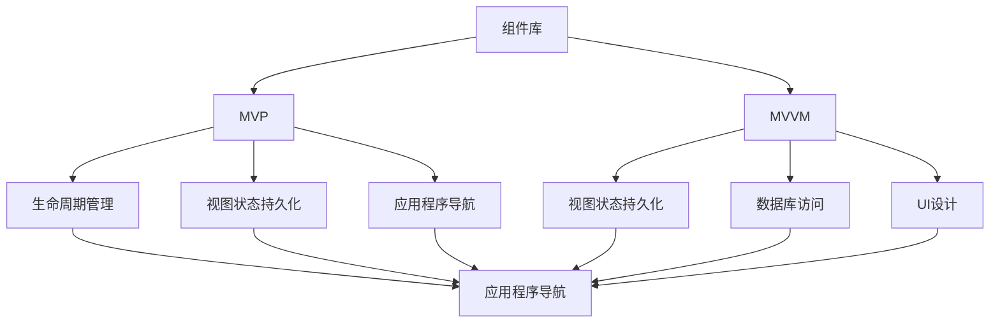

                 

# Android Jetpack 组件库：提升 Android 开发效率和体验

> 关键词：Android Jetpack, 组件库, MVP (Model-View-Presenter), MVVM (Model-View-ViewModel), 数据库, 生命周期管理, 测试, 导航

## 1. 背景介绍

### 1.1 问题由来

在Android应用开发中，开发者需要整合众多框架和库，以便快速构建功能丰富、用户友好的应用程序。然而，随着Android生态系统的不断扩展和功能需求的不断增加，许多开发者感到在设计和实现高效、健壮的应用程序时，需要花费大量时间和精力来管理和整合这些库。

为了解决这一问题，Google于2018年推出了Android Jetpack，旨在简化移动应用开发，使开发者能够更轻松地构建高质量的Android应用程序，同时减少依赖和管理各种第三方库的需求。

### 1.2 问题核心关键点

Android Jetpack是一个由Google领导的集合，旨在简化Android开发，涵盖了许多库和工具，帮助开发者构建现代、高性能、可扩展的Android应用程序。其核心目标是：

1. **简化库管理**：集成和升级多个库的成本和复杂性降低。
2. **提升代码质量**：提供现代化的代码组织和设计模式，提高代码的清晰度和可维护性。
3. **加速开发**：通过重用和自动化简化了开发过程。
4. **加强测试**：支持更强大的测试框架，提高应用的稳定性和可靠性。
5. **提升性能**：利用Android系统的最新特性，提高应用的响应速度和流畅性。

Android Jetpack的组成部分包括但不限于以下组件库：

- ** lifecycle**: 管理应用程序生命周期
- **ViewModel**: 持久化视图状态
- **navigator**: 应用程序导航
- ** Room**: 简化数据库访问
- **Material Components**: 现代化的UI设计
- **Espresso**: 自动化测试

## 2. 核心概念与联系

### 2.1 核心概念概述

Android Jetpack是一个包含许多库和工具的集合，旨在简化Android开发，提升代码质量和开发效率。其核心概念包括：

1. **组件库**：提供了一组独立的库和工具，每个库专注于解决特定问题，如UI设计、生命周期管理、数据库访问等。
2. **设计模式**：包括MVP、MVVM等设计模式，帮助开发者更好地组织代码。
3. **组件功能**：涵盖生命周期管理、视图状态持久化、应用程序导航、数据库访问、UI设计、自动化测试等功能。
4. **工具和框架**：如Android Studio、Espresso、Room等，用于简化开发过程和提升代码质量。

这些概念通过以下Mermaid流程图展示它们的相互联系：

这个图表展示了各个组件库如何在Android Jetpack中相互协作，共同提升Android开发效率和体验。

## 3. 核心算法原理 & 具体操作步骤

### 3.1 算法原理概述

Android Jetpack的组件库主要基于以下设计原则：

1. **单向数据流**：通过避免双向数据流，减少回调和监听器的使用，提升代码的清晰度和可维护性。
2. **持久化视图状态**：通过ViewModel和Room等工具，帮助开发者持久化视图状态，提升应用程序的响应速度和稳定性。
3. **依赖注入**：利用依赖注入框架，简化组件间的依赖关系，提升代码的解耦和可测试性。
4. **UI一致性**：通过Material Components，提供现代化的UI设计，提升用户体验。
5. **自动化测试**：支持强大的测试框架，帮助开发者快速发现和修复问题，提升应用的稳定性。

### 3.2 算法步骤详解

以下是Android Jetpack组件库使用的一些详细步骤：

1. **选择组件库**：根据项目需求选择合适的组件库。如需要持久化视图状态，可以使用ViewModel和Room；需要UI设计，可以使用Material Components。
2. **配置项目**：在项目中添加相应的依赖库，并配置应用程序的生命周期和组件关系。
3. **开发和测试**：利用提供的工具和框架进行开发和测试，提升代码质量和效率。
4. **发布和迭代**：发布应用程序并根据用户反馈进行迭代和优化。

### 3.3 算法优缺点

Android Jetpack的组件库在提升Android开发效率和体验方面具有以下优点：

- **简化开发**：通过提供简化库和工具，减少依赖和管理复杂性的成本。
- **提升代码质量**：利用设计模式和持久化视图状态，提高代码的清晰度和可维护性。
- **加速开发**：通过重用和自动化，简化开发过程。
- **加强测试**：提供强大的测试框架，提升应用的稳定性和可靠性。
- **提升性能**：利用现代UI设计、数据库访问等特性，提升应用的响应速度和流畅性。

然而，它也存在一些缺点：

- **学习曲线**：由于涉及多个库和工具，需要花费一定时间来学习和理解。
- **性能开销**：一些组件库的实现可能会带来额外的性能开销，需要优化以避免影响应用性能。
- **依赖问题**：由于依赖多个库，可能出现依赖冲突或版本问题。

### 3.4 算法应用领域

Android Jetpack组件库广泛应用于各种类型的Android应用程序开发中，包括：

- **移动应用**：从简单的聊天应用到复杂的企业级应用。
- **游戏应用**：利用高性能UI和数据库访问，提升游戏体验。
- **智能设备**：利用现代UI设计和数据库访问，提升智能设备的用户体验。
- **物联网**：利用轻量级数据库和持久化视图状态，优化物联网设备的交互和响应速度。

## 4. 数学模型和公式 & 详细讲解 & 举例说明

### 4.1 数学模型构建

Android Jetpack的组件库主要通过以下几个数学模型来提升开发效率和体验：

- **生命周期管理**：利用生命周期状态机，管理应用程序的各个生命周期阶段。
- **视图状态持久化**：通过ViewModel和Room，持久化视图状态和数据库访问。
- **导航管理**：利用导航组件，简化应用程序的导航逻辑。

### 4.2 公式推导过程

这里将以生命周期管理为例，介绍其中的数学模型构建和公式推导过程。

- **生命周期状态机**：
  - 定义生命周期状态：`onCreate`, `onResume`, `onPause`, `onStop`, `onDestroy`
  - 设计状态转移图：`onResume --> onPause`，`onPause --> onStop`，`onStop --> onStart`，`onStart --> onResume`

- **ViewModel**：
  - 持久化视图状态：
    - `class MyViewModel() : ViewModel() {`
    - `var count = 0`
    - `fun increment() {`
    - `count++`
    - `}"`
    - `fun getCount(): Int {`
    - `return count`
    - `}`

- **Room**：
  - 简化数据库访问：
    - `@Entity(tableName = "users")`
    - `data class User (`
    - `    @PrimaryKey var id: Int,`
    - `    var name: String`
    - `)`
    - `@Dao interface UserDao {`
    - `fun getAll(): List<User>`
    - `fun save(user: User)`

### 4.3 案例分析与讲解

以下是一个使用Android Jetpack组件库进行生命周期管理和视图状态持久化的案例：

- **生命周期管理**：
  - `public class MainActivity : AppCompatActivity() {`
  - `override fun onCreate(savedInstanceState: Bundle?) {`
  - `super.onCreate(savedInstanceState)`
  - `setContentView(R.layout.activity_main)`
  - `var viewModel = ViewModelProvider(this).get(MyViewModel::class.java)`
  - `}`

- **视图状态持久化**：
  - `class MyViewModel() : ViewModel() {`
  - `var count = 0`
  - `fun increment() {`
  - `count++`
  - `}`

  - `fun getCount(): Int {`
  - `return count`
  - `}`

通过上述案例，可以看到Android Jetpack组件库如何简化生命周期管理和视图状态持久化，提升应用程序的开发效率和用户体验。

## 5. 项目实践：代码实例和详细解释说明

### 5.1 开发环境搭建

1. **安装Android Studio**：从官网下载并安装Android Studio，作为开发环境。
2. **配置项目**：创建一个新的Android项目，并添加所需的依赖库和组件。
3. **创建项目结构**：在`app`模块下创建`java`和`models`文件夹，用于存放代码和模型类。

### 5.2 源代码详细实现

以下是一个简单的Android应用实例，展示了如何使用Android Jetpack组件库进行生命周期管理和视图状态持久化：

- **创建ViewModel**：
  - `class MyViewModel() : ViewModel() {`
  - `var count = 0`
  - `fun increment() {`
  - `count++`
  - `}`

  - `fun getCount(): Int {`
  - `return count`
  - `}`

- **创建Activity**：
  - `public class MainActivity : AppCompatActivity() {`
  - `override fun onCreate(savedInstanceState: Bundle?) {`
  - `super.onCreate(savedInstanceState)`
  - `setContentView(R.layout.activity_main)`
  - `var viewModel = ViewModelProvider(this).get(MyViewModel::class.java)`
  - `val button = findViewById<Button>(R.id.button)`
  - `button.setOnClickListener {`
  - `viewModel.increment()`
  - `}`

  - `val textView = findViewById<TextView>(R.id.textView)`
  - `textView.text = viewModel.getCount().toString()`

通过上述代码，可以看到如何使用ViewModel持久化视图状态，并在Activity中实现视图状态更新。

### 5.3 代码解读与分析

上述代码中，我们使用了`ViewModel`来持久化视图状态，通过`increment`函数实现计数器的自增。在`MainActivity`中，通过`findViewById`获取UI元素，并设置点击事件监听器，当用户点击按钮时，调用`increment`函数更新计数器，并在`textView`中显示当前计数器值。

## 6. 实际应用场景

### 6.1 智能家居

Android Jetpack的组件库可以用于开发智能家居应用，例如：

- **智能控制**：利用生命周期管理和持久化视图状态，实现设备的稳定连接和状态更新。
- **语音助手**：利用MVVM和依赖注入框架，实现语音命令的解析和响应。
- **UI设计**：利用Material Components，提供现代化的UI设计，提升用户体验。

### 6.2 医疗应用

Android Jetpack的组件库可以用于开发医疗应用，例如：

- **电子健康记录**：利用Room简化数据库访问，实现健康记录的持久化和查询。
- **患者管理**：利用MVP和依赖注入，简化患者信息的存储和检索。
- **生命周期管理**：利用生命周期管理，实现应用程序在不同状态下的行为调整。

### 6.3 电商应用

Android Jetpack的组件库可以用于开发电商应用，例如：

- **商品管理**：利用Room简化数据库访问，实现商品的持久化和查询。
- **购物车管理**：利用MVP和持久化视图状态，实现购物车状态的持久化和更新。
- **UI设计**：利用Material Components，提供现代化的UI设计，提升用户体验。

### 6.4 未来应用展望

未来，Android Jetpack组件库将继续发展和改进，将涵盖更多功能，提供更高效的工具和框架。以下是一些可能的未来发展方向：

- **AI和机器学习**：集成机器学习框架，提升应用的数据处理和预测能力。
- **跨平台开发**：支持更多的平台和设备，实现跨平台开发和部署。
- **分布式开发**：利用分布式构建工具，提升开发效率和代码质量。
- **性能优化**：优化组件库的性能和资源消耗，提升应用的响应速度和流畅性。

## 7. 工具和资源推荐

### 7.1 学习资源推荐

1. **Android Developers**：官方文档和指南，涵盖Android Jetpack的各个组件库和工具。
2. **Jetpack Samples**：官方提供的样例代码和教程，帮助开发者学习和理解Jetpack组件库的使用。
3. **Kotlin in Action**：Kotlin语言入门书籍，涵盖Android Jetpack相关的Kotlin用法。
4. **Android Jetpack Architecture**：关于Android Jetpack架构的深入解析，帮助开发者更好地理解Jetpack的组件库和设计模式。
5. **Espresso**：官方文档和教程，介绍Espresso自动化测试框架的使用。

### 7.2 开发工具推荐

1. **Android Studio**：官方的IDE，提供丰富的开发工具和调试功能。
2. **Espresso**：自动化测试框架，帮助开发者快速发现和修复应用问题。
3. **Room**：简化数据库访问的工具，提升数据处理效率。
4. **Material Components**：现代化的UI设计工具，提升用户体验。
5. **ViewModel**：持久化视图状态的工具，提升应用响应速度和稳定性。

### 7.3 相关论文推荐

1. **Architecture Components**：Google的官方博客，介绍Android Jetpack的各个组件库和设计模式。
2. **Room**：官方文档，介绍Room库的使用和性能优化技巧。
3. **Espresso**：官方文档，介绍Espresso框架的使用和测试技巧。
4. **Material Components**：官方文档，介绍Material Components的设计和使用。
5. **Architecture**：Google的官方博客，介绍Android Jetpack的架构设计和最佳实践。

## 8. 总结：未来发展趋势与挑战

### 8.1 总结

本文对Android Jetpack组件库进行了全面系统的介绍，详细讲解了其各个组件库的使用方法和设计原理。Android Jetpack通过简化库管理、提升代码质量、加速开发、加强测试、提升性能等手段，极大地提升了Android应用的开发效率和用户体验。

通过本文的系统梳理，可以看到，Android Jetpack组件库已成为Android开发中不可或缺的工具，大大简化了开发者构建高质量应用程序的过程，为Android应用的开发和测试提供了强大而便捷的解决方案。未来，随着Android生态系统的不断发展和完善，Android Jetpack组件库必将在更多领域得到广泛应用，为Android开发者提供更多、更好的开发工具和资源。

### 8.2 未来发展趋势

未来，Android Jetpack组件库的发展将呈现以下几个趋势：

1. **功能扩展**：新增更多功能组件，涵盖更多的应用场景，如AI、机器学习、跨平台开发等。
2. **性能优化**：优化组件库的性能和资源消耗，提升应用的响应速度和流畅性。
3. **用户体验提升**：提供更丰富的UI设计组件和工具，提升用户体验。
4. **开发效率提升**：引入更多的自动化工具和框架，简化开发过程，提升开发效率。
5. **跨平台支持**：支持更多的平台和设备，实现跨平台开发和部署。

### 8.3 面临的挑战

尽管Android Jetpack组件库已经取得了瞩目成就，但在其发展过程中仍面临以下挑战：

1. **学习曲线**：由于涉及多个库和工具，学习成本较高，需要开发者花费一定时间来学习和理解。
2. **性能开销**：一些组件库的实现可能会带来额外的性能开销，需要优化以避免影响应用性能。
3. **依赖问题**：由于依赖多个库，可能出现依赖冲突或版本问题。

### 8.4 研究展望

为了应对这些挑战，未来的研究和改进方向包括：

1. **简化学习曲线**：提供更多的教程和样例代码，帮助开发者更快地上手和使用Android Jetpack组件库。
2. **性能优化**：优化组件库的性能和资源消耗，提升应用的响应速度和流畅性。
3. **依赖管理**：提供更好的依赖管理工具，帮助开发者避免依赖冲突和版本问题。

## 9. 附录：常见问题与解答

**Q1：如何选择合适的ViewModel**？

A: 根据视图状态的特点选择合适的ViewModel，如需要持久化视图状态，选择`MutableLiveData`；如果需要单向数据流，选择`Observable`。

**Q2：Room和SQLite是什么关系？**

A: Room是一个基于SQLite的数据库访问库，简化数据库访问和操作，提高开发效率和代码质量。

**Q3：如何使用Espresso进行自动化测试？**

A: 通过编写测试脚本，使用Espresso模拟用户操作，验证应用的行为和响应。

**Q4：ViewModel和MVVM有什么区别？**

A: ViewModel是MVVM模式的一部分，用于持久化视图状态，简化视图与数据的交互。

**Q5：Material Components有哪些优势？**

A: Material Components提供现代化的UI设计，提升用户体验和应用美观度。

---

作者：禅与计算机程序设计艺术 / Zen and the Art of Computer Programming

