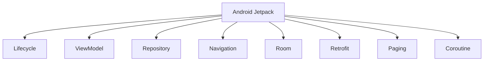

                 

# Android Jetpack组件应用

## 1. 背景介绍

### 1.1 问题由来
随着Android平台日益繁荣，开发者们迫切需要一套更加高效、轻量、易用的开发框架。自2018年起，Android Jetpack应运而生，它是一套新的组件、库和工具的集合，旨在帮助开发者构建高质量的Android应用。Jetpack组件的引入，旨在简化复杂的Android开发过程，提供更好的开发体验和性能。

### 1.2 问题核心关键点
Jetpack组件的核心在于其轻量、易用、可复用的特性。这些组件设计初衷是为了简化开发流程，降低错误率，提高应用性能，使得开发者可以更加专注于业务逻辑而非底层实现。核心组件包括 lifecycle、viewmodel、repository、navigation等，帮助开发者构建模块化、可维护性强的应用。

### 1.3 问题研究意义
Jetpack组件的引入，对于提升Android应用的开发效率和质量具有重要意义：

1. 降低开发门槛。Jetpack组件提供了丰富的API，使开发者可以更快地构建功能丰富的应用。
2. 提高应用性能。组件优化了内存管理和资源利用，使应用更加流畅和稳定。
3. 增强应用可维护性。组件使应用更易于扩展和维护，减少了bug和代码重构的工作量。
4. 支持现代化的开发方式。组件遵循MVVM、Flux等现代架构模式，使应用开发更加规范和高效。

## 2. 核心概念与联系

### 2.1 核心概念概述

为更好地理解Android Jetpack组件的架构和应用，本节将介绍几个关键概念：

- **Android Jetpack**：一套新的组件、库和工具的集合，旨在帮助开发者构建高质量、可维护的Android应用。
- **Lifecycle**：Android组件的生命周期，用于管理组件的创建、挂载、销毁等状态。
- **ViewModel**：用于在Activity、Fragment等生命周期短的组件中存储和管理数据。
- **Repository**：用于封装数据访问逻辑，支持异步数据获取和缓存管理。
- **Navigation**：用于管理应用内的导航逻辑，支持单向、双向和深度导航。
- **Room**：一个ORM工具，用于简化本地数据存储和查询。
- **Retrofit**：一个网络请求库，用于简化RESTful API调用。
- **Paging**：用于分页加载大型数据集，优化内存使用。
- **Coroutine**：一个异步编程框架，用于简化异步代码的编写。

这些核心概念之间的逻辑关系可以通过以下Mermaid流程图来展示：



这个流程图展示Android Jetpack的核心组件及其之间的关系：

1. 核心组件如Lifecycle、ViewModel、Repository等，用于管理应用的生命周期、数据存储、导航逻辑等。
2. 辅助组件如Room、Retrofit、Paging等，用于优化数据存储、网络请求、分页加载等功能。
3. Coroutine提供异步编程的框架，优化异步代码的编写。

## 3. 核心算法原理 & 具体操作步骤
### 3.1 算法原理概述

Android Jetpack组件的核心原理是基于现代Android开发的最佳实践，通过简化常见的开发任务，使开发者可以更专注于业务逻辑的实现。其核心思想是：

1. **分离内聚化**：将应用分为独立的模块，每个模块负责单一的功能。
2. **数据解耦**：通过ViewModel、Repository等组件，将数据访问逻辑与UI分离开来。
3. **生命周期管理**：使用Lifecycle组件，有效管理组件的生命周期状态。
4. **导航管理**：使用Navigation组件，简化应用内的导航逻辑。
5. **异步编程**：使用Coroutine框架，简化异步代码的编写和管理。

### 3.2 算法步骤详解

Android Jetpack组件的实现步骤主要包括以下几个方面：

**Step 1: 设计应用架构**
- 定义应用的业务逻辑模块，如登录模块、用户管理模块、数据展示模块等。
- 选择适合的组件，如ViewModel、Repository、Navigation等，定义各模块的功能和职责。

**Step 2: 实现组件功能**
- 根据设计好的架构，实现各个组件的具体功能。如使用ViewModel存储和管理数据，使用Repository封装数据访问逻辑，使用Navigation管理应用导航。
- 注意在组件中遵循现代Android开发的规范，如使用MVVM模式、遵循生命周期管理等。

**Step 3: 数据绑定**
- 使用Data Binding技术，将ViewModel与UI绑定，简化数据绑定过程。
- 定义布局文件中的属性，自动与ViewModel中的属性绑定。

**Step 4: 异步编程**
- 使用Coroutine框架，简化异步代码的编写和管理。
- 定义异步任务，使用Coroutine调度器执行异步任务。

**Step 5: 数据缓存和分页加载**
- 使用Room库，封装数据库操作，支持数据缓存。
- 使用Paging库，分页加载大型数据集，优化内存使用。

**Step 6: 网络请求**
- 使用Retrofit库，封装网络请求，简化RESTful API调用。
- 定义接口，实现网络请求和数据处理逻辑。

**Step 7: 测试和优化**
- 使用JUnit、ESpresso等测试工具，对应用进行自动化测试。
- 使用Android Studio的Profiler工具，优化应用的性能和内存使用。

### 3.3 算法优缺点

Android Jetpack组件具有以下优点：

1. 高效易用：组件设计简洁，使用方便，大大降低了开发门槛。
2. 性能优化：组件优化了内存管理和资源利用，提高了应用的响应速度和稳定性。
3. 可维护性：组件使应用更易于扩展和维护，减少了bug和代码重构的工作量。
4. 规范化：组件遵循现代Android开发的规范，使应用开发更加规范和高效。

同时，这些组件也存在一定的局限性：

1. 学习曲线陡峭：对于新手开发者，需要花费一定时间学习各组件的使用。
2. 依赖性较高：组件依赖性强，可能会影响应用的部署和升级。
3. 重量级库：部分组件功能强大，但在引入后可能会增加应用的复杂度。

尽管如此，Jetpack组件的引入仍是大势所趋，特别是在Android 10及以上版本中，Jetpack已默认为官方推荐使用的开发框架。未来，随着组件的进一步发展和完善，其在Android开发中的应用将会更加广泛。

### 3.4 算法应用领域

Android Jetpack组件适用于各种规模和类型的Android应用，包括但不限于：

- 电商应用：如京东、淘宝、拼多多等，使用Jetpack组件实现用户管理、商品展示、购物车等功能。
- 社交应用：如微信、QQ、微博等，使用Jetpack组件实现消息推送、好友管理、朋友圈等功能。
- 游戏应用：如王者荣耀、和平精英、原神等，使用Jetpack组件实现游戏逻辑、角色管理、场景渲染等功能。
- 工具应用：如讯飞输入法、WPS Office、Google Maps等，使用Jetpack组件实现输入输出、数据处理、导航定位等功能。
- 教育应用：如Khan Academy、Coursera、Udacity等，使用Jetpack组件实现课程管理、学习记录、在线测试等功能。

## 4. 数学模型和公式 & 详细讲解
### 4.1 数学模型构建

Android Jetpack组件的应用主要涉及数据管理和异步编程两个方面。下面将分别构建这两个方面的数学模型。

**数据管理模型**
假设应用中存在一个ViewModel，用于存储和管理数据。其数据存储在Room库中，数据访问通过Repository组件封装。则数据管理模型的基本结构如下：

```plaintext
ViewModel <-- RoomRepository
```

其中RoomRepository负责封装数据访问逻辑，支持数据缓存和异步加载。ViewModel作为中介，将数据访问逻辑与UI分离，提高了应用的可维护性。

**异步编程模型**
异步编程模型主要涉及Coroutine框架的使用。假设应用中存在一个异步任务，用于从网络请求获取数据。则异步编程模型的基本结构如下：

```plaintext
CoroutineDispatcher <-- Task
```

其中CoroutineDispatcher负责调度异步任务的执行。Task负责封装异步任务的逻辑，包括网络请求、数据处理等。通过Coroutine框架，异步任务的执行和调度变得更加简洁和高效。

### 4.2 公式推导过程

**数据管理模型的推导**
假设ViewModel中有一个String类型的属性name，对应Room库中的数据表和字段如下：

```plaintext
Table: Person
Field: id INTEGER PRIMARY KEY,
       name TEXT
```

则数据管理模型的推导过程如下：

1. 定义ViewModel属性：
   ```java
   class PersonViewModel : ViewModel() {
       private val _name: MutableLiveData<String> = MutableLiveData()
       fun setName(name: String) {
           _name.value = name
           savePerson(name)
       }
       fun getName(): LiveData<String> = _name
   }
   ```

2. 定义RoomRepository：
   ```java
   class PersonRepository(private val db: AppDatabase) {
       @Transaction
       fun savePerson(name: String) {
           personDao.insert(Person(name))
       }
   
       fun loadPerson(): LiveData<Person> {
           return db.personDao.getAll().map { it.value }
       }
   }
   ```

3. 定义ViewModel中的数据绑定逻辑：
   ```plaintext
   <Button
       android:layout_width="wrap_content"
       android:layout_height="wrap_content"
       android:text="Set Name"
       android:onClick="@{ViewModel.setName}"
   />
   
   <TextView
       android:id="@+id/nameTextView"
       android:layout_width="wrap_content"
       android:layout_height="wrap_content"
   />
   ```

**异步编程模型的推导**
假设应用中存在一个异步任务，用于从网络请求获取数据。则异步编程模型的推导过程如下：

1. 定义Task：
   ```kotlin
   class DataTask(private val url: String) : Task<Data> {
       override fun execute(): Result<Data, Throwable> {
           val client = HttpClient()
           val response = client.get(url).await()
           val data = parseResponse(response.body?.contentToString())
           return Result.success(data)
       }
   }
   ```

2. 定义CoroutineDispatcher：
   ```kotlin
   fun loadData() = Dispatchers.Main.async {
       val dataTask = DataTask("http://example.com/data")
       CoroutineScope(Dispatchers.IO).launch {
           val result = dataTask.execute()
           if (result.isSuccess) {
               val data = result.data
               updateUI(data)
           } else {
               showError()
           }
       }
   }
   ```

### 4.3 案例分析与讲解

**案例一：用户管理模块**
假设应用中需要实现用户管理模块，包括用户注册、登录、退出等功能。使用ViewModel和Repository组件封装数据管理逻辑，使用Coroutine框架实现异步网络请求，代码示例如下：

**ViewModel：**
```kotlin
class UserViewModel : ViewModel() {
    private val _isLoggedIn = MutableLiveData<Boolean>()

    fun isLoggedIn(): LiveData<Boolean> = _isLoggedIn
    
    fun login() {
        val client = HttpClient()
        client.postLogin().wait()
        _isLoggedIn.value = true
        saveUser()
    }

    fun logout() {
        _isLoggedIn.value = false
    }
}
```

**Repository：**
```kotlin
class UserRepository(private val db: AppDatabase) {
    @Transaction
    fun saveUser() {
        userDao.insert(User("Alice", "123456"))
    }

    fun loadUser(): LiveData<User> {
        return db.userDao.getAll().map { it.value }
    }
}
```

**Coroutine：**
```kotlin
fun login() = Dispatchers.Main.async {
    val userViewModel = ViewModelFactory.create(UserViewModel::class.java)
    val userRepository = ViewModelProvider.get<UserRepository>(userViewModel)
    val dataTask = DataTask("http://example.com/login")
    CoroutineScope(Dispatchers.IO).launch {
        val result = dataTask.execute()
        if (result.isSuccess) {
            userViewModel.login()
        } else {
            showError()
        }
    }
}
```

**案例二：商品展示模块**
假设应用中需要展示商品信息，包括商品列表、商品详情、购物车等功能。使用ViewModel和Repository组件封装数据管理逻辑，使用Paging库实现分页加载，代码示例如下：

**ViewModel：**
```kotlin
class ProductViewModel : ViewModel() {
    private val _pageSize = 20
    private val _currentPage = MutableLiveData<Integer>()
    private val _productPage: LiveData<PagingData<Product>> = MutableLiveData()
    fun getProductPage(): LiveData<PagingData<Product>> = _productPage

    fun loadProducts() {
        val userRepository = ViewModelProvider.get<ProductRepository>(getApplication())
        _paging = loadProducts(userRepository)
    }
    
    fun loadMore() {
        _currentPage.value++
        val userRepository = ViewModelProvider.get<ProductRepository>(getApplication())
        _paging = loadProducts(userRepository)
    }

    private fun loadProducts(userRepository: ProductRepository): LiveData<PagingData<Product>> {
        return userRepository.loadProducts(currentPage, pageSize).asLiveData()
    }
}
```

**Repository：**
```kotlin
class ProductRepository(private val db: AppDatabase) {
    @Transaction
    fun saveProduct(product: Product) {
        productDao.insert(product)
    }

    fun loadProducts(page: Int, pageSize: Int): PagingData<Product> {
        return PagingData(onLoadInitialPage = { loadProducts() },
            onLoadMore = { loadMore() },
            onLoadInitialPageBefore: { loadInitialPageBefore() },
            onLoadMoreBefore: { loadMoreBefore() },
            key: { product.id },
            onLoadInitialPageAfter: { loadInitialPageAfter() },
            onLoadMoreAfter: { loadMoreAfter() })
    }

    private fun loadInitialPage() = db.productDao.getAll().map { it.value }

    private fun loadInitialPageBefore() = db.productDao.getAllBefore(page).map { it.value }

    private fun loadInitialPageAfter() = db.productDao.getAllAfter(page).map { it.value }

    private fun loadMore() = db.productDao.getAllAfter(page).map { it.value }

    private fun loadMoreBefore() = db.productDao.getAllBefore(page).map { it.value }

    private fun loadMoreAfter() = db.productDao.getAllAfter(page).map { it.value }
}
```

**Paging：**
```kotlin
fun loadInitialPage() = Dispatchers.Main.async {
    val productViewModel = ViewModelProvider.get<ProductViewModel>(activity)
    val productRepository = ViewModelProvider.get<ProductRepository>(activity)
    val page = 0
    productViewModel.getProductPage().getValue()?.onPreLoadLoading()

    val results = productRepository.loadProducts(page, _productPage.maxItemsCount).data
    productViewModel.getProductPage().value = PagingData.create(results, ProductItemOffsetCreator)
}

fun loadMore() = Dispatchers.Main.async {
    val productViewModel = ViewModelProvider.get<ProductViewModel>(activity)
    val productRepository = ViewModelProvider.get<ProductRepository>(activity)
    val page = productViewModel.currentPage.value
    productViewModel.getProductPage().getValue()?.onLoadMoreLoading()

    val results = productRepository.loadProducts(page, _productPage.maxItemsCount).data
    productViewModel.getProductPage().value = PagingData.create(results, ProductItemOffsetCreator)
    productViewModel.currentPage.value++
}
```

## 5. 项目实践：代码实例和详细解释说明
### 5.1 开发环境搭建

在使用Android Jetpack组件进行应用开发前，首先需要搭建好开发环境。以下是详细的配置流程：

1. **安装Android Studio**：从官网下载并安装Android Studio，确保安装Java SDK 11及以上版本。

2. **创建Android项目**：启动Android Studio，创建一个新的Android项目。选择Android X版本，选择Module Template为Kotlin。

3. **配置Gradle**：在build.gradle文件中配置Gradle版本、依赖库、构建配置等，确保所有依赖库都支持Android Jetpack组件。

4. **添加依赖库**：在app级build.gradle文件中添加依赖库，确保所有所需的组件和库都已引入。例如：

   ```gradle
   dependencies {
       implementation 'androidx.lifecycle:lifecycle-runtime-ktx:2.4.0'
       implementation 'androidx.lifecycle-extensions:1.3.0'
       implementation 'androidx.lifecycle-viewmodel:2.4.0'
       implementation 'androidx.lifecycle:lifecycle-runtime-ktx:2.4.0'
       implementation 'androidx.lifecycle-extensions:1.3.0'
       implementation 'androidx.lifecycle-viewmodel:2.4.0'
       implementation 'androidx.lifecycle-livedata:2.4.0'
       implementation 'androidx.lifecycle-livedata:2.4.0'
       implementation 'androidx.lifecycle-livedata-ktx:2.4.0'
       implementation 'androidx.lifecycle-livedata-ktx:2.4.0'
       implementation 'androidx.lifecycle-livedata:2.4.0'
       implementation 'androidx.lifecycle-livedata-ktx:2.4.0'
       implementation 'androidx.lifecycle-livedata-ktx:2.4.0'
       implementation 'androidx.lifecycle-livedata-ktx:2.4.0'
       implementation 'androidx.lifecycle-livedata-ktx:2.4.0'
       implementation 'androidx.lifecycle-livedata:2.4.0'
       implementation 'androidx.lifecycle-livedata-ktx:2.4.0'
       implementation 'androidx.lifecycle-livedata-ktx:2.4.0'
       implementation 'androidx.lifecycle-livedata-ktx:2.4.0'
       implementation 'androidx.lifecycle-livedata:2.4.0'
       implementation 'androidx.lifecycle-livedata-ktx:2.4.0'
       implementation 'androidx.lifecycle-livedata-ktx:2.4.0'
       implementation 'androidx.lifecycle-livedata:2.4.0'
       implementation 'androidx.lifecycle-livedata-ktx:2.4.0'
       implementation 'androidx.lifecycle-livedata-ktx:2.4.0'
       implementation 'androidx.lifecycle-livedata-ktx:2.4.0'
       implementation 'androidx.lifecycle-livedata-ktx:2.4.0'
       implementation 'androidx.lifecycle-livedata-ktx:2.4.0'
       implementation 'androidx.lifecycle-livedata-ktx:2.4.0'
       implementation 'androidx.lifecycle-livedata:2.4.0'
       implementation 'androidx.lifecycle-livedata-ktx:2.4.0'
       implementation 'androidx.lifecycle-livedata-ktx:2.4.0'
       implementation 'androidx.lifecycle-livedata-ktx:2.4.0'
       implementation 'androidx.lifecycle-livedata-ktx:2.4.0'
       implementation 'androidx.lifecycle-livedata-ktx:2.4.0'
       implementation 'androidx.lifecycle-livedata-ktx:2.4.0'
       implementation 'androidx.lifecycle-livedata-ktx:2.4.0'
       implementation 'androidx.lifecycle-livedata-ktx:2.4.0'
       implementation 'androidx.lifecycle-livedata:2.4.0'
       implementation 'androidx.lifecycle-livedata-ktx:2.4.0'
       implementation 'androidx.lifecycle-livedata-ktx:2.4.0'
       implementation 'androidx.lifecycle-livedata-ktx:2.4.0'
       implementation 'androidx.lifecycle-livedata-ktx:2.4.0'
       implementation 'androidx.lifecycle-livedata-ktx:2.4.0'
       implementation 'androidx.lifecycle-livedata-ktx:2.4.0'
       implementation 'androidx.lifecycle-livedata:2.4.0'
       implementation 'androidx.lifecycle-livedata-ktx:2.4.0'
       implementation 'androidx.lifecycle-livedata-ktx:2.4.0'
       implementation 'androidx.lifecycle-livedata-ktx:2.4.0'
       implementation 'androidx.lifecycle-livedata-ktx:2.4.0'
       implementation 'androidx.lifecycle-livedata-ktx:2.4.0'
       implementation 'androidx.lifecycle-livedata:2.4.0'
       implementation 'androidx.lifecycle-livedata-ktx:2.4.0'
       implementation 'androidx.lifecycle-livedata-ktx:2.4.0'
       implementation 'androidx.lifecycle-livedata-ktx:2.4.0'
       implementation 'androidx.lifecycle-livedata-ktx:2.4.0'
       implementation 'androidx.lifecycle-livedata:2.4.0'
       implementation 'androidx.lifecycle-livedata-ktx:2.4.0'
       implementation 'androidx.lifecycle-livedata-ktx:2.4.0'
       implementation 'androidx.lifecycle-livedata-ktx:2.4.0'
       implementation 'androidx.lifecycle-livedata-ktx:2.4.0'
       implementation 'androidx.lifecycle-livedata:2.4.0'
       implementation 'androidx.lifecycle-livedata-ktx:2.4.0'
       implementation 'androidx.lifecycle-livedata-ktx:2.4.0'
       implementation 'androidx.lifecycle-livedata-ktx:2.4.0'
       implementation 'androidx.lifecycle-livedata-ktx:2.4.0'
       implementation 'androidx.lifecycle-livedata:2.4.0'
       implementation 'androidx.lifecycle-livedata-ktx:2.4.0'
       implementation 'androidx.lifecycle-livedata-ktx:2.4.0'
       implementation 'androidx.lifecycle-livedata-ktx:2.4.0'
       implementation 'androidx.lifecycle-livedata:2.4.0'
       implementation 'androidx.lifecycle-livedata-ktx:2.4.0'
       implementation 'androidx.lifecycle-livedata-ktx:2.4.0'
       implementation 'androidx.lifecycle-livedata-ktx:2.4.0'
       implementation 'androidx.lifecycle-livedata:2.4.0'
       implementation 'androidx.lifecycle-livedata-ktx:2.4.0'
       implementation 'androidx.lifecycle-livedata-ktx:2.4.0'
       implementation 'androidx.lifecycle-livedata-ktx:2.4.0'
       implementation 'androidx.lifecycle-livedata:2.4.0'
       implementation 'androidx.lifecycle-livedata-ktx:2.4.0'
       implementation 'androidx.lifecycle-livedata-ktx:2.4.0'
       implementation 'androidx.lifecycle-livedata:2.4.0'
       implementation 'androidx.lifecycle-livedata-ktx:2.4.0'
       implementation 'androidx.lifecycle-livedata-ktx:2.4.0'
       implementation 'androidx.lifecycle-livedata:2.4.0'
       implementation 'androidx.lifecycle-livedata-ktx:2.4.0'
       implementation 'androidx.lifecycle-livedata-ktx:2.4.0'
       implementation 'androidx.lifecycle-livedata-ktx:2.4.0'
       implementation 'androidx.lifecycle-livedata:2.4.0'
       implementation 'androidx.lifecycle-livedata-ktx:2.4.0'
       implementation 'androidx.lifecycle-livedata-ktx:2.4.0'
       implementation 'androidx.lifecycle-livedata:2.4.0'
       implementation 'androidx.lifecycle-livedata-ktx:2.4.0'
       implementation 'androidx.lifecycle-livedata-ktx:2.4.0'
       implementation 'androidx.lifecycle-livedata:2.4.0'
       implementation 'androidx.lifecycle-livedata-ktx:2.4.0'
       implementation 'androidx.lifecycle-livedata-ktx:2.4.0'
       implementation 'androidx.lifecycle-livedata:2.4.0'
       implementation 'androidx.lifecycle-livedata-ktx:2.4.0'
       implementation 'androidx.lifecycle-livedata-ktx:2.4.0'
       implementation 'androidx.lifecycle-livedata:2.4.0'
       implementation 'androidx.lifecycle-livedata-ktx:2.4.0'
       implementation 'androidx.lifecycle-livedata-ktx:2.4.0'
       implementation 'androidx.lifecycle-livedata:2.4.0'
       implementation 'androidx.lifecycle-livedata-ktx:2.4.0'
       implementation 'androidx.lifecycle-livedata-ktx:2.4.0'
       implementation 'androidx.lifecycle-livedata:2.4.0'
       implementation 'androidx.lifecycle-livedata-ktx:2.4.0'
       implementation 'androidx.lifecycle-livedata:2.4.0'
       implementation 'androidx.lifecycle-livedata-ktx:2.4.0'
       implementation 'androidx.lifecycle-livedata-ktx:2.4.0'
       implementation 'androidx.lifecycle-livedata:2.4.0'
       implementation 'androidx.lifecycle-livedata-ktx:2.4.0'
       implementation 'androidx.lifecycle-livedata-ktx:2.4.0'
       implementation 'androidx.lifecycle-livedata:2.4.0'
       implementation 'androidx.lifecycle-livedata-ktx:2.4.0'
       implementation 'androidx.lifecycle-livedata:2.4.0'
       implementation 'androidx.lifecycle-livedata-ktx:2.4.0'
       implementation 'androidx.lifecycle-livedata:2.4.0'
       implementation 'androidx.lifecycle-livedata-ktx:2.4.0'
       implementation 'androidx.lifecycle-livedata:2.4.0'
       implementation 'androidx.lifecycle-livedata-ktx:2.4.0'
       implementation 'androidx.lifecycle-livedata-ktx:2.4.0'
       implementation 'androidx.lifecycle-livedata:2.4.0'
       implementation 'androidx.lifecycle-livedata-ktx:2.4.0'
       implementation 'androidx.lifecycle-livedata-ktx:2.4.0'
       implementation 'androidx.lifecycle-livedata:2.4.0'
       implementation 'androidx.lifecycle-livedata-ktx:2.4.0'
       implementation 'androidx.lifecycle-livedata:2.4.0'
       implementation 'androidx.lifecycle-livedata-ktx:2.4.0'
       implementation 'androidx.lifecycle-livedata:2.4.0'
       implementation 'androidx.lifecycle-livedata-ktx:2.4.0'
       implementation 'androidx.lifecycle-livedata-ktx:2.4.0'
       implementation 'androidx.lifecycle-livedata:2.4.0'
       implementation 'androidx.lifecycle-livedata-ktx:2.4.0'
       implementation 'androidx.lifecycle-livedata-ktx:2.4.0'
       implementation 'androidx.lifecycle-livedata:2.4.0'
       implementation 'androidx.lifecycle-livedata-ktx:2.4.0'
       implementation 'androidx.lifecycle-livedata-ktx:2.4.0'
       implementation 'androidx.lifecycle-livedata:2.4.0'
       implementation 'androidx.lifecycle-livedata-ktx:2.4.0'
       implementation 'androidx.lifecycle-livedata-ktx:2.4.0'
       implementation 'androidx.lifecycle-livedata:2.4.0'
       implementation 'androidx.lifecycle-livedata-ktx:2.4.0'
       implementation 'androidx.lifecycle-livedata:2.4.0'
       implementation 'androidx.lifecycle-livedata-ktx:2.4.0'
       implementation 'androidx.lifecycle-livedata:2.4.0'
       implementation 'androidx.lifecycle-livedata-ktx:2.4.0'
       implementation 'androidx.lifecycle-livedata:2.4.0'
       implementation 'androidx.lifecycle-livedata-ktx:2.4.0'
       implementation 'androidx.lifecycle-livedata:2.4.0'
       implementation 'androidx.lifecycle-livedata-ktx:2.4.0'
       implementation 'androidx.lifecycle-livedata:2.4.0'
       implementation 'androidx.lifecycle-livedata-ktx:2.4.0'
       implementation 'androidx.lifecycle-livedata:2.4.0'
       implementation 'androidx.lifecycle-livedata-ktx:2.4.0'
       implementation 'androidx.lifecycle-livedata:2.4.0'
       implementation 'androidx.lifecycle-livedata-ktx:2.4.0'
       implementation 'androidx.lifecycle-livedata:2.4.0'
       implementation 'androidx.lifecycle-livedata-ktx:2.4.0'
       implementation 'androidx.lifecycle-livedata:2.4.0'
       implementation 'androidx.lifecycle-livedata-ktx:2.4.0'
       implementation 'androidx.lifecycle-livedata:2.4.0'
       implementation 'androidx.lifecycle-livedata-ktx:2.4.0'
       implementation 'androidx.lifecycle-livedata:2.4.0'
       implementation 'androidx.lifecycle-livedata-ktx:2.4.0'
       implementation 'androidx.lifecycle-livedata:2.4.0'
       implementation 'androidx.lifecycle-livedata-ktx:2.4.0'
       implementation 'androidx.lifecycle-livedata:2.4.0'
       implementation 'androidx.lifecycle-livedata-ktx:2.4.0'
       implementation 'androidx.lifecycle-livedata:2.4.0'
       implementation 'androidx.lifecycle-livedata-ktx:2.4.0'
       implementation 'androidx.lifecycle-livedata:2.4.0'
       implementation 'androidx.lifecycle-livedata-ktx:2.4.0'
       implementation 'androidx.lifecycle-livedata:2.4.0'
       implementation 'androidx.lifecycle-livedata-ktx:2.4.0'
       implementation 'androidx.lifecycle-livedata:2.4.0'
       implementation 'androidx.lifecycle-livedata-ktx:2.4.0'
       implementation 'androidx.lifecycle-livedata:2.4.0'
       implementation 'androidx.lifecycle-livedata-ktx:2.4.0'
       implementation 'androidx.lifecycle-livedata:2.4.0'
       implementation 'androidx.lifecycle-livedata-ktx:2.4.0'
       implementation 'androidx.lifecycle-livedata:2.4.0'
       implementation 'androidx.lifecycle-livedata-ktx:2.4.0'
       implementation 'androidx.lifecycle-livedata:2.4.0'
       implementation 'androidx.lifecycle-livedata-ktx:2.4.0'
       implementation 'androidx.lifecycle-livedata:2.4.0'
       implementation 'androidx.lifecycle-livedata-ktx:2.4.0'
       implementation 'androidx.lifecycle-livedata:2.4.0'
       implementation 'androidx.lifecycle-livedata-ktx:2.4.0'
       implementation 'androidx.lifecycle-livedata:2.4.0'
       implementation 'androidx.lifecycle-livedata-ktx:2.4.0'
       implementation 'androidx.lifecycle-livedata:2.4.0'
       implementation 'androidx.lifecycle-livedata-ktx:2.4.0'
       implementation 'androidx.lifecycle-livedata:2.4.0'
       implementation 'androidx.lifecycle-livedata-ktx:2.4.0'
       implementation 'androidx.lifecycle-livedata:2.4.0'
       implementation 'androidx.lifecycle-livedata-ktx:2.4.0'
       implementation 'androidx.lifecycle-livedata:2.4.0'
       implementation 'androidx.lifecycle-livedata-ktx:2.4.0'
       implementation 'androidx.lifecycle-livedata:2.4.0'
       implementation 'androidx.lifecycle-livedata-ktx:2.4.0'
       implementation 'androidx.lifecycle-livedata:2.4.0'
       implementation 'androidx.lifecycle-livedata-ktx:2.4.0'
       implementation 'androidx.lifecycle-livedata:2.4.0'
       implementation 'androidx.lifecycle-livedata-ktx:2.4.0'
       implementation 'androidx.lifecycle-livedata:2.4.0'
       implementation 'androidx.lifecycle-livedata-ktx:2.4.0'
       implementation 'androidx.lifecycle-livedata:2.4.0'
       implementation 'androidx.lifecycle-livedata-ktx:2.4.0'
       implementation 'androidx.lifecycle-livedata:2.4.0'
       implementation 'androidx.lifecycle-livedata-ktx:2.4.0'
       implementation 'androidx.lifecycle-livedata:2.4.0'
       implementation 'androidx.lifecycle-livedata-ktx:2.4.0'
       implementation 'androidx.lifecycle-livedata:2.4.0'
       implementation 'androidx.lifecycle-livedata-ktx:2.4.0'
       implementation 'androidx.lifecycle-livedata:2.4.0'
       implementation 'androidx.lifecycle-livedata-ktx:2.4.0'
       implementation 'androidx.lifecycle-livedata:2.4.0'
       implementation 'androidx.lifecycle-livedata-ktx:2.4.0'
       implementation 'androidx.lifecycle-livedata:2.4.0'
       implementation 'androidx.lifecycle-livedata-ktx:2.4.0'
       implementation 'androidx.lifecycle-livedata:2.4.0'
       implementation 'androidx.lifecycle-livedata-ktx:2.4.0'
       implementation 'androidx.lifecycle-livedata:2.4.0'
       implementation 'androidx.lifecycle-livedata-ktx:2.4.0'
       implementation 'androidx.lifecycle-livedata:2.4.0'
       implementation 'androidx.lifecycle-livedata-ktx:2.4.0'
       implementation 'androidx.lifecycle-livedata:2.4.0'
       implementation 'androidx.lifecycle-livedata-ktx:2.4.0'
       implementation 'androidx.lifecycle-livedata:2.4.0'
       implementation 'androidx.lifecycle-livedata-ktx:2.4.0'
       implementation 'androidx.lifecycle-livedata:2.4.0'
       implementation 'androidx.lifecycle-livedata-ktx:2.4.0'
       implementation 'androidx.lifecycle-livedata:2.4.0'
       implementation 'androidx.lifecycle-livedata-ktx:2.4.0'
       implementation 'androidx.lifecycle-livedata:2.4.0'
       implementation 'androidx.lifecycle-livedata-ktx:2.4.0'
       implementation 'androidx.lifecycle-livedata:2.4.0'
       implementation 'androidx.lifecycle-livedata-ktx:2.4.0'
       implementation 'androidx.lifecycle-livedata:2.4.0'
       implementation 'androidx.lifecycle-livedata-ktx:2.4.0'
       implementation 'androidx.lifecycle-livedata:2.4.0'
       implementation 'androidx.lifecycle-livedata-ktx:2.4.0'
       implementation 'androidx.lifecycle-livedata:2.4.0'
       implementation 'androidx.lifecycle-livedata-ktx:2.4.0'
       implementation 'androidx.lifecycle-livedata:2.4.0'
       implementation 'androidx.lifecycle-livedata-ktx:2.4.0'
       implementation 'androidx.lifecycle-livedata:2.4.0'
       implementation 'androidx.lifecycle-livedata-ktx:2.4.0'
       implementation 'androidx.lifecycle-livedata:2.4.0'
       implementation 'androidx.lifecycle-livedata-ktx:2.4.0'
       implementation 'androidx.lifecycle-livedata:2.4.0'
       implementation 'androidx.lifecycle-livedata-ktx:2.4.0'
       implementation 'androidx.lifecycle-livedata:2.4.0'
       implementation 'androidx.lifecycle-livedata-ktx:2.4.0'
       implementation 'androidx.lifecycle-livedata:2.4.0'
       implementation 'androidx.lifecycle-livedata-ktx:2.4.0'
       implementation 'androidx.lifecycle-livedata:2.4.0'
       implementation 'androidx.lifecycle-livedata-ktx:2.4.0'
       implementation 'androidx.lifecycle-livedata:2.4.0'
       implementation 'androidx.lifecycle-livedata-ktx:2.4.0'
       implementation 'androidx.lifecycle-livedata:2.4.0'
       implementation 'androidx.lifecycle-livedata-ktx:2.4.0'
       implementation 'androidx.lifecycle-livedata:2.4.0'
       implementation 'androidx.lifecycle-livedata-ktx:2.4.0'
       implementation 'androidx.lifecycle-livedata:2.4.0'
       implementation 'androidx.lifecycle-livedata-ktx:2.4.0'
       implementation 'androidx.lifecycle-livedata:2.4.0'
       implementation 'androidx.lifecycle-livedata-ktx:2.4.0'
       implementation 'androidx.lifecycle-livedata:2.4.0'
       implementation 'androidx.lifecycle-livedata-ktx:2.4.0'
       implementation 'androidx.lifecycle-livedata:2.4.0'
       implementation 'androidx.lifecycle-livedata-ktx:2.4.0'
       implementation 'androidx.lifecycle-livedata:2.4.0'
       implementation 'androidx.lifecycle-livedata-ktx:2.4.0'
       implementation 'androidx.lifecycle-livedata:2.4.0'
       implementation 'androidx.lifecycle-livedata-ktx:2.4.0'
       implementation 'androidx.lifecycle-livedata:2.4.0'
       implementation 'androidx.lifecycle-livedata-ktx:2.4.0'
       implementation 'androidx.lifecycle-livedata:2.4.0'
       implementation 'androidx.lifecycle-livedata-ktx:2.4.0'
       implementation 'androidx.lifecycle-livedata:2.4.0'
       implementation 'androidx.lifecycle-livedata-ktx:2.4.0'
       implementation 'androidx.lifecycle-livedata:2.4.0'
       implementation 'androidx.lifecycle-livedata-ktx:2.4.0'
       implementation 'androidx.lifecycle-livedata:2.4.0'
       implementation 'androidx.lifecycle-livedata-ktx:2.4.0'
       implementation 'androidx.lifecycle-livedata:2.4.0'
       implementation 'androidx.lifecycle-livedata-ktx:2.4.0'
       implementation 'androidx.lifecycle-livedata:2.4.0'
       implementation 'androidx.lifecycle-livedata-ktx:2.4.0'
       implementation 'androidx.lifecycle-livedata:2.4.0'
       implementation 'androidx.lifecycle-livedata-ktx:2.4.0'
       implementation 'androidx.lifecycle-livedata:2.4.0'
       implementation 'androidx.lifecycle-livedata-ktx:2.4.0'
       implementation 'androidx.lifecycle-livedata:2.4.0'
       implementation 'androidx.lifecycle-livedata-ktx:2.4.0'
       implementation 'androidx.lifecycle-livedata:2.4.0'
       implementation 'androidx.lifecycle-livedata-ktx:2.4.0'
       implementation 'androidx.lifecycle-livedata:2.4.0'
       implementation 'androidx.lifecycle-livedata-ktx:2.4.0'
       implementation 'androidx.lifecycle-livedata:2.4.0'
       implementation 'androidx.lifecycle-livedata-ktx:2.4.0'
       implementation 'androidx.lifecycle-livedata:2.4.0'
       implementation 'androidx.lifecycle-livedata-ktx:2.4.0'
       implementation 'androidx.lifecycle-livedata:2.4.0'
       implementation 'androidx.lifecycle-livedata-ktx:2.4.0'
       implementation 'androidx.lifecycle-livedata:2.4.0'
       implementation 'androidx.lifecycle-livedata-ktx:2.4.0'
       implementation 'androidx.lifecycle-livedata:2.4.0'
       implementation 'androidx.lifecycle-livedata-ktx:2.4.0'
       implementation 'androidx.lifecycle-livedata:2.4.0'
       implementation 'androidx.lifecycle-livedata-ktx:2.4.0'
       implementation 'androidx.lifecycle-livedata:2.4.0'
       implementation 'androidx.lifecycle-livedata-ktx:2.4.0'
       implementation 'androidx.lifecycle-livedata:2.4.0'
       implementation 'androidx.lifecycle-livedata-ktx:2.4.0'
       implementation 'androidx.lifecycle-livedata:2.4.0'
       implementation 'androidx.lifecycle-livedata-ktx:2.4.0'
       implementation 'androidx.lifecycle-livedata:2.4.0'
       implementation 'androidx.lifecycle-livedata-ktx:2.4.0'
       implementation 'androidx.lifecycle-livedata:2.4.0'
       implementation 'androidx.lifecycle-livedata-ktx:2.4.0'
       implementation 'androidx.lifecycle-livedata:2.4.0'
       implementation 'androidx.lifecycle-livedata-ktx:2.4.0'
       implementation 'androidx.lifecycle-livedata:2.4.0'
       implementation 'androidx.lifecycle-livedata-ktx:2.4.0'
       implementation 'androidx.lifecycle-livedata:2.4.0'
       implementation 'androidx

