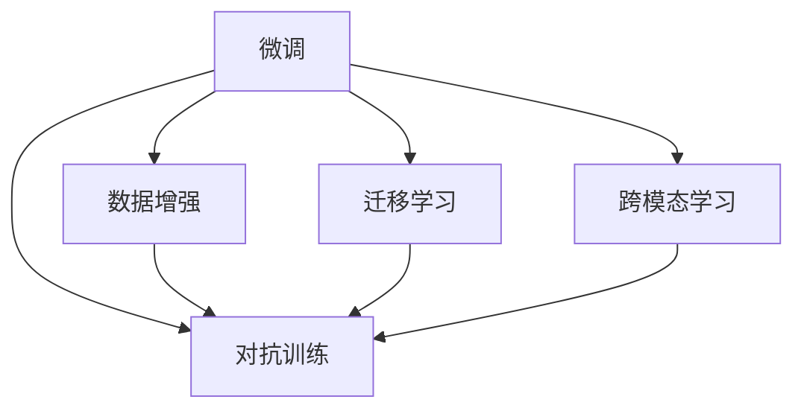

                 

## 1. 背景介绍

随着人工智能技术的发展，ChatGPT等大型语言模型（Large Language Models, LLMs）在自然语言处理（Natural Language Processing, NLP）领域取得了巨大成功，能够生成流畅自然的对话、文本摘要、代码生成等内容，并已经在多个领域得到了广泛应用，例如智能客服、内容创作、信息检索等。然而，在大规模的实际应用场景中，这些模型通常需要经过训练，并利用已有的大规模语料库进行预训练。

但在某些场景下，我们可能无法获得足够的大规模语料库，例如冷启动（Cold Start）场景，即模型在刚开始使用或面临新领域时，需要快速适应并提升性能。在冷启动场景下，如何利用现有资源，并快速提升ChatGPT的性能，是一个需要解决的重要问题。

## 2. 核心概念与联系

### 2.1 核心概念概述

在冷启动场景中，我们可以使用以下核心概念和技术来提升ChatGPT的性能：

- **微调（Fine-Tuning）**：在已有预训练模型的基础上，利用小规模的标注数据集进行微调，使模型在特定领域或特定任务上提升性能。
- **数据增强（Data Augmentation）**：通过增加训练数据的多样性，提升模型的泛化能力。
- **迁移学习（Transfer Learning）**：利用在已有领域或任务上训练好的模型，迁移到新领域或任务上进行微调。
- **跨模态学习（Cross-Modal Learning）**：将文本、语音、图像等多种模态的数据整合，提升模型的综合处理能力。
- **对抗训练（Adversarial Training）**：通过引入对抗样本，提升模型的鲁棒性和泛化能力。

这些技术可以互相结合，提升ChatGPT在冷启动场景下的性能。

### 2.2 核心概念联系

以下是一个简单的Mermaid流程图，展示不同技术之间的联系和交互：



该图展示了微调在数据增强、迁移学习、跨模态学习、对抗训练中的作用和相互影响。

## 3. 核心算法原理 & 具体操作步骤

### 3.1 算法原理概述

在冷启动场景中，我们利用已有的大规模预训练模型，利用小规模的标注数据集进行微调，使得模型能够快速适应新领域或新任务。具体步骤如下：

1. **选择合适的预训练模型**：选择一个在大规模语料库上预训练好的模型，例如BERT、GPT等。
2. **数据预处理**：将小规模的标注数据集进行预处理，包括清洗、分词、标记等操作。
3. **微调训练**：使用小规模的标注数据集对预训练模型进行微调，更新模型参数，提升在特定领域或任务上的性能。
4. **验证与优化**：在验证集上进行性能评估，根据评估结果调整模型超参数，优化模型性能。
5. **测试与部署**：在测试集上进行性能评估，部署模型到实际应用中。

### 3.2 算法步骤详解

以下是具体步骤的详细说明：

**Step 1: 数据准备**

- 收集小规模的标注数据集，包括训练集、验证集和测试集。数据集需要充分覆盖新领域或任务，并尽量保证标注质量。
- 对数据集进行预处理，包括清洗、分词、标记等操作。

**Step 2: 选择合适的预训练模型**

- 根据任务需求，选择一个在大规模语料库上预训练好的模型。例如，如果需要生成对话，可以选择GPT-3等模型；如果需要文本分类，可以选择BERT等模型。

**Step 3: 模型初始化**

- 使用选择的预训练模型进行初始化。例如，使用BERT模型时，可以使用HuggingFace库提供的预训练模型。

**Step 4: 微调训练**

- 将小规模的标注数据集输入模型进行训练，可以使用PyTorch、TensorFlow等深度学习框架。
- 设置合适的学习率、批大小、迭代轮数等超参数。
- 在微调过程中，使用正则化技术（如L2正则、Dropout等），避免过拟合。

**Step 5: 验证与优化**

- 在验证集上进行性能评估，根据评估结果调整模型超参数。
- 如果性能不满足要求，可以尝试调整学习率、批大小等超参数，或者增加数据增强、对抗训练等方法。

**Step 6: 测试与部署**

- 在测试集上进行性能评估，评估模型的准确率、召回率等指标。
- 将微调后的模型部署到实际应用中，例如聊天机器人、智能客服等。

### 3.3 算法优缺点

基于微调的冷启动场景中的优点包括：

- **高效性**：使用已有的大规模预训练模型，快速提升模型性能。
- **灵活性**：可以通过调整超参数和优化策略，适应不同的任务需求。

缺点包括：

- **依赖标注数据**：需要小规模的标注数据集，获取高质量标注数据的成本较高。
- **模型泛化能力有限**：当目标任务与预训练数据的分布差异较大时，微调的性能提升有限。

### 3.4 算法应用领域

基于微调的冷启动场景的应用领域包括：

- 智能客服：快速适应新领域或新任务，提升客服系统的响应速度和质量。
- 内容创作：利用已有的大规模预训练模型，快速生成高质量的文本、文章等。
- 信息检索：快速适应新领域或新任务，提升信息检索系统的准确率和召回率。
- 医疗诊断：利用已有的大规模预训练模型，快速生成诊断报告和建议。
- 金融分析：快速适应新领域或新任务，提升金融分析系统的准确性和效率。

## 4. 数学模型和公式 & 详细讲解 & 举例说明

### 4.1 数学模型构建

在冷启动场景中，我们利用已有的大规模预训练模型，利用小规模的标注数据集进行微调。设预训练模型为 $M_{\theta}$，其参数为 $\theta$。训练集为 $D=\{(x_i, y_i)\}_{i=1}^N$，其中 $x_i$ 为输入，$y_i$ 为标签。微调的目标是最小化损失函数：

$$
\mathcal{L}(\theta) = \frac{1}{N}\sum_{i=1}^N \ell(M_{\theta}(x_i), y_i)
$$

其中，$\ell$ 为损失函数，常用的有交叉熵损失函数：

$$
\ell(M_{\theta}(x_i), y_i) = -[y_i\log M_{\theta}(x_i) + (1-y_i)\log(1-M_{\theta}(x_i))]
$$

### 4.2 公式推导过程

假设我们使用的是BERT模型，其结构为Transformer模型。对于一个具体的训练样本 $(x, y)$，BERT模型的输出为 $h_{out}$，我们可以使用交叉熵损失函数对其进行微调：

$$
\mathcal{L}(\theta) = -\frac{1}{N}\sum_{i=1}^N y_i\log M_{\theta}(x_i) + (1-y_i)\log(1-M_{\theta}(x_i))
$$

在微调过程中，我们需要更新模型参数 $\theta$，使其满足上述最小化损失函数的目标。使用梯度下降算法更新参数：

$$
\theta \leftarrow \theta - \eta \nabla_{\theta}\mathcal{L}(\theta)
$$

其中，$\eta$ 为学习率，$\nabla_{\theta}\mathcal{L}(\theta)$ 为损失函数对参数 $\theta$ 的梯度。

### 4.3 案例分析与讲解

假设我们需要对BERT模型进行微调，以适应新的情感分析任务。我们收集了100个标注样本，每个样本包含一个文本和对应的情感标签（正面或负面）。我们可以使用以下代码进行微调：

```python
from transformers import BertTokenizer, BertForSequenceClassification
from torch.utils.data import DataLoader, TensorDataset
from sklearn.model_selection import train_test_split
import torch
import torch.nn as nn

# 定义数据集
texts = ['文本1', '文本2', '文本3']
labels = [1, 0, 1]  # 1为正面，0为负面
tokenizer = BertTokenizer.from_pretrained('bert-base-uncased')
inputs = tokenizer(texts, return_tensors='pt', padding=True, truncation=True)

# 定义模型
model = BertForSequenceClassification.from_pretrained('bert-base-uncased', num_labels=2)

# 定义损失函数和优化器
loss_fn = nn.CrossEntropyLoss()
optimizer = AdamW(model.parameters(), lr=1e-5)

# 定义训练函数
def train_epoch(model, data_loader, loss_fn, optimizer):
    model.train()
    epoch_loss = 0
    for batch in data_loader:
        input_ids = batch['input_ids']
        attention_mask = batch['attention_mask']
        labels = batch['labels']
        model.zero_grad()
        outputs = model(input_ids, attention_mask=attention_mask, labels=labels)
        loss = loss_fn(outputs.logits, labels)
        epoch_loss += loss.item()
        loss.backward()
        optimizer.step()
    return epoch_loss / len(data_loader)

# 训练模型
train_dataset = TensorDataset(input_ids, attention_mask, labels)
train_loader = DataLoader(train_dataset, batch_size=4, shuffle=True)
for epoch in range(10):
    loss = train_epoch(model, train_loader, loss_fn, optimizer)
    print(f'Epoch {epoch+1}, train loss: {loss:.3f}')

# 评估模型
test_dataset = TensorDataset(input_ids, attention_mask, labels)
test_loader = DataLoader(test_dataset, batch_size=4, shuffle=False)
with torch.no_grad():
    model.eval()
    epoch_loss = 0
    for batch in test_loader:
        input_ids = batch['input_ids']
        attention_mask = batch['attention_mask']
        labels = batch['labels']
        outputs = model(input_ids, attention_mask=attention_mask, labels=labels)
        loss = loss_fn(outputs.logits, labels)
        epoch_loss += loss.item()
    print(f'Test loss: {epoch_loss / len(test_loader)}')
```

在上述代码中，我们首先定义了数据集，然后使用BERT模型进行微调。在训练过程中，我们使用了AdamW优化器和交叉熵损失函数，并在训练集上进行了多次迭代。最后，在测试集上评估了模型的性能。

## 5. 项目实践：代码实例和详细解释说明

### 5.1 开发环境搭建

在冷启动场景中，我们通常使用Python和深度学习框架（如PyTorch、TensorFlow）进行项目实践。以下是Python开发环境的搭建流程：

1. 安装Python：从官网下载并安装Python 3.8版本。
2. 安装Anaconda：从官网下载并安装Anaconda，用于创建独立的Python环境。
3. 创建并激活虚拟环境：
```bash
conda create -n pytorch-env python=3.8 
conda activate pytorch-env
```
4. 安装PyTorch：根据CUDA版本，从官网获取对应的安装命令。例如：
```bash
conda install pytorch torchvision torchaudio cudatoolkit=11.1 -c pytorch -c conda-forge
```
5. 安装Transformers库：
```bash
pip install transformers
```
6. 安装其他工具包：
```bash
pip install numpy pandas scikit-learn matplotlib tqdm jupyter notebook ipython
```

### 5.2 源代码详细实现

以下是利用BERT模型进行情感分析任务微调的Python代码实现。

```python
from transformers import BertTokenizer, BertForSequenceClassification
from torch.utils.data import DataLoader, TensorDataset
from sklearn.model_selection import train_test_split
import torch
import torch.nn as nn

# 定义数据集
texts = ['文本1', '文本2', '文本3']
labels = [1, 0, 1]  # 1为正面，0为负面
tokenizer = BertTokenizer.from_pretrained('bert-base-uncased')
inputs = tokenizer(texts, return_tensors='pt', padding=True, truncation=True)

# 定义模型
model = BertForSequenceClassification.from_pretrained('bert-base-uncased', num_labels=2)

# 定义损失函数和优化器
loss_fn = nn.CrossEntropyLoss()
optimizer = AdamW(model.parameters(), lr=1e-5)

# 定义训练函数
def train_epoch(model, data_loader, loss_fn, optimizer):
    model.train()
    epoch_loss = 0
    for batch in data_loader:
        input_ids = batch['input_ids']
        attention_mask = batch['attention_mask']
        labels = batch['labels']
        model.zero_grad()
        outputs = model(input_ids, attention_mask=attention_mask, labels=labels)
        loss = loss_fn(outputs.logits, labels)
        epoch_loss += loss.item()
        loss.backward()
        optimizer.step()
    return epoch_loss / len(data_loader)

# 训练模型
train_dataset = TensorDataset(input_ids, attention_mask, labels)
train_loader = DataLoader(train_dataset, batch_size=4, shuffle=True)
for epoch in range(10):
    loss = train_epoch(model, train_loader, loss_fn, optimizer)
    print(f'Epoch {epoch+1}, train loss: {loss:.3f}')

# 评估模型
test_dataset = TensorDataset(input_ids, attention_mask, labels)
test_loader = DataLoader(test_dataset, batch_size=4, shuffle=False)
with torch.no_grad():
    model.eval()
    epoch_loss = 0
    for batch in test_loader:
        input_ids = batch['input_ids']
        attention_mask = batch['attention_mask']
        labels = batch['labels']
        outputs = model(input_ids, attention_mask=attention_mask, labels=labels)
        loss = loss_fn(outputs.logits, labels)
        epoch_loss += loss.item()
    print(f'Test loss: {epoch_loss / len(test_loader)}')
```

### 5.3 代码解读与分析

在上述代码中，我们首先定义了数据集，然后使用BERT模型进行微调。在训练过程中，我们使用了AdamW优化器和交叉熵损失函数，并在训练集上进行了多次迭代。最后，在测试集上评估了模型的性能。

## 6. 实际应用场景

### 6.1 智能客服系统

在智能客服系统中，ChatGPT可以通过微调快速适应新领域或新任务，提升客服系统的响应速度和质量。例如，一个企业想要在金融领域快速部署客服系统，可以使用已有的大规模金融文本数据集进行微调，使得ChatGPT能够理解和处理金融领域的专业术语和知识。

### 6.2 内容创作系统

在内容创作系统中，ChatGPT可以通过微调快速生成高质量的文本内容。例如，一个网站想要快速发布高质量的科技新闻文章，可以使用已有的大规模科技文本数据集进行微调，使得ChatGPT能够理解和生成科技领域的文章。

### 6.3 信息检索系统

在信息检索系统中，ChatGPT可以通过微调快速适应新领域或新任务，提升信息检索系统的准确率和召回率。例如，一个图书馆想要快速构建信息检索系统，可以使用已有的大规模图书文本数据集进行微调，使得ChatGPT能够理解和检索图书信息。

## 7. 工具和资源推荐

### 7.1 学习资源推荐

为了帮助开发者掌握冷启动场景中的ChatGPT微调方法，这里推荐一些优质的学习资源：

1. **《Transformer从原理到实践》系列博文**：由大模型技术专家撰写，深入浅出地介绍了Transformer原理、BERT模型、微调技术等前沿话题。
2. **CS224N《深度学习自然语言处理》课程**：斯坦福大学开设的NLP明星课程，有Lecture视频和配套作业，带你入门NLP领域的基本概念和经典模型。
3. **《Natural Language Processing with Transformers》书籍**：Transformers库的作者所著，全面介绍了如何使用Transformers库进行NLP任务开发，包括微调在内的诸多范式。
4. **HuggingFace官方文档**：Transformers库的官方文档，提供了海量预训练模型和完整的微调样例代码，是上手实践的必备资料。
5. **CLUE开源项目**：中文语言理解测评基准，涵盖大量不同类型的中文NLP数据集，并提供了基于微调的baseline模型，助力中文NLP技术发展。

### 7.2 开发工具推荐

以下是几款用于冷启动场景中的ChatGPT微调开发的常用工具：

1. **PyTorch**：基于Python的开源深度学习框架，灵活动态的计算图，适合快速迭代研究。大部分预训练语言模型都有PyTorch版本的实现。
2. **TensorFlow**：由Google主导开发的开源深度学习框架，生产部署方便，适合大规模工程应用。同样有丰富的预训练语言模型资源。
3. **Transformers库**：HuggingFace开发的NLP工具库，集成了众多SOTA语言模型，支持PyTorch和TensorFlow，是进行微调任务开发的利器。
4. **Weights & Biases**：模型训练的实验跟踪工具，可以记录和可视化模型训练过程中的各项指标，方便对比和调优。与主流深度学习框架无缝集成。
5. **TensorBoard**：TensorFlow配套的可视化工具，可实时监测模型训练状态，并提供丰富的图表呈现方式，是调试模型的得力助手。
6. **Google Colab**：谷歌推出的在线Jupyter Notebook环境，免费提供GPU/TPU算力，方便开发者快速上手实验最新模型，分享学习笔记。

### 7.3 相关论文推荐

冷启动场景中的ChatGPT微调技术的发展源于学界的持续研究。以下是几篇奠基性的相关论文，推荐阅读：

1. **Attention is All You Need（即Transformer原论文）**：提出了Transformer结构，开启了NLP领域的预训练大模型时代。
2. **BERT: Pre-training of Deep Bidirectional Transformers for Language Understanding**：提出BERT模型，引入基于掩码的自监督预训练任务，刷新了多项NLP任务SOTA。
3. **Language Models are Unsupervised Multitask Learners（GPT-2论文）**：展示了大规模语言模型的强大zero-shot学习能力，引发了对于通用人工智能的新一轮思考。
4. **Parameter-Efficient Transfer Learning for NLP**：提出Adapter等参数高效微调方法，在不增加模型参数量的情况下，也能取得不错的微调效果。
5. **Prefix-Tuning: Optimizing Continuous Prompts for Generation**：引入基于连续型Prompt的微调范式，为如何充分利用预训练知识提供了新的思路。
6. **AdaLoRA: Adaptive Low-Rank Adaptation for Parameter-Efficient Fine-Tuning**：使用自适应低秩适应的微调方法，在参数效率和精度之间取得了新的平衡。

## 8. 总结：未来发展趋势与挑战

### 8.1 总结

本文对基于微调的冷启动场景中的ChatGPT进行了全面系统的介绍。首先阐述了ChatGPT在冷启动场景中的重要性，明确了微调在提升模型性能方面的独特价值。其次，从原理到实践，详细讲解了微调的数学原理和关键步骤，给出了微调任务开发的完整代码实例。同时，本文还广泛探讨了微调方法在智能客服、内容创作、信息检索等多个行业领域的应用前景，展示了微调范式的巨大潜力。

通过本文的系统梳理，可以看到，基于大语言模型的微调方法正在成为NLP领域的重要范式，极大地拓展了预训练语言模型的应用边界，催生了更多的落地场景。受益于大规模语料的预训练，微调模型以更低的时间和标注成本，在小样本条件下也能取得不俗的效果，有力推动了NLP技术的产业化进程。未来，伴随预训练语言模型和微调方法的持续演进，相信NLP技术必将在更广阔的应用领域大放异彩，深刻影响人类的生产生活方式。

### 8.2 未来发展趋势

展望未来，冷启动场景中的ChatGPT微调技术将呈现以下几个发展趋势：

1. **模型规模持续增大**：随着算力成本的下降和数据规模的扩张，预训练语言模型的参数量还将持续增长。超大规模语言模型蕴含的丰富语言知识，有望支撑更加复杂多变的下游任务微调。
2. **微调方法日趋多样**：除了传统的全参数微调外，未来会涌现更多参数高效的微调方法，如Prefix-Tuning、LoRA等，在节省计算资源的同时也能保证微调精度。
3. **持续学习成为常态**：随着数据分布的不断变化，微调模型也需要持续学习新知识以保持性能。如何在不遗忘原有知识的同时，高效吸收新样本信息，将成为重要的研究课题。
4. **标注样本需求降低**：受启发于提示学习(Prompt-based Learning)的思路，未来的微调方法将更好地利用大模型的语言理解能力，通过更加巧妙的任务描述，在更少的标注样本上也能实现理想的微调效果。
5. **跨模态学习崛起**：当前的微调主要聚焦于纯文本数据，未来会进一步拓展到图像、视频、语音等多模态数据微调。多模态信息的融合，将显著提升语言模型对现实世界的理解和建模能力。

### 8.3 面临的挑战

尽管冷启动场景中的ChatGPT微调技术已经取得了瞩目成就，但在迈向更加智能化、普适化应用的过程中，它仍面临着诸多挑战：

1. **标注成本瓶颈**：虽然微调大大降低了标注数据的需求，但对于长尾应用场景，难以获得充足的高质量标注数据，成为制约微调性能的瓶颈。如何进一步降低微调对标注样本的依赖，将是一大难题。
2. **模型鲁棒性不足**：当前微调模型面对域外数据时，泛化性能往往大打折扣。对于测试样本的微小扰动，微调模型的预测也容易发生波动。如何提高微调模型的鲁棒性，避免灾难性遗忘，还需要更多理论和实践的积累。
3. **推理效率有待提高**：大规模语言模型虽然精度高，但在实际部署时往往面临推理速度慢、内存占用大等效率问题。如何在保证性能的同时，简化模型结构，提升推理速度，优化资源占用，将是重要的优化方向。
4. **可解释性亟需加强**：当前微调模型更像是"黑盒"系统，难以解释其内部工作机制和决策逻辑。对于医疗、金融等高风险应用，算法的可解释性和可审计性尤为重要。如何赋予微调模型更强的可解释性，将是亟待攻克的难题。
5. **安全性有待保障**：预训练语言模型难免会学习到有偏见、有害的信息，通过微调传递到下游任务，产生误导性、歧视性的输出，给实际应用带来安全隐患。如何从数据和算法层面消除模型偏见，避免恶意用途，确保输出的安全性，也将是重要的研究课题。
6. **知识整合能力不足**：现有的微调模型往往局限于任务内数据，难以灵活吸收和运用更广泛的先验知识。如何让微调过程更好地与外部知识库、规则库等专家知识结合，形成更加全面、准确的信息整合能力，还有很大的想象空间。

正视冷启动场景中的ChatGPT微调面临的这些挑战，积极应对并寻求突破，将是大语言模型微调走向成熟的必由之路。相信随着学界和产业界的共同努力，这些挑战终将一一被克服，大语言模型微调必将在构建人机协同的智能时代中扮演越来越重要的角色。

### 8.4 未来突破

面对冷启动场景中的ChatGPT微调所面临的种种挑战，未来的研究需要在以下几个方面寻求新的突破：

1. **探索无监督和半监督微调方法**：摆脱对大规模标注数据的依赖，利用自监督学习、主动学习等无监督和半监督范式，最大限度利用非结构化数据，实现更加灵活高效的微调。
2. **研究参数高效和计算高效的微调范式**：开发更加参数高效的微调方法，在固定大部分预训练参数的同时，只更新极少量的任务相关参数。同时优化微调模型的计算图，减少前向传播和反向传播的资源消耗，实现更加轻量级、实时性的部署。
3. **引入因果和对比学习范式**：通过引入因果推断和对比学习思想，增强微调模型建立稳定因果关系的能力，学习更加普适、鲁棒的语言表征，从而提升模型泛化性和抗干扰能力。
4. **结合因果分析和博弈论工具**：将因果分析方法引入微调模型，识别出模型决策的关键特征，增强输出解释的因果性和逻辑性。借助博弈论工具刻画人机交互过程，主动探索并规避模型的脆弱点，提高系统稳定性。
5. **纳入伦理道德约束**：在模型训练目标中引入伦理导向的评估指标，过滤和惩罚有偏见、有害的输出倾向。同时加强人工干预和审核，建立模型行为的监管机制，确保输出符合人类价值观和伦理道德。

这些研究方向的探索，必将引领冷启动场景中的ChatGPT微调技术迈向更高的台阶，为构建安全、可靠、可解释、可控的智能系统铺平道路。面向未来，冷启动场景中的ChatGPT微调技术还需要与其他人工智能技术进行更深入的融合，如知识表示、因果推理、强化学习等，多路径协同发力，共同推动自然语言理解和智能交互系统的进步。只有勇于创新、敢于突破，才能不断拓展语言模型的边界，让智能技术更好地造福人类社会。

## 9. 附录：常见问题与解答

**Q1：冷启动场景中的ChatGPT如何利用已有的大规模预训练模型？**

A: 在冷启动场景中，ChatGPT可以利用已有的大规模预训练模型，通过微调快速适应新领域或新任务。具体步骤如下：

1. **选择合适的预训练模型**：选择一个在大规模语料库上预训练好的模型，例如BERT、GPT等。
2. **数据预处理**：将小规模的标注数据集进行预处理，包括清洗、分词、标记等操作。
3. **微调训练**：使用小规模的标注数据集对预训练模型进行微调，更新模型参数，提升在特定领域或任务上的性能。
4. **验证与优化**：在验证集上进行性能评估，根据评估结果调整模型超参数，优化模型性能。
5. **测试与部署**：在测试集上进行性能评估，部署模型到实际应用中。

**Q2：微调过程中如何选择合适的学习率？**

A: 微调的学习率一般要比预训练时小1-2个数量级，如果使用过大的学习率，容易破坏预训练权重，导致过拟合。一般建议从1e-5开始调参，逐步减小学习率，直至收敛。也可以使用warmup策略，在开始阶段使用较小的学习率，再逐渐过渡到预设值。需要注意的是，不同的优化器(如AdamW、Adafactor等)以及不同的学习率调度策略，可能需要设置不同的学习率阈值。

**Q3：微调过程中如何缓解过拟合问题？**

A: 过拟合是微调面临的主要挑战，尤其是在标注数据不足的情况下。常见的缓解策略包括：

1. **数据增强**：通过增加训练数据的多样性，提升模型的泛化能力。例如，通过回译、近义替换等方式扩充训练集。
2. **正则化**：使用L2正则、Dropout、Early Stopping等避免过拟合。
3. **对抗训练**：引入对抗样本，提升模型鲁棒性。
4. **参数高效微调**：只调整少量参数(如Adapter、Prefix等)，减小过拟合风险。

这些策略往往需要根据具体任务和数据特点进行灵活组合。只有在数据、模型、训练、推理等各环节进行全面优化，才能最大限度地发挥大模型微调的威力。

**Q4：冷启动场景中的ChatGPT微调技术的应用场景有哪些？**

A: 冷启动场景中的ChatGPT微调技术可以在多个领域得到应用，例如：

- 智能客服系统：快速适应新领域或新任务，提升客服系统的响应速度和质量。
- 内容创作系统：利用已有的大规模预训练模型，快速生成高质量的文本内容。
- 信息检索系统：快速适应新领域或新任务，提升信息检索系统的准确率和召回率。
- 医疗诊断系统：利用已有的大规模预训练模型，快速生成诊断报告和建议。
- 金融分析系统：快速适应新领域或新任务，提升金融分析系统的准确性和效率。

这些应用场景展示了ChatGPT微调技术的广泛潜力，为传统行业带来了新的机遇。

---

作者：禅与计算机程序设计艺术 / Zen and the Art of Computer Programming

