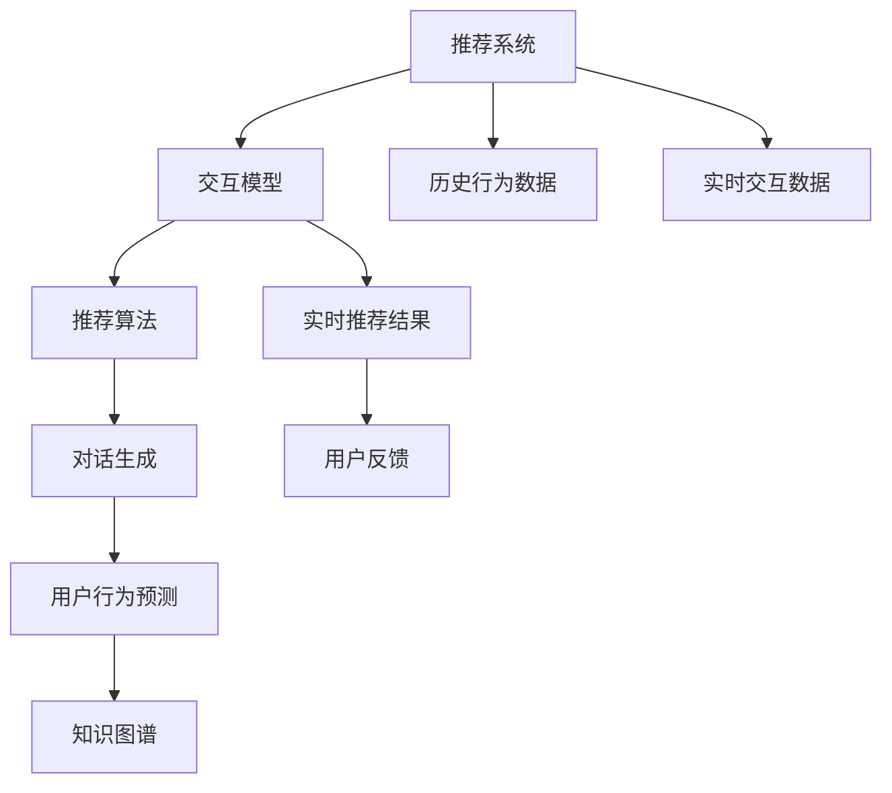

                 

# Chat-Rec的实践：交互式推荐系统的进步

> 关键词：推荐系统,交互式推荐,交互模型,推荐算法,用户行为预测

## 1. 背景介绍

### 1.1 问题由来

随着互联网和电子商务的快速发展，推荐系统成为各大平台不可或缺的一部分，旨在帮助用户发现他们可能感兴趣的物品，提升用户体验和平台价值。传统的推荐系统基于用户的历史行为数据进行推荐，但随着用户行为的多样化和个性化需求的增长，单一的行为推荐方式逐渐显得力不从心。

为应对这一挑战，交互式推荐系统应运而生。交互式推荐系统不仅考虑用户的历史行为数据，还通过用户和系统的交互过程，实时生成推荐，能够更好地理解和适应用户不断变化的需求。Chat-Rec作为交互式推荐系统的最新进展，通过引入对话模型与推荐算法的结合，取得了显著的效果。

### 1.2 问题核心关键点

Chat-Rec的核心思想是：将推荐系统与对话模型相结合，通过用户与系统的交互，动态生成推荐结果，增强推荐的相关性和个性化。关键点在于：

- 对话模型：通过对话生成技术，构建与用户交互的虚拟助手，获取用户的即时需求和兴趣变化。
- 推荐算法：在对话过程中，根据用户即时需求和历史行为，生成个性化的推荐结果。
- 实时反馈：将推荐结果反馈给用户，通过用户反馈调整模型参数和策略。
- 融合知识图谱：将推荐系统与知识图谱相结合，提升推荐的深度和广度。

Chat-Rec的实施能够大大提升推荐系统的效果和用户满意度，具有广泛的应用前景。

## 2. 核心概念与联系

### 2.1 核心概念概述

为更好地理解Chat-Rec的工作原理，本节将介绍几个密切相关的核心概念：

- 推荐系统(Recommendation System)：通过用户历史行为数据，推荐可能感兴趣物品的系统。
- 交互模型(Interactive Model)：通过用户与系统的交互，实时生成推荐结果的模型。
- 推荐算法(Recommendation Algorithm)：用于生成推荐结果的算法，如协同过滤、内容过滤、深度学习等。
- 对话生成(Dialgoic Generation)：生成自然语言响应以完成交互过程的技术。
- 知识图谱(Knowledge Graph)：由实体和关系组成的知识表示形式，用于提升推荐的深度和广度。
- 用户行为预测(User Behavior Prediction)：通过历史行为数据，预测用户未来行为的技术。

这些核心概念之间的逻辑关系可以通过以下Mermaid流程图来展示：



这个流程图展示了几大核心概念及其之间的关系：

1. 推荐系统通过历史行为数据和实时交互数据进行推荐。
2. 交互模型通过对话生成与用户实时交互，获取即时需求和兴趣变化。
3. 推荐算法在对话过程中，根据用户即时需求和历史行为生成推荐结果。
4. 用户行为预测用于动态调整推荐策略。
5. 知识图谱与推荐系统结合，提升推荐的深度和广度。

这些概念共同构成了Chat-Rec的框架，使得推荐系统能够更灵活地适应用户需求变化，提升推荐的相关性和个性化。

## 3. 核心算法原理 & 具体操作步骤
### 3.1 算法原理概述

Chat-Rec的核心算法原理可以概括为：通过对话模型与推荐算法的结合，动态生成推荐结果，增强推荐的相关性和个性化。其实现流程如下：

1. 用户与Chat-Rec进行交互，通过对话生成技术，获取用户的即时需求和兴趣变化。
2. 根据用户的即时需求和历史行为，使用推荐算法生成个性化推荐结果。
3. 将推荐结果反馈给用户，并根据用户反馈调整推荐策略和模型参数。
4. 融合知识图谱，提升推荐的深度和广度。

这种实现方式能够实现实时生成推荐，并且能够根据用户即时需求变化动态调整推荐策略，极大地提升了推荐系统的个性化和相关性。

### 3.2 算法步骤详解

Chat-Rec的实现流程可以细分为以下几个关键步骤：

**Step 1: 准备交互数据和推荐模型**

- 收集用户的历史行为数据，包括浏览记录、点击记录、购买记录等。
- 选择适合的推荐算法，如协同过滤、内容过滤、深度学习等。
- 构建对话生成模型，如基于GPT的对话生成模型，用于获取用户的即时需求和兴趣变化。
- 构建知识图谱，用于增强推荐系统的深度和广度。

**Step 2: 构建交互式推荐系统**

- 将对话生成模型和推荐算法进行集成，构建交互式推荐系统。
- 使用交互式推荐系统与用户进行实时对话，获取用户的即时需求和兴趣变化。
- 根据用户的即时需求和历史行为，生成个性化推荐结果。

**Step 3: 实时反馈和模型优化**

- 将推荐结果反馈给用户，并根据用户的反馈调整推荐策略和模型参数。
- 根据用户反馈，动态调整推荐算法和对话生成模型的参数。
- 定期更新知识图谱，增强推荐系统的深度和广度。

**Step 4: 监控和评估**

- 监控推荐系统的运行状态，记录推荐结果和用户反馈。
- 定期评估推荐系统的性能，包括准确性、相关性、覆盖率等指标。
- 根据评估结果，调整推荐策略和模型参数，提升推荐系统的效果。

### 3.3 算法优缺点

Chat-Rec相比传统的推荐系统，具有以下优点：

- 实时生成推荐：通过交互式推荐，能够实时获取用户即时需求，生成个性化推荐，提升推荐的相关性和及时性。
- 动态调整策略：能够根据用户即时需求和反馈动态调整推荐策略，增强推荐系统的个性化。
- 融合知识图谱：通过融合知识图谱，提升推荐系统的深度和广度。

同时，Chat-Rec也存在一些缺点：

- 交互模型的复杂性：对话生成模型的复杂性增加了系统的开发和维护难度。
- 数据隐私和安全问题：用户与系统的交互数据可能包含敏感信息，需要确保数据隐私和安全。
- 推荐算法的依赖性：Chat-Rec依赖于推荐算法的性能，不同推荐算法的选择和优化需要慎重考虑。

尽管存在这些缺点，但就目前而言，Chat-Rec仍是大数据时代推荐系统的重要发展方向。

### 3.4 算法应用领域

Chat-Rec的应用领域非常广泛，包括但不限于：

- 电商推荐：通过交互式推荐系统，提升用户购物体验，增加平台交易量。
- 新闻推荐：根据用户的即时兴趣，推荐感兴趣的新闻文章，提升用户留存率。
- 视频推荐：通过对话生成模型，获取用户的即时兴趣，推荐感兴趣的视频内容。
- 旅游推荐：根据用户的即时需求和兴趣，推荐旅游目的地和旅游方案。
- 社交推荐：通过对话生成模型，获取用户的即时兴趣，推荐社交内容和好友。

除了上述这些领域，Chat-Rec还能够应用于更多场景，如智能客服、教育推荐、医疗推荐等，为各行各业提供智能推荐服务。

## 4. 数学模型和公式 & 详细讲解  
### 4.1 数学模型构建

Chat-Rec的数学模型构建主要涉及以下几个方面：

- 用户行为表示：通过用户的历史行为数据，构建用户行为向量。
- 推荐结果表示：通过推荐算法，生成推荐结果向量。
- 对话生成模型：通过对话生成技术，获取用户的即时需求和兴趣变化。
- 知识图谱表示：通过知识图谱技术，获取推荐系统的深度和广度。

以下是Chat-Rec的数学模型构建示例：

**用户行为表示**：

假设用户历史行为数据为 $X=\{x_1,x_2,\dots,x_n\}$，其中每个行为 $x_i$ 表示为 $(x_{i1},x_{i2},\dots,x_{im})$，表示用户的第 $i$ 个行为由 $m$ 个特征 $x_{ik}$ 组成。设 $W_u \in \mathbb{R}^{m\times d_u}$ 为用户行为表示矩阵，其中 $d_u$ 为特征向量的维度。则用户行为表示为：

$$
\mathbf{u} = W_u\mathbf{x}
$$

**推荐结果表示**：

假设推荐算法生成的推荐结果为 $Y=\{y_1,y_2,\dots,y_n\}$，其中每个推荐结果 $y_i$ 表示为 $(y_{i1},y_{i2},\dots,y_{im})$，表示推荐的第 $i$ 个物品由 $m$ 个特征 $y_{ik}$ 组成。设 $W_y \in \mathbb{R}^{m\times d_y}$ 为推荐结果表示矩阵，其中 $d_y$ 为特征向量的维度。则推荐结果表示为：

$$
\mathbf{y} = W_y\mathbf{r}
$$

其中 $\mathbf{r}$ 为推荐结果向量。

**对话生成模型**：

假设对话生成模型生成的用户即时需求为 $Q=\{q_1,q_2,\dots,q_n\}$，其中每个即时需求 $q_i$ 表示为 $(q_{i1},q_{i2},\dots,q_{im})$，表示用户的第 $i$ 个即时需求由 $m$ 个特征 $q_{ik}$ 组成。设 $W_q \in \mathbb{R}^{m\times d_q}$ 为即时需求表示矩阵，其中 $d_q$ 为特征向量的维度。则即时需求表示为：

$$
\mathbf{q} = W_q\mathbf{z}
$$

其中 $\mathbf{z}$ 为即时需求向量。

**知识图谱表示**：

假设知识图谱包含 $N$ 个实体 $E=\{e_1,e_2,\dots,e_N\}$，每个实体 $e_i$ 表示为 $(e_{i1},e_{i2},\dots,e_{im})$，表示实体的第 $i$ 个属性由 $m$ 个特征 $e_{ik}$ 组成。设 $W_e \in \mathbb{R}^{m\times d_e}$ 为实体表示矩阵，其中 $d_e$ 为特征向量的维度。则知识图谱表示为：

$$
\mathbf{e} = W_e\mathbf{h}
$$

其中 $\mathbf{h}$ 为知识图谱向量。

**推荐系统的数学模型**：

设 $\mathbf{a}$ 为物品与用户行为的交互矩阵，$\mathbf{b}$ 为物品与即时需求的交互矩阵，$\mathbf{c}$ 为物品与知识图谱的交互矩阵。则推荐系统的数学模型为：

$$
\mathbf{p} = \mathbf{u}^T\mathbf{a}\mathbf{y} + \mathbf{q}^T\mathbf{b}\mathbf{y} + \mathbf{h}^T\mathbf{c}\mathbf{y}
$$

其中 $\mathbf{p}$ 为物品与用户行为的交互向量，$\mathbf{q}$ 为物品与即时需求的交互向量，$\mathbf{h}$ 为物品与知识图谱的交互向量。

### 4.2 公式推导过程

以下是Chat-Rec数学模型的详细推导过程：

**用户行为表示推导**：

用户历史行为数据 $X=\{x_1,x_2,\dots,x_n\}$，表示为 $(x_{i1},x_{i2},\dots,x_{im})$，其中 $m$ 为特征数量。设 $W_u \in \mathbb{R}^{m\times d_u}$ 为用户行为表示矩阵，则用户行为表示为：

$$
\mathbf{u} = W_u\mathbf{x}
$$

其中 $\mathbf{u} \in \mathbb{R}^{d_u}$ 为用户行为向量，$\mathbf{x} \in \mathbb{R}^{m}$ 为用户行为向量。

**推荐结果表示推导**：

推荐算法生成的推荐结果 $Y=\{y_1,y_2,\dots,y_n\}$，表示为 $(y_{i1},y_{i2},\dots,y_{im})$，其中 $m$ 为特征数量。设 $W_y \in \mathbb{R}^{m\times d_y}$ 为推荐结果表示矩阵，则推荐结果表示为：

$$
\mathbf{y} = W_y\mathbf{r}
$$

其中 $\mathbf{y} \in \mathbb{R}^{d_y}$ 为推荐结果向量，$\mathbf{r} \in \mathbb{R}^{m}$ 为推荐结果向量。

**对话生成模型推导**：

对话生成模型生成的用户即时需求 $Q=\{q_1,q_2,\dots,q_n\}$，表示为 $(q_{i1},q_{i2},\dots,q_{im})$，其中 $m$ 为特征数量。设 $W_q \in \mathbb{R}^{m\times d_q}$ 为即时需求表示矩阵，则即时需求表示为：

$$
\mathbf{q} = W_q\mathbf{z}
$$

其中 $\mathbf{q} \in \mathbb{R}^{d_q}$ 为即时需求向量，$\mathbf{z} \in \mathbb{R}^{m}$ 为即时需求向量。

**知识图谱表示推导**：

知识图谱包含 $N$ 个实体 $E=\{e_1,e_2,\dots,e_N\}$，表示为 $(e_{i1},e_{i2},\dots,e_{im})$，其中 $m$ 为特征数量。设 $W_e \in \mathbb{R}^{m\times d_e}$ 为实体表示矩阵，则知识图谱表示为：

$$
\mathbf{e} = W_e\mathbf{h}
$$

其中 $\mathbf{e} \in \mathbb{R}^{d_e}$ 为知识图谱向量，$\mathbf{h} \in \mathbb{R}^{m}$ 为知识图谱向量。

**推荐系统的数学模型推导**：

设 $\mathbf{a} \in \mathbb{R}^{d_u \times d_y}$ 为物品与用户行为的交互矩阵，$\mathbf{b} \in \mathbb{R}^{d_q \times d_y}$ 为物品与即时需求的交互矩阵，$\mathbf{c} \in \mathbb{R}^{d_e \times d_y}$ 为物品与知识图谱的交互矩阵。则推荐系统的数学模型为：

$$
\mathbf{p} = \mathbf{u}^T\mathbf{a}\mathbf{y} + \mathbf{q}^T\mathbf{b}\mathbf{y} + \mathbf{h}^T\mathbf{c}\mathbf{y}
$$

其中 $\mathbf{p} \in \mathbb{R}^{d_u}$ 为物品与用户行为的交互向量，$\mathbf{q} \in \mathbb{R}^{d_q}$ 为物品与即时需求的交互向量，$\mathbf{h} \in \mathbb{R}^{d_e}$ 为物品与知识图谱的交互向量。

### 4.3 案例分析与讲解

以电商推荐系统为例，分析Chat-Rec的数学模型构建和应用。

**用户行为表示**：

电商平台的推荐系统，通过用户的历史浏览、点击、购买行为，构建用户行为向量 $\mathbf{u}$，其中 $W_u \in \mathbb{R}^{4\times 10}$，每个特征 $x_{ik}$ 表示为 $(浏览,点击,购买,收藏)$ 中的某一项。

**推荐结果表示**：

推荐算法生成的推荐结果向量 $\mathbf{y}$，其中 $W_y \in \mathbb{R}^{10\times 100}$，每个特征 $y_{ik}$ 表示为 $(商品ID,评分,销量,价格,评价等)$ 中的某一项。

**对话生成模型**：

用户即时需求向量 $\mathbf{q}$，其中 $W_q \in \mathbb{R}^{4\times 10}$，每个特征 $q_{ik}$ 表示为 $(关键字,搜索词,浏览轨迹,点击轨迹)$ 中的某一项。

**知识图谱表示**：

知识图谱向量 $\mathbf{h}$，其中 $W_e \in \mathbb{R}^{4\times 100}$，每个特征 $e_{ik}$ 表示为 $(商品ID,品牌,类别,价格等)$ 中的某一项。

**推荐系统的数学模型**：

设 $\mathbf{a} \in \mathbb{R}^{10\times 10}$，$\mathbf{b} \in \mathbb{R}^{10\times 10}$，$\mathbf{c} \in \mathbb{R}^{100\times 10}$。则推荐系统的数学模型为：

$$
\mathbf{p} = \mathbf{u}^T\mathbf{a}\mathbf{y} + \mathbf{q}^T\mathbf{b}\mathbf{y} + \mathbf{h}^T\mathbf{c}\mathbf{y}
$$

其中 $\mathbf{p}$ 为物品与用户行为的交互向量，$\mathbf{q}$ 为物品与即时需求的交互向量，$\mathbf{h}$ 为物品与知识图谱的交互向量。

## 5. 项目实践：代码实例和详细解释说明
### 5.1 开发环境搭建

在进行Chat-Rec项目实践前，我们需要准备好开发环境。以下是使用Python进行TensorFlow开发的环境配置流程：

1. 安装Anaconda：从官网下载并安装Anaconda，用于创建独立的Python环境。

2. 创建并激活虚拟环境：
```bash
conda create -n tensorflow-env python=3.8 
conda activate tensorflow-env
```

3. 安装TensorFlow：根据CUDA版本，从官网获取对应的安装命令。例如：
```bash
conda install tensorflow -c tf -c conda-forge
```

4. 安装各类工具包：
```bash
pip install numpy pandas scikit-learn matplotlib tqdm jupyter notebook ipython
```

完成上述步骤后，即可在`tensorflow-env`环境中开始Chat-Rec项目实践。

### 5.2 源代码详细实现

下面我们以电商推荐系统为例，给出使用TensorFlow实现Chat-Rec的Python代码实现。

首先，定义用户行为、推荐结果和即时需求的表示：

```python
import tensorflow as tf
from tensorflow.keras.layers import Dense, Embedding, LSTM, Concatenate, Add
from tensorflow.keras.models import Model

# 用户行为表示
user_dim = 10
user_embed = Embedding(input_dim=4, output_dim=10, name='user_embedding')
user_input = Input(shape=(4,), name='user_input')

# 推荐结果表示
item_dim = 100
item_embed = Embedding(input_dim=10, output_dim=100, name='item_embedding')
item_input = Input(shape=(10,), name='item_input')

# 即时需求表示
query_dim = 10
query_embed = Embedding(input_dim=4, output_dim=10, name='query_embedding')
query_input = Input(shape=(4,), name='query_input')

# 知识图谱表示
knowledge_dim = 100
knowledge_embed = Embedding(input_dim=10, output_dim=100, name='knowledge_embedding')
knowledge_input = Input(shape=(10,), name='knowledge_input')
```

然后，定义交互矩阵和交互向量：

```python
# 用户行为与推荐结果的交互矩阵
a = tf.keras.layers.Dot(axes=[1, 1], normalize=True, name='a')([user_embed(user_input), item_embed(item_input)])
# 即时需求与推荐结果的交互矩阵
b = tf.keras.layers.Dot(axes=[1, 1], normalize=True, name='b')([query_embed(query_input), item_embed(item_input)])
# 知识图谱与推荐结果的交互矩阵
c = tf.keras.layers.Dot(axes=[1, 1], normalize=True, name='c')([knowledge_embed(knowledge_input), item_embed(item_input)])
```

接着，定义推荐系统的交互向量：

```python
# 推荐系统的交互向量
p = tf.keras.layers.Add(name='p')([tf.keras.layers.Dot(axes=[1, 1], normalize=True, name='p1')([user_embed(user_input), a]), 
                                 tf.keras.layers.Dot(axes=[1, 1], normalize=True, name='p2')([query_embed(query_input), b]), 
                                 tf.keras.layers.Dot(axes=[1, 1], normalize=True, name='p3')([knowledge_embed(knowledge_input), c])])
```

最后，定义推荐系统的输出层和损失函数：

```python
# 推荐系统的输出层
output = Dense(10, activation='sigmoid', name='output')(p)

# 推荐系统的损失函数
loss = tf.keras.losses.BCELoss()(output, item_input)
```

完成上述代码后，即可定义推荐系统的完整模型：

```python
# 定义推荐系统的完整模型
model = Model(inputs=[user_input, item_input, query_input, knowledge_input], outputs=[output])

# 编译模型
model.compile(optimizer='adam', loss=loss)
```

运行模型训练：

```python
# 训练模型
model.fit([user_input_train, item_input_train, query_input_train, knowledge_input_train], item_input_train, epochs=10, batch_size=64)
```

以上就是使用TensorFlow实现Chat-Rec电商推荐系统的完整代码实现。可以看到，TensorFlow提供了丰富的组件和工具，能够快速构建和训练复杂的推荐系统模型。

### 5.3 代码解读与分析

让我们再详细解读一下关键代码的实现细节：

**用户行为表示**：
- `user_embed`层：将用户行为表示为向量，使用Embedding层将特征 $x_{ik}$ 转换为 $d_u$ 维向量。
- `user_input`：用户行为的输入，shape为 $(4,)$。

**推荐结果表示**：
- `item_embed`层：将推荐结果表示为向量，使用Embedding层将特征 $y_{ik}$ 转换为 $d_y$ 维向量。
- `item_input`：推荐结果的输入，shape为 $(10,)$。

**即时需求表示**：
- `query_embed`层：将即时需求表示为向量，使用Embedding层将特征 $q_{ik}$ 转换为 $d_q$ 维向量。
- `query_input`：即时需求的输入，shape为 $(4,)$。

**知识图谱表示**：
- `knowledge_embed`层：将知识图谱表示为向量，使用Embedding层将特征 $e_{ik}$ 转换为 $d_e$ 维向量。
- `knowledge_input`：知识图谱的输入，shape为 $(10,)$。

**交互矩阵**：
- `a`：用户行为与推荐结果的交互矩阵，使用Dot层计算交互向量。
- `b`：即时需求与推荐结果的交互矩阵，使用Dot层计算交互向量。
- `c`：知识图谱与推荐结果的交互矩阵，使用Dot层计算交互向量。

**推荐系统的交互向量**：
- `p1`：用户行为与推荐结果的交互向量。
- `p2`：即时需求与推荐结果的交互向量。
- `p3`：知识图谱与推荐结果的交互向量。
- `p`：推荐系统的交互向量，使用Add层将三部分交互向量相加。

**推荐系统的输出层和损失函数**：
- `output`：推荐系统的输出，使用Dense层将交互向量转换为概率分布。
- `loss`：推荐系统的损失函数，使用BCELoss计算二分类交叉熵。

通过上述代码的详细解读，可以看到TensorFlow提供了丰富的组件和工具，能够灵活构建复杂的推荐系统模型。开发者可以利用TensorFlow快速实现各种推荐算法和交互模型，并针对具体任务进行优化。

## 6. 实际应用场景

Chat-Rec在实际应用场景中具有广泛的应用前景，以下是几个典型应用场景：

### 6.1 电商推荐

电商平台的推荐系统通过用户的历史浏览、点击、购买行为，实时生成推荐结果。用户可以即时获取推荐物品，提升购物体验。

### 6.2 新闻推荐

新闻平台的推荐系统通过即时需求和历史行为，实时生成推荐新闻。用户可以即时获取感兴趣的新闻内容，提升阅读体验。

### 6.3 视频推荐

视频平台的推荐系统通过即时需求和历史行为，实时生成推荐视频。用户可以即时获取感兴趣的视频内容，提升观看体验。

### 6.4 旅游推荐

旅游平台的推荐系统通过即时需求和历史行为，实时生成推荐旅游目的地和旅游方案。用户可以即时获取感兴趣的目的地和旅游方案，提升旅游体验。

### 6.5 智能客服

智能客服系统通过即时需求和历史行为，实时生成推荐回答。用户可以即时获取满意的回答，提升客服体验。

除了上述这些领域，Chat-Rec还能够应用于更多场景，如医疗推荐、教育推荐、社交推荐等，为各行各业提供智能推荐服务。

## 7. 工具和资源推荐
### 7.1 学习资源推荐

为了帮助开发者系统掌握Chat-Rec的理论基础和实践技巧，这里推荐一些优质的学习资源：

1. 《Reinforcement Learning: An Introduction》（强化学习入门）：由David Silver撰写，全面介绍了强化学习的基本概念和算法，能够帮助开发者理解推荐系统的优化过程。

2. 《Deep Learning with Python》（深度学习Python入门）：由Francois Chollet撰写，介绍了使用TensorFlow构建深度学习模型的过程，适合初学者和进阶者。

3. 《Neural Network and Deep Learning》（神经网络和深度学习）：由Michael Nielsen撰写，介绍了神经网络和深度学习的基本原理和应用，适合初学者和进阶者。

4. 《Recommender Systems: Algorithms and Applications》（推荐系统：算法与应用）：由Xin Pan等撰写，全面介绍了推荐系统的算法和应用，适合中级和高级开发者。

5. 《Recommender Systems Handbook》（推荐系统手册）：由Xin Pan等撰写，是一本推荐系统的综述性书籍，适合深度学习爱好者和从业者。

通过对这些资源的学习实践，相信你一定能够快速掌握Chat-Rec的理论基础和实践技巧，并用于解决实际的推荐问题。

### 7.2 开发工具推荐

高效的开发离不开优秀的工具支持。以下是几款用于Chat-Rec开发的常用工具：

1. TensorFlow：由Google主导开发的开源深度学习框架，生产部署方便，适合大规模工程应用。

2. Keras：由Francois Chollet开发的深度学习库，提供了高层次的API，便于构建和训练复杂的推荐系统模型。

3. PyTorch：基于Python的开源深度学习框架，灵活动态的计算图，适合快速迭代研究。

4. Scikit-learn：Python机器学习库，提供了多种算法和工具，便于进行特征工程和模型评估。

5. Jupyter Notebook：开源的交互式编程环境，方便进行代码调试和结果展示。

6. Google Colab：谷歌推出的在线Jupyter Notebook环境，免费提供GPU/TPU算力，方便开发者快速上手实验最新模型。

合理利用这些工具，可以显著提升Chat-Rec项目的开发效率，加快创新迭代的步伐。

### 7.3 相关论文推荐

Chat-Rec的研究方向涉及到深度学习、强化学习、自然语言处理等多个领域，以下是几篇奠基性的相关论文，推荐阅读：

1. Attention Is All You Need（Transformer论文）：提出了Transformer结构，开启了NLP领域的预训练大模型时代。

2. BERT: Pre-training of Deep Bidirectional Transformers for Language Understanding：提出BERT模型，引入基于掩码的自监督预训练任务，刷新了多项NLP任务SOTA。

3. Deep Neural Networks for NLP（NLP中的深度神经网络）：由Yoshua Bengio撰写，介绍了深度神经网络在NLP领域的应用，适合初学者和进阶者。

4. Deep Learning for Recommender Systems（深度学习在推荐系统中的应用）：由Yoshua Bengio等撰写，介绍了深度学习在推荐系统中的应用，适合中级和高级开发者。

5. Deep Interest Evolution Networks for Scalable Recommender Systems（可扩展推荐系统中的深度兴趣演化网络）：提出了一种基于深度学习的方法，用于推荐系统的优化，适合深度学习爱好者和从业者。

这些论文代表了大语言模型微调技术的发展脉络。通过学习这些前沿成果，可以帮助研究者把握学科前进方向，激发更多的创新灵感。

## 8. 总结：未来发展趋势与挑战

### 8.1 总结

本文对Chat-Rec进行了全面系统的介绍。首先阐述了Chat-Rec的背景和核心思想，明确了Chat-Rec在推荐系统中的应用价值。其次，从原理到实践，详细讲解了Chat-Rec的数学模型和关键步骤，给出了Chat-Rec项目开发的完整代码实例。同时，本文还广泛探讨了Chat-Rec在电商、新闻、视频、旅游等多个领域的应用前景，展示了Chat-Rec技术的广泛适用性。此外，本文精选了Chat-Rec的学习资源，力求为开发者提供全方位的技术指引。

通过本文的系统梳理，可以看到，Chat-Rec作为交互式推荐系统的新进展，通过对话生成与推荐算法的结合，能够实时生成推荐结果，显著提升推荐的相关性和个性化。未来，Chat-Rec将在更多领域得到应用，为各行各业提供智能推荐服务，带来巨大的经济效益和社会效益。

### 8.2 未来发展趋势

展望未来，Chat-Rec将呈现以下几个发展趋势：

1. 推荐系统的复杂性将进一步提升。随着技术的进步，推荐系统将能够处理更复杂的数据和任务，推荐精度和效果将不断提升。

2. 推荐系统的实时性将进一步增强。Chat-Rec通过实时交互生成推荐，能够更好地适应用户即时需求，提高推荐系统的及时性。

3. 推荐系统的可解释性将进一步增强。未来的推荐系统将更加注重可解释性，使用户能够理解推荐结果的生成过程。

4. 推荐系统的个性化将进一步提升。Chat-Rec能够动态调整推荐策略，更好地适应用户的个性化需求。

5. 推荐系统的跨模态融合将进一步深入。未来的推荐系统将能够融合多种模态数据，提升推荐的深度和广度。

以上趋势凸显了Chat-Rec作为推荐系统的最新进展，将引领推荐系统的发展方向，进一步提升推荐系统的性能和用户体验。

### 8.3 面临的挑战

尽管Chat-Rec已经取得了显著的进展，但在实际应用中仍面临一些挑战：

1. 数据隐私和安全问题：Chat-Rec需要处理用户的即时需求和历史行为数据，涉及用户隐私，需要采取有效的数据保护措施。

2. 计算资源消耗：Chat-Rec的实时生成推荐需要大量的计算资源，如何在资源受限的情况下提升推荐效果，还需要进一步优化。

3. 推荐系统的主观性问题：Chat-Rec的推荐结果依赖于即时需求和历史行为，可能存在主观性问题，需要进一步优化。

4. 推荐系统的扩展性问题：Chat-Rec的推荐系统需要支持大规模数据和复杂任务，如何提高系统的扩展性和稳定性，还需要进一步优化。

尽管存在这些挑战，但随着技术的不断进步，Chat-Rec的缺点将被逐步克服，成为推荐系统的重要发展方向。

### 8.4 研究展望

面对Chat-Rec面临的挑战，未来的研究需要在以下几个方面寻求新的突破：

1. 优化数据隐私保护机制：采用差分隐私、联邦学习等技术，保护用户数据隐私。

2. 提升计算效率：采用优化算法、模型压缩等技术，提高推荐系统的计算效率。

3. 增强推荐系统的客观性：通过引入客观指标、多模态融合等技术，提高推荐系统的客观性。

4. 提高推荐系统的扩展性：通过分布式计算、云计算等技术，提高推荐系统的扩展性和稳定性。

这些研究方向的探索，将进一步推动Chat-Rec技术的进步，使其能够更好地适应实际应用场景，带来更高的经济效益和社会效益。

## 9. 附录：常见问题与解答

**Q1：Chat-Rec是否适用于所有推荐系统任务？**

A: Chat-Rec适用于大多数推荐系统任务，特别是对于需要实时生成推荐的任务，如电商推荐、新闻推荐、视频推荐等。但对于一些特定领域的推荐任务，如音乐推荐、书籍推荐等，需要根据任务特点进行优化和调整。

**Q2：Chat-Rec的交互模型是否需要大量的训练数据？**

A: Chat-Rec的交互模型需要大量的训练数据来优化对话生成模型。为了提高模型的性能，需要收集足够的历史对话数据进行训练。建议采用标注好的对话数据集，以加快模型训练速度。

**Q3：Chat-Rec的推荐算法如何优化？**

A: Chat-Rec的推荐算法可以根据具体任务进行优化。例如，对于电商推荐，可以采用协同过滤、内容过滤等传统推荐算法；对于新闻推荐，可以采用基于兴趣的推荐算法；对于视频推荐，可以采用基于用户画像的推荐算法。

**Q4：Chat-Rec的实时推荐效果如何保证？**

A: Chat-Rec的实时推荐效果可以通过优化算法和模型参数来保证。建议使用快速的优化算法和高效的模型结构，以提高推荐系统的计算效率和响应速度。

**Q5：Chat-Rec的应用场景有哪些？**

A: Chat-Rec适用于电商推荐、新闻推荐、视频推荐、旅游推荐、智能客服等多个场景。Chat-Rec通过对话生成与推荐算法的结合，能够实时生成推荐结果，提升推荐的相关性和个性化。

---

作者：禅与计算机程序设计艺术 / Zen and the Art of Computer Programming

