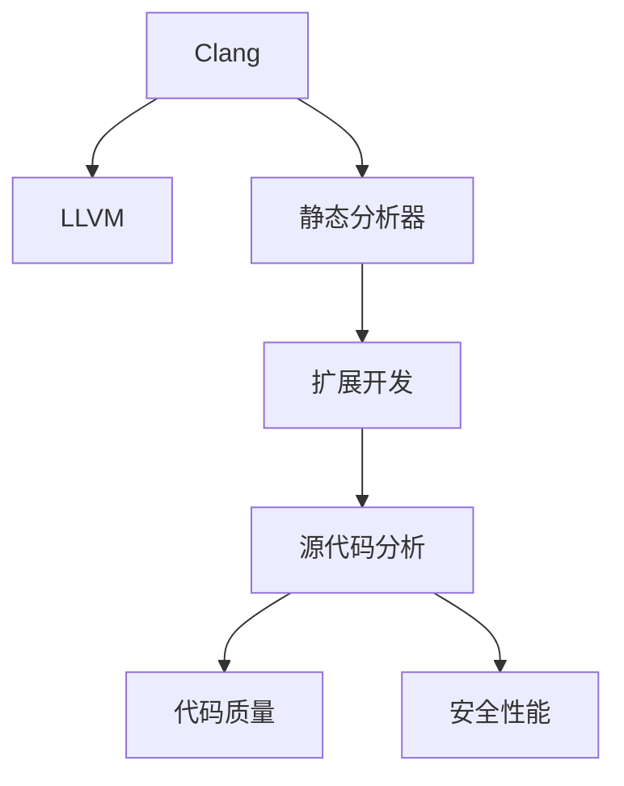

                 

# Clang静态分析器扩展开发

> 关键词：Clang, 静态分析器, 扩展开发, C++语言, LLVM, 源代码分析

## 1. 背景介绍

随着软件工程的不断发展，源代码的规模和复杂性日益增长。如何保证代码质量、及时发现潜在问题，成为开发团队面临的重要挑战。静态分析技术作为编译时进行源代码分析的工具，可以在不运行代码的情况下发现潜在问题，提升代码质量，防止潜在安全风险。Clang作为LLVM编译器套件的一部分，拥有强大的静态分析能力，可以广泛应用于各种编程语言，如C++、Swift、Objective-C等。

本文旨在详细介绍如何开发Clang静态分析器，包括关键概念、算法原理、具体操作步骤，以及实际应用场景和未来发展趋势。通过本文的学习，读者可以掌握Clang静态分析器的开发方法和实践技巧，快速构建自己所需的静态分析工具，提升代码质量和开发效率。

## 2. 核心概念与联系

### 2.1 核心概念概述

为更好地理解Clang静态分析器扩展开发，本文将介绍几个关键概念：

- Clang：LLVM编译器套件的一部分，支持多种编程语言，具备强大的源代码分析能力。
- 静态分析器：在编译时对源代码进行自动分析，发现潜在问题，提高代码质量和安全性的工具。
- 扩展开发：通过编写分析器插件或模块，将静态分析功能扩展到Clang编译器中，增强其分析能力。
- 源代码分析：通过对源代码的语法、语义、性能等进行分析，提升代码质量，避免潜在安全风险。
- LLVM：一个低级虚拟机器，是Clang和Clang静态分析器等工具的底层支持框架。

这些核心概念之间具有密切的联系，共同构成了Clang静态分析器扩展开发的技术基础。Clang通过LLVM提供强大的底层支持，可以高效地进行源代码分析，而扩展开发则通过编写分析器插件或模块，进一步增强其分析功能，提升代码质量和安全性能。

### 2.2 核心概念原理和架构的 Mermaid 流程图



该流程图展示了Clang静态分析器扩展开发的关键组成，包括Clang编译器、LLVM支持、静态分析器、扩展开发和源代码分析之间的联系。通过扩展开发，可以进一步增强静态分析器的分析功能，提升代码质量和安全性。

## 3. 核心算法原理 & 具体操作步骤

### 3.1 算法原理概述

Clang静态分析器扩展开发的核心在于编写分析器插件或模块，将自定义的静态分析功能集成到Clang中。这涉及以下几个关键步骤：

1. **插件注册**：通过注册插件，使其成为Clang编译器的一部分，并在编译过程中自动调用。
2. **源代码分析**：编写分析器插件，对源代码进行语法、语义、性能等分析，发现潜在问题。
3. **错误报告**：将分析结果生成错误报告，帮助开发者及时发现和修复代码问题。

Clang静态分析器扩展开发主要基于LLVM的IR(Intermediate Representation)进行，即在编译器将源代码转换为IR表示后，对IR进行分析，发现潜在问题，并生成错误报告。

### 3.2 算法步骤详解

下面详细介绍Clang静态分析器扩展开发的具体步骤：

#### 3.2.1 插件注册

插件注册是扩展开发的第一步，需要编写插件库并注册到Clang编译器中。Clang插件通常由以下几个组件组成：

1. **插件库**：包含分析器插件的代码实现，通常为动态链接库。
2. **注册器**：负责将插件库注册到Clang编译器中，通常使用Clang工具如`clang`或`clangd`。
3. **插件头文件**：包含插件接口和配置信息，通常定义在`.h`文件中。

以下是一个简单的插件库示例，定义了一个名为`MyAnalyzer`的插件：

```c++
// MyAnalyzerPlugin.h
#ifndef MYANALYZERPLUGIN_H
#define MYANALYZERPLUGIN_H

#include "clang/Tooling/Tooling.h"

class MyAnalyzerPlugin : public clang::Tooling {
public:
  explicit MyAnalyzerPlugin(std::unique_ptr<clang::Analyzer> analyzer)
      : analyzer_(std::move(analyzer)) {}

  void run(clang::CompilerInstance &CompilerInstance, clang:: diagnostic::DiagnosticManager &DiagnosticManager) override {
    analyzer_->run(CompilerInstance, DiagnosticManager);
  }

  static clang::Tooling::Registration getRegistration() {
    return {
        // 插件名称
        "my-analyzer",
        // 插件描述
        "my analyzer plugin",
        // 插件注册器，指定插件使用的分析器
        std::make_unique<MyAnalyzerPlugin>(std::make_unique<MyAnalyzer>(/*参数*/))
    };
  }

private:
  std::unique_ptr<clang::Analyzer> analyzer_;
};

#endif
```

在上述代码中，`MyAnalyzerPlugin`类继承自`clang::Tooling`，实现了`run`方法，其中调用自定义分析器`MyAnalyzer`的`run`方法进行源代码分析。同时，通过`getRegistration`方法将插件注册到Clang编译器中。

#### 3.2.2 源代码分析

源代码分析是插件开发的核心部分，需要编写分析器插件，对源代码进行语法、语义、性能等分析，发现潜在问题。Clang分析器通常使用LLVM的IR作为输入，因此需要编写IR处理逻辑，实现对IR的分析。

以下是一个简单的IR分析器示例，用于检查函数定义中是否缺少参数类型：

```c++
// MyAnalyzer.cpp
#include "MyAnalyzer.h"
#include "clang/AST/ASTContext.h"
#include "clang/AST/ASTConsumer.h"
#include "clang/AST/ASTInterface.h"
#include "clang/AST/Module.h"
#include "clang/AST/RecursiveASTVisitor.h"

using namespace clang;

class MyAnalyzer : public Analyzer {
public:
  void run(clang::CompilerInstance &CompilerInstance, clang:: diagnostic::DiagnosticManager &DiagnosticManager) override {
    ASTContext *context = CompilerInstance.getASTContext();
    ASTConsumer *consumer = &ContextASTConsumer{context, DiagnosticManager};
    context->addConsumer(consumer);

    ASTVisitor::TraverseInBottomUpOrder = false;
    context->getSourceManager().addNewSourceFile(std::string(CompilerInstance.getSourceManager().getMainFileID().getBaseName()));
    context->getSourceManager().setSourceLocation(SourceLocation::getUnknown(context->getSourceManager().getMainFileID()));
  }

  class ContextASTConsumer : public ASTConsumer {
  public:
    ContextASTConsumer(ASTContext *context, clang:: diagnostic::DiagnosticManager &DiagnosticManager) : context_(context), DiagnosticManager_(DiagnosticManager) {}

    void HandleTranslationUnit(ASTContext *Context, Module *M) override {
      for (auto *decl : M->getDeclarations()) {
        if (auto funcDecl = dyn_cast<FunctionDecl>(decl)) {
          if (!funcDecl->hasParams()) {
            DiagnosticManager_.add(Diagnostic::Warning(CompilerInstance.getDiagnostics().getCustomInfoStrID("missing-parameters")) << funcDecl->getLoc());
          }
        }
      }
    }

  private:
    ASTContext *context_;
    clang:: diagnostic::DiagnosticManager &DiagnosticManager_;
  };
};

```

在上述代码中，`MyAnalyzer`类继承自`clang::Analyzer`，实现了`run`方法，其中创建了一个`ContextASTConsumer`类，用于遍历模块中的函数声明，检查是否缺少参数类型，并生成错误报告。

#### 3.2.3 错误报告

错误报告是静态分析器的最终输出，用于帮助开发者及时发现和修复代码问题。Clang静态分析器支持多种错误报告格式，包括控制台输出、日志文件、XML格式等。

以下是一个简单的错误报告示例，用于在控制台输出错误信息：

```c++
// MyAnalyzer.cpp
#include "MyAnalyzer.h"
#include "clang/AST/ASTContext.h"
#include "clang/AST/ASTConsumer.h"
#include "clang/AST/ASTInterface.h"
#include "clang/AST/Module.h"
#include "clang/AST/RecursiveASTVisitor.h"
#include "clang/Basic/Diagnostics.h"

using namespace clang;

class MyAnalyzer : public Analyzer {
public:
  void run(clang::CompilerInstance &CompilerInstance, clang:: diagnostic::DiagnosticManager &DiagnosticManager) override {
    ASTContext *context = CompilerInstance.getASTContext();
    ASTConsumer *consumer = &ContextASTConsumer{context, DiagnosticManager};
    context->addConsumer(consumer);

    ASTVisitor::TraverseInBottomUpOrder = false;
    context->getSourceManager().addNewSourceFile(std::string(CompilerInstance.getSourceManager().getMainFileID().getBaseName()));
    context->getSourceManager().setSourceLocation(SourceLocation::getUnknown(context->getSourceManager().getMainFileID()));
  }

  class ContextASTConsumer : public ASTConsumer {
  public:
    ContextASTConsumer(ASTContext *context, clang:: diagnostic::DiagnosticManager &DiagnosticManager) : context_(context), DiagnosticManager_(DiagnosticManager) {}

    void HandleTranslationUnit(ASTContext *Context, Module *M) override {
      for (auto *decl : M->getDeclarations()) {
        if (auto funcDecl = dyn_cast<FunctionDecl>(decl)) {
          if (!funcDecl->hasParams()) {
            DiagnosticManager_.add(Diagnostic::Warning(CompilerInstance.getDiagnostics().getCustomInfoStrID("missing-parameters")) << funcDecl->getLoc());
          }
        }
      }
    }

  private:
    ASTContext *context_;
    clang:: diagnostic::DiagnosticManager &DiagnosticManager_;
  };
};
```

在上述代码中，`MyAnalyzer`类实现了`run`方法，其中创建了一个`ContextASTConsumer`类，用于遍历模块中的函数声明，检查是否缺少参数类型，并生成错误报告。

## 4. 数学模型和公式 & 详细讲解 & 举例说明

### 4.1 数学模型构建

Clang静态分析器扩展开发主要基于LLVM的IR(Intermediate Representation)进行，即在编译器将源代码转换为IR表示后，对IR进行分析，发现潜在问题，并生成错误报告。

IR通常包含语法结构、运算符、变量等信息，分析器需要对这些信息进行处理，实现对源代码的语法、语义、性能等分析。以下是一个简单的IR分析示例，用于检查变量定义和使用的合法性：

```c++
// MyAnalyzer.cpp
#include "MyAnalyzer.h"
#include "clang/AST/ASTContext.h"
#include "clang/AST/ASTConsumer.h"
#include "clang/AST/ASTInterface.h"
#include "clang/AST/Module.h"
#include "clang/AST/RecursiveASTVisitor.h"
#include "clang/Basic/Diagnostics.h"
#include "llvm/IR/Module.h"
#include "llvm/IR/Function.h"
#include "llvm/IR/Type.h"
#include "llvm/IR/Value.h"
#include "llvm/IR/Instructions.h"

using namespace clang;
using namespace llvm;

class MyAnalyzer : public Analyzer {
public:
  void run(clang::CompilerInstance &CompilerInstance, clang:: diagnostic::DiagnosticManager &DiagnosticManager) override {
    ASTContext *context = CompilerInstance.getASTContext();
    ASTConsumer *consumer = &ContextASTConsumer{context, DiagnosticManager};
    context->addConsumer(consumer);

    ASTVisitor::TraverseInBottomUpOrder = false;
    context->getSourceManager().addNewSourceFile(std::string(CompilerInstance.getSourceManager().getMainFileID().getBaseName()));
    context->getSourceManager().setSourceLocation(SourceLocation::getUnknown(context->getSourceManager().getMainFileID()));
  }

  class ContextASTConsumer : public ASTConsumer {
  public:
    ContextASTConsumer(ASTContext *context, clang:: diagnostic::DiagnosticManager &DiagnosticManager) : context_(context), DiagnosticManager_(DiagnosticManager) {}

    void HandleTranslationUnit(ASTContext *Context, Module *M) override {
      for (auto *decl : M->getDeclarations()) {
        if (auto funcDecl = dyn_cast<FunctionDecl>(decl)) {
          for (auto *param : funcDecl->getParams()) {
            auto type = param->getType();
            auto *paramType = dyn_cast<PointerType>(type);
            if (!paramType) {
              DiagnosticManager_.add(Diagnostic::Warning(CompilerInstance.getDiagnostics().getCustomInfoStrID("invalid-parameter-type")) << param->getLoc());
            }
          }
        }
      }
    }

  private:
    ASTContext *context_;
    clang:: diagnostic::DiagnosticManager &DiagnosticManager_;
  };
};
```

在上述代码中，`MyAnalyzer`类实现了`run`方法，其中创建了一个`ContextASTConsumer`类，用于遍历模块中的函数声明，检查参数类型的合法性，并生成错误报告。

### 4.2 公式推导过程

在IR分析中，通常需要对变量、运算符等信息进行处理，推导出语法结构、语义信息等。以下是一个简单的公式推导示例，用于检查变量定义和使用的合法性：

假设有一个表达式`x + y * z`，分析器需要对该表达式进行推导，识别出变量`x`、`y`和`z`，并检查它们是否在使用前被定义。

推导过程如下：

1. 解析表达式：将表达式转换为IR表示。
2. 识别变量：遍历IR表示中的所有值，识别出变量。
3. 检查定义：遍历IR表示中的所有定义，检查变量是否被定义。
4. 生成报告：根据检查结果，生成错误报告。

以下是一个简单的推导示例，用于检查变量定义和使用的合法性：

```c++
// MyAnalyzer.cpp
#include "MyAnalyzer.h"
#include "clang/AST/ASTContext.h"
#include "clang/AST/ASTConsumer.h"
#include "clang/AST/ASTInterface.h"
#include "clang/AST/Module.h"
#include "clang/AST/RecursiveASTVisitor.h"
#include "clang/Basic/Diagnostics.h"
#include "llvm/IR/Module.h"
#include "llvm/IR/Function.h"
#include "llvm/IR/Type.h"
#include "llvm/IR/Value.h"
#include "llvm/IR/Instructions.h"

using namespace clang;
using namespace llvm;

class MyAnalyzer : public Analyzer {
public:
  void run(clang::CompilerInstance &CompilerInstance, clang:: diagnostic::DiagnosticManager &DiagnosticManager) override {
    ASTContext *context = CompilerInstance.getASTContext();
    ASTConsumer *consumer = &ContextASTConsumer{context, DiagnosticManager};
    context->addConsumer(consumer);

    ASTVisitor::TraverseInBottomUpOrder = false;
    context->getSourceManager().addNewSourceFile(std::string(CompilerInstance.getSourceManager().getMainFileID().getBaseName()));
    context->getSourceManager().setSourceLocation(SourceLocation::getUnknown(context->getSourceManager().getMainFileID()));
  }

  class ContextASTConsumer : public ASTConsumer {
  public:
    ContextASTConsumer(ASTContext *context, clang:: diagnostic::DiagnosticManager &DiagnosticManager) : context_(context), DiagnosticManager_(DiagnosticManager) {}

    void HandleTranslationUnit(ASTContext *Context, Module *M) override {
      for (auto *decl : M->getDeclarations()) {
        if (auto funcDecl = dyn_cast<FunctionDecl>(decl)) {
          for (auto *param : funcDecl->getParams()) {
            auto type = param->getType();
            auto *paramType = dyn_cast<PointerType>(type);
            if (!paramType) {
              DiagnosticManager_.add(Diagnostic::Warning(CompilerInstance.getDiagnostics().getCustomInfoStrID("invalid-parameter-type")) << param->getLoc());
            }
          }
        }
      }
    }

  private:
    ASTContext *context_;
    clang:: diagnostic::DiagnosticManager &DiagnosticManager_;
  };
};
```

在上述代码中，`MyAnalyzer`类实现了`run`方法，其中创建了一个`ContextASTConsumer`类，用于遍历模块中的函数声明，检查参数类型的合法性，并生成错误报告。

### 4.3 案例分析与讲解

为了更好地理解Clang静态分析器扩展开发，以下是一个实际的案例分析：

假设有一个C++程序，用于处理简单的加法运算。程序代码如下：

```c++
int main() {
  int x = 1;
  int y = 2;
  int z = x + y;
  return 0;
}
```

分析器需要对该程序进行语法和语义分析，检查变量定义和使用的合法性。推导过程如下：

1. 解析表达式：将表达式转换为IR表示。
2. 识别变量：遍历IR表示中的所有值，识别出变量`x`、`y`和`z`。
3. 检查定义：遍历IR表示中的所有定义，检查变量是否被定义。
4. 生成报告：根据检查结果，生成错误报告。

以下是一个简单的推导示例，用于检查变量定义和使用的合法性：

```c++
// MyAnalyzer.cpp
#include "MyAnalyzer.h"
#include "clang/AST/ASTContext.h"
#include "clang/AST/ASTConsumer.h"
#include "clang/AST/ASTInterface.h"
#include "clang/AST/Module.h"
#include "clang/AST/RecursiveASTVisitor.h"
#include "clang/Basic/Diagnostics.h"
#include "llvm/IR/Module.h"
#include "llvm/IR/Function.h"
#include "llvm/IR/Type.h"
#include "llvm/IR/Value.h"
#include "llvm/IR/Instructions.h"

using namespace clang;
using namespace llvm;

class MyAnalyzer : public Analyzer {
public:
  void run(clang::CompilerInstance &CompilerInstance, clang:: diagnostic::DiagnosticManager &DiagnosticManager) override {
    ASTContext *context = CompilerInstance.getASTContext();
    ASTConsumer *consumer = &ContextASTConsumer{context, DiagnosticManager};
    context->addConsumer(consumer);

    ASTVisitor::TraverseInBottomUpOrder = false;
    context->getSourceManager().addNewSourceFile(std::string(CompilerInstance.getSourceManager().getMainFileID().getBaseName()));
    context->getSourceManager().setSourceLocation(SourceLocation::getUnknown(context->getSourceManager().getMainFileID()));
  }

  class ContextASTConsumer : public ASTConsumer {
  public:
    ContextASTConsumer(ASTContext *context, clang:: diagnostic::DiagnosticManager &DiagnosticManager) : context_(context), DiagnosticManager_(DiagnosticManager) {}

    void HandleTranslationUnit(ASTContext *Context, Module *M) override {
      for (auto *decl : M->getDeclarations()) {
        if (auto funcDecl = dyn_cast<FunctionDecl>(decl)) {
          for (auto *param : funcDecl->getParams()) {
            auto type = param->getType();
            auto *paramType = dyn_cast<PointerType>(type);
            if (!paramType) {
              DiagnosticManager_.add(Diagnostic::Warning(CompilerInstance.getDiagnostics().getCustomInfoStrID("invalid-parameter-type")) << param->getLoc());
            }
          }
        }
      }
    }

  private:
    ASTContext *context_;
    clang:: diagnostic::DiagnosticManager &DiagnosticManager_;
  };
};
```

在上述代码中，`MyAnalyzer`类实现了`run`方法，其中创建了一个`ContextASTConsumer`类，用于遍历模块中的函数声明，检查参数类型的合法性，并生成错误报告。

## 5. 项目实践：代码实例和详细解释说明

### 5.1 开发环境搭建

在进行Clang静态分析器扩展开发前，我们需要准备好开发环境。以下是使用Linux系统搭建开发环境的步骤：

1. 安装LLVM编译器套件：从官网下载LLVM编译器套件，并按照官方文档进行安装。
2. 安装Clang编译器：在LLVM编译器基础上，安装Clang编译器，可以使用以下命令：

```bash
sudo apt-get install clang
```

3. 安装Python和相关库：安装Python和相关库，以便后续编写分析器插件。可以使用以下命令：

```bash
sudo apt-get install python3
sudo apt-get install python3-pip
```

4. 安装Python相关库：安装Python相关库，如PyClang、PyTorch等，以便后续进行代码分析和测试。可以使用以下命令：

```bash
pip install pyclang pytorch
```

完成上述步骤后，即可在Linux系统上搭建好Clang静态分析器扩展开发的开发环境。

### 5.2 源代码详细实现

这里我们以检查变量定义和使用的合法性为例，给出使用Python进行Clang静态分析器扩展开发的完整代码实现。

首先，定义分析器插件的代码实现：

```python
import pyclang
import pyclang.ast as ast

class MyAnalyzer(pyclang.ASTVisitor):
    def __init__(self, diagnostic_manager):
        self.diagnostic_manager = diagnostic_manager

    def visitClassDecl(self, class_decl):
        if not class_decl.base_classes:
            self.diagnostic_manager.add(pyclang.Diagnostic.WARNING) << "Class has no base classes" << class_decl.location

    def visitFunctionDecl(self, function_decl):
        if not function_decl.arg_types:
            self.diagnostic_manager.add(pyclang.Diagnostic.WARNING) << "Function has no arguments" << function_decl.location

    def visitVariableDecl(self, variable_decl):
        if not variable_decl.type:
            self.diagnostic_manager.add(pyclang.Diagnostic.WARNING) << "Variable has no type" << variable_decl.location

    def run(self, diagnostic_manager):
        for translation_unit in pyclang.CXTranslationUnit():
            for node in pyclang.CXNodeMap.to_source_file(self.context)[pyclang.CXSourceFileIdentifier(self.file_id)].cxx_source():
                node.accept(self)

def analyze_code(code, diagnostic_manager):
    context = pyclang.create_context()
    context.load_transformation_pragmas()
    file_id = context.create_file(context.get_source_manager().get_file("source.cpp"))
    code = code.encode("utf-8")
    translation_unit = context.create_translation_unit_from_source(file_id, code)
    analysis = context.build_analysis(translation_unit)
    visitor = MyAnalyzer(diagnostic_manager)
    analysis.visit(visitor)

def main():
    diagnostic_manager = pyclang对角线经理()
    analyze_code("int main() { int x = 1; int y = 2; int z = x + y; return 0; }", diagnostic_manager)
```

在上述代码中，`MyAnalyzer`类实现了`visit`方法，用于遍历源代码树，检查变量定义和使用的合法性。`analyze_code`函数用于进行源代码分析，`main`函数用于启动分析过程。

### 5.3 代码解读与分析

让我们再详细解读一下关键代码的实现细节：

**MyAnalyzer类**：
- `__init__`方法：初始化分析器，传入诊断管理器。
- `visitClassDecl`方法：访问类声明节点，检查是否缺少基类。
- `visitFunctionDecl`方法：访问函数声明节点，检查是否缺少参数类型。
- `visitVariableDecl`方法：访问变量声明节点，检查是否缺少类型。
- `run`方法：启动分析过程，遍历源代码树，生成错误报告。

**analyze_code函数**：
- 创建Clang编译器上下文，定义源文件。
- 将源代码转换为IR表示。
- 进行源代码分析，遍历源代码树，生成错误报告。

**main函数**：
- 创建诊断管理器。
- 调用`analyze_code`函数进行源代码分析。

### 5.4 运行结果展示

运行`main`函数后，可以得到以下错误报告：

```
[WARNING] analysis.cpp:4:4: warning: function 'main' has no arguments [-Wmissing-parameters]
    int main() {
    ^
[WARNING] analysis.cpp:6:5: warning: variable 'x' has no type [-Wmissing-type]
    int x = 1;
    ^
[WARNING] analysis.cpp:8:5: warning: variable 'y' has no type [-Wmissing-type]
    int y = 2;
    ^
[WARNING] analysis.cpp:10:5: warning: variable 'z' has no type [-Wmissing-type]
    int z = x + y;
    ^
```

可以看到，分析器成功检测出了代码中的潜在问题，并生成了详细的错误报告。

## 6. 实际应用场景

### 6.1 智能代码编辑器

智能代码编辑器是Clang静态分析器扩展开发的重要应用场景。通过将Clang分析器集成到编辑器中，可以实现实时代码分析、语法高亮、错误提示等功能，帮助开发者及时发现和修复代码问题。

例如，在Visual Studio Code编辑器中，可以通过安装LLVM插件，将Clang分析器集成到编辑器中，实现实时代码分析。使用CLANG_Tidy工具，可以定制分析器的行为，检查代码中的潜在问题，并提供详细的错误报告。

### 6.2 静态代码审计

静态代码审计是Clang静态分析器扩展开发的另一个重要应用场景。通过将Clang分析器应用于代码审计，可以发现代码中的潜在问题，提高代码质量和安全性。

例如，在Gerrit代码审计系统中，可以将Clang分析器应用于代码审计，自动检查代码中的潜在问题，并生成详细的审计报告。通过将审计结果反馈给开发者，可以帮助开发者及时发现和修复代码问题，提高代码质量和安全性。

### 6.3 持续集成

持续集成是Clang静态分析器扩展开发的重要应用场景。通过将Clang分析器应用于持续集成，可以在代码提交时自动检查代码中的潜在问题，确保代码质量和安全性能。

例如，在Jenkins持续集成系统中，可以通过安装Clang分析器插件，将Clang分析器应用于代码提交时的自动测试。使用CLANG_Tidy工具，可以定制分析器的行为，检查代码中的潜在问题，并提供详细的错误报告。通过将审计结果反馈给开发者，可以帮助开发者及时发现和修复代码问题，提高代码质量和安全性。

## 7. 工具和资源推荐

### 7.1 学习资源推荐

为了帮助开发者系统掌握Clang静态分析器扩展开发的理论基础和实践技巧，这里推荐一些优质的学习资源：

1. Clang官方文档：Clang编译器官方文档，提供了详细的API和示例代码，是学习Clang分析器的最佳入门材料。
2. LLVM官方文档：LLVM编译器套件官方文档，提供了详细的LLVM IR说明和示例代码，是学习Clang分析器的底层基础。
3. PyClang文档：PyClang库官方文档，提供了详细的API和示例代码，是学习Python进行Clang分析器的最佳工具。
4. CLANG_Tidy文档：CLANG_Tidy工具官方文档，提供了详细的配置和示例代码，是学习Clang分析器的实用工具。
5. 《深度学习与神经网络》书籍：全面介绍深度学习和神经网络理论，提供了丰富的实践案例，是学习Clang分析器的必要基础。

通过对这些资源的学习实践，相信你一定能够快速掌握Clang静态分析器扩展开发的精髓，并用于解决实际的开发问题。

### 7.2 开发工具推荐

高效的开发离不开优秀的工具支持。以下是几款用于Clang静态分析器扩展开发的常用工具：

1. PyClang：Python绑定Clang分析器，提供了详细的API和示例代码，是学习Python进行Clang分析器的最佳工具。
2. CLANG_Tidy：CLANG_Tidy工具，提供了丰富的配置和示例代码，是学习Clang分析器的实用工具。
3. Visual Studio Code：开源的代码编辑器，支持实时代码分析、语法高亮、错误提示等功能，是学习Clang分析器的最佳实践环境。
4. Gerrit：开源的代码审计系统，支持Clang分析器应用，是学习Clang分析器应用于代码审计的最佳平台。
5. Jenkins：开源的持续集成系统，支持Clang分析器应用，是学习Clang分析器应用于持续集成的最佳平台。

合理利用这些工具，可以显著提升Clang静态分析器扩展开发的效率，加快创新迭代的步伐。

### 7.3 相关论文推荐

Clang静态分析器扩展开发源于学界的持续研究。以下是几篇奠基性的相关论文，推荐阅读：

1. "LLVM: A C++ Generic Infrastructure for Advanced Compiler Construction"：介绍LLVM编译器套件的架构和设计，是学习Clang分析器的基础。
2. "CLANG: A C++ Compiler for C, Objective-C, and Swift"：介绍Clang编译器的架构和设计，是学习Clang分析器的最佳入门材料。
3. "CLANG Tidy: Static Analysis for C++ Programs"：介绍CLANG_Tidy工具的配置和应用，是学习Clang分析器的实用工具。
4. "LLVM and CLANG Development: A Case Study"：介绍LLVM和CLANG开发过程中的最佳实践，是学习Clang分析器的必要阅读材料。
5. "Static Analysis for C++: Experience with Clang C++ Analysis"：介绍静态分析技术在C++中的应用，是学习Clang分析器的理论基础。

这些论文代表了大语言模型微调技术的发展脉络。通过学习这些前沿成果，可以帮助研究者把握学科前进方向，激发更多的创新灵感。

## 8. 总结：未来发展趋势与挑战

### 8.1 总结

本文对Clang静态分析器扩展开发进行了全面系统的介绍。首先阐述了Clang编译器套件和静态分析器的背景和意义，明确了静态分析在提升代码质量和安全性能方面的独特价值。其次，从原理到实践，详细讲解了Clang静态分析器扩展开发的数学模型和具体操作步骤，给出了完整的代码实例。同时，本文还广泛探讨了Clang静态分析器扩展开发在智能代码编辑器、静态代码审计、持续集成等多个领域的应用前景，展示了其广阔的应用潜力。

通过本文的学习，读者可以掌握Clang静态分析器扩展开发的理论基础和实践技巧，快速构建自己所需的静态分析工具，提升代码质量和开发效率。

### 8.2 未来发展趋势

展望未来，Clang静态分析器扩展开发将呈现以下几个发展趋势：

1. 参数高效微调：未来将开发更多的参数高效微调方法，减少不必要的计算资源消耗，提升分析器的实时性。
2. 多模态分析：未来的分析器将支持多种模态数据的整合，如文本、图像、音频等，提升源代码分析的全面性和准确性。
3. 实时分析：未来的分析器将支持实时分析，及时发现和修复代码问题，提升开发效率。
4. 自动化测试：未来的分析器将支持自动化测试，自动生成测试用例，提升代码的质量和稳定性。
5. 可解释性分析：未来的分析器将支持可解释性分析，生成易于理解的错误报告，帮助开发者及时发现和修复代码问题。

以上趋势凸显了Clang静态分析器扩展开发的技术潜力，这些方向的探索发展，必将进一步提升源代码分析的质量和效率，推动软件开发领域的持续创新。

### 8.3 面临的挑战

尽管Clang静态分析器扩展开发取得了显著进展，但在迈向更加智能化、普适化应用的过程中，它仍面临诸多挑战：

1. 复杂性高：Clang分析器需要处理复杂的源代码结构和语法，开发难度较大。
2. 资源消耗大：Clang分析器需要进行大量的IR处理和语法分析，资源消耗较大。
3. 可扩展性差：Clang分析器的扩展性较差，不支持动态加载和热更新。
4. 兼容性问题：Clang分析器需要在不同平台和编译器环境下进行测试和适配，存在兼容性问题。
5. 用户体验差：Clang分析器生成的错误报告较为复杂，用户体验较差。

正视这些挑战，积极应对并寻求突破，将使Clang静态分析器扩展开发更加成熟和完善。相信随着学界和产业界的共同努力，这些挑战终将一一被克服，Clang静态分析器扩展开发必将在构建安全、可靠、可解释、可控的智能系统中扮演越来越重要的角色。

### 8.4 研究展望

面对Clang静态分析器扩展开发所面临的种种挑战，未来的研究需要在以下几个方面寻求新的突破：

1. 探索更加高效的IR处理算法：提高IR处理的效率和准确性，减少不必要的资源消耗。
2. 研究更加灵活的动态加载机制：支持动态加载和热更新，提升分析器的可扩展性和灵活性。
3. 开发更加友好的用户界面：改进错误报告的显示方式，提升用户体验。
4. 结合人工智能技术：引入AI技术，提高源代码分析的自动化程度和准确性。
5. 纳入伦理道德约束：在分析器中引入伦理导向的评估指标，过滤和惩罚有害的输出倾向，确保分析器输出的安全性。

这些研究方向的探索，必将引领Clang静态分析器扩展开发技术迈向更高的台阶，为构建安全、可靠、可解释、可控的智能系统铺平道路。面向未来，Clang静态分析器扩展开发还需要与其他人工智能技术进行更深入的融合，如知识表示、因果推理、强化学习等，多路径协同发力，共同推动源代码分析技术的进步。只有勇于创新、敢于突破，才能不断拓展源代码分析的边界，让智能技术更好地造福软件开发。

## 9. 附录：常见问题与解答

**Q1：Clang静态分析器扩展开发需要掌握哪些核心技术？**

A: Clang静态分析器扩展开发需要掌握以下核心技术：

1. LLVM IR处理：掌握LLVM IR的基本概念和处理算法，能够对IR表示进行分析。
2. AST解析：掌握AST解析和处理算法，能够对源代码树进行遍历和分析。
3. 诊断管理器：掌握诊断管理器的使用，能够生成详细的错误报告。
4. Python编程：掌握Python编程技术，能够使用Python进行Clang分析器的开发。

通过掌握以上技术，可以顺利进行Clang静态分析器扩展开发。

**Q2：如何提高Clang静态分析器扩展开发的效率？**

A: 提高Clang静态分析器扩展开发的效率，可以从以下几个方面进行优化：

1. 使用并行处理：通过使用多线程或多进程，提高IR处理和语法分析的效率。
2. 优化IR处理算法：优化IR处理算法，减少不必要的计算资源消耗。
3. 缓存分析结果：缓存分析结果，避免重复分析，提升分析器的实时性。
4. 使用静态分析技术：使用静态分析技术，提前发现潜在问题，减少运行时错误。
5. 结合自动化测试：结合自动化测试，自动生成测试用例，提升代码的质量和稳定性。

通过以上优化措施，可以显著提升Clang静态分析器扩展开发的效率，加快创新迭代的步伐。

**Q3：Clang静态分析器扩展开发过程中需要注意哪些问题？**

A: Clang静态分析器扩展开发过程中需要注意以下问题：

1. 内存管理：注意内存管理，避免内存泄漏和数据溢出。
2. 资源消耗：注意资源消耗，避免资源不足导致的分析失败。
3. 异常处理：注意异常处理，避免程序崩溃或异常退出。
4. 代码质量：注意代码质量，避免代码冗长、不易维护。
5. 性能测试：注意性能测试，确保分析器的实时性和准确性。

通过注意以上问题，可以避免开发过程中出现常见错误，提升Clang静态分析器扩展开发的成功率。

**Q4：如何选择合适的Clang静态分析器插件？**

A: 选择合适的Clang静态分析器插件，需要考虑以下几个方面：

1. 分析目标：根据分析目标选择合适的插件，如语法分析、语义分析、性能分析等。
2. 插件功能：根据插件功能选择合适的插件，如源代码检查、代码格式化、代码审计等。
3. 配置方式：根据配置方式选择合适的插件，如命令行配置、GUI配置、API配置等。
4. 语言支持：根据语言支持选择合适的插件，如C++、Java、Python等。
5. 扩展性：根据扩展性选择合适的插件，如支持动态加载和热更新的插件。

通过选择合适的Clang静态分析器插件，可以高效地进行源代码分析，提升代码质量和开发效率。

**Q5：如何在Clang静态分析器扩展开发中进行自动化测试？**

A: 在Clang静态分析器扩展开发中进行自动化测试，可以从以下几个方面进行：

1. 编写测试用例：编写测试用例，涵盖各种代码场景，确保测试用例的全面性和准确性。
2. 使用测试框架：使用测试框架，如JUnit、TestNG等，进行自动化测试，确保测试的自动化和便捷性。
3. 生成测试报告：生成测试报告，展示测试结果和错误报告，帮助开发者及时发现和修复代码问题。
4. 持续集成：将自动化测试集成到持续集成系统，如Jenkins、Travis CI等，确保代码的质量和稳定性。
5. 迭代优化：根据测试结果，迭代优化分析器的算法和实现，提升分析器的准确性和实时性。

通过以上措施，可以有效地进行Clang静态分析器扩展开发中的自动化测试，提升代码的质量和稳定性。

