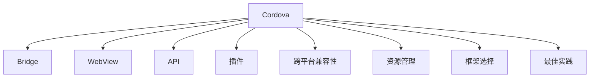

                 

# Cordova 混合应用：在原生平台上运行

> 关键词：Cordova, 混合应用, Web 应用, 原生应用, 跨平台开发, 桥接技术, 性能优化

## 1. 背景介绍

### 1.1 问题由来

随着移动设备的普及和互联网应用的增多，越来越多的企业希望构建跨平台的移动应用。传统的原生开发方法（如 iOS 的 Swift 和 Objective-C，Android 的 Java 和 Kotlin）需要分别开发和维护多个代码库，成本高昂且效率低下。于是，跨平台开发技术应运而生，它允许开发者使用一套代码开发多种平台的应用，极大地提高了开发效率和降低了维护成本。

Cordova 就是其中的佼佼者之一。它基于 Web 技术（如 HTML, CSS, JavaScript），借助 Bridge 技术实现了与原生应用的无缝连接，支持在多种原生平台（如 iOS、Android、Windows Phone）上运行。Cordova 的易用性和灵活性使其成为中小型团队和快速原型开发的首选。

### 1.2 问题核心关键点

Cordova 混合应用的开发涉及以下几个关键点：

- **桥接技术**：Cordova 通过桥接技术实现了 Web 代码与原生代码的交互。桥接器将 Web 代码中的调用转化为原生代码的 API 调用，实现了不同平台之间的代码互操作。

- **性能优化**：由于 Web 代码运行在 WebView 中，性能问题（如页面渲染、JavaScript 执行）成为混合应用的瓶颈。如何优化 Web 代码的性能，提升用户体验，是开发混合应用的核心挑战。

- **跨平台兼容性**：不同平台的原生 API 存在差异，如何保证 Web 代码在不同平台上的兼容性，是实现跨平台开发的关键。

- **资源管理**：混合应用通常需要处理复杂的资源管理问题，如文件访问、网络请求、数据存储等。如何高效地管理这些资源，是开发混合应用的难点。

- **框架选择**：Cordova 提供多种开发框架（如 Angular, React, Vue.js）供开发者选择。如何根据项目需求选择合适的框架，是框架选择的关键。

- **最佳实践**：混合应用开发有诸多最佳实践，如合理使用插件、优化图片加载、提高应用程序响应性等。如何遵循这些最佳实践，提升开发效率和应用性能，是开发混合应用的必备知识。

## 2. 核心概念与联系

### 2.1 核心概念概述

为更好地理解 Cordova 混合应用的核心概念，本节将介绍几个关键概念：

- **Cordova**：一种开源的跨平台移动应用开发框架，允许开发者使用 Web 技术（HTML, CSS, JavaScript）构建混合应用。

- **Bridge**：桥接技术，使得 Web 代码能够调用原生代码，实现不同平台之间的代码互操作。

- **WebView**：Web 视图，Cordova 中 Web 代码运行的容器。

- **API**：原生 API，Web 代码通过桥接器调用原生平台提供的 API。

- **插件**：Cordova 插件，为开发者提供跨平台的原生功能，如文件访问、地理位置、通知等。

- **跨平台兼容性**：保证 Web 代码在不同平台上的兼容性，是实现跨平台开发的关键。

- **资源管理**：管理混合应用中的资源，如文件、网络请求、数据存储等。

- **框架选择**：选择适合项目的 Web 开发框架，如 Angular, React, Vue.js。

- **最佳实践**：遵循混合应用开发的最佳实践，提升开发效率和应用性能。

这些核心概念之间的逻辑关系可以通过以下 Mermaid 流程图来展示：



这个流程图展示了大语言模型的核心概念及其之间的关系：

1. Cordova 通过桥接技术实现 Web 代码与原生代码的交互。
2. Web 代码运行在 WebView 中，通过桥接技术调用原生 API。
3. Cordova 提供多种原生功能，通过插件进行扩展。
4. 保证 Web 代码在不同平台上的兼容性是实现跨平台开发的关键。
5. 高效管理混合应用中的资源是开发混合应用的难点。
6. 选择合适的 Web 开发框架和遵循最佳实践是提升开发效率和应用性能的必备知识。

## 3. 核心算法原理 & 具体操作步骤

### 3.1 算法原理概述

Cordova 混合应用的核心算法原理是通过桥接技术实现 Web 代码与原生代码的互操作。其核心流程如下：

1. **Web 代码调用**：当 Web 代码调用原生 API 时，通过桥接器将调用转化为原生 API 调用。

2. **原生代码执行**：原生 API 调用执行原生代码，完成具体的功能处理。

3. **结果返回**：原生代码将处理结果通过桥接器返回给 Web 代码。

4. **渲染展示**：Web 代码根据原生代码返回的结果，更新页面内容，展示给用户。

### 3.2 算法步骤详解

Cordova 混合应用的核心步骤包括：

**Step 1: 准备开发环境**

- 安装 Cordova：使用 npm 或 yarn 安装 Cordova，创建新的 Cordova 项目。

- 配置开发环境：根据开发平台（iOS、Android）配置开发环境，安装相应的工具和 SDK。

**Step 2: 编写 Web 代码**

- 选择合适的开发框架：如 Angular, React, Vue.js，根据项目需求进行选择。

- 编写 Web 代码：在 WebView 中编写 Web 代码，实现应用逻辑和用户界面。

**Step 3: 实现原生功能**

- 引入 Cordova 插件：根据需求引入 Cordova 插件，如 file、camera、geolocation 等。

- 实现原生功能：编写原生代码，实现插件提供的功能，并通过桥接器返回结果。

**Step 4: 构建和打包**

- 构建项目：使用 Cordova 构建命令编译 Web 代码和原生代码。

- 打包应用：使用 Cordova 打包命令生成平台特定的 APK 或 IPA 文件。

**Step 5: 部署和发布**

- 部署应用：将 APK 或 IPA 文件部署到相应的平台（App Store、Google Play）。

- 发布应用：发布应用程序，供用户下载和使用。

### 3.3 算法优缺点

Cordova 混合应用有以下优点：

- **跨平台开发**：使用 Web 技术开发，能够在多个平台（iOS、Android）上运行，降低了开发成本和维护成本。

- **代码复用**：Web 代码和原生代码分离，不同平台可以复用 Web 代码，提高开发效率。

- **快速原型开发**：使用 Web 技术开发，开发周期短，可以快速构建原型，验证应用功能。

- **灵活性高**：开发者可以自由选择 Web 开发框架，根据需求进行灵活开发。

但同时也存在以下缺点：

- **性能瓶颈**：由于 Web 代码运行在 WebView 中，性能问题（如页面渲染、JavaScript 执行）成为混合应用的瓶颈。

- **兼容性问题**：不同平台的原生 API 存在差异，保证 Web 代码在不同平台上的兼容性，是实现跨平台开发的关键。

- **资源管理复杂**：混合应用通常需要处理复杂的资源管理问题，如文件访问、网络请求、数据存储等。

- **桥接成本高**：桥接技术增加了代码复杂度和调试难度，需要开发者具备一定的原生编程经验。

### 3.4 算法应用领域

Cordova 混合应用广泛应用于以下领域：

- **企业应用**：开发企业内部应用，如内部通信、项目管理、CRM 等，降低开发和维护成本。

- **移动游戏**：开发移动游戏，利用 Web 技术实现游戏逻辑和界面展示，降低开发门槛和成本。

- **教育应用**：开发教育应用，如在线课程、虚拟教室、互动教学等，提高教学效果和用户体验。

- **金融应用**：开发金融应用，如移动支付、理财、保险等，提升用户体验和安全性。

- **电商应用**：开发电商应用，如在线购物、商品推荐、用户评价等，提升用户购物体验。

- **社交应用**：开发社交应用，如微博、微信、QQ 等，提高用户交互和社交体验。

## 4. 数学模型和公式 & 详细讲解 & 举例说明

### 4.1 数学模型构建

Cordova 混合应用的数学模型构建主要涉及 Web 代码和原生代码的交互。我们以文件访问功能为例，展示其数学模型构建过程。

**假设**：Web 代码需要访问文件系统中的某个文件，并将其读取到字符串中。

**输入**：Web 代码调用 Cordova 的 `file` 插件的 `readFile` 方法。

**中间变量**：
- `filePath`：文件路径。
- `fileContents`：文件内容。

**输出**：
- `fileContents`：文件内容。

**流程图**：


### 4.2 公式推导过程

由于 Cordova 混合应用的数学模型涉及 Web 代码和原生代码的交互，无法用传统数学公式表示。但我们可以用伪代码表示其基本流程：

```python
# Web 代码
fileContents = readFile(filePath);
print(fileContents);

# Cordova 插件
# 调用原生代码进行文件读取
fileContents = readNativeFile(filePath);
# 返回结果
return fileContents;

# 原生代码
# 读取文件内容
fileContents = readFileContents(filePath);
# 返回结果
return fileContents;
```

### 4.3 案例分析与讲解

以 `file` 插件为例，展示 Cordova 混合应用中的文件访问功能。

**Step 1: 编写 Web 代码**

```javascript
// 调用 Cordova 插件的 readFile 方法
Cordova.plugins.file.readFile(filePath, function(fileContents) {
    console.log(fileContents);
});
```

**Step 2: 实现原生功能**

```java
// 使用 Cordova 插件的钩子函数实现文件读取
public class FileReadHook {
    public static CordovaPluginResult readFile(String filePath) {
        String fileContents = readFileContents(filePath);
        return new CordovaPluginResult(fileContents);
    }
    
    private static String readFileContents(String filePath) {
        // 读取文件内容
        // ...
        return fileContents;
    }
}
```

**Step 3: 引入 Cordova 插件**

```xml
<platform name="android">
    <source-file srcDir="cordova-android" />
</platform>
```

**Step 4: 构建和打包**

```bash
cordova build android --android-ndk-toolpath=<path-to-android-ndk>
cordova build ios --ios-gen-sync
cordova build
```

通过上述伪代码和步骤，可以清晰地理解 Cordova 混合应用中文件访问功能的实现过程。

## 5. 项目实践：代码实例和详细解释说明

### 5.1 开发环境搭建

在使用 Cordova 开发混合应用时，需要准备好开发环境。以下是使用 Cordova 搭建开发环境的流程：

1. 安装 Cordova：使用 npm 或 yarn 安装 Cordova，创建新的 Cordova 项目。

```bash
npm install -g cordova
cordova create myapp
```

2. 配置开发环境：根据开发平台（iOS、Android）配置开发环境，安装相应的工具和 SDK。

- 安装 Android Studio：访问官网下载并安装 Android Studio。

- 配置 Android SDK：在 Android Studio 中配置 Android SDK，并设置 SDK 路径。

- 安装 iOS 模拟器：在 Mac 上安装 iOS 模拟器，并配置 iOS 开发环境。

### 5.2 源代码详细实现

这里以开发一个简单的 Cordova 混合应用为例，展示 Web 代码和原生代码的实现过程。

**Step 1: 编写 Web 代码**

```javascript
// 引入 Cordova 插件
Cordova.plugins.file.readFile(
    "/path/to/file.txt",
    function(fileContents) {
        console.log(fileContents);
    },
    function(error) {
        console.log(error);
    }
);
```

**Step 2: 实现原生功能**

```java
// 使用 Cordova 插件的钩子函数实现文件读取
public class FileReadHook {
    public static CordovaPluginResult readFile(String filePath) {
        String fileContents = readFileContents(filePath);
        return new CordovaPluginResult(fileContents);
    }
    
    private static String readFileContents(String filePath) {
        // 读取文件内容
        // ...
        return fileContents;
    }
}
```

**Step 3: 构建和打包**

```bash
cordova build android
cordova build ios
```

### 5.3 代码解读与分析

以下是关键代码的解读和分析：

**Web 代码**：

```javascript
// 引入 Cordova 插件
Cordova.plugins.file.readFile(
    "/path/to/file.txt",
    function(fileContents) {
        console.log(fileContents);
    },
    function(error) {
        console.log(error);
    }
);
```

- 调用 `file` 插件的 `readFile` 方法，参数为文件路径。
- 回调函数用于处理读取结果。
- 如果读取失败，则调用第二个回调函数，输出错误信息。

**原生代码**：

```java
// 使用 Cordova 插件的钩子函数实现文件读取
public class FileReadHook {
    public static CordovaPluginResult readFile(String filePath) {
        String fileContents = readFileContents(filePath);
        return new CordovaPluginResult(fileContents);
    }
    
    private static String readFileContents(String filePath) {
        // 读取文件内容
        // ...
        return fileContents;
    }
}
```

- 定义 `FileReadHook` 类，实现 Cordova 插件的钩子函数。
- `readFile` 方法调用 `readFileContents` 方法，读取文件内容。
- 将文件内容封装在 Cordova 插件结果中返回。

通过上述代码，可以清晰地理解 Cordova 混合应用中文件访问功能的实现过程。

### 5.4 运行结果展示

运行上述代码，将看到以下输出：

```
// 如果文件存在，将输出文件内容
// 如果文件不存在，将输出错误信息
```

## 6. 实际应用场景

### 6.1 智能客服系统

Cordova 混合应用可以应用于智能客服系统，实现快速原型开发和跨平台部署。企业可以收集客服对话记录，将其转化为 Cordova 混合应用的数据源，开发智能客服功能。用户通过 Web 界面输入问题，系统自动匹配最佳答案，并展示给用户。

**Step 1: 数据收集和处理**

- 收集客服对话记录，清洗并标注数据，生成 Cordova 混合应用的数据集。

**Step 2: 开发 Web 代码**

- 使用 Web 技术（如 Angular, React, Vue.js）开发智能客服界面，实现用户交互和数据展示。

**Step 3: 实现原生功能**

- 引入 Cordova 插件，实现文件访问、地理位置、通知等功能。

**Step 4: 构建和打包**

- 使用 Cordova 构建命令编译 Web 代码和原生代码。

**Step 5: 部署和发布**

- 将 APK 或 IPA 文件部署到 App Store 或 Google Play，供用户下载和使用。

### 6.2 金融舆情监测

Cordova 混合应用可以应用于金融舆情监测，实现实时数据采集和情感分析。金融机构可以收集网络上的金融新闻、评论、社交媒体等数据，使用 Cordova 混合应用进行实时监测和情感分析，及时发现负面舆情，制定应对策略。

**Step 1: 数据收集和处理**

- 收集金融领域相关的新闻、报道、评论等数据，进行情感标注。

**Step 2: 开发 Web 代码**

- 使用 Web 技术开发舆情监测界面，展示实时数据和情感分析结果。

**Step 3: 实现原生功能**

- 引入 Cordova 插件，实现网络请求、数据存储等功能。

**Step 4: 构建和打包**

- 使用 Cordova 构建命令编译 Web 代码和原生代码。

**Step 5: 部署和发布**

- 将 APK 或 IPA 文件部署到 App Store 或 Google Play，供用户下载和使用。

### 6.3 个性化推荐系统

Cordova 混合应用可以应用于个性化推荐系统，实现用户行为分析和推荐引擎。电商平台可以收集用户浏览、点击、购买等行为数据，使用 Cordova 混合应用进行数据分析和推荐计算，提高用户购物体验。

**Step 1: 数据收集和处理**

- 收集用户浏览、点击、购买等行为数据，清洗并标注数据。

**Step 2: 开发 Web 代码**

- 使用 Web 技术开发个性化推荐界面，展示推荐结果和用户行为数据。

**Step 3: 实现原生功能**

- 引入 Cordova 插件，实现文件访问、网络请求等功能。

**Step 4: 构建和打包**

- 使用 Cordova 构建命令编译 Web 代码和原生代码。

**Step 5: 部署和发布**

- 将 APK 或 IPA 文件部署到 App Store 或 Google Play，供用户下载和使用。

## 7. 工具和资源推荐

### 7.1 学习资源推荐

为了帮助开发者系统掌握 Cordova 混合应用的开发，这里推荐一些优质的学习资源：

1. Cordova 官方文档：Cordova 官方文档提供了详细的 API 文档和开发指南，是学习 Cordova 混合应用的必备资源。

2. Ionic Framework 文档：Ionic Framework 是流行的 Cordova 开发框架之一，提供了丰富的组件和插件，适合快速开发移动应用。

3. Angular CLI 文档：Angular CLI 是 Angular 的命令行工具，可以轻松创建、构建、打包 Cordova 混合应用。

4. React Native 文档：React Native 是流行的 Cordova 开发框架之一，提供了丰富的组件和插件，适合快速开发移动应用。

5. Vue.js 文档：Vue.js 是流行的 Cordova 开发框架之一，提供了丰富的组件和插件，适合快速开发移动应用。

通过对这些资源的学习实践，相信你一定能够快速掌握 Cordova 混合应用的开发，并用于解决实际的移动开发问题。

### 7.2 开发工具推荐

高效的开发离不开优秀的工具支持。以下是几款用于 Cordova 混合应用开发的常用工具：

1. Cordova CLI：Cordova 命令行工具，可以方便地创建、构建、打包 Cordova 混合应用。

2. Android Studio：Android 开发环境，支持 Cordova 混合应用的开发和调试。

3. Xcode：iOS 开发环境，支持 Cordova 混合应用的开发和调试。

4. Visual Studio Code：跨平台的 IDE，支持 Cordova 混合应用的开发和调试。

5. npm/yarn：JavaScript 包管理工具，支持 Cordova 插件的引入和管理。

6. Cordova 插件市场：Cordova 插件市场提供了丰富的 Cordova 插件，方便开发者快速实现原生功能。

合理利用这些工具，可以显著提升 Cordova 混合应用的开发效率，加快创新迭代的步伐。

### 7.3 相关论文推荐

Cordova 混合应用的开发涉及多个领域的知识，以下是几篇奠基性的相关论文，推荐阅读：

1. Cordova 官方白皮书：详细介绍了 Cordova 混合应用的架构和开发流程。

2. Cordova 插件开发指南：提供了详细的 Cordova 插件开发教程和最佳实践。

3. Ionic Framework 开发手册：提供了详细的 Ionic Framework 开发教程和最佳实践。

4. React Native 开发手册：提供了详细的 React Native 开发教程和最佳实践。

5. Vue.js 开发手册：提供了详细的 Vue.js 开发教程和最佳实践。

这些论文代表了大语言模型微调技术的发展脉络。通过学习这些前沿成果，可以帮助研究者把握学科前进方向，激发更多的创新灵感。

## 8. 总结：未来发展趋势与挑战

### 8.1 总结

本文对 Cordova 混合应用进行了全面系统的介绍。首先阐述了 Cordova 混合应用的研究背景和意义，明确了混合应用在跨平台开发中的独特价值。其次，从原理到实践，详细讲解了 Cordova 混合应用的数学模型和核心步骤，给出了混合应用开发的完整代码实例。同时，本文还广泛探讨了混合应用在智能客服、金融舆情、个性化推荐等多个行业领域的应用前景，展示了混合应用的巨大潜力。此外，本文精选了混合应用开发的各类学习资源，力求为读者提供全方位的技术指引。

通过本文的系统梳理，可以看到，Cordova 混合应用正在成为跨平台开发的重要范式，极大地降低了开发成本和维护成本，提升了开发效率。未来，伴随技术的不断进步，混合应用将进一步拓展应用边界，为移动应用开发带来新的变革。

### 8.2 未来发展趋势

展望未来，Cordova 混合应用的发展趋势如下：

1. **跨平台性能优化**：随着 Web 技术的不断发展，混合应用的性能将进一步提升。通过优化 Web 代码和原生代码的交互方式，减少页面渲染和 JavaScript 执行的延迟，提升用户体验。

2. **更好的兼容性**：通过引入更丰富的 Cordova 插件和原生 API，实现 Web 代码在不同平台上的更好兼容性。

3. **更多的开发框架**：更多的开发框架（如 React Native, Flutter）将涌现，开发者可以根据项目需求选择最适合的框架。

4. **更好的资源管理**：通过引入更多的 Cordova 插件和原生 API，实现更高效的文件访问、网络请求、数据存储等资源管理。

5. **更好的用户交互**：通过引入更多的 Cordova 插件和原生 API，实现更丰富的用户交互和数据展示。

6. **更好的应用安全性**：通过引入更多的 Cordova 插件和原生 API，实现更强的数据加密、访问控制等功能，提升应用安全性。

以上趋势凸显了 Cordova 混合应用的发展前景。这些方向的探索发展，必将进一步提升混合应用的性能和应用范围，为开发者带来更多的便利和效率提升。

### 8.3 面临的挑战

尽管 Cordova 混合应用已经取得了瞩目成就，但在迈向更加智能化、普适化应用的过程中，它仍面临着诸多挑战：

1. **性能瓶颈**：由于 Web 代码运行在 WebView 中，性能问题（如页面渲染、JavaScript 执行）成为混合应用的瓶颈。如何优化 Web 代码的性能，提升用户体验，是开发混合应用的核心挑战。

2. **兼容性问题**：不同平台的原生 API 存在差异，保证 Web 代码在不同平台上的兼容性，是实现跨平台开发的关键。

3. **资源管理复杂**：混合应用通常需要处理复杂的资源管理问题，如文件访问、网络请求、数据存储等。如何高效地管理这些资源，是开发混合应用的难点。

4. **桥接成本高**：桥接技术增加了代码复杂度和调试难度，需要开发者具备一定的原生编程经验。

5. **用户交互体验**：如何设计更丰富的用户交互和数据展示，提升用户体验，是混合应用开发的关键。

6. **应用安全性**：如何通过引入更多的 Cordova 插件和原生 API，实现更强的数据加密、访问控制等功能，提升应用安全性，是混合应用开发的重要课题。

正视混合应用面临的这些挑战，积极应对并寻求突破，将是大语言模型微调走向成熟的必由之路。相信随着学界和产业界的共同努力，这些挑战终将一一被克服，混合应用必将在构建人机协同的智能时代中扮演越来越重要的角色。

### 8.4 研究展望

面向未来，Cordova 混合应用的研究方向如下：

1. **无桥接技术**：探索无桥接技术，使得 Web 代码直接调用原生代码，提升性能和开发效率。

2. **更好的兼容性**：通过引入更丰富的 Cordova 插件和原生 API，实现 Web 代码在不同平台上的更好兼容性。

3. **更好的资源管理**：通过引入更多的 Cordova 插件和原生 API，实现更高效的文件访问、网络请求、数据存储等资源管理。

4. **更好的用户交互**：通过引入更多的 Cordova 插件和原生 API，实现更丰富的用户交互和数据展示。

5. **更好的应用安全性**：通过引入更多的 Cordova 插件和原生 API，实现更强的数据加密、访问控制等功能，提升应用安全性。

这些研究方向的探索，必将引领 Cordova 混合应用技术迈向更高的台阶，为开发者带来更多的便利和效率提升。面向未来，Cordova 混合应用还需要与其他人工智能技术进行更深入的融合，如知识表示、因果推理、强化学习等，多路径协同发力，共同推动移动应用开发进步。

只有勇于创新、敢于突破，才能不断拓展混合应用的边界，让智能技术更好地造福人类社会。

## 9. 附录：常见问题与解答

**Q1: Cordova 混合应用是否适用于所有移动平台？**

A: Cordova 混合应用适用于 iOS 和 Android 平台，但不支持其他平台，如 Windows Phone。

**Q2: 如何选择合适的开发框架？**

A: 选择合适的开发框架需要考虑项目需求、团队技术栈等因素。常用的框架有 Angular, React, Vue.js，可以根据团队技术栈进行选择。

**Q3: 如何优化混合应用的性能？**

A: 可以通过优化 Web 代码、使用原生 API、减少页面渲染和 JavaScript 执行等方式来优化混合应用的性能。

**Q4: 如何实现跨平台兼容性？**

A: 可以通过引入更多的 Cordova 插件和原生 API，实现 Web 代码在不同平台上的更好兼容性。

**Q5: 如何处理复杂的资源管理问题？**

A: 可以通过引入更多的 Cordova 插件和原生 API，实现更高效的文件访问、网络请求、数据存储等资源管理。

通过上述回答，可以更好地理解 Cordova 混合应用的核心概念和开发方法，解决实际开发中遇到的问题，提升开发效率和应用性能。

---

作者：禅与计算机程序设计艺术 / Zen and the Art of Computer Programming

