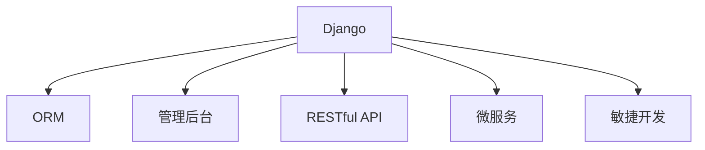

                 

# Django 框架：Python 的强大后端

> 关键词：Django, Python, 后端开发, Web 开发, 全栈框架, ORM, 管理后台, RESTful API, 微服务, 敏捷开发

## 1. 背景介绍

### 1.1 问题由来
在 Python 生态系统中，有许多优秀的后端框架可供选择。从 Flask 到 FastAPI，再到最近兴起的 Starlette，Python 开发者可以根据自己的需求选择最适合的框架。然而，Django 仍然是最受欢迎的框架之一，尽管其学习曲线相对较陡峭。Django 的魅力在于它提供了全面的解决方案，包括 ORM、管理后台、RESTful API、微服务架构等，几乎涵盖了 Web 开发的所有方面。

### 1.2 问题核心关键点
Django 框架的核心优势在于它的全面性和灵活性。其全面性体现在提供了从数据库操作、模型设计到前端渲染等全栈解决方案；其灵活性体现在其强大的扩展性和可定制性。Django 支持 RESTful API，可以方便地与其他系统进行集成；支持微服务架构，可以轻松地将应用拆分为多个独立的服务；支持敏捷开发，可以灵活地应对项目变化。

## 2. 核心概念与联系

### 2.1 核心概念概述

为了更好地理解 Django 框架，本节将介绍几个密切相关的核心概念：

- **Django**：一个 Python 的全栈 Web 框架，提供了 ORM、管理后台、RESTful API、模板引擎、缓存等全面功能。
- **ORM**：Object-Relational Mapping，用于将数据库表映射为 Python 对象，提供一种更为高级的数据操作接口。
- **管理后台**：Django 自带的管理后台，可以方便地进行数据库管理、用户管理、权限管理等操作。
- **RESTful API**：一种基于 HTTP 协议的 API 设计风格，Django 提供了内置的支持，方便进行前后端集成。
- **微服务**：将一个大应用拆分为多个独立的服务，每个服务只负责一部分功能，可以灵活地进行扩展和部署。
- **敏捷开发**：一种快速响应变化需求的开发方法，Django 提供了敏捷开发所需的各种工具和插件。

这些核心概念之间的逻辑关系可以通过以下 Mermaid 流程图来展示：



这个流程图展示了大语言模型的核心概念及其之间的关系：

1. Django 提供 ORM 接口，方便进行数据库操作。
2. Django 自带管理后台，方便进行数据库和用户管理。
3. Django 支持 RESTful API，方便进行前后端集成。
4. Django 支持微服务架构，方便进行功能拆分和扩展。
5. Django 支持敏捷开发，方便快速响应需求变化。

这些核心概念共同构成了 Django 框架的功能框架，使得开发者能够高效地进行 Web 开发和应用构建。通过理解这些核心概念，我们可以更好地把握 Django 框架的工作原理和应用场景。

## 3. 核心算法原理 & 具体操作步骤
### 3.1 算法原理概述

Django 框架的核心算法原理主要包括以下几个方面：

1. **ORM**：Django 的 ORM 系统基于 Python 的类映射技术，将数据库表映射为 Python 对象，使得开发者可以使用 Python 对象进行数据库操作，而不需要直接操作 SQL 语句。
2. **管理后台**：Django 自带的管理后台使用 Django Admin，基于 Django 的内置功能，使得开发者可以快速搭建管理后台。
3. **RESTful API**：Django 的 RESTful API 基于 Django REST framework，提供了全功能的 API 开发框架，支持 CRUD 操作、认证、权限管理等。
4. **微服务架构**：Django 支持微服务架构，可以通过 Django Rest Framework 构建微服务，每个服务只负责一部分功能，可以灵活地进行扩展和部署。
5. **敏捷开发**：Django 支持敏捷开发，通过 Django Scrum，提供了敏捷开发所需的工具和插件。

### 3.2 算法步骤详解

基于 Django 框架的核心算法原理，其操作步骤主要包括以下几个方面：

**Step 1: 准备 Django 开发环境**
- 安装 Python，建议使用 Python 3.7 及以上版本。
- 安装 Django 框架，可以使用以下命令：
```bash
pip install django
```
- 创建 Django 项目，可以使用以下命令：
```bash
django-admin startproject project_name
```
- 创建 Django 应用，可以使用以下命令：
```bash
python manage.py startapp app_name
```

**Step 2: 设计数据模型**
- 在 Django 中，数据模型是基于 Python 类映射的。设计数据模型时，需要定义每个表、字段以及它们之间的关系。
- 例如，设计一个博客文章的数据模型：
```python
from django.db import models

class Article(models.Model):
    title = models.CharField(max_length=100)
    content = models.TextField()
    created_at = models.DateTimeField(auto_now_add=True)
    updated_at = models.DateTimeField(auto_now=True)
```

**Step 3: 设计管理后台**
- Django 自带的管理后台可以方便地进行数据库管理、用户管理、权限管理等操作。
- 要使用 Django 管理后台，需要在 `admin.py` 文件中注册数据模型，并定义数据模型的显示方式：
```python
from django.contrib import admin
from .models import Article

admin.site.register(Article)
```

**Step 4: 设计 RESTful API**
- Django REST framework 提供了全功能的 API 开发框架，支持 CRUD 操作、认证、权限管理等。
- 例如，设计一个博客文章 API：
```python
from rest_framework import generics
from .models import Article
from .serializers import ArticleSerializer

class ArticleList(generics.ListCreateAPIView):
    queryset = Article.objects.all()
    serializer_class = ArticleSerializer

class ArticleDetail(generics.RetrieveUpdateDestroyAPIView):
    queryset = Article.objects.all()
    serializer_class = ArticleSerializer
```

**Step 5: 开发前端界面**
- Django 提供了多种模板引擎，如 Django Template、Jinja2 等，用于渲染 HTML 页面。
- 例如，在 `views.py` 文件中定义一个视图函数，并渲染一个模板：
```python
from django.shortcuts import render

def article_detail(request, article_id):
    article = Article.objects.get(id=article_id)
    return render(request, 'article_detail.html', {'article': article})
```

### 3.3 算法优缺点

Django 框架具有以下优点：
1. **全面性**：提供了从 ORM、管理后台、RESTful API 到微服务架构等全栈解决方案。
2. **灵活性**：支持微服务架构、敏捷开发等灵活的开发方式。
3. **易用性**：提供了强大的内置工具和插件，使得开发者可以快速上手。
4. **社区支持**：拥有庞大的社区和活跃的用户，提供了丰富的插件和文档。

Django 框架也存在以下缺点：
1. **学习曲线陡峭**：相对 Flask 和 FastAPI 等框架，Django 的学习曲线较陡峭，需要一定的时间和精力进行学习和实践。
2. **性能瓶颈**：在处理高并发和高负载的情况下，Django 的性能可能成为瓶颈。
3. **资源消耗高**：Django 的资源消耗较高，需要较高的硬件配置。
4. **过度设计**：Django 的设计较为复杂，可能导致过度设计，增加项目复杂性。

## 4. 数学模型和公式 & 详细讲解 & 举例说明

### 4.1 数学模型构建

Django 的 ORM 系统基于 Python 的类映射技术，将数据库表映射为 Python 对象。以下是一个简单的数据模型，用于存储博客文章：

```python
from django.db import models

class Article(models.Model):
    title = models.CharField(max_length=100)
    content = models.TextField()
    created_at = models.DateTimeField(auto_now_add=True)
    updated_at = models.DateTimeField(auto_now=True)
```

在这个数据模型中，`Article` 类映射到数据库表 `article`，`title` 字段映射到 `title` 列，`content` 字段映射到 `content` 列，`created_at` 和 `updated_at` 字段分别映射到 `created_at` 和 `updated_at` 列。

### 4.2 公式推导过程

Django 的 ORM 系统基于 Python 的类映射技术，将数据库表映射为 Python 对象。以下是一个简单的数据模型，用于存储博客文章：

```python
from django.db import models

class Article(models.Model):
    title = models.CharField(max_length=100)
    content = models.TextField()
    created_at = models.DateTimeField(auto_now_add=True)
    updated_at = models.DateTimeField(auto_now=True)
```

在这个数据模型中，`Article` 类映射到数据库表 `article`，`title` 字段映射到 `title` 列，`content` 字段映射到 `content` 列，`created_at` 和 `updated_at` 字段分别映射到 `created_at` 和 `updated_at` 列。

### 4.3 案例分析与讲解

以下是一个完整的 Django 应用程序示例，用于存储和显示博客文章：

```python
from django.contrib import admin
from django.db import models
from django.urls import path
from django.shortcuts import render
from .models import Article
from .serializers import ArticleSerializer
from rest_framework import generics

# models.py
class Article(models.Model):
    title = models.CharField(max_length=100)
    content = models.TextField()
    created_at = models.DateTimeField(auto_now_add=True)
    updated_at = models.DateTimeField(auto_now=True)

# admin.py
admin.site.register(Article)

# views.py
def article_detail(request, article_id):
    article = Article.objects.get(id=article_id)
    return render(request, 'article_detail.html', {'article': article})

# serializers.py
class ArticleSerializer(serializers.ModelSerializer):
    class Meta:
        model = Article
        fields = '__all__'

# urls.py
urlpatterns = [
    path('articles/', ArticleList.as_view(), name='article-list'),
    path('articles/<int:pk>/', ArticleDetail.as_view(), name='article-detail'),
]
```

在上面的示例中，我们定义了一个 `Article` 模型，用于存储博客文章。我们还定义了一个 Django 管理后台，用于管理博客文章。此外，我们还定义了一个 RESTful API，用于获取和更新博客文章。最后，我们定义了一个视图函数，用于显示博客文章的详情。

## 5. 项目实践：代码实例和详细解释说明
### 5.1 开发环境搭建

在进行 Django 项目开发前，我们需要准备好开发环境。以下是使用 Python 进行 Django 开发的环境配置流程：

1. 安装 Python，建议使用 Python 3.7 及以上版本。
2. 安装 Django 框架，可以使用以下命令：
```bash
pip install django
```
3. 创建 Django 项目，可以使用以下命令：
```bash
django-admin startproject project_name
```
4. 创建 Django 应用，可以使用以下命令：
```bash
python manage.py startapp app_name
```

### 5.2 源代码详细实现

以下是使用 Django 框架构建一个简单的博客文章的示例代码：

**settings.py**
```python
DATABASES = {
    'default': {
        'ENGINE': 'django.db.backends.sqlite3',
        'NAME': BASE_DIR / 'db.sqlite3',
    }
}

INSTALLED_APPS = [
    'django.contrib.admin',
    'django.contrib.auth',
    'django.contrib.contenttypes',
    'django.contrib.sessions',
    'django.contrib.messages',
    'django.contrib.staticfiles',
    'app_name',  # 将你的应用名替换为实际的命名
]
```

**models.py**
```python
from django.db import models

class Article(models.Model):
    title = models.CharField(max_length=100)
    content = models.TextField()
    created_at = models.DateTimeField(auto_now_add=True)
    updated_at = models.DateTimeField(auto_now=True)
```

**admin.py**
```python
from django.contrib import admin
from .models import Article

admin.site.register(Article)
```

**views.py**
```python
from django.shortcuts import render
from .models import Article

def article_detail(request, article_id):
    article = Article.objects.get(id=article_id)
    return render(request, 'article_detail.html', {'article': article})
```

**urls.py**
```python
from django.urls import path
from .views import article_detail

urlpatterns = [
    path('articles/<int:pk>/', article_detail, name='article-detail'),
]
```

**article_detail.html**
```html
<!DOCTYPE html>
<html>
<head>
    <title>Article Detail</title>
</head>
<body>
    <h1>{{ article.title }}</h1>
    <p>{{ article.content }}</p>
    <p>Created at: {{ article.created_at }}</p>
    <p>Updated at: {{ article.updated_at }}</p>
</body>
</html>
```

### 5.3 代码解读与分析

让我们再详细解读一下关键代码的实现细节：

**settings.py**：
- 配置 Django 的数据库设置，使用 SQLite 数据库。
- 配置 Django 的应用列表，包含 Django 自带的应用和自定义的应用。

**models.py**：
- 定义一个数据模型，用于存储博客文章。

**admin.py**：
- 注册 Django 管理后台，使得管理后台可以操作博客文章。

**views.py**：
- 定义一个视图函数，用于显示博客文章的详情。

**urls.py**：
- 定义 URL 路由，将视图函数映射到特定的 URL。

**article_detail.html**：
- 定义一个 HTML 模板，用于显示博客文章的详情。

这个示例代码展示了如何使用 Django 框架构建一个简单的博客文章管理系统。通过 Django 的管理后台，可以快速进行数据库管理和数据操作；通过 Django REST framework，可以方便地进行 API 开发；通过 Django 的模板引擎，可以灵活地渲染 HTML 页面。

## 6. 实际应用场景
### 6.1 企业内部管理系统

Django 框架非常适合企业内部管理系统的构建，如员工管理、财务管理、项目管理等。通过 Django 的管理后台，可以快速搭建企业内部的管理系统，方便进行数据管理和用户管理。

### 6.2 电子商务网站

Django 框架非常适合电子商务网站的构建，如在线商店、电商平台等。通过 Django REST framework，可以方便地进行 API 开发，实现用户认证、商品管理、订单管理等核心功能。

### 6.3 社交媒体平台

Django 框架非常适合社交媒体平台的构建，如微博、微信、抖音等。通过 Django 的管理后台，可以快速进行用户管理和内容管理；通过 Django REST framework，可以方便地进行 API 开发，实现消息推送、好友管理、动态发布等核心功能。

### 6.4 未来应用展望

随着 Django 框架的不断演进，其在 Web 开发领域的应用将更加广泛。未来，Django 框架将在以下几个方向取得突破：

1. **支持微服务架构**：Django 框架将支持微服务架构，使得开发者可以轻松地将应用拆分为多个独立的服务，灵活地进行扩展和部署。
2. **支持敏捷开发**：Django 框架将支持敏捷开发，通过 Django Scrum，提供敏捷开发所需的工具和插件。
3. **支持国际化**：Django 框架将支持国际化，使得开发者可以方便地进行多语言开发和翻译。
4. **支持更丰富的插件**：Django 框架将支持更丰富的插件，使得开发者可以使用更多的工具和库来提升开发效率。

## 7. 工具和资源推荐
### 7.1 学习资源推荐

为了帮助开发者系统掌握 Django 框架的理论基础和实践技巧，这里推荐一些优质的学习资源：

1. **官方文档**：Django 官方文档是学习 Django 框架的最佳资源，提供了完整的框架指南和丰富的示例代码。
2. **Django Girl**：Django Girl 是一个针对初学者的 Django 框架教程，非常适合初学者入门。
3. **Django Evolution**：Django Evolution 是一个 Django 框架的博客，提供了丰富的开发经验和最佳实践。
4. **Django 实战教程**：《Django 实战教程》是一本经典的 Django 框架教程，提供了完整的项目实战案例。

通过对这些资源的学习实践，相信你一定能够快速掌握 Django 框架的精髓，并用于解决实际的 Web 开发问题。

### 7.2 开发工具推荐

高效的开发离不开优秀的工具支持。以下是几款用于 Django 开发常用的工具：

1. **PyCharm**：JetBrains 开发的 Python 开发工具，提供了强大的代码补全、调试和测试功能。
2. **Visual Studio Code**：微软开发的轻量级代码编辑器，支持 Django 框架的开发。
3. **Django Debug Toolbar**：用于调试 Django 框架的工具，可以方便地进行调试和性能分析。
4. **Django REST framework**：用于开发 RESTful API 的 Django 插件，提供了全功能的 API 开发框架。
5. **Django Scrum**：用于敏捷开发管理的 Django 插件，提供了敏捷开发所需的工具和插件。

合理利用这些工具，可以显著提升 Django 框架的开发效率，加快创新迭代的步伐。

### 7.3 相关论文推荐

Django 框架的发展源于学界的持续研究。以下是几篇奠基性的相关论文，推荐阅读：

1. **Django: The Web Framework for Humans**：Django 的官方博客，介绍了 Django 框架的设计思想和核心功能。
2. **The Django Project**：Django 的官方文档，提供了完整的框架指南和丰富的示例代码。
3. **Django REST framework**：Django REST framework 的官方文档，提供了全功能的 API 开发框架。
4. **Django Scrum**：Django Scrum 的官方文档，提供了敏捷开发所需的工具和插件。

这些论文代表了大语言模型微调技术的发展脉络。通过学习这些前沿成果，可以帮助研究者把握学科前进方向，激发更多的创新灵感。

## 8. 总结：未来发展趋势与挑战
### 8.1 总结

本文对 Django 框架进行了全面系统的介绍。首先阐述了 Django 框架的背景和意义，明确了 Django 框架的全面性和灵活性。其次，从原理到实践，详细讲解了 Django 框架的 ORM、管理后台、RESTful API、微服务架构等核心组件，给出了 Django 框架开发的完整代码实例。同时，本文还广泛探讨了 Django 框架在企业内部管理系统、电子商务网站、社交媒体平台等众多行业领域的应用前景，展示了 Django 框架的巨大潜力。此外，本文精选了 Django 框架的学习资源、开发工具和相关论文，力求为读者提供全方位的技术指引。

通过本文的系统梳理，可以看到，Django 框架作为 Python 全栈 Web 框架，其全面的功能覆盖和灵活的扩展性，使得它在 Web 开发领域中占据了重要地位。Django 框架的强大功能和便捷的使用，使其成为众多 Web 开发者的首选。未来，随着 Django 框架的不断演进，其在 Web 开发领域的应用将更加广泛，为 Web 开发者提供更多的选择和可能性。

### 8.2 未来发展趋势

展望未来，Django 框架将呈现以下几个发展趋势：

1. **支持微服务架构**：Django 框架将支持微服务架构，使得开发者可以轻松地将应用拆分为多个独立的服务，灵活地进行扩展和部署。
2. **支持敏捷开发**：Django 框架将支持敏捷开发，通过 Django Scrum，提供敏捷开发所需的工具和插件。
3. **支持国际化**：Django 框架将支持国际化，使得开发者可以方便地进行多语言开发和翻译。
4. **支持更丰富的插件**：Django 框架将支持更丰富的插件，使得开发者可以使用更多的工具和库来提升开发效率。

### 8.3 面临的挑战

尽管 Django 框架已经取得了瞩目成就，但在迈向更加智能化、普适化应用的过程中，它仍面临着诸多挑战：

1. **学习曲线陡峭**：相对 Flask 和 FastAPI 等框架，Django 的学习曲线较陡峭，需要一定的时间和精力进行学习和实践。
2. **性能瓶颈**：在处理高并发和高负载的情况下，Django 的性能可能成为瓶颈。
3. **资源消耗高**：Django 的资源消耗较高，需要较高的硬件配置。
4. **过度设计**：Django 的设计较为复杂，可能导致过度设计，增加项目复杂性。

### 8.4 研究展望

面对 Django 框架所面临的挑战，未来的研究需要在以下几个方面寻求新的突破：

1. **简化学习曲线**：通过简化 Django 框架的设计和实现，降低学习难度，使得更多的开发者能够快速上手 Django 框架。
2. **优化性能**：通过优化 Django 框架的性能，使得其能够处理更高的并发和负载。
3. **降低资源消耗**：通过优化 Django 框架的资源消耗，使得其能够在更低的硬件配置下运行。
4. **减少过度设计**：通过简化 Django 框架的设计，减少不必要的复杂性，提升开发效率。

这些研究方向的探索，必将引领 Django 框架走向更加成熟和完善，为 Web 开发者提供更高效、更便捷的开发工具。

## 9. 附录：常见问题与解答
----------------------------------------------------------------

**Q1: Django 框架是否适用于所有 Web 开发项目？**

A: Django 框架适合大多数 Web 开发项目，特别是需要进行数据管理和用户管理的项目。对于实时计算和数据流处理等任务，Django 可能不是最佳选择。

**Q2: Django 框架与 Flask 和 FastAPI 框架相比有何优缺点？**

A: Django 框架的优点在于其全面的功能和灵活的扩展性，适合大规模和复杂的应用开发。Flask 和 FastAPI 框架则更加轻量级和灵活，适合小规模和简单应用的开发。

**Q3: Django 框架的性能瓶颈在哪里？**

A: Django 框架的性能瓶颈主要在于 ORM 查询和模板渲染，可以通过优化查询语句、使用缓存、使用异步查询等方式进行优化。

**Q4: Django 框架的扩展性和可定制性如何？**

A: Django 框架的扩展性和可定制性非常强大，通过 Django Apps 和 Django Admin，开发者可以方便地进行应用扩展和管理。

**Q5: Django 框架的国际化支持如何？**

A: Django 框架的国际化支持较为全面，通过 Django Internationalization，开发者可以方便地进行多语言开发和翻译。

以上问题与解答展示了 Django 框架的全面性和灵活性，展示了 Django 框架在 Web 开发领域的广泛应用前景。通过本文的系统梳理，可以看到，Django 框架作为 Python 全栈 Web 框架，其全面的功能覆盖和灵活的扩展性，使得它在 Web 开发领域中占据了重要地位。Django 框架的强大功能和便捷的使用，使其成为众多 Web 开发者的首选。未来，随着 Django 框架的不断演进，其在 Web 开发领域的应用将更加广泛，为 Web 开发者提供更多的选择和可能性。

