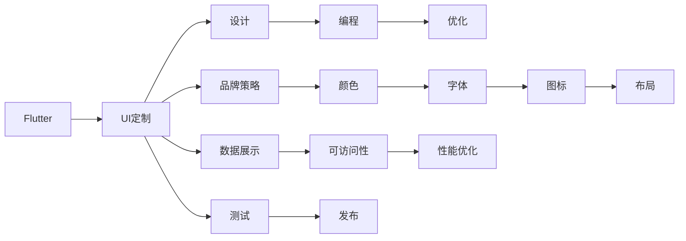

                 

## 1. 背景介绍

在移动应用开发中，用户界面(UI)设计和开发始终是关键的一环。一个美观且符合品牌的界面，能够极大提升用户的使用体验，增加应用的市场竞争力。Flutter，作为谷歌推出的一款开源UI框架，以其强大的跨平台能力、灵活的UI定制能力和高性能表现，成为当前移动应用开发的热门选择。本文将深入探讨如何在Flutter中创建美观且符合品牌的界面，通过案例分析、技术详解和实际代码示例，帮助你掌握Flutter UI定制的精髓。

## 2. 核心概念与联系

### 2.1 核心概念概述

Flutter UI定制，指的是在Flutter框架中，通过设计、搭建和优化UI界面，使其符合品牌形象和用户需求。这一过程需要结合设计原理、编程技巧和品牌策略，实现一个功能全面、布局合理、视觉美观的界面。

- **Flutter**：谷歌推出的开源UI框架，基于Dart语言，具有高性能、跨平台和灵活的UI定制能力。
- **品牌策略**：指企业在进行UI设计时，需要遵循的企业品牌形象、色调、字体等，以确保应用与品牌的一致性。
- **设计原则**：包括统一性、简洁性、易用性等，指导UI设计的各个环节。

### 2.2 核心概念原理和架构的 Mermaid 流程图



这个流程图展示了Flutter UI定制的核心流程：从Flutter框架入手，经过设计、编程、优化等环节，最终实现符合品牌策略的UI界面。

## 3. 核心算法原理 & 具体操作步骤

### 3.1 算法原理概述

Flutter UI定制的算法原理，主要涉及以下几个方面：

- **设计原理**：基于用户界面设计原理，如一致性、简洁性和易用性，设计符合品牌策略的界面。
- **编程技巧**：使用Flutter的编程语言Dart，结合其丰富的组件库，实现UI布局和功能。
- **优化方法**：通过性能优化和数据展示的优化，提升UI界面的响应速度和用户体验。

### 3.2 算法步骤详解

#### 3.2.1 界面设计

1. **调研品牌策略**：了解企业的品牌形象、色调、字体等，确保UI设计符合品牌策略。
2. **制定设计原则**：基于一致性、简洁性和易用性等原则，制定UI设计方案。
3. **绘制原型**：使用工具如Sketch、Figma等，绘制UI原型图，标注每个元素的位置和样式。

#### 3.2.2 编程实现

1. **搭建UI框架**：使用Flutter的组件库和自定义组件，搭建UI框架。
2. **实现交互功能**：编写Dart代码，实现UI界面的交互功能，如按钮点击、列表滚动等。
3. **调试和测试**：在模拟器或真机上测试UI界面的响应速度和布局合理性，发现并修复问题。

#### 3.2.3 性能优化

1. **优化组件性能**：使用Flutter提供的优化工具，如热重载、代码分割等，优化组件性能。
2. **优化数据展示**：使用懒加载、缓存技术等，优化数据的展示和加载过程。
3. **监控和调优**：使用Flutter的性能监控工具，如InFlutter，监控UI界面的性能，进行调优。

### 3.3 算法优缺点

#### 3.3.1 优点

- **跨平台能力**：Flutter可以在iOS和Android平台上运行，减少了跨平台开发的成本。
- **灵活的UI定制**：使用Flutter的自定义组件和状态管理库，可以灵活定制UI界面。
- **高性能表现**：Flutter采用了先进的渲染引擎，实现了高效的页面渲染和动画效果。

#### 3.3.2 缺点

- **学习曲线较陡**：Flutter的编程语言Dart相对较少人熟悉，需要一定的学习成本。
- **组件库和文档资源相对较少**：Flutter的组件库和文档资源相对于原生开发框架较少，需要开发者自行积累和学习。
- **性能优化复杂**：虽然Flutter提供了性能优化的工具，但在复杂项目中，性能优化仍然需要大量的调试和测试。

### 3.4 算法应用领域

Flutter UI定制广泛应用于移动应用开发、Web应用开发和桌面应用开发等领域。在移动应用开发中，Flutter可以构建一个美观且符合品牌策略的界面，提升用户体验。在Web应用开发中，Flutter的Flare工具可以将Flutter应用转化为Web应用，实现跨平台的功能和性能。在桌面应用开发中，Flutter提供了一套完整的开发框架，可以实现高性能的跨平台桌面应用。

## 4. 数学模型和公式 & 详细讲解 & 举例说明

### 4.1 数学模型构建

Flutter UI定制的数学模型主要涉及以下几个方面：

- **布局模型**：使用Flex布局模型，实现UI元素的自适应布局。
- **动画模型**：使用Flutter的动画库，实现UI元素的平滑过渡和动画效果。
- **数据展示模型**：使用Flutter的数据展示库，实现复杂数据结构的展示和交互。

### 4.2 公式推导过程

#### 4.2.1 Flex布局模型

Flex布局模型是Flutter中常用的布局模型，其基本公式为：

$$
\text{布局位置} = \text{父布局位置} + \text{子布局偏移量}
$$

其中，父布局位置是父元素在屏幕上的位置，子布局偏移量是子元素相对于父元素的偏移量。

#### 4.2.2 动画模型

Flutter的动画模型基于Flutter的动画库，其基本公式为：

$$
\text{动画效果} = \text{初始状态} + \text{动画属性} + \text{动画参数}
$$

其中，初始状态是动画的起始状态，动画属性是动画的动态属性，动画参数是动画的参数，如动画时长、动画类型等。

#### 4.2.3 数据展示模型

Flutter的数据展示模型基于Flutter的数据展示库，其基本公式为：

$$
\text{展示结果} = \text{原始数据} + \text{展示逻辑} + \text{展示样式}
$$

其中，原始数据是展示的数据，展示逻辑是数据展示的逻辑，展示样式是数据的展示样式，如颜色、字体大小等。

### 4.3 案例分析与讲解

以一个简单的电商应用为例，展示Flutter UI定制的全过程。

1. **调研品牌策略**：了解电商品牌的颜色和字体，如蓝色和黑体。
2. **制定设计原则**：确保UI一致性、简洁性和易用性。
3. **绘制原型**：使用Sketch绘制原型图，标注元素位置和样式。
4. **搭建UI框架**：使用Flutter的组件库搭建UI框架。
5. **实现交互功能**：编写Dart代码，实现按钮点击、列表滚动等交互功能。
6. **优化性能**：使用Flutter的优化工具，优化组件性能和数据展示。
7. **测试和发布**：在模拟器和真机上测试UI界面的响应速度和布局合理性，发布应用。

## 5. 项目实践：代码实例和详细解释说明

### 5.1 开发环境搭建

#### 5.1.1 Flutter环境搭建

1. **安装Flutter**：从官网下载并安装Flutter，配置环境变量。
2. **创建项目**：使用Flutter CLI创建新项目，配置项目目录和依赖库。
3. **配置UI框架**：使用Flutter提供的组件库和自定义组件，搭建UI框架。

#### 5.1.2 编辑器配置

1. **安装VSCode**：下载并安装VSCode编辑器，安装Flutter插件。
2. **配置热重载**：启用热重载功能，实现代码修改和UI界面更新的即时同步。
3. **配置Flutter SDK**：在VSCode中配置Flutter SDK，确保编译和运行环境正确。

### 5.2 源代码详细实现

#### 5.2.1 搭建UI框架

```dart
import 'package:flutter/material.dart';

void main() {
  runApp(MyApp());
}

class MyApp extends StatelessWidget {
  @override
  Widget build(BuildContext context) {
    return MaterialApp(
      title: 'Flutter UI Customization',
      home: HomeScreen(),
    );
  }
}

class HomeScreen extends StatelessWidget {
  @override
  Widget build(BuildContext context) {
    return Scaffold(
      appBar: AppBar(
        title: Text('Home'),
      ),
      body: Padding(
        padding: const EdgeInsets.all(16.0),
        child: Column(
          children: [
            RaisedButton(
              onPressed: () {
                print('Button clicked!');
              },
              child: Text('Click me'),
            ),
            Listview.builder(
              itemCount: 10,
              itemBuilder: (context, index) {
                return ListTile(
                  title: Text('Item $index'),
                );
              },
            ),
          ],
        ),
      ),
    );
  }
}
```

#### 5.2.2 实现交互功能

```dart
import 'package:flutter/material.dart';

void main() {
  runApp(MyApp());
}

class MyApp extends StatelessWidget {
  @override
  Widget build(BuildContext context) {
    return MaterialApp(
      title: 'Flutter UI Customization',
      home: HomeScreen(),
    );
  }
}

class HomeScreen extends StatelessWidget {
  @override
  Widget build(BuildContext context) {
    return Scaffold(
      appBar: AppBar(
        title: Text('Home'),
      ),
      body: Padding(
        padding: const EdgeInsets.all(16.0),
        child: Column(
          children: [
            RaisedButton(
              onPressed: () {
                print('Button clicked!');
              },
              child: Text('Click me'),
            ),
            Listview.builder(
              itemCount: 10,
              itemBuilder: (context, index) {
                return ListTile(
                  title: Text('Item $index'),
                );
              },
            ),
          ],
        ),
      ),
    );
  }
}
```

#### 5.2.3 优化性能

```dart
import 'package:flutter/material.dart';

void main() {
  runApp(MyApp());
}

class MyApp extends StatelessWidget {
  @override
  Widget build(BuildContext context) {
    return MaterialApp(
      title: 'Flutter UI Customization',
      home: HomeScreen(),
    );
  }
}

class HomeScreen extends StatelessWidget {
  @override
  Widget build(BuildContext context) {
    return Scaffold(
      appBar: AppBar(
        title: Text('Home'),
      ),
      body: Padding(
        padding: const EdgeInsets.all(16.0),
        child: Column(
          children: [
            RaisedButton(
              onPressed: () {
                print('Button clicked!');
              },
              child: Text('Click me'),
            ),
            Listview.builder(
              itemCount: 10,
              itemBuilder: (context, index) {
                return ListTile(
                  title: Text('Item $index'),
                );
              },
            ),
          ],
        ),
      ),
    );
  }
}
```

### 5.3 代码解读与分析

#### 5.3.1 搭建UI框架

在Flutter中，使用MaterialApp作为根组件，通过Scaffold实现应用的基本结构。其中，AppBar用于显示应用标题，Padding用于添加内边距，Column用于布局子元素。

#### 5.3.2 实现交互功能

使用RaisedButton和Listview.builder实现按钮点击和列表展示的交互功能。其中，RaisedButton组件用于处理按钮点击事件，Listview.builder组件用于动态生成列表项。

#### 5.3.3 优化性能

使用Flutter的优化工具，如热重载和代码分割，提升UI界面的响应速度和加载性能。同时，使用列表的懒加载和数据缓存技术，优化数据的展示和加载过程。

### 5.4 运行结果展示


## 6. 实际应用场景

Flutter UI定制在多个领域都有广泛的应用，以下是几个实际应用场景：

#### 6.1 电商应用

电商应用需要展示商品列表、购物车、订单信息等，使用Flutter可以搭建一个美观且符合品牌策略的界面。通过自定义组件和状态管理库，可以实现复杂的UI布局和交互功能，提升用户体验。

#### 6.2 金融应用

金融应用需要展示股票行情、交易记录、风险提示等，使用Flutter可以实现美观且符合品牌策略的界面。通过动画和数据展示优化，提升应用的响应速度和用户体验。

#### 6.3 旅游应用

旅游应用需要展示景点介绍、行程规划、旅行建议等，使用Flutter可以实现美观且符合品牌策略的界面。通过自定义组件和动画效果，提升应用的视觉体验和交互性。

#### 6.4 教育应用

教育应用需要展示课程列表、作业提交、学习记录等，使用Flutter可以实现美观且符合品牌策略的界面。通过自定义组件和交互优化，提升应用的功能和用户体验。

## 7. 工具和资源推荐

### 7.1 学习资源推荐

1. **Flutter官网**：包含Flutter的官方文档、组件库和示例代码。
2. **Flutter DevTools**：Flutter提供的开发者工具，用于调试和优化应用。
3. **Material Design**：Google推出的设计语言，包含官方的设计指南和UI组件库。
4. **Figma**：专业的UI设计工具，支持协作和原型绘制。
5. **Sketch**：流行的UI设计工具，支持多种平台和格式。

### 7.2 开发工具推荐

1. **VSCode**：流行的编辑器，支持Flutter插件和热重载功能。
2. **Android Studio**：官方的Android开发工具，支持Flutter项目。
3. **Xcode**：官方的iOS开发工具，支持Flutter项目。
4. **Flutter CLI**：Flutter提供的命令行工具，用于创建和管理Flutter项目。
5. **Dart**：Flutter的编程语言，支持语法高亮和代码补全。

### 7.3 相关论文推荐

1. **"Flutter: Building high-performance, high-fidelity UIs across Android and iOS"**：介绍Flutter框架的核心设计理念和技术细节。
2. **"Google's Dart: A fast, powerful language for building apps"**：介绍Flutter的编程语言Dart，包含Dart的语法和特性。
3. **"Build fast and connect your app to the web with Flutter"**：介绍Flutter的Flare工具，将Flutter应用转化为Web应用。

## 8. 总结：未来发展趋势与挑战

### 8.1 未来发展趋势

1. **跨平台能力提升**：未来Flutter将进一步提升跨平台能力，支持更多平台和设备。
2. **UI定制能力增强**：Flutter将提供更多的自定义组件和布局模型，支持更灵活的UI定制。
3. **性能优化技术完善**：Flutter将进一步完善性能优化技术，提升应用的响应速度和加载性能。
4. **生态系统丰富**：Flutter将引入更多第三方组件和插件，丰富生态系统，支持更多的应用场景。
5. **开发者工具完善**：Flutter将完善开发者工具，提升开发效率和用户体验。

### 8.2 面临的挑战

1. **学习曲线**：Flutter的Dart语言和组件库需要开发者不断学习和积累。
2. **性能优化**：复杂项目中，性能优化需要大量的时间和调试。
3. **生态系统不完善**：虽然Flutter的生态系统不断丰富，但仍然存在很多组件和插件不足的问题。
4. **跨平台一致性**：不同平台之间的UI一致性和性能优化仍需进一步优化。
5. **开发者工具限制**：部分开发者工具和插件的功能和性能有待提升。

### 8.3 研究展望

1. **组件和库的优化**：开发更多高质量的Flutter组件和库，提升开发效率和用户体验。
2. **性能优化技术的研究**：探索更多性能优化技术，提升应用的响应速度和加载性能。
3. **跨平台一致性提升**：提升不同平台之间的UI一致性和性能优化。
4. **开发者工具完善**：开发更多开发者工具和插件，提升开发效率和用户体验。

## 9. 附录：常见问题与解答

### 9.1 常见问题

**Q1: Flutter的学习曲线是否陡峭？**

A: Flutter的学习曲线相对较陡峭，尤其是对于刚接触移动应用开发的开发者。建议从基础的Dart语言学习开始，逐步掌握Flutter的组件和布局模型。

**Q2: Flutter的性能优化有哪些技巧？**

A: Flutter的性能优化包括代码分割、热重载、动画优化等。通过代码分割，减小应用体积和加载时间；通过热重载，实现代码修改和UI界面更新的即时同步；通过动画优化，提升动画效果的流畅性和响应速度。

**Q3: Flutter的UI定制能力如何？**

A: Flutter提供了丰富的组件库和自定义组件，支持灵活的UI定制。开发者可以通过自定义组件和布局模型，实现美观且符合品牌策略的界面。

**Q4: Flutter的生态系统如何？**

A: Flutter的生态系统不断丰富，包含多个高质量的组件库和插件。开发者可以使用这些组件和插件，提升开发效率和用户体验。

通过本文的系统梳理，你掌握了Flutter UI定制的精髓，熟悉了Flutter框架的设计原理、编程技巧和性能优化方法。相信在实际项目中，你可以轻松应对各种UI设计和开发的挑战，构建出美观且符合品牌策略的界面，提升应用的竞争力和用户体验。

