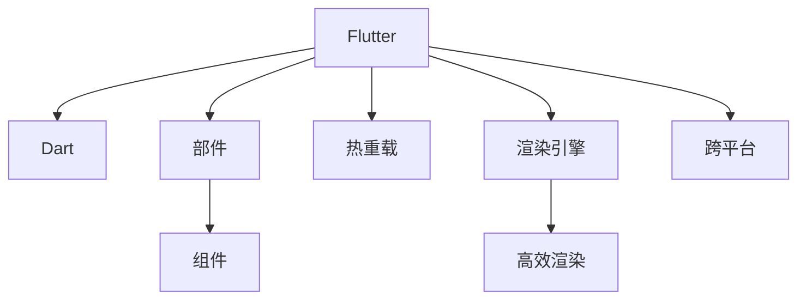

                 

# Flutter 框架：谷歌的 UI 工具包

> 关键词：Flutter, UI, 跨平台, 移动开发, 热重载, 性能优化, 本地化

## 1. 背景介绍

### 1.1 问题由来
在移动应用程序开发领域，开发效率和应用性能一直是两大挑战。传统的移动开发方式——分别针对iOS和Android进行开发——不仅耗时耗力，且需维护两份代码库，增加了开发和维护成本。为了应对这些挑战，谷歌于2015年发布了Flutter，这是一个全新的UI开发框架，专门为跨平台移动应用而设计。

### 1.2 问题核心关键点
Flutter框架的核心优势在于其强大的跨平台能力，使用一套代码库即可构建适用于iOS和Android的应用程序。同时，Flutter通过自己的渲染引擎Dart Vitruvius，提供了一套高性能的UI构建工具和组件库，大大简化了开发过程，提升了开发效率和应用性能。

此外，Flutter还提供了一套热重载机制，开发者可以在不重新编译的情况下，即时查看UI组件的更改效果，极大提升了开发效率。通过Flutter，开发者可以轻松构建高性能、响应迅速的跨平台移动应用，满足企业级应用的需求。

## 2. 核心概念与联系

### 2.1 核心概念概述

为了更好地理解Flutter框架的工作原理和应用方式，本节将介绍几个密切相关的核心概念：

- **Flutter**：由谷歌开发的一个用于构建高性能、快速响应且具有跨平台能力的移动应用的UI开发框架。Flutter的核心组件Dart Vitruvius负责渲染UI，提供一套高性能的渲染引擎，实现流畅的用户体验。
- **Dart**：谷歌开发的一种面向对象的编程语言，用于开发Flutter应用。Dart具有强类型、跨平台编译等特点，使得开发者可以轻松构建高效的移动应用。
- **热重载**：Flutter提供的一种开发工具，允许开发者在不重新编译的情况下，即时查看UI组件的更改效果，极大提升了开发效率。
- **部件(Widget)**：Flutter框架中用于构建UI的基本单位，类似于iOS和Android中的视图(View)。部件可以通过组合和继承构建复杂的用户界面。
- **组件**：Flutter提供的预制部件和构建块，方便开发者快速构建UI，如按钮、文本输入框等。

这些核心概念之间的逻辑关系可以通过以下Mermaid流程图来展示：



这个流程图展示了几何核心概念及其之间的关系：

1. Flutter通过Dart编程语言实现UI构建，调用渲染引擎进行高效渲染。
2. Flutter提供部件和组件构建复杂UI。
3. Flutter支持热重载，加速开发迭代过程。
4. Flutter框架本身具有跨平台能力，简化多平台开发。

## 3. 核心算法原理 & 具体操作步骤
### 3.1 算法原理概述

Flutter框架的核心算法原理主要围绕以下几个关键点展开：

- **跨平台渲染**：Flutter使用Dart Vitruvius引擎，将Dart代码编译成GPU加速的OpenGL代码，从而实现跨平台高性能渲染。
- **部件组合**：Flutter使用部件组合机制，将复杂的UI分解为简单的部件，通过组合和继承构建复杂界面。
- **热重载机制**：Flutter提供热重载机制，允许开发者在不重新编译的情况下，即时查看UI组件的更改效果。
- **内存管理**：Flutter通过对象池技术，减少频繁的内存分配和释放，提升应用性能。

### 3.2 算法步骤详解

Flutter框架的开发流程大致可以分为以下几个步骤：

1. **环境配置**：安装Flutter SDK，配置开发环境，安装所需的依赖库。
2. **创建项目**：使用`flutter create`命令创建一个新的Flutter项目。
3. **编写代码**：使用Dart语言编写Flutter应用程序的代码，构建UI界面。
4. **编译运行**：使用`flutter run`命令编译并运行应用程序。
5. **测试优化**：使用热重载机制快速迭代，优化代码性能，测试应用程序的稳定性。
6. **打包发布**：使用Flutter提供的工具将应用程序打包为iOS或Android应用，并发布到应用商店。

以下是一个简单的Flutter开发流程示例：

```dart
import 'package:flutter/material.dart';

void main() {
  runApp(MyApp());
}

class MyApp extends StatelessWidget {
  @override
  Widget build(BuildContext context) {
    return MaterialApp(
      title: 'Flutter Demo',
      home: Scaffold(
        appBar: AppBar(
          title: Text('Flutter Demo'),
        ),
        body: Center(
          child: Text('Hello World'),
        ),
      ),
    );
  }
}
```

### 3.3 算法优缺点

Flutter框架的优点在于其强大的跨平台能力、高效渲染引擎、热重载机制和部件组合机制。通过这些特性，Flutter极大地简化了移动应用的开发过程，提升了开发效率和应用性能。

Flutter框架的缺点主要包括：

1. **学习曲线较陡**：由于Flutter使用Dart语言，需要开发者对Dart有一定了解。对于不熟悉Dart的开发者来说，学习曲线可能较陡。
2. **内存管理复杂**：尽管Flutter提供了对象池技术，但开发者仍需注意内存管理，避免内存泄漏。
3. **依赖库管理**：Flutter依赖库较多，管理和维护库版本可能较为繁琐。

尽管存在这些缺点，但整体而言，Flutter框架仍然是一个高效、便捷的UI开发工具包，值得开发者深入学习和使用。

### 3.4 算法应用领域

Flutter框架适用于各种移动应用开发场景，包括但不限于：

- **企业级应用**：企业可以基于Flutter快速构建内网应用，提升内部协作效率。
- **电商应用**：电商应用可以通过Flutter实现高性能、流畅的用户体验，提升购物体验。
- **游戏应用**：游戏开发者可以使用Flutter构建高性能、跨平台的移动游戏。
- **社交应用**：社交应用可以通过Flutter实现即时通讯、视频通话等功能。
- **智能设备应用**：智能设备如物联网设备，可以通过Flutter实现跨平台的应用开发。

此外，Flutter框架还适用于各种混合应用、跨平台移动应用开发场景，极大提升了应用开发效率和质量。

## 4. 数学模型和公式 & 详细讲解 & 举例说明

### 4.1 数学模型构建

Flutter框架的核心数学模型主要围绕以下几个关键点展开：

- **图形渲染模型**：Flutter使用Dart Vitruvius引擎将Dart代码编译成OpenGL代码，实现图形渲染。
- **UI组件渲染**：Flutter使用部件组合机制，将复杂的UI分解为简单的部件，通过组合和继承构建复杂界面。
- **内存管理模型**：Flutter使用对象池技术，减少频繁的内存分配和释放，提升应用性能。

### 4.2 公式推导过程

由于Flutter框架的核心算法原理主要依赖于图形渲染和UI组件渲染，其数学模型推导过程相对简单，主要围绕以下几个关键点展开：

1. **图形渲染公式**：

   ```python
   rendering_equation = f(position, color, texture)
   ```

   其中，`position`表示物体在3D空间中的位置，`color`表示物体的颜色，`texture`表示物体的纹理。

2. **UI组件渲染公式**：

   ```python
   ui_component = widget + child + siblings + styles
   ```

   其中，`widget`表示部件本身，`child`表示子部件，`siblings`表示同级部件，`styles`表示样式。

3. **内存管理公式**：

   ```python
   memory_management = memory_pool + cache + garbage_collection
   ```

   其中，`memory_pool`表示对象池技术，`cache`表示缓存技术，`garbage_collection`表示垃圾回收机制。

### 4.3 案例分析与讲解

下面以一个简单的Flutter部件`Button`为例，展示其渲染和组件组合的过程。

```dart
Button(
  onPressed: () {
    print('Button clicked');
  },
  child: Text('Press me'),
)
```

在这个部件中，`onPressed`表示按钮被点击时的回调函数，`child`表示按钮内部的文本。通过组合机制，Flutter将按钮和文本组合为一个部件，并通过`paint`方法进行渲染。

## 5. 项目实践：代码实例和详细解释说明
### 5.1 开发环境搭建

在开始Flutter项目之前，需要先安装Flutter SDK，配置开发环境，并创建项目。以下是详细的安装步骤：

1. **安装Flutter SDK**：
   ```bash
   # 在Linux或macOS上
   sudo curl -sSf https://flutter.dev/releases/stable | sh
   # 在Windows上
   flutter --version
   ```

2. **配置Flutter SDK**：
   ```bash
   flutter doctor
   ```

3. **创建Flutter项目**：
   ```bash
   flutter create my_flutter_app
   cd my_flutter_app
   ```

### 5.2 源代码详细实现

以下是Flutter项目的基本结构，展示一个简单的应用页面：

```dart
import 'package:flutter/material.dart';

void main() {
  runApp(MyApp());
}

class MyApp extends StatelessWidget {
  @override
  Widget build(BuildContext context) {
    return MaterialApp(
      title: 'Flutter Demo',
      home: Scaffold(
        appBar: AppBar(
          title: Text('Flutter Demo'),
        ),
        body: Center(
          child: Text('Hello World'),
        ),
      ),
    );
  }
}
```

### 5.3 代码解读与分析

在这个示例中，我们使用了Flutter提供的`MaterialApp`、`Scaffold`和`AppBar`等部件，构建了一个简单的应用页面。通过组合和继承，我们可以构建复杂的用户界面。

Flutter部件的渲染过程是通过`paint`方法完成的。具体来说，`paint`方法会接收`Canvas`对象作为参数，将UI组件绘制在屏幕上。

## 6. 实际应用场景
### 6.1 智能设备应用

Flutter框架的跨平台能力，使其在智能设备应用开发中具有广泛应用。例如，物联网设备可以通过Flutter构建跨平台的应用程序，实现统一的界面和功能。通过Flutter，开发者可以轻松地为智能设备添加新的功能，提升用户体验。

### 6.2 企业级应用

企业可以基于Flutter构建内网应用，提升内部协作效率。例如，企业内部文档管理系统、项目管理工具等，都可以使用Flutter构建，实现跨平台的应用体验。

### 6.3 电商应用

电商应用可以通过Flutter实现高性能、流畅的用户体验。例如，电商平台可以使用Flutter构建移动应用，提升用户的购物体验，同时提升应用的性能。

### 6.4 未来应用展望

未来，随着Flutter框架的不断演进，其应用领域将进一步扩大，涵盖更多行业和场景。例如，医疗应用、教育应用、金融应用等，都可以使用Flutter构建，实现跨平台的应用开发。此外，随着5G技术的普及，Flutter在智能设备应用开发中的应用也将更加广泛。

## 7. 工具和资源推荐
### 7.1 学习资源推荐

为了帮助开发者系统掌握Flutter框架，以下推荐一些优质的学习资源：

1. **Flutter官方文档**：Flutter官方提供的全面详细的文档，涵盖Flutter框架的各个方面。
2. **Flutter中文网**：提供Flutter框架的中文教程和文档，适合中文开发者使用。
3. **Dart语言官方文档**：Dart语言官方提供的详细文档，帮助开发者深入了解Dart语言。
4. **Flutter视频教程**：YouTube和Bilibili等平台上有大量Flutter视频教程，适合视频学习者使用。

### 7.2 开发工具推荐

以下是一些常用的Flutter开发工具：

1. **Android Studio**：Flutter官方推荐的开发工具，提供Flutter插件，支持Android应用开发。
2. **Xcode**：Flutter官方推荐的开发工具，提供Flutter插件，支持iOS应用开发。
3. **Visual Studio Code**：支持Flutter插件的轻量级开发工具，适合开发者使用。
4. **Android Emulator**：Flutter官方推荐的模拟器，支持Android应用开发。

### 7.3 相关论文推荐

以下是几篇Flutter相关的论文，推荐阅读：

1. **Flutter: A Scalable Framework for Building Cross-Platform Mobile Applications**：Flutter官方发表的论文，介绍了Flutter框架的架构和设计思想。
2. **A Survey on Cross-Platform Mobile Application Development Frameworks**：一篇综述论文，介绍了多种跨平台移动应用开发框架，包括Flutter。
3. **Design and Implementation of Flutter**：Flutter官方发表的论文，详细介绍了Flutter框架的设计和实现。

## 8. 总结：未来发展趋势与挑战
### 8.1 研究成果总结

Flutter框架自发布以来，已经广泛应用于各种跨平台移动应用开发场景。其跨平台能力、高性能渲染引擎、热重载机制和部件组合机制，使其成为开发高效、性能优异的移动应用的重要工具。

### 8.2 未来发展趋势

Flutter框架的未来发展趋势主要围绕以下几个方向展开：

1. **性能优化**：Flutter将继续优化渲染引擎，提升应用性能，实现更高的响应速度。
2. **新特性引入**：Flutter将引入更多新特性，提升开发体验，如更强大的热重载机制、更灵活的UI组件等。
3. **生态系统建设**：Flutter将进一步完善生态系统，增加更多第三方库和插件，支持更多应用场景。
4. **社区建设**：Flutter将加强社区建设，吸引更多开发者参与，推动Flutter技术的发展和应用。

### 8.3 面临的挑战

Flutter框架在发展过程中也面临一些挑战：

1. **性能瓶颈**：尽管Flutter已经优化了渲染引擎，但在某些复杂场景下，仍可能出现性能瓶颈。
2. **开发者学习成本**：由于Flutter使用Dart语言，开发者需要一定时间学习和适应。
3. **生态系统不完善**：虽然Flutter生态系统在不断发展，但仍需更多第三方库和插件的支持。

### 8.4 研究展望

Flutter框架的未来发展方向需要不断优化和创新，提升开发效率和应用性能。未来Flutter将通过以下方式推动技术发展：

1. **优化渲染引擎**：进一步提升Flutter的渲染引擎性能，实现更高的响应速度。
2. **引入新特性**：引入更多新特性，如更灵活的UI组件、更强大的热重载机制等，提升开发体验。
3. **完善生态系统**：增加更多第三方库和插件，支持更多应用场景，提升开发者生产效率。
4. **加强社区建设**：吸引更多开发者参与，推动Flutter技术的发展和应用。

通过这些措施，Flutter框架将不断提升其性能和易用性，成为更多开发者和企业的首选移动开发框架。

## 9. 附录：常见问题与解答

**Q1：Flutter框架的性能如何？**

A: Flutter框架使用Dart Vitruvius引擎进行渲染，能够实现高性能的跨平台渲染。相比传统的移动开发方式，Flutter在性能方面具有显著优势，能够提供流畅的用户体验。

**Q2：Flutter框架的开发效率如何？**

A: Flutter框架提供了热重载机制，开发者可以在不重新编译的情况下，即时查看UI组件的更改效果，极大提升了开发效率。同时，Flutter提供了部件组合机制和丰富的UI组件，帮助开发者快速构建复杂的用户界面。

**Q3：Flutter框架的学习曲线如何？**

A: Flutter框架使用Dart语言进行开发，对于不熟悉Dart语言的开发者来说，学习曲线可能较陡。但是，随着Flutter社区的不断壮大，越来越多的学习资源和社区支持，使得Flutter框架的学习变得更加容易。

**Q4：Flutter框架的生态系统如何？**

A: Flutter框架已经吸引了众多开发者和企业参与，形成了完善的生态系统。Flutter官方提供了丰富的UI组件和第三方库，帮助开发者快速构建复杂的用户界面。

**Q5：Flutter框架的跨平台能力如何？**

A: Flutter框架的跨平台能力非常强大，使用一套代码库即可构建适用于iOS和Android的应用程序。Flutter的跨平台能力，使得开发者可以大幅提升开发效率，降低开发成本。

作者：禅与计算机程序设计艺术 / Zen and the Art of Computer Programming

