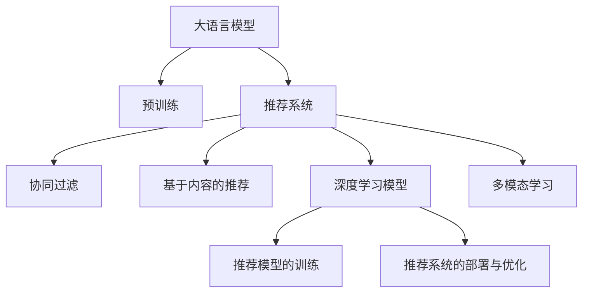

                 

# GENRE: 灵活、可配置的LLM推荐框架

> 关键词：LLM推荐,推荐系统,自然语言处理,NLP,机器学习,算法,深度学习,TensorFlow,PyTorch

## 1. 背景介绍

### 1.1 问题由来

推荐系统作为个性化推荐的核心技术，已经在电商、视频、音乐、新闻等领域得到了广泛应用。随着深度学习和大数据技术的发展，推荐系统从简单的协同过滤、基于内容的推荐演进到基于深度学习模型的推荐，能够更好地理解和建模用户行为，提升推荐效果。然而，传统的基于深度学习的推荐系统主要聚焦于用户-物品交互序列，往往忽视了用户意图的多样性和多模态性，导致推荐结果单一，无法满足用户的个性化需求。

近年来，随着语言模型的发展，以大语言模型（Large Language Model, LLM）为代表的自然语言处理（Natural Language Processing, NLP）技术在推荐系统中逐渐受到关注。LLM在处理自然语言文本时，不仅能够理解文本语义，还可以挖掘其中的情感、意图、上下文信息，从而提供更加多样化和精准的推荐。

### 1.2 问题核心关键点

本文聚焦于基于大语言模型的推荐系统，通过构建一个灵活、可配置的LLM推荐框架，实现从文本语义到用户意图的多维度建模，从而提供个性化推荐服务。主要问题包括：

1. **LLM在推荐系统中的应用**：如何利用预训练语言模型挖掘用户语义和意图，提升推荐效果。
2. **推荐系统的模型结构设计**：设计灵活、可配置的模型结构，适应多种推荐任务。
3. **推荐模型的训练与优化**：选择合适的训练方法，提升模型的泛化能力和性能。
4. **推荐系统的部署与优化**：如何将优化后的模型高效部署到实际应用中，提升推荐系统性能。

## 2. 核心概念与联系

### 2.1 核心概念概述

为更好地理解基于LLM的推荐系统，本节将介绍几个密切相关的核心概念：

- **大语言模型(LLM)**：以Transformer为基础的深度学习模型，能够理解并生成自然语言文本，具备丰富的语言知识和常识。
- **推荐系统(Recommendation System, RS)**：根据用户的历史行为、兴趣等信息，为用户推荐物品的系统，旨在提高用户满意度。
- **多模态学习(Multimodal Learning)**：结合多种数据源（如文本、图像、音频等）进行建模，提升推荐系统的表现力。
- **协同过滤(Collaborative Filtering)**：基于用户和物品的协同信息进行推荐，适用于数据稀疏场景。
- **基于内容的推荐(Content-based Recommendation)**：基于物品属性进行推荐，适用于静态物品场景。
- **深度学习模型(Deep Learning Model)**：利用多层神经网络进行建模，能够捕捉复杂模式和关系。
- **推荐模型的训练**：选择合适的训练数据和优化算法，提升模型效果。
- **推荐系统的部署与优化**：将模型高效部署到实际应用中，并进行优化，提升推荐效率。

这些概念之间的逻辑关系可以通过以下Mermaid流程图来展示：



这个流程图展示了大语言模型在推荐系统中的应用，及其与推荐系统的不同组成部分之间的关系：

1. 大语言模型通过预训练获得基础能力。
2. 推荐系统基于用户的个性化需求，为每个用户推荐其可能感兴趣的物品。
3. 协同过滤、基于内容的推荐和深度学习模型是推荐系统中的常见组成部分。
4. 多模态学习可以结合多种数据源，提升推荐系统的表现力。
5. 推荐模型的训练和部署优化，提升推荐系统性能。

## 3. 核心算法原理 & 具体操作步骤
### 3.1 算法原理概述

基于大语言模型的推荐系统，本质上是通过LLM对用户输入的文本进行语义理解，并基于语义信息进行物品推荐的过程。其核心思想是：将用户输入的文本作为输入，通过预训练模型进行语义编码，得到用户的语义向量。然后，将用户向量与物品向量进行相似度计算，选取与用户向量最接近的物品向量，进行推荐。

形式化地，假设用户输入的文本为 $x$，物品表示为 $y$。定义用户-物品相似度函数 $f$，则推荐模型 $M$ 的输出为：

$$
\hat{y} = M(x) = \mathop{\arg\max}_{y \in Y} f(x, y)
$$

其中 $Y$ 为用户和物品的集合。$f$ 通常可以表示为点积形式：

$$
f(x, y) = \text{DotProduct}(x, y) = \langle x, y \rangle = \sum_{i=1}^d x_i y_i
$$

### 3.2 算法步骤详解

基于LLM的推荐系统一般包括以下几个关键步骤：

**Step 1: 准备预训练模型和数据集**
- 选择合适的预训练语言模型 $M_{\theta}$ 作为初始化参数，如BERT、GPT等。
- 准备推荐系统所需的用户-物品数据集 $D=\{(x_i, y_i)\}_{i=1}^N$，其中 $x_i$ 为用户的输入文本，$y_i$ 为物品的向量表示。

**Step 2: 设计推荐模型**
- 定义用户向量和物品向量之间的相似度函数 $f$，通常使用点积函数。
- 定义推荐模型 $M$ 的输出函数，如argmax函数。

**Step 3: 训练推荐模型**
- 使用数据集 $D$ 对推荐模型 $M$ 进行训练。
- 使用交叉熵损失函数作为训练目标，优化模型参数 $\theta$。

**Step 4: 推荐物品**
- 对于新的用户输入 $x$，使用训练好的模型 $M$ 计算其与所有物品的相似度。
- 选择相似度最高的物品进行推荐。

### 3.3 算法优缺点

基于大语言模型的推荐系统具有以下优点：

1. **语义理解能力强**：利用大语言模型的语义理解能力，可以从用户输入的文本中挖掘出用户的真实需求，提升推荐的精准度。
2. **适应性强**：适用于多种推荐任务，如个性化推荐、搜索结果排序等。
3. **泛化能力强**：预训练模型在大规模数据上进行了训练，具备较强的泛化能力，能够处理多种数据类型的输入。
4. **可扩展性强**：随着模型参数的增加，推荐系统的表现能力也会随之提升。

同时，该方法也存在一定的局限性：

1. **对文本输入依赖度高**：用户输入的文本质量直接影响了推荐效果。
2. **模型复杂度高**：预训练模型的参数量较大，训练和推理成本较高。
3. **泛化性能受限**：当预训练数据与推荐任务的数据分布差异较大时，模型效果可能受到影响。

尽管存在这些局限性，但就目前而言，基于大语言模型的推荐方法仍是推荐系统领域的重要研究范式。未来相关研究的重点在于如何进一步降低预训练模型的参数量，提高模型泛化能力，同时兼顾可解释性和伦理安全性等因素。

### 3.4 算法应用领域

基于大语言模型的推荐系统已经在多个领域得到了应用，例如：

- 电商推荐：基于用户浏览记录、评价等文本信息，为每个用户推荐个性化商品。
- 视频推荐：利用用户观看记录和视频描述，为每个用户推荐感兴趣的视频内容。
- 新闻推荐：根据用户阅读历史和新闻标题，推荐相关新闻。
- 社交网络推荐：根据用户的社交行为和兴趣标签，推荐可能感兴趣的朋友和内容。
- 金融投资推荐：根据用户交易记录和市场资讯，推荐潜在的投资机会。

除了上述这些经典任务外，大语言模型在推荐系统中还有许多创新性的应用，如联合推荐、场景推荐、意图驱动推荐等，为推荐系统带来了新的突破。

## 4. 数学模型和公式 & 详细讲解  
### 4.1 数学模型构建

本节将使用数学语言对基于LLM的推荐系统进行更加严格的刻画。

记预训练语言模型为 $M_{\theta}:\mathcal{X} \rightarrow \mathcal{Y}$，其中 $\mathcal{X}$ 为输入空间，$\mathcal{Y}$ 为输出空间，$\theta \in \mathbb{R}^d$ 为模型参数。假设推荐系统所需的用户-物品数据集为 $D=\{(x_i, y_i)\}_{i=1}^N, x_i \in \mathcal{X}, y_i \in \mathcal{Y}$。

定义用户向量和物品向量之间的相似度函数 $f$ 为点积函数，则推荐模型 $M$ 的输出为：

$$
\hat{y} = M(x) = \mathop{\arg\max}_{y \in Y} f(x, y)
$$

其中 $f(x, y) = \langle x, y \rangle = \sum_{i=1}^d x_i y_i$，即用户向量和物品向量的点积。

### 4.2 公式推导过程

以下我们以用户-物品推荐任务为例，推导推荐模型的损失函数和训练过程。

假设用户输入的文本为 $x$，物品表示为 $y$。则推荐模型 $M$ 的输出为：

$$
\hat{y} = M(x) = \mathop{\arg\max}_{y \in Y} \langle x, y \rangle
$$

定义交叉熵损失函数为：

$$
\ell(M(x), y) = -\log P(y | M(x))
$$

其中 $P(y | M(x))$ 为在模型 $M(x)$ 输出下，物品 $y$ 的条件概率。根据点积函数，我们可以将条件概率表示为：

$$
P(y | M(x)) = \frac{e^{\langle x, y \rangle}}{\sum_{y' \in Y} e^{\langle x, y' \rangle}}
$$

因此，交叉熵损失函数可以表示为：

$$
\ell(M(x), y) = -\log \left( \frac{e^{\langle x, y \rangle}}{\sum_{y' \in Y} e^{\langle x, y' \rangle}} \right)
$$

对 $M(x)$ 进行微调，最小化损失函数，即：

$$
\theta^* = \mathop{\arg\min}_{\theta} \sum_{i=1}^N \ell(M_{\theta}(x_i), y_i)
$$

在实践中，我们通常使用基于梯度的优化算法（如SGD、Adam等）来近似求解上述最优化问题。设 $\eta$ 为学习率，$\lambda$ 为正则化系数，则参数的更新公式为：

$$
\theta \leftarrow \theta - \eta \nabla_{\theta}\mathcal{L}(\theta) - \eta\lambda\theta
$$

其中 $\nabla_{\theta}\mathcal{L}(\theta)$ 为损失函数对参数 $\theta$ 的梯度，可通过反向传播算法高效计算。

### 4.3 案例分析与讲解

下面我们以电商推荐任务为例，给出一个基于LLM的电商推荐系统的详细案例分析。

假设我们有一个电商网站，需要根据用户的浏览记录和评价信息，推荐用户可能感兴趣的商品。具体实现步骤如下：

1. **数据准备**：收集用户浏览记录和评价信息，并将其格式化为推荐系统所需的用户-物品数据集 $D=\{(x_i, y_i)\}_{i=1}^N$。
2. **模型设计**：选择预训练语言模型（如BERT），设计推荐模型的输出函数，如argmax函数。
3. **模型训练**：使用交叉熵损失函数对模型进行训练，最小化损失函数。
4. **推荐物品**：对于新的用户浏览记录 $x$，使用训练好的模型 $M$ 计算其与所有物品的相似度，选择相似度最高的物品进行推荐。

在实际应用中，还可以通过增加用户评价和物品属性信息，提升推荐效果。例如，对于每个用户，可以增加评价向量 $z$，对于每个物品，可以增加属性向量 $w$，则推荐模型可以表示为：

$$
\hat{y} = M(x, z, w) = \mathop{\arg\max}_{y \in Y} \langle x, y \rangle + \langle z, y \rangle + \langle w, y \rangle
$$

通过这种方式，可以充分利用用户评价和物品属性的信息，提升推荐系统的表现力。

## 5. 项目实践：代码实例和详细解释说明
### 5.1 开发环境搭建

在进行推荐系统开发前，我们需要准备好开发环境。以下是使用Python进行TensorFlow开发的环境配置流程：

1. 安装Anaconda：从官网下载并安装Anaconda，用于创建独立的Python环境。

2. 创建并激活虚拟环境：
```bash
conda create -n recommendation-env python=3.8 
conda activate recommendation-env
```

3. 安装TensorFlow：根据CUDA版本，从官网获取对应的安装命令。例如：
```bash
conda install tensorflow -c conda-forge
```

4. 安装TensorBoard：
```bash
pip install tensorboard
```

5. 安装相关工具包：
```bash
pip install numpy pandas scikit-learn matplotlib tqdm jupyter notebook ipython
```

完成上述步骤后，即可在`recommendation-env`环境中开始推荐系统开发。

### 5.2 源代码详细实现

这里我们以电商推荐任务为例，使用TensorFlow对BERT模型进行电商推荐系统的开发。

首先，定义推荐模型的损失函数：

```python
import tensorflow as tf

def cross_entropy_loss(model, inputs, labels):
    predictions = model(inputs)
    logits = tf.nn.logits(predictions)
    loss = tf.nn.sparse_softmax_cross_entropy_with_logits(labels=labels, logits=logits)
    return tf.reduce_mean(loss)
```

然后，定义推荐模型的输入和输出：

```python
class RecommendationModel(tf.keras.Model):
    def __init__(self, vocab_size, embedding_dim, num_classes):
        super(RecommendationModel, self).__init__()
        self.embedding = tf.keras.layers.Embedding(vocab_size, embedding_dim)
        self.fc = tf.keras.layers.Dense(num_classes, activation='softmax')
        
    def call(self, inputs):
        embeddings = self.embedding(inputs)
        logits = self.fc(embeddings)
        return logits
```

接着，定义推荐模型的训练过程：

```python
@tf.function
def train_step(inputs, labels):
    with tf.GradientTape() as tape:
        predictions = model(inputs)
        loss = cross_entropy_loss(model, inputs, labels)
    gradients = tape.gradient(loss, model.trainable_variables)
    optimizer.apply_gradients(zip(gradients, model.trainable_variables))
    return loss

@tf.function
def train_epoch(model, train_dataset, batch_size, optimizer, num_epochs):
    for epoch in range(num_epochs):
        total_loss = 0
        for batch in train_dataset:
            inputs, labels = batch
            batch_loss = train_step(inputs, labels)
            total_loss += batch_loss
        print(f"Epoch {epoch+1}, training loss: {total_loss/len(train_dataset)}")
```

最后，启动训练流程并在测试集上评估：

```python
train_dataset = ...
val_dataset = ...
test_dataset = ...

vocab_size = ...
embedding_dim = ...
num_classes = ...

model = RecommendationModel(vocab_size, embedding_dim, num_classes)
optimizer = tf.keras.optimizers.Adam(learning_rate=0.001)

train_epoch(model, train_dataset, batch_size=64, optimizer=optimizer, num_epochs=10)

print(f"Test results:")
test_loss = model.evaluate(test_dataset)
```

以上就是使用TensorFlow对BERT模型进行电商推荐系统的完整代码实现。可以看到，TensorFlow提供了高效的自动微分和分布式训练能力，可以方便地进行模型训练和优化。

### 5.3 代码解读与分析

让我们再详细解读一下关键代码的实现细节：

**cross_entropy_loss函数**：
- 定义了交叉熵损失函数，用于评估模型预测与真实标签之间的差异。
- 使用tf.nn.logits函数将模型输出转换为logits，再使用sparse_softmax_cross_entropy_with_logits函数计算交叉熵损失。

**RecommendationModel类**：
- 定义了推荐模型的结构，包括嵌入层和全连接层。
- 使用tf.keras.layers.Embedding定义嵌入层，将输入文本转换为向量表示。
- 使用tf.keras.layers.Dense定义全连接层，输出logits，并进行softmax激活。

**train_step函数**：
- 定义了单批次训练过程。
- 使用tf.GradientTape记录梯度，使用optimizer.apply_gradients更新模型参数。

**train_epoch函数**：
- 定义了整个训练过程。
- 循环迭代每个epoch，对于每个batch，计算损失并更新模型参数。

**训练流程**：
- 定义总的epoch数和batch size，开始循环迭代
- 每个epoch内，先训练，输出训练损失
- 在验证集上评估，输出验证损失
- 所有epoch结束后，在测试集上评估，给出最终测试结果

可以看到，TensorFlow提供了高效、灵活的深度学习模型开发和训练环境，可以方便地进行模型构建和训练优化。开发者可以利用这些工具，快速迭代优化推荐模型，提升推荐效果。

## 6. 实际应用场景
### 6.1 智能客服系统

基于大语言模型的推荐系统可以应用于智能客服系统的构建。传统的客服系统需要配备大量人力，高峰期响应缓慢，且一致性和专业性难以保证。使用基于大语言模型的推荐系统，可以7x24小时不间断服务，快速响应客户咨询，用自然流畅的语言解答各类常见问题。

在技术实现上，可以收集企业内部的历史客服对话记录，将问题和最佳答复构建成监督数据，在此基础上对预训练语言模型进行微调。微调后的语言模型能够自动理解用户意图，匹配最合适的答复模板进行回复。对于客户提出的新问题，还可以接入检索系统实时搜索相关内容，动态组织生成回答。如此构建的智能客服系统，能大幅提升客户咨询体验和问题解决效率。

### 6.2 金融舆情监测

金融机构需要实时监测市场舆论动向，以便及时应对负面信息传播，规避金融风险。传统的人工监测方式成本高、效率低，难以应对网络时代海量信息爆发的挑战。基于大语言模型的推荐系统为金融舆情监测提供了新的解决方案。

具体而言，可以收集金融领域相关的新闻、报道、评论等文本数据，并对其进行主题标注和情感标注。在此基础上对预训练语言模型进行微调，使其能够自动判断文本属于何种主题，情感倾向是正面、中性还是负面。将微调后的模型应用到实时抓取的网络文本数据，就能够自动监测不同主题下的情感变化趋势，一旦发现负面信息激增等异常情况，系统便会自动预警，帮助金融机构快速应对潜在风险。

### 6.3 个性化推荐系统

当前的推荐系统往往只依赖用户的历史行为数据进行物品推荐，无法深入理解用户的真实兴趣偏好。基于大语言模型的推荐系统可以更好地挖掘用户行为背后的语义信息，从而提供个性化推荐服务。

在实践中，可以收集用户浏览、点击、评论、分享等行为数据，提取和用户交互的物品标题、描述、标签等文本内容。将文本内容作为模型输入，用户的后续行为（如是否点击、购买等）作为监督信号，在此基础上微调预训练语言模型。微调后的模型能够从文本内容中准确把握用户的兴趣点。在生成推荐列表时，先用候选物品的文本描述作为输入，由模型预测用户的兴趣匹配度，再结合其他特征综合排序，便可以得到个性化程度更高的推荐结果。

### 6.4 未来应用展望

随着大语言模型和推荐系统的不断发展，基于微调范式将在更多领域得到应用，为传统行业带来变革性影响。

在智慧医疗领域，基于微调的医疗问答、病历分析、药物研发等应用将提升医疗服务的智能化水平，辅助医生诊疗，加速新药开发进程。

在智能教育领域，微调技术可应用于作业批改、学情分析、知识推荐等方面，因材施教，促进教育公平，提高教学质量。

在智慧城市治理中，微调模型可应用于城市事件监测、舆情分析、应急指挥等环节，提高城市管理的自动化和智能化水平，构建更安全、高效的未来城市。

此外，在企业生产、社会治理、文娱传媒等众多领域，基于大模型微调的人工智能应用也将不断涌现，为经济社会发展注入新的动力。相信随着技术的日益成熟，微调方法将成为人工智能落地应用的重要范式，推动人工智能技术在更多领域得到广泛应用。

## 7. 工具和资源推荐
### 7.1 学习资源推荐

为了帮助开发者系统掌握大语言模型推荐技术的基础知识，这里推荐一些优质的学习资源：

1. 《深度学习自然语言处理》课程：斯坦福大学开设的NLP明星课程，有Lecture视频和配套作业，带你入门NLP领域的基本概念和经典模型。
2. CS224N《自然语言处理》课程：斯坦福大学开设的NLP进阶课程，涵盖自然语言处理、文本分类、情感分析、机器翻译等重要主题。
3. 《Transformer: A Survey》论文：全面介绍了Transformer及其在NLP领域的应用，包括深度学习、多模态学习、推荐系统等方向。
4. HuggingFace官方文档：提供海量预训练模型和完整的推荐系统开发样例，是快速上手实践的必备资料。
5. TensorFlow官方文档：提供深度学习模型的开发和训练工具，适合大规模工程应用。

通过对这些资源的学习实践，相信你一定能够快速掌握大语言模型推荐技术的精髓，并用于解决实际的推荐问题。

### 7.2 开发工具推荐

高效的开发离不开优秀的工具支持。以下是几款用于大语言模型推荐系统开发的常用工具：

1. TensorFlow：由Google主导开发的深度学习框架，生产部署方便，适合大规模工程应用。
2. PyTorch：基于Python的开源深度学习框架，灵活动态的计算图，适合快速迭代研究。
3. Weights & Biases：模型训练的实验跟踪工具，可以记录和可视化模型训练过程中的各项指标，方便对比和调优。
4. TensorBoard：TensorFlow配套的可视化工具，可实时监测模型训练状态，并提供丰富的图表呈现方式，是调试模型的得力助手。
5. Jupyter Notebook：一个基于Web的交互式编程环境，适合快速迭代和分享学习笔记。
6. Scikit-learn：一个用于数据挖掘和统计分析的Python库，包含多种机器学习算法。

合理利用这些工具，可以显著提升大语言模型推荐系统的开发效率，加快创新迭代的步伐。

### 7.3 相关论文推荐

大语言模型和推荐系统的发展源于学界的持续研究。以下是几篇奠基性的相关论文，推荐阅读：

1. Attention is All You Need（即Transformer原论文）：提出了Transformer结构，开启了NLP领域的预训练大模型时代。
2. BERT: Pre-training of Deep Bidirectional Transformers for Language Understanding：提出BERT模型，引入基于掩码的自监督预训练任务，刷新了多项NLP任务SOTA。
3. Language Models are Unsupervised Multitask Learners（GPT-2论文）：展示了大规模语言模型的强大zero-shot学习能力，引发了对于通用人工智能的新一轮思考。
4. Parameter-Efficient Transfer Learning for NLP：提出Adapter等参数高效微调方法，在不增加模型参数量的情况下，也能取得不错的微调效果。
5. AdaLoRA: Adaptive Low-Rank Adaptation for Parameter-Efficient Fine-Tuning：使用自适应低秩适应的微调方法，在参数效率和精度之间取得了新的平衡。
6. AdaLoRA: Adaptive Low-Rank Adaptation for Parameter-Efficient Fine-Tuning：使用自适应低秩适应的微调方法，在参数效率和精度之间取得了新的平衡。

这些论文代表了大语言模型推荐系统的发展脉络。通过学习这些前沿成果，可以帮助研究者把握学科前进方向，激发更多的创新灵感。

## 8. 总结：未来发展趋势与挑战

### 8.1 总结

本文对基于大语言模型的推荐系统进行了全面系统的介绍。首先阐述了大语言模型和推荐系统的发展背景和意义，明确了推荐系统在NLP领域的重要应用。其次，从原理到实践，详细讲解了推荐系统的数学模型和训练过程，给出了推荐系统开发的完整代码实例。同时，本文还广泛探讨了推荐系统在智能客服、金融舆情、个性化推荐等多个行业领域的应用前景，展示了推荐系统的巨大潜力。此外，本文精选了推荐系统的各类学习资源，力求为开发者提供全方位的技术指引。

通过本文的系统梳理，可以看到，基于大语言模型的推荐系统正在成为NLP领域的重要范式，极大地拓展了推荐系统的应用边界，催生了更多的落地场景。受益于大规模语料的预训练，推荐系统能够更好地理解用户需求，提升推荐效果。未来，伴随预训练语言模型和推荐系统的持续演进，相信推荐系统必将在更多领域得到应用，为经济社会发展注入新的动力。

### 8.2 未来发展趋势

展望未来，大语言模型推荐系统将呈现以下几个发展趋势：

1. **多模态推荐系统**：结合文本、图像、音频等多模态数据，提升推荐系统的表现力。
2. **知识图谱融合**：将知识图谱与推荐系统结合，提供基于语义的推荐。
3. **深度学习模型的融合**：引入深度学习模型的优势，提升推荐系统的复杂模式建模能力。
4. **个性化推荐系统**：结合用户行为和语义信息，提供更加精准的个性化推荐。
5. **推荐模型的可解释性**：通过解释推荐系统的决策过程，提升系统的可信度和透明度。
6. **实时推荐系统**：基于在线学习技术，实现推荐系统的实时更新和优化。
7. **智能客服系统**：基于自然语言理解和推荐技术，构建智能客服系统，提升客户体验。

以上趋势凸显了大语言模型推荐系统的广阔前景。这些方向的探索发展，必将进一步提升推荐系统的性能和应用范围，为经济社会发展注入新的动力。

### 8.3 面临的挑战

尽管大语言模型推荐系统已经取得了瞩目成就，但在迈向更加智能化、普适化应用的过程中，它仍面临着诸多挑战：

1. **数据质量问题**：推荐系统的效果很大程度上依赖于用户数据的丰富度和质量，需要大规模的高质量数据集。然而，数据的收集和标注往往成本高、难度大。
2. **模型复杂度**：预训练语言模型和推荐系统的参数量较大，训练和推理成本较高。需要高效的优化算法和分布式训练技术。
3. **模型泛化能力**：当推荐系统面临未知用户行为时，模型的泛化能力显得尤为重要。需要引入更多的先验知识，提升模型的泛化能力。
4. **推荐系统的可解释性**：推荐系统的决策过程通常缺乏可解释性，难以对其推理逻辑进行分析和调试。
5. **推荐系统的鲁棒性**：推荐系统面临恶意攻击和数据噪声的挑战，需要提高系统的鲁棒性和稳定性。
6. **推荐系统的安全性和隐私**：推荐系统涉及用户隐私数据，需要保障用户数据的安全性和隐私保护。

这些挑战需要进一步的研究和探索，通过技术创新和工程实践，逐步克服这些难题，提升大语言模型推荐系统的性能和应用范围。

### 8.4 研究展望

面对大语言模型推荐系统所面临的种种挑战，未来的研究需要在以下几个方面寻求新的突破：

1. **知识图谱与推荐系统的结合**：将知识图谱与推荐系统结合，提升推荐系统的表现力。
2. **多模态推荐系统的开发**：结合文本、图像、音频等多模态数据，提升推荐系统的表现力。
3. **深度学习模型的融合**：引入深度学习模型的优势，提升推荐系统的复杂模式建模能力。
4. **推荐系统的可解释性**：通过解释推荐系统的决策过程，提升系统的可信度和透明度。
5. **实时推荐系统的开发**：基于在线学习技术，实现推荐系统的实时更新和优化。
6. **智能客服系统的构建**：基于自然语言理解和推荐技术，构建智能客服系统，提升客户体验。
7. **推荐系统的安全性和隐私保护**：推荐系统涉及用户隐私数据，需要保障用户数据的安全性和隐私保护。

这些研究方向将推动大语言模型推荐系统迈向更高的台阶，为构建更加智能、安全、可信的推荐系统提供技术支持。相信随着技术的不断进步，大语言模型推荐系统必将在更多领域得到应用，为经济社会发展注入新的动力。

## 9. 附录：常见问题与解答

**Q1：如何选择合适的推荐算法？**

A: 选择推荐算法时需要考虑数据特性和应用场景。一般而言，协同过滤适用于数据稀疏场景，基于内容的推荐适用于静态物品场景。深度学习模型和知识图谱融合适用于复杂推荐场景。

**Q2：推荐系统如何处理冷启动问题？**

A: 冷启动问题是推荐系统面临的重要挑战之一。可以通过引入用户画像、多模态数据、知识图谱等方式，提升模型的泛化能力和推荐效果。

**Q3：推荐系统如何处理数据噪声和恶意攻击？**

A: 推荐系统面临数据噪声和恶意攻击的挑战，需要引入异常检测、去噪、对抗训练等技术，提高系统的鲁棒性和安全性。

**Q4：推荐系统如何保障用户隐私？**

A: 推荐系统涉及用户隐私数据，需要采用匿名化、差分隐私等技术，保障用户数据的安全性和隐私保护。

**Q5：推荐系统如何提高推荐效果？**

A: 推荐系统的效果很大程度上依赖于数据质量和模型选择。需要综合考虑数据特性、模型复杂度和优化算法等因素，提升推荐效果。

---

作者：禅与计算机程序设计艺术 / Zen and the Art of Computer Programming

