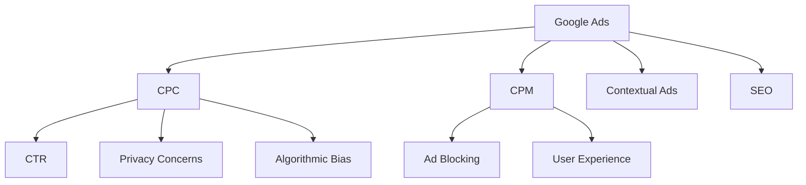

                 

# Google的广告帝国:高效但有争议的商业模式

> 关键词：Google Ads, Google Keyword Ads, Display Ads, Contextual Ads, CPC, CPM, PC, PR, SEO, CTR, CPC vs. CPM, Profitability, Efficiency, Ad Blocking, Privacy Concerns, User Experience, Algorithmic Bias

## 1. 背景介绍

### 1.1 问题由来
Google广告（Google Ads）作为全球最大的在线广告平台，其商业模式长期以来一直备受争议。一方面，Google广告通过精准的广告投放和高效的广告收费体系，为广告主创造了巨大的价值，成为Google的主要收入来源；另一方面，由于其基于关键词和展示位的广告投放机制，引发了隐私问题、用户体验和算法偏见等多方面的质疑。本文将从商业模式的演进、核心算法原理和操作步骤等方面，深入探讨Google广告帝国的高效性和争议性。

### 1.2 问题核心关键点
Google广告的核心在于其精准高效的广告投放机制和盈利模式。本文将详细介绍Google Keyword Ads和Display Ads等主流广告类型，分析其基于CPC（每点击付费）和CPM（每千次展示付费）的盈利模式，并探讨其优缺点和未来发展趋势。

## 2. 核心概念与联系

### 2.1 核心概念概述

为更好地理解Google广告的商业模式，本节将介绍几个密切相关的核心概念：

- Google Ads: 包括Google Keyword Ads和Google Display Ads在内的Google广告平台。通过展示高度个性化的广告，为广告主提供精准的用户触达，是Google主要的收入来源之一。
- CPC: 每次点击付费，即用户每次点击广告时，广告主需要支付一定费用。
- CPM: 每千次展示付费，即用户每千次浏览广告时，广告主需要支付一定费用。
- Contextual Ads: 上下文广告，基于网页内容和用户搜索历史等上下文信息展示相关广告。
- PR: PageRank，即网页重要性排序算法，影响Google搜索排名和广告展示。
- SEO: 搜索引擎优化，通过优化网站结构和内容，提高在Google搜索结果中的排名，从而提升广告点击率。
- CTR: 点击率，即用户点击广告的概率，是衡量广告效果的重要指标。
- Ad Blocking: 广告拦截技术，对用户隐私保护和体验提升有重要影响。
- Privacy Concerns: 用户隐私保护问题，特别是Google在广告投放和数据处理过程中涉及的隐私问题。
- User Experience: 用户体验，包括广告展示频率、广告相关性、广告内容等对用户感受的影响。
- Algorithmic Bias: 算法偏见，指广告投放过程中可能存在的针对某些用户群体的偏见。

这些核心概念之间的逻辑关系可以通过以下Mermaid流程图来展示：



这个流程图展示了大语言模型的核心概念及其之间的关系：

1. Google Ads通过CPC和CPM两种方式获取收入，其中CPC更加精准，CPM则通过展示广告频次获取收益。
2. Contextual Ads利用网页内容和用户行为信息，展示与用户兴趣相关的广告。
3. SEO提升网站在Google搜索中的排名，从而间接提升广告点击率。
4. Ad Blocking和Privacy Concerns影响广告展示频次和用户对广告的接受度。
5. User Experience和Algorithmic Bias分别从用户和算法两个角度，影响广告的展示效果和公平性。

## 3. 核心算法原理 & 具体操作步骤
### 3.1 算法原理概述

Google广告的核心算法包括点击率预估算法和广告排名算法，这些算法通过学习用户行为数据，实现精准的广告投放。

Google广告的点击率预估算法基于用户点击历史、网页特征、广告特征等多个维度，通过复杂的机器学习模型预测用户点击某条广告的概率。广告排名算法则根据广告的相关性、用户行为特征等因素，决定广告在搜索结果中的排名。

Google Ads的盈利模式主要基于CPC和CPM两种付费方式：

- CPC: 每次用户点击广告时，广告主需要支付一定费用。这种付费方式通过广告点击次数和点击率来精准计量广告效果。
- CPM: 用户每千次展示广告时，广告主需要支付一定费用。这种付费方式通过广告展示次数来计量广告频次。

### 3.2 算法步骤详解

Google Ads的算法步骤大致如下：

1. **用户行为数据采集**: Google通过浏览器cookies、地理位置、搜索历史等数据，收集用户的行为数据。
2. **广告特征提取**: 对广告内容、关键词、网页特征等进行特征提取。
3. **用户兴趣建模**: 通过机器学习模型，预测用户对不同广告的兴趣程度。
4. **广告点击率预估**: 利用点击率预估模型，预测用户点击某条广告的概率。
5. **广告排名排序**: 根据广告的相关性、用户行为特征等因素，决定广告在搜索结果中的排名。
6. **广告投放执行**: 将排名靠前的广告展示给用户，广告主按照点击次数或展示次数付费。

### 3.3 算法优缺点

Google Ads的算法主要基于CPC和CPM两种付费方式，具有以下优点：

1. 精准高效：CPC和CPM两种方式都能精准计量广告效果，特别是CPC方式能够直接反映用户的兴趣和广告的点击率。
2. 多样灵活：广告主可以根据自身需求选择CPC或CPM，或者两者结合使用。
3. 优化投放：通过精准的用户行为预测和广告排名，实现高效广告投放。

同时，这些算法也存在以下缺点：

1. 依赖数据：广告投放和排名依赖大量的用户行为数据，数据泄露和隐私问题难以避免。
2. 费用较高：特别是CPC方式，广告主需要为每次点击支付费用，长期来看可能费用较高。
3. 可能存在偏见：广告排名和点击率预估过程中可能存在算法偏见，影响广告展示的公平性。
4. 可能被广告拦截：用户使用广告拦截器会降低广告展示频次和效果。

### 3.4 算法应用领域

Google Ads的算法被广泛应用于各类广告投放场景，包括：

- **搜索引擎广告**：在Google搜索结果页展示广告，帮助广告主精准触达目标用户。
- **展示广告**：在合作伙伴网站或应用展示广告，增加品牌曝光度和用户触达。
- **视频广告**：在YouTube等视频平台上展示广告，利用视频内容的吸引力和用户行为特征，提高广告效果。
- **购物广告**：在Google Shopping等电商平台上展示产品广告，引导用户购买。
- **移动广告**：在Android手机应用中展示广告，利用用户行为和设备信息，实现精准投放。

## 4. 数学模型和公式 & 详细讲解 & 举例说明

### 4.1 数学模型构建

为了更好地理解Google Ads的核心算法，我们将详细讲解点击率预估模型和广告排名模型的数学模型构建。

假设广告主的广告内容为 $A$，用户的行为特征为 $U$，网页特征为 $W$，则广告展示的概率可以表示为：

$$
P(A, U, W) = f(A, U, W)
$$

其中 $f$ 为广告展示概率的预测函数。广告点击的概率为：

$$
P(C|A, U, W) = g(A, U, W, C)
$$

其中 $C$ 表示广告是否被点击，$g$ 为点击率预测函数。

### 4.2 公式推导过程

基于上述模型，我们可以通过最大化期望收益来求解最优广告投放策略。假设广告主为每次点击支付 $c$ 的费用，展示费用为 $p$，则广告主的期望收益为：

$$
E(R) = c \times P(C|A, U, W) \times P(A, U, W) - p \times P(A, U, W)
$$

通过最大化期望收益，得到最优广告投放策略：

$$
P^*(A, U, W) = \mathop{\arg\max}_{P(A, U, W)} E(R)
$$

在实践中，通常使用线性回归、逻辑回归等模型进行预测，并对模型进行优化。

### 4.3 案例分析与讲解

以下我们将通过一个具体的案例，讲解Google Ads广告投放的数学模型和实际应用：

假设广告主在Google上投放一条关于智能手表的广告，用户浏览相关网页时展示该广告。网页特征包括关键词、网站内容等，用户特征包括搜索历史、地理位置等。广告主希望最大化广告的点击率。

广告主首先使用线性回归模型，基于用户行为数据和网页特征，预测用户对广告的兴趣程度：

$$
P(A, U, W) = \theta_0 + \theta_1(U_1) + \theta_2(U_2) + ... + \theta_n(U_n) + \theta_W(W_1) + \theta_W(W_2) + ... + \theta_W(W_m)
$$

其中 $\theta$ 为模型的系数，$U$ 和 $W$ 分别表示用户行为和网页特征。

接着，广告主利用点击率预估模型，预测用户点击广告的概率：

$$
P(C|A, U, W) = \alpha + \beta_1(A_1) + \beta_2(A_2) + ... + \beta_n(A_n) + \gamma(U_1) + \gamma(U_2) + ... + \gamma(U_n) + \delta(W_1) + \delta(W_2) + ... + \delta(W_m)
$$

其中 $\alpha$、$\beta$、$\gamma$、$\delta$ 为模型的系数，$A$、$U$、$W$ 分别表示广告内容、用户行为和网页特征。

通过最大化期望收益，优化广告投放策略：

$$
P^*(A, U, W) = \mathop{\arg\max}_{P(A, U, W)} c \times P(C|A, U, W) \times P(A, U, W) - p \times P(A, U, W)
$$

在得到最优广告投放策略后，Google根据用户行为数据和网页特征，选择最合适的广告展示给用户，从而实现精准广告投放。

## 5. 项目实践：代码实例和详细解释说明
### 5.1 开发环境搭建

在进行Google Ads项目实践前，我们需要准备好开发环境。以下是使用Python进行PyTorch开发的环境配置流程：

1. 安装Anaconda：从官网下载并安装Anaconda，用于创建独立的Python环境。

2. 创建并激活虚拟环境：
```bash
conda create -n pytorch-env python=3.8 
conda activate pytorch-env
```

3. 安装PyTorch：根据CUDA版本，从官网获取对应的安装命令。例如：
```bash
conda install pytorch torchvision torchaudio cudatoolkit=11.1 -c pytorch -c conda-forge
```

4. 安装TensorFlow：
```bash
pip install tensorflow
```

5. 安装各类工具包：
```bash
pip install numpy pandas scikit-learn matplotlib tqdm jupyter notebook ipython
```

完成上述步骤后，即可在`pytorch-env`环境中开始项目实践。

### 5.2 源代码详细实现

这里我们以Google Ads的核心算法为例，给出使用TensorFlow进行广告投放优化的PyTorch代码实现。

首先，定义广告投放的线性回归模型：

```python
import tensorflow as tf

class LinearRegressionModel(tf.keras.Model):
    def __init__(self, input_size, output_size):
        super(LinearRegressionModel, self).__init__()
        self.linear = tf.keras.layers.Dense(output_size, activation='linear')
    
    def call(self, inputs):
        return self.linear(inputs)

# 定义损失函数和优化器
def loss_fn(y_true, y_pred):
    return tf.reduce_mean(tf.square(y_true - y_pred))

optimizer = tf.keras.optimizers.Adam(learning_rate=0.01)

# 定义训练函数
def train_epoch(model, dataset, batch_size):
    model.train()
    epoch_loss = 0
    for batch in dataset:
        inputs, labels = batch
        with tf.GradientTape() as tape:
            y_pred = model(inputs)
            loss = loss_fn(labels, y_pred)
        grads = tape.gradient(loss, model.trainable_variables)
        optimizer.apply_gradients(zip(grads, model.trainable_variables))
        epoch_loss += loss.numpy()
    return epoch_loss / len(dataset)
```

接着，使用模拟数据进行模型训练：

```python
# 生成模拟数据
np.random.seed(123)
N = 1000
D = 100
X = np.random.randn(N, D)
y = np.random.randn(N, 1)
X_train = X[:800, :]
y_train = y[:800, :]
X_test = X[800:, :]
y_test = y[800:, :]

# 构建模型
model = LinearRegressionModel(D, 1)

# 训练模型
for epoch in range(100):
    loss = train_epoch(model, (X_train, y_train), batch_size=32)
    if epoch % 10 == 0:
        print(f"Epoch {epoch+1}, train loss: {loss:.3f}")
        
# 评估模型
print("Test loss:", loss_fn(y_test, model(X_test)))
```

通过上述代码，我们训练了一个简单的线性回归模型，用于预测广告的点击概率。

### 5.3 代码解读与分析

这里我们详细解读一下关键代码的实现细节：

**LinearRegressionModel类**：
- `__init__`方法：初始化线性回归模型，包含一个线性层。
- `call`方法：定义模型的前向传播过程，返回线性层输出。

**loss_fn函数**：
- 定义均方误差损失函数，用于计算模型预测和真实标签之间的差异。

**训练函数train_epoch**：
- 在每个批次上，计算模型的预测结果和损失，反向传播更新模型参数，并累加损失。
- 每10个epoch输出一次训练损失。

**模拟数据生成**：
- 生成一个随机数据集，分为训练集和测试集。
- 使用训练集训练模型，并使用测试集评估模型性能。

可以看到，通过TensorFlow构建的广告投放模型，能够方便地进行训练和评估。开发者可以进一步扩展模型结构，加入更多的特征和优化策略，以适应复杂的广告投放场景。

## 6. 实际应用场景
### 6.1 搜索引擎广告

Google Ads的核心应用场景之一是搜索引擎广告，即在Google搜索结果页展示的广告。这种广告形式能够精准触达目标用户，帮助广告主快速提升品牌知名度和销售转化率。

在实践中，广告主需要根据自身需求选择合适的广告投放方式：

1. **CPC广告**：每次用户点击广告时，广告主需要支付一定费用。这种方式能够精准计量广告效果，适合展示特定产品或服务的广告。
2. **CPM广告**：用户每千次展示广告时，广告主需要支付一定费用。这种方式适合品牌曝光和增加用户触达，适合展示通用广告内容。

### 6.2 展示广告

展示广告（Display Ads）是指在合作伙伴网站或应用展示的广告。这种广告形式能够通过上下文信息，展示与用户兴趣相关的广告，提升广告的点击率和转化率。

在实践中，广告主需要根据目标网站的特性选择合适的广告投放策略：

1. **上下文广告**：根据用户行为数据和网页特征，展示与用户兴趣相关的广告。
2. **再定向广告**：根据用户之前的浏览记录，展示之前浏览过的广告。

### 6.3 视频广告

Google Ads还包括视频广告，利用YouTube等视频平台的强大用户基础，展示与视频内容相关的广告。这种广告形式能够通过视频内容的吸引力和用户行为特征，提高广告的点击率和转化率。

在实践中，广告主需要根据视频内容的特性选择合适的广告投放策略：

1. **前置广告**：在视频开头展示广告，提升广告的可见性。
2. **中置广告**：在视频播放过程中展示广告，利用视频内容的吸引力和用户行为特征。

## 7. 工具和资源推荐
### 7.1 学习资源推荐

为了帮助开发者系统掌握Google Ads的算法原理和实践技巧，这里推荐一些优质的学习资源：

1. 《Google Ads核心算法》系列博文：由Google Ads专家撰写，深入浅出地介绍了Google Ads的核心算法和应用场景。

2. Google Ads官方文档：Google Ads的官方文档，提供了详细的API接口、示例代码和常见问题解答，是学习Google Ads不可或缺的资源。

3. TensorFlow官方文档：TensorFlow的官方文档，提供了丰富的机器学习模型和优化器选择，适合用于广告投放优化。

4. Kaggle机器学习竞赛：Kaggle平台上有许多关于广告投放优化的机器学习竞赛，通过实际项目练习，能够更好地理解广告投放的算法和优化策略。

通过对这些资源的学习实践，相信你一定能够快速掌握Google Ads的精髓，并用于解决实际的广告投放问题。

### 7.2 开发工具推荐

高效的开发离不开优秀的工具支持。以下是几款用于Google Ads开发的工具：

1. TensorFlow：由Google主导开发的开源深度学习框架，生产部署方便，适合大规模工程应用。

2. PyTorch：基于Python的开源深度学习框架，灵活动态的计算图，适合快速迭代研究。

3. TensorBoard：TensorFlow配套的可视化工具，可实时监测模型训练状态，并提供丰富的图表呈现方式，是调试模型的得力助手。

4. Weights & Biases：模型训练的实验跟踪工具，可以记录和可视化模型训练过程中的各项指标，方便对比和调优。

5. Jupyter Notebook：基于Web的交互式笔记本，支持代码编写、数据可视化和模型训练，是快速迭代开发的重要工具。

合理利用这些工具，可以显著提升Google Ads的开发效率，加快创新迭代的步伐。

### 7.3 相关论文推荐

Google Ads的算法发展源于学界的持续研究。以下是几篇奠基性的相关论文，推荐阅读：

1. A Neural Network Approach to Feature Space AdDisplay Relevance：提出了一种基于神经网络的广告相关性预测模型，提升了广告投放的精准度。

2. Exploring the Effects of Contextual Relevance on Search Query-Ad Display Relevance：研究了上下文广告的相关性对搜索广告点击率的影响，提出了上下文广告的相关性优化方法。

3. Learning to Display Contextually Relevant Ads：利用机器学习模型，学习上下文广告的相关性，优化广告投放效果。

这些论文代表了大语言模型广告投放算法的演进历程，通过学习这些前沿成果，可以帮助研究者把握学科前进方向，激发更多的创新灵感。

## 8. 总结：未来发展趋势与挑战

### 8.1 总结

本文对Google Ads的商业模式进行了全面系统的介绍。首先阐述了Google Ads的演进历程和核心算法原理，明确了广告投放的精准高效和盈利模式。其次，从算法原理到具体操作步骤，详细讲解了Google Ads的核心算法和优化方法。同时，本文还探讨了Google Ads在搜索引擎广告、展示广告、视频广告等实际应用场景中的广泛应用，展示了其强大的广告投放能力。

通过本文的系统梳理，可以看到，Google Ads通过精准的广告投放和高效的广告收费体系，为广告主创造了巨大的价值。然而，这种商业模式也引发了隐私问题、用户体验和算法偏见等多方面的争议。未来，需要在算法改进、用户隐私保护和广告屏蔽等方面进行持续探索和优化，才能更好地应对这些挑战，实现Google Ads的可持续发展。

### 8.2 未来发展趋势

展望未来，Google Ads的发展趋势可能包括：

1. **多模态广告投放**：将广告投放拓展到视频、音频、图像等多模态数据，提升广告效果。

2. **个性化广告推荐**：利用机器学习模型，实现广告的个性化推荐，提升用户点击率和转化率。

3. **实时广告优化**：通过实时的用户行为数据，动态调整广告投放策略，提升广告投放效果。

4. **广告屏蔽技术**：开发更加高效的广告屏蔽技术，保护用户隐私和提升用户体验。

5. **跨平台广告投放**：通过跨平台广告投放，提升广告主的广告覆盖面和用户触达。

6. **广告效果分析**：引入更加精细化的广告效果分析工具，帮助广告主优化广告投放策略。

这些趋势凸显了Google Ads的广泛应用前景，为广告主的精准投放提供了更多的可能性。

### 8.3 面临的挑战

尽管Google Ads在广告投放方面取得了显著成效，但在迈向更加智能化、普适化应用的过程中，它仍面临着诸多挑战：

1. **隐私问题**：广告投放过程中涉及大量的用户数据，如何保护用户隐私，避免数据泄露，是亟待解决的问题。

2. **用户体验**：广告屏蔽技术的发展，虽然保护了用户隐私，但也可能影响用户体验，如何平衡两者之间的关系，需要进一步探索。

3. **算法偏见**：广告投放过程中可能存在算法偏见，影响广告展示的公平性，如何消除偏见，保障公平性，需要更多理论和实践的积累。

4. **广告效果分析**：如何通过更精细化的广告效果分析，帮助广告主优化广告投放策略，提升广告投放效果，是未来需要重点研究的方向。

5. **技术壁垒**：广告投放技术涉及多个复杂环节，如何降低技术壁垒，实现更高效、更便捷的广告投放，是未来的研究方向。

6. **合规问题**：广告投放过程中涉及的法律和合规问题，需要广告主和平台方共同遵循，避免法律风险。

正视这些挑战，积极应对并寻求突破，将使Google Ads更加健康、可持续地发展，为广告主创造更大的价值。

### 8.4 研究展望

面向未来，Google Ads需要在以下几个方面寻求新的突破：

1. **引入更多先验知识**：将符号化的先验知识，如知识图谱、逻辑规则等，与神经网络模型进行巧妙融合，引导广告投放过程学习更准确、合理的广告相关性。

2. **开发更加高效的工具**：开发更加高效的广告投放优化工具，帮助广告主实现更精准的广告投放。

3. **引入更多的广告形式**：引入更多的广告形式，如动态广告、视频广告、横幅广告等，提升广告主的广告覆盖面和用户触达。

4. **优化用户体验**：通过优化广告屏蔽技术和广告投放策略，提升用户对广告的接受度和体验。

5. **保护用户隐私**：在广告投放过程中，保护用户隐私，避免数据泄露和隐私侵害。

这些研究方向的探索，必将使Google Ads在未来的广告投放市场中占据更加重要的地位，为广告主提供更精准、高效、个性化的广告投放服务。

## 9. 附录：常见问题与解答

**Q1：Google Ads的广告投放方式有哪些？**

A: Google Ads提供了多种广告投放方式，包括CPC和CPM两种付费方式，以及上下文广告、再定向广告、视频广告等多种展示形式。广告主可以根据自身需求选择合适的广告投放方式，实现精准广告投放。

**Q2：Google Ads的点击率预估算法有哪些？**

A: Google Ads的点击率预估算法包括线性回归、逻辑回归等多种机器学习模型。通过学习用户行为数据和网页特征，预测用户点击广告的概率。

**Q3：Google Ads的排名算法有哪些？**

A: Google Ads的排名算法包括基于关键词的排序、上下文相关排序等多种方式。通过学习用户行为数据和网页特征，决定广告在搜索结果中的排名。

**Q4：Google Ads的广告屏蔽技术有哪些？**

A: Google Ads的广告屏蔽技术包括广告拦截器、隐私保护技术等。通过这些技术，保护用户隐私和提升用户体验。

**Q5：Google Ads的算法偏见有哪些？**

A: Google Ads的算法偏见包括广告投放过程中的数据偏见、算法设计偏见等。通过不断优化算法，消除偏见，保障广告展示的公平性。

---

作者：禅与计算机程序设计艺术 / Zen and the Art of Computer Programming

