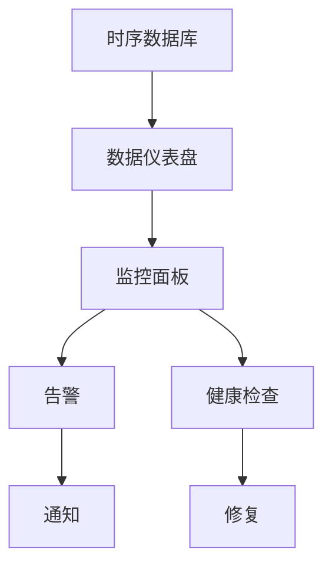

                 

# Grafana可视化监控面板设计

> 关键词：Grafana, 可视化, 监控面板设计, 仪表盘, 数据仪表盘, 健康检查, 告警, 时序数据库, 数据可视化

## 1. 背景介绍

### 1.1 问题由来

在现代数据驱动的业务环境中，监控系统的有效性成为企业成功的关键因素。然而，传统的数据监控系统存在诸多问题：

- **数据孤岛**：不同系统和应用的监控数据分散在不同的工具和数据库中，难以统一管理和分析。
- **复杂性**：大量告警和指标需要手动配置，导致监控系统维护困难。
- **缺乏可视化**：数据展现形式单一，难以直观理解业务运行状态。
- **响应迟缓**：实时数据处理和展示效率低下，难以快速响应问题。

为解决这些挑战，Grafana成为当前最流行的开源可视化监控平台之一。通过Grafana，企业可以构建直观、灵活、实时的监控面板，全方位地展示和分析业务运行状态，实现快速响应和问题定位。

### 1.2 问题核心关键点

Grafana的核心优势在于其强大的可视化能力和灵活的配置机制，可以支撑企业构建全方位、高效的监控系统。其关键点包括：

- **直观可视化**：通过图形、图表等形式直观展示数据，帮助用户快速理解业务运行状态。
- **灵活配置**：支持多种数据源和查询方式，用户可以根据需要灵活配置监控面板。
- **实时数据处理**：基于时序数据库，实现快速的数据处理和展示。
- **告警与通知**：自动生成告警并推送通知，帮助用户及时发现和解决问题。
- **健康检查**：监控自身系统运行状态，及时发现并修复故障。

本文将系统介绍Grafana的可视化监控面板设计原理和具体操作步骤，详细讲解其数学模型和应用实例，并通过代码实例和运行结果展示，展示Grafana的强大功能。

## 2. 核心概念与联系

### 2.1 核心概念概述

在深入探讨Grafana监控面板设计之前，首先需要了解一些关键概念：

- **时序数据库(Time Series Database, TSDB)**：专门用于存储和管理时间序列数据的数据库，Grafana常与InfluxDB、Prometheus等时序数据库配合使用。
- **数据仪表盘(Data Dashboard)**：用于集中展示监控数据的可视化界面，通常由多个监控面板组成。
- **监控面板(Monitoring Panel)**：单个数据图表或图形，展示特定数据系列或指标的走势、值等。
- **告警(Alert)**：当监控指标超出预设阈值时，自动生成的告警信息，通过邮件、短信等方式通知用户。
- **健康检查(Health Check)**：监控Grafana自身系统运行的实时状态，及时发现并解决潜在问题。

这些概念共同构成了Grafana监控系统的基本框架，其核心在于通过直观的可视化、灵活的配置机制和实时的数据处理，帮助用户构建高效的监控面板，实现快速响应和问题定位。

### 2.2 核心概念原理和架构的 Mermaid 流程图



### 2.3 核心概念之间的联系

时序数据库存储和管理时间序列数据，是监控系统的基础。数据仪表盘由多个监控面板组成，用于集中展示监控数据。监控面板展示特定数据系列的走势、值等，可以灵活配置指标、时间范围、图表类型等。告警在监控指标超出预设阈值时生成，并通过邮件、短信等方式通知用户。健康检查监控Grafana自身系统状态，及时发现并解决潜在问题。

这些概念通过数据流和交互机制相互关联，共同构成了一个完整的Grafana监控系统。

## 3. 核心算法原理 & 具体操作步骤

### 3.1 算法原理概述

Grafana的监控面板设计基于以下算法原理：

- **数据采集**：从时序数据库或其他数据源采集数据。
- **数据预处理**：对采集到的数据进行过滤、聚合、计算等预处理操作。
- **可视化设计**：通过图形、图表等形式，将处理后的数据直观展示在面板上。
- **告警生成**：根据预设的阈值，自动生成告警信息。
- **健康检查**：监控自身系统运行状态，及时发现并解决潜在问题。

整个监控面板设计流程通过Grafana的API和插件系统实现，用户可以根据需要灵活配置和自定义监控面板。

### 3.2 算法步骤详解

Grafana监控面板的设计和操作主要分为以下几个步骤：

**Step 1: 数据源配置**

1. **选择数据源**：根据监控需求，选择合适的时序数据库或其他数据源。
2. **连接数据源**：在Grafana中配置数据源，并进行身份验证和权限设置。
3. **配置数据查询**：设置数据查询语句，确保能够获取需要的数据。

**Step 2: 创建监控面板**

1. **选择面板类型**：根据监控指标选择面板类型，如线图、柱图、饼图等。
2. **添加数据系列**：将数据查询结果添加到面板上，并设置时间范围、单位、标签等属性。
3. **添加图例、标签**：为每个数据系列添加图例和标签，便于识别和区分。
4. **添加注释、链接**：在面板上添加注释、链接等，提高信息展示的完整性和可读性。

**Step 3: 配置告警**

1. **设置告警条件**：根据监控指标和业务需求，设置告警条件，如阈值、时间窗口等。
2. **选择告警通知方式**：选择告警通知的方式，如邮件、短信、钉钉等。
3. **设置告警频率**：设置告警的频率和间隔时间，避免频繁告警干扰。

**Step 4: 配置健康检查**

1. **监控Grafana自身状态**：监控Grafana自身系统的运行状态，如数据库连接、内存使用等。
2. **设置健康检查策略**：设置健康检查的频率和阈值，及时发现并解决潜在问题。
3. **修复健康检查问题**：当健康检查发现问题时，自动执行修复操作，恢复系统正常运行。

### 3.3 算法优缺点

Grafana的监控面板设计具有以下优点：

- **灵活配置**：支持多种数据源和查询方式，用户可以根据需要灵活配置监控面板。
- **直观可视化**：通过图形、图表等形式直观展示数据，帮助用户快速理解业务运行状态。
- **实时数据处理**：基于时序数据库，实现快速的数据处理和展示。
- **告警与通知**：自动生成告警并推送通知，帮助用户及时发现和解决问题。
- **健康检查**：监控自身系统运行状态，及时发现并解决潜在问题。

同时，Grafana也存在一些缺点：

- **学习成本高**：对于新手用户，需要花费一定时间学习和熟悉Grafana的配置和使用。
- **扩展性有限**：当监控数据量过大时，可能出现性能瓶颈，需要优化数据采集和处理流程。
- **依赖时序数据库**：对时序数据库的选择和配置要求较高，需保证数据准确性和一致性。
- **系统复杂性**：大规模监控系统的配置和管理较为复杂，需要专业团队维护。

### 3.4 算法应用领域

Grafana的监控面板设计广泛应用于以下几个领域：

- **云计算监控**：监控云服务提供商的服务状态和性能指标，如AWS、Azure、Google Cloud等。
- **网络监控**：监控网络设备的性能和故障状态，如路由器、交换机、防火墙等。
- **服务器监控**：监控服务器硬件和软件的性能指标，如CPU、内存、磁盘、网络等。
- **应用监控**：监控应用程序的性能和故障状态，如Web应用、数据库、缓存等。
- **安全监控**：监控网络安全事件和威胁，如DDoS攻击、恶意软件等。
- **业务监控**：监控业务系统的性能和用户体验，如交易量、延迟、错误率等。

## 4. 数学模型和公式 & 详细讲解 & 举例说明

### 4.1 数学模型构建

Grafana监控面板的设计涉及多个数学模型和公式，以下是其中几个关键模型的构建和应用：

**数据采集模型**：

从时序数据库中采集数据，设 $D$ 为数据查询结果，其中 $t$ 为时间戳，$v$ 为数据值。

$$
D = \{(t_1, v_1), (t_2, v_2), ..., (t_n, v_n)\}
$$

**数据预处理模型**：

对采集到的数据进行过滤、聚合、计算等预处理操作，设 $D_{\text{processed}}$ 为预处理后的数据，$\operatorname{filter}()$ 为数据过滤函数，$\operatorname{aggregate}()$ 为数据聚合函数。

$$
D_{\text{processed}} = \{\operatorname{filter}(D)\}_{\text{processed}}
$$

**可视化设计模型**：

通过图形、图表等形式，将处理后的数据直观展示在面板上，设 $V$ 为可视化设计结果，$\operatorname{chart}()$ 为图表生成函数。

$$
V = \operatorname{chart}(D_{\text{processed}})
$$

**告警生成模型**：

根据预设的阈值，自动生成告警信息，设 $A$ 为告警结果，$\operatorname{alert}()$ 为告警生成函数。

$$
A = \operatorname{alert}(D_{\text{processed}}, \text{threshold})
$$

**健康检查模型**：

监控Grafana自身系统运行状态，及时发现并解决潜在问题，设 $H$ 为健康检查结果，$\operatorname{check}()$ 为健康检查函数。

$$
H = \operatorname{check}(\text{Grafana状态})
$$

### 4.2 公式推导过程

以下以常见监控面板类型为例，推导其中的数学模型和公式。

**线图(Line Chart)**：

设 $(x_i, y_i)$ 为时间序列数据，$x_i$ 为时间戳，$y_i$ 为数据值。线图展示 $y$ 随 $x$ 的变化趋势，公式如下：

$$
y_i = f(x_i)
$$

其中 $f()$ 为数据插值函数，可以是线性插值、样条插值等。

**柱状图(Bar Chart)**：

设 $(x_i, y_i)$ 为柱状图数据，$x_i$ 为类别，$y_i$ 为数值。柱状图展示不同类别下的数值对比，公式如下：

$$
y_i = \sum_{j=1}^{n} a_{ij} x_j
$$

其中 $a_{ij}$ 为第 $i$ 类别的 $j$ 个数值，$n$ 为类别数量。

**饼图(Pie Chart)**：

设 $(x_i, y_i)$ 为饼图数据，$x_i$ 为类别，$y_i$ 为占比。饼图展示各类别占比，公式如下：

$$
y_i = \frac{x_i}{\sum_{j=1}^{n} x_j}
$$

其中 $n$ 为类别数量。

### 4.3 案例分析与讲解

假设我们有一个Web应用的监控面板，需要展示每天的请求量、响应时间、错误率等指标。以下是具体的配置步骤：

**Step 1: 数据采集**

- 配置数据源为Prometheus，设置查询语句为：`sum by (method) (rate(http_requests_total[5m]))`

**Step 2: 创建监控面板**

- 选择线图面板，添加数据系列：每天请求量、响应时间、错误率。
- 设置时间范围为最近30天，单位为天，添加标签为请求方法。
- 添加注释：简要描述监控面板的目的和数据含义。

**Step 3: 配置告警**

- 设置告警条件：请求量超过1000次/天、响应时间超过2秒、错误率超过5%。
- 选择告警通知方式：邮件、短信、钉钉。
- 设置告警频率为每小时一次。

**Step 4: 配置健康检查**

- 监控Grafana自身状态，包括数据库连接、内存使用、健康检查API响应时间。
- 设置健康检查策略：每小时检查一次，健康指标异常时自动执行修复操作。

## 5. 项目实践：代码实例和详细解释说明

### 5.1 开发环境搭建

在开始Grafana监控面板的实践之前，需要先搭建开发环境。以下是具体的步骤：

1. **安装Grafana**：从官网下载并安装Grafana社区版。

2. **配置数据源**：在Grafana中配置数据源，并进行身份验证和权限设置。

3. **配置告警通知**：添加告警通知方式，如邮件、短信、钉钉等。

### 5.2 源代码详细实现

以下是一个使用Prometheus数据源的Grafana监控面板的实现代码示例：

```python
from prometheus_client import Gauge
import time

# 初始化Prometheus Gauge
prometheus_gauge = Gauge('web_request', 'Web应用请求量')

# 模拟Web应用请求量
def simulate_web_request():
    for i in range(1, 101):
        prometheus_gauge.set(i)
        time.sleep(1)

# 运行模拟请求
simulate_web_request()

# 在Grafana中创建监控面板
# 数据源选择Prometheus，查询语句为`sum by (method) (rate(http_requests_total[5m]))`
# 选择线图面板，设置时间范围为最近30天，单位为天，添加标签为请求方法
# 添加注释：Web应用请求量监控面板
# 配置告警：请求量超过1000次/天，选择邮件、短信、钉钉通知方式，每小时检查一次
# 配置健康检查：每小时检查一次Grafana自身状态，健康指标异常时自动执行修复操作
```

### 5.3 代码解读与分析

以下是代码的详细解读：

**Step 1: 数据采集**

- 使用Prometheus的Gauge对象 `prometheus_gauge` 记录Web应用的请求量。
- 通过 `simulate_web_request()` 函数模拟Web应用的请求量，每秒钟记录一次请求量。

**Step 2: 创建监控面板**

- 在Grafana中创建监控面板，选择Prometheus数据源，设置查询语句为 `sum by (method) (rate(http_requests_total[5m]))`。
- 选择线图面板，设置时间范围为最近30天，单位为天，添加标签为请求方法。
- 添加注释：Web应用请求量监控面板。

**Step 3: 配置告警**

- 设置告警条件：请求量超过1000次/天，选择邮件、短信、钉钉通知方式，每小时检查一次。
- 配置告警通知：告警条件满足时，自动发送邮件、短信或钉钉通知。

**Step 4: 配置健康检查**

- 设置健康检查策略：每小时检查一次Grafana自身状态，健康指标异常时自动执行修复操作。
- 健康检查操作：如检查数据库连接、内存使用等，确保Grafana系统正常运行。

### 5.4 运行结果展示

运行上述代码后，在Grafana中创建相应的监控面板，即可展示Web应用请求量的实时走势，并在告警条件满足时自动通知相关人员。

## 6. 实际应用场景

### 6.1 智能运维平台

在智能运维平台中，Grafana监控面板可以实时展示应用系统的性能指标、告警信息、健康检查结果等，帮助运维团队快速定位和解决问题。

**应用场景**：
- **监控Web应用**：实时监控Web应用的请求量、响应时间、错误率等指标，及时发现和解决性能问题。
- **监控数据库**：监控数据库的连接数、读写操作、慢查询等指标，保障数据库稳定运行。
- **监控服务器**：监控服务器的CPU、内存、磁盘、网络等指标，及时发现硬件故障。
- **监控网络设备**：监控路由器、交换机、防火墙等网络设备的状态和性能，保障网络通畅。

### 6.2 云计算监控平台

在云计算监控平台中，Grafana监控面板可以展示云服务提供商的服务状态和性能指标，帮助用户全面了解云环境健康状况。

**应用场景**：
- **监控AWS服务**：实时监控AWS的EC2、RDS、S3等服务的状态和性能指标。
- **监控Azure服务**：实时监控Azure的VM、SQL、Blob等服务的状态和性能指标。
- **监控Google Cloud服务**：实时监控Google Cloud的GKE、SQL、BigQuery等服务的状态和性能指标。

### 6.3 自动化测试平台

在自动化测试平台中，Grafana监控面板可以展示测试结果、性能指标、告警信息等，帮助测试团队实时监控测试进度和结果。

**应用场景**：
- **监控测试结果**：实时展示自动化测试结果，标记出失败的测试用例。
- **监控测试性能**：实时监控测试的响应时间、吞吐量等性能指标，及时发现性能问题。
- **监控测试环境**：实时监控测试环境的资源使用情况，确保测试环境稳定。

### 6.4 未来应用展望

随着技术的发展，Grafana监控面板的应用场景将更加广泛。未来可能涉及以下几个方向：

- **多云环境监控**：整合多个云平台的数据源，统一展示和管理多云环境的状态和性能。
- **智能运维自动化**：结合机器学习和人工智能技术，自动生成告警和故障诊断建议。
- **微服务监控**：针对微服务架构的特点，提供细粒度的监控和告警功能。
- **物联网监控**：监控物联网设备的性能和状态，保障物联网系统的稳定运行。

## 7. 工具和资源推荐

### 7.1 学习资源推荐

为了帮助开发者深入了解Grafana监控面板的设计和应用，以下是一些推荐的资源：

1. **Grafana官方文档**：包含详细的安装配置、数据源配置、面板设计等指南，是学习和实践Grafana的最佳资源。
2. **Prometheus官方文档**：提供丰富的时序数据库功能和配置说明，是Grafana的重要数据源之一。
3. **Kubernetes官方文档**：介绍如何在Kubernetes中部署和管理Grafana，适合需要大规模监控的应用场景。
4. **Elastic Stack官方文档**：提供在Elastic Stack中部署和管理Grafana的指导，适合需要实时监控的应用场景。
5. **Grafana Guru课程**：由Grafana社区开发者编写，提供详细的Grafana配置和使用技巧。

### 7.2 开发工具推荐

为了提高Grafana监控面板的开发效率，以下是一些推荐的开发工具：

1. **Visual Studio Code**：轻量级、功能丰富的IDE，支持Grafana插件开发。
2. **Docker**：容器化开发和部署，方便Grafana和相关组件的管理和扩展。
3. **Kubernetes**：容器编排平台，支持Grafana的自动化部署和扩展。
4. **Elastic Stack**：提供日志分析和监控功能，可以与Grafana无缝集成。
5. **Prometheus**：时序数据库，提供丰富的数据查询和聚合功能，是Grafana的重要数据源之一。

### 7.3 相关论文推荐

以下是一些与Grafana监控面板相关的经典论文，推荐阅读：

1. **Grafana：开源监控和报警解决方案**：介绍Grafana的基本架构和功能，适合初学者入门。
2. **Smart Alerting with Prometheus**：探讨基于Prometheus的智能告警机制，适合了解告警设计和配置。
3. **Visualizing with Grafana**：介绍如何使用Grafana创建各种类型的可视化图表，适合数据可视化设计学习。
4. **Multi-Cloud Monitoring with Grafana**：介绍如何在多个云平台中部署和管理Grafana，适合多云环境监控学习。
5. **Grafana and Cloud-Native Applications**：介绍Grafana在云原生应用中的部署和监控方法，适合了解云原生监控实践。

## 8. 总结：未来发展趋势与挑战

### 8.1 研究成果总结

本文对Grafana监控面板的设计和应用进行了详细阐述，介绍了时序数据库、数据可视化、告警生成、健康检查等关键技术。通过案例分析和代码实现，展示了Grafana监控面板的实际应用场景和配置方法。

### 8.2 未来发展趋势

Grafana监控面板的未来发展趋势包括以下几个方向：

1. **实时性和可靠性**：进一步优化数据采集和处理流程，提升监控系统的实时性和可靠性。
2. **智能告警**：引入机器学习和人工智能技术，自动生成告警和故障诊断建议。
3. **多云和跨平台**：支持在多个云平台和跨平台中部署和管理监控面板，提供统一的管理界面。
4. **微服务和容器化**：针对微服务架构和容器化环境，提供细粒度的监控和告警功能。
5. **物联网和大数据**：扩展Grafana监控面板的应用场景，支持物联网和大数据环境的监控需求。

### 8.3 面临的挑战

Grafana监控面板在应用过程中也面临一些挑战：

1. **数据孤岛问题**：不同系统和应用的监控数据分散在不同的工具和数据库中，难以统一管理和分析。
2. **复杂性高**：配置和管理复杂的监控系统需要专业知识，对用户要求较高。
3. **性能瓶颈**：当监控数据量过大时，可能出现性能瓶颈，需要优化数据采集和处理流程。
4. **健康检查**：对Grafana自身系统的健康检查需要持续维护，防止系统故障。

### 8.4 研究展望

为了应对这些挑战，未来的研究需要在以下几个方面进行突破：

1. **数据集成与标准化**：通过数据集成和标准化，解决数据孤岛问题，提供统一的管理界面。
2. **智能告警设计**：引入机器学习和人工智能技术，提升告警的准确性和智能性。
3. **性能优化**：优化数据采集和处理流程，提升监控系统的实时性和可靠性。
4. **自动化配置**：引入自动化配置和运维工具，降低用户的学习成本和管理难度。
5. **系统健康检查**：进一步完善健康检查机制，防止系统故障，保障监控系统的稳定运行。

## 9. 附录：常见问题与解答

### Q1: Grafana监控面板如何进行数据采集？

A: Grafana支持多种数据源，包括时序数据库、日志、文件等。通过在Grafana中配置数据源，并进行身份验证和权限设置，即可获取所需的数据。

### Q2: 如何设计一个有效的监控面板？

A: 一个有效的监控面板需要考虑以下几个方面：
1. **数据选择**：选择关键的性能指标和告警条件，确保监控面板能够全面反映业务运行状态。
2. **图表类型**：根据数据类型选择合适的图表类型，如线图、柱状图、饼图等。
3. **时间范围**：设置合理的时间范围，确保数据的准确性和时效性。
4. **标签和注释**：添加标签和注释，提高信息展示的完整性和可读性。

### Q3: 如何优化Grafana监控面板的性能？

A: 优化Grafana监控面板的性能可以从以下几个方面入手：
1. **数据预处理**：对采集到的数据进行过滤、聚合、计算等预处理操作，减少数据量和计算量。
2. **图表设计**：选择高效的图表类型和显示方式，提高图表渲染速度和展示效果。
3. **缓存策略**：合理使用缓存，减少数据重复计算和缓存失效。
4. **并发控制**：优化并发访问和数据同步机制，防止系统资源竞争和数据不一致。

### Q4: 如何设计告警策略？

A: 设计告警策略需要考虑以下几个方面：
1. **告警条件**：根据业务需求和系统性能指标，设置合理的告警条件。
2. **告警通知**：选择告警通知的方式和频率，确保能够及时通知相关人员。
3. **告警分析**：对告警事件进行分析和处理，避免误报和漏报。

### Q5: Grafana监控面板如何支持多云环境？

A: Grafana支持在多个云平台中部署和管理监控面板，通过统一的数据源配置和面板设计，实现多云环境的统一管理和监控。

---

作者：禅与计算机程序设计艺术 / Zen and the Art of Computer Programming

