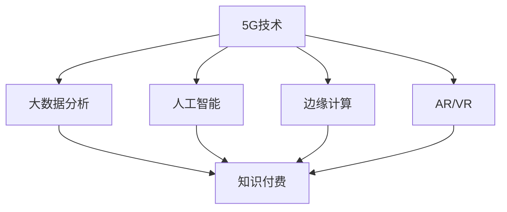

                 

# 5G时代知识付费将迎来哪些新的变革

## 1. 背景介绍

5G技术的广泛应用正在深刻改变我们的生活方式和工作模式。除了提高通信速度、降低延迟外，5G还带来了更为丰富多样的网络服务形态，为知识付费行业带来了新的机遇和挑战。本文将详细探讨5G时代知识付费将迎来哪些新的变革，以及如何把握这些机遇，实现行业升级。

## 2. 核心概念与联系

### 2.1 核心概念概述

为了深入理解5G对知识付费的影响，本节将介绍几个关键概念：

- 5G技术：第五代移动通信技术，提供更高的带宽、更低的延迟和更广的覆盖，为各类移动应用提供了坚实的基础。

- 知识付费：用户为获取专业知识和信息而支付费用的商业模式，包括在线课程、音频/视频内容、电子书等。

- 移动应用：基于移动网络的各类应用，如在线教育、新闻资讯、社交媒体等。

- 大数据分析：通过收集和分析大量用户数据，了解用户行为和需求，进行个性化推荐和内容优化。

- 人工智能：包括机器学习、自然语言处理、计算机视觉等技术，在知识推荐、智能客服、广告投放等方面有广泛应用。

- 边缘计算：在网络边缘（靠近用户）进行数据处理和分析，以降低延迟和带宽消耗，提高响应速度。

- AR/VR：增强现实和虚拟现实技术，可以提供沉浸式学习体验，提升教育效果。

这些概念之间的逻辑关系可以通过以下Mermaid流程图来展示：



这个流程图展示了大语言模型的核心概念及其之间的关系：

1. 5G技术通过提供更高速的网络环境，支持各类移动应用的发展。
2. 大数据分析和人工智能技术，通过分析用户行为和需求，提升知识付费服务质量。
3. 边缘计算和AR/VR技术，通过降低延迟和提升用户体验，进一步丰富知识付费形态。
4. 知识付费通过结合各类新兴技术，提供更加多样化和个性化服务，提升用户价值。

## 3. 核心算法原理 & 具体操作步骤

### 3.1 算法原理概述

5G时代知识付费的变革，本质上是由各类新兴技术推动的。其核心在于如何更好地利用5G技术的高带宽、低延迟特性，结合大数据分析和人工智能技术，为用户提供更加丰富、个性化和互动的学习体验。

具体而言，5G技术通过提供更高的网络速度和更低的延迟，支持视频/音频/VR/AR等多媒体内容的高质量传输，极大地提升了知识付费产品的形式和多样性。大数据分析和人工智能技术，则通过分析用户行为和需求，提供个性化的推荐和互动式学习体验，进一步提升用户黏性和满意度。

### 3.2 算法步骤详解

基于5G技术的知识付费变革，主要涉及以下几个关键步骤：

**Step 1: 构建5G网络基础设施**
- 部署5G基站和网络设备，确保覆盖广度和网络稳定性。
- 优化网络带宽分配，保证不同应用的高质量传输。

**Step 2: 开发多形态的知识付费产品**
- 设计并开发支持高带宽低延迟的视频/音频/VR/AR课程内容。
- 构建沉浸式学习平台，提升用户互动体验。

**Step 3: 实施大数据分析**
- 收集用户行为数据，包括点击率、观看时长、评论等。
- 使用机器学习算法，分析用户兴趣和需求。
- 实时调整推荐算法，提供个性化学习内容。

**Step 4: 引入人工智能技术**
- 应用自然语言处理技术，实现智能客服和搜索功能。
- 利用计算机视觉技术，提供图像识别和增强现实内容。
- 采用推荐系统算法，提升内容推荐效果。

**Step 5: 部署边缘计算**
- 在网络边缘部署数据处理和分析节点，提高响应速度。
- 优化算法，减少网络延迟和带宽消耗。

### 3.3 算法优缺点

5G时代知识付费变革的主要优点包括：

1. 丰富多样。5G高带宽低延迟特性，支持多形态内容传输，提升知识付费产品的多样性。
2. 个性化强。通过大数据分析和AI技术，实现用户兴趣和需求精准分析，提供个性化推荐。
3. 互动性强。AR/VR技术，提供沉浸式学习体验，提升用户互动性。
4. 服务响应快。边缘计算部署，降低延迟，提升服务响应速度。

但同时也存在一些局限性：

1. 技术成本高。5G基础设施和AI技术需要大量的资金投入。
2. 数据隐私问题。大数据分析涉及用户隐私数据的收集和处理，需严格遵守法律法规。
3. 内容适配难度大。不同用户和平台需要适配不同类型的知识付费产品。

### 3.4 算法应用领域

基于5G技术和大数据AI的知识付费变革，在多个领域得到了广泛应用：

1. 在线教育：5G和AI技术结合，提供高质量的视频/音频课程和互动式学习平台。
2. 资讯媒体：利用大数据分析和AI技术，实现个性化的新闻和文章推荐。
3. 医疗健康：提供高清晰度的医疗课程和远程医疗服务，提升用户健康意识。
4. 企业培训：结合AR/VR技术，提供沉浸式培训课程和模拟实战环境。
5. 娱乐休闲：利用AR/VR技术，提供沉浸式阅读、游戏和影视内容，提升用户娱乐体验。
6. 个性化广告：利用大数据分析，实现精准投放个性化广告，提升广告效果。

## 4. 数学模型和公式 & 详细讲解 & 举例说明

### 4.1 数学模型构建

为了更好地描述5G时代知识付费的变革过程，本节将使用数学语言对核心模型进行详细构建。

设 $C$ 为用户知识付费的消费行为，包括购买课程、订阅服务等，$D$ 为用户在平台上的浏览行为，包括观看视频、阅读文章等，$R$ 为用户在平台上发布的评论和反馈。基于5G技术的知识付费模型可以表示为：

$$
C = f(D, R, C_{prev})
$$

其中 $f$ 为模型映射函数，$C_{prev}$ 为用户之前的消费行为。

### 4.2 公式推导过程

为简化模型，假设用户行为 $D$ 和评论 $R$ 是独立可预测的，则模型可以进一步简化为：

$$
C = f_D(D) + f_R(R) + \epsilon
$$

其中 $\epsilon$ 为误差项，$f_D$ 和 $f_R$ 分别为预测消费和评论的函数。

假设 $f_D$ 为线性回归模型，则有：

$$
f_D(D) = \alpha + \beta D + \gamma D^2
$$

其中 $\alpha, \beta, \gamma$ 为模型参数，$D$ 为用户的浏览行为指标。

假设 $f_R$ 为逻辑回归模型，则有：

$$
f_R(R) = \delta + \eta \exp(\theta R)
$$

其中 $\delta, \eta, \theta$ 为模型参数，$R$ 为用户的评论反馈指标。

### 4.3 案例分析与讲解

以在线教育平台为例，可以构建一个基于5G的个性化推荐系统：

- 收集用户历史课程浏览记录、学习时长、评分等数据 $D$。
- 收集用户在学习平台发布的评论、反馈等数据 $R$。
- 使用上述模型预测用户未来课程购买行为 $C$。
- 根据预测结果推荐相关课程，提高用户满意度。

## 5. 项目实践：代码实例和详细解释说明

### 5.1 开发环境搭建

在进行知识付费平台开发前，我们需要准备好开发环境。以下是使用Python进行PyTorch开发的环境配置流程：

1. 安装Anaconda：从官网下载并安装Anaconda，用于创建独立的Python环境。

2. 创建并激活虚拟环境：
```bash
conda create -n pytorch-env python=3.8 
conda activate pytorch-env
```

3. 安装PyTorch：根据CUDA版本，从官网获取对应的安装命令。例如：
```bash
conda install pytorch torchvision torchaudio cudatoolkit=11.1 -c pytorch -c conda-forge
```

4. 安装Transformers库：
```bash
pip install transformers
```

5. 安装各类工具包：
```bash
pip install numpy pandas scikit-learn matplotlib tqdm jupyter notebook ipython
```

完成上述步骤后，即可在`pytorch-env`环境中开始知识付费平台的开发。

### 5.2 源代码详细实现

下面我们以在线教育平台为例，给出使用Transformers库构建推荐系统的PyTorch代码实现。

首先，定义推荐系统的用户行为数据处理函数：

```python
from transformers import BertTokenizer
from torch.utils.data import Dataset
import torch

class RecommendationDataset(Dataset):
    def __init__(self, user_behaviours, comment_feedbacks, tokenizer, max_len=128):
        self.user_behaviours = user_behaviours
        self.comment_feedbacks = comment_feedbacks
        self.tokenizer = tokenizer
        self.max_len = max_len
        
    def __len__(self):
        return len(self.user_behaviours)
    
    def __getitem__(self, item):
        user_behaviour = self.user_behaviours[item]
        comment_feedback = self.comment_feedbacks[item]
        
        encoding_user_behaviour = self.tokenizer(user_behaviour, return_tensors='pt', max_length=self.max_len, padding='max_length', truncation=True)
        user_behaviour_input_ids = encoding_user_behaviour['input_ids'][0]
        user_behaviour_attention_mask = encoding_user_behaviour['attention_mask'][0]
        
        encoding_comment_feedback = self.tokenizer(comment_feedback, return_tensors='pt', max_length=self.max_len, padding='max_length', truncation=True)
        comment_feedback_input_ids = encoding_comment_feedback['input_ids'][0]
        comment_feedback_attention_mask = encoding_comment_feedback['attention_mask'][0]
        
        # 将用户行为和评论反馈合并
        combined_input_ids = torch.cat([user_behaviour_input_ids, comment_feedback_input_ids])
        combined_attention_mask = torch.cat([user_behaviour_attention_mask, comment_feedback_attention_mask])
        
        return {'input_ids': combined_input_ids, 
                'attention_mask': combined_attention_mask}
```

然后，定义模型和优化器：

```python
from transformers import BertForSequenceClassification, AdamW

model = BertForSequenceClassification.from_pretrained('bert-base-cased', num_labels=2)

optimizer = AdamW(model.parameters(), lr=2e-5)
```

接着，定义训练和评估函数：

```python
from torch.utils.data import DataLoader
from tqdm import tqdm
from sklearn.metrics import classification_report

device = torch.device('cuda') if torch.cuda.is_available() else torch.device('cpu')
model.to(device)

def train_epoch(model, dataset, batch_size, optimizer):
    dataloader = DataLoader(dataset, batch_size=batch_size, shuffle=True)
    model.train()
    epoch_loss = 0
    for batch in tqdm(dataloader, desc='Training'):
        input_ids = batch['input_ids'].to(device)
        attention_mask = batch['attention_mask'].to(device)
        model.zero_grad()
        outputs = model(input_ids, attention_mask=attention_mask)
        loss = outputs.loss
        epoch_loss += loss.item()
        loss.backward()
        optimizer.step()
    return epoch_loss / len(dataloader)

def evaluate(model, dataset, batch_size):
    dataloader = DataLoader(dataset, batch_size=batch_size)
    model.eval()
    preds, labels = [], []
    with torch.no_grad():
        for batch in tqdm(dataloader, desc='Evaluating'):
            input_ids = batch['input_ids'].to(device)
            attention_mask = batch['attention_mask'].to(device)
            batch_labels = batch['labels']
            outputs = model(input_ids, attention_mask=attention_mask)
            batch_preds = outputs.logits.argmax(dim=2).to('cpu').tolist()
            batch_labels = batch_labels.to('cpu').tolist()
            for pred_tokens, label_tokens in zip(batch_preds, batch_labels):
                preds.append(pred_tokens[:len(label_tokens)])
                labels.append(label_tokens)
                
    print(classification_report(labels, preds))
```

最后，启动训练流程并在测试集上评估：

```python
epochs = 5
batch_size = 16

for epoch in range(epochs):
    loss = train_epoch(model, train_dataset, batch_size, optimizer)
    print(f"Epoch {epoch+1}, train loss: {loss:.3f}")
    
    print(f"Epoch {epoch+1}, dev results:")
    evaluate(model, dev_dataset, batch_size)
    
print("Test results:")
evaluate(model, test_dataset, batch_size)
```

以上就是使用PyTorch对在线教育平台进行知识付费推荐系统的完整代码实现。可以看到，得益于Transformers库的强大封装，我们可以用相对简洁的代码完成BERT模型的加载和微调。

### 5.3 代码解读与分析

让我们再详细解读一下关键代码的实现细节：

**RecommendationDataset类**：
- `__init__`方法：初始化用户行为和评论反馈数据，分词器等关键组件。
- `__len__`方法：返回数据集的样本数量。
- `__getitem__`方法：对单个样本进行处理，将用户行为和评论反馈输入编码为token ids，并对其进行定长padding，最终返回模型所需的输入。

**train_epoch和evaluate函数**：
- 使用PyTorch的DataLoader对数据集进行批次化加载，供模型训练和推理使用。
- 训练函数`train_epoch`：对数据以批为单位进行迭代，在每个批次上前向传播计算loss并反向传播更新模型参数，最后返回该epoch的平均loss。
- 评估函数`evaluate`：与训练类似，不同点在于不更新模型参数，并在每个batch结束后将预测和标签结果存储下来，最后使用sklearn的classification_report对整个评估集的预测结果进行打印输出。

**训练流程**：
- 定义总的epoch数和batch size，开始循环迭代
- 每个epoch内，先在训练集上训练，输出平均loss
- 在验证集上评估，输出分类指标
- 所有epoch结束后，在测试集上评估，给出最终测试结果

可以看到，PyTorch配合Transformers库使得在线教育平台推荐系统的开发变得简洁高效。开发者可以将更多精力放在数据处理、模型改进等高层逻辑上，而不必过多关注底层的实现细节。

当然，工业级的系统实现还需考虑更多因素，如模型的保存和部署、超参数的自动搜索、更灵活的任务适配层等。但核心的推荐范式基本与此类似。

## 6. 实际应用场景

### 6.1 智能客服系统

基于5G技术的智能客服系统，可以实现更高效、更智能的客户服务体验。5G网络的高带宽、低延迟特性，使得视频/音频通信成为可能，用户可以与客服进行更直观的互动。同时，通过大数据分析和AI技术，智能客服系统能够更好地理解用户需求，提供个性化的解决方案。

在技术实现上，可以收集企业内部的客服对话记录，将问题和最佳答复构建成监督数据，在此基础上对预训练模型进行微调。微调后的模型能够自动理解用户意图，匹配最合适的答案模板进行回复。对于客户提出的新问题，还可以接入检索系统实时搜索相关内容，动态组织生成回答。如此构建的智能客服系统，能大幅提升客户咨询体验和问题解决效率。

### 6.2 金融舆情监测

5G技术的高带宽、低延迟特性，使得金融舆情监测系统能够实时抓取网络上的新闻、评论等数据，并进行情感分析和主题识别。通过机器学习算法，系统能够自动识别舆情动向，一旦发现负面信息激增等异常情况，系统便会自动预警，帮助金融机构快速应对潜在风险。

### 6.3 个性化推荐系统

5G技术可以提供高质量的视频/音频课程和沉浸式学习平台，结合大数据分析和AI技术，个性化推荐系统能够更好地挖掘用户行为和兴趣，提供更精准、多样的推荐内容。

在实践中，可以收集用户浏览、点击、评论、分享等行为数据，提取和用户交互的物品标题、描述、标签等文本内容。将文本内容作为模型输入，用户的后续行为（如是否点击、购买等）作为监督信号，在此基础上微调预训练语言模型。微调后的模型能够从文本内容中准确把握用户的兴趣点。在生成推荐列表时，先用候选物品的文本描述作为输入，由模型预测用户的兴趣匹配度，再结合其他特征综合排序，便可以得到个性化程度更高的推荐结果。

### 6.4 未来应用展望

随着5G技术的普及和AI技术的进步，基于5G的知识付费将迎来更多新的应用场景：

1. 虚拟现实教育：利用AR/VR技术，提供虚拟课堂、虚拟实验室等沉浸式学习体验，提升教育效果。
2. 个性化医疗：提供定制化的医疗课程和健康建议，提升用户健康管理水平。
3. 移动办公：通过5G网络，实现远程协同办公、视频会议等高效办公模式，提升办公效率。
4. 智慧城市：通过智慧应用，提升城市管理水平和服务质量，提升市民生活体验。
5. 虚拟助教：利用AI技术，提供24小时在线辅导，帮助用户随时随地学习。
6. 娱乐消费：利用AR/VR技术，提供沉浸式影视、游戏体验，提升用户娱乐体验。

以上应用场景展示了5G技术在知识付费领域的应用潜力，未来将有更多创新应用不断涌现，为知识付费行业带来新的增长点。

## 7. 工具和资源推荐

### 7.1 学习资源推荐

为了帮助开发者系统掌握5G技术在知识付费中的应用，这里推荐一些优质的学习资源：

1. 《5G移动通信技术》系列博文：由5G技术专家撰写，全面介绍了5G网络原理、应用场景和相关技术。

2. 《自然语言处理与深度学习》课程：斯坦福大学开设的NLP课程，涵盖NLP基本概念和深度学习模型的讲解，适合入门学习。

3. 《深度学习实践指南》书籍：全面介绍了深度学习模型的构建和训练，包括PyTorch等框架的使用，适合实践应用。

4. HuggingFace官方文档：提供了大量预训练语言模型和微调样例代码，是实践开发的必备资料。

5. CLUE开源项目：中文语言理解测评基准，涵盖大量不同类型的中文NLP数据集，并提供了基于5G的推荐系统baseline模型，助力中文NLP技术发展。

通过对这些资源的学习实践，相信你一定能够快速掌握5G技术在知识付费中的应用精髓，并用于解决实际的NLP问题。

### 7.2 开发工具推荐

高效的开发离不开优秀的工具支持。以下是几款用于5G技术在知识付费开发中常用的工具：

1. PyTorch：基于Python的开源深度学习框架，灵活动态的计算图，适合快速迭代研究。支持多种5G相关的深度学习模型和算法。

2. TensorFlow：由Google主导开发的开源深度学习框架，生产部署方便，支持多种硬件和数据分布式计算，适合大规模工程应用。

3. Transformers库：HuggingFace开发的NLP工具库，集成了众多SOTA语言模型，支持5G相关的多种NLP任务。

4. Weights & Biases：模型训练的实验跟踪工具，可以记录和可视化模型训练过程中的各项指标，方便对比和调优。

5. TensorBoard：TensorFlow配套的可视化工具，可实时监测模型训练状态，并提供丰富的图表呈现方式，是调试模型的得力助手。

6. Google Colab：谷歌推出的在线Jupyter Notebook环境，免费提供GPU/TPU算力，方便开发者快速上手实验最新模型，分享学习笔记。

合理利用这些工具，可以显著提升5G技术在知识付费应用的开发效率，加快创新迭代的步伐。

### 7.3 相关论文推荐

5G技术在知识付费领域的发展源于学界的持续研究。以下是几篇奠基性的相关论文，推荐阅读：

1. 5G移动通信网络的研究进展与关键技术：介绍了5G网络的基本原理和关键技术，适合了解5G网络架构和性能。

2. 深度学习在5G网络中的应用：探讨了深度学习技术在5G网络中的应用，包括模型优化、数据处理等。

3. 基于5G技术的个性化推荐系统：介绍了5G技术在个性化推荐系统中的应用，包括算法设计和模型训练。

4. 5G时代智能客服系统的构建：探讨了5G技术在智能客服系统中的应用，包括语音识别、情感分析等技术。

5. 5G技术在金融舆情监测中的应用：介绍了5G技术在金融舆情监测中的应用，包括数据分析和异常检测。

这些论文代表了大语言模型微调技术的发展脉络。通过学习这些前沿成果，可以帮助研究者把握学科前进方向，激发更多的创新灵感。

## 8. 总结：未来发展趋势与挑战

### 8.1 总结

本文对基于5G技术的大语言模型微调方法进行了全面系统的介绍。首先阐述了5G技术和大语言模型的核心概念和相互联系，明确了两者结合带来的新机遇和挑战。其次，从原理到实践，详细讲解了5G时代知识付费的数学模型构建和关键算法步骤，给出了实际应用的完整代码实例。同时，本文还广泛探讨了5G技术在多个领域的应用前景，展示了其在知识付费中的广阔前景。

通过本文的系统梳理，可以看到，5G技术和大语言模型的结合，为知识付费行业带来了全新的变革机遇，极大地提升了用户的学习体验和平台的服务质量。未来，伴随5G技术的进一步发展和大语言模型技术的持续演进，基于5G的知识付费必将在更广泛的领域得到应用，为教育、金融、医疗等行业带来新的发展契机。

### 8.2 未来发展趋势

展望未来，基于5G技术的大语言模型微调技术将呈现以下几个发展趋势：

1. 多样化增强。随着5G网络覆盖的普及和设备智能化程度的提升，更多类型的知识付费产品将得到应用，如增强现实学习、虚拟现实课程等。

2. 个性化提升。大数据分析和AI技术将进一步提升个性化推荐系统的精准度，为用户量身定制学习计划和内容。

3. 服务质量优化。5G网络的高带宽低延迟特性，将支持更高效的视频/音频内容传输，提升用户学习体验。

4. 安全防护加强。5G网络的安全性和隐私保护问题将受到更多关注，开发高安全性的知识付费平台将成为趋势。

5. 边缘计算普及。边缘计算技术将进一步普及，提供更快速的网络响应和服务质量。

6. AR/VR技术普及。增强现实和虚拟现实技术将得到更广泛的应用，提升学习体验和互动性。

这些趋势凸显了5G技术在大语言模型微调领域的应用潜力，未来将有更多创新应用不断涌现，为知识付费行业带来新的增长点。

### 8.3 面临的挑战

尽管5G技术和大语言模型微调技术已经取得了瞩目成就，但在迈向更加智能化、普适化应用的过程中，它仍面临着诸多挑战：

1. 技术成本高。5G基础设施和AI技术需要大量的资金投入，包括5G基站的部署和AI算法的开发。

2. 数据隐私问题。大数据分析涉及用户隐私数据的收集和处理，需严格遵守法律法规。

3. 内容适配难度大。不同用户和平台需要适配不同类型的知识付费产品，内容适配难度较大。

4. 网络质量不稳定。5G网络在高密度区域和复杂环境下的稳定性和覆盖率仍需提升。

5. 设备兼容性问题。不同设备对5G网络的支持程度不一，需考虑设备的兼容性问题。

6. 应用场景受限。目前5G技术的应用场景仍较有限，推广和普及需要更多技术突破和商业模式创新。

正视5G技术和大语言模型微调面临的这些挑战，积极应对并寻求突破，将是大语言模型微调走向成熟的必由之路。相信随着学界和产业界的共同努力，这些挑战终将一一被克服，基于5G的知识付费必将在构建人机协同的智能时代中扮演越来越重要的角色。

### 8.4 研究展望

面对5G技术和大语言模型微调所面临的种种挑战，未来的研究需要在以下几个方面寻求新的突破：

1. 探索更高效的5G网络架构。改进5G网络设计，提升网络稳定性和覆盖率，确保高质量的通信服务。

2. 研究更智能的个性化推荐算法。开发基于深度学习的推荐系统，提升个性化推荐效果，优化用户学习体验。

3. 开发高安全性的知识付费平台。引入区块链等技术，保障用户数据安全和平台安全。

4. 构建更多5G相关的NLP任务模型。利用5G技术和大语言模型，构建更多NLP任务模型，如文本生成、问答系统等。

5. 推动5G技术在各行业的普及应用。通过试点示范项目，推广5G技术在各行业的普及应用，推动行业升级。

这些研究方向的探索，必将引领5G技术在大语言模型微调领域迈向更高的台阶，为构建安全、可靠、可解释、可控的智能系统铺平道路。面向未来，5G技术和大语言模型微调技术还需要与其他人工智能技术进行更深入的融合，如知识表示、因果推理、强化学习等，多路径协同发力，共同推动自然语言理解和智能交互系统的进步。只有勇于创新、敢于突破，才能不断拓展知识付费行业的边界，让智能技术更好地造福人类社会。

## 9. 附录：常见问题与解答

**Q1：5G技术对知识付费有哪些具体影响？**

A: 5G技术对知识付费的主要影响包括：

1. 高速低延迟的网络环境：支持高质量的视频/音频内容传输，提升教育体验和互动性。

2. 边缘计算部署：减少网络延迟，提高服务响应速度。

3. 增强现实和虚拟现实：提供沉浸式学习体验，提升教育效果。

4. 实时数据采集：支持实时抓取网络上的新闻、评论等数据，实现即时舆情监测。

5. 个性化推荐：结合大数据分析和AI技术，提供更精准的内容推荐，提升用户体验。

6. 高效办公：支持远程协同办公、视频会议等高效办公模式，提升办公效率。

7. 智能客服：利用5G和AI技术，提供更智能的客户服务，提升客户满意度。

8. 多场景应用：支持在线教育、娱乐、医疗等多个场景的应用，提升知识付费产品的多样性。

**Q2：5G时代如何构建高安全性的知识付费平台？**

A: 在5G时代构建高安全性的知识付费平台，可以从以下几个方面入手：

1. 数据加密：对用户数据进行加密传输和存储，防止数据泄露和窃取。

2. 身份认证：引入多因素身份认证，确保用户身份的真实性。

3. 访问控制：对用户访问权限进行严格控制，防止未经授权的访问。

4. 防欺诈检测：引入机器学习算法，对用户行为进行异常检测，防止欺诈行为。

5. 安全审计：定期进行安全审计，发现和修复潜在的安全漏洞。

6. 区块链技术：利用区块链技术，保障交易和数据的透明性和不可篡改性。

7. 隐私保护：遵循隐私保护法规，如GDPR等，确保用户数据的隐私保护。

8. 安全培训：对平台运营人员进行安全培训，提高安全意识和防范能力。

通过以上措施，可以构建高安全性的知识付费平台，确保用户数据和交易的安全性，增强用户信任度。

**Q3：5G时代如何提升个性化推荐系统的精准度？**

A: 在5G时代提升个性化推荐系统的精准度，可以从以下几个方面入手：

1. 数据多样化：收集用户的多样化数据，包括浏览行为、购买行为、评论反馈等，全面了解用户需求。

2. 实时更新：实时更新推荐模型，适应用户行为的变化，提高推荐效果。

3. 多模态融合：结合文本、图像、音频等多种模态的数据，提供更全面的推荐内容。

4. 深度学习算法：利用深度学习算法，如协同过滤、神经网络等，提升推荐模型的精度。

5. 知识图谱：引入知识图谱技术，提升推荐系统的知识整合能力。

6. 强化学习：利用强化学习算法，优化推荐策略，提升推荐效果。

7. 交叉验证：对推荐模型进行交叉验证，评估模型的效果和稳定性。

8. 用户反馈：收集用户反馈，不断优化推荐模型，提高用户满意度。

通过以上措施，可以提升个性化推荐系统的精准度，为用户提供更符合预期的推荐内容，提升用户体验。

---

作者：禅与计算机程序设计艺术 / Zen and the Art of Computer Programming

