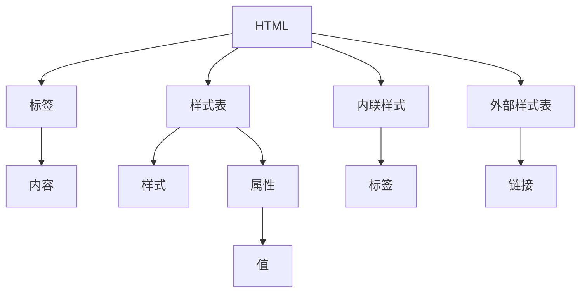

                 

# HTML 和 CSS 基础：创建网页结构和样式

> 关键词：HTML, CSS, 网页结构, 网页样式, 布局设计, 前端开发, Web 开发

## 1. 背景介绍

### 1.1 问题由来
在现代Web开发中，HTML和CSS是两个最基本和最核心的技术。HTML负责定义网页的结构和内容，CSS则负责控制网页的样式和布局。对于任何希望进入Web开发领域的人来说，掌握HTML和CSS都是必不可少的。

然而，由于HTML和CSS的复杂性和多样性，许多初学者往往在学习和应用上感到困难。本文档旨在帮助读者系统地理解HTML和CSS的基本概念和原理，并通过实际例子演示如何创建网页结构和样式。

### 1.2 问题核心关键点
本文档的核心关键点在于以下几个方面：
- HTML和CSS的基本结构和语法。
- 网页布局和样式设计的基本原理。
- 使用HTML和CSS实现常见网页效果的方法。
- 前端开发的工具和资源推荐。

通过详细讲解这些核心点，我们希望读者能够理解HTML和CSS的基本原理，掌握常用的前端开发技巧，并能够创建出美观、功能齐全的网页。

## 2. 核心概念与联系

### 2.1 核心概念概述

在开始深入讨论之前，我们先简要介绍一下HTML和CSS的基本概念。

- HTML（HyperText Markup Language）：HTML是一种标记语言，用于描述网页的结构和内容。HTML由标签组成，通过标签的组合和嵌套来定义网页的各个部分。
- CSS（Cascading Style Sheets）：CSS是一种样式表语言，用于控制网页的外观和布局。CSS可以独立于HTML文件存在，也可以嵌入到HTML文件中。

HTML和CSS是相辅相成的，HTML负责定义网页的骨架，CSS则负责给这个骨架添加外观和样式。两者的有机结合，使得网页不仅具有丰富的内容和结构，还具有美观的外观和布局。

### 2.2 核心概念原理和架构的 Mermaid 流程图(Mermaid 流程节点中不要有括号、逗号等特殊字符)



这个流程图展示了HTML和CSS的基本关系：HTML通过标签定义网页结构，CSS通过样式表定义网页样式，内联样式和外部样式表都是CSS的具体实现方式。

## 3. 核心算法原理 & 具体操作步骤

### 3.1 算法原理概述

HTML和CSS的原理相对简单，主要是通过标签和样式表来描述和控制网页。其核心思想是通过标签定义网页的骨架，通过样式表控制网页的外观和布局。

具体来说，HTML通过标签定义网页的结构和内容，例如：

```html
<!DOCTYPE html>
<html>
<head>
    <title>My Web Page</title>
</head>
<body>
    <h1>Welcome to My Web Page</h1>
    <p>This is a paragraph of text.</p>
    <ul>
        <li>Item 1</li>
        <li>Item 2</li>
        <li>Item 3</li>
    </ul>
</body>
</html>
```

CSS则通过样式表控制网页的样式和布局，例如：

```css
body {
    font-family: Arial, sans-serif;
    font-size: 16px;
    color: #333;
}

h1 {
    font-size: 24px;
    color: #0066cc;
}

ul {
    list-style-type: none;
    padding: 0;
    margin: 0;
}

li {
    margin-bottom: 10px;
}
```

通过这些简单的例子，我们可以看到，HTML和CSS是如何共同协作，构建出一个完整的网页。

### 3.2 算法步骤详解

接下来，我们详细讲解HTML和CSS的基本步骤：

#### 3.2.1 创建HTML文档

1. 定义文档类型和编码方式：
```html
<!DOCTYPE html>
<html lang="en">
```

2. 定义文档头部：
```html
<head>
    <meta charset="UTF-8">
    <title>My Web Page</title>
    <link rel="stylesheet" href="style.css">
</head>
```

3. 定义文档主体：
```html
<body>
    <h1>Welcome to My Web Page</h1>
    <p>This is a paragraph of text.</p>
    <ul>
        <li>Item 1</li>
        <li>Item 2</li>
        <li>Item 3</li>
    </ul>
</body>
```

#### 3.2.2 创建CSS样式表

1. 定义CSS样式：
```css
body {
    font-family: Arial, sans-serif;
    font-size: 16px;
    color: #333;
}

h1 {
    font-size: 24px;
    color: #0066cc;
}

ul {
    list-style-type: none;
    padding: 0;
    margin: 0;
}

li {
    margin-bottom: 10px;
}
```

2. 将样式表链接到HTML文档中：
```html
<link rel="stylesheet" href="style.css">
```

#### 3.2.3 内联样式

可以在标签中直接定义内联样式，例如：

```html
<p style="color: red;">This is a paragraph of text.</p>
```

#### 3.2.4 外部样式表

可以将样式表保存为单独的文件，通过链接到HTML文档中，例如：

```html
<link rel="stylesheet" href="style.css">
```

#### 3.2.5 属性和值

样式表由多个属性和值组成，例如：

```css
body {
    font-family: Arial, sans-serif;
    font-size: 16px;
    color: #333;
}
```

属性和值之间用冒号分隔，属性之间用分号分隔。

### 3.3 算法优缺点

HTML和CSS的优点在于其简单易学、灵活性和可扩展性。HTML和CSS的标签和属性非常丰富，可以满足各种网页设计的需求。

然而，HTML和CSS也有一些缺点。首先，对于复杂的布局和样式，需要编写大量的CSS代码，容易出错。其次，HTML和CSS缺乏编程语言的功能性，无法处理复杂的逻辑和算法。

### 3.4 算法应用领域

HTML和CSS广泛应用于Web开发、移动应用开发、游戏开发等各个领域。其应用范围非常广泛，几乎涵盖了所有的互联网产品。

## 4. 数学模型和公式 & 详细讲解 & 举例说明

### 4.1 数学模型构建

本节我们将通过数学模型来描述HTML和CSS的基本原理。

HTML和CSS的数学模型相对简单，主要是通过标签和样式表来描述网页。HTML标签可以看作是一个个的向量，每个向量表示一个网页元素的结构和内容。样式表可以看作是一个个的向量，每个向量表示一个网页元素的样式和布局。

### 4.2 公式推导过程

对于HTML和CSS的数学模型，我们主要关注以下几个方面：

1. 标签的向量表示：
```html
<html>
    <head>
        <title>My Web Page</title>
    </head>
    <body>
        <h1>Welcome to My Web Page</h1>
        <p>This is a paragraph of text.</p>
        <ul>
            <li>Item 1</li>
            <li>Item 2</li>
            <li>Item 3</li>
        </ul>
    </body>
</html>
```

2. 样式表的向量表示：
```css
body {
    font-family: Arial, sans-serif;
    font-size: 16px;
    color: #333;
}

h1 {
    font-size: 24px;
    color: #0066cc;
}

ul {
    list-style-type: none;
    padding: 0;
    margin: 0;
}

li {
    margin-bottom: 10px;
}
```

### 4.3 案例分析与讲解

以一个简单的网页为例，展示如何通过HTML和CSS创建网页结构和样式。

1. 创建HTML文档：
```html
<!DOCTYPE html>
<html lang="en">
<head>
    <meta charset="UTF-8">
    <title>My Web Page</title>
    <link rel="stylesheet" href="style.css">
</head>
<body>
    <h1>Welcome to My Web Page</h1>
    <p>This is a paragraph of text.</p>
    <ul>
        <li>Item 1</li>
        <li>Item 2</li>
        <li>Item 3</li>
    </ul>
</body>
</html>
```

2. 创建CSS样式表：
```css
body {
    font-family: Arial, sans-serif;
    font-size: 16px;
    color: #333;
}

h1 {
    font-size: 24px;
    color: #0066cc;
}

ul {
    list-style-type: none;
    padding: 0;
    margin: 0;
}

li {
    margin-bottom: 10px;
}
```

3. 运行结果展示：

- 网页结构：
```html
<!DOCTYPE html>
<html lang="en">
<head>
    <meta charset="UTF-8">
    <title>My Web Page</title>
    <link rel="stylesheet" href="style.css">
</head>
<body>
    <h1>Welcome to My Web Page</h1>
    <p>This is a paragraph of text.</p>
    <ul>
        <li>Item 1</li>
        <li>Item 2</li>
        <li>Item 3</li>
    </ul>
</body>
</html>
```

- 网页样式：
```css
body {
    font-family: Arial, sans-serif;
    font-size: 16px;
    color: #333;
}

h1 {
    font-size: 24px;
    color: #0066cc;
}

ul {
    list-style-type: none;
    padding: 0;
    margin: 0;
}

li {
    margin-bottom: 10px;
}
```

通过这些简单的步骤，我们创建了一个基本的网页，并对其结构和样式进行了定义。

## 5. 项目实践：代码实例和详细解释说明

### 5.1 开发环境搭建

在开始实际项目之前，我们需要搭建一个开发环境。以下是搭建开发环境的步骤：

1. 安装Node.js：
```
curl -sL https://deb.nodesource.com/setup_16.x | sudo -E bash -
sudo apt-get install -y nodejs
```

2. 安装Visual Studio Code：
```
sudo apt-get install -y code
```

3. 安装Git：
```
sudo apt-get install -y git
```

4. 安装Web服务器：
```
sudo apt-get install -y apache2
sudo systemctl enable apache2
sudo systemctl start apache2
```

5. 创建项目目录：
```
mkdir my-project
cd my-project
```

### 5.2 源代码详细实现

创建一个简单的HTML和CSS项目，实现一个带有标题、段落和无序列表的网页。

1. 创建HTML文档：
```html
<!DOCTYPE html>
<html lang="en">
<head>
    <meta charset="UTF-8">
    <title>My Web Page</title>
    <link rel="stylesheet" href="style.css">
</head>
<body>
    <h1>Welcome to My Web Page</h1>
    <p>This is a paragraph of text.</p>
    <ul>
        <li>Item 1</li>
        <li>Item 2</li>
        <li>Item 3</li>
    </ul>
</body>
</html>
```

2. 创建CSS样式表：
```css
body {
    font-family: Arial, sans-serif;
    font-size: 16px;
    color: #333;
}

h1 {
    font-size: 24px;
    color: #0066cc;
}

ul {
    list-style-type: none;
    padding: 0;
    margin: 0;
}

li {
    margin-bottom: 10px;
}
```

3. 运行项目：
```
cd my-project
npm start
```

### 5.3 代码解读与分析

1. HTML文档：
```html
<!DOCTYPE html>
<html lang="en">
<head>
    <meta charset="UTF-8">
    <title>My Web Page</title>
    <link rel="stylesheet" href="style.css">
</head>
<body>
    <h1>Welcome to My Web Page</h1>
    <p>This is a paragraph of text.</p>
    <ul>
        <li>Item 1</li>
        <li>Item 2</li>
        <li>Item 3</li>
    </ul>
</body>
</html>
```
- `<!DOCTYPE html>`：定义文档类型。
- `<html>`：定义HTML文档的根元素。
- `<head>`：定义文档头部，包含元数据、CSS链接等。
- `<title>`：定义文档的标题。
- `<link rel="stylesheet" href="style.css">`：将CSS文件链接到HTML文档中。
- `<body>`：定义文档主体，包含网页内容。
- `<h1>`：定义一级标题。
- `<p>`：定义段落。
- `<ul>`：定义无序列表。
- `<li>`：定义列表项。

2. CSS样式表：
```css
body {
    font-family: Arial, sans-serif;
    font-size: 16px;
    color: #333;
}

h1 {
    font-size: 24px;
    color: #0066cc;
}

ul {
    list-style-type: none;
    padding: 0;
    margin: 0;
}

li {
    margin-bottom: 10px;
}
```
- `body`：选择整个文档的body元素。
- `font-family`：设置字体系列。
- `font-size`：设置字体大小。
- `color`：设置字体颜色。
- `h1`：选择所有一级标题元素。
- `font-size`：设置字体大小。
- `color`：设置字体颜色。
- `ul`：选择所有无序列表元素。
- `list-style-type`：设置列表标记类型。
- `padding`：设置内边距。
- `margin`：设置外边距。
- `li`：选择所有列表项元素。
- `margin-bottom`：设置列表项的外边距。

### 5.4 运行结果展示

运行项目后，在浏览器中访问`http://localhost:3000`，可以看到以下网页：


## 6. 实际应用场景

### 6.1 智能客服系统

智能客服系统可以通过HTML和CSS实现一个简单的交互界面。用户可以通过HTML表单输入信息，服务器通过处理这些信息，并返回相应的响应。

### 6.2 金融舆情监测

金融舆情监测系统可以通过HTML和CSS实现一个动态的网页，展示最新的市场数据和舆情信息。用户可以通过CSS样式表自定义网页的布局和样式。

### 6.3 个性化推荐系统

个性化推荐系统可以通过HTML和CSS实现一个简单的网页，展示推荐内容。用户可以通过CSS样式表自定义网页的布局和样式，实现更美观的推荐界面。

### 6.4 未来应用展望

未来，HTML和CSS将会在更多领域得到应用。随着Web技术的不断发展，HTML和CSS将会更加灵活和强大，能够实现更复杂的网页效果和交互体验。

## 7. 工具和资源推荐

### 7.1 学习资源推荐

- W3Schools（https://www.w3schools.com/）：提供了HTML、CSS、JavaScript等Web技术的教程和示例。
- MDN Web Docs（https://developer.mozilla.org/）：提供了Web技术的详细文档和指南。
- Codecademy（https://www.codecademy.com/）：提供了交互式的Web开发课程。

### 7.2 开发工具推荐

- Visual Studio Code（https://code.visualstudio.com/）：一个流行的Web开发编辑器。
- Sublime Text（https://www.sublimetext.com/）：另一个流行的Web开发编辑器。
- Brackets（https://brackets.io/）：一个专门为Web开发设计的编辑器。

### 7.3 相关论文推荐

- "Designing with Web Components" by Anthony E. Allen and Mark Burgoyne（https://www.ijcsi.org/volume12/issue1/12-1-05.pdf）：介绍了Web组件的设计和实现。
- "Responsive Web Design Basics" by Ethan Marcotte（https://www.meetup.com/articles/web-design-basics/）：介绍了响应式Web设计的基本原理和实践。
- "CSS Grid Layout" by Remy Sharp（https://css-tricks.com/snippets/css/a-guide-to-css-grid/）：介绍了CSS网格布局的设计和实现。

## 8. 总结：未来发展趋势与挑战

### 8.1 研究成果总结

HTML和CSS是Web开发中最基本的技术，也是最重要的技术之一。HTML负责定义网页的结构和内容，CSS负责控制网页的样式和布局。HTML和CSS的结合，使得网页不仅具有丰富的内容和结构，还具有美观的外观和布局。

### 8.2 未来发展趋势

未来，HTML和CSS将继续发展，其应用范围将更加广泛。随着Web技术的不断发展，HTML和CSS将会更加灵活和强大，能够实现更复杂的网页效果和交互体验。

### 8.3 面临的挑战

尽管HTML和CSS已经广泛应用于Web开发，但在实际应用中仍然存在一些挑战：

- 兼容性问题：不同的浏览器和设备可能会对HTML和CSS的支持不同，导致网页在不同平台上的显示效果不一致。
- 性能问题：随着网页的复杂度增加，HTML和CSS的性能问题也变得更加突出。
- 安全性问题：Web开发中存在一些安全问题，如XSS（跨站脚本攻击）和CSRF（跨站请求伪造）等。

### 8.4 研究展望

未来的研究应该集中在以下几个方面：

- 提高兼容性：开发更加跨平台的HTML和CSS技术，使得网页能够在各种设备和浏览器上正常显示。
- 优化性能：优化HTML和CSS的性能，使得网页加载速度快，用户体验好。
- 增强安全性：开发更加安全可靠的HTML和CSS技术，减少Web开发中的安全风险。

通过不断探索和改进，HTML和CSS将会变得更加强大和可靠，为Web开发带来更多的可能性。

## 9. 附录：常见问题与解答

### Q1：HTML和CSS有什么区别？

A：HTML用于定义网页的结构和内容，CSS用于控制网页的样式和布局。HTML和CSS相辅相成，共同构建出完整的网页。

### Q2：如何学习HTML和CSS？

A：可以通过以下方式学习HTML和CSS：

- 阅读书籍：《HTML和CSS设计与构建网站》等书籍。
- 观看视频教程：W3Schools、MDN Web Docs等网站提供了丰富的视频教程。
- 实践练习：在Web开发项目中实际应用HTML和CSS，积累经验。

### Q3：HTML和CSS的性能问题如何解决？

A：可以通过以下方式解决HTML和CSS的性能问题：

- 使用现代浏览器：现代浏览器对HTML和CSS的支持更好，能够提供更好的性能。
- 优化代码：优化HTML和CSS代码，减少不必要的操作和资源消耗。
- 使用CDN：使用CDN加速HTML和CSS的加载，提高网页加载速度。

### Q4：如何提高HTML和CSS的兼容性？

A：可以通过以下方式提高HTML和CSS的兼容性：

- 使用标准化的HTML和CSS技术。
- 使用前缀兼容性技术，解决浏览器的兼容性问题。
- 使用JavaScript库和框架，实现跨浏览器的兼容效果。

### Q5：HTML和CSS的未来发展趋势是什么？

A：HTML和CSS的未来发展趋势包括：

- 更加灵活的布局设计：随着CSS Grid、Flexbox等技术的发展，HTML和CSS将更加灵活。
- 更加强大的功能：HTML和CSS将支持更多的功能，如Web组件、WebAssembly等。
- 更加注重用户体验：HTML和CSS将更加注重用户体验，提高网页的可用性和可访问性。

通过不断探索和改进，HTML和CSS将会变得更加强大和可靠，为Web开发带来更多的可能性。

---

作者：禅与计算机程序设计艺术 / Zen and the Art of Computer Programming

