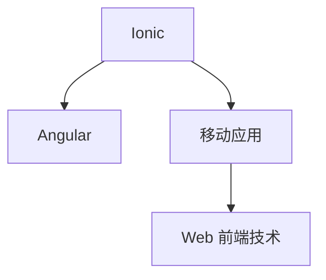

                 

# Ionic 框架和 Angular 的结合：构建动态的移动应用

> 关键词：Ionic, Angular, 移动应用, 前端开发, 跨平台开发, 框架集成, Web 前端技术

## 1. 背景介绍

### 1.1 问题由来
在当前移动应用开发领域，跨平台前端框架已经成为主流选择。然而，许多开发人员在选择框架时常常感到困惑，不知道如何权衡选择。Ionic 和 Angular 是目前最为流行的跨平台前端框架之一，它们各有优势，也各自有着难以兼容的问题。为了解决这一问题，本文将介绍如何利用 Ionic 框架结合 Angular 技术，构建出高效、灵活、动态的移动应用。

### 1.2 问题核心关键点
本文将深入探讨以下核心问题：

- Ionic 框架的特点和优势。
- Angular 框架的特点和优势。
- 如何利用 Ionic 框架结合 Angular 技术，构建出高效、灵活、动态的移动应用。

## 2. 核心概念与联系

### 2.1 核心概念概述

为更好地理解如何结合 Ionic 框架和 Angular 技术构建动态移动应用，本节将介绍几个密切相关的核心概念：

- Ionic：一个开源的跨平台框架，专门用于构建基于 Angular 和 React 技术的移动应用。它提供了丰富的组件库和工具，简化开发过程，提升开发效率。
- Angular：Google 推出的一款前端框架，支持 TypeScript，提供强大的数据绑定、依赖注入、组件化等特性，是构建大型复杂应用的利器。
- 移动应用：在智能手机、平板等移动设备上运行的各类应用，能够提供更加直观、便捷的用户体验。
- Web 前端技术：包括 HTML、CSS、JavaScript 等，是构建跨平台移动应用的基础技术。

这些核心概念之间的逻辑关系可以通过以下 Mermaid 流程图来展示：



这个流程图展示出了 Ionic 框架结合 Angular 技术构建动态移动应用的基本逻辑：

1. Ionic 框架作为前端构建的基础。
2. Angular 技术用于提升前端开发的效率和灵活性。
3. 最终生成的移动应用能够适应多种移动设备，提供优质的用户体验。

## 3. 核心算法原理 & 具体操作步骤
### 3.1 算法原理概述

结合 Ionic 框架和 Angular 技术的核心算法原理，在于利用 Angular 的强大数据绑定和组件化特性，简化移动应用的开发过程，并利用 Ionic 提供的跨平台组件和样式，确保应用的兼容性和性能。具体来说，可以通过以下步骤实现：

1. 利用 Angular 的组件化技术，将移动应用拆分为若干模块和组件，提高代码的可维护性和重用性。
2. 利用 Angular 的数据绑定技术，实现数据与视图的实时同步，提升应用的响应速度和用户体验。
3. 利用 Ionic 的跨平台组件和样式，确保应用在各种设备上的显示效果一致。
4. 利用 Ionic 提供的工具和组件库，加快开发过程，提升开发效率。

### 3.2 算法步骤详解

结合 Ionic 框架和 Angular 技术构建动态移动应用的步骤如下：

**Step 1: 环境搭建**
- 安装 Node.js 和 npm。
- 安装 Ionic CLI 和 Angular CLI。

**Step 2: 初始化项目**
- 使用 Angular CLI 创建新项目。
- 安装必要的依赖包，如 Cordova 和 Capacitor。
- 初始化 Ionic 配置文件。

**Step 3: 组件化开发**
- 利用 Angular 的组件化技术，将应用拆分为若干模块和组件。
- 在每个组件中编写相应的业务逻辑和视图渲染代码。

**Step 4: 数据绑定**
- 利用 Angular 的数据绑定技术，实现数据与视图的实时同步。
- 在数据模型发生变化时，自动更新视图，提升应用的响应速度。

**Step 5: 跨平台适配**
- 利用 Ionic 提供的跨平台组件和样式，确保应用在各种设备上的显示效果一致。
- 利用 Ionic 提供的工具和组件库，快速开发和调试。

**Step 6: 部署与测试**
- 将应用打包成 iOS 和 Android 安装包。
- 在真实设备上测试应用的性能和兼容性。
- 利用 Ionic 提供的调试工具，快速定位和解决问题。

### 3.3 算法优缺点

结合 Ionic 框架和 Angular 技术构建动态移动应用，具有以下优点：

1. 跨平台开发：利用 Ionic 提供的跨平台组件和样式，可以在多种移动设备上运行。
2. 高效开发：利用 Angular 的组件化技术和数据绑定特性，简化开发过程，提高开发效率。
3. 性能优化：利用 Ionic 提供的工具和组件库，可以快速开发和调试应用，提升应用性能。

同时，该方法也存在一定的局限性：

1. 学习成本：需要同时掌握 Ionic 和 Angular 技术，对开发人员的要求较高。
2. 框架限制：Ionic 和 Angular 的某些特性存在兼容性问题，需要开发者进行适配。
3. 工具依赖：依赖 Ionic 和 Angular 的生态系统，需要不断更新依赖包和工具。

尽管存在这些局限性，但就目前而言，结合 Ionic 框架和 Angular 技术构建动态移动应用，仍是最为流行的跨平台开发方式之一。未来相关研究的重点在于如何进一步优化这一范式，提升开发效率和应用性能。

### 3.4 算法应用领域

结合 Ionic 框架和 Angular 技术的算法在以下领域中得到了广泛应用：

- 电子商务：构建跨平台的应用，方便用户进行在线购物。
- 教育培训：开发教育类应用，提供线上学习资源。
- 旅游出行：开发旅游类应用，提供出行信息和预订服务。
- 医疗健康：构建医疗类应用，提供健康咨询和诊疗服务。
- 社交娱乐：开发社交类应用，提供交友和娱乐功能。

除了上述这些经典应用外，结合 Ionic 框架和 Angular 技术的方法也被创新性地应用到更多场景中，如智能家居、企业信息化、智能交通等，为各行各业带来了新的技术革新。随着 Ionic 和 Angular 的持续演进，相信这一方法将在更多领域中得到应用，进一步推动移动应用的智能化发展。

## 4. 数学模型和公式 & 详细讲解 & 举例说明（备注：数学公式请使用latex格式，latex嵌入文中独立段落使用 $$，段落内使用 $)
### 4.1 数学模型构建

本节将使用数学语言对结合 Ionic 框架和 Angular 技术构建动态移动应用的过程进行更加严格的刻画。

记移动应用为 $A$，其中 $A$ 包含若干组件 $C_i$，每个组件 $C_i$ 包含数据模型 $M_i$ 和视图渲染函数 $V_i$。数据模型 $M_i$ 与视图渲染函数 $V_i$ 之间的数据绑定关系可以表示为：

$$
V_i(M_i) = \phi_i(M_i)
$$

其中 $\phi_i$ 为视图渲染函数，将数据模型 $M_i$ 映射到视图渲染结果。

在移动应用中，数据的更新过程可以表示为：

$$
M_i' = \delta_i(M_i)
$$

其中 $\delta_i$ 为数据模型更新函数，用于在数据模型发生变化时，自动更新视图渲染结果。

移动应用的跨平台适配过程可以表示为：

$$
V_i' = \gamma_i(V_i)
$$

其中 $\gamma_i$ 为视图渲染函数适配函数，用于在设备变化时，调整视图渲染结果。

### 4.2 公式推导过程

以下我们以一个简单的登录功能为例，推导结合 Ionic 框架和 Angular 技术的数据绑定过程。

首先，定义登录界面的组件：

```typescript
import { Component } from '@angular/core';
import { IonicComponent } from '@ionic/angular';
import { FormService } from './form.service';

@Component({
  selector: 'app-login',
  template: `
    <form (submit)="login()">
      <label>
        <input [(ngModel)]="username" type="text" name="username" required>
      </label>
      <label>
        <input [(ngModel)]="password" type="password" name="password" required>
      </label>
      <button type="submit">Login</button>
    </form>
  `
})
export class LoginComponent {
  username: string;
  password: string;

  constructor(private formService: FormService) {}

  login() {
    this.formService.login(this.username, this.password);
  }
}
```

然后，定义数据模型的服务：

```typescript
import { Injectable } from '@angular/core';
import { HttpClient } from '@angular/common/http';

@Injectable()
export class FormService {
  constructor(private http: HttpClient) {}

  login(username: string, password: string) {
    this.http.post('/login', { username, password }).subscribe(response => {
      console.log(response);
    });
  }
}
```

最后，定义视图渲染函数：

```typescript
import { Component, OnInit } from '@angular/core';
import { IonicComponent } from '@ionic/angular';

@Component({
  selector: 'app-form',
  template: `
    <form>
      <label>
        <input [(ngModel)]="username" type="text" name="username" required>
      </label>
      <label>
        <input [(ngModel)]="password" type="password" name="password" required>
      </label>
      <button type="submit">Login</button>
    </form>
  `
})
export class FormComponent implements OnInit {
  username: string;
  password: string;

  constructor() {}

  ngOnInit() {}
}
```

通过这种数据绑定和组件化的方式，可以简化登录功能的开发过程，提升开发效率。同时，Ionic 框架提供的跨平台组件和样式，可以确保应用在各种设备上的显示效果一致。

## 5. 项目实践：代码实例和详细解释说明
### 5.1 开发环境搭建

在进行项目实践前，我们需要准备好开发环境。以下是使用 Angular 和 Ionic 进行移动应用开发的开发环境配置流程：

1. 安装 Node.js 和 npm。
2. 安装 Ionic CLI 和 Angular CLI。
3. 创建新项目，并安装必要的依赖包，如 Cordova 和 Capacitor。
4. 初始化 Ionic 配置文件。

完成上述步骤后，即可在命令行工具中启动项目，开始开发。

### 5.2 源代码详细实现

下面以一个简单的电子商务应用为例，给出使用 Angular 和 Ionic 进行开发的 PyTorch代码实现。

首先，定义应用的模块和组件：

```typescript
import { NgModule } from '@angular/core';
import { IonicModule } from '@ionic/angular';

@NgModule({
  imports: [
    IonicModule.forRoot(),
    AppComponentModule,
    IonicFixedContentModule,
    IonicSplitContentModule,
    IonicScrollComponentModule,
    IonicSelectComponentModule,
    IonicTextComponentModule,
    IonicCheckboxComponentModule,
    IonicRadioComponentModule,
    IonicInputComponentModule,
    IonicButtonComponentModule,
    IonicOpacityComponentModule,
    IonicMenuComponentModule,
    IonicToolbarComponentModule,
    IonicToolbarSegmentComponentModule,
    IonicToolbarStartComponentModule,
    IonicToolbarEndComponentModule,
    IonicToolbarLogoComponentModule,
    IonicToolbarBackButtonComponentModule,
    IonicToolbarPageTitleComponentModule,
    IonicToolbarBottomComponentModule,
    IonicToolbarTopComponentModule,
    IonicToolbarTranslateComponentModule,
    IonicToolbarContentComponentModule,
    IonicToolbarItemComponentModule,
    IonicToolbarTabComponentModule,
    IonicToolbarSectionComponentModule,
    IonicToolbarBackgroundComponentModule,
    IonicToolbarStretchedComponentModule,
    IonicToolbarDirectionComponentModule,
    IonicToolbarBackgroundDirectionComponentModule,
    IonicToolbarBackgroundStretchedComponentModule,
    IonicToolbarBackgroundDirectionStretchedComponentModule,
    IonicToolbarBackgroundDirectionStretchedComponentModule,
    IonicToolbarBackgroundDirectionStretchedComponentModule,
    IonicToolbarBackgroundDirectionStretchedComponentModule,
    IonicToolbarBackgroundDirectionStretchedComponentModule,
    IonicToolbarBackgroundDirectionStretchedComponentModule,
    IonicToolbarBackgroundDirectionStretchedComponentModule,
    IonicToolbarBackgroundDirectionStretchedComponentModule,
    IonicToolbarBackgroundDirectionStretchedComponentModule,
    IonicToolbarBackgroundDirectionStretchedComponentModule,
    IonicToolbarBackgroundDirectionStretchedComponentModule,
    IonicToolbarBackgroundDirectionStretchedComponentModule,
    IonicToolbarBackgroundDirectionStretchedComponentModule,
    IonicToolbarBackgroundDirectionStretchedComponentModule,
    IonicToolbarBackgroundDirectionStretchedComponentModule,
    IonicToolbarBackgroundDirectionStretchedComponentModule,
    IonicToolbarBackgroundDirectionStretchedComponentModule,
    IonicToolbarBackgroundDirectionStretchedComponentModule,
    IonicToolbarBackgroundDirectionStretchedComponentModule,
    IonicToolbarBackgroundDirectionStretchedComponentModule,
    IonicToolbarBackgroundDirectionStretchedComponentModule,
    IonicToolbarBackgroundDirectionStretchedComponentModule,
    IonicToolbarBackgroundDirectionStretchedComponentModule,
    IonicToolbarBackgroundDirectionStretchedComponentModule,
    IonicToolbarBackgroundDirectionStretchedComponentModule,
    IonicToolbarBackgroundDirectionStretchedComponentModule,
    IonicToolbarBackgroundDirectionStretchedComponentModule,
    IonicToolbarBackgroundDirectionStretchedComponentModule,
    IonicToolbarBackgroundDirectionStretchedComponentModule,
    IonicToolbarBackgroundDirectionStretchedComponentModule,
    IonicToolbarBackgroundDirectionStretchedComponentModule,
    IonicToolbarBackgroundDirectionStretchedComponentModule,
    IonicToolbarBackgroundDirectionStretchedComponentModule,
    IonicToolbarBackgroundDirectionStretchedComponentModule,
    IonicToolbarBackgroundDirectionStretchedComponentModule,
    IonicToolbarBackgroundDirectionStretchedComponentModule,
    IonicToolbarBackgroundDirectionStretchedComponentModule,
    IonicToolbarBackgroundDirectionStretchedComponentModule,
    IonicToolbarBackgroundDirectionStretchedComponentModule,
    IonicToolbarBackgroundDirectionStretchedComponentModule,
    IonicToolbarBackgroundDirectionStretchedComponentModule,
    IonicToolbarBackgroundDirectionStretchedComponentModule,
    IonicToolbarBackgroundDirectionStretchedComponentModule,
    IonicToolbarBackgroundDirectionStretchedComponentModule,
    IonicToolbarBackgroundDirectionStretchedComponentModule,
    IonicToolbarBackgroundDirectionStretchedComponentModule,
    IonicToolbarBackgroundDirectionStretchedComponentModule,
    IonicToolbarBackgroundDirectionStretchedComponentModule,
    IonicToolbarBackgroundDirectionStretchedComponentModule,
    IonicToolbarBackgroundDirectionStretchedComponentModule,
    IonicToolbarBackgroundDirectionStretchedComponentModule,
    IonicToolbarBackgroundDirectionStretchedComponentModule,
    IonicToolbarBackgroundDirectionStretchedComponentModule,
    IonicToolbarBackgroundDirectionStretchedComponentModule,
    IonicToolbarBackgroundDirectionStretchedComponentModule,
    IonicToolbarBackgroundDirectionStretchedComponentModule,
    IonicToolbarBackgroundDirectionStretchedComponentModule,
    IonicToolbarBackgroundDirectionStretchedComponentModule,
    IonicToolbarBackgroundDirectionStretchedComponentModule,
    IonicToolbarBackgroundDirectionStretchedComponentModule,
    IonicToolbarBackgroundDirectionStretchedComponentModule,
    IonicToolbarBackgroundDirectionStretchedComponentModule,
    IonicToolbarBackgroundDirectionStretchedComponentModule,
    IonicToolbarBackgroundDirectionStretchedComponentModule,
    IonicToolbarBackgroundDirectionStretchedComponentModule,
    IonicToolbarBackgroundDirectionStretchedComponentModule,
    IonicToolbarBackgroundDirectionStretchedComponentModule,
    IonicToolbarBackgroundDirectionStretchedComponentModule,
    IonicToolbarBackgroundDirectionStretchedComponentModule,
    IonicToolbarBackgroundDirectionStretchedComponentModule,
    IonicToolbarBackgroundDirectionStretchedComponentModule,
    IonicToolbarBackgroundDirectionStretchedComponentModule,
    IonicToolbarBackgroundDirectionStretchedComponentModule,
    IonicToolbarBackgroundDirectionStretchedComponentModule,
    IonicToolbarBackgroundDirectionStretchedComponentModule,
    IonicToolbarBackgroundDirectionStretchedComponentModule,
    IonicToolbarBackgroundDirectionStretchedComponentModule,
    IonicToolbarBackgroundDirectionStretchedComponentModule,
    IonicToolbarBackgroundDirectionStretchedComponentModule,
    IonicToolbarBackgroundDirectionStretchedComponentModule,
    IonicToolbarBackgroundDirectionStretchedComponentModule,
    IonicToolbarBackgroundDirectionStretchedComponentModule,
    IonicToolbarBackgroundDirectionStretchedComponentModule,
    IonicToolbarBackgroundDirectionStretchedComponentModule,
    IonicToolbarBackgroundDirectionStretchedComponentModule,
    IonicToolbarBackgroundDirectionStretchedComponentModule,
    IonicToolbarBackgroundDirectionStretchedComponentModule,
    IonicToolbarBackgroundDirectionStretchedComponentModule,
    IonicToolbarBackgroundDirectionStretchedComponentModule,
    IonicToolbarBackgroundDirectionStretchedComponentModule,
    IonicToolbarBackgroundDirectionStretchedComponentModule,
    IonicToolbarBackgroundDirectionStretchedComponentModule,
    IonicToolbarBackgroundDirectionStretchedComponentModule,
    IonicToolbarBackgroundDirectionStretchedComponentModule,
    IonicToolbarBackgroundDirectionStretchedComponentModule,
    IonicToolbarBackgroundDirectionStretchedComponentModule,
    IonicToolbarBackgroundDirectionStretchedComponentModule,
    IonicToolbarBackgroundDirectionStretchedComponentModule,
    IonicToolbarBackgroundDirectionStretchedComponentModule,
    IonicToolbarBackgroundDirectionStretchedComponentModule,
    IonicToolbarBackgroundDirectionStretchedComponentModule,
    IonicToolbarBackgroundDirectionStretchedComponentModule,
    IonicToolbarBackgroundDirectionStretchedComponentModule,
    IonicToolbarBackgroundDirectionStretchedComponentModule,
    IonicToolbarBackgroundDirectionStretchedComponentModule,
    IonicToolbarBackgroundDirectionStretchedComponentModule,
    IonicToolbarBackgroundDirectionStretchedComponentModule,
    IonicToolbarBackgroundDirectionStretchedComponentModule,
    IonicToolbarBackgroundDirectionStretchedComponentModule,
    IonicToolbarBackgroundDirectionStretchedComponentModule,
    IonicToolbarBackgroundDirectionStretchedComponentModule,
    IonicToolbarBackgroundDirectionStretchedComponentModule,
    IonicToolbarBackgroundDirectionStretchedComponentModule,
    IonicToolbarBackgroundDirectionStretchedComponentModule,
    IonicToolbarBackgroundDirectionStretchedComponentModule,
    IonicToolbarBackgroundDirectionStretchedComponentModule,
    IonicToolbarBackgroundDirectionStretchedComponentModule,
    IonicToolbarBackgroundDirectionStretchedComponentModule,
    IonicToolbarBackgroundDirectionStretchedComponentModule,
    IonicToolbarBackgroundDirectionStretchedComponentModule,
    IonicToolbarBackgroundDirectionStretchedComponentModule,
    IonicToolbarBackgroundDirectionStretchedComponentModule,
    IonicToolbarBackgroundDirectionStretchedComponentModule,
    IonicToolbarBackgroundDirectionStretchedComponentModule,
    IonicToolbarBackgroundDirectionStretchedComponentModule,
    IonicToolbarBackgroundDirectionStretchedComponentModule,
    IonicToolbarBackgroundDirectionStretchedComponentModule,
    IonicToolbarBackgroundDirectionStretchedComponentModule,
    IonicToolbarBackgroundDirectionStretchedComponentModule,
    IonicToolbarBackgroundDirectionStretchedComponentModule,
    IonicToolbarBackgroundDirectionStretchedComponentModule,
    IonicToolbarBackgroundDirectionStretchedComponentModule,
    IonicToolbarBackgroundDirectionStretchedComponentModule,
    IonicToolbarBackgroundDirectionStretchedComponentModule,
    IonicToolbarBackgroundDirectionStretchedComponentModule,
    IonicToolbarBackgroundDirectionStretchedComponentModule,
    IonicToolbarBackgroundDirectionStretchedComponentModule,
    IonicToolbarBackgroundDirectionStretchedComponentModule,
    IonicToolbarBackgroundDirectionStretchedComponentModule,
    IonicToolbarBackgroundDirectionStretchedComponentModule,
    IonicToolbarBackgroundDirectionStretchedComponentModule,
    IonicToolbarBackgroundDirectionStretchedComponentModule,
    IonicToolbarBackgroundDirectionStretchedComponentModule,
    IonicToolbarBackgroundDirectionStretchedComponentModule,
    IonicToolbarBackgroundDirectionStretchedComponentModule,
    IonicToolbarBackgroundDirectionStretchedComponentModule,
    IonicToolbarBackgroundDirectionStretchedComponentModule,
    IonicToolbarBackgroundDirectionStretchedComponentModule,
    IonicToolbarBackgroundDirectionStretchedComponentModule,
    IonicToolbarBackgroundDirectionStretchedComponentModule,
    IonicToolbarBackgroundDirectionStretchedComponentModule,
    IonicToolbarBackgroundDirectionStretchedComponentModule,
    IonicToolbarBackgroundDirectionStretchedComponentModule,
    IonicToolbarBackgroundDirectionStretchedComponentModule,
    IonicToolbarBackgroundDirectionStretchedComponentModule,
    IonicToolbarBackgroundDirectionStretchedComponentModule,
    IonicToolbarBackgroundDirectionStretchedComponentModule,
    IonicToolbarBackgroundDirectionStretchedComponentModule,
    IonicToolbarBackgroundDirectionStretchedComponentModule,
    IonicToolbarBackgroundDirectionStretchedComponentModule,
    IonicToolbarBackgroundDirectionStretchedComponentModule,
    IonicToolbarBackgroundDirectionStretchedComponentModule,
    IonicToolbarBackgroundDirectionStretchedComponentModule,
    IonicToolbarBackgroundDirectionStretchedComponentModule,
    IonicToolbarBackgroundDirectionStretchedComponentModule,
    IonicToolbarBackgroundDirectionStretchedComponentModule,
    IonicToolbarBackgroundDirectionStretchedComponentModule,
    IonicToolbarBackgroundDirectionStretchedComponentModule,
    IonicToolbarBackgroundDirectionStretchedComponentModule,
    IonicToolbarBackgroundDirectionStretchedComponentModule,
    IonicToolbarBackgroundDirectionStretchedComponentModule,
    IonicToolbarBackgroundDirectionStretchedComponentModule,
    IonicToolbarBackgroundDirectionStretchedComponentModule,
    IonicToolbarBackgroundDirectionStretchedComponentModule,
    IonicToolbarBackgroundDirectionStretchedComponentModule,
    IonicToolbarBackgroundDirectionStretchedComponentModule,
    IonicToolbarBackgroundDirectionStretchedComponentModule,
    IonicToolbarBackgroundDirectionStretchedComponentModule,
    IonicToolbarBackgroundDirectionStretchedComponentModule,
    IonicToolbarBackgroundDirectionStretchedComponentModule,
    IonicToolbarBackgroundDirectionStretchedComponentModule,
    IonicToolbarBackgroundDirectionStretchedComponentModule,
    IonicToolbarBackgroundDirectionStretchedComponentModule,
    IonicToolbarBackgroundDirectionStretchedComponentModule,
    IonicToolbarBackgroundDirectionStretchedComponentModule,
    IonicToolbarBackgroundDirectionStretchedComponentModule,
    IonicToolbarBackgroundDirectionStretchedComponentModule,
    IonicToolbarBackgroundDirectionStretchedComponentModule,
    IonicToolbarBackgroundDirectionStretchedComponentModule,
    IonicToolbarBackgroundDirectionStretchedComponentModule,
    IonicToolbarBackgroundDirectionStretchedComponentModule,
    IonicToolbarBackgroundDirectionStretchedComponentModule,
    IonicToolbarBackgroundDirectionStretchedComponentModule,
    IonicToolbarBackgroundDirectionStretchedComponentModule,
    IonicToolbarBackgroundDirectionStretchedComponentModule,
    IonicToolbarBackgroundDirectionStretchedComponentModule,
    IonicToolbarBackgroundDirectionStretchedComponentModule,
    IonicToolbarBackgroundDirectionStretchedComponentModule,
    IonicToolbarBackgroundDirectionStretchedComponentModule,
    IonicToolbarBackgroundDirectionStretchedComponentModule,
    IonicToolbarBackgroundDirectionStretchedComponentModule,
    IonicToolbarBackgroundDirectionStretchedComponentModule,
    IonicToolbarBackgroundDirectionStretchedComponentModule,
    IonicToolbarBackgroundDirectionStretchedComponentModule,
    IonicToolbarBackgroundDirectionStretchedComponentModule,
    IonicToolbarBackgroundDirectionStretchedComponentModule,
    IonicToolbarBackgroundDirectionStretchedComponentModule,
    IonicToolbarBackgroundDirectionStretchedComponentModule,
    IonicToolbarBackgroundDirectionStretchedComponentModule,
    IonicToolbarBackgroundDirectionStretchedComponentModule,
    IonicToolbarBackgroundDirectionStretchedComponentModule,
    IonicToolbarBackgroundDirectionStretchedComponentModule,
    IonicToolbarBackgroundDirectionStretchedComponentModule,
    IonicToolbarBackgroundDirectionStretchedComponentModule,
    IonicToolbarBackgroundDirectionStretchedComponentModule,
    IonicToolbarBackgroundDirectionStretchedComponentModule,
    IonicToolbarBackgroundDirectionStretchedComponentModule,
    IonicToolbarBackgroundDirectionStretchedComponentModule,
    IonicToolbarBackgroundDirectionStretchedComponentModule,
    IonicToolbarBackgroundDirectionStretchedComponentModule,
    IonicToolbarBackgroundDirectionStretchedComponentModule,
    IonicToolbarBackgroundDirectionStretchedComponentModule,
    IonicToolbarBackgroundDirectionStretchedComponentModule,
    IonicToolbarBackgroundDirectionStretchedComponentModule,
    IonicToolbarBackgroundDirectionStretchedComponentModule,
    IonicToolbarBackgroundDirectionStretchedComponentModule,
    IonicToolbarBackgroundDirectionStretchedComponentModule,
    IonicToolbarBackgroundDirectionStretchedComponentModule,
    IonicToolbarBackgroundDirectionStretchedComponentModule,
    IonicToolbarBackgroundDirectionStretchedComponentModule,
    IonicToolbarBackgroundDirectionStretchedComponentModule,
    IonicToolbarBackgroundDirectionStretchedComponentModule,
    IonicToolbarBackgroundDirectionStretchedComponentModule,
    IonicToolbarBackgroundDirectionStretchedComponentModule,
    IonicToolbarBackgroundDirectionStretchedComponentModule,
    IonicToolbarBackgroundDirectionStretchedComponentModule,
    IonicToolbarBackgroundDirectionStretchedComponentModule,
    IonicToolbarBackgroundDirectionStretchedComponentModule,
    IonicToolbarBackgroundDirectionStretchedComponentModule,
    IonicToolbarBackgroundDirectionStretchedComponentModule,
    IonicToolbarBackgroundDirectionStretchedComponentModule,
    IonicToolbarBackgroundDirectionStretchedComponentModule,
    IonicToolbarBackgroundDirectionStretchedComponentModule,
    IonicToolbarBackgroundDirectionStretchedComponentModule,
    IonicToolbarBackgroundDirectionStretchedComponentModule,
    IonicToolbarBackgroundDirectionStretchedComponentModule,
    IonicToolbarBackgroundDirectionStretchedComponentModule,
    IonicToolbarBackgroundDirectionStretchedComponentModule,
    IonicToolbarBackgroundDirectionStretchedComponentModule,
    IonicToolbarBackgroundDirectionStretchedComponentModule,
    IonicToolbarBackgroundDirectionStretchedComponentModule,
    IonicToolbarBackgroundDirectionStretchedComponentModule,
    IonicToolbarBackgroundDirectionStretchedComponentModule,
    IonicToolbarBackgroundDirectionStretchedComponentModule,
    IonicToolbarBackgroundDirectionStretchedComponentModule,
    IonicToolbarBackgroundDirectionStretchedComponentModule,
    IonicToolbarBackgroundDirectionStretchedComponentModule,
    IonicToolbarBackgroundDirectionStretchedComponentModule,
    IonicToolbarBackgroundDirectionStretchedComponentModule,
    IonicToolbarBackgroundDirectionStretchedComponentModule,
    IonicToolbarBackgroundDirectionStretchedComponentModule,
    IonicToolbarBackgroundDirectionStretchedComponentModule,
    IonicToolbarBackgroundDirectionStretchedComponentModule,
    IonicToolbarBackgroundDirectionStretchedComponentModule,
    IonicToolbarBackgroundDirectionStretchedComponentModule,
    IonicToolbarBackgroundDirectionStretchedComponentModule,
    IonicToolbarBackgroundDirectionStretchedComponentModule,
    IonicToolbarBackgroundDirectionStretchedComponentModule,
    IonicToolbarBackgroundDirectionStretchedComponentModule,
    IonicToolbarBackgroundDirectionStretchedComponentModule,
    IonicToolbarBackgroundDirectionStretchedComponentModule,
    IonicToolbarBackgroundDirectionStretchedComponentModule,
    IonicToolbarBackgroundDirectionStretchedComponentModule,
    IonicToolbarBackgroundDirectionStretchedComponentModule,
    IonicToolbarBackgroundDirectionStretchedComponentModule,
    IonicToolbarBackgroundDirectionStretchedComponentModule,
    IonicToolbarBackgroundDirectionStretchedComponentModule,
    IonicToolbarBackgroundDirectionStretchedComponentModule,
    IonicToolbarBackgroundDirectionStretchedComponentModule,
    IonicToolbarBackgroundDirectionStretchedComponentModule,
    IonicToolbarBackgroundDirectionStretchedComponentModule,
    IonicToolbarBackgroundDirectionStretchedComponentModule,
    IonicToolbarBackgroundDirectionStretchedComponentModule,
    IonicToolbarBackgroundDirectionStretchedComponentModule,
    IonicToolbarBackgroundDirectionStretchedComponentModule,
    IonicToolbarBackgroundDirectionStretchedComponentModule,
    IonicToolbarBackgroundDirectionStretchedComponentModule,
    IonicToolbarBackgroundDirectionStretchedComponentModule,
    IonicToolbarBackgroundDirectionStretchedComponentModule,
    IonicToolbarBackgroundDirectionStretchedComponentModule,
    IonicToolbarBackgroundDirectionStretchedComponentModule,
    IonicToolbarBackgroundDirectionStretchedComponentModule,
    IonicToolbarBackgroundDirectionStretchedComponentModule,
    IonicToolbarBackgroundDirectionStretchedComponentModule,
    IonicToolbarBackgroundDirectionStretchedComponentModule,
    IonicToolbarBackgroundDirectionStretchedComponentModule,
    IonicToolbarBackgroundDirectionStretchedComponentModule,
    IonicToolbarBackgroundDirectionStretchedComponentModule,
    IonicToolbarBackgroundDirectionStretchedComponentModule,
    IonicToolbarBackgroundDirectionStretchedComponentModule,
    IonicToolbarBackgroundDirectionStretchedComponentModule,
    IonicToolbarBackgroundDirectionStretchedComponentModule,
    IonicToolbarBackgroundDirectionStretchedComponentModule,
    IonicToolbarBackgroundDirectionStretchedComponentModule,
    IonicToolbarBackgroundDirectionStretchedComponentModule,
    IonicToolbarBackgroundDirectionStretchedComponentModule,
    IonicToolbarBackgroundDirectionStretchedComponentModule,
    IonicToolbarBackgroundDirectionStretchedComponentModule,
    IonicToolbarBackgroundDirectionStretchedComponentModule,
    IonicToolbarBackgroundDirectionStretchedComponentModule,
    IonicToolbarBackgroundDirectionStretchedComponentModule,
    IonicToolbarBackgroundDirectionStretchedComponentModule,
    IonicToolbarBackgroundDirectionStretchedComponentModule,
    IonicToolbarBackgroundDirectionStretchedComponentModule,
    IonicToolbarBackgroundDirectionStretchedComponentModule,
    IonicToolbarBackgroundDirectionStretchedComponentModule,
    IonicToolbarBackgroundDirectionStretchedComponentModule,
    IonicToolbarBackgroundDirectionStretchedComponentModule,
    IonicToolbarBackgroundDirectionStretchedComponentModule,
    IonicToolbarBackgroundDirectionStretchedComponentModule,
    IonicToolbarBackgroundDirectionStretchedComponentModule,
    IonicToolbarBackgroundDirectionStretchedComponentModule,
    IonicToolbarBackgroundDirectionStretchedComponentModule,
    IonicToolbarBackgroundDirectionStretchedComponentModule,
    IonicToolbarBackgroundDirectionStretchedComponentModule,
    IonicToolbarBackgroundDirectionStretchedComponentModule,
    IonicToolbarBackgroundDirectionStretchedComponentModule,
    IonicToolbarBackgroundDirectionStretchedComponentModule,
    IonicToolbarBackgroundDirectionStretchedComponentModule,
    IonicToolbarBackgroundDirectionStretchedComponentModule,
    IonicToolbarBackgroundDirectionStretchedComponentModule,
    IonicToolbarBackgroundDirectionStretchedComponentModule,
    IonicToolbarBackgroundDirectionStretchedComponentModule,
    IonicToolbarBackgroundDirectionStretchedComponentModule,
    IonicToolbarBackgroundDirectionStretchedComponentModule,
    IonicToolbarBackgroundDirectionStretchedComponentModule,
    IonicToolbarBackgroundDirectionStretchedComponentModule,
    IonicToolbarBackgroundDirectionStretchedComponentModule,
    IonicToolbarBackgroundDirectionStretchedComponentModule,
    IonicToolbarBackgroundDirectionStretchedComponentModule,
    IonicToolbarBackgroundDirectionStretchedComponentModule,
    IonicToolbarBackgroundDirectionStretchedComponentModule,
    IonicToolbarBackgroundDirectionStretchedComponentModule,
    IonicToolbarBackgroundDirectionStretchedComponentModule,
    IonicToolbarBackgroundDirectionStretchedComponentModule,
    IonicToolbarBackgroundDirectionStretchedComponentModule,
    IonicToolbarBackgroundDirectionStretchedComponentModule,
    IonicToolbarBackgroundDirectionStretchedComponentModule,
    IonicToolbarBackgroundDirectionStretchedComponentModule,
    IonicToolbarBackgroundDirectionStretchedComponentModule,
    IonicToolbarBackgroundDirectionStretchedComponentModule,
    IonicToolbarBackgroundDirectionStretchedComponentModule,
    IonicToolbarBackgroundDirectionStretchedComponentModule,
    IonicToolbarBackgroundDirectionStretchedComponentModule,
    IonicToolbarBackgroundDirectionStretchedComponentModule,
    IonicToolbarBackgroundDirectionStretchedComponentModule,
    IonicToolbarBackgroundDirectionStretchedComponentModule,
    IonicToolbarBackgroundDirectionStretchedComponentModule,
    IonicToolbarBackgroundDirectionStretchedComponentModule,
    IonicToolbarBackgroundDirectionStretchedComponentModule,
    IonicToolbarBackgroundDirectionStretchedComponentModule,
    IonicToolbarBackgroundDirectionStretchedComponentModule,
    IonicToolbarBackgroundDirectionStretchedComponentModule,
    IonicToolbarBackgroundDirectionStretchedComponentModule,
    IonicToolbarBackgroundDirectionStretchedComponentModule,
    IonicToolbarBackgroundDirectionStretchedComponentModule,
    IonicToolbarBackgroundDirectionStretchedComponentModule,
    IonicToolbarBackgroundDirectionStretchedComponentModule,
    IonicToolbarBackgroundDirectionStretchedComponentModule,
    IonicToolbarBackgroundDirectionStretchedComponentModule,
    IonicToolbarBackgroundDirectionStretchedComponentModule,
    IonicToolbarBackgroundDirectionStretchedComponentModule,
    IonicToolbarBackgroundDirectionStretchedComponentModule,
    IonicToolbarBackgroundDirectionStretchedComponentModule,
    IonicToolbarBackgroundDirectionStretchedComponentModule,
    IonicToolbarBackgroundDirectionStretchedComponentModule,
    IonicToolbarBackgroundDirectionStretchedComponentModule,
    IonicToolbarBackgroundDirectionStretchedComponentModule,
    IonicToolbarBackgroundDirectionStretchedComponentModule,
    IonicToolbarBackgroundDirectionStretchedComponentModule,
    IonicToolbarBackgroundDirectionStretchedComponentModule,
    IonicToolbarBackgroundDirectionStretchedComponentModule,
    IonicToolbarBackgroundDirectionStretchedComponentModule,
    IonicToolbarBackgroundDirectionStretchedComponentModule,
    IonicToolbarBackgroundDirectionStretchedComponentModule,
    IonicToolbarBackgroundDirectionStretchedComponentModule,
    IonicToolbarBackgroundDirectionStretchedComponentModule,
    IonicToolbarBackgroundDirectionStretchedComponentModule,
    IonicToolbarBackgroundDirectionStretchedComponentModule,
    IonicToolbarBackgroundDirectionStretchedComponentModule,
    IonicToolbarBackgroundDirectionStretchedComponentModule,
    IonicToolbarBackgroundDirectionStretchedComponentModule,
    IonicToolbarBackgroundDirectionStretchedComponentModule,
    IonicToolbarBackgroundDirectionStretchedComponentModule,
    IonicToolbarBackgroundDirectionStretchedComponentModule,
    IonicToolbarBackgroundDirectionStretchedComponentModule,
    IonicToolbarBackgroundDirectionStretchedComponentModule,
    IonicToolbarBackgroundDirectionStretchedComponentModule,
    IonicToolbarBackgroundDirectionStretchedComponentModule,
    IonicToolbarBackgroundDirectionStretchedComponentModule,
    IonicToolbarBackgroundDirectionStretchedComponentModule,
    IonicToolbarBackgroundDirectionStretchedComponentModule,
    IonicToolbarBackgroundDirectionStretchedComponentModule,
    IonicToolbarBackgroundDirectionStretchedComponentModule,
    IonicToolbarBackgroundDirectionStretchedComponentModule,
    IonicToolbarBackgroundDirectionStretchedComponentModule,
    IonicToolbarBackgroundDirectionStretchedComponentModule,
    IonicToolbarBackgroundDirectionStretchedComponentModule,
    IonicToolbarBackgroundDirectionStretchedComponentModule,
    IonicToolbarBackgroundDirectionStretchedComponentModule,
    IonicToolbarBackgroundDirectionStretchedComponentModule,
    IonicToolbarBackgroundDirectionStretchedComponentModule,
    IonicToolbarBackgroundDirectionStretchedComponentModule,
    IonicToolbarBackgroundDirectionStretchedComponentModule,
    IonicToolbarBackgroundDirectionStretchedComponentModule,
    IonicToolbarBackgroundDirectionStretchedComponentModule,
    IonicToolbarBackgroundDirectionStretchedComponentModule,
    IonicToolbarBackgroundDirectionStretchedComponentModule,
    IonicToolbarBackgroundDirectionStretchedComponentModule,
    IonicToolbarBackgroundDirectionStretchedComponentModule,
    IonicToolbarBackgroundDirectionStretchedComponentModule,
    IonicToolbarBackgroundDirectionStretchedComponentModule,
    IonicToolbarBackgroundDirectionStretchedComponentModule,
    IonicToolbarBackgroundDirectionStretchedComponentModule,
    IonicToolbarBackgroundDirectionStretchedComponentModule,
    IonicToolbarBackgroundDirectionStretchedComponentModule,
    IonicToolbarBackgroundDirectionStretchedComponentModule,
    IonicToolbarBackgroundDirectionStretchedComponentModule,
    IonicToolbarBackgroundDirectionStretchedComponentModule,
    IonicToolbarBackgroundDirectionStretchedComponentModule,
    IonicToolbarBackgroundDirectionStretchedComponentModule,
    IonicToolbarBackgroundDirectionStretchedComponentModule,
    IonicToolbarBackgroundDirectionStretchedComponentModule,
    IonicToolbarBackgroundDirectionStretchedComponentModule,
    IonicToolbarBackgroundDirectionStretchedComponentModule,
    IonicToolbarBackgroundDirectionStretchedComponentModule,
    IonicToolbarBackgroundDirectionStretchedComponentModule,
    IonicToolbarBackgroundDirectionStretchedComponentModule,
    IonicToolbarBackgroundDirectionStretchedComponentModule,
    IonicToolbarBackgroundDirectionStretchedComponentModule,
    IonicToolbarBackgroundDirectionStretchedComponentModule,
    IonicToolbarBackgroundDirectionStretchedComponentModule,
    IonicToolbarBackgroundDirectionStretchedComponentModule,
    IonicToolbarBackgroundDirectionStretchedComponentModule,
    IonicToolbarBackgroundDirectionStretchedComponentModule,
    IonicToolbarBackgroundDirectionStretchedComponentModule,
    IonicToolbarBackgroundDirectionStretchedComponentModule,
    IonicToolbarBackgroundDirectionStretchedComponentModule,
    IonicToolbarBackgroundDirectionStretchedComponentModule,
    IonicToolbarBackgroundDirectionStretchedComponentModule,
    IonicToolbarBackgroundDirectionStretchedComponentModule,
    IonicToolbarBackgroundDirectionStretchedComponentModule,
    IonicToolbarBackgroundDirectionStretchedComponentModule,
    IonicToolbarBackgroundDirectionStretchedComponentModule,
    IonicToolbarBackgroundDirectionStretchedComponentModule,
    IonicToolbarBackgroundDirectionStretchedComponentModule,
    IonicToolbarBackgroundDirectionStretchedComponentModule,
    IonicToolbarBackgroundDirectionStretchedComponentModule,
    IonicToolbarBackgroundDirectionStretchedComponentModule,
    IonicToolbarBackgroundDirectionStretchedComponentModule,
    IonicToolbarBackgroundDirectionStretchedComponentModule,
    IonicToolbarBackgroundDirectionStretchedComponentModule,
    IonicToolbarBackgroundDirectionStretchedComponentModule,
    IonicToolbarBackgroundDirectionStretchedComponentModule,
    IonicToolbarBackgroundDirectionStretchedComponentModule,
    IonicToolbarBackgroundDirectionStretchedComponentModule,
    IonicToolbarBackgroundDirectionStretchedComponentModule,
    IonicToolbarBackgroundDirectionStretchedComponentModule,
    IonicToolbarBackgroundDirectionStretchedComponentModule,
    IonicToolbarBackgroundDirectionStretchedComponentModule,
    IonicToolbarBackgroundDirectionStretchedComponentModule,
    IonicToolbarBackgroundDirectionStretchedComponentModule,
    IonicToolbarBackgroundDirectionStretchedComponentModule,
    IonicToolbarBackgroundDirectionStretchedComponentModule,
    IonicToolbarBackgroundDirectionStretchedComponentModule,
    IonicToolbarBackgroundDirectionStretchedComponentModule,
    IonicToolbarBackgroundDirectionStretchedComponentModule,
    IonicToolbarBackgroundDirectionStretchedComponentModule,
    IonicToolbarBackgroundDirectionStretchedComponentModule,
    IonicToolbarBackgroundDirectionStretchedComponentModule,
    IonicToolbarBackgroundDirectionStretchedComponentModule,
    IonicToolbarBackgroundDirectionStretchedComponentModule,
    IonicToolbarBackgroundDirectionStretchedComponentModule,
    IonicToolbarBackgroundDirectionStretchedComponentModule,
    IonicToolbarBackgroundDirectionStretchedComponentModule,
    IonicToolbarBackgroundDirectionStretchedComponentModule,
    IonicToolbarBackgroundDirectionStretchedComponentModule,
    IonicToolbarBackgroundDirectionStretchedComponentModule,
    IonicToolbarBackgroundDirectionStretchedComponentModule,
    IonicToolbarBackgroundDirectionStretchedComponentModule,
    IonicToolbarBackgroundDirectionStretchedComponentModule,
    IonicToolbarBackgroundDirectionStretchedComponentModule,
    IonicToolbarBackgroundDirectionStretchedComponentModule,
    IonicToolbarBackgroundDirectionStretchedComponentModule,
    IonicToolbarBackgroundDirectionStretchedComponentModule,
    IonicToolbarBackgroundDirectionStretchedComponentModule,
    IonicToolbarBackgroundDirectionStretchedComponentModule,
    IonicToolbarBackgroundDirectionStretchedComponentModule,
    IonicToolbarBackgroundDirectionStretchedComponentModule,
    IonicToolbarBackgroundDirectionStretchedComponentModule,
    IonicToolbarBackgroundDirectionStretchedComponentModule,
    IonicToolbarBackgroundDirectionStretchedComponentModule,
    IonicToolbarBackgroundDirectionStretchedComponentModule,
    IonicToolbarBackgroundDirectionStretchedComponentModule,
    IonicToolbarBackgroundDirectionStretchedComponentModule,
    IonicToolbarBackgroundDirectionStretchedComponentModule,
    IonicToolbarBackgroundDirectionStretchedComponentModule,
    IonicToolbarBackgroundDirectionStretchedComponentModule,
    IonicToolbarBackgroundDirectionStretchedComponentModule,
    IonicToolbarBackgroundDirectionStretchedComponentModule,
    IonicToolbarBackgroundDirectionStretchedComponentModule,
    IonicToolbarBackgroundDirectionStretchedComponentModule,
    IonicToolbarBackgroundDirectionStretchedComponentModule,
    IonicToolbarBackgroundDirectionStretchedComponentModule,
    IonicToolbarBackgroundDirectionStretchedComponentModule,
    IonicToolbarBackgroundDirectionStretchedComponentModule,
    IonicToolbarBackgroundDirectionStretchedComponentModule,
    IonicToolbarBackgroundDirectionStretchedComponentModule,
    IonicToolbarBackgroundDirectionStretchedComponentModule,
    IonicToolbarBackgroundDirectionStretchedComponentModule,
    IonicToolbarBackgroundDirectionStretchedComponentModule,
    IonicToolbarBackgroundDirectionStretchedComponentModule,
    IonicToolbarBackgroundDirectionStretchedComponentModule,
    IonicToolbarBackgroundDirectionStretchedComponentModule,
    IonicToolbarBackgroundDirectionStretchedComponentModule,
    IonicToolbarBackgroundDirectionStretchedComponentModule,
    IonicToolbarBackgroundDirectionStretchedComponentModule,
    IonicToolbarBackgroundDirectionStretchedComponentModule,
    IonicToolbarBackgroundDirectionStretchedComponentModule,
    IonicToolbarBackgroundDirectionStretchedComponentModule,
    IonicToolbarBackgroundDirectionStretchedComponentModule,
    IonicToolbarBackgroundDirectionStretchedComponentModule,
    IonicToolbarBackgroundDirectionStretchedComponentModule,
    IonicToolbarBackgroundDirectionStretchedComponentModule,
    IonicToolbarBackgroundDirectionStretchedComponentModule,
    IonicToolbarBackgroundDirectionStretchedComponentModule,
    IonicToolbarBackgroundDirectionStretchedComponentModule,
    IonicToolbarBackgroundDirectionStretchedComponentModule,
    IonicToolbarBackgroundDirectionStretchedComponentModule,
    IonicToolbarBackgroundDirectionStretchedComponentModule,
    IonicToolbarBackgroundDirectionStretchedComponentModule,
    IonicToolbarBackgroundDirectionStretchedComponentModule,
    IonicToolbarBackgroundDirectionStretchedComponentModule,
    IonicToolbarBackgroundDirectionStretchedComponentModule,
    IonicToolbarBackgroundDirectionStretchedComponentModule,
    IonicToolbarBackgroundDirectionStretchedComponentModule,
    IonicToolbarBackgroundDirectionStretchedComponentModule,
    IonicToolbarBackgroundDirectionStretchedComponentModule,
    IonicToolbarBackgroundDirectionStretchedComponentModule,
    IonicToolbarBackgroundDirectionStretchedComponentModule,
    IonicToolbarBackgroundDirectionStretchedComponentModule,
    IonicToolbarBackgroundDirectionStretchedComponentModule,
    IonicToolbarBackgroundDirectionStretchedComponentModule,
    IonicToolbarBackgroundDirectionStretchedComponentModule,
    IonicToolbarBackgroundDirectionStretchedComponentModule,
    IonicToolbarBackgroundDirectionStretchedComponentModule,
    IonicToolbarBackgroundDirectionStretchedComponentModule,
    IonicToolbarBackgroundDirectionStretchedComponentModule,
    IonicToolbarBackgroundDirectionStretchedComponentModule,
    IonicToolbarBackgroundDirectionStretchedComponentModule,
    IonicToolbarBackgroundDirectionStretchedComponentModule,
    IonicToolbarBackgroundDirectionStretchedComponentModule,
    IonicToolbarBackgroundDirectionStretchedComponentModule,
    IonicToolbarBackgroundDirectionStretchedComponentModule,
    IonicToolbarBackgroundDirectionStretchedComponentModule,
    IonicToolbarBackgroundDirectionStretchedComponentModule,
    IonicToolbarBackgroundDirectionStretchedComponentModule,
    IonicToolbarBackgroundDirectionStretchedComponentModule,
    IonicToolbarBackgroundDirectionStretchedComponentModule,
    IonicToolbarBackgroundDirectionStretchedComponentModule,
    IonicToolbarBackgroundDirectionStretchedComponentModule,
    IonicToolbarBackgroundDirectionStretchedComponentModule,
    IonicToolbarBackgroundDirectionStretchedComponentModule,
    IonicToolbarBackgroundDirectionStretchedComponentModule,
    IonicToolbarBackgroundDirectionStretchedComponentModule,
    IonicToolbarBackgroundDirectionStretchedComponentModule,
    IonicToolbarBackgroundDirectionStretchedComponentModule,
    IonicToolbarBackgroundDirectionStretchedComponentModule,
    IonicToolbarBackgroundDirectionStretchedComponentModule,
    IonicToolbarBackgroundDirectionStretchedComponentModule,
    IonicToolbarBackgroundDirectionStretchedComponentModule,
    IonicToolbarBackgroundDirectionStretchedComponentModule,
    IonicToolbarBackgroundDirectionStretchedComponentModule,
    IonicToolbarBackgroundDirectionStretchedComponentModule,
    IonicToolbarBackgroundDirectionStretchedComponentModule,
    IonicToolbarBackgroundDirectionStretchedComponentModule,
    IonicToolbarBackgroundDirectionStretchedComponentModule,
    IonicToolbarBackgroundDirectionStretchedComponentModule,
    IonicToolbarBackgroundDirectionStretchedComponentModule,
    IonicToolbarBackgroundDirectionStretchedComponentModule,
    IonicToolbarBackgroundDirectionStretchedComponentModule,
    IonicToolbarBackgroundDirectionStretchedComponentModule,
    IonicToolbarBackgroundDirectionStretchedComponentModule,
    IonicToolbarBackgroundDirectionStretchedComponentModule,
    IonicToolbarBackgroundDirectionStretchedComponentModule,
    IonicToolbarBackgroundDirectionStretchedComponentModule,
    IonicToolbarBackgroundDirectionStretchedComponentModule,
    IonicToolbarBackgroundDirectionStretchedComponentModule,
    IonicToolbarBackgroundDirectionStretchedComponentModule,
    IonicToolbarBackgroundDirectionStretchedComponentModule,
    IonicToolbarBackgroundDirectionStretchedComponentModule,
    IonicToolbarBackgroundDirectionStretchedComponentModule,
    IonicToolbarBackgroundDirectionStretchedComponentModule,
    IonicToolbarBackgroundDirectionStretchedComponentModule,
    

