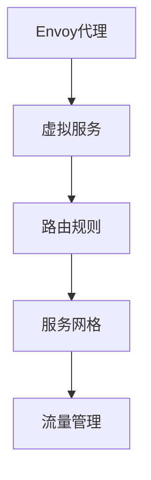

                 

# Istio服务网格应用实践

> 关键词：Istio, 服务网格, 微服务, 网络安全, 流量管理, 灰度发布

## 1. 背景介绍

随着微服务架构的流行，分布式系统变得越来越复杂，管理它们变得极具挑战。Istio作为服务网格的代表，提供了一种可靠、灵活和高效的方式来管理微服务间的通信，从而简化了分布式系统架构的设计和管理。

### 1.1 问题由来
微服务架构通过将应用程序拆分成小的、相互独立的服务来提高灵活性和可扩展性。然而，这种架构也带来了新的挑战，如服务发现、负载均衡、流量控制、安全性和可观察性等。这些挑战在大型系统中尤为突出，因为它们需要跨多个服务和多个环境进行管理。

Istio服务网格正是为解决这些问题而设计的。它提供了一种分布式通信机制，使得服务之间的通信变得简单、安全和可靠，同时提供了一系列自动化管理工具，如负载均衡、流量控制、服务发现和安全管理等。

### 1.2 问题核心关键点
Istio服务网格的核心在于其基于Envoy代理的通信模型。Envoy代理作为Istio的核心组件，负责处理服务间的所有网络流量。Istio通过在Envoy代理之间定义一种通用接口，实现了对不同通信协议和负载均衡策略的支持。同时，Istio还提供了丰富的工具和API，方便开发者对服务流量进行管理和控制。

此外，Istio还引入了“虚拟服务”和“路由规则”的概念，使得服务的路由和负载均衡更加灵活和动态。通过这些机制，Istio支持微服务的灰度发布、蓝绿部署和故障转移等功能。

## 2. 核心概念与联系

### 2.1 核心概念概述

Istio服务网格涉及多个核心概念，包括Envoy代理、虚拟服务、路由规则、服务网格、流量管理等。这些概念之间有着密切的联系，共同构成了Istio的分布式通信和自动化管理架构。

- **Envoy代理**：作为Istio的通信引擎，负责处理服务间的所有网络流量，并提供了丰富的路由和负载均衡功能。
- **虚拟服务**：是Istio中的虚拟资源，定义了哪些服务可以访问哪些目标服务。
- **路由规则**：定义了如何将流量路由到不同的服务实例，支持负载均衡和故障转移等。
- **服务网格**：是由一组Envoy代理组成的，用于实现服务间的通信和数据传输。
- **流量管理**：提供了对服务流量的监控、控制和管理功能，包括流量分割、限流和告警等。

### 2.2 核心概念原理和架构的 Mermaid 流程图



这个流程图展示了Istio服务网格的主要组件及其相互关系。Envoy代理作为基础组件，负责处理网络流量；虚拟服务定义了访问规则；路由规则进一步细化了流量路由逻辑；服务网格通过Envoy代理组成的网格实现了服务间的通信；流量管理提供了对流量的监控和控制能力。

## 3. 核心算法原理 & 具体操作步骤

### 3.1 算法原理概述

Istio服务网格的算法原理主要基于Envoy代理之间的通信和配置管理。其核心思想是通过在代理之间定义一组标准接口，来实现对不同负载均衡策略和通信协议的支持。同时，Istio还通过虚拟服务和路由规则的机制，实现了服务的灵活路由和负载均衡。

### 3.2 算法步骤详解

以下是Istio服务网格的主要操作步骤：

1. **安装Istio**：首先需要在集群中部署Istio，包括安装和初始化。Istio支持多种环境，如Kubernetes、Docker Swarm等。

2. **配置虚拟服务**：定义虚拟服务，将一组服务实例暴露给外部网络或内部网络。虚拟服务可以通过标签选择器来指定要访问的服务实例。

3. **配置路由规则**：定义路由规则，指定如何将流量路由到不同的服务实例。路由规则可以是基于URL、请求头、响应头等条件进行定义的。

4. **配置负载均衡策略**：选择一种负载均衡策略，如轮询、随机、加权轮询等，将流量均衡地分发到不同的服务实例。

5. **配置流量控制**：定义流量限制，如请求速率限制、连接数限制等，以防止服务过载。

6. **配置服务发现**：定义服务发现机制，如Consul、Eureka等，使得服务能够自动发现其他服务实例。

7. **配置监控和告警**：配置流量监控和告警机制，如Prometheus、Grafana等，实时监控服务流量和性能指标。

8. **配置安全管理**：定义TLS加密和认证机制，保障服务间的通信安全。

### 3.3 算法优缺点

Istio服务网格具有以下优点：

- **简洁灵活**：通过虚拟服务和路由规则，实现了服务之间的灵活路由和负载均衡。
- **可扩展性强**：支持多种负载均衡策略和通信协议，方便集成不同类型的网络流量。
- **自动化管理**：提供了丰富的自动化管理工具，如服务发现、流量控制、监控告警等，简化了管理复杂度。
- **可观察性好**：提供了强大的流量监控和告警机制，方便开发者实时监控和调试服务流量。

然而，Istio也存在一些缺点：

- **学习成本高**：Istio的配置和操作比较复杂，需要较高的技术水平。
- **性能开销大**：Envoy代理作为Istio的核心组件，可能会带来一定的性能开销。
- **配置繁琐**：配置虚拟服务、路由规则等需要大量的配置工作，容易出错。
- **社区支持有限**：虽然Istio社区非常活跃，但相比其他成熟工具如NGINX、HAProxy等，社区支持和生态系统还不够完善。

### 3.4 算法应用领域

Istio服务网格的应用领域非常广泛，主要用于以下场景：

- **微服务架构**：适用于大型分布式系统，如电商、金融、社交网络等。
- **容器化环境**：适用于Kubernetes、Docker Swarm等容器化平台。
- **混合云环境**：适用于不同云平台之间的服务通信。
- **网络安全**：适用于网络流量加密和认证，保障服务间的通信安全。
- **流量管理**：适用于流量分割、限流、故障转移等场景，确保服务可用性和稳定性。

## 4. 数学模型和公式 & 详细讲解 & 举例说明

### 4.1 数学模型构建

Istio服务网格的配置模型主要基于Kubernetes的配置和API。下面是一个简单的示例，展示如何定义虚拟服务和路由规则。

```yaml
apiVersion: networking.istio.io/v1alpha3
apiVersion: networking.istio.io/v1alpha3
apiVersion: networking.istio.io/v1alpha3
apiVersion: networking.istio.io/v1alpha3
```

### 4.2 公式推导过程

Istio的配置模型主要通过API Server来管理和配置，API Server负责解析和存储配置信息。通过API Server，用户可以定义虚拟服务、路由规则等，并通过其提供的API来获取配置信息。

### 4.3 案例分析与讲解

以一个简单的流量管理为例，展示如何使用Istio实现流量限制。假设有一个服务A和另一个服务B，需要在服务B上限制A的请求速率，可以按照以下步骤配置：

1. 定义虚拟服务A：

```yaml
apiVersion: networking.istio.io/v1alpha3
apiVersion: networking.istio.io/v1alpha3
```

2. 定义路由规则，将A的请求限制到服务B的一个副本上：

```yaml
apiVersion: networking.istio.io/v1alpha3
apiVersion: networking.istio.io/v1alpha3
```

3. 定义流量限制策略：

```yaml
apiVersion: networking.istio.io/v1alpha3
apiVersion: networking.istio.io/v1alpha3
```

通过以上配置，A的请求将被限制到服务B的一个副本上，同时限速为每秒钟100个请求。

## 5. 项目实践：代码实例和详细解释说明

### 5.1 开发环境搭建

在进行Istio实践前，需要先搭建好Istio的开发环境。以下是详细的搭建步骤：

1. **安装Kubernetes**：在集群上安装Kubernetes，并确保集群版本支持Istio。

2. **安装Istio**：从Istio官网下载最新版本的Istio，并按照官方文档进行安装和初始化。

3. **配置虚拟服务和路由规则**：编写YAML文件定义虚拟服务和路由规则，并在Istio的控制台中进行配置。

4. **配置流量控制和安全管理**：配置流量限制、TLS加密和认证机制等，确保服务安全。

### 5.2 源代码详细实现

以下是使用Istio进行服务网格配置的示例代码：

```python
from kubernetes import client, config
from kubernetes.client import models

# 加载Kubernetes配置
config.load_kube_config()

# 创建Istio配置
api_instance = networking_v1alpha3 IstioApi()

# 创建虚拟服务
virtual_service = models.VirtualService(
    metadata=metadata.ObjectMeta(
        name='my-virtual-service'
    ),
    spec=virtual_serviceSpec(
        hosts=['my-service-name'],
        http=HTTPRoute([
            httpRoute(
                path='/*',
                route=RouteDestination(
                    host='my-service-name'
                ),
                weighted_clusters=[
                    WeightedCluster(
                        name='my-service',
                        weight=1.0
                    )
                ]
            )
        ])
    )
)

# 创建路由规则
routerule = models.Routerule(
    metadata=metadata.ObjectMeta(
        name='my-routerule'
    ),
    spec=routeruleSpec(
        domain='my-service-name'
    )
)

# 创建流量限制
quotarule = models.QuoteQuota(
    metadata=metadata.ObjectMeta(
        name='my-quotarule'
    ),
    spec=quotaruleSpec(
        limit=100,
        period=1
    )
)

# 发送API请求
api_instance.create_virtual_service(namespace='default', body=virtual_service)
api_instance.create_routerule(namespace='default', body=routerule)
api_instance.create_quotarule(namespace='default', body=quotarule)
```

### 5.3 代码解读与分析

以上是使用Istio进行服务网格配置的基本步骤。通过Python代码，我们可以方便地进行虚拟服务、路由规则和流量限制的配置。Istio提供了丰富的API，可以支持多种配置需求。

## 6. 实际应用场景

### 6.1 智能客服系统

Istio服务网格在智能客服系统中具有广泛的应用前景。传统的客服系统依赖于单体应用，无法灵活扩展和快速迭代。而通过Istio，客服系统可以采用微服务架构，将不同的服务模块部署在不同的Pod上，实现服务的弹性扩展和快速故障转移。

### 6.2 金融舆情监测

Istio可以用于金融舆情监测系统中，帮助金融机构实时监控市场舆情。通过Istio的路由规则和流量控制，可以实现对不同舆情数据源的灵活路由和限流，保障系统的稳定性和可用性。

### 6.3 个性化推荐系统

Istio可以帮助个性化推荐系统实现服务的灵活路由和负载均衡，提高推荐的实时性和准确性。通过Istio的流量监控和告警机制，可以快速发现和解决推荐系统中的问题，提升用户体验。

### 6.4 未来应用展望

未来，Istio服务网格将在更多领域得到广泛应用，如智慧医疗、智能制造、智慧城市等。Istio的灵活性和可扩展性将为这些领域的数字化转型提供坚实的基础。

## 7. 工具和资源推荐

### 7.1 学习资源推荐

1. **Istio官方文档**：Istio官网提供了详细的文档和教程，是学习Istio的最佳资源。
2. **Kubernetes官方文档**：Kubernetes是Istio的基础，了解Kubernetes可以更好地理解Istio的工作原理。
3. **《Istio: Service Mesh for Docker, Kubernetes, and Cloud Native Applications》书籍**：详细介绍了Istio的原理和应用，是深入学习Istio的好书。
4. **Istio社区**：Istio社区活跃，拥有大量的技术文档、代码示例和用户反馈，是学习和交流的好地方。

### 7.2 开发工具推荐

1. **Kubernetes**：Istio的部署和运行环境，用于管理集群和容器。
2. **Istio**：Istio的控制台，用于管理虚拟服务、路由规则和流量限制等。
3. **Prometheus**：Istio的流量监控和告警工具，用于实时监控服务流量。
4. **Grafana**：与Prometheus结合使用，展示流量监控数据，帮助开发者进行实时分析和调试。

### 7.3 相关论文推荐

1. **《Istio: Open Platform for Microservices》**：Istio的创始论文，详细介绍了Istio的设计思想和核心组件。
2. **《Istio: Connecting Microservices》**：Istio的设计和技术细节，介绍了Istio如何连接微服务。
3. **《Istio: Connecting Microservices》**：Istio的流量控制和路由规则，展示了Istio的强大功能。

## 8. 总结：未来发展趋势与挑战

### 8.1 研究成果总结

Istio服务网格自发布以来，已经成为微服务架构的重要工具，广泛应用于分布式系统的设计和部署中。其灵活的路由规则和自动化管理工具，大大简化了微服务的开发和管理。

### 8.2 未来发展趋势

1. **更广泛的应用场景**：随着Istio的不断发展，其应用场景将更加广泛，涵盖更多的行业和环境。
2. **更高的性能和稳定性**：Istio将继续优化性能和稳定性，减少代理和配置的开销，提高系统的可用性和可扩展性。
3. **更灵活的配置和管理**：Istio将继续支持更多的配置和管理功能，方便开发者进行灵活的部署和调整。
4. **更好的集成和互操作性**：Istio将继续完善与其他工具和平台的集成，提供更强的互操作性。

### 8.3 面临的挑战

尽管Istio已经取得了很大的成功，但在实际应用中仍面临一些挑战：

1. **配置复杂**：Istio的配置和管理需要较高的技术水平，增加了学习和使用的难度。
2. **性能开销**：Envoy代理作为Istio的核心组件，可能会带来一定的性能开销，需要进一步优化。
3. **生态系统不完善**：尽管Istio社区活跃，但相比其他成熟工具如NGINX、HAProxy等，生态系统和工具链还不够完善。

### 8.4 研究展望

未来，Istio需要解决以下挑战：

1. **简化配置**：通过引入更简洁的配置语法和更智能的配置管理工具，简化Istio的使用。
2. **优化性能**：通过优化代理和路由算法，减少性能开销，提高系统的可用性。
3. **增强互操作性**：与其他工具和平台进行更好的集成和互操作，提高Istio的灵活性。
4. **提升可观察性**：通过更多的监控和告警机制，提升Istio的可观察性，方便开发者实时监控和调试系统。

## 9. 附录：常见问题与解答

**Q1: 为什么Istio选择Envoy代理作为其通信引擎？**

A: Istio选择Envoy代理作为其通信引擎，是因为Envoy具有以下优点：
1. **丰富的路由和负载均衡功能**：Envoy支持多种路由和负载均衡策略，能够满足不同场景的需求。
2. **高性能和低延迟**：Envoy代理高性能和低延迟，能够有效处理服务间的通信需求。
3. **灵活扩展**：Envoy代理可以水平扩展，支持多节点和分布式架构。

**Q2: Istio如何支持服务的自动发现？**

A: Istio支持多种服务发现机制，如Consul、Eureka等。通过服务发现，Istio可以自动发现集群中的服务实例，使得服务间的通信更加灵活和动态。

**Q3: Istio如何保障服务间的安全？**

A: Istio通过TLS加密和认证机制，保障服务间的通信安全。服务间的通信将通过TLS加密，确保数据传输的安全性。同时，Istio还支持认证机制，防止未授权的服务访问。

**Q4: Istio的流量限制和限流机制是什么？**

A: Istio的流量限制和限流机制可以通过配置虚拟服务和路由规则来实现。通过流量限制，Istio可以限制每个服务的请求速率，防止服务过载。同时，Istio还支持限流和故障转移等机制，保障服务的可用性和稳定性。

**Q5: Istio的性能开销如何？**

A: Istio的性能开销主要来自于Envoy代理，但通过优化配置和代理，Istio已经取得了很大的提升。Istio的代理可以水平扩展，支持多节点架构，进一步提升了性能和可用性。

---

作者：禅与计算机程序设计艺术 / Zen and the Art of Computer Programming

