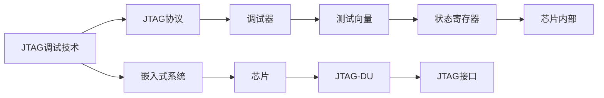

                 

# JTAG 调试：在嵌入式系统上

## 1. 背景介绍

随着嵌入式系统的复杂度不断增加，对系统调试的需求也变得越发迫切。传统手工调试方式效率低下、难度大、成本高，难以满足大规模生产的需求。而JTAG(Joint Test Action Group，联合测试行动小组)调试技术则提供了一种高效、灵活、经济可行的解决方案。通过JTAG接口，我们可以在不断电、不拆卸电路板的情况下，对嵌入式系统进行全面测试和调试。

本文将系统介绍JTAG调试技术的基本原理、主要协议和具体步骤，并深入探讨其在嵌入式系统中的实际应用。希望通过本文的学习，读者能够掌握JTAG调试的关键技术，并具备初步的实际调试能力。

## 2. 核心概念与联系

### 2.1 核心概念概述

#### 2.1.1 JTAG调试技术

JTAG调试技术是IEEE推出的一种标准测试和调试接口。通过在芯片内部集成JTAG协议的调试单元(JTAG-DU)，我们可以在芯片设计阶段或制造后，使用特定的调试器与芯片进行通信，实现对芯片的全面测试和调试。JTAG调试技术广泛应用于嵌入式系统的设计验证、功能测试、性能优化等环节。

#### 2.1.2 JTAG协议

JTAG协议定义了一套完整的调试指令集，包括测试配置、测试向量、测试模式、状态寄存器等。通过这些指令，我们可以对芯片进行多层次的测试和控制。JTAG协议还具有热插拔、单步调试、边界扫描等功能，能够满足不同复杂度的调试需求。

#### 2.1.3 调试器

调试器是用于执行JTAG调试协议的软件工具。常见的调试器包括GDB、JTAG Tuner、LogicAnalyser等。调试器通过JTAG接口与芯片通信，发送调试指令，读取芯片状态，实现对芯片的全面调试。调试器是JTAG调试系统中不可或缺的组成部分。

#### 2.1.4 嵌入式系统

嵌入式系统是应用广泛、形式多样的计算机系统。它通常集成于特定的硬件平台，用于执行特定的任务。嵌入式系统中的调试工作，通常需要借助JTAG调试技术，以实现高效、灵活的测试和优化。

### 2.2 核心概念原理和架构的 Mermaid 流程图



## 3. 核心算法原理 & 具体操作步骤

### 3.1 算法原理概述

JTAG调试技术的核心原理是通过JTAG协议，在芯片内部与调试器进行通信，实现对芯片的全面测试和调试。JTAG协议定义了标准的测试向量、测试模式、状态寄存器等，使得调试器能够对芯片进行多层次、灵活的测试和控制。

### 3.2 算法步骤详解

#### 3.2.1 硬件连接

1. 将调试器通过JTAG接口与目标芯片连接。
2. 打开调试器，并加载待调试的目标代码。
3. 启动调试器，等待调试目标芯片准备好。

#### 3.2.2 设置调试参数

1. 在调试器中设置调试参数，如断点、单步调试、测试向量等。
2. 设置目标芯片的工作模式，如边界扫描、功能测试等。
3. 配置调试器与目标芯片之间的通信协议。

#### 3.2.3 运行调试

1. 运行调试器，开始对目标芯片进行调试。
2. 调试器通过JTAG协议向芯片发送测试向量，进行测试和控制。
3. 调试器接收芯片的状态信息，分析调试结果。

#### 3.2.4 分析结果

1. 根据调试器提供的状态信息，分析芯片运行状态。
2. 根据调试器的提示，调整目标芯片的参数和状态。
3. 多次迭代调试，直到芯片满足预期功能。

### 3.3 算法优缺点

#### 3.3.1 优点

1. 非破坏性：JTAG调试可以在不断电的情况下，对芯片进行全面测试和调试。
2. 灵活性高：支持多种测试向量、测试模式和状态寄存器，能够满足不同复杂度的调试需求。
3. 经济高效：使用JTAG调试器进行测试和调试，可以大幅降低硬件测试和维护成本。
4. 功能丰富：支持边界扫描、单步调试、热插拔等功能，提高调试效率。

#### 3.3.2 缺点

1. 调试接口复杂：JTAG调试需要掌握复杂的协议和指令，初学者需要较长时间的学习。
2. 调试速度慢：JTAG调试速度受限于接口带宽和芯片时钟，调试速度较慢。
3. 接口占用较多：JTAG调试需要占用多个引脚，对接口资源需求较高。
4. 支持芯片有限：部分低端芯片可能不具备JTAG调试接口或功能有限。

### 3.4 算法应用领域

#### 3.4.1 硬件验证

在芯片设计阶段，使用JTAG调试技术对芯片进行全面的测试和验证，确保芯片满足设计要求。

#### 3.4.2 功能测试

在芯片生产阶段，使用JTAG调试技术对芯片进行功能测试，发现并修正芯片的潜在缺陷。

#### 3.4.3 性能优化

在芯片应用阶段，使用JTAG调试技术对芯片进行性能优化，提高芯片运行效率。

#### 3.4.4 故障诊断

在芯片维护阶段，使用JTAG调试技术对芯片进行故障诊断，快速定位芯片问题。

## 4. 数学模型和公式 & 详细讲解 & 举例说明

### 4.1 数学模型构建

#### 4.1.1 测试向量

测试向量是一组测试信号，用于在芯片内部进行测试和控制。JTAG协议定义了多种测试向量，如CP脉冲、TDI脉冲、TMS脉冲等。

#### 4.1.2 状态寄存器

状态寄存器是用于存储芯片内部状态的信息，如芯片配置状态、调试状态等。JTAG协议定义了多个状态寄存器，用于监控芯片运行状态。

#### 4.1.3 测试模式

测试模式是用于控制芯片测试状态的模式，如边界扫描、功能测试等。JTAG协议定义了多种测试模式，用于满足不同测试需求。

### 4.2 公式推导过程

#### 4.2.1 边界扫描测试向量

边界扫描测试向量主要用于测试芯片的引脚状态，通过不断切换测试模式，完成对引脚状态的读写。

边界扫描测试向量的基本格式为：

$$
\begin{bmatrix}
TCK\\
TDI\\
TMS
\end{bmatrix} = \begin{bmatrix}
1 & 1 & 0\\
0 & 1 & 0\\
1 & 0 & 0
\end{bmatrix} \begin{bmatrix}
\text{CP}\\
\text{TDI}\\
\text{TMS}
\end{bmatrix}
$$

其中，$TCK$表示时钟信号，$TDI$表示数据输入信号，$TMS$表示测试模式控制信号。

#### 4.2.2 功能测试向量

功能测试向量主要用于测试芯片的功能模块，通过不断切换测试模式，完成对模块状态的读写。

功能测试向量的基本格式为：

$$
\begin{bmatrix}
TCK\\
TDI\\
TMS
\end{bmatrix} = \begin{bmatrix}
1 & 1 & 0\\
1 & 1 & 0\\
1 & 0 & 0
\end{bmatrix} \begin{bmatrix}
\text{CP}\\
\text{TDI}\\
\text{TMS}
\end{bmatrix}
$$

### 4.3 案例分析与讲解

#### 4.3.1 单步调试

单步调试是JTAG调试中常用的功能之一。通过单步调试，可以逐步执行目标代码，观察程序运行状态，发现问题并进行调试。

具体步骤如下：

1. 在调试器中设置断点，并加载目标代码。
2. 启动调试器，等待调试目标芯片准备好。
3. 执行单步调试命令，逐行执行目标代码。
4. 观察目标代码执行结果，发现问题并进行调试。

#### 4.3.2 边界扫描测试

边界扫描测试是一种基本的测试方法，通过不断切换测试模式，完成对芯片引脚状态的读写。

具体步骤如下：

1. 在调试器中设置边界扫描测试模式。
2. 执行边界扫描测试向量，完成对芯片引脚状态的读写。
3. 观察芯片引脚状态，判断芯片是否存在引脚问题。
4. 根据测试结果，调整芯片引脚状态，排除引脚问题。

## 5. 项目实践：代码实例和详细解释说明

### 5.1 开发环境搭建

#### 5.1.1 安装调试器

常见的调试器包括GDB、JTAG Tuner等，这里以GDB调试器为例，进行详细介绍。

1. 下载GDB调试器，并解压缩。
2. 安装GDB调试器，并配置环境变量。
3. 测试GDB调试器，确保其能够正常运行。

#### 5.1.2 安装JTAG适配器

JTAG适配器是用于连接调试器与目标芯片的设备。常见的JTAG适配器包括STLink、JTAGem等。

1. 购买并安装JTAG适配器。
2. 将JTAG适配器与调试器连接。
3. 测试JTAG适配器，确保其能够正常工作。

### 5.2 源代码详细实现

#### 5.2.1 调试器配置

1. 打开GDB调试器，并加载待调试的目标代码。
2. 设置调试参数，如断点、单步调试、测试向量等。
3. 配置JTAG适配器，并连接调试器与目标芯片。

#### 5.2.2 运行调试

1. 启动调试器，开始对目标芯片进行调试。
2. 发送测试向量，进行测试和控制。
3. 接收芯片状态信息，分析调试结果。

#### 5.2.3 分析结果

1. 根据调试器提供的状态信息，分析芯片运行状态。
2. 根据调试器的提示，调整目标芯片的参数和状态。
3. 多次迭代调试，直到芯片满足预期功能。

### 5.3 代码解读与分析

#### 5.3.1 GDB调试器

GDB调试器是一种流行的调试工具，通过命令行方式实现对目标代码的调试。GDB支持多种操作系统和编程语言，可以用于嵌入式系统的调试。

以下是GDB调试器的主要命令：

- `file`: 加载目标代码。
- `break`: 设置断点。
- `run`: 启动调试器。
- `step`: 单步调试。
- `info`: 显示调试信息。

#### 5.3.2 JTAG适配器

JTAG适配器是调试器与目标芯片之间的通信桥梁，负责发送和接收调试信号。JTAG适配器通常具有多个引脚，用于与调试器通信。

以下是STLink JTAG适配器的引脚定义：

| 引脚 | 功能           | 信号名称           |
|------|---------------|-------------------|
| TCK  | 时钟信号       | JTCK/CK           |
| TDI  | 数据输入信号   | JTDI            |
| TMS  | 测试模式控制信号| JTMS            |
| TRST | 复位信号       | JTRST            |
| GND  | 地信号         | JTDI/GND         |
| VCC  | 电源信号       | JTCK/IOVCC       |
| VPP  | 调试电源信号   | JTPROG/IOVCC      |

#### 5.3.3 调试流程

以下是使用GDB调试器进行JTAG调试的详细流程：

1. 配置GDB调试器，并加载目标代码。
2. 配置JTAG适配器，并连接调试器与目标芯片。
3. 设置调试参数，如断点、单步调试、测试向量等。
4. 启动调试器，开始对目标芯片进行调试。
5. 发送测试向量，进行测试和控制。
6. 接收芯片状态信息，分析调试结果。
7. 根据调试器提供的状态信息，调整目标芯片的参数和状态。
8. 多次迭代调试，直到芯片满足预期功能。

### 5.4 运行结果展示

#### 5.4.1 调试结果展示

以下是使用GDB调试器进行JTAG调试的典型调试结果：

1. 断点设置成功，调试器进入目标代码的断点。
2. 单步调试成功，调试器逐行执行目标代码。
3. 测试向量成功发送，芯片引脚状态被写入。
4. 芯片状态信息接收成功，调试器分析调试结果。
5. 根据调试器提示，调整目标芯片的参数和状态。

#### 5.4.2 调试日志展示

以下是使用GDB调试器进行JTAG调试的典型调试日志：

```
(gdb) file my_target_code.bin
Reading symbols from my_target_code.bin...done.
(gdb) break main
Breakpoint 1 at 0x00001000
(gdb) run
Starting program: /path/to/my_target_code.bin
Breakpoint 1, main () at my_target_code.bin:1
(gdb) step
Step 1 at my_target_code.bin:2
(gdb) info registers
...
(gdb) continue
Continuing.
...
(gdb) info registers
...
(gdb) stop
Stop: 8
(gdb) info registers
...
```

## 6. 实际应用场景

### 6.4 未来应用展望

#### 6.4.1 硬件验证

随着芯片设计的复杂度不断增加，硬件验证成为芯片开发中的重要环节。JTAG调试技术可以广泛应用于芯片验证、功能测试、性能优化等环节，确保芯片满足设计要求。

#### 6.4.2 系统调试

嵌入式系统通常具有复杂的功能模块和硬件接口，调试工作需要借助JTAG调试技术，以实现高效、灵活的测试和优化。

#### 6.4.3 远程调试

远程调试是JTAG调试技术的重要应用场景之一。通过网络协议和远程控制，可以实现对远程芯片的调试和优化。

#### 6.4.4 云端调试

随着云计算和大数据的发展，云端调试成为嵌入式系统调试的新趋势。JTAG调试技术可以通过云平台实现远程调试，提高系统调试效率。

## 7. 工具和资源推荐

### 7.1 学习资源推荐

#### 7.1.1 书籍

1. 《嵌入式系统设计与调试》：详细介绍了嵌入式系统的设计和调试方法，适合初学者入门。
2. 《JTAG调试技术详解》：系统介绍了JTAG协议和调试器的使用方法，适合进阶学习。
3. 《嵌入式系统测试与验证》：介绍了嵌入式系统的测试和验证方法，包含JTAG调试技术。

#### 7.1.2 网站

1. [JTAG调试入门教程](https://www.embbeded.com/jtag-tutorial/)：详细介绍JTAG调试技术，适合初学者入门。
2. [GDB官方文档](https://www.gnu.org/software/gdb/documentation/)：详细介绍了GDB调试器，适合进阶学习。
3. [JTAG适配器选择](https://www.stmicroelectronics.com/en-us/technologies/jtag-tools.html)：详细介绍JTAG适配器的选择和使用，适合实际应用。

### 7.2 开发工具推荐

#### 7.2.1 调试器

1. GDB：GNU调试器，功能强大，支持多种操作系统和编程语言。
2. IAR：集成开发环境，支持JTAG调试，适合嵌入式系统开发。
3. STLink：STMicroelectronics开发的JTAG适配器，功能丰富，支持多种芯片。

#### 7.2.2 JTAG适配器

1. STLink：STMicroelectronics开发的JTAG适配器，功能丰富，支持多种芯片。
2. JTAGem：全球领先的JTAG适配器，功能强大，支持多种操作系统。
3. CH340：通用的USB转JTAG适配器，支持多种芯片，价格低廉。

### 7.3 相关论文推荐

#### 7.3.1 JTAG协议

1. IEEE Std 1149.1-2017: 详细介绍了JTAG协议的规范和使用方法，适合深入学习。
2. JTAG-Based FPGA and Embedded System Debugging: 介绍了JTAG协议在FPGA和嵌入式系统中的应用，适合实践应用。

#### 7.3.2 调试技术

1. Beyond the Book of JTAG: 介绍JTAG协议的高级使用技巧，适合进阶学习。
2. JTAG-Based Debugging of Embedded Systems: 介绍JTAG调试技术在嵌入式系统中的应用，适合实际应用。

## 8. 总结：未来发展趋势与挑战

### 8.1 研究成果总结

#### 8.1.1 发展历程

JTAG调试技术起源于20世纪80年代末，广泛应用于嵌入式系统的设计验证和测试。经过多年的发展，JTAG协议和调试器已经趋于成熟，广泛应用于各种嵌入式系统。

#### 8.1.2 应用领域

JTAG调试技术广泛应用于芯片设计验证、功能测试、性能优化、故障诊断等环节，是嵌入式系统调试的重要手段。

#### 8.1.3 技术特点

JTAG调试技术具有非破坏性、灵活性高、经济高效等特点，适用于多种复杂度的调试需求。

### 8.2 未来发展趋势

#### 8.2.1 硬件连接优化

未来的JTAG调试技术将进一步优化硬件连接方式，提高接口带宽和稳定性。

#### 8.2.2 远程调试支持

远程调试将成为JTAG调试技术的重要发展方向，通过网络协议和远程控制，实现对远程芯片的调试和优化。

#### 8.2.3 云端调试支持

云端调试将为JTAG调试技术带来新的应用场景，通过云平台实现远程调试，提高系统调试效率。

#### 8.2.4 智能调试支持

未来的JTAG调试技术将进一步引入智能调试功能，如自动断点设置、智能单步调试等，提高调试效率和准确性。

### 8.3 面临的挑战

#### 8.3.1 调试速度慢

JTAG调试速度受限于接口带宽和芯片时钟，调试速度较慢。未来需要优化硬件连接和接口协议，提高调试速度。

#### 8.3.2 调试接口复杂

JTAG调试需要掌握复杂的协议和指令，初学者需要较长时间的学习。未来需要简化调试接口，降低学习难度。

#### 8.3.3 调试器成本高

高性能调试器的成本较高，限制了JTAG调试技术的普及。未来需要开发更多成本低廉的调试器，降低调试成本。

#### 8.3.4 调试接口占用多

JTAG调试需要占用多个引脚，对接口资源需求较高。未来需要优化硬件连接方式，减少接口占用。

### 8.4 研究展望

#### 8.4.1 硬件连接优化

未来的JTAG调试技术将进一步优化硬件连接方式，提高接口带宽和稳定性。

#### 8.4.2 远程调试支持

远程调试将成为JTAG调试技术的重要发展方向，通过网络协议和远程控制，实现对远程芯片的调试和优化。

#### 8.4.3 云端调试支持

云端调试将为JTAG调试技术带来新的应用场景，通过云平台实现远程调试，提高系统调试效率。

#### 8.4.4 智能调试支持

未来的JTAG调试技术将进一步引入智能调试功能，如自动断点设置、智能单步调试等，提高调试效率和准确性。

## 9. 附录：常见问题与解答

### 9.1 常见问题

#### 9.1.1 JTAG调试为何需要学习复杂的协议和指令？

A: JTAG协议定义了标准的测试向量、测试模式、状态寄存器等，使得调试器能够对芯片进行多层次、灵活的测试和控制。掌握JTAG协议和指令是JTAG调试的基础，需要花费一定的时间和精力进行学习。

#### 9.1.2 如何选择合适的JTAG调试器？

A: 选择JTAG调试器需要考虑调试器的功能、性能、成本等因素。常见的调试器包括GDB、IAR、STLink等，可以根据实际需求选择合适的调试器。

#### 9.1.3 如何优化JTAG调试速度？

A: 优化JTAG调试速度需要优化硬件连接方式、接口协议和调试器配置。常见的方法包括使用高性能调试器、优化接口带宽、优化调试器配置等。

#### 9.1.4 JTAG调试需要占用多少接口引脚？

A: JTAG调试需要占用4个引脚，包括TCK、TDI、TMS、TRST。对于复杂的嵌入式系统，还需要占用更多的引脚进行调试。

#### 9.1.5 JTAG调试为何难以普及？

A: JTAG调试器成本较高，调试接口复杂，初学者需要较长时间的学习，这些因素限制了JTAG调试技术的普及。未来需要进一步优化硬件连接方式和调试器功能，降低JTAG调试的成本和难度。

### 9.2 解答

#### 9.2.1 如何优化JTAG调试速度？

A: 优化JTAG调试速度需要优化硬件连接方式、接口协议和调试器配置。常见的方法包括使用高性能调试器、优化接口带宽、优化调试器配置等。

#### 9.2.2 JTAG调试为何需要学习复杂的协议和指令？

A: JTAG协议定义了标准的测试向量、测试模式、状态寄存器等，使得调试器能够对芯片进行多层次、灵活的测试和控制。掌握JTAG协议和指令是JTAG调试的基础，需要花费一定的时间和精力进行学习。

#### 9.2.3 如何选择合适的JTAG调试器？

A: 选择JTAG调试器需要考虑调试器的功能、性能、成本等因素。常见的调试器包括GDB、IAR、STLink等，可以根据实际需求选择合适的调试器。

#### 9.2.4 JTAG调试需要占用多少接口引脚？

A: JTAG调试需要占用4个引脚，包括TCK、TDI、TMS、TRST。对于复杂的嵌入式系统，还需要占用更多的引脚进行调试。

#### 9.2.5 JTAG调试为何难以普及？

A: JTAG调试器成本较高，调试接口复杂，初学者需要较长时间的学习，这些因素限制了JTAG调试技术的普及。未来需要进一步优化硬件连接方式和调试器功能，降低JTAG调试的成本和难度。

作者：禅与计算机程序设计艺术 / Zen and the Art of Computer Programming

