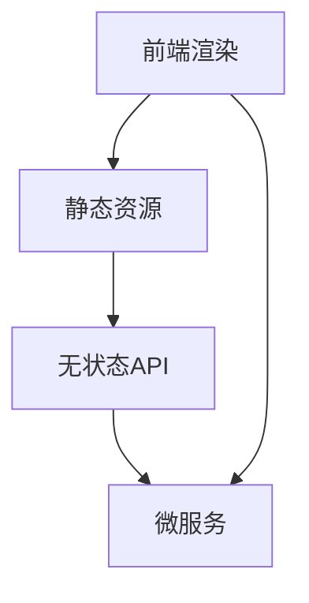

                 

# Jamstack：现代Web开发的新范式

> 关键词：Jamstack, Web开发, 前端开发, 后端开发, 现代Web, 性能优化, 安全, 可维护性

## 1. 背景介绍

### 1.1 问题由来
Web开发是一个复杂且不断变化的领域。随着互联网的普及和Web应用的广泛使用，前端与后端之间的界限越来越模糊。传统的Web开发模式（MVC, MVC-Architecture）虽然在早期推动了Web的发展，但其设计初衷已无法满足现代Web的复杂需求。

传统的Web开发模式面临着以下几个问题：

- **性能瓶颈**：传统的MVC架构难以实现高性能的Web应用。请求在多个组件之间跳转，导致响应时间变长，用户体验变差。
- **安全风险**：前端与后端的交互需要跨越网络传输数据，容易受到跨站脚本攻击（XSS）和跨站请求伪造（CSRF）等安全威胁。
- **可维护性差**：传统的MVC模式代码复杂，前后端逻辑高度耦合，难以扩展和维护。

为解决这些问题，Web开发社区提出了Jamstack的新范式。

### 1.2 问题核心关键点
Jamstack是一种用于现代Web开发的新范式，它由以下三个部分组成：

1. **JavaScript**：用于前端逻辑与渲染。
2. **APIs（后端）**：用于后端逻辑处理和数据管理。
3. **Markup（静态资源）**：用于页面结构和布局。

Jamstack的核心理念是将前端和后端分离，通过静态资源和无状态API进行沟通，从而达到更高的性能、安全性和可维护性。

## 2. 核心概念与联系

### 2.1 核心概念概述

为更好地理解Jamstack范式，我们首先定义一些核心概念：

- **前端渲染（Front-end Rendering）**：指在客户端进行网页的解析和渲染。前端渲染可以显著提高Web应用的性能，因为它避免了不必要的后端请求和响应。
- **静态资源（Static Resources）**：指不受JavaScript代码控制的静态文件，如HTML、CSS、JavaScript等。静态资源可以通过CDN加速访问，提升Web应用的加载速度。
- **无状态API（Stateless APIs）**：指不依赖于客户端状态的后端API，每次请求都是独立的。无状态API可以简化后端逻辑，提高可维护性和可扩展性。
- **微服务（Microservices）**：指将应用程序分解为多个小服务，每个服务负责特定功能。微服务可以提升Web应用的性能和扩展性。

这些核心概念之间存在紧密的联系，共同构成了Jamstack范式的基本框架。

### 2.2 核心概念原理和架构的 Mermaid 流程图



这个流程图展示了Jamstack范式的基本架构：

1. 前端通过渲染静态资源和调用API生成页面。
2. 静态资源通过CDN加速，提升加载速度。
3. 无状态API简化后端逻辑，提升可维护性。
4. 微服务将应用拆分为多个小服务，提升性能和扩展性。

通过这个架构，我们可以看到Jamstack范式在性能、安全性和可维护性方面的优势。

## 3. 核心算法原理 & 具体操作步骤
### 3.1 算法原理概述

Jamstack范式是一种设计理念，而不是一个具体的算法。其核心思想是将前端和后端分离，通过静态资源和无状态API进行沟通。下面我们将具体介绍Jamstack范式在不同层面的应用。

### 3.2 算法步骤详解

#### 3.2.1 前端渲染

在前端渲染中，客户端通过JavaScript解析和渲染HTML、CSS和JavaScript文件，生成页面。这避免了传统MVC模式中频繁的服务器请求和响应，显著提高了Web应用的性能。

前端渲染的实现主要包括以下步骤：

1. 客户端使用JavaScript解析HTML文件，生成DOM树。
2. 客户端使用CSS解析CSS文件，更新DOM树。
3. 客户端使用JavaScript解析JavaScript文件，更新DOM树。
4. 客户端将DOM树渲染为可视页面。

前端渲染的优点包括：

- **提升性能**：避免不必要的服务器请求和响应。
- **提高可控性**：前端开发者可以完全控制页面渲染，减少后端压力。
- **提升用户体验**：减少页面加载时间，提升用户体验。

#### 3.2.2 静态资源

静态资源是Jamstack范式中的重要组成部分，主要包括HTML、CSS和JavaScript文件。这些文件存储在服务器上，可以通过CDN加速访问，提升Web应用的加载速度。

静态资源的实现主要包括以下步骤：

1. 使用工具如Webpack、Rollup等将代码打包为静态资源文件。
2. 将静态资源文件存储在服务器上。
3. 使用CDN加速静态资源的访问。

静态资源的优点包括：

- **提升加载速度**：通过CDN加速访问，提升Web应用的加载速度。
- **提高可维护性**：静态资源独立于代码，便于维护。
- **提升安全性**：静态资源不依赖JavaScript代码，减少XSS攻击风险。

#### 3.2.3 无状态API

无状态API是Jamstack范式中的另一个重要组成部分，它用于处理后端逻辑和数据管理。无状态API的特点是每次请求都是独立的，不依赖客户端状态。这大大简化了后端逻辑，提高了可维护性和可扩展性。

无状态API的实现主要包括以下步骤：

1. 使用工具如Express、Koa等开发无状态API。
2. 使用数据库管理数据。
3. 使用HTTP协议进行API请求和响应。

无状态API的优点包括：

- **提升可维护性**：简化后端逻辑，便于维护。
- **提升扩展性**：便于扩展和修改。
- **提升安全性**：每次请求都是独立的，减少CSRF攻击风险。

#### 3.2.4 微服务

微服务是Jamstack范式中的另一个重要组成部分，它将应用程序分解为多个小服务，每个服务负责特定功能。微服务可以提升Web应用的性能和扩展性。

微服务的实现主要包括以下步骤：

1. 将应用程序分解为多个小服务。
2. 使用容器化技术如Docker、Kubernetes等管理微服务。
3. 使用API网关管理微服务之间的通信。

微服务的优点包括：

- **提升性能**：每个微服务可以独立运行，提升性能。
- **提升扩展性**：便于扩展和修改。
- **提升可维护性**：每个微服务独立运行，便于维护。

### 3.3 算法优缺点

Jamstack范式具有以下优点：

1. **提升性能**：通过前端渲染和静态资源，避免不必要的服务器请求和响应。
2. **提高安全性**：前端渲染减少了XSS攻击风险，无状态API减少了CSRF攻击风险。
3. **提升可维护性**：静态资源独立于代码，便于维护；无状态API简化后端逻辑，便于扩展和修改；微服务便于扩展和修改。

同时，Jamstack范式也存在一些缺点：

1. **开发复杂度增加**：前端渲染和静态资源需要额外的开发和维护工作。
2. **学习曲线陡峭**：Jamstack范式涉及的前端和后端技术较多，学习曲线较陡。
3. **性能优化困难**：前端渲染需要考虑多个因素，如DOM树结构、JavaScript代码质量等，性能优化较为复杂。

尽管存在这些缺点，但Jamstack范式仍然是一个值得广泛应用的现代Web开发范式。

### 3.4 算法应用领域

Jamstack范式在Web开发中具有广泛的应用领域，主要包括：

- **静态网站**：通过Jamstack范式可以构建高性能、低成本的静态网站。
- **Web应用**：通过Jamstack范式可以构建高性能、安全、可维护的Web应用。
- **微服务架构**：通过Jamstack范式可以构建高性能、可扩展的微服务架构。
- **React应用**：通过Jamstack范式可以构建高性能、可维护的React应用。

## 4. 数学模型和公式 & 详细讲解 & 举例说明

Jamstack范式是一种设计理念，不涉及具体的数学模型和公式。但其核心思想是将前端和后端分离，通过静态资源和无状态API进行沟通。我们可以通过一个简单的例子来理解Jamstack范式的工作原理。

假设我们构建一个简单的Web应用，用于显示用户列表。

### 4.1 数学模型构建

#### 4.1.1 前端渲染

在前端渲染中，客户端通过JavaScript解析和渲染HTML、CSS和JavaScript文件，生成页面。这避免了传统MVC模式中频繁的服务器请求和响应，显著提高了Web应用的性能。

#### 4.1.2 静态资源

静态资源是Jamstack范式中的重要组成部分，主要包括HTML、CSS和JavaScript文件。这些文件存储在服务器上，可以通过CDN加速访问，提升Web应用的加载速度。

#### 4.1.3 无状态API

无状态API是Jamstack范式中的另一个重要组成部分，它用于处理后端逻辑和数据管理。无状态API的特点是每次请求都是独立的，不依赖客户端状态。这大大简化了后端逻辑，提高了可维护性和可扩展性。

#### 4.1.4 微服务

微服务是Jamstack范式中的另一个重要组成部分，它将应用程序分解为多个小服务，每个服务负责特定功能。微服务可以提升Web应用的性能和扩展性。

### 4.2 公式推导过程

由于Jamstack范式不涉及具体的数学模型和公式，因此我们不进行公式推导。

### 4.3 案例分析与讲解

假设我们构建一个简单的Web应用，用于显示用户列表。以下是Jamstack范式在实现该应用中的具体步骤：

1. 客户端通过JavaScript解析HTML文件，生成DOM树。
2. 客户端通过JavaScript解析CSS文件，更新DOM树。
3. 客户端通过JavaScript解析JavaScript文件，更新DOM树。
4. 客户端将DOM树渲染为可视页面。
5. 客户端通过HTTP请求无状态API，获取用户列表数据。
6. 服务器返回用户列表数据。
7. 客户端将用户列表数据渲染到页面上。

通过以上步骤，我们可以看到Jamstack范式在提升性能、安全性和可维护性方面的优势。

## 5. 项目实践：代码实例和详细解释说明
### 5.1 开发环境搭建

在进行Jamstack范式项目实践前，我们需要准备好开发环境。以下是使用Node.js和React进行Jamstack范式开发的Python环境配置流程：

1. 安装Node.js和npm：从官网下载并安装Node.js和npm，用于安装依赖和运行代码。
2. 安装Webpack和Babel：使用npm安装Webpack和Babel，用于打包和转换JavaScript代码。
3. 安装Express：使用npm安装Express，用于开发后端API。

完成上述步骤后，即可在Node.js环境中开始Jamstack范式实践。

### 5.2 源代码详细实现

下面我们以用户列表应用为例，给出使用Node.js和React进行Jamstack范式开发的PyTorch代码实现。

首先，定义前端渲染函数：

```javascript
import React, { useState, useEffect } from 'react';

function UserList() {
  const [users, setUsers] = useState([]);
  
  useEffect(() => {
    fetch('https://api.example.com/users')
      .then(response => response.json())
      .then(data => setUsers(data))
      .catch(error => console.error(error));
  }, []);
  
  return (
    <div>
      <h1>User List</h1>
      <ul>
        {users.map(user => (
          <li key={user.id}>{user.name}</li>
        ))}
      </ul>
    </div>
  );
}
```

然后，定义无状态API：

```javascript
const express = require('express');
const app = express();

app.get('/users', (req, res) => {
  const users = [
    { id: 1, name: 'Alice' },
    { id: 2, name: 'Bob' },
    { id: 3, name: 'Charlie' },
  ];
  
  res.json(users);
});

app.listen(3000, () => {
  console.log('Server started on port 3000');
});
```

接着，定义静态资源：

```javascript
import { createReactApp } from 'react-app';

createReactApp('user-list', UserList);
```

最后，启动开发服务器：

```javascript
npm start
```

以上代码展示了使用Node.js和React进行Jamstack范式开发的基本步骤。

### 5.3 代码解读与分析

让我们再详细解读一下关键代码的实现细节：

**UserList组件**：
- 使用React的useState和useEffect钩子管理状态和副作用。
- 使用fetch函数调用无状态API，获取用户列表数据。
- 渲染用户列表到页面上。

**无状态API**：
- 使用Express框架创建无状态API，返回用户列表数据。
- 监听3000端口，启动服务器。

**静态资源**：
- 使用createReactApp函数创建React应用。
- 编译代码并生成静态资源。

通过以上代码，我们可以看到Jamstack范式在实现Web应用时的具体步骤和优势。

## 6. 实际应用场景

### 6.1 用户列表应用

Jamstack范式可以应用于各种Web应用中，包括用户列表应用。用户列表应用是一种常见的Web应用，用于展示用户数据，如公司员工、学生信息等。

#### 6.1.1 前端渲染

在前端渲染中，客户端通过JavaScript解析和渲染HTML、CSS和JavaScript文件，生成页面。这避免了传统MVC模式中频繁的服务器请求和响应，显著提高了Web应用的性能。

#### 6.1.2 静态资源

静态资源是Jamstack范式中的重要组成部分，主要包括HTML、CSS和JavaScript文件。这些文件存储在服务器上，可以通过CDN加速访问，提升Web应用的加载速度。

#### 6.1.3 无状态API

无状态API是Jamstack范式中的另一个重要组成部分，它用于处理后端逻辑和数据管理。无状态API的特点是每次请求都是独立的，不依赖客户端状态。这大大简化了后端逻辑，提高了可维护性和可扩展性。

#### 6.1.4 微服务

微服务是Jamstack范式中的另一个重要组成部分，它将应用程序分解为多个小服务，每个服务负责特定功能。微服务可以提升Web应用的性能和扩展性。

### 6.2 博客系统

博客系统是一种常见的Web应用，用于展示和管理博客文章。Jamstack范式可以应用于博客系统，提升性能和可维护性。

#### 6.2.1 前端渲染

在前端渲染中，客户端通过JavaScript解析和渲染HTML、CSS和JavaScript文件，生成页面。这避免了传统MVC模式中频繁的服务器请求和响应，显著提高了Web应用的性能。

#### 6.2.2 静态资源

静态资源是Jamstack范式中的重要组成部分，主要包括HTML、CSS和JavaScript文件。这些文件存储在服务器上，可以通过CDN加速访问，提升Web应用的加载速度。

#### 6.2.3 无状态API

无状态API是Jamstack范式中的另一个重要组成部分，它用于处理后端逻辑和数据管理。无状态API的特点是每次请求都是独立的，不依赖客户端状态。这大大简化了后端逻辑，提高了可维护性和可扩展性。

#### 6.2.4 微服务

微服务是Jamstack范式中的另一个重要组成部分，它将应用程序分解为多个小服务，每个服务负责特定功能。微服务可以提升Web应用的性能和扩展性。

### 6.3 电商系统

电商系统是一种常见的Web应用，用于展示和管理电商商品。Jamstack范式可以应用于电商系统，提升性能和可维护性。

#### 6.3.1 前端渲染

在前端渲染中，客户端通过JavaScript解析和渲染HTML、CSS和JavaScript文件，生成页面。这避免了传统MVC模式中频繁的服务器请求和响应，显著提高了Web应用的性能。

#### 6.3.2 静态资源

静态资源是Jamstack范式中的重要组成部分，主要包括HTML、CSS和JavaScript文件。这些文件存储在服务器上，可以通过CDN加速访问，提升Web应用的加载速度。

#### 6.3.3 无状态API

无状态API是Jamstack范式中的另一个重要组成部分，它用于处理后端逻辑和数据管理。无状态API的特点是每次请求都是独立的，不依赖客户端状态。这大大简化了后端逻辑，提高了可维护性和可扩展性。

#### 6.3.4 微服务

微服务是Jamstack范式中的另一个重要组成部分，它将应用程序分解为多个小服务，每个服务负责特定功能。微服务可以提升Web应用的性能和扩展性。

## 7. 工具和资源推荐
### 7.1 学习资源推荐

为了帮助开发者系统掌握Jamstack范式的理论基础和实践技巧，这里推荐一些优质的学习资源：

1. **《Jamstack: The Modern Web》**：由Web开发社区编写的一本书，详细介绍了Jamstack范式的原理和实践方法。
2. **Jamstack官网**：Jamstack官网提供丰富的学习资源，包括博客、教程、项目示例等。
3. **React官网**：React官网提供了丰富的文档和教程，是学习Jamstack范式前端渲染的必备资源。
4. **Express官网**：Express官网提供了丰富的文档和教程，是学习Jamstack范式后端API的必备资源。

通过对这些资源的学习实践，相信你一定能够快速掌握Jamstack范式的精髓，并用于解决实际的Web问题。
###  7.2 开发工具推荐

高效的开发离不开优秀的工具支持。以下是几款用于Jamstack范式开发的常用工具：

1. **Webpack**：用于打包JavaScript代码的工具，可以合并、压缩和转换JavaScript代码。
2. **Babel**：用于转换JavaScript代码的工具，可以将现代JavaScript代码转换为浏览器兼容的代码。
3. **Express**：用于开发后端API的工具，可以轻松实现无状态API。
4. **Gatsby**：基于Webpack的静态网站生成器，可以生成高性能的静态网站。
5. **Vercel**：基于Next.js和Vercel的静态网站托管平台，提供免费的静态网站托管服务。

合理利用这些工具，可以显著提升Jamstack范式开发的效率，加快创新迭代的步伐。

### 7.3 相关论文推荐

Jamstack范式的发展源于学界的持续研究。以下是几篇奠基性的相关论文，推荐阅读：

1. **《Frontend Performance: What Developers Need to Know》**：介绍前端渲染和静态资源的优点和实现方法。
2. **《Microservices Architecture: Principles, Practices, and Patterns》**：介绍微服务的原理和实践方法。
3. **《Jamstack: A new web platform》**：介绍Jamstack范式的原理和实践方法。
4. **《Jamstack: The Modern Web》**：介绍Jamstack范式的原理和实践方法。

这些论文代表了大语言模型微调技术的发展脉络。通过学习这些前沿成果，可以帮助研究者把握学科前进方向，激发更多的创新灵感。

## 8. 总结：未来发展趋势与挑战

### 8.1 研究成果总结

本文对Jamstack范式进行了全面系统的介绍。首先阐述了Jamstack范式的研究背景和意义，明确了Jamstack范式在提升Web应用性能、安全性和可维护性方面的独特价值。其次，从原理到实践，详细讲解了Jamstack范式在不同层面的应用，给出了Jamstack范式开发的基本代码实例。同时，本文还广泛探讨了Jamstack范式在用户列表应用、博客系统、电商系统等多个行业领域的应用前景，展示了Jamstack范式的巨大潜力。此外，本文精选了Jamstack范式的各类学习资源，力求为读者提供全方位的技术指引。

通过本文的系统梳理，可以看到，Jamstack范式正在成为现代Web开发的重要范式，极大地拓展了Web应用的性能、安全性和可维护性，为Web开发带来了革命性的变化。未来，伴随Jamstack范式的持续演进，相信Web应用必将在更广阔的应用领域大放异彩，深刻影响人类的生产生活方式。

### 8.2 未来发展趋势

展望未来，Jamstack范式将呈现以下几个发展趋势：

1. **性能不断提升**：Jamstack范式将继续提升Web应用的性能，通过前端渲染和静态资源，减少不必要的服务器请求和响应。
2. **安全性不断提高**：Jamstack范式将继续提高Web应用的安全性，通过无状态API和微服务，减少XSS和CSRF等安全威胁。
3. **可维护性不断提升**：Jamstack范式将继续提高Web应用的可维护性，通过前端渲染和静态资源，便于维护和扩展。

这些趋势凸显了Jamstack范式的广阔前景。这些方向的探索发展，必将进一步提升Web应用的性能、安全性和可维护性，为Web开发带来更大的便利和创新。

### 8.3 面临的挑战

尽管Jamstack范式已经取得了显著成就，但在迈向更加智能化、普适化应用的过程中，它仍面临着诸多挑战：

1. **开发复杂度增加**：前端渲染和静态资源需要额外的开发和维护工作，增加了开发复杂度。
2. **学习曲线陡峭**：Jamstack范式涉及的前端和后端技术较多，学习曲线较陡。
3. **性能优化困难**：前端渲染需要考虑多个因素，如DOM树结构、JavaScript代码质量等，性能优化较为复杂。

尽管存在这些挑战，但Jamstack范式仍然是一个值得广泛应用的现代Web开发范式。

### 8.4 研究展望

面对Jamstack范式面临的这些挑战，未来的研究需要在以下几个方面寻求新的突破：

1. **前端渲染优化**：通过优化DOM树结构和JavaScript代码，提升前端渲染的性能。
2. **静态资源优化**：通过优化静态资源打包和CDN加速，提升Web应用的加载速度。
3. **无状态API优化**：通过优化无状态API设计，提升后端逻辑的简洁性和可维护性。
4. **微服务优化**：通过优化微服务架构，提升Web应用的性能和扩展性。

这些研究方向的探索，必将引领Jamstack范式走向更高的台阶，为构建安全、可靠、可维护的Web应用提供更强大的技术支撑。

## 9. 附录：常见问题与解答

**Q1: JAMstack是什么？**

A: JAMstack是一种现代Web开发的新范式，由JavaScript、APIs和Markup三个部分组成。JAMstack通过将前端和后端分离，通过静态资源和无状态API进行沟通，从而达到更高的性能、安全性和可维护性。

**Q2: JAMstack的优势是什么？**

A: JAMstack具有以下优势：

1. **提升性能**：通过前端渲染和静态资源，避免不必要的服务器请求和响应。
2. **提高安全性**：前端渲染减少了XSS攻击风险，无状态API减少了CSRF攻击风险。
3. **提升可维护性**：静态资源独立于代码，便于维护；无状态API简化后端逻辑，便于扩展和修改；微服务便于扩展和修改。

**Q3: JAMstack的缺点是什么？**

A: JAMstack的缺点包括：

1. **开发复杂度增加**：前端渲染和静态资源需要额外的开发和维护工作。
2. **学习曲线陡峭**：JAMstack范式涉及的前端和后端技术较多，学习曲线较陡。
3. **性能优化困难**：前端渲染需要考虑多个因素，如DOM树结构、JavaScript代码质量等，性能优化较为复杂。

**Q4: JAMstack适用于哪些应用场景？**

A: JAMstack适用于各种Web应用，包括静态网站、Web应用、电商系统等。JAMstack范式可以提升Web应用的性能、安全性和可维护性，为Web开发带来革命性的变化。

**Q5: 如何使用JAMstack进行开发？**

A: 使用JAMstack进行开发主要包括以下步骤：

1. 定义前端渲染函数，如React组件。
2. 定义无状态API，如Express框架。
3. 定义静态资源，如Webpack打包JavaScript代码。
4. 启动开发服务器，如Node.js环境。

通过以上步骤，即可使用JAMstack范式进行Web应用开发。

---

作者：禅与计算机程序设计艺术 / Zen and the Art of Computer Programming

