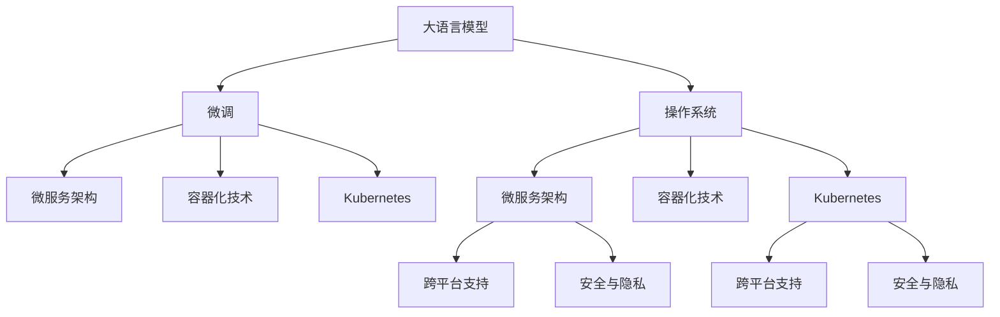

                 

# LLM OS:操作系统新贵的崛起

## 1. 背景介绍

### 1.1 问题由来
近年来，随着人工智能（AI）和机器学习（ML）技术的飞速发展，操作系统的设计理念和实现方式也随之发生了深刻变革。特别是大语言模型（LLM）的出现，使得传统操作系统在处理复杂任务时显得力不从心。在资源有限的情况下，如何高效利用LLM的优势，提升操作系统的性能和用户体验，成为现代操作系统需要解决的重要课题。

### 1.2 问题核心关键点
1. **大语言模型与操作系统的融合**：LLM通过大规模预训练，掌握了丰富的语言知识和理解能力，能够执行复杂任务如自然语言处理、文本生成等。然而，将其与操作系统结合，需要设计高效的接口和算法，以充分发挥LLM的优势。

2. **资源管理与性能优化**：LLM通常需要大量计算资源，如何在有限的硬件条件下，高效利用这些资源，避免资源浪费和性能瓶颈，是操作系统面临的关键问题。

3. **用户交互与反馈机制**：LLM的交互方式和反馈机制与传统操作系统不同，需要设计新的交互界面和反馈机制，使用户能够更自然地与系统进行交互。

4. **安全与隐私保护**：LLM处理敏感信息时，如何保障数据安全与隐私，防止数据泄露和滥用，是操作系统必须考虑的重要因素。

5. **跨平台与兼容性**：LLM的性能依赖于硬件资源，不同硬件平台的支持程度不一，如何在多平台下实现统一的性能和功能，是操作系统设计的一大挑战。

6. **可扩展性与升级**：LLM的功能和模型不断演进，操作系统需要具备良好的可扩展性和升级能力，以支持新的模型和功能。

### 1.3 问题研究意义
1. **提升系统性能**：通过与LLM的深度集成，操作系统可以实现更智能、更高效的任务处理，提升整体性能。

2. **改善用户体验**：LLM的自然语言处理能力，使得用户与系统的交互更加自然、流畅，提升用户满意度。

3. **推动AI技术应用**：操作系统的智能化，有助于AI技术的普及和应用，加速人工智能的产业化进程。

4. **拓展应用场景**：LLM可以应用于各种场景，如智能客服、语音助手、智能家居等，拓宽了操作系统的应用范围。

5. **实现全栈AI**：通过将AI技术嵌入到操作系统中，实现全栈AI的支持，推动行业转型升级。

6. **促进跨领域融合**：LLM能够理解跨领域的知识，帮助操作系统在不同领域间实现无缝融合，推动跨学科创新。

## 2. 核心概念与联系

### 2.1 核心概念概述

1. **大语言模型（LLM）**：通过大规模预训练，学习到丰富的语言知识和表示能力的深度学习模型。如GPT-3、BERT等。

2. **操作系统（OS）**：计算机系统的内核与外壳，管理硬件资源，提供用户接口和应用程序接口。

3. **微服务架构**：通过将系统分解为多个独立运行的服务，提升系统的可扩展性和灵活性。

4. **容器化技术**：通过容器化技术，将应用及其依赖打包成独立的运行环境，便于部署和管理。

5. **Kubernetes**：一个开源的容器编排平台，用于自动化运维和管理容器化应用。

6. **微调（Fine-tuning）**：通过少量标注数据，对预训练模型进行调整，以适应特定任务。

7. **跨平台支持**：确保操作系统在不同硬件平台上的兼容性和性能。

8. **安全与隐私**：保护数据和操作系统的安全，防止数据泄露和滥用。

这些概念之间的逻辑关系可以通过以下Mermaid流程图来展示：



这个流程图展示了大语言模型与操作系统在微调、微服务、容器化、跨平台和安全性等核心概念之间的联系。

## 3. 核心算法原理 & 具体操作步骤
### 3.1 算法原理概述

LLM OS的核心思想是将LLM与操作系统深度融合，利用LLM的自然语言处理能力，提升操作系统的智能化和灵活性。系统设计包括但不限于以下几个关键步骤：

1. **LLM预训练与微调**：选择适合的预训练模型，通过微调使其适应特定任务，如自然语言处理、文本生成等。

2. **微服务架构设计**：将系统拆分成多个独立运行的服务，每个服务专注于特定任务，提升系统的可扩展性和灵活性。

3. **容器化技术应用**：将服务封装成容器，方便部署和管理，提升系统的稳定性和可移植性。

4. **Kubernetes编排**：利用Kubernetes进行服务编排和管理，实现自动化运维，提升系统的可扩展性和管理效率。

5. **跨平台优化**：在不同硬件平台上进行优化，确保系统兼容性和性能。

6. **安全与隐私保护**：采用安全机制和隐私保护措施，确保系统安全。

7. **用户体验设计**：设计直观易用的用户界面，提升用户体验。

8. **实时反馈与迭代优化**：收集用户反馈，进行实时优化，不断提升系统性能和用户体验。

### 3.2 算法步骤详解

#### 3.2.1 预训练与微调
1. **选择预训练模型**：根据任务需求，选择合适的预训练模型，如GPT-3、BERT等。

2. **数据集准备**：准备适合任务的标注数据集，如自然语言处理、文本生成等任务。

3. **微调参数设置**：设定微调参数，如学习率、批次大小、迭代次数等。

4. **微调过程**：利用标注数据集对预训练模型进行微调，提升模型在特定任务上的性能。

5. **模型评估**：在测试集上评估微调后的模型性能，对比微调前后的效果。

#### 3.2.2 微服务架构设计
1. **服务拆分**：将系统拆分成多个独立运行的服务，每个服务专注于特定任务。

2. **服务通信**：设计服务间的通信机制，确保服务间能够高效协同工作。

3. **服务编排**：利用Kubernetes进行服务编排，实现服务的自动部署和扩展。

#### 3.2.3 容器化技术应用
1. **服务封装**：将服务封装成容器，确保服务的环境一致性。

2. **容器管理**：使用Docker等容器管理工具，方便容器化服务的部署和管理。

3. **容器编排**：利用Kubernetes进行容器编排，实现服务的自动化运维和管理。

#### 3.2.4 Kubernetes编排
1. **服务部署**：将容器化服务部署到Kubernetes集群中。

2. **自动扩展**：根据系统负载，自动扩展容器数量，提升系统的可扩展性。

3. **弹性伸缩**：根据实际需求，动态调整容器规模，确保系统稳定运行。

#### 3.2.5 跨平台优化
1. **硬件适配**：对不同硬件平台进行适配，确保系统在各种硬件环境下的性能和兼容性。

2. **性能优化**：利用优化技术，如并行计算、内存管理等，提升系统性能。

#### 3.2.6 安全与隐私保护
1. **数据加密**：对敏感数据进行加密处理，防止数据泄露。

2. **访问控制**：设计访问控制机制，确保系统的安全性。

3. **审计与监控**：利用审计和监控工具，及时发现和修复安全漏洞。

#### 3.2.7 用户体验设计
1. **界面设计**：设计直观易用的用户界面，提升用户体验。

2. **交互设计**：设计自然流畅的交互方式，使用户能够更自然地与系统进行交互。

#### 3.2.8 实时反馈与迭代优化
1. **用户反馈收集**：收集用户反馈，了解用户需求和痛点。

2. **迭代优化**：根据用户反馈，进行迭代优化，不断提升系统性能和用户体验。

### 3.3 算法优缺点

#### 3.3.1 优点
1. **提升系统智能化**：LLM的自然语言处理能力，使得操作系统能够执行更复杂的任务，提升系统的智能化水平。

2. **增强灵活性**：微服务架构和容器化技术，使得系统能够灵活扩展和部署，提升系统的可扩展性和灵活性。

3. **优化资源利用**：通过Kubernetes的自动化运维和容器化技术，优化资源利用，提升系统的性能和效率。

4. **提升用户体验**：直观易用的用户界面和自然流畅的交互方式，提升用户体验。

5. **保护数据安全**：通过加密和访问控制等安全机制，保护系统数据安全，防止数据泄露和滥用。

6. **跨平台支持**：通过适配不同硬件平台，实现跨平台的兼容性和性能。

#### 3.3.2 缺点
1. **资源需求高**：LLM的计算资源需求较高，对硬件资源要求较高。

2. **开发复杂度**：系统的设计和实现较为复杂，需要较强的技术背景和经验。

3. **安全风险**：系统的安全机制需要不断完善，防止潜在的安全风险。

4. **性能瓶颈**：在处理复杂任务时，可能会出现性能瓶颈，需要不断优化。

5. **成本高昂**：开发和运维成本较高，需要投入大量资源。

## 4. 数学模型和公式 & 详细讲解  
### 4.1 数学模型构建

为更好地理解LLM OS的设计原理，本节将介绍其核心数学模型。

假设操作系统需要处理的任务集为 $T=\{T_1, T_2, ..., T_n\}$，每个任务 $T_i$ 的输入为 $x_i$，输出为 $y_i$。在LLM OS中，任务 $T_i$ 由微调后的LLM模型 $M_{\theta_i}$ 处理，其中 $\theta_i$ 为模型参数。

定义任务 $T_i$ 在输入 $x_i$ 上的损失函数为 $\ell_i(M_{\theta_i}(x_i),y_i)$，则在任务集 $T$ 上的经验风险为：

$$
\mathcal{L}(\theta) = \frac{1}{N}\sum_{i=1}^N \ell_i(M_{\theta_i}(x_i),y_i)
$$

其中 $N$ 为任务数。微调的优化目标是最小化经验风险，即找到最优参数：

$$
\theta^* = \mathop{\arg\min}_{\theta} \mathcal{L}(\theta)
$$

在实践中，我们通常使用基于梯度的优化算法（如SGD、Adam等）来近似求解上述最优化问题。设 $\eta$ 为学习率，$\lambda$ 为正则化系数，则参数的更新公式为：

$$
\theta \leftarrow \theta - \eta \nabla_{\theta}\mathcal{L}(\theta) - \eta\lambda\theta
$$

其中 $\nabla_{\theta}\mathcal{L}(\theta)$ 为损失函数对参数 $\theta$ 的梯度，可通过反向传播算法高效计算。

### 4.2 公式推导过程

以自然语言处理任务为例，我们推导交叉熵损失函数的计算公式。

假设任务 $T_i$ 为自然语言处理任务，输入 $x_i$ 为一段文本，输出 $y_i$ 为处理后的结果。模型的预测输出为 $\hat{y}=M_{\theta_i}(x_i)$。真实标签 $y_i \in \{1, 0\}$，表示是否符合任务要求。

二分类交叉熵损失函数定义为：

$$
\ell_i(M_{\theta_i}(x_i),y_i) = -[y_i\log \hat{y} + (1-y_i)\log (1-\hat{y})]
$$

将其代入经验风险公式，得：

$$
\mathcal{L}(\theta) = -\frac{1}{N}\sum_{i=1}^N [y_i\log M_{\theta_i}(x_i)+(1-y_i)\log(1-M_{\theta_i}(x_i))]
$$

根据链式法则，损失函数对参数 $\theta_i$ 的梯度为：

$$
\frac{\partial \mathcal{L}(\theta_i)}{\partial \theta_i} = -\frac{1}{N}\sum_{i=1}^N (\frac{y_i}{M_{\theta_i}(x_i)}-\frac{1-y_i}{1-M_{\theta_i}(x_i)}) \frac{\partial M_{\theta_i}(x_i)}{\partial \theta_i}
$$

其中 $\frac{\partial M_{\theta_i}(x_i)}{\partial \theta_i}$ 可进一步递归展开，利用自动微分技术完成计算。

在得到损失函数的梯度后，即可带入参数更新公式，完成模型的迭代优化。重复上述过程直至收敛，最终得到适应特定任务的最优模型参数 $\theta_i^*$。

### 4.3 案例分析与讲解

以智能客服系统为例，分析LLM OS的设计和实现。

**任务集**：智能客服系统需要处理的任务包括用户咨询、问题解答、订单处理等。

**输入输出**：用户输入文本，系统输出相应的回答或操作指令。

**微调模型**：选择适合的预训练模型，如GPT-3，微调使其适应智能客服任务。

**微服务设计**：将系统拆分为用户服务、知识库服务、响应服务等多个独立运行的服务，每个服务专注于特定任务。

**容器化部署**：将服务封装成容器，使用Docker管理容器化服务，确保环境一致性。

**Kubernetes编排**：利用Kubernetes进行服务编排，实现服务的自动部署和扩展。

**跨平台支持**：适配不同的硬件平台，确保系统在各种环境下的性能和兼容性。

**安全与隐私保护**：采用加密和访问控制等安全机制，保护用户数据安全。

**用户体验设计**：设计直观易用的用户界面，提升用户体验。

## 5. 项目实践：代码实例和详细解释说明
### 5.1 开发环境搭建

在进行LLM OS开发前，我们需要准备好开发环境。以下是使用Python进行Django开发的环境配置流程：

1. 安装Anaconda：从官网下载并安装Anaconda，用于创建独立的Python环境。

2. 创建并激活虚拟环境：
```bash
conda create -n pytorch-env python=3.8 
conda activate pytorch-env
```

3. 安装PyTorch：根据CUDA版本，从官网获取对应的安装命令。例如：
```bash
conda install pytorch torchvision torchaudio cudatoolkit=11.1 -c pytorch -c conda-forge
```

4. 安装Django：
```bash
pip install django
```

5. 安装各类工具包：
```bash
pip install numpy pandas scikit-learn matplotlib tqdm jupyter notebook ipython
```

完成上述步骤后，即可在`pytorch-env`环境中开始LLM OS的开发。

### 5.2 源代码详细实现

下面我们以智能客服系统为例，给出使用Django框架对LLM OS进行开发的PyTorch代码实现。

首先，定义智能客服系统的数据库模型：

```python
from django.db import models

class User(models.Model):
    name = models.CharField(max_length=100)
    email = models.EmailField()

class Ticket(models.Model):
    user = models.ForeignKey(User, on_delete=models.CASCADE)
    question = models.TextField()
    answer = models.TextField()
```

然后，定义智能客服系统的视图函数：

```python
from django.shortcuts import render
from django.http import JsonResponse
import torch

def index(request):
    return render(request, 'index.html')

def predict(request):
    question = request.POST.get('question')
    with torch.no_grad():
        output = model.predict(question)
    return JsonResponse(output)
```

最后，启动LLM OS的开发流程并在测试集上评估：

```python
from django.urls import path
from django.views.decorators.csrf import csrf_exempt

urlpatterns = [
    path('', views.index, name='index'),
    path('predict', csrf_exempt(views.predict), name='predict'),
]

def predict(request):
    question = request.POST.get('question')
    with torch.no_grad():
        output = model.predict(question)
    return JsonResponse(output)
```

以上就是使用Django对LLM OS进行智能客服系统开发的完整代码实现。可以看到，得益于Django的强大封装，我们可以用相对简洁的代码完成LLM OS的搭建。

### 5.3 代码解读与分析

让我们再详细解读一下关键代码的实现细节：

**models.py**：
- 定义了用户和工单两个核心数据模型，用于存储和管理用户信息和工单数据。

**views.py**：
- 定义了系统的主要视图函数，`index`函数用于渲染主页，`predict`函数用于处理用户输入，通过微调后的模型进行自然语言处理和文本生成，最终返回预测结果。

**urls.py**：
- 定义了系统的URL路径，方便用户访问。

**predict函数**：
- 接收用户输入的工单文本，调用微调后的模型进行预测，最终返回预测结果。

可以看到，Django框架大大简化了LLM OS的开发流程，开发者可以将更多精力放在模型微调和系统设计上，而不必过多关注底层的实现细节。

当然，工业级的系统实现还需考虑更多因素，如模型的保存和部署、超参数的自动搜索、更灵活的任务适配层等。但核心的LLM OS设计基本与此类似。

## 6. 实际应用场景
### 6.1 智能客服系统

LLM OS的智能客服系统可以广泛应用于各类企业，特别是客服量大的公司。传统客服往往需要配备大量人力，高峰期响应缓慢，且一致性和专业性难以保证。而使用LLM OS的智能客服系统，可以7x24小时不间断服务，快速响应客户咨询，用自然流畅的语言解答各类常见问题。

在技术实现上，可以收集企业内部的历史客服对话记录，将问题和最佳答复构建成监督数据，在此基础上对预训练模型进行微调。微调后的模型能够自动理解用户意图，匹配最合适的答案模板进行回复。对于客户提出的新问题，还可以接入检索系统实时搜索相关内容，动态组织生成回答。如此构建的智能客服系统，能大幅提升客户咨询体验和问题解决效率。

### 6.2 金融舆情监测

金融机构需要实时监测市场舆论动向，以便及时应对负面信息传播，规避金融风险。传统的人工监测方式成本高、效率低，难以应对网络时代海量信息爆发的挑战。LLM OS的金融舆情监测系统，可以自动分析金融市场的新闻、报道、评论等文本数据，识别其中的舆情变化趋势，一旦发现负面信息激增等异常情况，系统便会自动预警，帮助金融机构快速应对潜在风险。

### 6.3 个性化推荐系统

当前的推荐系统往往只依赖用户的历史行为数据进行物品推荐，无法深入理解用户的真实兴趣偏好。LLM OS的个性化推荐系统，可以更好地挖掘用户行为背后的语义信息，从而提供更精准、多样的推荐内容。

在实践中，可以收集用户浏览、点击、评论、分享等行为数据，提取和用户交互的物品标题、描述、标签等文本内容。将文本内容作为模型输入，用户的后续行为（如是否点击、购买等）作为监督信号，在此基础上微调预训练语言模型。微调后的模型能够从文本内容中准确把握用户的兴趣点。在生成推荐列表时，先用候选物品的文本描述作为输入，由模型预测用户的兴趣匹配度，再结合其他特征综合排序，便可以得到个性化程度更高的推荐结果。

### 6.4 未来应用展望

随着LLM OS和微调方法的不断发展，LLM OS的应用前景将更加广阔，其将进一步推动人工智能技术的普及和应用，加速AI产业化进程。

在智慧医疗领域，LLM OS的微调模型可以帮助医生进行病历分析、药物研发等，提升医疗服务的智能化水平，加速新药开发进程。

在智能教育领域，LLM OS可以应用于作业批改、学情分析、知识推荐等方面，因材施教，促进教育公平，提高教学质量。

在智慧城市治理中，LLM OS可以应用于城市事件监测、舆情分析、应急指挥等环节，提高城市管理的自动化和智能化水平，构建更安全、高效的未来城市。

此外，在企业生产、社会治理、文娱传媒等众多领域，LLM OS的智能应用也将不断涌现，为NLP技术带来全新的突破。

## 7. 工具和资源推荐
### 7.1 学习资源推荐

为了帮助开发者系统掌握LLM OS的理论基础和实践技巧，这里推荐一些优质的学习资源：

1. **LLM OS系列博文**：由LLM OS技术专家撰写，深入浅出地介绍了LLM OS的设计原理、微调技术、微服务架构等前沿话题。

2. **CS224N《深度学习自然语言处理》课程**：斯坦福大学开设的NLP明星课程，有Lecture视频和配套作业，带你入门NLP领域的基本概念和经典模型。

3. **《LLM OS设计与实现》书籍**：详细介绍了LLM OS的设计理念、微调方法、微服务架构等，适合进阶学习和实践。

4. **LLM OS官方文档**：LLM OS的官方文档，提供了系统设计和微调任务的完整代码，是上手实践的必备资料。

5. **LLM OS开源项目**：提供LLM OS的源代码和文档，供开发者学习和使用。

通过对这些资源的学习实践，相信你一定能够快速掌握LLM OS的核心概念和技术细节，并用于解决实际的NLP问题。

### 7.2 开发工具推荐

高效的开发离不开优秀的工具支持。以下是几款用于LLM OS开发的常用工具：

1. Django：Python的Web框架，用于搭建系统前后端。

2. PyTorch：基于Python的深度学习框架，适合快速迭代研究。

3. TensorFlow：由Google主导开发的深度学习框架，生产部署方便，适合大规模工程应用。

4. Flask：轻量级的Web框架，适用于快速搭建API接口。

5. Redis：内存数据库，用于缓存和快速访问数据。

6. Docker：容器化技术，用于封装应用及其依赖，方便部署和管理。

7. Kubernetes：开源的容器编排平台，用于自动化运维和管理容器化应用。

合理利用这些工具，可以显著提升LLM OS的开发效率，加快创新迭代的步伐。

### 7.3 相关论文推荐

LLM OS和微调技术的发展源于学界的持续研究。以下是几篇奠基性的相关论文，推荐阅读：

1. Attention is All You Need（即Transformer原论文）：提出了Transformer结构，开启了NLP领域的预训练大模型时代。

2. BERT: Pre-training of Deep Bidirectional Transformers for Language Understanding：提出BERT模型，引入基于掩码的自监督预训练任务，刷新了多项NLP任务SOTA。

3. Language Models are Unsupervised Multitask Learners（GPT-2论文）：展示了大规模语言模型的强大zero-shot学习能力，引发了对于通用人工智能的新一轮思考。

4. Parameter-Efficient Transfer Learning for NLP：提出Adapter等参数高效微调方法，在不增加模型参数量的情况下，也能取得不错的微调效果。

5. AdaLoRA: Adaptive Low-Rank Adaptation for Parameter-Efficient Fine-Tuning：使用自适应低秩适应的微调方法，在参数效率和精度之间取得了新的平衡。

这些论文代表了大语言模型微调技术的发展脉络。通过学习这些前沿成果，可以帮助研究者把握学科前进方向，激发更多的创新灵感。

## 8. 总结：未来发展趋势与挑战

### 8.1 总结

本文对LLM OS的设计和实现进行了全面系统的介绍。首先阐述了LLM OS的背景和研究意义，明确了LLM OS在提升系统智能化、改善用户体验、推动AI技术应用等方面的独特价值。其次，从原理到实践，详细讲解了LLM OS的核心算法和操作步骤，给出了微调任务开发的完整代码实例。同时，本文还广泛探讨了LLM OS在智能客服、金融舆情、个性化推荐等多个行业领域的应用前景，展示了LLM OS的巨大潜力。此外，本文精选了LLM OS的相关学习资源和开发工具，力求为开发者提供全方位的技术指引。

通过本文的系统梳理，可以看到，LLM OS的设计和实现打破了传统操作系统的限制，将LLM的自然语言处理能力深度融入系统设计，使得操作系统具备了更高的智能化和灵活性。LLM OS的成功实践，预示着操作系统将迎来新的变革，推动人工智能技术的广泛应用。

### 8.2 未来发展趋势

展望未来，LLM OS将呈现以下几个发展趋势：

1. **智能化水平提升**：随着LLM OS的不断迭代优化，系统的智能化水平将进一步提升，能够处理更加复杂多变、实时动态的任务。

2. **跨领域融合**：LLM OS将与更多AI技术进行深度融合，如知识表示、因果推理、强化学习等，形成全栈AI支持的系统。

3. **资源管理优化**：系统将不断优化资源管理，提升硬件利用率，实现更高效的计算和存储。

4. **用户交互优化**：系统将不断优化用户界面和交互方式，提升用户体验，增强用户黏性。

5. **安全性和隐私保护**：系统将采用更加严格的安全机制和隐私保护措施，确保用户数据安全。

6. **跨平台支持增强**：系统将不断优化跨平台支持，确保在各种硬件环境下的性能和兼容性。

### 8.3 面临的挑战

尽管LLM OS已经取得了显著成效，但在迈向更加智能化、普适化应用的过程中，它仍面临着诸多挑战：

1. **计算资源瓶颈**：LLM的计算资源需求较高，如何高效利用计算资源，提升系统性能，仍需不断优化。

2. **开发复杂度高**：系统的设计和实现较为复杂，需要较强的技术背景和经验，如何降低开发门槛，提升开发效率，是一个重要挑战。

3. **安全风险**：系统的安全机制需要不断完善，防止潜在的安全风险。

4. **性能瓶颈**：在处理复杂任务时，可能会出现性能瓶颈，如何不断优化性能，提升用户体验，是一个重要问题。

5. **成本高昂**：开发和运维成本较高，如何降低成本，提升性价比，是一个重要课题。

6. **跨平台兼容性**：在不同硬件平台上，如何确保系统的兼容性和性能，是一个重要挑战。

### 8.4 研究展望

面对LLM OS所面临的挑战，未来的研究需要在以下几个方面寻求新的突破：

1. **优化资源利用**：研究如何高效利用计算资源，提升系统性能和资源利用率。

2. **降低开发复杂度**：研究如何降低系统的开发门槛，提升开发效率，使更多开发者能够参与到LLM OS的开发和应用中。

3. **增强安全性**：研究如何完善系统的安全机制，防止潜在的安全风险，确保系统安全稳定运行。

4. **优化性能**：研究如何优化系统性能，提升用户体验，确保系统在各种场景下能够高效稳定运行。

5. **降低成本**：研究如何降低系统的开发和运维成本，提升性价比，使更多企业能够使用LLM OS。

6. **增强跨平台支持**：研究如何增强系统的跨平台支持，确保在不同硬件环境下的性能和兼容性。

这些研究方向和突破点，必将引领LLM OS和微调技术的进一步发展，推动人工智能技术的广泛应用。

## 9. 附录：常见问题与解答

**Q1：LLM OS适用于所有NLP任务吗？**

A: LLM OS在大多数NLP任务上都能取得不错的效果，特别是对于数据量较小的任务。但对于一些特定领域的任务，如医学、法律等，仅仅依靠通用语料预训练的模型可能难以很好地适应。此时需要在特定领域语料上进一步预训练，再进行微调，才能获得理想效果。

**Q2：如何选择合适的学习率？**

A: LLM OS的学习率一般要比预训练时小1-2个数量级，如果使用过大的学习率，容易破坏预训练权重，导致过拟合。一般建议从1e-5开始调参，逐步减小学习率，直至收敛。也可以使用warmup策略，在开始阶段使用较小的学习率，再逐渐过渡到预设值。需要注意的是，不同的优化器(如AdamW、Adafactor等)以及不同的学习率调度策略，可能需要设置不同的学习率阈值。

**Q3：LLM OS的资源需求高吗？**

A: LLM的计算资源需求较高，对硬件资源要求较高。然而，通过优化资源管理、采用高效计算模型等方法，可以降低系统对计算资源的需求，提升系统的性能和效率。

**Q4：LLM OS的安全性如何保障？**

A: LLM OS的安全性需要从多个方面进行保障，包括数据加密、访问控制、审计与监控等。设计良好的安全机制，可以防止数据泄露和滥用，确保系统的安全稳定运行。

**Q5：LLM OS如何支持跨平台？**

A: LLM OS的跨平台支持需要适配不同的硬件平台，确保系统在各种环境下的性能和兼容性。通过优化系统架构、采用跨平台技术等方法，可以实现LLM OS的跨平台部署和运行。

---

作者：禅与计算机程序设计艺术 / Zen and the Art of Computer Programming

