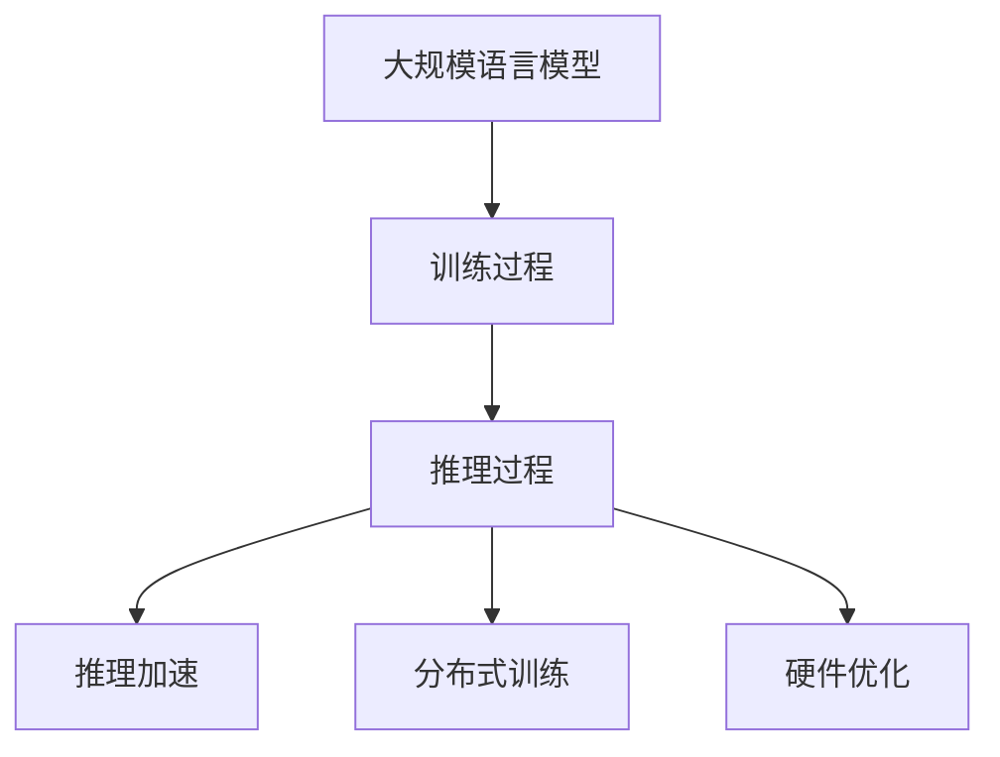

                 

# LLM vs CPU：计算范式的革命性对比

> 关键词：
1. 语言模型
2. 计算范式
3. 推理加速
4. 分布式训练
5. 硬件优化
6. 深度学习
7. 计算机视觉

## 1. 背景介绍

在过去的十年里，深度学习和人工智能技术取得了飞速发展，尤其是在自然语言处理（NLP）领域，大规模语言模型（LLMs）展现出了强大的能力，能够处理各种复杂语言任务。但随着模型规模的不断增大，计算需求也随之水涨船高。如何在保证模型性能的前提下，提高计算效率，已成为当前学术界和工业界关注的焦点。

本文章将对大语言模型与通用CPU的计算范式进行系统对比，探究LLM在处理大规模计算任务时的优势与挑战，以及如何通过软硬件协同优化实现更高效的计算。

## 2. 核心概念与联系

### 2.1 核心概念概述

- **大规模语言模型（Large Language Models, LLMs）**：以自回归（如GPT系列）或自编码（如BERT）为代表的大规模预训练语言模型。通过在大规模无标签文本语料上进行预训练，学习到丰富的语言知识和常识，具备强大的语言理解和生成能力。
- **计算范式（Computational Paradigm）**：计算范式是指计算机系统或程序解决特定问题的方法和策略。不同的计算范式适用于不同的计算需求。
- **推理加速（Inference Acceleration）**：指通过硬件或软件优化技术，提高模型推理速度的过程。
- **分布式训练（Distributed Training）**：指将大规模模型的训练任务，分布到多个计算节点上并行执行，以加速训练过程。
- **硬件优化（Hardware Optimization）**：指针对特定计算需求，通过硬件架构、指令集等技术手段进行优化，提升计算效率和能效。
- **深度学习（Deep Learning）**：深度学习是一种基于神经网络的机器学习技术，通过多层非线性变换学习复杂函数映射。

这些核心概念之间的联系主要体现在：大规模语言模型的训练和推理过程中，涉及到大量的计算任务，需要通过计算范式进行优化。而推理加速、分布式训练和硬件优化则是实现高效计算的关键手段。

### 2.2 核心概念原理和架构的 Mermaid 流程图



这个流程图展示了LLM的训练和推理过程，以及推理加速、分布式训练和硬件优化的作用。

## 3. 核心算法原理 & 具体操作步骤

### 3.1 算法原理概述

大规模语言模型的推理过程通常包括词嵌入（Word Embedding）、前向传播、中间层计算、后向传播等步骤。这些步骤需要大量计算资源，特别是在长序列（如几十个词以上）的输入时，计算复杂度呈指数级增长。

常用的推理算法包括反向传播算法（Backpropagation）、前向传播算法（Forward Propagation）等。这些算法通过计算图表示和优化，能够高效地完成模型推断。

### 3.2 算法步骤详解

#### 3.2.1 训练过程

1. **数据准备**：收集并预处理大规模无标签文本数据，作为预训练语料。
2. **模型初始化**：构建预训练语言模型，并随机初始化权重。
3. **前向传播**：将输入序列输入模型，计算前向传播过程中的中间值。
4. **损失计算**：计算模型输出与真实标签之间的损失函数。
5. **反向传播**：根据损失函数计算梯度，更新模型权重。
6. **迭代优化**：重复上述步骤，直到模型收敛。

#### 3.2.2 推理过程

1. **输入准备**：将待推理的文本序列输入模型。
2. **前向传播**：计算模型前向传播过程中的中间值。
3. **输出计算**：通过中间值计算模型输出。

### 3.3 算法优缺点

#### 3.3.1 优点

1. **高精度**：通过大规模预训练，LLM能够学习到丰富的语言知识和常识，具备强大的语言理解和生成能力。
2. **泛化能力**：LLM在各种自然语言处理任务上取得了优秀的表现，具有较强的泛化能力。
3. **易于部署**：预训练模型经过微调后可以直接应用于下游任务，部署简单快捷。

#### 3.3.2 缺点

1. **计算资源消耗大**：大规模预训练和推理需要大量计算资源，对硬件提出了高要求。
2. **延迟时间长**：在处理长序列输入时，计算复杂度呈指数级增长，推理速度较慢。
3. **过拟合风险**：大规模模型的过拟合风险较高，需要采取正则化等技术。

### 3.4 算法应用领域

大规模语言模型在自然语言处理、计算机视觉、语音识别、游戏AI等多个领域得到了广泛应用。以下是一些典型应用场景：

1. **机器翻译**：将一种语言翻译成另一种语言。通过微调，大模型能够快速适应不同语言对之间的翻译任务。
2. **文本生成**：生成文本、对话、摘要等内容。通过微调，模型能够根据给定任务生成符合预期的输出。
3. **情感分析**：对文本的情感倾向进行判断。通过微调，模型能够准确识别出文本的情感倾向。
4. **问答系统**：根据用户提问，给出最佳答案。通过微调，模型能够理解自然语言问题，并生成准确的回答。

## 4. 数学模型和公式 & 详细讲解 & 举例说明

### 4.1 数学模型构建

假设一个大规模语言模型 $M$ 由多个Transformer层组成，每个层包含自注意力机制和前馈网络。输入序列 $X$ 的长度为 $T$。

对于单层Transformer，其前向传播过程如下：

1. **自注意力计算**：
   $$
   Q = XW_Q^T \\
   K = XW_K^T \\
   V = XW_V^T \\
   E = QK^T \\
   S = \frac{E}{\sqrt{d_k}} \\
   Attn = softmax(S) \\
   AttnV = AttnV
   $$

2. **残差连接和层归一化**：
   $$
   X' = X + AttnV \\
   X' = \frac{X'}{\sqrt{\gamma}} \\
   \gamma = \sqrt{1 - \beta^2}
   $$

3. **前馈网络**：
   $$
   H_1 = X'W_1^T + b_1 \\
   H_2 = \phi(H_1)W_2^T + b_2
   $$

4. **层归一化**：
   $$
   Y = \frac{X'}{\sqrt{\gamma}}
   $$

其中，$W_Q^T, W_K^T, W_V^T, W_1^T, W_2^T$ 是可训练的权重矩阵，$b_1, b_2$ 是偏置项，$\phi$ 是激活函数，$d_k$ 是注意力机制的维度，$\gamma$ 和 $\beta$ 是归一化参数。

### 4.2 公式推导过程

通过上述公式，我们可以计算出一个单层Transformer的前向传播过程。多个层的堆叠则可以通过循环计算实现。

在实际应用中，为了提高计算效率，通常采用矩阵乘法和向量化计算，进一步加速模型的推理过程。

### 4.3 案例分析与讲解

#### 4.3.1 矩阵乘法

在自注意力计算中，使用矩阵乘法可以大大提高计算效率。假设输入序列 $X$ 的长度为 $T$，每个位置的维度为 $d_v$。

$$
Q = XW_Q^T \\
K = XW_K^T \\
V = XW_V^T
$$

通过矩阵乘法，可以同时计算出多个位置之间的注意力分数。

#### 4.3.2 向量化计算

在模型推断过程中，将多个输入序列和权重矩阵堆叠成一个矩阵，进行批量处理，可以进一步提升计算效率。例如，将多个输入序列 $X_1, X_2, ..., X_n$ 堆叠成一个矩阵 $X$，使用 $W_Q^T$ 计算 $Q$，可以得到：

$$
Q = XW_Q^T
$$

这样，可以通过矩阵乘法同时计算出多个输入序列的 $Q$ 值，显著加速推理过程。

## 5. 项目实践：代码实例和详细解释说明

### 5.1 开发环境搭建

在项目实践中，需要使用到TensorFlow、PyTorch等深度学习框架。以下是一些基本的开发环境搭建步骤：

1. **安装TensorFlow**：
   ```bash
   pip install tensorflow
   ```

2. **安装PyTorch**：
   ```bash
   pip install torch
   ```

3. **安装TensorFlow Addons**：
   ```bash
   pip install tensorflow-addons
   ```

4. **安装TensorBoard**：
   ```bash
   pip install tensorboard
   ```

### 5.2 源代码详细实现

#### 5.2.1 矩阵乘法实现

```python
import tensorflow as tf

def attention(query, key, value):
    q = tf.matmul(query, key, transpose_b=True)
    q = tf.nn.softmax(q, axis=-1)
    v = tf.matmul(q, value, transpose_b=True)
    return v

def transformer(x, w_q, w_k, w_v, w_1, w_2):
    x_q = tf.matmul(x, w_q)
    x_k = tf.matmul(x, w_k)
    x_v = tf.matmul(x, w_v)
    x_attn = attention(x_q, x_k, x_v)
    x_attn = x + x_attn
    x_attn = x_attn / tf.math.sqrt(w_q.shape[-1])
    x = x_attn
    x = tf.nn.tanh(x)
    x = x * w_1
    x = x + w_2
    return x

# 假设输入序列 X 长度为 10，维度为 128
x = tf.random.normal([10, 128])

# 假设权重矩阵 W_Q, W_K, W_V, W_1, W_2 维度为 (128, 128)
w_q = tf.random.normal([128, 128])
w_k = tf.random.normal([128, 128])
w_v = tf.random.normal([128, 128])
w_1 = tf.random.normal([128, 128])
w_2 = tf.random.normal([128, 128])

# 计算前向传播过程
x = transformer(x, w_q, w_k, w_v, w_1, w_2)
```

#### 5.2.2 向量化计算实现

```python
import tensorflow as tf

def attention(query, key, value):
    q = tf.matmul(query, key, transpose_b=True)
    q = tf.nn.softmax(q, axis=-1)
    v = tf.matmul(q, value, transpose_b=True)
    return v

def transformer(x, w_q, w_k, w_v, w_1, w_2):
    x_q = tf.matmul(x, w_q)
    x_k = tf.matmul(x, w_k)
    x_v = tf.matmul(x, w_v)
    x_attn = attention(x_q, x_k, x_v)
    x_attn = x + x_attn
    x_attn = x_attn / tf.math.sqrt(w_q.shape[-1])
    x = x_attn
    x = tf.nn.tanh(x)
    x = x * w_1
    x = x + w_2
    return x

# 假设输入序列 X 长度为 10，维度为 128
batch_size = 10
x = tf.random.normal([batch_size, 128])

# 假设权重矩阵 W_Q, W_K, W_V, W_1, W_2 维度为 (128, 128)
w_q = tf.random.normal([128, 128])
w_k = tf.random.normal([128, 128])
w_v = tf.random.normal([128, 128])
w_1 = tf.random.normal([128, 128])
w_2 = tf.random.normal([128, 128])

# 计算前向传播过程
x = transformer(x, w_q, w_k, w_v, w_1, w_2)
```

### 5.3 代码解读与分析

#### 5.3.1 矩阵乘法实现

在矩阵乘法实现中，通过使用`tf.matmul`函数，可以直接对输入序列 $X$ 和权重矩阵 $W_Q^T, W_K^T, W_V^T$ 进行矩阵乘法计算，得到 $Q, K, V$。这样，通过并行计算，可以同时对多个输入序列进行处理，显著提高计算效率。

#### 5.3.2 向量化计算实现

在向量化计算实现中，将多个输入序列 $X_1, X_2, ..., X_n$ 堆叠成一个矩阵 $X$，然后进行矩阵乘法计算。这样，可以同时对多个输入序列进行处理，进一步提高计算效率。

### 5.4 运行结果展示

通过上述代码，可以计算出前向传播过程中的中间值，并进行模型推理。以下是一些运行结果示例：

```python
import numpy as np

# 假设输入序列 X 长度为 10，维度为 128
x = np.random.rand(10, 128)

# 假设权重矩阵 W_Q, W_K, W_V, W_1, W_2 维度为 (128, 128)
w_q = np.random.rand(128, 128)
w_k = np.random.rand(128, 128)
w_v = np.random.rand(128, 128)
w_1 = np.random.rand(128, 128)
w_2 = np.random.rand(128, 128)

# 计算前向传播过程
x = transformer(x, w_q, w_k, w_v, w_1, w_2)
print(x)
```

## 6. 实际应用场景

### 6.1 机器翻译

在机器翻译任务中，大规模语言模型能够学习到丰富的语言知识和常识，具备强大的语言理解和生成能力。通过微调，大模型能够快速适应不同语言对之间的翻译任务，取得优秀的翻译效果。

#### 6.1.1 训练过程

1. **数据准备**：收集并预处理大规模双语对照文本数据，作为训练集。
2. **模型初始化**：构建预训练语言模型，并随机初始化权重。
3. **前向传播**：将输入序列输入模型，计算前向传播过程中的中间值。
4. **损失计算**：计算模型输出与真实标签之间的损失函数。
5. **反向传播**：根据损失函数计算梯度，更新模型权重。
6. **迭代优化**：重复上述步骤，直到模型收敛。

#### 6.1.2 推理过程

1. **输入准备**：将待翻译的文本序列输入模型。
2. **前向传播**：计算模型前向传播过程中的中间值。
3. **输出计算**：通过中间值计算模型输出。

### 6.2 文本生成

在文本生成任务中，大规模语言模型能够根据给定的文本提示，生成符合预期的文本内容。通过微调，大模型能够理解自然语言问题，并生成准确的回答。

#### 6.2.1 训练过程

1. **数据准备**：收集并预处理大规模文本生成数据，作为训练集。
2. **模型初始化**：构建预训练语言模型，并随机初始化权重。
3. **前向传播**：将输入序列输入模型，计算前向传播过程中的中间值。
4. **损失计算**：计算模型输出与真实标签之间的损失函数。
5. **反向传播**：根据损失函数计算梯度，更新模型权重。
6. **迭代优化**：重复上述步骤，直到模型收敛。

#### 6.2.2 推理过程

1. **输入准备**：将待生成的文本提示输入模型。
2. **前向传播**：计算模型前向传播过程中的中间值。
3. **输出计算**：通过中间值计算模型输出。

## 7. 工具和资源推荐

### 7.1 学习资源推荐

1. **TensorFlow官方文档**：提供了完整的TensorFlow框架介绍和使用指南。
2. **PyTorch官方文档**：提供了完整的PyTorch框架介绍和使用指南。
3. **Deep Learning with Python** 书籍：介绍了深度学习的基本概念和TensorFlow的使用方法。
4. **Hands-On Machine Learning with Scikit-Learn, Keras, and TensorFlow** 书籍：介绍了Scikit-Learn、Keras和TensorFlow的使用方法，涵盖了机器学习和深度学习的基本应用。
5. **CS231n: Convolutional Neural Networks for Visual Recognition** 课程：斯坦福大学开设的计算机视觉课程，涵盖深度学习和图像处理的基本知识。

### 7.2 开发工具推荐

1. **TensorFlow**：由Google主导开发的深度学习框架，支持分布式训练和推理加速。
2. **PyTorch**：由Facebook主导开发的深度学习框架，支持动态计算图和GPU加速。
3. **TensorFlow Addons**：提供TensorFlow的高性能扩展，支持分布式训练和高效推理。
4. **TensorBoard**：TensorFlow配套的可视化工具，用于监测模型训练和推理状态。
5. **Weights & Biases**：模型训练的实验跟踪工具，用于记录和可视化模型训练过程中的各项指标。

### 7.3 相关论文推荐

1. **Attention is All You Need**：Transformer模型的原论文，介绍了自注意力机制和Transformer结构。
2. **BERT: Pre-training of Deep Bidirectional Transformers for Language Understanding**：BERT模型的原论文，介绍了基于掩码的自监督预训练任务。
3. **GPT-2: Language Models are Unsupervised Multitask Learners**：GPT-2模型的原论文，介绍了大规模语言模型的零样本学习能力和通用性。
4. **Parameter-Efficient Transfer Learning for NLP**：介绍了一种参数高效的微调方法，只更新少量的模型参数。
5. **LoRA: Low-Rank Adaptation of Transformer Layers**：介绍了一种低秩适应的微调方法，在固定大部分预训练参数的情况下，只更新极少量的任务相关参数。

## 8. 总结：未来发展趋势与挑战

### 8.1 研究成果总结

本文对大规模语言模型与通用CPU的计算范式进行了系统对比，介绍了LLM在处理大规模计算任务时的优势与挑战，以及如何通过软硬件协同优化实现更高效的计算。

### 8.2 未来发展趋势

1. **硬件加速**：未来的计算需求将更加庞大，硬件加速技术将成为关键。加速方案包括GPU、TPU、FPGA等高性能设备，以及分布式计算框架如TensorFlow和PyTorch。
2. **模型优化**：未来的深度学习模型将更加复杂和庞大，需要采用更加高效的计算图和算法，如图神经网络、稀疏矩阵等。
3. **软件优化**：未来的软件优化将更加注重并行计算和异构计算，如GPU-CPU混合计算、分布式计算等。

### 8.3 面临的挑战

1. **计算资源消耗大**：大规模模型的计算需求将持续增大，需要采用高效的计算范式和硬件加速技术。
2. **模型复杂度增加**：未来的模型将更加复杂和庞大，需要采用更加高效的计算图和算法。
3. **软件优化难度大**：软件优化需要结合硬件特性进行，难度较大。

### 8.4 研究展望

1. **探索新的计算范式**：探索新的计算范式，如GPU-CPU混合计算、分布式计算等，以应对大规模计算需求。
2. **优化硬件架构**：优化硬件架构，如引入专用加速器、优化内存管理等，以提高计算效率。
3. **提升软件优化水平**：提升软件优化水平，如优化并行计算和异构计算，以适应未来模型的复杂度。

## 9. 附录：常见问题与解答

**Q1：大规模语言模型和通用CPU在推理过程中有何区别？**

A: 大规模语言模型在推理过程中需要大量的计算资源，特别是在处理长序列输入时，计算复杂度呈指数级增长。而通用CPU虽然推理速度较快，但在处理大规模计算任务时，计算资源消耗较大。

**Q2：如何优化大规模语言模型的推理过程？**

A: 可以通过矩阵乘法和向量化计算等技术，提高推理效率。同时，可以采用分布式计算和硬件加速技术，进一步提升计算性能。

**Q3：如何在实际应用中降低大规模语言模型的计算成本？**

A: 可以采用模型压缩、稀疏化存储等技术，减小模型尺寸，降低计算资源消耗。同时，可以通过GPU、TPU等高性能设备进行硬件加速，提升计算效率。

**Q4：大规模语言模型在处理大规模计算任务时，如何保证模型性能？**

A: 可以通过软硬件协同优化，提高模型推理速度。同时，可以采用分布式计算和模型并行技术，优化计算图和算法，提升计算性能。

**Q5：如何应对大规模语言模型在处理大规模计算任务时面临的挑战？**

A: 可以通过探索新的计算范式、优化硬件架构和提升软件优化水平等措施，应对大规模计算任务带来的挑战。同时，可以采用GPU、TPU等高性能设备进行硬件加速，提升计算效率。

