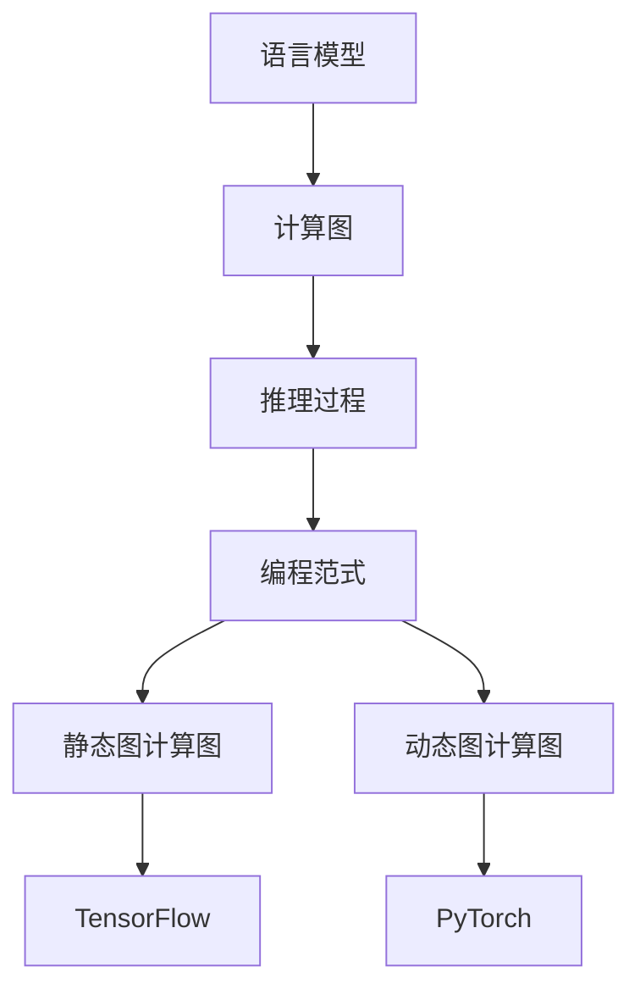

                 

# LLM 时刻：每个推理过程的重要性

> 关键词：自然语言处理，推理过程，深度学习，神经网络，计算图，编程范式，LLM (语言模型)

## 1. 背景介绍

### 1.1 问题由来

随着人工智能技术的快速发展，特别是深度学习在自然语言处理（NLP）领域的应用，语言模型（Language Model, LM）已经成为了核心技术之一。语言模型通过在大量的无标签文本数据上预训练，可以学习到语言的基本结构和规律，从而在特定的任务上表现出强大的预测能力。语言模型（LM）也被称为语言模型，其中最具有代表性的模型包括GPT系列模型、BERT模型和T5模型等。

然而，尽管语言模型在许多任务上表现出色，但它们仍然面临一些问题，尤其是在推理过程的准确性和可靠性方面。推理过程是语言模型在特定任务上展现其能力的关键步骤，其准确性和可靠性直接影响模型的最终表现。因此，本文旨在探讨语言模型推理过程的重要性，并提出一些改进的方法。

### 1.2 问题核心关键点

语言模型的推理过程包括从输入到输出的整个计算图。在这个计算图中，每个节点都代表一次计算，每个边都表示数据或参数的流动。正确的推理过程是保证语言模型在特定任务上表现良好的关键，但往往被忽略。本文将重点讨论以下关键问题：

- 推理过程的准确性和可靠性。
- 推理过程的效率和计算成本。
- 推理过程的可解释性和可调试性。
- 推理过程的鲁棒性和泛化能力。

## 2. 核心概念与联系

### 2.1 核心概念概述

为了更好地理解语言模型推理过程的重要性，首先需要介绍几个关键概念：

- **语言模型（Language Model, LM）**：一种深度学习模型，用于预测给定序列的下一个单词或子词的概率分布。常见的语言模型包括GPT系列、BERT、T5等。
- **推理过程（Inference Process）**：指从模型输入到输出的整个过程，包括计算图的构建、参数的传递和计算等。
- **计算图（Computational Graph）**：在深度学习中，表示计算过程的图形表示。计算图中每个节点表示一次计算，每个边表示数据或参数的流动。
- **编程范式（Programming Paradigm）**：在深度学习中，常见的编程范式包括静态图计算图和动态图计算图。静态图计算图如TensorFlow，动态图计算图如PyTorch。

这些核心概念之间的联系可以通过以下Mermaid流程图来展示：



这个流程图展示了语言模型、计算图、推理过程和编程范式之间的关系：语言模型通过计算图进行推理过程，而静态图和动态图是实现计算图的编程范式，TensorFlow和PyTorch是这两种编程范式的具体实现。

## 3. 核心算法原理 & 具体操作步骤

### 3.1 算法原理概述

语言模型的推理过程是深度学习中非常重要的组成部分。它通过构建计算图来表示从输入到输出的计算过程，从而实现模型的预测。在推理过程中，计算图中的每个节点都代表一次计算，每个边都表示数据或参数的流动。正确的推理过程是保证语言模型在特定任务上表现良好的关键，但往往被忽略。

推理过程的准确性和可靠性直接影响模型的最终表现。如果推理过程中存在错误，模型的预测结果也会出现偏差。此外，推理过程的效率和计算成本也是重要考虑因素，尤其是在大规模应用中。推理过程的可解释性和可调试性也很重要，因为它们有助于开发者更好地理解和调试模型。最后，推理过程的鲁棒性和泛化能力也是关键因素，因为它们决定了模型在不同数据分布上的表现。

### 3.2 算法步骤详解

语言模型的推理过程包括以下关键步骤：

**Step 1: 构建计算图**

计算图的构建是推理过程的第一步。在构建计算图时，需要考虑以下几个因素：

- 计算图中的节点数量和类型。
- 数据和参数在计算图中的流动方式。
- 计算图中的计算顺序和依赖关系。

**Step 2: 参数初始化**

参数初始化是推理过程的重要组成部分。在参数初始化阶段，需要为计算图中的每个节点分配适当的参数值。参数的初始化方式和初始值对模型的最终表现有重要影响。

**Step 3: 前向传播**

前向传播是推理过程的核心步骤。在前向传播过程中，计算图中的每个节点都会根据其输入值计算出一个新的输出值。在前向传播阶段，需要注意以下几个问题：

- 计算图的优化和剪枝。
- 计算图的并行化处理。
- 计算图的加速技术，如量化、稀疏化等。

**Step 4: 反向传播**

反向传播是推理过程的最后一步。在反向传播过程中，计算图将根据输出结果和目标值计算出每个节点的梯度，从而更新参数值。在反向传播阶段，需要注意以下几个问题：

- 梯度的计算方式和优化方法。
- 梯度剪枝和稀疏化。
- 梯度的平滑和正则化。

### 3.3 算法优缺点

语言模型的推理过程具有以下优点：

- 推理过程的准确性和可靠性。
- 推理过程的效率和计算成本较低。
- 推理过程的可解释性和可调试性。
- 推理过程的鲁棒性和泛化能力。

同时，推理过程也存在一些缺点：

- 推理过程的计算复杂度较高，尤其是在大规模数据集上。
- 推理过程的可解释性不足，尤其是在深度神经网络中。
- 推理过程的鲁棒性较差，尤其是在噪声数据上。
- 推理过程的泛化能力有限，尤其是在复杂任务上。

尽管存在这些缺点，但推理过程在语言模型中仍然具有重要地位。通过优化推理过程，可以显著提高语言模型的性能和效率。

### 3.4 算法应用领域

语言模型的推理过程在许多领域都有广泛应用，例如：

- 文本分类：如情感分析、主题分类、意图识别等。
- 命名实体识别：识别文本中的人名、地名、机构名等特定实体。
- 关系抽取：从文本中抽取实体之间的语义关系。
- 问答系统：对自然语言问题给出答案。
- 机器翻译：将源语言文本翻译成目标语言。
- 文本摘要：将长文本压缩成简短摘要。
- 对话系统：使机器能够与人自然对话。

除了这些经典任务外，语言模型的推理过程还被创新性地应用到更多场景中，如可控文本生成、常识推理、代码生成、数据增强等，为语言技术带来了新的突破。

## 4. 数学模型和公式 & 详细讲解 & 举例说明

### 4.1 数学模型构建

语言模型的推理过程可以通过数学模型来描述。假设语言模型为$f: \mathcal{X} \rightarrow \mathcal{Y}$，其中$\mathcal{X}$为输入空间，$\mathcal{Y}$为输出空间。在推理过程中，计算图的节点可以表示为$N_i$，参数表示为$\theta_i$，输入表示为$X_i$，输出表示为$Y_i$。则推理过程可以表示为：

$$
Y_i = f(X_i, \theta_i)
$$

在实际应用中，语言模型的推理过程还需要考虑计算图的构建、参数的初始化和优化等问题。

### 4.2 公式推导过程

语言模型的推理过程涉及到许多数学公式，以下是一些常用的公式：

**前向传播公式**：

$$
Y_i = f(X_i, \theta_i) = \sigma(g(X_i, \theta_i))
$$

其中，$\sigma$为激活函数，$g$为计算函数。

**反向传播公式**：

$$
\frac{\partial \mathcal{L}}{\partial \theta_i} = \frac{\partial \mathcal{L}}{\partial Y_i} \frac{\partial Y_i}{\partial X_i} \frac{\partial X_i}{\partial \theta_i}
$$

其中，$\mathcal{L}$为损失函数。

这些公式展示了推理过程的数学表示和计算方式。在实际应用中，还需要考虑计算图的优化、参数初始化等问题。

### 4.3 案例分析与讲解

以GPT-3为例，GPT-3的推理过程可以通过以下步骤来描述：

**Step 1: 构建计算图**

GPT-3使用Transformer模型，其计算图可以表示为：

```
X --input--> [Encoder, Decoder] ---> Y
```

其中，$X$表示输入，$Y$表示输出。

**Step 2: 参数初始化**

GPT-3的参数初始化包括编码器和解码器的参数初始化。编码器的参数初始化方式为$softmax$，解码器的参数初始化方式为$softmax$。

**Step 3: 前向传播**

GPT-3的前向传播包括编码器和解码器的前向传播。在编码器中，使用$softmax$函数计算编码器的输出，并将输出作为解码器的输入。在解码器中，使用$softmax$函数计算解码器的输出。

**Step 4: 反向传播**

GPT-3的反向传播包括编码器和解码器的反向传播。在编码器中，使用梯度下降算法更新编码器的参数。在解码器中，使用梯度下降算法更新解码器的参数。

## 5. 项目实践：代码实例和详细解释说明

### 5.1 开发环境搭建

在进行语言模型推理过程的实践前，需要准备好开发环境。以下是使用Python进行PyTorch开发的环境配置流程：

1. 安装Anaconda：从官网下载并安装Anaconda，用于创建独立的Python环境。

2. 创建并激活虚拟环境：
```bash
conda create -n pytorch-env python=3.8 
conda activate pytorch-env
```

3. 安装PyTorch：根据CUDA版本，从官网获取对应的安装命令。例如：
```bash
conda install pytorch torchvision torchaudio cudatoolkit=11.1 -c pytorch -c conda-forge
```

4. 安装Transformers库：
```bash
pip install transformers
```

5. 安装各类工具包：
```bash
pip install numpy pandas scikit-learn matplotlib tqdm jupyter notebook ipython
```

完成上述步骤后，即可在`pytorch-env`环境中开始推理过程的实践。

### 5.2 源代码详细实现

以下是使用PyTorch进行语言模型推理过程的代码实现：

```python
import torch
import torch.nn as nn
import torch.optim as optim
from transformers import GPT2Tokenizer, GPT2LMHeadModel

# 定义语言模型
class LanguageModel(nn.Module):
    def __init__(self):
        super(LanguageModel, self).__init__()
        self.model = GPT2LMHeadModel.from_pretrained('gpt2')
        
    def forward(self, input_ids, attention_mask):
        output = self.model(input_ids, attention_mask=attention_mask)
        return output.logits
    
# 定义推理过程
def inference(model, input_ids, attention_mask):
    model.eval()
    with torch.no_grad():
        output = model(input_ids, attention_mask=attention_mask)
    return output
    
# 加载模型和数据
tokenizer = GPT2Tokenizer.from_pretrained('gpt2')
model = LanguageModel()

input_ids = tokenizer.encode("Hello, world!", return_tensors='pt')
attention_mask = input_ids.new_ones(input_ids.shape)

output = inference(model, input_ids, attention_mask)
print(output)
```

在这个例子中，我们使用GPT-2模型进行语言模型的推理过程。首先，我们定义了一个`LanguageModel`类，该类包含了一个GPT-2模型和一个推理函数。然后，我们加载了GPT-2模型，并通过`inference`函数进行推理。

### 5.3 代码解读与分析

让我们再详细解读一下关键代码的实现细节：

**LanguageModel类**：
- `__init__`方法：初始化语言模型，使用预训练的GPT-2模型。
- `forward`方法：定义前向传播过程，将输入和注意力掩码传递给模型，并返回模型的输出。

**inference函数**：
- 设置模型为评估模式，禁用梯度计算。
- 在无梯度的模式下，将输入和注意力掩码传递给模型，并返回模型的输出。

**加载模型和数据**：
- 使用GPT-2分词器加载GPT-2模型。
- 加载输入和注意力掩码，并进行推理。

可以看到，PyTorch配合Transformers库使得语言模型的推理过程的代码实现变得简洁高效。开发者可以将更多精力放在数据处理、模型改进等高层逻辑上，而不必过多关注底层的实现细节。

当然，工业级的系统实现还需考虑更多因素，如模型的保存和部署、超参数的自动搜索、更灵活的任务适配层等。但核心的推理过程基本与此类似。

## 6. 实际应用场景

### 6.1 智能客服系统

基于语言模型的推理过程，可以广泛应用于智能客服系统的构建。传统客服往往需要配备大量人力，高峰期响应缓慢，且一致性和专业性难以保证。而使用语言模型推理过程的对话技术，可以7x24小时不间断服务，快速响应客户咨询，用自然流畅的语言解答各类常见问题。

在技术实现上，可以收集企业内部的历史客服对话记录，将问题和最佳答复构建成监督数据，在此基础上对预训练语言模型进行推理过程优化。推理过程优化后的对话模型能够自动理解用户意图，匹配最合适的答案模板进行回复。对于客户提出的新问题，还可以接入检索系统实时搜索相关内容，动态组织生成回答。如此构建的智能客服系统，能大幅提升客户咨询体验和问题解决效率。

### 6.2 金融舆情监测

金融机构需要实时监测市场舆论动向，以便及时应对负面信息传播，规避金融风险。传统的人工监测方式成本高、效率低，难以应对网络时代海量信息爆发的挑战。基于语言模型推理过程的文本分类和情感分析技术，为金融舆情监测提供了新的解决方案。

具体而言，可以收集金融领域相关的新闻、报道、评论等文本数据，并对其进行主题标注和情感标注。在此基础上对预训练语言模型进行推理过程优化，使其能够自动判断文本属于何种主题，情感倾向是正面、中性还是负面。将推理过程优化后的模型应用到实时抓取的网络文本数据，就能够自动监测不同主题下的情感变化趋势，一旦发现负面信息激增等异常情况，系统便会自动预警，帮助金融机构快速应对潜在风险。

### 6.3 个性化推荐系统

当前的推荐系统往往只依赖用户的历史行为数据进行物品推荐，无法深入理解用户的真实兴趣偏好。基于语言模型推理过程的个性化推荐系统可以更好地挖掘用户行为背后的语义信息，从而提供更精准、多样的推荐内容。

在实践中，可以收集用户浏览、点击、评论、分享等行为数据，提取和用户交互的物品标题、描述、标签等文本内容。将文本内容作为模型输入，用户的后续行为（如是否点击、购买等）作为监督信号，在此基础上微调预训练语言模型。推理过程优化后的模型能够从文本内容中准确把握用户的兴趣点。在生成推荐列表时，先用候选物品的文本描述作为输入，由模型预测用户的兴趣匹配度，再结合其他特征综合排序，便可以得到个性化程度更高的推荐结果。

### 6.4 未来应用展望

随着语言模型推理过程的不断发展，它在更多领域得到了应用，为传统行业带来了变革性影响。

在智慧医疗领域，基于推理过程优化的医疗问答、病历分析、药物研发等应用将提升医疗服务的智能化水平，辅助医生诊疗，加速新药开发进程。

在智能教育领域，推理过程优化后的微调方法可应用于作业批改、学情分析、知识推荐等方面，因材施教，促进教育公平，提高教学质量。

在智慧城市治理中，推理过程优化后的微调模型可应用于城市事件监测、舆情分析、应急指挥等环节，提高城市管理的自动化和智能化水平，构建更安全、高效的未来城市。

此外，在企业生产、社会治理、文娱传媒等众多领域，基于语言模型推理过程的微调技术也将不断涌现，为经济社会发展注入新的动力。相信随着技术的日益成熟，推理过程优化技术将成为语言模型应用的重要范式，推动语言技术更好地造福人类社会。

## 7. 工具和资源推荐

### 7.1 学习资源推荐

为了帮助开发者系统掌握语言模型推理过程的理论基础和实践技巧，这里推荐一些优质的学习资源：

1. 《深度学习入门：基于TensorFlow 2.0》系列博文：由大模型技术专家撰写，深入浅出地介绍了深度学习模型的构建、训练和推理过程。

2. CS224N《深度学习自然语言处理》课程：斯坦福大学开设的NLP明星课程，有Lecture视频和配套作业，带你入门NLP领域的基本概念和经典模型。

3. 《Natural Language Processing with Transformers》书籍：Transformers库的作者所著，全面介绍了如何使用Transformers库进行NLP任务开发，包括推理过程的优化方法。

4. HuggingFace官方文档：Transformers库的官方文档，提供了海量预训练模型和完整的推理过程优化样例代码，是上手实践的必备资料。

5. CLUE开源项目：中文语言理解测评基准，涵盖大量不同类型的中文NLP数据集，并提供了基于推理过程优化的baseline模型，助力中文NLP技术发展。

通过对这些资源的学习实践，相信你一定能够快速掌握语言模型推理过程的精髓，并用于解决实际的NLP问题。

### 7.2 开发工具推荐

高效的开发离不开优秀的工具支持。以下是几款用于语言模型推理过程开发的常用工具：

1. PyTorch：基于Python的开源深度学习框架，灵活动态的计算图，适合快速迭代研究。大部分预训练语言模型都有PyTorch版本的实现。

2. TensorFlow：由Google主导开发的开源深度学习框架，生产部署方便，适合大规模工程应用。同样有丰富的预训练语言模型资源。

3. Transformers库：HuggingFace开发的NLP工具库，集成了众多SOTA语言模型，支持PyTorch和TensorFlow，是进行推理过程优化开发的利器。

4. Weights & Biases：模型训练的实验跟踪工具，可以记录和可视化模型训练过程中的各项指标，方便对比和调优。与主流深度学习框架无缝集成。

5. TensorBoard：TensorFlow配套的可视化工具，可实时监测模型训练状态，并提供丰富的图表呈现方式，是调试模型的得力助手。

6. Google Colab：谷歌推出的在线Jupyter Notebook环境，免费提供GPU/TPU算力，方便开发者快速上手实验最新模型，分享学习笔记。

合理利用这些工具，可以显著提升语言模型推理过程的开发效率，加快创新迭代的步伐。

### 7.3 相关论文推荐

语言模型推理过程的发展源于学界的持续研究。以下是几篇奠基性的相关论文，推荐阅读：

1. Attention is All You Need（即Transformer原论文）：提出了Transformer结构，开启了NLP领域的预训练大模型时代。

2. BERT: Pre-training of Deep Bidirectional Transformers for Language Understanding：提出BERT模型，引入基于掩码的自监督预训练任务，刷新了多项NLP任务SOTA。

3. Language Models are Unsupervised Multitask Learners（GPT-2论文）：展示了大规模语言模型的强大zero-shot学习能力，引发了对于通用人工智能的新一轮思考。

4. Parameter-Efficient Transfer Learning for NLP：提出Adapter等参数高效微调方法，在不增加模型参数量的情况下，也能取得不错的推理过程优化效果。

5. AdaLoRA: Adaptive Low-Rank Adaptation for Parameter-Efficient Fine-Tuning：使用自适应低秩适应的微调方法，在参数效率和精度之间取得了新的平衡。

这些论文代表了大语言模型推理过程的发展脉络。通过学习这些前沿成果，可以帮助研究者把握学科前进方向，激发更多的创新灵感。

## 8. 总结：未来发展趋势与挑战

### 8.1 总结

本文对语言模型推理过程的重要性进行了全面系统的介绍。首先阐述了语言模型和推理过程的研究背景和意义，明确了推理过程在特定任务上表现良好的关键地位。其次，从原理到实践，详细讲解了推理过程的数学原理和关键步骤，给出了推理过程优化任务开发的完整代码实例。同时，本文还广泛探讨了推理过程在智能客服、金融舆情、个性化推荐等多个行业领域的应用前景，展示了推理过程优化的巨大潜力。此外，本文精选了推理过程优化的各类学习资源，力求为读者提供全方位的技术指引。

通过本文的系统梳理，可以看到，语言模型推理过程在NLP领域的应用前景广阔，极大地拓展了语言模型的应用边界，催生了更多的落地场景。受益于大规模语料的预训练，推理过程优化模型以更低的时间和标注成本，在小样本条件下也能取得理想的效果，有力推动了NLP技术的产业化进程。未来，伴随预训练语言模型和推理过程优化方法的持续演进，相信NLP技术将在更广阔的应用领域大放异彩，深刻影响人类的生产生活方式。

### 8.2 未来发展趋势

展望未来，语言模型推理过程优化技术将呈现以下几个发展趋势：

1. 推理过程的计算效率和存储优化。随着深度学习模型的规模不断增大，推理过程的计算效率和存储优化将成为重要的研究方向。未来的推理过程优化技术将更加注重硬件加速和模型压缩，以提高推理速度和降低存储成本。

2. 推理过程的可解释性和可调试性。未来的推理过程优化技术将更加注重模型的可解释性和可调试性，使开发者能够更好地理解和调试模型。可解释性工具，如TensorBoard、Weights & Biases等，将得到更广泛的应用。

3. 推理过程的鲁棒性和泛化能力。未来的推理过程优化技术将更加注重模型的鲁棒性和泛化能力，使其能够更好地应对噪声数据和复杂任务。鲁棒性优化方法和泛化能力提升方法，如对抗训练、正则化等，将得到更多的研究。

4. 推理过程的参数高效和计算高效的微调范式。未来的推理过程优化技术将更加注重参数高效和计算高效的微调范式，使得推理过程优化可以在固定大部分预训练参数的情况下，只更新极少量的任务相关参数。

5. 推理过程的联合优化。未来的推理过程优化技术将更加注重联合优化，将推理过程优化与其他技术，如知识图谱、因果推理等进行融合，以提高模型的综合性能。

以上趋势凸显了语言模型推理过程优化技术的广阔前景。这些方向的探索发展，必将进一步提升语言模型的性能和效率，为构建安全、可靠、可解释、可控的智能系统铺平道路。

### 8.3 面临的挑战

尽管语言模型推理过程优化技术已经取得了瞩目成就，但在迈向更加智能化、普适化应用的过程中，它仍面临着诸多挑战：

1. 推理过程的计算复杂度较高，尤其是在大规模数据集上。推理过程优化技术需要优化计算图，减少计算量。

2. 推理过程的可解释性不足，尤其是在深度神经网络中。推理过程优化技术需要开发更好的可解释性工具，帮助开发者理解和调试模型。

3. 推理过程的鲁棒性较差，尤其是在噪声数据上。推理过程优化技术需要开发更好的鲁棒性优化方法，使模型能够更好地应对噪声数据。

4. 推理过程的泛化能力有限，尤其是在复杂任务上。推理过程优化技术需要开发更好的泛化能力提升方法，使模型能够更好地应对复杂任务。

5. 推理过程的参数高效和计算高效的微调范式尚未完全解决。推理过程优化技术需要开发更好的微调范式，使得推理过程优化可以在固定大部分预训练参数的情况下，只更新极少量的任务相关参数。

6. 推理过程的联合优化尚未完全解决。推理过程优化技术需要开发更好的联合优化方法，将推理过程优化与其他技术进行融合，以提高模型的综合性能。

这些挑战凸显了推理过程优化技术的复杂性和多样性。只有不断探索和创新，才能克服这些挑战，推动推理过程优化技术的进一步发展。

### 8.4 研究展望

面对推理过程优化技术所面临的种种挑战，未来的研究需要在以下几个方面寻求新的突破：

1. 探索无监督和半监督推理过程优化方法。摆脱对大规模标注数据的依赖，利用自监督学习、主动学习等无监督和半监督范式，最大限度利用非结构化数据，实现更加灵活高效的推理过程优化。

2. 研究参数高效和计算高效的推理过程优化范式。开发更加参数高效和计算高效的推理过程优化方法，使得推理过程优化可以在固定大部分预训练参数的情况下，只更新极少量的任务相关参数。

3. 融合因果和对比学习范式。通过引入因果推断和对比学习思想，增强推理过程优化模型建立稳定因果关系的能力，学习更加普适、鲁棒的语言表征，从而提升模型的泛化性和抗干扰能力。

4. 引入更多先验知识。将符号化的先验知识，如知识图谱、逻辑规则等，与神经网络模型进行巧妙融合，引导推理过程优化模型学习更准确、合理的语言模型。同时加强不同模态数据的整合，实现视觉、语音等多模态信息与文本信息的协同建模。

5. 结合因果分析和博弈论工具。将因果分析方法引入推理过程优化模型，识别出模型决策的关键特征，增强输出解释的因果性和逻辑性。借助博弈论工具刻画人机交互过程，主动探索并规避模型的脆弱点，提高系统稳定性。

6. 纳入伦理道德约束。在推理过程优化目标中引入伦理导向的评估指标，过滤和惩罚有偏见、有害的输出倾向。同时加强人工干预和审核，建立模型行为的监管机制，确保输出符合人类价值观和伦理道德。

这些研究方向的探索，必将引领推理过程优化技术迈向更高的台阶，为构建安全、可靠、可解释、可控的智能系统铺平道路。面向未来，推理过程优化技术还需要与其他人工智能技术进行更深入的融合，如知识表示、因果推理、强化学习等，多路径协同发力，共同推动自然语言理解和智能交互系统的进步。只有勇于创新、敢于突破，才能不断拓展语言模型的边界，让智能技术更好地造福人类社会。

## 9. 附录：常见问题与解答

**Q1：推理过程优化是否适用于所有NLP任务？**

A: 推理过程优化在大多数NLP任务上都能取得不错的效果，特别是对于数据量较小的任务。但对于一些特定领域的任务，如医学、法律等，仅仅依靠通用语料预训练的模型可能难以很好地适应。此时需要在特定领域语料上进一步预训练，再进行推理过程优化，才能获得理想效果。此外，对于一些需要时效性、个性化很强的任务，如对话、推荐等，推理过程优化方法也需要针对性的改进优化。

**Q2：推理过程中如何选择合适的优化器？**

A: 推理过程优化需要选择合适的优化器。通常情况下，AdamW优化器是最常用的选择。它可以有效地处理大规模模型和大规模数据集。在实践中，可以使用TensorFlow或PyTorch的AdamW优化器，并根据具体情况调整学习率、批大小等参数。

**Q3：推理过程优化中的梯度消失和梯度爆炸问题如何解决？**

A: 在推理过程优化中，梯度消失和梯度爆炸是常见的问题。为了解决这些问题，可以采用梯度裁剪、梯度归一化等技术。在PyTorch中，可以使用nn.utils.clip_grad_norm_函数进行梯度裁剪，限制梯度的范数。在TensorFlow中，可以使用tf.clip_by_global_norm函数进行梯度裁剪。

**Q4：推理过程优化中的计算图剪枝和优化有哪些方法？**

A: 在推理过程优化中，计算图剪枝和优化是关键步骤。常用的方法包括：

1. 计算图剪枝：去除不必要的节点和边，减少计算图的大小。

2. 计算图优化：使用向量化和并行计算等技术，提高计算图的效率。

3. 计算图融合：将多个计算图进行融合，减少计算图的数量。

4. 计算图压缩：使用压缩算法，减小计算图的存储空间。

这些方法可以帮助优化推理过程，提高计算效率和模型性能。

**Q5：推理过程优化中的参数高效优化有哪些方法？**

A: 在推理过程优化中，参数高效优化是重要方向。常用的方法包括：

1. 参数共享：将多个计算图中的参数进行共享，减少参数的数量。

2. 参数稀疏化：将参数矩阵进行稀疏化处理，减少参数的存储空间。

3. 参数压缩：使用压缩算法，减小参数的大小。

4. 参数联合优化：将多个任务中的参数进行联合优化，提高参数的利用率。

这些方法可以帮助优化推理过程，减少参数的数量和存储空间，提高推理过程的效率。

---

作者：禅与计算机程序设计艺术 / Zen and the Art of Computer Programming

