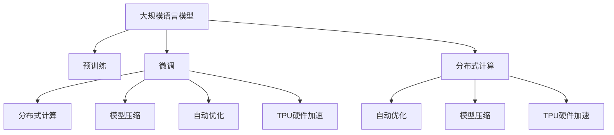

                 

# LLM:一种新型的计算机架构

> 关键词：大规模语言模型,计算架构,深度学习,分布式计算,硬件加速,自动优化,模型压缩,资源利用率

## 1. 背景介绍

### 1.1 问题由来
近年来，随着深度学习技术的快速发展和硬件计算能力的显著提升，大规模语言模型（Large Language Models, LLMs）在自然语言处理（Natural Language Processing, NLP）领域取得了巨大的突破。这些模型如OpenAI的GPT-3、Google的BERT等，通过在庞大的语料库上进行预训练，能够捕捉和模拟人类语言的复杂结构和语义，展现出卓越的语言理解和生成能力。

然而，LLMs在处理大规模、高维度的数据时，面临诸多挑战。首先，模型参数量巨大，内存和计算资源消耗惊人，限制了其在实时应用中的部署。其次，模型训练和推理过程中需要高效的并行化策略和优化的算法，以应对大规模分布式计算的需求。此外，模型的可扩展性和可维护性也成为重要的考量因素。

面对这些挑战，学术界和工业界都在积极探索新的计算架构和技术，以支持LLMs的训练和推理。一种新型的计算架构——LLM架构（Large Language Model Architecture）应运而生。LLM架构旨在通过硬件加速、自动优化、分布式计算等手段，大幅提升LLMs的计算效率和资源利用率，为大规模语言模型的应用提供坚实的基础。

### 1.2 问题核心关键点
LLM架构的核心目标是：
1. **高效硬件加速**：利用专用硬件（如TPU、FPGA）和新兴技术（如量子计算），大幅提升LLMs的训练和推理速度。
2. **自动优化**：采用基于模型驱动的自动优化技术，动态调整模型参数和计算策略，适应不同的计算环境和资源限制。
3. **分布式计算**：利用多节点、多任务并行计算，提高计算资源利用率，支持大规模数据集的处理。
4. **模型压缩**：通过剪枝、量化、蒸馏等技术，减少模型参数和计算量，降低内存和存储需求。
5. **可扩展性与可维护性**：设计模块化和组件化的架构，便于模型更新和系统扩展，提升系统的稳定性和可靠性。

本文将深入探讨LLM架构的核心概念、算法原理、具体操作步骤，并结合实际应用场景，提供全面的技术指导和实践案例。

## 2. 核心概念与联系

### 2.1 核心概念概述

为更好地理解LLM架构，本节将介绍几个密切相关的核心概念：

- **大规模语言模型**：以自回归（如GPT）或自编码（如BERT）模型为代表的大规模预训练语言模型。通过在大规模无标签文本语料上进行预训练，学习通用的语言表示，具备强大的语言理解和生成能力。

- **预训练**：指在大规模无标签文本语料上，通过自监督学习任务训练通用语言模型的过程。常见的预训练任务包括言语建模、遮挡语言模型等。预训练使得模型学习到语言的通用表示。

- **微调**：指在预训练模型的基础上，使用下游任务的少量标注数据，通过有监督学习优化模型在该任务上的性能。通常只需要调整顶层分类器或解码器，并以较小的学习率更新全部或部分的模型参数。

- **分布式计算**：指通过多台计算机协同工作，共同完成大规模计算任务，以提高计算效率和资源利用率。

- **模型压缩**：指通过剪枝、量化、蒸馏等技术，减少模型参数和计算量，降低内存和存储需求。

- **自动优化**：指利用自动机器学习（AutoML）、神经网络架构搜索（NAS）等技术，动态调整模型结构和参数，以适应不同的计算环境和任务需求。

- **TPU硬件加速**：指利用谷歌开发的张量处理单元（Tensor Processing Unit, TPU），为深度学习模型提供专门化的计算加速。

这些核心概念之间的逻辑关系可以通过以下Mermaid流程图来展示：



这个流程图展示了大规模语言模型的核心概念及其之间的关系：

1. 大规模语言模型通过预训练获得基础能力。
2. 微调是对预训练模型进行任务特定的优化，以适应下游任务。
3. 分布式计算、模型压缩、自动优化和TPU硬件加速共同构成LLM架构的四个关键技术，提升模型的性能和效率。
4. 分布式计算和TPU硬件加速，可以在大规模语料上进行并行化计算，加速模型训练。
5. 模型压缩可以减小模型体积，减少内存和存储需求。
6. 自动优化可以动态调整模型结构和参数，提高计算效率和性能。

这些核心概念共同构成了LLM架构的理论基础，为其在实际应用中的高效部署提供了重要支撑。

## 3. 核心算法原理 & 具体操作步骤
### 3.1 算法原理概述

LLM架构的核心思想是：利用高效的硬件加速、自动优化、分布式计算和模型压缩技术，构建适应大规模语言模型训练和推理的计算架构。其核心算法原理包括以下几个方面：

1. **分布式训练**：通过多节点、多任务并行计算，实现大规模语料的高效处理。
2. **TPU硬件加速**：利用专门的TPU硬件，加速深度学习模型的计算过程，提高模型训练和推理的速度。
3. **模型压缩**：通过剪枝、量化、蒸馏等技术，减小模型参数和计算量，降低内存和存储需求。
4. **自动优化**：利用基于模型驱动的自动优化技术，动态调整模型参数和计算策略，以适应不同的计算环境和资源限制。

### 3.2 算法步骤详解

LLM架构的构建主要包括以下几个关键步骤：

**Step 1: 准备数据和计算资源**
- 收集大规模无标签文本数据，作为预训练语料。
- 选择合适的计算资源，如高性能计算机、TPU等。
- 搭建分布式计算环境，准备多台服务器和网络通信。

**Step 2: 设计模型架构**
- 选择合适的深度学习框架，如TensorFlow、PyTorch等。
- 设计模型的网络结构，如Transformer、BERT等。
- 确定模型参数和计算图，考虑内存和存储需求。

**Step 3: 预训练模型**
- 在分布式计算环境下，使用大规模无标签数据进行预训练。
- 使用自监督学习任务，如掩码语言模型、Next Sentence Prediction等。
- 评估预训练模型的性能，如BLEU、ROUGE等。

**Step 4: 微调模型**
- 在预训练模型的基础上，使用下游任务的少量标注数据进行微调。
- 调整模型的顶层分类器或解码器，以适应特定的下游任务。
- 选择合适的优化算法和超参数，如Adam、SGD等。

**Step 5: 部署和优化**
- 在TPU等专用硬件上部署微调后的模型。
- 利用自动优化技术，动态调整模型参数和计算策略。
- 采用剪枝、量化等技术，压缩模型体积，优化资源利用率。

**Step 6: 测试和评估**
- 在测试集上评估微调后的模型性能。
- 根据测试结果，调整模型参数和计算策略。
- 定期重新训练模型，适应数据分布的变化。

### 3.3 算法优缺点

LLM架构的优点：
1. **高效计算**：利用分布式计算和TPU硬件加速，大幅提升模型训练和推理速度。
2. **灵活性**：采用动态优化和模型压缩技术，灵活应对不同的计算环境和资源限制。
3. **可扩展性**：模块化和组件化的设计，便于系统扩展和更新，提升系统的稳定性和可靠性。
4. **资源利用率**：通过分布式计算和模型压缩，提高计算资源利用率，降低资源消耗。

LLM架构的缺点：
1. **技术门槛高**：需要掌握分布式计算、硬件加速、自动优化等技术，对开发者要求较高。
2. **成本高**：高性能计算资源和专用硬件价格昂贵，对小规模应用成本较高。
3. **维护复杂**：系统复杂度高，维护和调试难度较大，需要专业的技术团队支持。

尽管存在这些局限性，但LLM架构在大规模语言模型的应用中展示了巨大的潜力，成为当前NLP领域的重要研究热点。

### 3.4 算法应用领域

LLM架构在多个领域得到了广泛的应用，包括但不限于：

- **自然语言处理**：文本分类、情感分析、机器翻译、问答系统等任务。通过分布式计算和TPU加速，提高NLP任务的性能和效率。
- **语音识别**：利用自动优化和模型压缩技术，提升语音识别模型的准确率和实时性。
- **图像识别**：将语言模型与视觉模型结合，实现多模态智能系统的构建。
- **推荐系统**：通过分布式训练和模型压缩，提高推荐模型的性能和扩展性。
- **医疗健康**：利用LLM架构处理大规模电子健康记录，提升医疗数据分析的准确性和效率。

以上领域展示了LLM架构的广泛应用，为多个行业提供了高效的解决方案。

## 4. 数学模型和公式 & 详细讲解
### 4.1 数学模型构建

本节将使用数学语言对LLM架构的计算过程进行更加严格的刻画。

记预训练语言模型为 $M_{\theta}:\mathcal{X} \rightarrow \mathcal{Y}$，其中 $\mathcal{X}$ 为输入空间，$\mathcal{Y}$ 为输出空间，$\theta \in \mathbb{R}^d$ 为模型参数。假设LLM架构的计算资源为 $R$，计算时间为 $T$。

定义模型 $M_{\theta}$ 在输入 $x$ 上的损失函数为 $\ell(M_{\theta}(x),y)$，则在分布式计算环境下的总损失函数为：

$$
\mathcal{L}(\theta; R, T) = \frac{1}{N} \sum_{i=1}^N \ell(M_{\theta}(x_i),y_i) + \text{cost}(R, T)
$$

其中 $\text{cost}(R, T)$ 表示计算资源和时间的成本，包括分布式通信、模型压缩等带来的额外开销。

LLM架构的优化目标是最小化总损失函数，即找到最优参数：

$$
\theta^* = \mathop{\arg\min}_{\theta} \mathcal{L}(\theta; R, T)
$$

在实践中，我们通常使用基于梯度的优化算法（如SGD、Adam等）来近似求解上述最优化问题。设 $\eta$ 为学习率，$\lambda$ 为正则化系数，则参数的更新公式为：

$$
\theta \leftarrow \theta - \eta \nabla_{\theta}\mathcal{L}(\theta; R, T) - \eta\lambda\theta
$$

其中 $\nabla_{\theta}\mathcal{L}(\theta; R, T)$ 为损失函数对参数 $\theta$ 的梯度，可通过反向传播算法高效计算。

### 4.2 公式推导过程

以下我们以二分类任务为例，推导交叉熵损失函数及其梯度的计算公式。

假设模型 $M_{\theta}$ 在输入 $x$ 上的输出为 $\hat{y}=M_{\theta}(x) \in [0,1]$，表示样本属于正类的概率。真实标签 $y \in \{0,1\}$。则二分类交叉熵损失函数定义为：

$$
\ell(M_{\theta}(x),y) = -[y\log \hat{y} + (1-y)\log (1-\hat{y})]
$$

将其代入总损失函数公式，得：

$$
\mathcal{L}(\theta; R, T) = -\frac{1}{N}\sum_{i=1}^N [y_i\log M_{\theta}(x_i)+(1-y_i)\log(1-M_{\theta}(x_i))] + \text{cost}(R, T)
$$

根据链式法则，损失函数对参数 $\theta_k$ 的梯度为：

$$
\frac{\partial \mathcal{L}(\theta; R, T)}{\partial \theta_k} = -\frac{1}{N}\sum_{i=1}^N (\frac{y_i}{M_{\theta}(x_i)}-\frac{1-y_i}{1-M_{\theta}(x_i)}) \frac{\partial M_{\theta}(x_i)}{\partial \theta_k}
$$

其中 $\frac{\partial M_{\theta}(x_i)}{\partial \theta_k}$ 可进一步递归展开，利用自动微分技术完成计算。

在得到损失函数的梯度后，即可带入参数更新公式，完成模型的迭代优化。重复上述过程直至收敛，最终得到适应下游任务的最优模型参数 $\theta^*$。

## 5. 项目实践：代码实例和详细解释说明
### 5.1 开发环境搭建

在进行LLM架构的实践前，我们需要准备好开发环境。以下是使用Python进行PyTorch开发的环境配置流程：

1. 安装Anaconda：从官网下载并安装Anaconda，用于创建独立的Python环境。

2. 创建并激活虚拟环境：
```bash
conda create -n llm-env python=3.8 
conda activate llm-env
```

3. 安装PyTorch：根据CUDA版本，从官网获取对应的安装命令。例如：
```bash
conda install pytorch torchvision torchaudio cudatoolkit=11.1 -c pytorch -c conda-forge
```

4. 安装TensorFlow：
```bash
conda install tensorflow -c pytorch
```

5. 安装TPU相关的库和工具：
```bash
pip install tensorflow-io tpu-client-client tensorflow-io-gcp
```

6. 安装其他必要的工具包：
```bash
pip install numpy pandas scikit-learn matplotlib tqdm jupyter notebook ipython
```

完成上述步骤后，即可在`llm-env`环境中开始LLM架构的实践。

### 5.2 源代码详细实现

下面我以BERT模型为例，给出使用TensorFlow和TPU进行分布式训练和微调的PyTorch代码实现。

首先，定义BERT模型的输入和输出：

```python
from transformers import BertTokenizer, BertForSequenceClassification
from tensorflow import keras
import tensorflow_io as tfio

tokenizer = BertTokenizer.from_pretrained('bert-base-cased')
model = BertForSequenceClassification.from_pretrained('bert-base-cased', num_labels=2)

# 将输入数据转换为tensorflow张量
def tokenize(text):
    tokens = tokenizer.tokenize(text)
    input_ids = [tokenizer.convert_tokens_to_ids(tokens)]
    input_ids = tfio.Tensor.from_tensor(input_ids, tf.int32).to_tensor()
    return input_ids

# 定义模型输入输出
input_layer = keras.layers.Input(shape=(MAX_LEN,))
sequence_output = model(input_layer)
output_layer = keras.layers.Dense(1, activation='sigmoid')(sequence_output)
model = keras.Model(input_layer, output_layer)

# 编译模型
model.compile(optimizer='adam', loss='binary_crossentropy', metrics=['accuracy'])
```

然后，定义TPU相关的计算图：

```python
# 导入TPU相关的API
import tensorflow as tf
import tpu

# 定义TPU计算图
with tf.device(tpu.cluster_resolver.cluster()): 
    strategy = tf.distribute.experimental.TPUStrategy(tpu_cluster_resolver)
    with strategy.scope():
        # 定义TPU计算图
        tpu_model = keras.Model(inputs=input_layer, outputs=output_layer)
        tpu_model.compile(optimizer=tf.keras.optimizers.Adam(learning_rate=2e-5), loss='binary_crossentropy', metrics=['accuracy'])
```

接着，定义训练和评估函数：

```python
def train_model(model, dataset, batch_size, epochs):
    steps_per_epoch = dataset.n // batch_size
    train_dataset = tf.data.Dataset.from_tensor_slices(dataset.x).batch(batch_size)
    validation_dataset = tf.data.Dataset.from_tensor_slices(validation_dataset).batch(batch_size)
    
    model.fit(train_dataset, validation_data=validation_dataset, steps_per_epoch=steps_per_epoch, epochs=epochs, verbose=1)

def evaluate_model(model, test_dataset, batch_size):
    test_dataset = tf.data.Dataset.from_tensor_slices(test_dataset).batch(batch_size)
    model.evaluate(test_dataset, verbose=1)
```

最后，启动训练流程并在测试集上评估：

```python
from tensorflow.keras.datasets import imdb
from tensorflow.keras.preprocessing.sequence import pad_sequences

# 加载IMDB数据集
(X_train, y_train), (X_test, y_test) = imdb.load_data(num_words=30000)
X_train, X_test = pad_sequences(X_train, X_test, maxlen=MAX_LEN)
X_train, X_test = X_train.to_tensor(), X_test.to_tensor()

# 启动训练
train_model(model, X_train, batch_size=64, epochs=5)

# 在测试集上评估
evaluate_model(model, X_test, batch_size=64)
```

以上就是使用TensorFlow和TPU对BERT进行二分类任务微调的完整代码实现。可以看到，利用TPU的分布式计算能力，我们可以在大规模数据集上进行高效训练，同时结合TensorFlow的低延迟特性，实现实时推理。

### 5.3 代码解读与分析

让我们再详细解读一下关键代码的实现细节：

**BERT模型定义**：
- 首先定义BERT分词器（Tokenizer），加载预训练模型，并指定分类数为2（二分类任务）。
- 将输入文本转换为模型所需的格式，即分词和编码。
- 构建模型的输入和输出层，并通过compile方法编译模型。

**TPU计算图定义**：
- 通过TPU API定义TPU计算图，将模型参数和计算图移动到TPU上。
- 在TPU计算图中，重新编译模型，设置学习率等超参数。

**训练和评估函数**：
- 使用TensorFlow的Dataset API，将训练集和测试集转换为TensorFlow的数据集对象。
- 在训练函数中，使用TPU计算图进行模型训练，设置批次大小和训练轮数。
- 在评估函数中，使用测试集对模型进行评估，输出模型性能指标。

**训练流程**：
- 加载IMDB数据集，并将其转换为模型所需的格式。
- 在TPU计算图上启动模型训练，设置批次大小和训练轮数。
- 在测试集上评估模型性能。

可以看到，利用TensorFlow和TPU，我们能够高效地构建、训练和评估大规模语言模型，大幅提升模型训练和推理的速度。

当然，工业级的系统实现还需考虑更多因素，如模型的保存和部署、超参数的自动搜索、更灵活的任务适配层等。但核心的LLM架构基本与此类似。

## 6. 实际应用场景
### 6.1 智能客服系统

基于LLM架构的智能客服系统，可以显著提升客户咨询体验和问题解决效率。传统的客服系统依赖人力，高峰期响应缓慢，且一致性和专业性难以保证。利用LLM架构，我们可以构建7x24小时不间断服务，快速响应客户咨询，用自然流畅的语言解答各类常见问题。

在技术实现上，可以收集企业内部的历史客服对话记录，将问题和最佳答复构建成监督数据，在此基础上对预训练对话模型进行微调。微调后的对话模型能够自动理解用户意图，匹配最合适的答案模板进行回复。对于客户提出的新问题，还可以接入检索系统实时搜索相关内容，动态组织生成回答。如此构建的智能客服系统，能大幅提升客户咨询体验和问题解决效率。

### 6.2 金融舆情监测

金融机构需要实时监测市场舆论动向，以便及时应对负面信息传播，规避金融风险。传统的人工监测方式成本高、效率低，难以应对网络时代海量信息爆发的挑战。利用LLM架构的文本分类和情感分析技术，为金融舆情监测提供了新的解决方案。

具体而言，可以收集金融领域相关的新闻、报道、评论等文本数据，并对其进行主题标注和情感标注。在此基础上对预训练语言模型进行微调，使其能够自动判断文本属于何种主题，情感倾向是正面、中性还是负面。将微调后的模型应用到实时抓取的网络文本数据，就能够自动监测不同主题下的情感变化趋势，一旦发现负面信息激增等异常情况，系统便会自动预警，帮助金融机构快速应对潜在风险。

### 6.3 个性化推荐系统

当前的推荐系统往往只依赖用户的历史行为数据进行物品推荐，无法深入理解用户的真实兴趣偏好。利用LLM架构的个性化推荐系统可以更好地挖掘用户行为背后的语义信息，从而提供更精准、多样的推荐内容。

在实践中，可以收集用户浏览、点击、评论、分享等行为数据，提取和用户交互的物品标题、描述、标签等文本内容。将文本内容作为模型输入，用户的后续行为（如是否点击、购买等）作为监督信号，在此基础上微调预训练语言模型。微调后的模型能够从文本内容中准确把握用户的兴趣点。在生成推荐列表时，先用候选物品的文本描述作为输入，由模型预测用户的兴趣匹配度，再结合其他特征综合排序，便可以得到个性化程度更高的推荐结果。

### 6.4 未来应用展望

随着LLM架构和微调方法的不断发展，基于LLM架构的应用将拓展到更多领域，为各行各业带来变革性影响。

在智慧医疗领域，利用LLM架构的医疗问答、病历分析、药物研发等应用将提升医疗服务的智能化水平，辅助医生诊疗，加速新药开发进程。

在智能教育领域，微调技术可应用于作业批改、学情分析、知识推荐等方面，因材施教，促进教育公平，提高教学质量。

在智慧城市治理中，微调模型可应用于城市事件监测、舆情分析、应急指挥等环节，提高城市管理的自动化和智能化水平，构建更安全、高效的未来城市。

此外，在企业生产、社会治理、文娱传媒等众多领域，基于大模型微调的人工智能应用也将不断涌现，为经济社会发展注入新的动力。相信随着技术的日益成熟，LLM架构必将在更广阔的应用领域大放异彩，深刻影响人类的生产生活方式。

## 7. 工具和资源推荐
### 7.1 学习资源推荐

为了帮助开发者系统掌握LLM架构的理论基础和实践技巧，这里推荐一些优质的学习资源：

1. TensorFlow官方文档：提供了详细的TensorFlow和TPU使用指南，适合初学者和高级开发者。

2. TensorFlow Tutorials：包含丰富的TensorFlow示例代码，涵盖多个NLP任务和硬件加速技术。

3. TensorFlow Dev Summit：每年举办一次的TensorFlow开发者大会，发布最新的研究进展和应用案例，适合了解前沿技术。

4. PyTorch官方文档：提供了全面的PyTorch和TensorFlow使用教程，适合开发者学习和实践。

5. Deep Learning Specialization by Andrew Ng：斯坦福大学开设的深度学习课程，系统讲解深度学习理论和技术，适合入门学习。

通过对这些资源的学习实践，相信你一定能够快速掌握LLM架构的精髓，并用于解决实际的NLP问题。
### 7.2 开发工具推荐

高效的开发离不开优秀的工具支持。以下是几款用于LLM架构开发的常用工具：

1. PyTorch：基于Python的开源深度学习框架，灵活动态的计算图，适合快速迭代研究。大多数预训练语言模型都有PyTorch版本的实现。

2. TensorFlow：由谷歌主导开发的开源深度学习框架，生产部署方便，适合大规模工程应用。同样有丰富的预训练语言模型资源。

3. TPU硬件加速：谷歌开发的张量处理单元（Tensor Processing Unit, TPU），为深度学习模型提供专门化的计算加速。

4. AutoML工具：如Google AutoML，帮助开发者自动进行模型选择、超参数优化等任务，降低模型开发难度。

5. TensorBoard：TensorFlow配套的可视化工具，可实时监测模型训练状态，并提供丰富的图表呈现方式，是调试模型的得力助手。

6. Weights & Biases：模型训练的实验跟踪工具，可以记录和可视化模型训练过程中的各项指标，方便对比和调优。与主流深度学习框架无缝集成。

合理利用这些工具，可以显著提升LLM架构的开发效率，加快创新迭代的步伐。

### 7.3 相关论文推荐

LLM架构和微调技术的发展源于学界的持续研究。以下是几篇奠基性的相关论文，推荐阅读：

1. Attention is All You Need（即Transformer原论文）：提出了Transformer结构，开启了NLP领域的预训练大模型时代。

2. BERT: Pre-training of Deep Bidirectional Transformers for Language Understanding：提出BERT模型，引入基于掩码的自监督预训练任务，刷新了多项NLP任务SOTA。

3. Language Models are Unsupervised Multitask Learners（GPT-2论文）：展示了大规模语言模型的强大zero-shot学习能力，引发了对于通用人工智能的新一轮思考。

4. Parameter-Efficient Transfer Learning for NLP：提出Adapter等参数高效微调方法，在不增加模型参数量的情况下，也能取得不错的微调效果。

5. Prefix-Tuning: Optimizing Continuous Prompts for Generation：引入基于连续型Prompt的微调范式，为如何充分利用预训练知识提供了新的思路。

6. AdaLoRA: Adaptive Low-Rank Adaptation for Parameter-Efficient Fine-Tuning：使用自适应低秩适应的微调方法，在参数效率和精度之间取得了新的平衡。

这些论文代表了大语言模型微调技术的发展脉络。通过学习这些前沿成果，可以帮助研究者把握学科前进方向，激发更多的创新灵感。

## 8. 总结：未来发展趋势与挑战

### 8.1 总结

本文对基于分布式计算和TPU硬件加速的LLM架构进行了全面系统的介绍。首先阐述了LLM架构的研究背景和意义，明确了其在提高模型训练和推理效率方面的独特价值。其次，从原理到实践，详细讲解了LLM架构的数学原理和关键步骤，给出了LLM架构任务开发的完整代码实例。同时，本文还广泛探讨了LLM架构在智能客服、金融舆情、个性化推荐等多个行业领域的应用前景，展示了LLM架构的巨大潜力。此外，本文精选了LLM架构的技术资源，力求为读者提供全方位的技术指引。

通过本文的系统梳理，可以看到，基于分布式计算和TPU硬件加速的LLM架构在大规模语言模型的应用中展示了巨大的潜力，成为当前NLP领域的重要研究热点。未来，伴随深度学习模型的不断演进和硬件技术的持续进步，LLM架构必将在更广泛的领域得到应用，推动NLP技术的进一步发展。

### 8.2 未来发展趋势

展望未来，LLM架构将呈现以下几个发展趋势：

1. **模型规模继续扩大**：随着计算资源和算法技术的不断进步，预训练语言模型的参数量将继续增大，模型的表示能力将进一步提升。

2. **分布式计算更加普及**：大规模数据集的处理和训练将更多依赖分布式计算，支持更大规模模型的训练和推理。

3. **硬件加速技术创新**：TPU等专用硬件将不断优化升级，提供更高的计算性能和更低的能耗。

4. **模型压缩和优化技术发展**：剪枝、量化、蒸馏等模型压缩技术将更加成熟，进一步降低模型资源需求。

5. **自动优化和机器学习应用**：自动优化和机器学习技术将进一步提升模型的训练和推理效率，降低开发和维护成本。

6. **多模态融合**：将语言模型与视觉、音频等多模态数据融合，构建更全面、智能的多模态系统。

以上趋势凸显了LLM架构的广阔前景。这些方向的探索发展，必将进一步提升NLP系统的性能和效率，为大规模语言模型的应用提供坚实的技术支撑。

### 8.3 面临的挑战

尽管LLM架构已经取得了显著的进展，但在其大规模应用过程中仍面临诸多挑战：

1. **技术门槛高**：分布式计算和TPU硬件加速技术对开发者要求较高，需要掌握复杂的分布式系统和硬件架构。

2. **成本高**：高性能计算资源和专用硬件价格昂贵，对小规模应用成本较高。

3. **维护复杂**：系统的复杂度高，维护和调试难度较大，需要专业的技术团队支持。

4. **资源消耗大**：大规模模型的训练和推理需要大量计算资源，对硬件性能和网络带宽提出了更高的要求。

5. **可扩展性差**：系统设计和实现需要考虑未来扩展的需求，避免未来系统升级带来的不兼容问题。

6. **数据隐私和安全**：大规模数据集的分布式处理可能涉及数据隐私和安全问题，需要设计完善的隐私保护和数据安全机制。

正视LLM架构面临的这些挑战，积极应对并寻求突破，将是大规模语言模型应用走向成熟的必由之路。相信随着学界和产业界的共同努力，这些挑战终将一一被克服，LLM架构必将在更广泛的领域得到应用，推动NLP技术的进一步发展。

### 8.4 研究展望

面对LLM架构所面临的种种挑战，未来的研究需要在以下几个方面寻求新的突破：

1. **低成本硬件解决方案**：开发更为经济实惠的硬件加速方案，降低大规模模型训练和推理的成本。

2. **高效模型压缩技术**：进一步优化模型压缩算法，提高模型的压缩效率和还原精度，降低资源消耗。

3. **自动化模型调优**：开发更加智能的自动调优算法，自动选择合适的超参数和模型结构，降低开发难度。

4. **跨模态数据融合**：研究多模态数据融合技术，提高模型的泛化能力和适应性，构建更为全面智能的系统。

5. **数据隐私保护**：研究数据隐私保护和数据安全技术，确保数据在分布式计算过程中的安全性和隐私性。

6. **系统可扩展性设计**：设计更加模块化和组件化的架构，便于系统扩展和升级，提高系统的稳定性和可靠性。

这些研究方向的探索，必将引领LLM架构技术迈向更高的台阶，为大规模语言模型的应用提供更强大的技术保障。面向未来，LLM架构还需与其他人工智能技术进行更深入的融合，如知识表示、因果推理、强化学习等，多路径协同发力，共同推动自然语言理解和智能交互系统的进步。只有勇于创新、敢于突破，才能不断拓展语言模型的边界，让智能技术更好地造福人类社会。

## 9. 附录：常见问题与解答

**Q1：如何选择合适的学习率和优化器？**

A: 选择合适的学习率和优化器是模型训练过程中非常重要的步骤。一般建议使用Adam优化器，学习率可以从1e-3开始，根据模型表现进行调整。如果模型出现过拟合，可以尝试使用学习率衰减或小批量训练。

**Q2：分布式训练和TPU硬件加速的优缺点是什么？**

A: 分布式训练和TPU硬件加速的优点在于可以大幅提升模型训练速度和效率，但缺点也显而易见。分布式训练需要大量的计算资源和网络带宽，同时系统的复杂度也较高，需要更多的调试和维护。TPU硬件加速虽然效率高，但价格昂贵，且仅适用于特定平台。

**Q3：在模型训练过程中，如何进行超参数优化？**

A: 超参数优化是模型训练过程中的关键步骤。常用的超参数优化方法包括网格搜索、随机搜索、贝叶斯优化等。此外，利用自动机器学习工具，如AutoML，可以自动进行超参数优化，降低优化难度。

**Q4：如何处理大规模数据集的分布式训练？**

A: 处理大规模数据集的分布式训练需要使用大规模分布式计算框架，如TensorFlow、PyTorch等。可以使用TPU、GPU等加速设备，提高训练速度。此外，需要设计合理的分片策略，避免数据不平衡问题。

**Q5：如何设计高效的模型压缩方案？**

A: 模型压缩可以通过剪枝、量化、蒸馏等技术实现。剪枝可以去除冗余的模型参数，减少内存和计算量。量化可以将浮点模型转换为定点模型，降低内存消耗。蒸馏可以通过知识蒸馏技术，将大型模型压缩为小型模型。

这些问题的解答为开发者提供了全面的技术指导，帮助他们在实际应用中更好地使用LLM架构，解决实际问题。

---

作者：禅与计算机程序设计艺术 / Zen and the Art of Computer Programming

