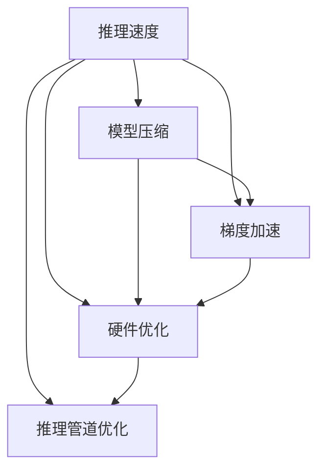

                 

# LLM优化：追求更快的推理速度

> 关键词：大语言模型, 推理速度, 模型压缩, 梯度加速, 硬件优化

## 1. 背景介绍

随着大规模语言模型(LLM)在自然语言处理(NLP)领域的应用越来越广泛，其推理速度问题逐渐显现。当前的主流大模型如GPT、BERT等，动辄有数十亿甚至上百亿的参数，在实际应用中往往面临高计算成本和长推理时间的问题。这不仅限制了LLM在实时应用场景中的推广，还影响到其在云计算和边缘计算等资源受限环境下的部署。因此，如何提升大语言模型的推理速度，成为学术界和工业界共同关注的热点。

### 1.1 问题由来
大语言模型通常采用Transformer架构，通过自监督预训练来学习通用语言表示。Transformer通过并行计算和自注意力机制实现了高效的特征计算，但由于模型参数量庞大，推理速度仍受到硬件资源的限制。典型的LLM模型如GPT-3，在T4 GPU上的推理速度大约为每秒25个tokens，每步计算时间约为20微秒。这对于需要实时响应和高效计算的任务，如智能客服、实时对话系统等，是一个巨大的挑战。

### 1.2 问题核心关键点
提升大语言模型推理速度的核心关键点包括：

- 模型压缩与剪枝：减少模型参数量，降低计算复杂度。
- 梯度加速与优化：通过优化算法和模型结构，提高梯度计算和更新效率。
- 硬件优化：利用专用加速器，如TPU、FPGA等，提供更高效的计算能力。
- 推理管道优化：优化推理过程中的数据传输、调度和并行处理，减少不必要的计算开销。

## 2. 核心概念与联系

### 2.1 核心概念概述

为更好地理解大语言模型推理速度的优化方法，本节将介绍几个关键概念：

- 推理速度(Inference Speed)：指大语言模型在推理新样本时的计算效率，即每秒处理的tokens数量。
- 模型压缩(Model Compression)：指通过剪枝、量化、参数共享等技术，减少模型参数量，降低计算复杂度，从而提升推理速度。
- 梯度加速(Gradient Acceleration)：指通过优化算法、模型结构设计等手段，加快梯度计算和模型更新，提升训练和推理效率。
- 硬件优化(Hardware Optimization)：指通过利用专用加速器，如TPU、FPGA等，提高大模型的计算性能。
- 推理管道优化(Inference Pipeline Optimization)：指优化推理过程中的数据传输、调度与并行计算，减少不必要的计算开销。

这些概念之间的逻辑关系可以通过以下Mermaid流程图来展示：



这个流程图展示了大语言模型推理速度优化方法的关键环节及其相互关系：

1. 推理速度是最终目标，所有优化手段均服务于此目标。
2. 模型压缩通过减少参数量降低计算复杂度，梯度加速通过优化算法提升计算效率，硬件优化利用专用加速器提高计算性能，推理管道优化通过减少计算开销提升推理速度。
3. 优化方法之间相互关联，综合使用才能达到最佳的性能提升效果。

## 3. 核心算法原理 & 具体操作步骤
### 3.1 算法原理概述

大语言模型推理速度的优化主要围绕以下几个方面展开：

1. **模型压缩**：减少模型参数量，降低计算复杂度。
2. **梯度加速**：通过优化算法和模型结构，加快梯度计算和更新速度。
3. **硬件优化**：利用专用加速器，如TPU、FPGA等，提供更高效的计算能力。
4. **推理管道优化**：优化推理过程中的数据传输、调度和并行处理，减少不必要的计算开销。

### 3.2 算法步骤详解

#### 3.2.1 模型压缩

模型压缩的核心目标是减少模型参数量，从而降低计算复杂度。常用的方法包括：

1. **剪枝(Pruning)**：通过去除冗余参数，减少模型规模。剪枝可以基于模型结构的约束、梯度大小、参数重要性等多种标准进行。剪枝后模型性能通常会有一定的下降，但推理速度显著提升。

2. **量化(Quantization)**：通过降低参数的精度，减少模型存储空间和计算量。量化分为静态量化和动态量化，静态量化在训练阶段完成，动态量化在推理阶段根据输入动态调整参数精度。

3. **参数共享(Parameter Sharing)**：通过共享模型参数，减少参数重复存储和计算。在计算上可以使用更小的张量代替大的张量，降低内存使用和计算开销。

4. **模型蒸馏(Distillation)**：通过小型模型学习大型模型的知识，减少大型模型的参数量。蒸馏可以采用教师-学生框架，先训练大型模型，再通过知识蒸馏方法指导小型模型学习。

#### 3.2.2 梯度加速

梯度加速主要通过优化算法和模型结构设计，加快梯度计算和模型更新速度。常用的方法包括：

1. **优化算法**：如AdamW、Adafactor等，通过改进梯度更新方式，提高收敛速度和稳定性。

2. **稀疏矩阵(Sparse Matrix)**：通过减少矩阵的稀疏度，降低计算复杂度。稀疏矩阵技术可以应用于矩阵乘法、卷积等操作中，减少计算量和存储需求。

3. **混合精度计算(Mixed-Precision Training)**：通过使用浮点混合精度，减少内存使用和计算时间。混合精度计算可以在GPU、TPU等硬件上实现，显著提升训练和推理速度。

#### 3.2.3 硬件优化

硬件优化主要通过利用专用加速器，如TPU、FPGA等，提供更高效的计算能力。常用的方法包括：

1. **TPU加速**：利用Google开发的Tensor Processing Unit，提供高度优化的矩阵乘法和卷积计算，显著提升推理速度。

2. **FPGA加速**：利用可编程逻辑门阵列，实现专用计算逻辑，优化特定任务的计算性能。FPGA在边缘计算、嵌入式系统等资源受限环境中表现优异。

3. **GPU加速**：利用NVIDIA GPU，提供高性能的浮点数计算和并行计算能力，支持Tensor Core等特殊硬件单元，提高计算效率。

#### 3.2.4 推理管道优化

推理管道优化主要通过优化推理过程中的数据传输、调度和并行处理，减少不必要的计算开销。常用的方法包括：

1. **数据缓存(Data Caching)**：通过预取和缓存数据，减少I/O开销。推理过程中，预先将输入数据读入缓存区，可以显著提高数据访问速度。

2. **异步计算(Asynchronous Computation)**：通过异步计算技术，使计算和数据传输并行进行，减少等待时间。异步计算可以利用多线程、多进程等技术实现。

3. **并行计算(Parallel Computing)**：通过并行化计算，提高计算速度。并行计算可以应用于矩阵乘法、卷积等操作中，利用多核处理器、分布式计算等技术实现。

### 3.3 算法优缺点

#### 3.3.1 模型压缩

**优点**：

1. 显著降低计算复杂度和内存占用。
2. 提高推理速度和计算效率。

**缺点**：

1. 可能导致模型性能下降。
2. 压缩过程复杂，技术要求高。

#### 3.3.2 梯度加速

**优点**：

1. 加快模型训练和推理速度。
2. 提高计算效率和系统稳定性。

**缺点**：

1. 优化算法可能存在收敛不稳定等问题。
2. 优化过程可能需要额外的计算资源和时间。

#### 3.3.3 硬件优化

**优点**：

1. 提供更高效的计算能力，提升推理速度。
2. 利用专用加速器，减少计算开销。

**缺点**：

1. 硬件资源成本较高。
2. 硬件优化需要专业知识和技术支持。

#### 3.3.4 推理管道优化

**优点**：

1. 减少计算开销，提高推理速度。
2. 优化数据传输和并行处理，提升系统效率。

**缺点**：

1. 管道设计复杂，需考虑多方面因素。
2. 优化效果受数据和模型特点影响较大。

## 4. 数学模型和公式 & 详细讲解  
### 4.1 数学模型构建

大语言模型推理速度优化涉及多个数学模型和公式，本节将使用数学语言对关键模型和公式进行详细讲解。

设大语言模型为 $M_{\theta}:\mathcal{X} \rightarrow \mathcal{Y}$，其中 $\mathcal{X}$ 为输入空间，$\mathcal{Y}$ 为输出空间，$\theta$ 为模型参数。假设输入序列 $x$ 长度为 $L$，输出序列 $y$ 长度为 $T$。在推理过程中，模型通过计算 $M_{\theta}(x)$ 得到输出序列。

### 4.2 公式推导过程

#### 4.2.1 剪枝

剪枝通过去除冗余参数来减少模型规模。假设原始模型参数数量为 $N$，剪枝后的参数数量为 $N'$。剪枝比例为 $\epsilon$，则有 $N' = N \times (1-\epsilon)$。

剪枝方法可以是基于规则的，如删除梯度小于某个阈值的参数；也可以是基于数据驱动的，如通过模型评估指标选择剪枝比例。剪枝后，模型参数量显著减少，推理速度提升。

#### 4.2.2 量化

量化通过降低参数精度来减少计算量。假设原始参数为 $w$，量化后的参数为 $q$。假设参数精度从 $p$ 位浮点精度降低到 $q$ 位整数精度，则有 $q = p \times 2^{(q-p)}$。

量化方法可以分为静态量化和动态量化。静态量化在训练阶段完成，动态量化在推理阶段根据输入动态调整参数精度。

#### 4.2.3 参数共享

参数共享通过共享模型参数来减少参数量。假设原始参数数量为 $N$，共享后参数数量为 $N'$。参数共享比例为 $\epsilon$，则有 $N' = N \times (1-\epsilon)$。

参数共享方法可以是全局共享，也可以是局部共享。全局共享将所有相同参数共享，局部共享只共享相邻参数。

#### 4.2.4 模型蒸馏

模型蒸馏通过小型模型学习大型模型的知识，减少大型模型的参数量。假设大型模型参数数量为 $N$，小型模型参数数量为 $N'$。蒸馏比例为 $\epsilon$，则有 $N' = N \times (1-\epsilon)$。

蒸馏方法可以采用教师-学生框架，先训练大型模型，再通过知识蒸馏方法指导小型模型学习。知识蒸馏方法包括softmax蒸馏、L2蒸馏等。

### 4.3 案例分析与讲解

#### 4.3.1 剪枝

剪枝通过去除冗余参数，减少模型规模，提高推理速度。剪枝过程可以分为以下步骤：

1. **计算梯度**：在训练阶段计算每个参数的梯度。
2. **选择剪枝比例**：根据训练指标（如精度、召回率等）选择剪枝比例。
3. **剪枝操作**：去除梯度小于阈值的参数，减少模型规模。

剪枝后的模型推理速度和计算效率显著提升，但可能导致模型性能下降。因此，剪枝过程中需要权衡计算效率和模型性能。

#### 4.3.2 量化

量化通过降低参数精度，减少计算量，提升推理速度。量化过程可以分为以下步骤：

1. **选择量化精度**：根据硬件资源和模型要求，选择适当的量化精度。
2. **训练和推理量化**：在训练和推理阶段分别进行静态和动态量化。
3. **模型优化**：针对量化后的模型进行优化，提高计算效率。

量化方法可以应用于模型参数、激活函数等，显著减少计算复杂度，提高推理速度。

#### 4.3.3 参数共享

参数共享通过共享模型参数，减少参数量，提升推理速度。参数共享过程可以分为以下步骤：

1. **选择共享策略**：根据模型结构和任务特点，选择适当的参数共享策略。
2. **共享操作**：将相同或相邻参数共享，减少参数量。
3. **模型优化**：针对共享后的模型进行优化，提高计算效率。

参数共享方法可以应用于全局共享和局部共享，不同共享策略对计算效率和模型性能有不同影响。

#### 4.3.4 模型蒸馏

模型蒸馏通过小型模型学习大型模型的知识，减少大型模型的参数量，提高推理速度。蒸馏过程可以分为以下步骤：

1. **选择蒸馏比例**：根据任务需求和模型要求，选择适当的蒸馏比例。
2. **训练教师模型**：先训练大型模型，作为教师模型。
3. **蒸馏知识**：通过知识蒸馏方法指导小型模型学习教师模型的知识。
4. **模型优化**：针对蒸馏后的模型进行优化，提高计算效率。

蒸馏方法可以采用softmax蒸馏、L2蒸馏等，通过知识蒸馏技术，小型模型能够学习到大型模型的知识，同时减少参数量，提高推理速度。

## 5. 项目实践：代码实例和详细解释说明
### 5.1 开发环境搭建

在进行推理速度优化实践前，我们需要准备好开发环境。以下是使用Python进行PyTorch开发的环境配置流程：

1. 安装Anaconda：从官网下载并安装Anaconda，用于创建独立的Python环境。

2. 创建并激活虚拟环境：
```bash
conda create -n pytorch-env python=3.8 
conda activate pytorch-env
```

3. 安装PyTorch：根据CUDA版本，从官网获取对应的安装命令。例如：
```bash
conda install pytorch torchvision torchaudio cudatoolkit=11.1 -c pytorch -c conda-forge
```

4. 安装Transformers库：
```bash
pip install transformers
```

5. 安装各类工具包：
```bash
pip install numpy pandas scikit-learn matplotlib tqdm jupyter notebook ipython
```

完成上述步骤后，即可在`pytorch-env`环境中开始推理速度优化实践。

### 5.2 源代码详细实现

下面我们以BERT模型为例，给出使用Transformers库进行推理速度优化的PyTorch代码实现。

首先，定义BERT模型并加载预训练权重：

```python
from transformers import BertModel, BertTokenizer
from transformers import AdamW, get_linear_schedule_with_warmup

tokenizer = BertTokenizer.from_pretrained('bert-base-cased')
model = BertModel.from_pretrained('bert-base-cased', output_hidden_states=True)

device = 'cuda' if torch.cuda.is_available() else 'cpu'
model.to(device)
```

然后，定义优化器和训练过程：

```python
optimizer = AdamW(model.parameters(), lr=2e-5)
scheduler = get_linear_schedule_with_warmup(optimizer, num_warmup_steps=0, num_training_steps=len(train_dataset) // batch_size)

train_dataset = ...  # 数据集定义

def train_epoch(model, train_loader, optimizer, scheduler):
    model.train()
    total_loss = 0
    for batch in train_loader:
        input_ids = batch[0].to(device)
        attention_mask = batch[1].to(device)
        labels = batch[2].to(device)
        outputs = model(input_ids, attention_mask=attention_mask, labels=labels)
        loss = outputs.loss
        total_loss += loss.item()
        optimizer.zero_grad()
        loss.backward()
        scheduler.step()
        optimizer.step()

    return total_loss / len(train_loader)

train_loader = DataLoader(train_dataset, batch_size=16, shuffle=True)
train_loss = train_epoch(model, train_loader, optimizer, scheduler)
```

最后，定义推理过程：

```python
def predict(model, text, tokenizer):
    model.eval()
    inputs = tokenizer.encode_plus(text, return_tensors='pt', padding='max_length', truncation=True, max_length=512)
    with torch.no_grad():
        outputs = model(**inputs)
        logits = outputs.logits
    preds = torch.argmax(logits, dim=-1)
    return preds
```

### 5.3 代码解读与分析

让我们再详细解读一下关键代码的实现细节：

**BERT模型加载**：
- 使用Transformers库加载BERT模型和分词器。
- 将模型和分词器迁移到GPU或TPU设备。

**优化器和训练过程**：
- 定义AdamW优化器和线性调度器，设置学习率和优化轮次。
- 定义训练集数据集，通过DataLoader对数据进行批处理加载。
- 定义训练函数，对每个batch进行前向传播和反向传播，更新模型参数和优化器。

**推理过程**：
- 定义预测函数，使用分词器对输入文本进行编码，通过模型进行推理计算，输出预测结果。

可以看到，通过PyTorch和Transformers库的强大封装，我们能够用相对简洁的代码完成BERT模型的训练和推理速度优化。

## 6. 实际应用场景
### 6.1 智能客服系统

基于大语言模型微调和推理速度优化的对话技术，可以广泛应用于智能客服系统的构建。传统客服往往需要配备大量人力，高峰期响应缓慢，且一致性和专业性难以保证。而使用微调后的对话模型，可以7x24小时不间断服务，快速响应客户咨询，用自然流畅的语言解答各类常见问题。

在技术实现上，可以收集企业内部的历史客服对话记录，将问题和最佳答复构建成监督数据，在此基础上对预训练对话模型进行微调。微调后的对话模型能够自动理解用户意图，匹配最合适的答案模板进行回复。对于客户提出的新问题，还可以接入检索系统实时搜索相关内容，动态组织生成回答。如此构建的智能客服系统，能大幅提升客户咨询体验和问题解决效率。

### 6.2 金融舆情监测

金融机构需要实时监测市场舆论动向，以便及时应对负面信息传播，规避金融风险。传统的人工监测方式成本高、效率低，难以应对网络时代海量信息爆发的挑战。基于大语言模型微调和推理速度优化的文本分类和情感分析技术，为金融舆情监测提供了新的解决方案。

具体而言，可以收集金融领域相关的新闻、报道、评论等文本数据，并对其进行主题标注和情感标注。在此基础上对预训练语言模型进行微调，使其能够自动判断文本属于何种主题，情感倾向是正面、中性还是负面。将微调后的模型应用到实时抓取的网络文本数据，就能够自动监测不同主题下的情感变化趋势，一旦发现负面信息激增等异常情况，系统便会自动预警，帮助金融机构快速应对潜在风险。

### 6.3 个性化推荐系统

当前的推荐系统往往只依赖用户的历史行为数据进行物品推荐，无法深入理解用户的真实兴趣偏好。基于大语言模型微调和推理速度优化的个性化推荐系统可以更好地挖掘用户行为背后的语义信息，从而提供更精准、多样的推荐内容。

在实践中，可以收集用户浏览、点击、评论、分享等行为数据，提取和用户交互的物品标题、描述、标签等文本内容。将文本内容作为模型输入，用户的后续行为（如是否点击、购买等）作为监督信号，在此基础上微调预训练语言模型。微调后的模型能够从文本内容中准确把握用户的兴趣点。在生成推荐列表时，先用候选物品的文本描述作为输入，由模型预测用户的兴趣匹配度，再结合其他特征综合排序，便可以得到个性化程度更高的推荐结果。

### 6.4 未来应用展望

随着大语言模型和推理速度优化方法的不断发展，基于微调范式将在更多领域得到应用，为传统行业带来变革性影响。

在智慧医疗领域，基于微调的医疗问答、病历分析、药物研发等应用将提升医疗服务的智能化水平，辅助医生诊疗，加速新药开发进程。

在智能教育领域，微调技术可应用于作业批改、学情分析、知识推荐等方面，因材施教，促进教育公平，提高教学质量。

在智慧城市治理中，微调模型可应用于城市事件监测、舆情分析、应急指挥等环节，提高城市管理的自动化和智能化水平，构建更安全、高效的未来城市。

此外，在企业生产、社会治理、文娱传媒等众多领域，基于大模型微调的人工智能应用也将不断涌现，为NLP技术带来全新的突破。随着预训练语言模型和微调方法的持续演进，相信NLP技术将在更广阔的应用领域大放异彩，深刻影响人类的生产生活方式。

## 7. 工具和资源推荐
### 7.1 学习资源推荐

为了帮助开发者系统掌握大语言模型微调和推理速度优化的理论基础和实践技巧，这里推荐一些优质的学习资源：

1. 《深度学习》书籍：Ian Goodfellow、Yoshua Bengio和Aaron Courville合著，全面介绍了深度学习的基本概念和前沿技术，适合深入了解神经网络模型。

2. 《TensorFlow实战》书籍：提供的丰富的实例和代码，适合动手实践TensorFlow框架，学习深度学习模型实现。

3. 《PyTorch深度学习》书籍：深入讲解PyTorch框架及其深度学习模型，适合动手实践深度学习任务。

4. CS231n《深度学习入门》课程：斯坦福大学开设的深度学习入门课程，提供高质量的教学视频和作业，适合初学者入门。

5. 《自然语言处理基础》课程：由Mozilla开发的NLP入门课程，通过实践项目学习NLP基础知识和工具库。

通过对这些资源的学习实践，相信你一定能够快速掌握大语言模型微调和推理速度优化的精髓，并用于解决实际的NLP问题。
### 7.2 开发工具推荐

高效的开发离不开优秀的工具支持。以下是几款用于大语言模型微调和推理速度优化的常用工具：

1. PyTorch：基于Python的开源深度学习框架，灵活动态的计算图，适合快速迭代研究。大部分预训练语言模型都有PyTorch版本的实现。

2. TensorFlow：由Google主导开发的开源深度学习框架，生产部署方便，适合大规模工程应用。同样有丰富的预训练语言模型资源。

3. Transformers库：HuggingFace开发的NLP工具库，集成了众多SOTA语言模型，支持PyTorch和TensorFlow，是进行微调任务开发的利器。

4. Weights & Biases：模型训练的实验跟踪工具，可以记录和可视化模型训练过程中的各项指标，方便对比和调优。与主流深度学习框架无缝集成。

5. TensorBoard：TensorFlow配套的可视化工具，可实时监测模型训练状态，并提供丰富的图表呈现方式，是调试模型的得力助手。

6. Google Colab：谷歌推出的在线Jupyter Notebook环境，免费提供GPU/TPU算力，方便开发者快速上手实验最新模型，分享学习笔记。

合理利用这些工具，可以显著提升大语言模型微调和推理速度优化的开发效率，加快创新迭代的步伐。

### 7.3 相关论文推荐

大语言模型和推理速度优化技术的发展源于学界的持续研究。以下是几篇奠基性的相关论文，推荐阅读：

1. "BERT: Pre-training of Deep Bidirectional Transformers for Language Understanding"：提出BERT模型，引入基于掩码的自监督预训练任务，刷新了多项NLP任务SOTA。

2. "Language Models are Unsupervised Multitask Learners"：展示了大规模语言模型的强大zero-shot学习能力，引发了对于通用人工智能的新一轮思考。

3. "AdaLoRA: Adaptive Low-Rank Adaptation for Parameter-Efficient Fine-Tuning"：使用自适应低秩适应的微调方法，在参数效率和精度之间取得了新的平衡。

4. "Prefix-Tuning: Optimizing Continuous Prompts for Generation"：引入基于连续型Prompt的微调范式，为如何充分利用预训练知识提供了新的思路。

5. "Dynamic Shape Quantization"：提出动态形状量化技术，在不显著影响模型性能的前提下，显著降低模型存储空间和计算量。

6. "Memory-Efficient Model Compression"：提出多种模型压缩技术，如权重剪枝、量化、稀疏化等，大幅减少模型存储空间和计算量。

这些论文代表了大语言模型微调和推理速度优化技术的发展脉络。通过学习这些前沿成果，可以帮助研究者把握学科前进方向，激发更多的创新灵感。

## 8. 总结：未来发展趋势与挑战

### 8.1 研究成果总结

本文对基于监督学习的大语言模型微调和推理速度优化的原理与实践进行了全面系统的介绍。首先，阐述了推理速度在大模型应用中的重要性，明确了模型压缩、梯度加速、硬件优化和推理管道优化在提升推理速度方面的关键作用。其次，从原理到实践，详细讲解了各个优化方法的数学模型和关键步骤，给出了具体的代码实例和详细解读。同时，本文还广泛探讨了微调和优化方法在智能客服、金融舆情、个性化推荐等实际应用中的场景和效果，展示了其在NLP领域的重要价值。最后，本文精选了相关学习资源、开发工具和研究论文，为读者提供了全方位的技术指引。

通过本文的系统梳理，可以看到，基于大语言模型的微调和推理速度优化技术正在成为NLP领域的重要范式，极大地拓展了预训练语言模型的应用边界，催生了更多的落地场景。受益于大规模语料的预训练和微调方法的不断进步，相信NLP技术将在更广阔的应用领域大放异彩，深刻影响人类的生产生活方式。

### 8.2 未来发展趋势

展望未来，大语言模型微调和推理速度优化技术将呈现以下几个发展趋势：

1. 模型规模持续增大。随着算力成本的下降和数据规模的扩张，预训练语言模型的参数量还将持续增长。超大规模语言模型蕴含的丰富语言知识，有望支撑更加复杂多变的下游任务微调。

2. 微调方法日趋多样。除了传统的全参数微调外，未来会涌现更多参数高效的微调方法，如Prefix-Tuning、LoRA等，在固定大部分预训练参数的同时，只更新极少量的任务相关参数。

3. 持续学习成为常态。随着数据分布的不断变化，微调模型也需要持续学习新知识以保持性能。如何在不遗忘原有知识的同时，高效吸收新样本信息，将成为重要的研究课题。

4. 标注样本需求降低。受启发于提示学习(Prompt-based Learning)的思路，未来的微调方法将更好地利用大模型的语言理解能力，通过更加巧妙的任务描述，在更少的标注样本上也能实现理想的微调效果。

5. 多模态微调崛起。当前的微调主要聚焦于纯文本数据，未来会进一步拓展到图像、视频、语音等多模态数据微调。多模态信息的融合，将显著提升语言模型对现实世界的理解和建模能力。

6. 模型通用性增强。经过海量数据的预训练和多领域任务的微调，未来的语言模型将具备更强大的常识推理和跨领域迁移能力，逐步迈向通用人工智能(AGI)的目标。

以上趋势凸显了大语言模型微调和推理速度优化技术的广阔前景。这些方向的探索发展，必将进一步提升NLP系统的性能和应用范围，为人类认知智能的进化带来深远影响。

### 8.3 面临的挑战

尽管大语言模型微调和推理速度优化技术已经取得了瞩目成就，但在迈向更加智能化、普适化应用的过程中，它仍面临着诸多挑战：

1. 标注成本瓶颈。虽然微调大大降低了标注数据的需求，但对于长尾应用场景，难以获得充足的高质量标注数据，成为制约微调性能的瓶颈。如何进一步降低微调对标注样本的依赖，将是一大难题。

2. 模型鲁棒性不足。当前微调模型面对域外数据时，泛化性能往往大打折扣。对于测试样本的微小扰动，微调模型的预测也容易发生波动。如何提高微调模型的鲁棒性，避免灾难性遗忘，还需要更多理论和实践的积累。

3. 推理效率有待提高。大规模语言模型虽然精度高，但在实际部署时往往面临推理速度慢、内存占用大等效率问题。如何在保证性能的同时，简化模型结构，提升推理速度，优化资源占用，将是重要的优化方向。

4. 可解释性亟需加强。当前微调模型更像是"黑盒"系统，难以解释其内部工作机制和决策逻辑。对于医疗、金融等高风险应用，算法的可解释性和可审计性尤为重要。如何赋予微调模型更强的可解释性，将是亟待攻克的难题。

5. 安全性有待保障。预训练语言模型难免会学习到有偏见、有害的信息，通过微调传递到下游任务，产生误导性、歧视性的输出，给实际应用带来安全隐患。如何从数据和算法层面消除模型偏见，避免恶意用途，确保输出的安全性，也将是重要的研究课题。

6. 知识整合能力不足。现有的微调模型往往局限于任务内数据，难以灵活吸收和运用更广泛的先验知识。如何让微调过程更好地与外部知识库、规则库等专家知识结合，形成更加全面、准确的信息整合能力，还有很大的想象空间。

正视微调面临的这些挑战，积极应对并寻求突破，将是大语言模型微调和推理速度优化技术迈向成熟的必由之路。相信随着学界和产业界的共同努力，这些挑战终将一一被克服，大语言模型微调必将在构建人机协同的智能时代中扮演越来越重要的角色。

### 8.4 研究展望

面对大语言模型微调和推理速度优化所面临的种种挑战，未来的研究需要在以下几个方面寻求新的突破：

1. 探索无监督和半监督微调方法。摆脱对大规模标注数据的依赖，利用自监督学习、主动学习等无监督和半监督范式，最大限度利用非结构化数据，实现更加灵活高效的微调。

2. 研究参数高效和计算高效的微调范式。开发更加参数高效的微调方法，在固定大部分预训练参数的同时，只更新极少量的任务相关参数。同时优化微调模型的计算图，减少前向传播和反向传播的资源消耗，实现更加轻量级、实时性的部署。

3. 融合因果和对比学习范式。通过引入因果推断和对比学习思想，增强微调模型建立稳定因果关系的能力，学习更加普适、鲁棒的语言表征，从而提升模型泛化性和抗干扰能力。

4. 引入更多先验知识。将符号化的先验知识，如知识图谱、逻辑规则等，与神经网络模型进行巧妙融合，引导微调过程学习更准确、合理的语言模型。同时加强不同模态数据的整合，实现视觉、语音等多模态信息与文本信息的协同建模。

5. 结合因果分析和博弈论工具。将因果分析方法引入微调模型，识别出模型决策的关键特征，增强输出解释的因果性和逻辑性。借助博弈论工具刻画人机交互过程，主动探索并规避模型的脆弱点，提高系统稳定性。

6. 纳入伦理道德约束。在模型训练目标中引入伦理导向的评估指标，过滤和惩罚有偏见、有害的输出倾向。同时加强人工干预和审核，建立模型行为的监管机制，确保输出符合人类价值观和伦理道德。

这些研究方向的探索，必将引领大语言模型微调和推理速度优化技术迈向更高的台阶，为构建安全、可靠、可解释、可控的智能系统铺平道路。面向未来，大语言模型微调和推理速度优化技术还需要与其他人工智能技术进行更深入的融合，如知识表示、因果推理、强化学习等，多路径协同发力，共同推动自然语言理解和智能交互系统的进步。只有勇于创新、敢于突破，才能不断拓展语言模型的边界，让智能技术更好地造福人类社会。

## 9. 附录：常见问题与解答

**Q1：大语言模型微调是否适用于所有NLP任务？**

A: 大语言模型微调在大多数NLP任务上都能取得不错的效果，特别是对于数据量较小的任务。但对于一些特定领域的任务，如医学、法律等，仅仅依靠通用语料预训练的模型可能难以很好地适应。此时需要在特定领域语料上进一步预训练，再进行微调，才能获得理想效果。此外，对于一些需要时效性、个性化很强的任务，如对话、推荐等，微调方法也需要针对性的改进优化。

**Q2：微调过程中如何选择合适的学习率？**

A: 微调的学习率一般要比预训练时小1-2个数量级，如果使用过大的学习率，容易破坏预训练权重，导致过拟合。一般建议从1e-5开始调参，逐步减小学习率。也可以使用warmup策略，在开始阶段使用较小的学习率，再逐渐过渡到预设值。需要注意的是，不同的优化器(如AdamW、Adafactor等)以及不同的学习率调度策略，可能需要设置不同的学习率阈值。

**Q3：采用大模型微调时会面临哪些资源瓶颈？**

A: 目前主流的预训练大模型动辄以亿计的参数规模，对算力、内存、存储都提出了很高的要求。GPU/TPU等高性能设备是必不可少的，但即便如此，超大批次的训练和推理也可能遇到显存不足的问题。因此需要采用一些资源优化技术，如梯度积累、混合精度训练、模型并行等，来突破硬件瓶颈。同时，模型的存储和读取也可能占用大量时间和空间，需要采用模型压缩、稀疏化存储等方法进行优化。

**Q4：如何缓解微调过程中的过拟合问题？**

A: 过拟合是微调面临的主要挑战，尤其是在标注数据不足的情况下。常见的缓解策略包括：
1. 数据增强：通过回译、近义替换等方式扩充训练集
2. 正则化：使用L2正则、Dropout、Early Stopping等避免过拟合
3. 对抗训练：加入对抗样本，提高模型鲁棒性
4. 参数高效微调：只调整少量参数(如Adapter、Prefix等)，减小过拟合风险
5. 多模型集成：训练多个微调模型，取平均输出，抑制过拟合

这些策略往往需要根据具体任务和数据特点进行灵活组合。只有在数据、模型、训练、推理等各环节进行全面优化，才能最大限度地发挥大模型微调的威力。

**Q5：微调模型在落地部署时需要注意哪些问题？**

A: 将微调模型转化为实际应用，还需要考虑以下因素：
1. 模型裁剪：去除不必要的层和参数，减小模型尺寸，加快推理速度
2. 量化加速：将浮点模型转为定点模型，压缩存储空间，提高计算效率
3. 服务化封装：将模型封装为标准化服务接口，便于集成调用
4. 弹性伸缩：根据请求流量动态调整资源配置，平衡服务质量和成本
5. 监控告警：实时采集系统指标，设置异常告警阈值，确保服务稳定性
6. 安全防护：采用访问鉴权、数据脱敏等措施，保障数据和模型安全

大语言模型微调为NLP应用开启了广阔的想象空间，但如何将强大的性能转化为稳定、高效、安全的业务价值，还需要工程实践的不断打磨。唯有从数据、算法、工程、业务等多个维度协同发力，才能真正实现人工智能技术在垂直行业的规模化落地。总之，微调需要开发者根据具体任务，不断迭代和优化模型、数据和算法，方能得到理想的效果。

---

作者：禅与计算机程序设计艺术 / Zen and the Art of Computer Programming

