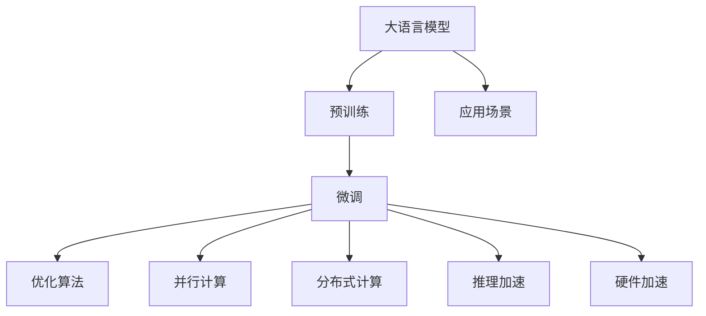

                 

# LLM作为新型计算机架构的探讨

## 1. 背景介绍

### 1.1 问题由来
在计算机科学的百年发展历程中，人们一直在探索如何构建高效、灵活、可扩展的计算机架构。从早期的串行计算到多核CPU，再到分布式计算、GPU计算等，计算机硬件和软件都在不断发展，以满足日益增长的计算需求。然而，随着计算复杂度的不断提升，传统的计算架构逐渐显现出其局限性，无法满足一些复杂计算的需求。

近年来，语言模型的研究取得了显著进展，尤其是大规模语言模型（Large Language Model, LLM）的出现，使得其在自然语言处理（NLP）领域的表现远远超越了以往的模型。大语言模型不仅能够处理自然语言文本，还能够生成自然语言文本，甚至在一些情况下，大语言模型能够理解复杂的语义和逻辑关系。这些能力使得大语言模型在实际应用中具有巨大的潜力。

### 1.2 问题核心关键点
大语言模型与传统计算机架构的结合，是一个值得深入探讨的新方向。本文将探讨大语言模型作为新型计算机架构的可能性，分析其原理、步骤、优缺点及其应用领域，并尝试在数学模型、项目实践等方面提供支持。

## 2. 核心概念与联系

### 2.1 核心概念概述

大语言模型作为新型计算机架构的核心概念主要包括以下几个方面：

- 大语言模型（Large Language Model, LLM）：通过自回归或自编码模型进行预训练的语言模型，具备强大的语言理解和生成能力，通常包含亿级别参数。
- 计算机架构（Computer Architecture）：计算机系统硬件和软件的结构及其工作方式，包括处理器、存储器、输入输出设备等。
- 计算能力（Computing Capability）：计算机完成特定任务所需的时间或资源。
- 并行计算（Parallel Computing）：同时执行多个计算任务，以提高计算效率。
- 分布式计算（Distributed Computing）：将计算任务分配到多个计算机节点上执行，以提高计算效率和扩展性。
- 人工智能（Artificial Intelligence, AI）：使计算机系统具备人类智能特征的技术。

这些概念之间存在紧密的联系：大语言模型作为一种强大的AI技术，在新的计算机架构中扮演重要角色，可以提升计算能力，推动并行计算和分布式计算的发展。

### 2.2 核心概念原理和架构的 Mermaid 流程图



这个流程图展示了大语言模型在预训练、微调、优化、并行、分布式、推理和硬件加速等环节中的作用，以及其在各种应用场景中的潜力。

## 3. 核心算法原理 & 具体操作步骤

### 3.1 算法原理概述

大语言模型作为新型计算机架构的核心算法，主要基于以下原理：

1. **自监督预训练**：在大量无标签文本数据上对模型进行预训练，学习通用的语言表示。
2. **微调**：在特定任务的数据集上进行微调，使模型具备解决该任务的能力。
3. **并行计算**：将模型计算任务分配到多个计算单元（如CPU、GPU等）并行执行，提升计算效率。
4. **分布式计算**：将计算任务分配到多个计算机节点上执行，以实现更大规模的计算和数据处理。
5. **推理加速**：利用硬件加速技术，如Tensor Core、CUDA、FPGA等，加速模型的推理过程。
6. **硬件加速**：在ASIC、FPGA等专用硬件上运行模型，以实现更高的计算效率。

### 3.2 算法步骤详解

1. **数据预处理**：收集和清洗数据集，将其划分为训练集、验证集和测试集。
2. **模型选择和初始化**：选择合适的大语言模型，并进行参数初始化。
3. **自监督预训练**：在无标签数据上对模型进行预训练，学习通用的语言表示。
4. **微调**：在特定任务的数据集上进行微调，调整模型参数以适应该任务。
5. **并行计算**：使用并行计算框架，如PyTorch、TensorFlow等，在多个计算单元上执行模型计算任务。
6. **分布式计算**：使用分布式计算框架，如Dask、Ray等，将计算任务分配到多个计算机节点上执行。
7. **推理加速**：使用硬件加速技术，如NVIDIA GPU、TPU等，加速模型的推理过程。
8. **硬件加速**：在专用硬件上运行模型，如FPGA、ASIC等，以实现更高的计算效率。
9. **性能评估**：在测试集上评估模型性能，并进行优化。

### 3.3 算法优缺点

#### 优点：

1. **高效计算能力**：大语言模型具有强大的计算能力，能够在短时间内处理大量数据。
2. **广泛应用**：大语言模型可以应用于各种领域，如自然语言处理、图像处理、语音识别等。
3. **灵活可扩展**：大语言模型可以通过并行计算和分布式计算，实现灵活的可扩展性。
4. **硬件加速**：利用硬件加速技术，可以在短时间内处理大规模计算任务。

#### 缺点：

1. **资源需求高**：大语言模型需要大量的计算资源和存储空间，包括高性能的GPU、TPU等。
2. **训练时间长**：大语言模型的训练需要大量时间和计算资源，训练时间长。
3. **模型复杂**：大语言模型的结构复杂，需要深入理解和维护。
4. **模型鲁棒性**：大语言模型对输入数据的分布和噪声敏感，需要采取鲁棒性措施。

### 3.4 算法应用领域

大语言模型作为新型计算机架构的核心算法，可以应用于以下领域：

1. **自然语言处理**：文本分类、情感分析、机器翻译、问答系统等。
2. **图像处理**：图像识别、图像生成、图像描述等。
3. **语音识别**：语音识别、语音合成等。
4. **推荐系统**：商品推荐、内容推荐等。
5. **金融分析**：股票分析、风险评估等。
6. **医疗诊断**：医学影像分析、疾病诊断等。
7. **智能客服**：智能问答、客户对话等。

## 4. 数学模型和公式 & 详细讲解 & 举例说明

### 4.1 数学模型构建

大语言模型作为新型计算机架构的数学模型主要基于以下步骤：

1. **自监督预训练**：使用自监督学习任务（如语言建模、掩码语言建模等）训练模型，学习通用的语言表示。
2. **微调**：在特定任务的数据集上进行微调，调整模型参数以适应该任务。
3. **并行计算**：使用并行计算框架，如PyTorch、TensorFlow等，在多个计算单元上执行模型计算任务。
4. **分布式计算**：使用分布式计算框架，如Dask、Ray等，将计算任务分配到多个计算机节点上执行。
5. **推理加速**：使用硬件加速技术，如NVIDIA GPU、TPU等，加速模型的推理过程。
6. **硬件加速**：在专用硬件上运行模型，如FPGA、ASIC等，以实现更高的计算效率。

### 4.2 公式推导过程

以自监督预训练为例，假设模型为$M_{\theta}$，在文本序列$X$上进行预训练，则自监督预训练的损失函数为：

$$
L_{\text{self}} = -\frac{1}{N}\sum_{i=1}^N \sum_{t=1}^{T} \log p(x_t|x_{<t})
$$

其中，$N$为序列长度，$T$为序列长度，$p(x_t|x_{<t})$为模型在$x_{<t}$上的条件概率分布。

### 4.3 案例分析与讲解

假设在大规模无标签文本数据上对模型进行自监督预训练，然后对特定任务（如文本分类）的数据集进行微调。微调后的模型$M_{\theta^*}$在任务上的性能由以下公式表示：

$$
L_{\text{task}} = \frac{1}{N}\sum_{i=1}^N \log p(y_i|x_i)
$$

其中，$y_i$为任务标签，$p(y_i|x_i)$为模型在$x_i$上的预测概率分布。

## 5. 项目实践：代码实例和详细解释说明

### 5.1 开发环境搭建

1. **安装PyTorch**：
   ```bash
   pip install torch torchvision torchaudio
   ```

2. **安装TensorFlow**：
   ```bash
   pip install tensorflow
   ```

3. **安装Transformer库**：
   ```bash
   pip install transformers
   ```

4. **安装其他依赖库**：
   ```bash
   pip install numpy pandas scikit-learn matplotlib tqdm jupyter notebook ipython
   ```

### 5.2 源代码详细实现

以BERT模型为例，使用PyTorch进行微调。

```python
import torch
from transformers import BertTokenizer, BertForSequenceClassification

# 初始化BERT模型和分词器
model = BertForSequenceClassification.from_pretrained('bert-base-cased', num_labels=2)
tokenizer = BertTokenizer.from_pretrained('bert-base-cased')

# 定义训练函数
def train_epoch(model, data_loader, optimizer):
    model.train()
    epoch_loss = 0
    for batch in data_loader:
        input_ids = batch['input_ids'].to(device)
        attention_mask = batch['attention_mask'].to(device)
        labels = batch['labels'].to(device)
        model.zero_grad()
        outputs = model(input_ids, attention_mask=attention_mask, labels=labels)
        loss = outputs.loss
        epoch_loss += loss.item()
        loss.backward()
        optimizer.step()
    return epoch_loss / len(data_loader)

# 训练函数
train_loader = DataLoader(train_dataset, batch_size=16)
optimizer = AdamW(model.parameters(), lr=2e-5)

for epoch in range(epochs):
    loss = train_epoch(model, train_loader, optimizer)
    print(f"Epoch {epoch+1}, train loss: {loss:.3f}")
    
# 评估函数
def evaluate(model, data_loader):
    model.eval()
    preds, labels = [], []
    with torch.no_grad():
        for batch in data_loader:
            input_ids = batch['input_ids'].to(device)
            attention_mask = batch['attention_mask'].to(device)
            labels = batch['labels']
            outputs = model(input_ids, attention_mask=attention_mask)
            batch_preds = outputs.logits.argmax(dim=2).to('cpu').tolist()
            batch_labels = labels.to('cpu').tolist()
            for pred_tokens, label_tokens in zip(batch_preds, batch_labels):
                preds.append(pred_tokens[:len(label_tokens)])
                labels.append(label_tokens)
    print(classification_report(labels, preds))
```

### 5.3 代码解读与分析

在上述代码中，首先初始化BERT模型和分词器。然后定义了训练函数`train_epoch`，用于在数据集上进行微调。训练函数中，将输入数据输入模型，计算损失并更新模型参数。最后定义了评估函数`evaluate`，用于在验证集上评估模型性能。

## 6. 实际应用场景

### 6.1 智能客服系统

基于大语言模型的智能客服系统可以在7x24小时不间断服务，快速响应客户咨询，用自然流畅的语言解答各类常见问题。收集企业内部的历史客服对话记录，将问题和最佳答复构建成监督数据，在此基础上对预训练对话模型进行微调。微调后的对话模型能够自动理解用户意图，匹配最合适的答案模板进行回复。对于客户提出的新问题，还可以接入检索系统实时搜索相关内容，动态组织生成回答。

### 6.2 金融舆情监测

金融机构需要实时监测市场舆论动向，以便及时应对负面信息传播，规避金融风险。基于大语言模型微调的文本分类和情感分析技术，为金融舆情监测提供了新的解决方案。收集金融领域相关的新闻、报道、评论等文本数据，并对其进行主题标注和情感标注。在此基础上对预训练语言模型进行微调，使其能够自动判断文本属于何种主题，情感倾向是正面、中性还是负面。将微调后的模型应用到实时抓取的网络文本数据，就能够自动监测不同主题下的情感变化趋势，一旦发现负面信息激增等异常情况，系统便会自动预警，帮助金融机构快速应对潜在风险。

### 6.3 个性化推荐系统

当前的推荐系统往往只依赖用户的历史行为数据进行物品推荐，无法深入理解用户的真实兴趣偏好。基于大语言模型微调技术，个性化推荐系统可以更好地挖掘用户行为背后的语义信息，从而提供更精准、多样的推荐内容。收集用户浏览、点击、评论、分享等行为数据，提取和用户交互的物品标题、描述、标签等文本内容。将文本内容作为模型输入，用户的后续行为（如是否点击、购买等）作为监督信号，在此基础上微调预训练语言模型。微调后的模型能够从文本内容中准确把握用户的兴趣点。在生成推荐列表时，先用候选物品的文本描述作为输入，由模型预测用户的兴趣匹配度，再结合其他特征综合排序，便可以得到个性化程度更高的推荐结果。

## 7. 工具和资源推荐

### 7.1 学习资源推荐

为了帮助开发者系统掌握大语言模型微调的理论基础和实践技巧，这里推荐一些优质的学习资源：

1. **《Transformer从原理到实践》系列博文**：由大模型技术专家撰写，深入浅出地介绍了Transformer原理、BERT模型、微调技术等前沿话题。
2. **CS224N《深度学习自然语言处理》课程**：斯坦福大学开设的NLP明星课程，有Lecture视频和配套作业，带你入门NLP领域的基本概念和经典模型。
3. **《Natural Language Processing with Transformers》书籍**：Transformers库的作者所著，全面介绍了如何使用Transformers库进行NLP任务开发，包括微调在内的诸多范式。
4. **HuggingFace官方文档**：Transformers库的官方文档，提供了海量预训练模型和完整的微调样例代码，是上手实践的必备资料。
5. **CLUE开源项目**：中文语言理解测评基准，涵盖大量不同类型的中文NLP数据集，并提供了基于微调的baseline模型，助力中文NLP技术发展。

### 7.2 开发工具推荐

高效的开发离不开优秀的工具支持。以下是几款用于大语言模型微调开发的常用工具：

1. **PyTorch**：基于Python的开源深度学习框架，灵活动态的计算图，适合快速迭代研究。大部分预训练语言模型都有PyTorch版本的实现。
2. **TensorFlow**：由Google主导开发的开源深度学习框架，生产部署方便，适合大规模工程应用。同样有丰富的预训练语言模型资源。
3. **Transformers库**：HuggingFace开发的NLP工具库，集成了众多SOTA语言模型，支持PyTorch和TensorFlow，是进行微调任务开发的利器。
4. **Weights & Biases**：模型训练的实验跟踪工具，可以记录和可视化模型训练过程中的各项指标，方便对比和调优。与主流深度学习框架无缝集成。
5. **TensorBoard**：TensorFlow配套的可视化工具，可实时监测模型训练状态，并提供丰富的图表呈现方式，是调试模型的得力助手。
6. **Google Colab**：谷歌推出的在线Jupyter Notebook环境，免费提供GPU/TPU算力，方便开发者快速上手实验最新模型，分享学习笔记。

### 7.3 相关论文推荐

大语言模型和微调技术的发展源于学界的持续研究。以下是几篇奠基性的相关论文，推荐阅读：

1. **Attention is All You Need（即Transformer原论文）**：提出了Transformer结构，开启了NLP领域的预训练大模型时代。
2. **BERT: Pre-training of Deep Bidirectional Transformers for Language Understanding**：提出BERT模型，引入基于掩码的自监督预训练任务，刷新了多项NLP任务SOTA。
3. **Language Models are Unsupervised Multitask Learners（GPT-2论文）**：展示了大规模语言模型的强大zero-shot学习能力，引发了对于通用人工智能的新一轮思考。
4. **Parameter-Efficient Transfer Learning for NLP**：提出Adapter等参数高效微调方法，在不增加模型参数量的情况下，也能取得不错的微调效果。
5. **Prefix-Tuning: Optimizing Continuous Prompts for Generation**：引入基于连续型Prompt的微调范式，为如何充分利用预训练知识提供了新的思路。
6. **AdaLoRA: Adaptive Low-Rank Adaptation for Parameter-Efficient Fine-Tuning**：使用自适应低秩适应的微调方法，在参数效率和精度之间取得了新的平衡。

这些论文代表了大语言模型微调技术的发展脉络。通过学习这些前沿成果，可以帮助研究者把握学科前进方向，激发更多的创新灵感。

## 8. 总结：未来发展趋势与挑战

### 8.1 总结

本文对大语言模型作为新型计算机架构的可能性进行了全面系统的介绍。首先阐述了大语言模型和微调技术的研究背景和意义，明确了微调在拓展预训练模型应用、提升下游任务性能方面的独特价值。其次，从原理到实践，详细讲解了监督微调的数学原理和关键步骤，给出了微调任务开发的完整代码实例。同时，本文还广泛探讨了微调方法在智能客服、金融舆情、个性化推荐等多个行业领域的应用前景，展示了微调范式的巨大潜力。此外，本文精选了微调技术的各类学习资源，力求为读者提供全方位的技术指引。

通过本文的系统梳理，可以看到，大语言模型作为新型计算机架构的核心算法，在提升计算能力、推动并行计算和分布式计算的发展、硬件加速等方面具有重要意义。大语言模型结合并行计算和分布式计算，可以处理大规模的计算任务，加速模型推理过程，提高计算效率。未来，伴随预训练语言模型和微调方法的持续演进，相信大语言模型作为新型计算机架构的应用将会更加广泛，为人工智能技术落地应用提供新的方向。

### 8.2 未来发展趋势

展望未来，大语言模型作为新型计算机架构的趋势将呈现以下几个方面：

1. **模型规模持续增大**：随着算力成本的下降和数据规模的扩张，预训练语言模型的参数量还将持续增长。超大规模语言模型蕴含的丰富语言知识，有望支撑更加复杂多变的下游任务微调。
2. **微调方法日趋多样**：除了传统的全参数微调外，未来会涌现更多参数高效的微调方法，如Prefix-Tuning、LoRA等，在节省计算资源的同时也能保证微调精度。
3. **持续学习成为常态**：随着数据分布的不断变化，微调模型也需要持续学习新知识以保持性能。如何在不遗忘原有知识的同时，高效吸收新样本信息，将成为重要的研究课题。
4. **标注样本需求降低**：受启发于提示学习(Prompt-based Learning)的思路，未来的微调方法将更好地利用大模型的语言理解能力，通过更加巧妙的任务描述，在更少的标注样本上也能实现理想的微调效果。
5. **多模态微调崛起**：当前的微调主要聚焦于纯文本数据，未来会进一步拓展到图像、视频、语音等多模态数据微调。多模态信息的融合，将显著提升语言模型对现实世界的理解和建模能力。
6. **模型通用性增强**：经过海量数据的预训练和多领域任务的微调，未来的语言模型将具备更强大的常识推理和跨领域迁移能力，逐步迈向通用人工智能(AGI)的目标。

以上趋势凸显了大语言模型作为新型计算机架构的广阔前景。这些方向的探索发展，必将进一步提升大语言模型作为计算机架构的性能和应用范围，为构建人机协同的智能时代中扮演重要角色。

### 8.3 面临的挑战

尽管大语言模型作为新型计算机架构的应用前景广阔，但在迈向更加智能化、普适化应用的过程中，它仍面临着诸多挑战：

1. **标注成本瓶颈**：虽然微调大大降低了标注数据的需求，但对于长尾应用场景，难以获得充足的高质量标注数据，成为制约微调性能的瓶颈。如何进一步降低微调对标注样本的依赖，将是一大难题。
2. **模型鲁棒性不足**：当前微调模型面对域外数据时，泛化性能往往大打折扣。对于测试样本的微小扰动，微调模型的预测也容易发生波动。如何提高微调模型的鲁棒性，避免灾难性遗忘，还需要更多理论和实践的积累。
3. **推理效率有待提高**：大规模语言模型虽然精度高，但在实际部署时往往面临推理速度慢、内存占用大等效率问题。如何在保证性能的同时，简化模型结构，提升推理速度，优化资源占用，将是重要的优化方向。
4. **可解释性亟需加强**：当前微调模型更像是"黑盒"系统，难以解释其内部工作机制和决策逻辑。对于医疗、金融等高风险应用，算法的可解释性和可审计性尤为重要。如何赋予微调模型更强的可解释性，将是亟待攻克的难题。
5. **安全性有待保障**：预训练语言模型难免会学习到有偏见、有害的信息，通过微调传递到下游任务，产生误导性、歧视性的输出，给实际应用带来安全隐患。如何从数据和算法层面消除模型偏见，避免恶意用途，确保输出的安全性，也将是重要的研究课题。
6. **知识整合能力不足**：现有的微调模型往往局限于任务内数据，难以灵活吸收和运用更广泛的先验知识。如何让微调过程更好地与外部知识库、规则库等专家知识结合，形成更加全面、准确的信息整合能力，还有很大的想象空间。

正视微调面临的这些挑战，积极应对并寻求突破，将是大语言模型作为新型计算机架构走向成熟的必由之路。相信随着学界和产业界的共同努力，这些挑战终将一一被克服，大语言模型作为新型计算机架构必将在构建安全、可靠、可解释、可控的智能系统铺平道路。

### 8.4 研究展望

面对大语言模型作为新型计算机架构所面临的种种挑战，未来的研究需要在以下几个方面寻求新的突破：

1. **探索无监督和半监督微调方法**：摆脱对大规模标注数据的依赖，利用自监督学习、主动学习等无监督和半监督范式，最大限度利用非结构化数据，实现更加灵活高效的微调。
2. **研究参数高效和计算高效的微调范式**：开发更加参数高效的微调方法，在固定大部分预训练参数的同时，只更新极少量的任务相关参数。同时优化微调模型的计算图，减少前向传播和反向传播的资源消耗，实现更加轻量级、实时性的部署。
3. **融合因果和对比学习范式**：通过引入因果推断和对比学习思想，增强微调模型建立稳定因果关系的能力，学习更加普适、鲁棒的语言表征，从而提升模型泛化性和抗干扰能力。
4. **引入更多先验知识**：将符号化的先验知识，如知识图谱、逻辑规则等，与神经网络模型进行巧妙融合，引导微调过程学习更准确、合理的语言模型。同时加强不同模态数据的整合，实现视觉、语音等多模态信息与文本信息的协同建模。
5. **结合因果分析和博弈论工具**：将因果分析方法引入微调模型，识别出模型决策的关键特征，增强输出解释的因果性和逻辑性。借助博弈论工具刻画人机交互过程，主动探索并规避模型的脆弱点，提高系统稳定性。
6. **纳入伦理道德约束**：在模型训练目标中引入伦理导向的评估指标，过滤和惩罚有偏见、有害的输出倾向。同时加强人工干预和审核，建立模型行为的监管机制，确保输出符合人类价值观和伦理道德。

这些研究方向的探索，必将引领大语言模型作为新型计算机架构的进一步发展，推动大语言模型微调技术迈向更高的台阶，为构建安全、可靠、可解释、可控的智能系统铺平道路。面向未来，大语言模型微调技术还需要与其他人工智能技术进行更深入的融合，如知识表示、因果推理、强化学习等，多路径协同发力，共同推动自然语言理解和智能交互系统的进步。只有勇于创新、敢于突破，才能不断拓展语言模型的边界，让智能技术更好地造福人类社会。

## 9. 附录：常见问题与解答

**Q1：大语言模型作为新型计算机架构是否可行？**

A: 大语言模型作为新型计算机架构具有可行性和潜力。大语言模型在大规模文本数据上的预训练，使其具备了强大的语言理解和生成能力，能够在各种NLP任务中取得优异表现。通过微调，大语言模型可以适应特定任务，提升其在特定领域的应用效果。同时，大语言模型结合并行计算和分布式计算，可以处理大规模的计算任务，加速模型推理过程，提高计算效率。因此，大语言模型作为新型计算机架构具有可行性。

**Q2：大语言模型作为新型计算机架构有哪些优点？**

A: 大语言模型作为新型计算机架构的优点主要包括：

1. **高效计算能力**：大语言模型具有强大的计算能力，能够在短时间内处理大量数据。
2. **广泛应用**：大语言模型可以应用于各种领域，如自然语言处理、图像处理、语音识别等。
3. **灵活可扩展**：大语言模型可以通过并行计算和分布式计算，实现灵活的可扩展性。
4. **硬件加速**：利用硬件加速技术，如NVIDIA GPU、TPU等，加速模型的推理过程。

**Q3：大语言模型作为新型计算机架构有哪些缺点？**

A: 大语言模型作为新型计算机架构的缺点主要包括：

1. **资源需求高**：大语言模型需要大量的计算资源和存储空间，包括高性能的GPU、TPU等。
2. **训练时间长**：大语言模型的训练需要大量时间和计算资源，训练时间长。
3. **模型复杂**：大语言模型的结构复杂，需要深入理解和维护。
4. **模型鲁棒性不足**：大语言模型对输入数据的分布和噪声敏感，需要采取鲁棒性措施。

**Q4：大语言模型作为新型计算机架构的应用场景有哪些？**

A: 大语言模型作为新型计算机架构的应用场景主要包括：

1. **智能客服系统**：基于大语言模型的智能客服系统可以在7x24小时不间断服务，快速响应客户咨询，用自然流畅的语言解答各类常见问题。
2. **金融舆情监测**：基于大语言模型微调的文本分类和情感分析技术，为金融舆情监测提供了新的解决方案。
3. **个性化推荐系统**：基于大语言模型微调技术，个性化推荐系统可以更好地挖掘用户行为背后的语义信息，从而提供更精准、多样的推荐内容。

**Q5：大语言模型作为新型计算机架构的挑战有哪些？**

A: 大语言模型作为新型计算机架构的挑战主要包括：

1. **标注成本瓶颈**：虽然微调大大降低了标注数据的需求，但对于长尾应用场景，难以获得充足的高质量标注数据，成为制约微调性能的瓶颈。
2. **模型鲁棒性不足**：当前微调模型面对域外数据时，泛化性能往往大打折扣。
3. **推理效率有待提高**：大规模语言模型虽然精度高，但在实际部署时往往面临推理速度慢、内存占用大等效率问题。
4. **可解释性亟需加强**：当前微调模型更像是"黑盒"系统，难以解释其内部工作机制和决策逻辑。
5. **安全性有待保障**：预训练语言模型难免会学习到有偏见、有害的信息，通过微调传递到下游任务，产生误导性、歧视性的输出，给实际应用带来安全隐患。
6. **知识整合能力不足**：现有的微调模型往往局限于任务内数据，难以灵活吸收和运用更广泛的先验知识。

---

作者：禅与计算机程序设计艺术 / Zen and the Art of Computer Programming

