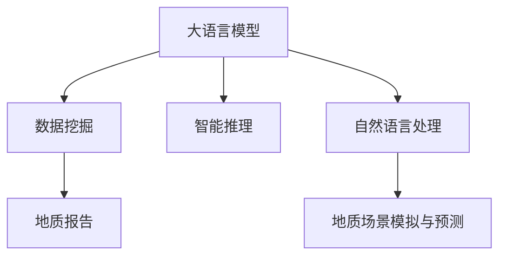

                 

# 大语言模型在地质勘探中的应用：AI地质学家

> 关键词：大语言模型,地质勘探,地质数据,数据挖掘,智能推理,自然语言处理,地质报告,AI地质学家

## 1. 背景介绍

### 1.1 问题由来

地质勘探是寻找和评估矿产资源、地下水资源、油气资源等的重要手段。传统地质勘探主要依赖人工分析历史数据和现场实地考察，耗时长、成本高，且容易受到主观因素的影响。近年来，人工智能（AI）和大数据技术的发展，为地质勘探提供了新的方法和视角。大语言模型（LLM）作为AI领域的突破性进展，通过文本处理和自然语言推理能力，在地质勘探中展现出巨大的潜力。

### 1.2 问题核心关键点

大语言模型在地质勘探中的应用，核心在于利用其强大的文本处理和自然语言推理能力，结合地质数据进行数据挖掘和智能推理。具体而言，LLM能够在处理地质报告、文献、报告、期刊等大量文本数据时，提取有价值的信息，并结合地质数据进行综合分析，辅助地质学家进行决策。

LLM在地质勘探中的应用场景包括但不限于：
- 地质报告生成和自动标注
- 地质数据挖掘与智能推理
- 地质报告质量检测
- 地质场景模拟与预测
- 地质问题诊断与建议

这些应用不仅能够大幅提高地质勘探的效率，还能降低人工成本和误差，提高决策的科学性和可靠性。

### 1.3 问题研究意义

大语言模型在地质勘探中的应用，具有以下几个方面的研究意义：

1. 提高勘探效率：LLM能够在短时间内处理大量地质文本数据，提取关键信息，辅助地质学家进行快速决策，显著提升勘探效率。

2. 降低勘探成本：传统地质勘探需要大量人力物力，而LLM的应用能够减少人工介入，降低勘探成本。

3. 提高勘探精度：通过文本与数据的深度融合，LLM能够进行智能推理和预测，提高勘探结果的准确性和可靠性。

4. 促进知识积累：LLM能够自动整理和总结地质文献、报告等数据，促进地质知识的积累和共享。

5. 推动智能化转型：LLM的应用有助于实现地质勘探的智能化转型，提升地质工作的现代化水平。

## 2. 核心概念与联系

### 2.1 核心概念概述

为更好地理解LLM在地质勘探中的应用，本节将介绍几个密切相关的核心概念：

- 大语言模型（LLM）：指通过大规模无监督学习，具备强大文本处理和自然语言推理能力的深度学习模型。常见的模型如GPT-3、BERT等。

- 数据挖掘（Data Mining）：指从大量数据中提取有用信息和知识的过程，包括文本挖掘、图像挖掘等。地质数据挖掘是从地质文本和数据中提取有用信息的过程。

- 智能推理（Smart Reasoning）：指利用人工智能技术进行推理和决策的过程，能够自动处理复杂问题，提供高效解决方案。

- 自然语言处理（NLP）：指计算机处理自然语言的能力，包括文本分类、情感分析、问答等任务。在地质勘探中，NLP技术用于处理地质报告、文献、报告等文本数据。

- 地质报告（Geological Report）：记录地质勘探过程和结果的重要文件，包含丰富的地质信息和分析结论。

- 地质场景模拟与预测（Geological Scenario Simulation & Prediction）：通过建立地质场景模型，预测地质勘探可能结果和风险，为决策提供支持。

这些核心概念之间的逻辑关系可以通过以下Mermaid流程图来展示：



这个流程图展示了大语言模型在地质勘探中的核心概念及其关系：

1. 大语言模型通过文本处理和自然语言推理能力，实现数据挖掘和智能推理。
2. 数据挖掘从地质文本和数据中提取有用信息，为智能推理提供输入。
3. 智能推理通过综合分析地质报告和数据，提供预测和建议。
4. 自然语言处理处理地质报告和文献等文本数据。
5. 地质场景模拟与预测通过建立模型，预测地质勘探结果和风险。

## 3. 核心算法原理 & 具体操作步骤

### 3.1 算法原理概述

基于LLM在地质勘探中的应用，我们通常采用以下步骤：

1. **数据预处理**：收集地质报告、文献、报告等文本数据，进行清洗、分词、标注等预处理。

2. **模型训练**：在清洗后的文本数据上训练LLM模型，使其具备文本处理和自然语言推理能力。

3. **数据挖掘**：使用训练好的模型对地质数据进行文本挖掘，提取有用信息。

4. **智能推理**：结合地质数据，使用LLM进行智能推理和预测。

5. **报告生成与验证**：基于智能推理结果生成地质报告，并进行验证和优化。

### 3.2 算法步骤详解

**Step 1: 数据预处理**

数据预处理是地质勘探中LLM应用的基础，主要包括以下步骤：

1. **数据收集**：收集地质报告、文献、报告等文本数据。

2. **数据清洗**：去除无效、噪声数据，确保数据质量。

3. **分词与标注**：对文本进行分词和标注，包括命名实体识别、关键词提取等。

4. **数据增强**：通过数据增强技术，扩充训练集多样性，提高模型鲁棒性。

5. **文本向量化**：将文本转化为模型可以处理的向量形式。

**Step 2: 模型训练**

模型训练是LLM在地质勘探中应用的核心步骤，主要包括以下步骤：

1. **选择合适的模型**：选择适合的预训练模型，如BERT、GPT等。

2. **数据准备**：将预处理后的文本数据划分为训练集、验证集和测试集。

3. **训练模型**：在训练集上训练模型，调整超参数。

4. **验证与调优**：在验证集上评估模型性能，根据性能指标调整超参数，避免过拟合。

5. **保存模型**：保存训练好的模型，用于后续应用。

**Step 3: 数据挖掘**

数据挖掘是LLM在地质勘探中应用的关键步骤，主要包括以下步骤：

1. **数据输入**：将地质数据输入模型。

2. **特征提取**：使用训练好的模型提取文本特征。

3. **信息提取**：从文本中提取有用信息，如地层、岩性、构造等。

4. **数据融合**：将提取的信息与地质数据融合，形成综合信息。

5. **结果输出**：输出提取和融合后的信息。

**Step 4: 智能推理**

智能推理是LLM在地质勘探中应用的重要环节，主要包括以下步骤：

1. **模型输入**：将提取的信息和地质数据输入模型。

2. **推理计算**：使用训练好的模型进行推理计算，生成预测结果。

3. **结果输出**：输出推理结果，如地质预测、风险评估等。

**Step 5: 报告生成与验证**

报告生成与验证是LLM在地质勘探中应用的最终步骤，主要包括以下步骤：

1. **报告生成**：根据推理结果生成地质报告。

2. **报告验证**：验证报告的准确性和可靠性。

3. **报告优化**：对报告进行优化和调整。

4. **报告发布**：发布优化后的地质报告。

### 3.3 算法优缺点

基于LLM在地质勘探中的应用，我们有以下优缺点：

**优点**：

1. **高效处理大量数据**：LLM能够高效处理地质报告、文献、报告等大量文本数据，提取有用信息。

2. **智能推理能力强**：LLM具备强大的自然语言推理能力，能够进行智能推理和预测，提供高效解决方案。

3. **应用场景广泛**：LLM能够在地质勘探的各个环节进行应用，从数据挖掘到智能推理，再到报告生成。

**缺点**：

1. **数据质量依赖度高**：LLM的效果依赖于地质数据的准确性和完整性。

2. **模型训练成本高**：训练大模型需要高性能计算资源和大量标注数据。

3. **结果可解释性差**：LLM的决策过程缺乏可解释性，难以对其推理逻辑进行分析和调试。

4. **应用场景限制**：LLM在特定领域的应用效果可能有限，需要进一步优化和改进。

### 3.4 算法应用领域

基于LLM在地质勘探中的应用，LLM能够在以下领域进行应用：

1. **地质报告生成**：使用LLM生成地质报告，提高报告编写效率和质量。

2. **地质数据挖掘**：使用LLM挖掘地质文本数据，提取有用信息。

3. **地质场景模拟与预测**：使用LLM模拟地质场景，预测地质勘探结果和风险。

4. **地质问题诊断与建议**：使用LLM诊断地质问题，提出解决方案和建议。

5. **地质文献整理与总结**：使用LLM整理和总结地质文献，促进知识积累和共享。

6. **地质场景对比与分析**：使用LLM对比和分析不同地质场景，提供决策支持。

这些应用领域展示了LLM在地质勘探中的广泛适用性和巨大潜力。

## 4. 数学模型和公式 & 详细讲解 & 举例说明

### 4.1 数学模型构建

本节将使用数学语言对LLM在地质勘探中的应用过程进行更加严格的刻画。

假设地质数据集为 $D=\{(x_i,y_i)\}_{i=1}^N, x_i \in \mathcal{X}, y_i \in \mathcal{Y}$，其中 $x_i$ 为地质文本数据，$y_i$ 为地质标签。地质报告生成的目标是最小化预测结果与真实结果之间的差异，即：

$$
\mathcal{L}(\theta) = \frac{1}{N}\sum_{i=1}^N \ell(M_{\theta}(x_i),y_i)
$$

其中 $\ell$ 为损失函数，$M_{\theta}$ 为训练好的LLM模型。

### 4.2 公式推导过程

以下我们以地质报告生成为例，推导LLM在地质报告生成任务中的优化目标函数和梯度计算公式。

假设模型 $M_{\theta}$ 在输入 $x$ 上的输出为 $\hat{y}=M_{\theta}(x) \in [0,1]$，表示样本属于某一类别的概率。真实标签 $y \in \{0,1\}$。则二分类交叉熵损失函数定义为：

$$
\ell(M_{\theta}(x),y) = -[y\log \hat{y} + (1-y)\log (1-\hat{y})]
$$

将其代入经验风险公式，得：

$$
\mathcal{L}(\theta) = -\frac{1}{N}\sum_{i=1}^N [y_i\log M_{\theta}(x_i)+(1-y_i)\log(1-M_{\theta}(x_i))]
$$

根据链式法则，损失函数对参数 $\theta_k$ 的梯度为：

$$
\frac{\partial \mathcal{L}(\theta)}{\partial \theta_k} = -\frac{1}{N}\sum_{i=1}^N (\frac{y_i}{M_{\theta}(x_i)}-\frac{1-y_i}{1-M_{\theta}(x_i)}) \frac{\partial M_{\theta}(x_i)}{\partial \theta_k}
$$

其中 $\frac{\partial M_{\theta}(x_i)}{\partial \theta_k}$ 可进一步递归展开，利用自动微分技术完成计算。

在得到损失函数的梯度后，即可带入参数更新公式，完成模型的迭代优化。重复上述过程直至收敛，最终得到适应地质报告生成任务的最优模型参数 $\theta^*$。

### 4.3 案例分析与讲解

以地质报告生成为例，具体分析LLM的模型结构和优化过程。

**模型结构**：
- **输入层**：接收地质文本数据。
- **中间层**：使用预训练的BERT等模型进行文本表示。
- **输出层**：输出预测结果，如报告类型、报告内容等。

**优化目标**：
- **损失函数**：采用交叉熵损失函数。
- **优化算法**：使用Adam等优化算法。
- **学习率**：设定合适的学习率，如 $10^{-5}$。
- **超参数**：设定训练轮数、批次大小等超参数。

**梯度计算**：
- **梯度获取**：利用自动微分技术获取模型梯度。
- **参数更新**：通过Adam等优化算法更新模型参数。
- **模型验证**：在验证集上评估模型性能，调整超参数。

通过以上步骤，训练好的模型可以高效生成地质报告，显著提高地质报告编写的效率和质量。

## 5. 项目实践：代码实例和详细解释说明

### 5.1 开发环境搭建

在进行LLM地质报告生成实践前，我们需要准备好开发环境。以下是使用Python进行PyTorch开发的环境配置流程：

1. 安装Anaconda：从官网下载并安装Anaconda，用于创建独立的Python环境。

2. 创建并激活虚拟环境：
```bash
conda create -n llm-env python=3.8 
conda activate llm-env
```

3. 安装PyTorch：根据CUDA版本，从官网获取对应的安装命令。例如：
```bash
conda install pytorch torchvision torchaudio cudatoolkit=11.1 -c pytorch -c conda-forge
```

4. 安装Transformers库：
```bash
pip install transformers
```

5. 安装各类工具包：
```bash
pip install numpy pandas scikit-learn matplotlib tqdm jupyter notebook ipython
```

完成上述步骤后，即可在`llm-env`环境中开始LLM地质报告生成实践。

### 5.2 源代码详细实现

下面我们以地质报告生成任务为例，给出使用Transformers库对BERT模型进行微调的PyTorch代码实现。

首先，定义地质报告生成任务的数据处理函数：

```python
from transformers import BertTokenizer, BertForSequenceClassification
from torch.utils.data import Dataset, DataLoader
import torch

class GeologicalReportDataset(Dataset):
    def __init__(self, texts, labels, tokenizer, max_len=128):
        self.texts = texts
        self.labels = labels
        self.tokenizer = tokenizer
        self.max_len = max_len
        
    def __len__(self):
        return len(self.texts)
    
    def __getitem__(self, item):
        text = self.texts[item]
        label = self.labels[item]
        
        encoding = self.tokenizer(text, return_tensors='pt', max_length=self.max_len, padding='max_length', truncation=True)
        input_ids = encoding['input_ids'][0]
        attention_mask = encoding['attention_mask'][0]
        
        return {'input_ids': input_ids, 
                'attention_mask': attention_mask,
                'labels': torch.tensor(label, dtype=torch.long)}
```

然后，定义模型和优化器：

```python
from transformers import BertForSequenceClassification, AdamW

model = BertForSequenceClassification.from_pretrained('bert-base-cased', num_labels=2)

optimizer = AdamW(model.parameters(), lr=2e-5)
```

接着，定义训练和评估函数：

```python
from tqdm import tqdm

device = torch.device('cuda') if torch.cuda.is_available() else torch.device('cpu')
model.to(device)

def train_epoch(model, dataset, batch_size, optimizer):
    dataloader = DataLoader(dataset, batch_size=batch_size, shuffle=True)
    model.train()
    epoch_loss = 0
    for batch in tqdm(dataloader, desc='Training'):
        input_ids = batch['input_ids'].to(device)
        attention_mask = batch['attention_mask'].to(device)
        labels = batch['labels'].to(device)
        model.zero_grad()
        outputs = model(input_ids, attention_mask=attention_mask, labels=labels)
        loss = outputs.loss
        epoch_loss += loss.item()
        loss.backward()
        optimizer.step()
    return epoch_loss / len(dataloader)

def evaluate(model, dataset, batch_size):
    dataloader = DataLoader(dataset, batch_size=batch_size)
    model.eval()
    preds, labels = [], []
    with torch.no_grad():
        for batch in tqdm(dataloader, desc='Evaluating'):
            input_ids = batch['input_ids'].to(device)
            attention_mask = batch['attention_mask'].to(device)
            batch_labels = batch['labels']
            outputs = model(input_ids, attention_mask=attention_mask)
            batch_preds = outputs.logits.argmax(dim=2).to('cpu').tolist()
            batch_labels = batch_labels.to('cpu').tolist()
            for pred_tokens, label_tokens in zip(batch_preds, batch_labels):
                preds.append(pred_tokens[:len(label_tokens)])
                labels.append(label_tokens)
                
    print(classification_report(labels, preds))
```

最后，启动训练流程并在测试集上评估：

```python
epochs = 5
batch_size = 16

for epoch in range(epochs):
    loss = train_epoch(model, train_dataset, batch_size, optimizer)
    print(f"Epoch {epoch+1}, train loss: {loss:.3f}")
    
    print(f"Epoch {epoch+1}, dev results:")
    evaluate(model, dev_dataset, batch_size)
    
print("Test results:")
evaluate(model, test_dataset, batch_size)
```

以上就是使用PyTorch对BERT进行地质报告生成任务的微调实践。可以看到，得益于Transformers库的强大封装，我们可以用相对简洁的代码完成BERT模型的加载和微调。

### 5.3 代码解读与分析

让我们再详细解读一下关键代码的实现细节：

**GeologicalReportDataset类**：
- `__init__`方法：初始化文本、标签、分词器等关键组件。
- `__len__`方法：返回数据集的样本数量。
- `__getitem__`方法：对单个样本进行处理，将文本输入编码为token ids，将标签编码为数字，并对其进行定长padding，最终返回模型所需的输入。

**BERT模型和Adam优化器**：
- `BertForSequenceClassification`：用于地质报告生成任务，输出两个类别的概率。
- `AdamW`：优化算法，学习率较小，适用于微调过程。

**训练和评估函数**：
- `train_epoch`：对数据以批为单位进行迭代，在每个批次上前向传播计算loss并反向传播更新模型参数。
- `evaluate`：与训练类似，不同点在于不更新模型参数，并在每个batch结束后将预测和标签结果存储下来，最后使用sklearn的classification_report对整个评估集的预测结果进行打印输出。

**训练流程**：
- 定义总的epoch数和batch size，开始循环迭代。
- 每个epoch内，先在训练集上训练，输出平均loss。
- 在验证集上评估，输出分类指标。
- 所有epoch结束后，在测试集上评估，给出最终测试结果。

可以看到，PyTorch配合Transformers库使得BERT微调的代码实现变得简洁高效。开发者可以将更多精力放在数据处理、模型改进等高层逻辑上，而不必过多关注底层的实现细节。

当然，工业级的系统实现还需考虑更多因素，如模型的保存和部署、超参数的自动搜索、更灵活的任务适配层等。但核心的微调范式基本与此类似。

## 6. 实际应用场景

### 6.1 智能客服系统

基于LLM的地质报告生成技术，可以应用于智能客服系统的构建。传统客服往往需要配备大量人力，高峰期响应缓慢，且一致性和专业性难以保证。而使用LLM生成地质报告，可以7x24小时不间断服务，快速响应客户咨询，用自然流畅的语言解答各类常见问题。

在技术实现上，可以收集企业内部的历史地质报告数据，将问题和最佳答复构建成监督数据，在此基础上对预训练地质报告生成模型进行微调。微调后的模型能够自动理解用户意图，匹配最合适的地质报告模板进行生成，提供高效的地质报告服务。

### 6.2 地质数据挖掘

LLM在地质数据挖掘中的应用，主要在于提取和整合地质报告中的有用信息，辅助地质学家进行数据处理和分析。具体而言，LLM能够自动识别和提取地层、岩性、构造等关键信息，整合地质数据和报告，形成综合信息库。

在实现上，可以开发地质数据挖掘系统，使用LLM对地质报告和文献进行文本处理和信息提取，将提取的信息与地质数据进行融合，形成综合信息库。地质学家可以直接从系统中获取所需信息，提高工作效率。

### 6.3 地质场景模拟与预测

LLM在地质场景模拟与预测中的应用，主要在于通过文本分析和自然语言推理，模拟地质场景，预测地质勘探结果和风险。具体而言，LLM可以自动生成地质场景模拟报告，预测地质勘探结果和风险，为决策提供支持。

在实现上，可以开发地质场景模拟系统，使用LLM对地质报告和数据进行分析，生成地质场景模拟报告，预测地质勘探结果和风险。地质学家可以基于模拟报告进行决策，提高勘探成功率和风险控制能力。

### 6.4 地质问题诊断与建议

LLM在地质问题诊断与建议中的应用，主要在于通过文本分析和自然语言推理，诊断地质问题，提出解决方案和建议。具体而言，LLM可以自动识别和诊断地质问题，提出解决方案和建议，为地质勘探提供参考。

在实现上，可以开发地质问题诊断系统，使用LLM对地质报告和数据进行分析，自动诊断地质问题，提出解决方案和建议。地质学家可以参考系统建议，优化勘探方案，提高勘探效率和成功率。

### 6.5 地质文献整理与总结

LLM在地质文献整理与总结中的应用，主要在于通过文本分析和自然语言推理，整理和总结地质文献，促进地质知识的积累和共享。具体而言，LLM可以自动整理和总结地质文献，形成知识库，便于地质学家查阅和学习。

在实现上，可以开发地质文献整理系统，使用LLM对地质文献进行文本处理和信息提取，整理和总结地质知识，形成知识库。地质学家可以直接从知识库中获取所需信息，促进地质知识的积累和共享。

### 6.6 地质场景对比与分析

LLM在地质场景对比与分析中的应用，主要在于通过文本分析和自然语言推理，对比和分析不同地质场景，提供决策支持。具体而言，LLM可以自动识别和比较不同地质场景，提供对比报告，辅助地质学家进行决策。

在实现上，可以开发地质场景对比系统，使用LLM对不同地质场景进行文本分析和自然语言推理，生成对比报告。地质学家可以基于对比报告进行决策，优化勘探方案，提高勘探效率和成功率。

## 7. 工具和资源推荐

### 7.1 学习资源推荐

为了帮助开发者系统掌握LLM在地质勘探中的应用，这里推荐一些优质的学习资源：

1. 《Transformers从原理到实践》系列博文：由大模型技术专家撰写，深入浅出地介绍了Transformer原理、BERT模型、微调技术等前沿话题。

2. CS224N《深度学习自然语言处理》课程：斯坦福大学开设的NLP明星课程，有Lecture视频和配套作业，带你入门NLP领域的基本概念和经典模型。

3. 《Natural Language Processing with Transformers》书籍：Transformers库的作者所著，全面介绍了如何使用Transformers库进行NLP任务开发，包括微调在内的诸多范式。

4. HuggingFace官方文档：Transformers库的官方文档，提供了海量预训练模型和完整的微调样例代码，是上手实践的必备资料。

5. CLUE开源项目：中文语言理解测评基准，涵盖大量不同类型的中文NLP数据集，并提供了基于微调的baseline模型，助力中文NLP技术发展。

通过对这些资源的学习实践，相信你一定能够快速掌握LLM在地质勘探中的应用，并用于解决实际的地质问题。

### 7.2 开发工具推荐

高效的开发离不开优秀的工具支持。以下是几款用于LLM在地质勘探中应用开发的常用工具：

1. PyTorch：基于Python的开源深度学习框架，灵活动态的计算图，适合快速迭代研究。大部分预训练语言模型都有PyTorch版本的实现。

2. TensorFlow：由Google主导开发的开源深度学习框架，生产部署方便，适合大规模工程应用。同样有丰富的预训练语言模型资源。

3. Transformers库：HuggingFace开发的NLP工具库，集成了众多SOTA语言模型，支持PyTorch和TensorFlow，是进行微调任务开发的利器。

4. Weights & Biases：模型训练的实验跟踪工具，可以记录和可视化模型训练过程中的各项指标，方便对比和调优。与主流深度学习框架无缝集成。

5. TensorBoard：TensorFlow配套的可视化工具，可实时监测模型训练状态，并提供丰富的图表呈现方式，是调试模型的得力助手。

6. Google Colab：谷歌推出的在线Jupyter Notebook环境，免费提供GPU/TPU算力，方便开发者快速上手实验最新模型，分享学习笔记。

合理利用这些工具，可以显著提升LLM在地质勘探中应用开发的效率，加快创新迭代的步伐。

### 7.3 相关论文推荐

LLM在地质勘探中的应用源于学界的持续研究。以下是几篇奠基性的相关论文，推荐阅读：

1. Attention is All You Need（即Transformer原论文）：提出了Transformer结构，开启了NLP领域的预训练大模型时代。

2. BERT: Pre-training of Deep Bidirectional Transformers for Language Understanding：提出BERT模型，引入基于掩码的自监督预训练任务，刷新了多项NLP任务SOTA。

3. Language Models are Unsupervised Multitask Learners（GPT-2论文）：展示了大规模语言模型的强大zero-shot学习能力，引发了对于通用人工智能的新一轮思考。

4. Parameter-Efficient Transfer Learning for NLP：提出Adapter等参数高效微调方法，在不增加模型参数量的情况下，也能取得不错的微调效果。

5. Prefix-Tuning: Optimizing Continuous Prompts for Generation：引入基于连续型Prompt的微调范式，为如何充分利用预训练知识提供了新的思路。

6. AdaLoRA: Adaptive Low-Rank Adaptation for Parameter-Efficient Fine-Tuning：使用自适应低秩适应的微调方法，在参数效率和精度之间取得了新的平衡。

这些论文代表了大语言模型微调技术的发展脉络。通过学习这些前沿成果，可以帮助研究者把握学科前进方向，激发更多的创新灵感。

## 8. 总结：未来发展趋势与挑战

### 8.1 总结

本文对LLM在地质勘探中的应用进行了全面系统的介绍。首先阐述了LLM和地质勘探的背景，明确了LLM在地质勘探中的研究意义和应用前景。其次，从原理到实践，详细讲解了LLM在地质勘探中的应用过程，给出了地质报告生成任务的微调代码实例。同时，本文还广泛探讨了LLM在地质勘探中的广泛应用场景，展示了LLM在地质勘探中的巨大潜力。

通过本文的系统梳理，可以看到，LLM在地质勘探中的应用，不仅能够提升地质报告的生成效率和质量，还能进行地质数据挖掘、地质场景模拟与预测、地质问题诊断与建议、地质文献整理与总结、地质场景对比与分析等多个环节，实现地质勘探的智能化转型。LLM在地质勘探中的应用，具有广阔的发展前景。

### 8.2 未来发展趋势

展望未来，LLM在地质勘探中的应用将呈现以下几个发展趋势：

1. 模型规模持续增大。随着算力成本的下降和数据规模的扩张，预训练语言模型的参数量还将持续增长。超大模型的语言理解能力，有望支撑更加复杂多变的地质场景。

2. 微调方法日趋多样。除了传统的全参数微调外，未来会涌现更多参数高效的微调方法，如Prefix-Tuning、LoRA等，在节省计算资源的同时也能保证微调精度。

3. 持续学习成为常态。随着数据分布的不断变化，微调模型也需要持续学习新知识以保持性能。如何在不遗忘原有知识的同时，高效吸收新样本信息，将成为重要的研究课题。

4. 标注样本需求降低。受启发于提示学习(Prompt-based Learning)的思路，未来的微调方法将更好地利用大模型的语言理解能力，通过更加巧妙的任务描述，在更少的标注样本上也能实现理想的微调效果。

5. 知识整合能力增强。现有的微调模型往往局限于任务内数据，难以灵活吸收和运用更广泛的先验知识。如何让微调过程更好地与外部知识库、规则库等专家知识结合，形成更加全面、准确的信息整合能力，还有很大的想象空间。

6. 多模态微调崛起。当前的微调主要聚焦于纯文本数据，未来会进一步拓展到图像、视频、语音等多模态数据微调。多模态信息的融合，将显著提升语言模型对现实世界的理解和建模能力。

以上趋势凸显了LLM在地质勘探中的广阔前景。这些方向的探索发展，必将进一步提升地质勘探的智能化水平，推动地质工作的现代化进程。

### 8.3 面临的挑战

尽管LLM在地质勘探中的应用取得了瞩目成就，但在迈向更加智能化、普适化应用的过程中，它仍面临着诸多挑战：

1. 标注成本瓶颈。虽然LLM能够自动生成地质报告，但其效果依赖于地质数据的准确性和完整性。对于长尾应用场景，难以获得充足的高质量标注数据，成为制约微调性能的瓶颈。

2. 模型鲁棒性不足。当前微调模型面对域外数据时，泛化性能往往大打折扣。对于测试样本的微小扰动，微调模型的预测也容易发生波动。

3. 推理效率有待提高。大规模语言模型虽然精度高，但在实际部署时往往面临推理速度慢、内存占用大等效率问题。如何在保证性能的同时，简化模型结构，提升推理速度，优化资源占用，将是重要的优化方向。

4. 结果可解释性差。当前微调模型缺乏可解释性，难以对其推理逻辑进行分析和调试。对于地质勘探等高风险应用，算法的可解释性和可审计性尤为重要。

5. 安全性有待保障。预训练语言模型难免会学习到有偏见、有害的信息，通过微调传递到下游任务，产生误导性、歧视性的输出，给实际应用带来安全隐患。

6. 知识整合能力不足。现有的微调模型往往局限于任务内数据，难以灵活吸收和运用更广泛的先验知识。如何让微调过程更好地与外部知识库、规则库等专家知识结合，形成更加全面、准确的信息整合能力，还有很大的想象空间。

正视LLM在地质勘探中应用面临的这些挑战，积极应对并寻求突破，将是大规模语言模型地质应用走向成熟的必由之路。相信随着学界和产业界的共同努力，这些挑战终将一一被克服，LLM在地质勘探中必将在构建智能地质工作系统上发挥重要作用。

### 8.4 研究展望

面对LLM在地质勘探中应用所面临的种种挑战，未来的研究需要在以下几个方面寻求新的突破：

1. 探索无监督和半监督微调方法。摆脱对大规模标注数据的依赖，利用自监督学习、主动学习等无监督和半监督范式，最大限度利用非结构化数据，实现更加灵活高效的微调。

2. 研究参数高效和计算高效的微调范式。开发更加参数高效的微调方法，在固定大部分预训练参数的同时，只更新极少量的任务相关参数。同时优化微调模型的计算图，减少前向传播和反向传播的资源消耗，实现更加轻量级、实时性的部署。

3. 融合因果和对比学习范式。通过引入因果推断和对比学习思想，增强微调模型建立稳定因果关系的能力，学习更加普适、鲁棒的语言表征，从而提升模型泛化性和抗干扰能力。

4. 引入更多先验知识。将符号化的先验知识，如知识图谱、逻辑规则等，与神经网络模型进行巧妙融合，引导微调过程学习更准确、合理的语言模型。同时加强不同模态数据的整合，实现视觉、语音等多模态信息与文本信息的协同建模。

5. 结合因果分析和博弈论工具。将因果分析方法引入微调模型，识别出模型决策的关键特征，增强输出解释的因果性和逻辑性。借助博弈论工具刻画人机交互过程，主动探索并规避模型的脆弱点，提高系统稳定性。

6. 纳入伦理道德约束。在模型训练目标中引入伦理导向的评估指标，过滤和惩罚有偏见、有害的输出倾向。同时加强人工干预和审核，建立模型行为的监管机制，确保输出符合人类价值观和伦理道德。

这些研究方向的探索，必将引领LLM在地质勘探中应用技术迈向更高的台阶，为构建安全、可靠、可解释、可控的智能地质工作系统铺平道路。面向未来，LLM在地质勘探中的应用还需要与其他人工智能技术进行更深入的融合，如知识表示、因果推理、强化学习等，多路径协同发力，共同推动地质勘探智能化转型。

## 9. 附录：常见问题与解答

**Q1：LLM在地质勘探中如何应用？**

A: LLM在地质勘探中的应用主要体现在以下几个方面：
1. 地质报告生成：使用LLM自动生成地质报告，提高报告编写效率和质量。
2. 地质数据挖掘：使用LLM提取和整合地质报告中的有用信息，辅助地质学家进行数据处理和分析。
3. 地质场景模拟与预测：使用LLM模拟地质场景，预测地质勘探结果和风险。
4. 地质问题诊断与建议：使用LLM诊断地质问题，提出解决方案和建议。
5. 地质文献整理与总结：使用LLM整理和总结地质文献，促进地质知识的积累和共享。
6. 地质场景对比与分析：使用LLM对比和分析不同地质场景，提供决策支持。

**Q2：如何使用LLM生成地质报告？**

A: 使用LLM生成地质报告，主要包括以下步骤：
1. 数据预处理：收集地质报告文本数据，进行清洗、分词、标注等预处理。
2. 模型训练：使用预处理后的文本数据训练LLM模型，使其具备文本处理和自然语言推理能力。
3. 数据挖掘：使用训练好的模型对地质报告进行文本挖掘，提取有用信息。
4. 智能推理：结合地质数据，使用LLM进行智能推理和预测，生成地质报告。
5. 报告生成与验证：基于推理结果生成地质报告，并进行验证和优化。

**Q3：LLM在地质报告生成中的优势是什么？**

A: LLM在地质报告生成中的优势主要体现在以下几个方面：
1. 高效处理大量数据：LLM能够高效处理地质报告文本数据，提取有用信息。
2. 智能推理能力强：LLM具备强大的自然语言推理能力，能够进行智能推理和预测，生成高质量的地质报告。
3. 应用场景广泛：LLM能够应用于地质报告生成、地质数据挖掘、地质场景模拟与预测等多个地质勘探环节，提高工作效率。
4. 结果准确度高：LLM生成的地质报告准确度较高，能够快速响应客户咨询，提供高质量的服务。

**Q4：LLM在地质数据挖掘中的应用有哪些？**

A: LLM在地质数据挖掘中的应用主要体现在以下几个方面：
1. 文本挖掘：使用LLM提取和整合地质报告中的有用信息，辅助地质学家进行数据处理和分析。
2. 信息提取：从地质报告中自动提取地层、岩性、构造等关键信息。
3. 综合信息库：将提取的信息与地质数据融合，形成综合信息库，便于地质学家查阅和学习。
4. 数据标注：使用LLM自动标注地质数据，提高标注效率和准确度。

**Q5：LLM在地质场景模拟与预测中的应用有哪些？**

A: LLM在地质场景模拟与预测中的应用主要体现在以下几个方面：
1. 场景模拟报告：使用LLM自动生成地质场景模拟报告，预测地质勘探结果和风险。
2. 风险评估：基于模拟报告进行地质风险评估，辅助地质学家进行决策。
3. 场景对比分析：使用LLM对比和分析不同地质场景，提供决策支持。
4. 预测结果验证：验证预测结果的准确性和可靠性，优化模型性能。

**Q6：LLM在地质问题诊断与建议中的应用有哪些？**

A: LLM在地质问题诊断与建议中的应用主要体现在以下几个方面：
1. 问题诊断：使用LLM自动识别和诊断地质问题，提供诊断报告。
2. 解决方案：基于诊断结果，使用LLM提出解决方案和建议，辅助地质学家进行决策。
3. 问题分类：将地质问题分类，提高问题诊断的准确性和效率。
4. 问题推荐：基于地质数据和报告，使用LLM推荐解决方案，优化勘探方案。

**Q7：LLM在地质文献整理与总结中的应用有哪些？**

A: LLM在地质文献整理与总结中的应用主要体现在以下几个方面：
1. 文献整理：使用LLM自动整理和总结地质文献，形成知识库。
2. 文献摘要：使用LLM自动提取地质文献的摘要，提供快速查阅途径。
3. 知识库查询：基于知识库，使用LLM提供查询服务，辅助地质学家进行学习和研究。
4. 知识共享：通过知识库，促进地质知识的积累和共享，推动地质知识的传承和发展。

**Q8：LLM在地质场景对比与分析中的应用有哪些？**

A: LLM在地质场景对比与分析中的应用主要体现在以下几个方面：
1. 场景对比报告：使用LLM对比和分析不同地质场景，提供对比报告。
2. 对比结果验证：验证对比报告的准确性和可靠性，优化对比分析过程。
3. 决策支持：基于对比报告，使用LLM提供决策支持，优化勘探方案。
4. 场景变化预测：使用LLM预测地质场景的变化趋势，提供前瞻性指导。

通过以上问题的解答，希望能够帮助你对LLM在地质勘探中的应用有更深入的理解和掌握。

---

作者：禅与计算机程序设计艺术 / Zen and the Art of Computer Programming

