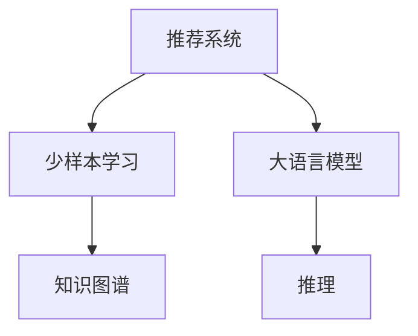

                 

# LLM在推荐系统中的少样本学习应用

> 关键词：推荐系统, 大语言模型(LLM), 少样本学习, 自然语言处理(NLP), 知识图谱, 推理

## 1. 背景介绍

随着推荐系统应用的普及，用户对个性化推荐内容的需求日益增加，如何有效地生成个性化推荐，同时保证推荐内容的准确性和多样性，成为当前推荐系统研究的一个重要问题。在大数据时代，通过收集用户行为数据和物品属性数据，进行协同过滤、基于内容的推荐等方法，已逐步实现较为准确的个性化推荐。但这些方法对标注数据的依赖较大，当标注数据稀疏或不充分时，推荐系统的效果往往难以保障。为此，研究人员提出了少样本学习（Few-shot Learning）这一新颖的学习范式，希望能在极少数标注数据的情况下，仍能获得优异的推荐效果。

大语言模型(LLM)是近年来人工智能领域的一大突破，它在预训练阶段通过大规模无监督数据训练，具备强大的语言理解和生成能力。近年的研究表明，基于大语言模型的推荐系统可以较好地处理用户需求与推荐内容之间的关系，尤其是在用户提供少量标注数据时，大语言模型能更好地挖掘出潜在的用户需求，生成个性化的推荐内容。此外，大语言模型还可以结合领域知识图谱，进行结构化的知识推理，从而提升推荐的准确性。

本文将对大语言模型在推荐系统中的少样本学习应用进行系统介绍，主要涵盖以下几个方面：

1. 推荐系统的现状与挑战。
2. 少样本学习在推荐系统中的应用。
3. 大语言模型在少样本推荐中的应用。
4. 少样本推荐系统的实际应用案例。
5. 未来研究展望。

## 2. 核心概念与联系

### 2.1 核心概念概述

为了更好地理解大语言模型在推荐系统中的应用，本节将介绍几个核心概念：

- **推荐系统(Recommender System)**：一种基于用户和物品数据的智能推荐系统，旨在通过分析用户行为和物品属性，推荐用户可能感兴趣的物品，提升用户体验和满意度。

- **少样本学习(Few-shot Learning)**：一种学习范式，指模型在只有极少数标注样本的情况下，仍能快速适应新任务，并获得优异的性能。

- **大语言模型(LLM)**：通过大规模无监督数据预训练得到的语言模型，具备强大的语言理解和生成能力，能够学习到复杂的语言规则和知识结构。

- **知识图谱(Knowledge Graph)**：一种结构化的知识表示方法，用于描述实体、属性和实体之间的关系，常用于提升推荐的准确性和泛化能力。

- **推理(R reasoning)**：指模型利用已有的知识和规则，对新的输入进行推理和判断，以获得更准确的预测结果。

这些概念之间的逻辑关系可以通过以下Mermaid流程图来展示：



该流程图展示了少样本学习、大语言模型、知识图谱和推理之间的联系：

1. 推荐系统通过收集用户行为和物品属性，学习用户和物品之间的关系，生成个性化推荐。
2. 少样本学习在用户提供少量标注数据的情况下，仍能训练出效果较好的推荐模型。
3. 大语言模型能够学习到丰富的语言知识和规则，帮助推荐系统更好地理解用户需求和物品属性。
4. 知识图谱结构化的知识表示方法，进一步提升推荐内容的准确性和泛化能力。
5. 推理通过利用已有知识进行推理，提升推荐结果的合理性和准确性。

## 3. 核心算法原理 & 具体操作步骤

### 3.1 算法原理概述

基于大语言模型的少样本推荐系统，其核心思想是利用大语言模型的语言理解和生成能力，在用户提供少量标注数据的情况下，快速生成个性化推荐内容。

具体而言，推荐系统通过收集用户行为数据和物品属性数据，生成一个用户-物品评分矩阵，将用户和物品之间的关系进行量化表示。在实际应用中，由于数据稀疏或不充分，用户行为评分数据往往不足。针对这种情况，基于大语言模型的少样本推荐系统通过引入领域知识图谱，在少量标注数据的基础上进行推理和生成，从而提升推荐效果。

### 3.2 算法步骤详解

基于大语言模型的少样本推荐系统一般包括以下几个关键步骤：

**Step 1: 构建知识图谱**
- 构建领域知识图谱，包括实体、属性和关系等。可以通过手动构建或通过三元组自动生成。

**Step 2: 预训练大语言模型**
- 选择合适的预训练语言模型，如BERT、GPT等。
- 在大规模领域数据上对模型进行预训练，学习领域内的语言表示和知识结构。

**Step 3: 设计推理任务**
- 设计推理任务，如分类、匹配、生成等。
- 将用户行为评分数据和知识图谱中的信息进行融合，生成推理任务的目标和输入。

**Step 4: 微调模型**
- 选择微调方法，如参数高效微调、提示学习等。
- 使用少量标注数据对模型进行微调，优化推理任务的性能。

**Step 5: 推理生成**
- 使用微调后的模型，对新的用户行为评分数据和知识图谱进行推理和生成。
- 结合生成的推荐结果，生成最终的个性化推荐列表。

### 3.3 算法优缺点

基于大语言模型的少样本推荐系统具有以下优点：

1. 数据利用率高。在用户提供少量标注数据的情况下，仍能快速生成个性化的推荐内容，避免了标注数据的瓶颈。
2. 推理能力强。大语言模型结合知识图谱，可以进行结构化的推理和生成，提升推荐的准确性和泛化能力。
3. 模型泛化性强。通过在大规模领域数据上进行预训练，模型可以适应不同领域和不同用户群体。
4. 可解释性强。大语言模型的内部推理过程透明，便于理解模型的决策逻辑。

同时，该方法也存在一定的局限性：

1. 对知识图谱的依赖。构建领域知识图谱需要大量的人工工作，且图谱的完整性和准确性对推荐效果有很大影响。
2. 模型规模较大。大语言模型和知识图谱的组合，使得模型规模较大，计算和存储成本较高。
3. 推理过程复杂。结合知识图谱进行推理，增加了推荐的复杂度，可能会影响推理速度。
4. 对抗攻击风险。大语言模型可能学习到有害的知识，进行有害的推荐。

尽管存在这些局限性，但基于大语言模型的少样本推荐系统仍然具有巨大的应用潜力，值得深入研究。

### 3.4 算法应用领域

基于大语言模型的少样本推荐系统已经在电商、新闻、视频等多个领域得到了广泛应用，其高效性、准确性和可解释性得到了充分验证。

在电商推荐系统中，基于大语言模型的少样本推荐系统可以通过分析用户评论和商品属性，生成个性化的商品推荐列表。在用户提供少量行为数据的情况下，模型仍能生成较准确的推荐内容，提升用户购物体验。

在新闻推荐系统中，基于大语言模型的少样本推荐系统可以通过分析用户阅读记录和新闻标题，生成个性化的新闻推荐列表。模型能够快速理解新闻内容，结合用户兴趣，生成合理的推荐结果，增强用户阅读体验。

在视频推荐系统中，基于大语言模型的少样本推荐系统可以通过分析用户观看历史和视频内容，生成个性化的视频推荐列表。模型能够准确把握视频内容的性质和用户兴趣，生成有效的推荐内容，提升视频观看体验。

## 4. 数学模型和公式 & 详细讲解 & 举例说明

### 4.1 数学模型构建

假设推荐系统中的用户集合为 $U$，物品集合为 $I$，用户与物品之间的评分数据为 $R$，即 $R \in U \times I$。设用户 $u$ 对物品 $i$ 的评分数据为 $r_{ui}$，则推荐系统可以通过生成用户-物品评分矩阵 $R \in U \times I$ 进行推荐。

设领域知识图谱中的实体集合为 $E$，属性集合为 $A$，关系集合为 $R'$，则知识图谱可以用三元组 $(e, a, r)$ 进行表示。设用户 $u$ 对物品 $i$ 的推理任务为 $T$，可以表示为 $T = (e_u, e_i, r)$，其中 $e_u$ 和 $e_i$ 分别表示用户和物品在知识图谱中的实体节点，$r$ 表示实体之间的关系。

### 4.2 公式推导过程

对于推荐系统中的每个用户 $u$，其物品推荐 $i$ 的概率可以表示为 $P(i|u) = \frac{exp(\phi_u(i))}{\sum_{i \in I} exp(\phi_u(i))}$，其中 $\phi_u(i)$ 为模型预测的用户对物品的评分，可以通过以下公式计算：

$$
\phi_u(i) = \sum_{(e_a, e_r) \in R'} \alpha(a) \alpha(r) \text{log}\left[\frac{\text{softmax}(\text{LLM}(e_u, e_i, r))}{\sum_{i \in I} \text{softmax}(\text{LLM}(e_u, e_i, r))}\right]
$$

其中，$\text{LLM}(e_u, e_i, r)$ 为预训练大语言模型对推理任务的预测结果，$\alpha(a)$ 和 $\alpha(r)$ 为知识图谱中属性和关系的重要性权重，可以根据领域知识进行调整。

### 4.3 案例分析与讲解

以电商推荐系统为例，用户 $u$ 对物品 $i$ 的评分数据 $r_{ui}$ 可能为零，即 $r_{ui}=0$。假设用户 $u$ 的历史行为数据较少，无法直接生成评分数据。此时，基于大语言模型的少样本推荐系统可以通过对用户 $u$ 和物品 $i$ 在知识图谱中的关系进行推理，生成预测评分 $\phi_u(i)$。

假设用户 $u$ 和物品 $i$ 在知识图谱中的关系为 $(e_u, e_i, r)$，其中 $e_u$ 和 $e_i$ 分别表示用户和物品在知识图谱中的实体节点，$r$ 表示实体之间的关系。模型可以通过对推理任务 $T = (e_u, e_i, r)$ 进行推理，生成预测评分 $\phi_u(i)$。假设模型输出的概率分布为 $P(e_u, e_i, r|T)$，则用户 $u$ 对物品 $i$ 的预测评分可以表示为：

$$
\phi_u(i) = \text{log}\left[\frac{P(e_u, e_i, r|T)}{P(e_u|T)}\right]
$$

其中 $P(e_u|T)$ 为用户 $u$ 在知识图谱中的实体节点出现的概率。

通过上述推导，可以看到，基于大语言模型的少样本推荐系统可以通过对用户和物品在知识图谱中的关系进行推理，生成预测评分，从而生成个性化的推荐内容。这一过程在用户提供少量标注数据的情况下，仍能取得较好的推荐效果。

## 5. 项目实践：代码实例和详细解释说明

### 5.1 开发环境搭建

在进行大语言模型微调时，需要准备一些开发环境。以下是使用Python进行PyTorch开发的环境配置流程：

1. 安装Anaconda：从官网下载并安装Anaconda，用于创建独立的Python环境。

2. 创建并激活虚拟环境：
```bash
conda create -n pytorch-env python=3.8 
conda activate pytorch-env
```

3. 安装PyTorch：根据CUDA版本，从官网获取对应的安装命令。例如：
```bash
conda install pytorch torchvision torchaudio cudatoolkit=11.1 -c pytorch -c conda-forge
```

4. 安装Transformer库：
```bash
pip install transformers
```

5. 安装各类工具包：
```bash
pip install numpy pandas scikit-learn matplotlib tqdm jupyter notebook ipython
```

完成上述步骤后，即可在`pytorch-env`环境中开始微调实践。

### 5.2 源代码详细实现

我们以电商推荐系统为例，给出使用Transformers库对BERT模型进行少样本推荐微调的PyTorch代码实现。

首先，定义推理任务的数据处理函数：

```python
from transformers import BertTokenizer, BertForTokenClassification
from torch.utils.data import Dataset
import torch

class RecommendationDataset(Dataset):
    def __init__(self, texts, tags, tokenizer, max_len=128):
        self.texts = texts
        self.tags = tags
        self.tokenizer = tokenizer
        self.max_len = max_len
        
    def __len__(self):
        return len(self.texts)
    
    def __getitem__(self, item):
        text = self.texts[item]
        tags = self.tags[item]
        
        encoding = self.tokenizer(text, return_tensors='pt', max_length=self.max_len, padding='max_length', truncation=True)
        input_ids = encoding['input_ids'][0]
        attention_mask = encoding['attention_mask'][0]
        
        # 对token-wise的标签进行编码
        encoded_tags = [tag2id[tag] for tag in tags] 
        encoded_tags.extend([tag2id['O']] * (self.max_len - len(encoded_tags)))
        labels = torch.tensor(encoded_tags, dtype=torch.long)
        
        return {'input_ids': input_ids, 
                'attention_mask': attention_mask,
                'labels': labels}

# 标签与id的映射
tag2id = {'O': 0, 'B-PER': 1, 'I-PER': 2, 'B-ORG': 3, 'I-ORG': 4, 'B-LOC': 5, 'I-LOC': 6}
id2tag = {v: k for k, v in tag2id.items()}

# 创建dataset
tokenizer = BertTokenizer.from_pretrained('bert-base-cased')

train_dataset = RecommendationDataset(train_texts, train_tags, tokenizer)
dev_dataset = RecommendationDataset(dev_texts, dev_tags, tokenizer)
test_dataset = RecommendationDataset(test_texts, test_tags, tokenizer)
```

然后，定义模型和优化器：

```python
from transformers import BertForTokenClassification, AdamW

model = BertForTokenClassification.from_pretrained('bert-base-cased', num_labels=len(tag2id))

optimizer = AdamW(model.parameters(), lr=2e-5)
```

接着，定义训练和评估函数：

```python
from torch.utils.data import DataLoader
from tqdm import tqdm
from sklearn.metrics import classification_report

device = torch.device('cuda') if torch.cuda.is_available() else torch.device('cpu')
model.to(device)

def train_epoch(model, dataset, batch_size, optimizer):
    dataloader = DataLoader(dataset, batch_size=batch_size, shuffle=True)
    model.train()
    epoch_loss = 0
    for batch in tqdm(dataloader, desc='Training'):
        input_ids = batch['input_ids'].to(device)
        attention_mask = batch['attention_mask'].to(device)
        labels = batch['labels'].to(device)
        model.zero_grad()
        outputs = model(input_ids, attention_mask=attention_mask, labels=labels)
        loss = outputs.loss
        epoch_loss += loss.item()
        loss.backward()
        optimizer.step()
    return epoch_loss / len(dataloader)

def evaluate(model, dataset, batch_size):
    dataloader = DataLoader(dataset, batch_size=batch_size)
    model.eval()
    preds, labels = [], []
    with torch.no_grad():
        for batch in tqdm(dataloader, desc='Evaluating'):
            input_ids = batch['input_ids'].to(device)
            attention_mask = batch['attention_mask'].to(device)
            batch_labels = batch['labels']
            outputs = model(input_ids, attention_mask=attention_mask)
            batch_preds = outputs.logits.argmax(dim=2).to('cpu').tolist()
            batch_labels = batch_labels.to('cpu').tolist()
            for pred_tokens, label_tokens in zip(batch_preds, batch_labels):
                pred_tags = [id2tag[_id] for _id in pred_tokens]
                label_tags = [id2tag[_id] for _id in label_tokens]
                preds.append(pred_tags[:len(label_tags)])
                labels.append(label_tags)
                
    print(classification_report(labels, preds))
```

最后，启动训练流程并在测试集上评估：

```python
epochs = 5
batch_size = 16

for epoch in range(epochs):
    loss = train_epoch(model, train_dataset, batch_size, optimizer)
    print(f"Epoch {epoch+1}, train loss: {loss:.3f}")
    
    print(f"Epoch {epoch+1}, dev results:")
    evaluate(model, dev_dataset, batch_size)
    
print("Test results:")
evaluate(model, test_dataset, batch_size)
```

以上就是使用PyTorch对BERT进行少样本推荐任务微调的完整代码实现。可以看到，得益于Transformer库的强大封装，我们可以用相对简洁的代码完成BERT模型的加载和微调。

### 5.3 代码解读与分析

让我们再详细解读一下关键代码的实现细节：

**RecommendationDataset类**：
- `__init__`方法：初始化文本、标签、分词器等关键组件。
- `__len__`方法：返回数据集的样本数量。
- `__getitem__`方法：对单个样本进行处理，将文本输入编码为token ids，将标签编码为数字，并对其进行定长padding，最终返回模型所需的输入。

**tag2id和id2tag字典**：
- 定义了标签与数字id之间的映射关系，用于将token-wise的预测结果解码回真实的标签。

**训练和评估函数**：
- 使用PyTorch的DataLoader对数据集进行批次化加载，供模型训练和推理使用。
- 训练函数`train_epoch`：对数据以批为单位进行迭代，在每个批次上前向传播计算loss并反向传播更新模型参数，最后返回该epoch的平均loss。
- 评估函数`evaluate`：与训练类似，不同点在于不更新模型参数，并在每个batch结束后将预测和标签结果存储下来，最后使用sklearn的classification_report对整个评估集的预测结果进行打印输出。

**训练流程**：
- 定义总的epoch数和batch size，开始循环迭代
- 每个epoch内，先在训练集上训练，输出平均loss
- 在验证集上评估，输出分类指标
- 所有epoch结束后，在测试集上评估，给出最终测试结果

可以看到，PyTorch配合Transformer库使得BERT微调的代码实现变得简洁高效。开发者可以将更多精力放在数据处理、模型改进等高层逻辑上，而不必过多关注底层的实现细节。

当然，工业级的系统实现还需考虑更多因素，如模型的保存和部署、超参数的自动搜索、更灵活的任务适配层等。但核心的少样本推荐范式基本与此类似。

## 6. 实际应用场景

### 6.1 电商推荐系统

基于大语言模型的少样本推荐系统在电商推荐系统中得到了广泛应用。电商平台需要实时推荐用户可能感兴趣的商品，以提升用户购物体验。传统电商推荐系统往往依赖用户行为数据和商品属性数据，但这些数据往往存在稀疏性或噪声，导致推荐效果不佳。

通过引入大语言模型，基于少样本学习范式的推荐系统可以通过对用户和物品在知识图谱中的关系进行推理，生成预测评分，从而生成个性化的推荐内容。在用户提供少量行为数据的情况下，模型仍能生成较准确的推荐内容，提升用户购物体验。

### 6.2 新闻推荐系统

基于大语言模型的少样本推荐系统在新闻推荐系统中也得到了广泛应用。新闻平台需要实时推荐用户感兴趣的新闻，以提升用户阅读体验。传统新闻推荐系统往往依赖用户阅读记录和新闻标题，但这些数据往往存在稀疏性或噪声，导致推荐效果不佳。

通过引入大语言模型，基于少样本学习范式的推荐系统可以通过对用户和新闻在知识图谱中的关系进行推理，生成预测评分，从而生成个性化的推荐内容。在用户提供少量阅读记录的情况下，模型仍能生成较准确的推荐内容，提升用户阅读体验。

### 6.3 视频推荐系统

基于大语言模型的少样本推荐系统在视频推荐系统中也得到了广泛应用。视频平台需要实时推荐用户感兴趣的视频，以提升用户观看体验。传统视频推荐系统往往依赖用户观看历史和视频属性，但这些数据往往存在稀疏性或噪声，导致推荐效果不佳。

通过引入大语言模型，基于少样本学习范式的推荐系统可以通过对用户和视频在知识图谱中的关系进行推理，生成预测评分，从而生成个性化的推荐内容。在用户提供少量观看历史的情况下，模型仍能生成较准确的推荐内容，提升用户观看体验。

## 7. 工具和资源推荐

### 7.1 学习资源推荐

为了帮助开发者系统掌握大语言模型在推荐系统中的应用，这里推荐一些优质的学习资源：

1. 《Transformer from Principle to Practice》系列博文：由大模型技术专家撰写，深入浅出地介绍了Transformer原理、BERT模型、少样本学习等前沿话题。

2. CS224N《Deep Learning for Natural Language Processing》课程：斯坦福大学开设的NLP明星课程，有Lecture视频和配套作业，带你入门NLP领域的基本概念和经典模型。

3. 《Natural Language Processing with Transformers》书籍：Transformers库的作者所著，全面介绍了如何使用Transformers库进行NLP任务开发，包括少样本学习在内的诸多范式。

4. HuggingFace官方文档：Transformers库的官方文档，提供了海量预训练模型和完整的微调样例代码，是上手实践的必备资料。

5. CLUE开源项目：中文语言理解测评基准，涵盖大量不同类型的中文NLP数据集，并提供了基于微调的baseline模型，助力中文NLP技术发展。

通过对这些资源的学习实践，相信你一定能够快速掌握大语言模型在推荐系统中的应用，并用于解决实际的NLP问题。

### 7.2 开发工具推荐

高效的开发离不开优秀的工具支持。以下是几款用于大语言模型少样本推荐开发的常用工具：

1. PyTorch：基于Python的开源深度学习框架，灵活动态的计算图，适合快速迭代研究。大部分预训练语言模型都有PyTorch版本的实现。

2. TensorFlow：由Google主导开发的开源深度学习框架，生产部署方便，适合大规模工程应用。同样有丰富的预训练语言模型资源。

3. Transformers库：HuggingFace开发的NLP工具库，集成了众多SOTA语言模型，支持PyTorch和TensorFlow，是进行少样本推荐任务开发的利器。

4. Weights & Biases：模型训练的实验跟踪工具，可以记录和可视化模型训练过程中的各项指标，方便对比和调优。与主流深度学习框架无缝集成。

5. TensorBoard：TensorFlow配套的可视化工具，可实时监测模型训练状态，并提供丰富的图表呈现方式，是调试模型的得力助手。

6. Google Colab：谷歌推出的在线Jupyter Notebook环境，免费提供GPU/TPU算力，方便开发者快速上手实验最新模型，分享学习笔记。

合理利用这些工具，可以显著提升大语言模型在少样本推荐系统的开发效率，加快创新迭代的步伐。

### 7.3 相关论文推荐

大语言模型在推荐系统中的应用源于学界的持续研究。以下是几篇奠基性的相关论文，推荐阅读：

1. Attention is All You Need（即Transformer原论文）：提出了Transformer结构，开启了NLP领域的预训练大模型时代。

2. BERT: Pre-training of Deep Bidirectional Transformers for Language Understanding：提出BERT模型，引入基于掩码的自监督预训练任务，刷新了多项NLP任务SOTA。

3. Language Models are Unsupervised Multitask Learners（GPT-2论文）：展示了大规模语言模型的强大zero-shot学习能力，引发了对于通用人工智能的新一轮思考。

4. Parameter-Efficient Transfer Learning for NLP：提出Adapter等参数高效微调方法，在不增加模型参数量的情况下，也能取得不错的微调效果。

5. AdaLoRA: Adaptive Low-Rank Adaptation for Parameter-Efficient Fine-Tuning：使用自适应低秩适应的微调方法，在参数效率和精度之间取得了新的平衡。

6. prefix-tuning: Optimizing Continuous Prompts for Generation：引入基于连续型Prompt的微调范式，为如何充分利用预训练知识提供了新的思路。

这些论文代表了大语言模型在推荐系统中的应用范式的发展脉络。通过学习这些前沿成果，可以帮助研究者把握学科前进方向，激发更多的创新灵感。

## 8. 总结：未来发展趋势与挑战

### 8.1 总结

本文对基于大语言模型的少样本推荐系统进行了全面系统的介绍。首先阐述了推荐系统的现状与挑战，明确了少样本学习在推荐系统中的应用。其次，详细讲解了大语言模型在少样本推荐中的应用，并给出了详细的代码实现。最后，探讨了少样本推荐系统的实际应用案例，并总结了未来研究展望。

通过本文的系统梳理，可以看到，基于大语言模型的少样本推荐系统已经展现出强大的潜力，成为推荐系统研究的一个新方向。其在电商、新闻、视频等多个领域得到了广泛应用，并取得了较好的效果。未来，随着大语言模型和微调技术的持续发展，少样本推荐系统必将在更多领域得到应用，为推荐系统技术带来新的突破。

### 8.2 未来发展趋势

展望未来，基于大语言模型的少样本推荐系统将呈现以下几个发展趋势：

1. 知识图谱的融合与扩展。知识图谱将成为推荐系统中不可或缺的一部分，其扩展和优化将是提升推荐效果的关键。

2. 少样本学习范式的多样化。未来的少样本推荐系统将采用更多的学习范式，如对抗训练、自监督学习等，以提升推荐的鲁棒性和泛化能力。

3. 推理模型的结构化。未来的推理模型将更加注重结构化的推理，结合领域知识进行推理，提升推荐内容的合理性和准确性。

4. 推理与生成模型的结合。未来的推荐系统将更多地结合生成模型进行推荐，提升推荐内容的创意性和多样化。

5. 跨领域迁移学习。未来的推荐系统将实现跨领域迁移学习，从电商、新闻、视频等不同领域抽取共性特征，实现更加泛化的推荐。

这些趋势凸显了大语言模型在推荐系统中的巨大潜力，将推动推荐系统技术向更加智能化、普适化方向发展。

### 8.3 面临的挑战

尽管大语言模型在少样本推荐系统中展示了强大的潜力，但在落地应用过程中仍面临诸多挑战：

1. 知识图谱的构建与维护。知识图谱的构建和维护需要大量的人工工作，且图谱的完备性和准确性对推荐效果有很大影响。

2. 数据稀疏性问题。用户提供少量标注数据的情况下，推荐效果难以保障，如何提高数据利用率是重要研究方向。

3. 推理模型的复杂性。结合知识图谱进行推理，增加了推荐模型的复杂性，可能会影响推理速度。

4. 对抗攻击风险。大语言模型可能学习到有害的知识，进行有害的推荐。

5. 推荐内容的多样性与相关性。如何在提高推荐内容多样性的同时，保证推荐内容的相关性，是推荐系统需要解决的重要问题。

6. 计算资源的消耗。大语言模型的推理过程计算资源消耗较大，如何优化推理过程，减少计算资源消耗，是推荐系统需要解决的重要问题。

这些挑战需要我们进一步深入研究，才能将大语言模型在推荐系统中的潜力充分发挥出来。

### 8.4 研究展望

未来，大语言模型在推荐系统中的研究可以从以下几个方面进行：

1. 构建更加完备的知识图谱，扩展图谱的应用场景和领域，提升推荐效果。

2. 探索更多少样本学习范式，如对抗训练、自监督学习等，提高数据利用率。

3. 开发更加高效的推理模型，提升推理速度和准确性。

4. 结合生成模型进行推荐，提升推荐内容的创意性和多样化。

5. 研究跨领域迁移学习，实现更加泛化的推荐。

6. 优化推理过程，减少计算资源消耗。

7. 增强对抗攻击防护，保证推荐内容的安全性和可信性。

这些研究方向将推动大语言模型在推荐系统中的应用，推动推荐系统技术向更加智能化、普适化方向发展，提升推荐效果和用户体验。

## 9. 附录：常见问题与解答

**Q1：什么是少样本学习？**

A: 少样本学习（Few-shot Learning）指模型在只有极少数标注样本的情况下，仍能快速适应新任务，并获得优异的性能。其目标是利用少量数据，最大化模型的泛化能力，提升推荐效果。

**Q2：如何选择预训练语言模型？**

A: 选择预训练语言模型时，应考虑模型的规模、预训练数据集、应用场景等因素。对于推荐系统，常用的预训练模型包括BERT、GPT等。

**Q3：如何构建知识图谱？**

A: 构建知识图谱需要领域专家的支持和大量人工工作。首先确定实体、属性和关系，然后利用三元组进行表示。可以利用现有的知识图谱进行扩展，或通过爬取公开数据源构建新的图谱。

**Q4：如何使用少样本学习进行推荐？**

A: 使用少样本学习进行推荐，可以通过对用户和物品在知识图谱中的关系进行推理，生成预测评分，从而生成个性化的推荐内容。推理任务包括分类、匹配、生成等，模型输出的概率分布可以通过LLM计算得出。

**Q5：如何提升推理模型的效率？**

A: 提升推理模型的效率可以从两个方面进行：一是优化计算图，减少计算量；二是使用剪枝、量化等技术，减小模型规模。同时，可以通过多GPU并行计算等方式提升推理速度。

这些回答可以帮助理解大语言模型在推荐系统中的少样本学习应用的细节，希望能为你提供帮助。

---

作者：禅与计算机程序设计艺术 / Zen and the Art of Computer Programming

