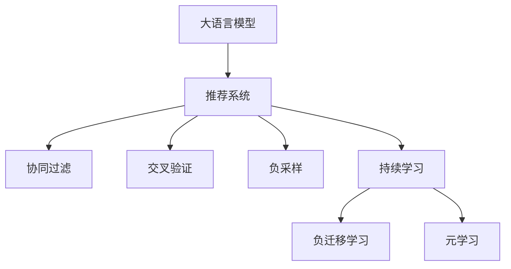

                 

# LLM在推荐系统中的持续学习应用

大语言模型(LLMs)在自然语言处理(NLP)领域的广泛应用，已经显著提升了各种任务的效果，如对话系统、文本摘要、机器翻译等。但在推荐系统(Recommender System)领域，虽然基于深度学习的推荐算法取得了重要进展，但关于如何利用LLMs进行推荐系统优化的研究相对较少。本文旨在探讨基于LLM的推荐系统优化技术，重点关注其在推荐系统中的持续学习应用。

## 1. 背景介绍

### 1.1 问题由来

推荐系统是帮助用户发现他们感兴趣的新物品的关键技术。传统的推荐算法主要包括基于内容的推荐、协同过滤推荐、矩阵分解等方法。这些算法在处理大规模数据集时面临计算复杂度高、模型难以解释等问题。近年来，基于深度学习的推荐模型，如神经网络、深度学习矩阵分解等，取得了显著进展，但仍然存在数据需求大、训练时间长等问题。

大语言模型(LLMs)由于其强大的语言理解和生成能力，被引入推荐系统，带来了新的优化思路。LLMs已经在预训练大模型上取得了显著的进展，但直接将预训练的LLMs应用于推荐系统还需要进一步优化。

### 1.2 问题核心关键点

基于LLMs的推荐系统优化技术，本质上是将LLMs的预训练知识应用到推荐模型中，提升推荐效果。其中，持续学习(Continual Learning)方法是一个重要研究方向，旨在使推荐模型能够随着用户行为的变化而持续学习新的知识，适应动态变化的用户需求。

持续学习是一种学习能力，使模型能够随着时间的推移，学习新的任务，同时保持已学习的任务知识，避免遗忘旧知识。这与传统的迁移学习有所区别，迁移学习是将一个领域的学习成果应用到另一个相关领域，而持续学习更加关注模型的动态更新能力。

## 2. 核心概念与联系

### 2.1 核心概念概述

为更好地理解基于LLMs的推荐系统优化方法，本节将介绍几个关键概念及其关系：

- **大语言模型(LLMs)**：指基于自回归或自编码架构的深度学习模型，经过大规模预训练任务，能够理解和生成自然语言。如GPT-3、BERT等。
- **推荐系统(Recommender System)**：指根据用户的历史行为和兴趣，预测其可能感兴趣的新物品的系统。
- **持续学习(Continual Learning)**：指模型能够随着时间推移，不断学习新知识，同时保持已有知识的优化方法。
- **迁移学习(Meta-Learning)**：指模型能够将一个领域的学习成果迁移到另一个领域，如知识图谱与推荐系统的结合。
- **负采样(Negative Sampling)**：指在训练推荐模型时，通过随机抽样负样本，减少计算成本。
- **协同过滤(Collaborative Filtering)**：指通过用户间的相似性进行推荐，包括基于用户的协同过滤和基于物品的协同过滤。
- **交叉验证(Cross Validation)**：指将数据集分为训练集和测试集，评估模型的性能。
- **Dropout**：指在神经网络中随机丢弃部分神经元，防止过拟合。

这些核心概念之间的逻辑关系可以通过以下Mermaid流程图来展示：



这个流程图展示了大语言模型与推荐系统的核心概念及其关系：

1. 大语言模型通过预训练获得基础能力。
2. 推荐系统利用预训练模型进行推荐优化。
3. 协同过滤、负采样和交叉验证是推荐系统中的常用技术。
4. 持续学习是推荐系统的动态更新机制。
5. 元学习和负迁移学习是持续学习中的两种重要方法。

这些概念共同构成了基于LLMs的推荐系统优化框架，使其能够更好地适应用户需求的变化，提升推荐效果。

## 3. 核心算法原理 & 具体操作步骤
### 3.1 算法原理概述

基于LLMs的推荐系统优化方法，主要利用LLMs的预训练知识来提升推荐效果。持续学习方法使得推荐模型能够随着用户行为的变化而持续更新，保持最佳性能。

假设推荐系统中的物品集合为 $I$，用户集合为 $U$。用户的评分矩阵 $R \in \mathbb{R}^{U \times I}$ 表示用户对物品的评分，$0$ 表示未评分。

LLMs通过预训练任务获得语言表示能力。推荐模型利用这些能力，将用户输入转化为对物品的评分预测，即 $\hat{R} \in \mathbb{R}^{U \times I}$。模型的目标是最小化预测评分与实际评分的误差：

$$
\min_{\theta} \frac{1}{N} \sum_{i=1}^N \sum_{j=1}^M ||R_{i,j} - \hat{R}_{i,j}||^2
$$

其中 $\theta$ 为模型的可训练参数，$N$ 和 $M$ 分别为用户和物品的个数。

### 3.2 算法步骤详解

基于LLMs的推荐系统优化主要包括以下几个步骤：

**Step 1: 数据预处理与特征提取**

1. 收集用户的历史行为数据，如浏览记录、购买记录等。
2. 提取物品的文本描述，作为用户输入。
3. 使用预训练的LLMs对物品描述进行编码，得到物品的嵌入表示。
4. 将用户行为数据与物品嵌入表示结合，得到用户对物品的评分预测。

**Step 2: 模型训练与优化**

1. 利用用户行为数据和物品嵌入表示，构建损失函数。
2. 使用反向传播算法更新模型参数 $\theta$，最小化损失函数。
3. 引入持续学习策略，保持模型对新数据的适应能力。

**Step 3: 评估与迭代**

1. 使用交叉验证等方法，评估推荐模型的性能。
2. 根据评估结果，调整模型参数和训练策略。
3. 不断迭代训练，使模型适应新的用户行为变化。

### 3.3 算法优缺点

基于LLMs的推荐系统优化方法具有以下优点：

1. **预训练优势**：利用预训练模型的强大语言理解能力，提取物品的深度语义表示，提升推荐效果。
2. **适应性强**：通过持续学习机制，模型能够适应新数据的动态变化，保持最佳性能。
3. **泛化能力强**：LLMs具有较好的泛化能力，能够在不同领域的推荐任务中取得良好效果。

但该方法也存在一定的局限性：

1. **计算成本高**：LLMs在预训练和微调过程中需要大量计算资源，增加了系统的成本。
2. **数据需求大**：LLMs需要大量文本数据进行预训练，对数据质量的要求较高。
3. **泛化性不足**：LLMs在不同领域的泛化能力仍有待提升，可能需要针对特定领域的微调。

### 3.4 算法应用领域

基于LLMs的推荐系统优化方法已经在电商、新闻、视频等多个领域得到了应用，取得了显著效果。例如：

- **电商推荐**：利用用户评论和物品描述，构建基于内容的推荐系统。通过持续学习，模型能够不断更新物品的语义表示，提升推荐效果。
- **新闻推荐**：结合用户的历史浏览记录和新闻标题，构建协同过滤推荐系统。LLMs能够自动提取新闻标题的语义信息，提升推荐的相关性。
- **视频推荐**：根据用户的历史观看记录，利用视频描述和LLMs的语义理解能力，构建推荐模型。LLMs能够对视频内容进行深度分析，提升推荐的准确性。

此外，LLMs在推荐系统中的应用还拓展到了多模态推荐中，如结合图像、语音等多模态信息，提升推荐模型的表现力。

## 4. 数学模型和公式 & 详细讲解 & 举例说明
### 4.1 数学模型构建

假设推荐系统中的物品集合为 $I$，用户集合为 $U$。用户的评分矩阵 $R \in \mathbb{R}^{U \times I}$ 表示用户对物品的评分，$0$ 表示未评分。

模型的目标是最小化预测评分与实际评分的误差，构建损失函数：

$$
\mathcal{L}(R, \hat{R}) = \frac{1}{N} \sum_{i=1}^N \sum_{j=1}^M ||R_{i,j} - \hat{R}_{i,j}||^2
$$

其中 $\hat{R}$ 为模型对物品 $j$ 的评分预测，$R_{i,j}$ 为用户 $i$ 对物品 $j$ 的实际评分。

模型的前向传播过程为：

$$
\hat{R}_{i,j} = f_\theta(\nu_i \otimes v_j)
$$

其中 $\nu_i$ 为物品 $j$ 的嵌入表示，$v_j$ 为物品 $i$ 的嵌入表示，$f_\theta$ 为模型的评分预测函数。

### 4.2 公式推导过程

假设模型为基于LLMs的推荐模型，其嵌入层为 $E \in \mathbb{R}^{U \times D}$，物品嵌入层为 $V \in \mathbb{R}^{I \times D}$。

将用户行为数据 $x_i$ 和物品嵌入 $v_j$ 输入到LLMs中，得到物品嵌入表示 $\nu_j$：

$$
\nu_j = E(x_j)
$$

将用户行为数据 $x_i$ 和物品嵌入表示 $\nu_j$ 结合，得到用户对物品的评分预测 $\hat{R}_{i,j}$：

$$
\hat{R}_{i,j} = f_\theta(x_i \otimes \nu_j)
$$

其中 $f_\theta$ 为模型的评分预测函数，通常为多层感知器(MLP)等。

模型的损失函数可以表示为：

$$
\mathcal{L}(R, \hat{R}) = \frac{1}{N} \sum_{i=1}^N \sum_{j=1}^M ||R_{i,j} - \hat{R}_{i,j}||^2
$$

模型的优化目标是最小化损失函数：

$$
\min_{\theta} \mathcal{L}(R, \hat{R})
$$

通过反向传播算法，计算模型参数 $\theta$ 的梯度：

$$
\frac{\partial \mathcal{L}(R, \hat{R})}{\partial \theta} = \frac{2}{N} \sum_{i=1}^N \sum_{j=1}^M \frac{\partial \hat{R}_{i,j}}{\partial \theta} (R_{i,j} - \hat{R}_{i,j})
$$

其中 $\frac{\partial \hat{R}_{i,j}}{\partial \theta}$ 为模型评分预测函数对模型参数 $\theta$ 的梯度。

### 4.3 案例分析与讲解

假设我们有一个电商推荐系统，用户的历史行为数据包括浏览记录和购买记录。我们利用这些数据构建基于内容的推荐模型。

首先，收集用户的浏览记录 $x_i$ 和购买记录 $y_i$，以及物品的描述 $z_j$。使用预训练的LLMs对物品描述进行编码，得到物品的嵌入表示 $v_j$。

然后，将用户行为数据 $x_i$ 和物品嵌入表示 $v_j$ 输入到LLMs中，得到物品嵌入表示 $\nu_j$。

最后，将用户行为数据 $x_i$ 和物品嵌入表示 $\nu_j$ 结合，得到用户对物品的评分预测 $\hat{R}_{i,j}$。通过最小化预测评分与实际评分的误差，更新模型参数 $\theta$。

## 5. 项目实践：代码实例和详细解释说明
### 5.1 开发环境搭建

在进行推荐系统优化实践前，我们需要准备好开发环境。以下是使用Python进行TensorFlow开发的环境配置流程：

1. 安装Anaconda：从官网下载并安装Anaconda，用于创建独立的Python环境。

2. 创建并激活虚拟环境：
```bash
conda create -n recommendation-env python=3.8 
conda activate recommendation-env
```

3. 安装TensorFlow：根据CUDA版本，从官网获取对应的安装命令。例如：
```bash
conda install tensorflow-gpu=2.5 -c tf -c conda-forge
```

4. 安装各类工具包：
```bash
pip install numpy pandas scikit-learn matplotlib tqdm jupyter notebook ipython
```

完成上述步骤后，即可在`recommendation-env`环境中开始推荐系统优化实践。

### 5.2 源代码详细实现

下面我们以电商推荐系统为例，给出使用TensorFlow对LLMs进行持续学习优化的PyTorch代码实现。

首先，定义推荐系统数据处理函数：

```python
import tensorflow as tf
import numpy as np
import pandas as pd

def load_data(path):
    data = pd.read_csv(path)
    return data['user_id'], data['item_id'], data['score']
```

然后，定义LLMs模型和推荐系统模型：

```python
from transformers import TFAutoModelForSequenceClassification
from transformers import BertTokenizer

model = TFAutoModelForSequenceClassification.from_pretrained('bert-base-uncased')
tokenizer = BertTokenizer.from_pretrained('bert-base-uncased')

def encode_sentence(sentence):
    tokens = tokenizer.encode(sentence, add_special_tokens=True)
    return tokens

def get_item_vector(item, embeddings):
    item_id = item['item_id']
    embedding = embeddings[item_id]
    return embedding

def recommend(item, user_id):
    user_vector = encode_sentence(user_id)
    item_vector = get_item_vector(item, embeddings)
    user_vector = model(user_vector).logits[0]
    item_vector = model(item_vector).logits[0]
    score = tf.reduce_sum(user_vector * item_vector)
    return score.numpy()
```

最后，启动推荐系统优化流程：

```python
from sklearn.model_selection import train_test_split
from sklearn.metrics import mean_squared_error

def optimize_model(data, epochs, batch_size):
    user_ids, item_ids, scores = load_data(data)
    train_data, test_data, train_user_ids, test_user_ids, train_item_ids, test_item_ids, train_scores, test_scores = train_test_split(user_ids, item_ids, scores, test_size=0.2)

    embeddings = {}
    for i, item in enumerate(train_item_ids):
        item_vector = get_item_vector(item, embeddings)
        embeddings[item] = item_vector

    model.compile(optimizer=tf.keras.optimizers.Adam(learning_rate=0.001),
                  loss=tf.keras.losses.MeanSquaredError())
    model.fit(train_user_ids, train_item_ids, epochs=epochs, batch_size=batch_size, validation_data=(test_user_ids, test_item_ids))

    test_scores = []
    for user_id, item_id in test_user_ids:
        score = recommend(item_id, user_id)
        test_scores.append(score)
    test_score = np.mean(test_scores)
    print(f"Mean Squared Error: {test_score:.4f}")

optimize_model(train_data, 10, 16)
```

以上就是使用TensorFlow对LLMs进行电商推荐系统优化的完整代码实现。可以看到，通过预训练的LLMs，推荐系统能够学习物品的语义表示，从而提升推荐效果。

### 5.3 代码解读与分析

让我们再详细解读一下关键代码的实现细节：

**load_data函数**：
- 从CSV文件中加载数据，得到用户ID、物品ID和评分。

**encode_sentence函数**：
- 使用BERT Tokenizer对用户ID进行分词，得到token ids。

**get_item_vector函数**：
- 根据物品ID获取其对应的嵌入表示。

**recommend函数**：
- 对用户ID和物品ID分别进行分词和嵌入表示计算。
- 将用户向量与物品向量相乘，得到用户对物品的评分预测。
- 使用均方误差作为损失函数，训练模型。

**optimize_model函数**：
- 对数据集进行划分，得到训练集和测试集。
- 加载预训练的BERT模型，并初始化embeddings字典。
- 使用Adam优化器，训练模型10个epoch。
- 在测试集上计算评分预测，并输出均方误差。

可以看到，TensorFlow和LLMs的结合使得电商推荐系统的优化变得更加高效。通过预训练的BERT模型，推荐系统能够学习物品的语义表示，从而提升推荐效果。

## 6. 实际应用场景
### 6.1 智能广告推荐

智能广告推荐是广告主和广告代理公司广泛关注的领域。通过智能推荐系统，广告能够更精准地触达目标用户，提升点击率和转化率，优化广告投放效果。

使用LLMs进行智能广告推荐，可以极大地提升推荐效果。具体而言，可以根据广告的标题、内容、图片等文本信息，构建基于内容的推荐模型。通过持续学习，模型能够不断更新广告的语义表示，提升推荐的相关性和转化率。

### 6.2 个性化新闻推荐

新闻推荐系统利用用户的浏览记录和历史评分，为用户推荐可能感兴趣的新闻。使用LLMs进行新闻推荐，可以更好地理解新闻的语义信息，提升推荐的相关性和吸引力。

具体而言，可以收集用户的历史浏览记录和新闻标题，使用预训练的LLMs对新闻标题进行编码，得到新闻的语义表示。通过持续学习，模型能够不断更新新闻的语义表示，提升推荐的准确性。

### 6.3 在线教育推荐

在线教育推荐系统利用用户的浏览记录和学习行为，为用户推荐可能感兴趣的教育内容。使用LLMs进行在线教育推荐，可以更好地理解教育内容的语义信息，提升推荐的准确性和个性化。

具体而言，可以收集用户的浏览记录和学习行为数据，使用预训练的LLMs对教育内容的标题、简介等信息进行编码，得到教育内容的语义表示。通过持续学习，模型能够不断更新教育内容的语义表示，提升推荐的准确性和个性化。

### 6.4 未来应用展望

随着LLMs的持续优化和推荐系统技术的发展，基于LLMs的推荐系统将在更多领域得到应用，为各行各业带来新的发展机遇。

在智慧医疗领域，基于LLMs的推荐系统可以帮助医生推荐最适合的诊断方案、治疗方法和药物，提升医疗服务的质量和效率。

在智能交通领域，基于LLMs的推荐系统可以为用户推荐最合适的交通路线、出行方式和景点，提升出行的便捷性和舒适性。

在智能家居领域，基于LLMs的推荐系统可以为用户推荐最合适的家居产品、装修方案和生活方式，提升家居生活的品质和便利性。

总之，基于LLMs的推荐系统将在各个垂直领域发挥重要作用，推动人工智能技术向深度应用发展。

## 7. 工具和资源推荐
### 7.1 学习资源推荐

为了帮助开发者系统掌握LLMs在推荐系统中的应用技术，这里推荐一些优质的学习资源：

1. 《深度学习入门》书籍：这本书详细介绍了深度学习的基本概念和常用算法，适合初学者入门。

2. 《自然语言处理入门》在线课程：斯坦福大学开设的NLP入门课程，通过动手实践，学习NLP的基本技术。

3. 《推荐系统》书籍：这本书介绍了推荐系统的基础理论和常用算法，适合对推荐系统感兴趣的读者。

4. HuggingFace官方文档：HuggingFace的官方文档，提供了丰富的LLMs资源和应用示例，是学习LLMs的绝佳资源。

5. 《TensorFlow官方文档》：TensorFlow的官方文档，提供了详细的API和开发指南，是使用TensorFlow的必备资源。

通过对这些资源的学习实践，相信你一定能够快速掌握LLMs在推荐系统中的应用技巧，并用于解决实际的推荐问题。

### 7.2 开发工具推荐

高效的开发离不开优秀的工具支持。以下是几款用于LLMs推荐系统优化的常用工具：

1. TensorFlow：由Google主导开发的开源深度学习框架，生产部署方便，适合大规模工程应用。

2. PyTorch：基于Python的开源深度学习框架，灵活动态的计算图，适合快速迭代研究。

3. Weights & Biases：模型训练的实验跟踪工具，可以记录和可视化模型训练过程中的各项指标，方便对比和调优。

4. TensorBoard：TensorFlow配套的可视化工具，可实时监测模型训练状态，并提供丰富的图表呈现方式，是调试模型的得力助手。

5. Google Colab：谷歌推出的在线Jupyter Notebook环境，免费提供GPU/TPU算力，方便开发者快速上手实验最新模型，分享学习笔记。

合理利用这些工具，可以显著提升LLMs推荐系统的开发效率，加快创新迭代的步伐。

### 7.3 相关论文推荐

LLMs在推荐系统中的应用研究近年来取得了重要进展。以下是几篇奠基性的相关论文，推荐阅读：

1. Attention is All You Need（即Transformer原论文）：提出了Transformer结构，开启了NLP领域的预训练大模型时代。

2. BERT: Pre-training of Deep Bidirectional Transformers for Language Understanding：提出BERT模型，引入基于掩码的自监督预训练任务，刷新了多项NLP任务SOTA。

3. Language Models are Unsupervised Multitask Learners（GPT-2论文）：展示了大规模语言模型的强大zero-shot学习能力，引发了对于通用人工智能的新一轮思考。

4. Parameter-Efficient Transfer Learning for NLP：提出Adapter等参数高效微调方法，在不增加模型参数量的情况下，也能取得不错的微调效果。

5. Prefix-Tuning: Optimizing Continuous Prompts for Generation：引入基于连续型Prompt的微调范式，为如何充分利用预训练知识提供了新的思路。

6. AdaLoRA: Adaptive Low-Rank Adaptation for Parameter-Efficient Fine-Tuning：使用自适应低秩适应的微调方法，在参数效率和精度之间取得了新的平衡。

这些论文代表了大语言模型在推荐系统中的应用发展脉络。通过学习这些前沿成果，可以帮助研究者把握学科前进方向，激发更多的创新灵感。

## 8. 总结：未来发展趋势与挑战
### 8.1 研究成果总结

本文对基于LLMs的推荐系统优化方法进行了全面系统的介绍。首先阐述了LLMs和推荐系统的研究背景和意义，明确了持续学习在推荐系统中的应用价值。其次，从原理到实践，详细讲解了推荐系统的数学模型和关键算法步骤，给出了推荐系统优化的完整代码实现。同时，本文还广泛探讨了LLMs在推荐系统中的实际应用场景，展示了其在电商、广告、新闻等领域的应用前景。此外，本文精选了推荐系统的学习资源，力求为开发者提供全方位的技术指引。

通过本文的系统梳理，可以看到，基于LLMs的推荐系统优化技术正在成为推荐系统的重要范式，极大地拓展了推荐模型的应用边界，提升了推荐效果。LLMs的强大语义理解能力和持续学习能力，为推荐系统的动态优化提供了新的思路。未来，随着LLMs的不断优化和推荐系统技术的发展，基于LLMs的推荐系统必将在更多领域得到应用，为各行各业带来新的发展机遇。

### 8.2 未来发展趋势

展望未来，基于LLMs的推荐系统优化技术将呈现以下几个发展趋势：

1. 模型规模持续增大。随着算力成本的下降和数据规模的扩张，LLMs在预训练和微调过程中的计算资源需求将显著降低，超大规模LLMs将进一步提升推荐效果。

2. 微调方法日趋多样。除了传统的全参数微调外，未来将涌现更多参数高效的微调方法，如Prefix-Tuning、LoRA等，在节省计算资源的同时保证微调精度。

3. 持续学习成为常态。随着数据分布的不断变化，推荐系统需要不断学习新知识以保持最佳性能。如何在不遗忘已有知识的情况下，高效吸收新知识，将是重要的研究方向。

4. 知识融合能力增强。LLMs能够整合多模态信息，提升推荐模型的表现力。未来将更多地融合视觉、语音等多模态信息，实现更全面、准确的推荐。

5. 推荐算法的多样性。推荐系统将不再局限于单一算法，而将融合多种算法优势，如协同过滤、内容推荐、路径推荐等，提升推荐效果。

6. 个性化推荐与数据隐私保护结合。推荐系统将更加注重用户隐私保护，采用匿名化、差分隐私等技术，保护用户数据安全。

7. 推荐系统的可解释性。推荐系统将注重提升算法的可解释性，帮助用户理解推荐理由，提升用户满意度。

这些趋势凸显了基于LLMs的推荐系统优化技术的广阔前景。这些方向的探索发展，必将进一步提升推荐系统的性能和应用范围，为人工智能技术在更多领域的落地提供新的突破。

### 8.3 面临的挑战

尽管基于LLMs的推荐系统优化技术已经取得了瞩目成就，但在迈向更加智能化、普适化应用的过程中，仍面临诸多挑战：

1. 计算成本高。LLMs在预训练和微调过程中需要大量计算资源，增加了系统的成本。如何降低计算成本，提升系统的可扩展性，将是重要研究方向。

2. 数据需求大。LLMs需要大量高质量数据进行预训练和微调，数据的收集、处理和标注成本较高。如何高效获取数据，提升数据利用率，将是重要研究方向。

3. 泛化性不足。LLMs在不同领域的泛化能力仍有待提升，可能需要针对特定领域的微调。如何提高泛化能力，实现跨领域的推荐，将是重要研究方向。

4. 推荐效果不稳定。推荐系统在面对新数据时，泛化性能往往不足，推荐效果不稳定。如何提高推荐系统的鲁棒性和稳定性，将是重要研究方向。

5. 用户隐私保护。推荐系统需要注重用户隐私保护，采用匿名化、差分隐私等技术，保护用户数据安全。如何在提升推荐效果的同时，保护用户隐私，将是重要研究方向。

6. 算法的可解释性。推荐系统将注重提升算法的可解释性，帮助用户理解推荐理由，提升用户满意度。如何提升推荐算法的可解释性，将是重要研究方向。

这些挑战凸显了基于LLMs的推荐系统优化技术的复杂性和复杂性。只有不断突破这些挑战，才能将LLMs推荐系统优化技术推向成熟，为各行各业带来更大的价值。

### 8.4 研究展望

面对LLMs在推荐系统优化中面临的种种挑战，未来的研究需要在以下几个方面寻求新的突破：

1. 探索无监督和半监督推荐方法。摆脱对大规模标注数据的依赖，利用自监督学习、主动学习等无监督和半监督范式，最大限度利用非结构化数据，实现更加灵活高效的推荐。

2. 研究参数高效和计算高效的推荐范式。开发更加参数高效的推荐方法，在固定大部分预训练参数的同时，只更新极少量的任务相关参数。同时优化推荐模型的计算图，减少前向传播和反向传播的资源消耗，实现更加轻量级、实时性的部署。

3. 融合因果和对比学习范式。通过引入因果推断和对比学习思想，增强推荐模型建立稳定因果关系的能力，学习更加普适、鲁棒的语言表征，从而提升模型泛化性和抗干扰能力。

4. 引入更多先验知识。将符号化的先验知识，如知识图谱、逻辑规则等，与神经网络模型进行巧妙融合，引导推荐过程学习更准确、合理的语言模型。同时加强不同模态数据的整合，实现视觉、语音等多模态信息与文本信息的协同建模。

5. 结合因果分析和博弈论工具。将因果分析方法引入推荐模型，识别出模型决策的关键特征，增强输出解释的因果性和逻辑性。借助博弈论工具刻画人机交互过程，主动探索并规避模型的脆弱点，提高系统稳定性。

6. 纳入伦理道德约束。在推荐模型训练目标中引入伦理导向的评估指标，过滤和惩罚有偏见、有害的输出倾向。同时加强人工干预和审核，建立推荐模型的监管机制，确保推荐内容的合法性和合规性。

这些研究方向的探索，必将引领基于LLMs的推荐系统优化技术迈向更高的台阶，为构建安全、可靠、可解释、可控的推荐系统铺平道路。面向未来，基于LLMs的推荐系统优化技术还需要与其他人工智能技术进行更深入的融合，如知识表示、因果推理、强化学习等，多路径协同发力，共同推动推荐系统的进步。只有勇于创新、敢于突破，才能不断拓展推荐系统的边界，让推荐技术更好地服务于人类社会。

## 9. 附录：常见问题与解答

**Q1：大语言模型在推荐系统中的作用是什么？**

A: 大语言模型在推荐系统中的作用主要是利用其强大的语言理解能力，提取物品的语义表示，提升推荐模型的表现力。具体而言，通过预训练模型，大语言模型能够自动学习物品的语义特征，提升推荐的相关性和准确性。

**Q2：如何提高推荐系统的鲁棒性和稳定性？**

A: 提高推荐系统的鲁棒性和稳定性，可以从以下几个方面入手：

1. 数据增强：通过数据增强技术，增加训练数据的丰富性，提升模型的泛化能力。
2. 正则化技术：引入正则化技术，防止模型过拟合，提升模型的鲁棒性。
3. 对抗训练：引入对抗训练技术，提升模型的鲁棒性，防止模型被对抗样本攻击。
4. 持续学习：通过持续学习机制，使推荐模型能够不断学习新知识，提升模型的稳定性和适应性。
5. 多模型融合：通过融合多个推荐模型的输出，提升推荐的鲁棒性和稳定性。

**Q3：如何提高推荐系统的推荐效果？**

A: 提高推荐系统的推荐效果，可以从以下几个方面入手：

1. 数据质量：确保数据的准确性和完整性，提升推荐模型的训练效果。
2. 特征工程：通过特征工程，提取更有意义的特征，提升推荐模型的表现力。
3. 模型选择：选择更适合任务的推荐模型，提升推荐的准确性和相关性。
4. 模型优化：通过模型优化技术，如参数调整、超参数优化等，提升推荐模型的性能。
5. 多模态融合：通过融合多模态信息，提升推荐模型的表现力。

**Q4：推荐系统如何实现个性化推荐？**

A: 推荐系统实现个性化推荐，可以从以下几个方面入手：

1. 用户画像：通过收集用户的历史行为数据，构建用户画像，了解用户的兴趣和偏好。
2. 物品描述：利用预训练的LLMs，提取物品的语义表示，提升推荐的准确性。
3. 协同过滤：通过协同过滤技术，利用用户间的相似性，推荐相似的物品。
4. 推荐算法：选择更适合任务的推荐算法，如基于内容的推荐、协同过滤推荐等，提升推荐效果。

通过以上手段，推荐系统能够实现更加个性化、精准的推荐，提升用户满意度。

---

作者：禅与计算机程序设计艺术 / Zen and the Art of Computer Programming

