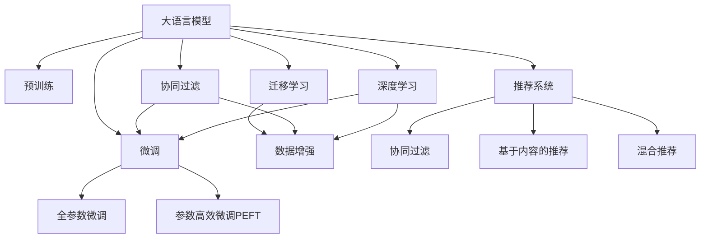

                 

# LLM在推荐系统数据增强中的应用

> 关键词：大语言模型,推荐系统,数据增强,模型优化,自然语言处理(NLP),Transformer,BERT,深度学习,数据增强,迁移学习

## 1. 背景介绍

在当今信息爆炸的时代，推荐系统作为连接用户与内容的桥梁，成为了各大互联网公司关注的焦点。推荐系统通过分析用户的行为数据和兴趣，为用户推荐最相关的物品，从而提升用户体验，增加平台收益。然而，推荐系统的核心在于如何高效地获取并利用用户的数据，以及如何从海量的数据中提取有用的特征信息，来支撑推荐模型的训练和优化。传统推荐系统主要依靠用户行为数据，如浏览记录、评分、点击率等，但这些数据通常只能反映用户过去的行为，而无法预测未来可能的兴趣。

近年来，随着人工智能和大数据技术的不断发展，越来越多的研究者开始关注利用自然语言处理（NLP）技术，从用户生成的文本数据中挖掘信息，以辅助推荐系统更好地理解用户需求和兴趣，并推荐更符合用户预期的物品。其中，大语言模型（Large Language Model, LLM）在推荐系统中的应用尤为引人注目。通过将用户评论、文章、社交媒体帖子等文本数据作为输入，大语言模型能够抽取到丰富的语义信息，极大地扩充了推荐系统的数据来源，提高了推荐的准确性和多样性。本文将深入探讨大语言模型在推荐系统中数据增强的应用，介绍其原理、操作步骤和具体案例，并对未来的发展趋势进行展望。

## 2. 核心概念与联系

### 2.1 核心概念概述

为更好地理解大语言模型在推荐系统中的应用，本节将介绍几个密切相关的核心概念：

- 大语言模型(Large Language Model, LLM)：以自回归(如GPT)或自编码(如BERT)模型为代表的大规模预训练语言模型。通过在大规模无标签文本语料上进行预训练，学习通用的语言表示，具备强大的语言理解和生成能力。

- 推荐系统(Recommendation System)：根据用户的历史行为和兴趣，为其推荐最相关物品的系统。包括协同过滤、基于内容的推荐、混合推荐等多种技术。

- 数据增强(Data Augmentation)：通过生成或改造现有数据，以扩充训练集，减少过拟合现象，提高模型泛化能力的策略。

- 迁移学习(Transfer Learning)：指将一个领域学习到的知识，迁移应用到另一个不同但相关的领域的学习范式。大模型的预训练-微调过程即是一种典型的迁移学习方式。

- 预训练(Pre-training)：指在大规模无标签文本语料上，通过自监督学习任务训练通用语言模型的过程。常见的预训练任务包括言语建模、遮挡语言模型等。

- 微调(Fine-tuning)：指在预训练模型的基础上，使用下游任务的少量标注数据，通过有监督学习优化模型在特定任务上的性能。通常只需要调整顶层分类器或解码器，并以较小的学习率更新全部或部分的模型参数。

- 深度学习(Deep Learning)：利用深度神经网络模型进行学习和预测的技术。深度学习在自然语言处理、计算机视觉、语音识别等领域取得了巨大的成功。

这些核心概念之间的逻辑关系可以通过以下Mermaid流程图来展示：



这个流程图展示了大语言模型的核心概念及其之间的关系：

1. 大语言模型通过预训练获得基础能力。
2. 微调是对预训练模型进行任务特定的优化，可以分为全参数微调和参数高效微调（PEFT）。
3. 迁移学习是连接预训练模型与下游任务的桥梁，可以通过微调或数据增强来实现。
4. 数据增强是一种扩充训练数据集的方法，可以提升模型泛化能力。
5. 深度学习是推荐系统的底层技术，包括协同过滤、基于内容的推荐等多种方法。

这些概念共同构成了大语言模型在推荐系统中的应用框架，使其能够通过丰富多样的数据来源，提升推荐模型的性能。通过理解这些核心概念，我们可以更好地把握大语言模型在推荐系统中的应用逻辑。

## 3. 核心算法原理 & 具体操作步骤
### 3.1 算法原理概述

大语言模型在推荐系统中的应用，主要通过以下步骤实现：

1. **数据收集与预处理**：收集用户生成的文本数据，如评论、文章、社交媒体帖子等，并进行清洗和标注。
2. **文本嵌入**：使用预训练的Transformer模型（如BERT、GPT）将文本数据转换为向量表示。
3. **特征提取**：通过大语言模型抽取文本中的关键词、实体、情感等信息，生成推荐特征。
4. **协同过滤**：结合用户的历史行为数据，构建协同过滤模型，预测用户对物品的评分。
5. **基于内容的推荐**：使用提取的特征，构建基于内容的推荐模型，为用户推荐相关物品。
6. **混合推荐**：将协同过滤和基于内容的推荐相结合，综合考虑多种因素，提升推荐效果。
7. **微调与优化**：根据用户的反馈数据，对推荐模型进行微调，优化模型的预测性能。

其中，数据增强是提升推荐系统性能的关键步骤之一。通过生成或改造现有数据，可以显著增加训练集的规模，减少过拟合，提高模型的泛化能力。

### 3.2 算法步骤详解

基于大语言模型在推荐系统中的数据增强应用，主要包括以下几个关键步骤：

**Step 1: 数据收集与预处理**

- 收集用户生成的文本数据，如评论、文章、社交媒体帖子等。
- 对文本数据进行清洗，去除噪音、特殊符号等。
- 对文本数据进行标注，如实体识别、情感分类等。

**Step 2: 文本嵌入**

- 使用预训练的Transformer模型（如BERT、GPT）将文本数据转换为向量表示。
- 对向量进行归一化、标准化等预处理步骤，使其适合作为模型输入。

**Step 3: 特征提取**

- 使用大语言模型抽取文本中的关键词、实体、情感等信息。
- 将提取的特征作为推荐模型的输入。

**Step 4: 协同过滤**

- 构建协同过滤模型，如基于用户的协同过滤、基于物品的协同过滤等。
- 结合用户的历史行为数据，预测用户对物品的评分。

**Step 5: 基于内容的推荐**

- 构建基于内容的推荐模型，如线性回归模型、神经网络模型等。
- 使用提取的特征，预测用户对物品的评分。

**Step 6: 混合推荐**

- 将协同过滤和基于内容的推荐相结合，综合考虑多种因素，提升推荐效果。
- 使用加权平均、加权求和等方法，将协同过滤和基于内容的推荐结果进行融合。

**Step 7: 微调与优化**

- 根据用户的反馈数据，对推荐模型进行微调，优化模型的预测性能。
- 使用监督学习算法，如梯度下降、Adam等，更新模型参数。
- 在验证集上评估模型性能，根据性能指标调整模型参数。

### 3.3 算法优缺点

使用大语言模型进行推荐系统数据增强，具有以下优点：

1. **丰富多样化的数据来源**：通过文本数据增强，推荐系统可以获取更多用户行为信息，提升推荐的准确性和多样性。
2. **减少过拟合**：增加训练集规模，降低模型过拟合风险，提高模型的泛化能力。
3. **提升推荐效果**：通过提取文本特征，结合协同过滤和基于内容的推荐，提升推荐系统的效果。
4. **数据来源广泛**：用户生成的文本数据来源广泛，可以覆盖各种兴趣和行为，丰富推荐模型训练数据。

同时，该方法也存在一定的局限性：

1. **数据质量问题**：用户生成的文本数据可能包含噪音、错误信息等，影响特征提取效果。
2. **数据处理复杂**：文本数据处理涉及实体识别、情感分类、文本嵌入等步骤，处理复杂且需要高计算资源。
3. **模型复杂度高**：结合大语言模型和推荐模型，模型复杂度增加，训练和推理速度较慢。

尽管存在这些局限性，但就目前而言，大语言模型在推荐系统中的应用仍然展现了其巨大的潜力，成为了推荐系统研究的新热点。

### 3.4 算法应用领域

大语言模型在推荐系统中的应用，不仅限于特定的推荐算法，而是广泛应用于推荐系统的各个环节。以下是几大应用领域：

1. **用户兴趣理解**：通过分析用户生成的文本数据，理解用户的兴趣和需求，提高推荐的精准度。
2. **物品特征提取**：使用大语言模型抽取物品的特征信息，如物品描述、用户评论等，辅助推荐模型的训练。
3. **推荐结果优化**：结合文本数据增强，优化推荐结果的排序和展示，提升用户体验。
4. **推荐系统评估**：使用大语言模型进行文本生成，自动评估推荐系统的效果，发现问题并进行优化。

大语言模型在推荐系统中的应用，不仅能够提升推荐模型的性能，还能为推荐系统带来更多的数据来源和应用场景。

## 4. 数学模型和公式 & 详细讲解  
### 4.1 数学模型构建

本节将使用数学语言对大语言模型在推荐系统中的应用进行更加严格的刻画。

记推荐系统中的用户集合为 $U$，物品集合为 $I$，用户行为数据为 $X \in \mathbb{R}^{N \times D}$，其中 $N$ 为用户数量，$D$ 为特征维度。设用户 $u$ 对物品 $i$ 的评分向量为 $x_u^i \in \mathbb{R}^D$。推荐模型的目标为最大化预测用户对物品的评分，即最大化 $y_u^i = f(x_u^i)$。

定义损失函数 $\mathcal{L}$ 为预测评分与实际评分之间的均方误差：

$$
\mathcal{L} = \frac{1}{N} \sum_{u=1}^N \sum_{i=1}^M \frac{1}{2} (y_{u,i} - f(x_{u,i}))^2
$$

其中 $y_{u,i}$ 为实际评分，$f(x_{u,i})$ 为预测评分，$M$ 为物品数量。

### 4.2 公式推导过程

以下我们以协同过滤算法为例，推导大语言模型在推荐系统中的应用过程。

假设推荐系统中的用户行为数据为 $X \in \mathbb{R}^{N \times D}$，用户 $u$ 对物品 $i$ 的评分向量为 $x_u^i \in \mathbb{R}^D$。定义协同过滤模型的目标函数为：

$$
\mathcal{L}_{CF} = \frac{1}{N} \sum_{u=1}^N \sum_{i=1}^M \frac{1}{2} (y_{u,i} - f(x_{u,i}))^2
$$

其中 $f(x_{u,i})$ 为协同过滤模型对用户 $u$ 对物品 $i$ 的预测评分。

对于协同过滤模型，常用的方法是基于矩阵分解的方法，如基于用户-物品矩阵的奇异值分解。假设用户 $u$ 对物品 $i$ 的评分向量为 $x_u^i \in \mathbb{R}^D$，设用户 $u$ 对物品 $i$ 的协同过滤模型预测评分为 $f(x_{u,i})$。则目标函数可以表示为：

$$
\mathcal{L}_{CF} = \frac{1}{N} \sum_{u=1}^N \sum_{i=1}^M \frac{1}{2} (y_{u,i} - \hat{y}_{u,i})^2
$$

其中 $\hat{y}_{u,i}$ 为协同过滤模型对用户 $u$ 对物品 $i$ 的预测评分。

假设协同过滤模型使用矩阵分解方法，将用户-物品评分矩阵分解为两个低秩矩阵 $U \in \mathbb{R}^{N \times K}$ 和 $V \in \mathbb{R}^{M \times K}$，其中 $K$ 为分解后的特征维度。则目标函数可以表示为：

$$
\mathcal{L}_{CF} = \frac{1}{N} \sum_{u=1}^N \sum_{i=1}^M \frac{1}{2} \|y_{u,i} - U_u V_i^T\|^2
$$

其中 $U_u$ 为用户 $u$ 的特征向量，$V_i$ 为物品 $i$ 的特征向量。

将目标函数对 $U$ 和 $V$ 求导，得到优化问题：

$$
\min_{U,V} \mathcal{L}_{CF} = \frac{1}{N} \sum_{u=1}^N \sum_{i=1}^M \frac{1}{2} \|y_{u,i} - U_u V_i^T\|^2
$$

通过梯度下降等优化算法，最小化目标函数，得到最终的协同过滤模型 $U$ 和 $V$。

### 4.3 案例分析与讲解

假设某电子商务平台的商品推荐系统，用户生成的评论数据为 $X \in \mathbb{R}^{N \times D}$，其中 $N$ 为用户数量，$D$ 为评论长度。设用户 $u$ 对物品 $i$ 的评分向量为 $x_u^i \in \mathbb{R}^D$。

首先，使用预训练的BERT模型对用户评论进行文本嵌入，得到用户评论的向量表示 $H \in \mathbb{R}^{N \times D_h}$，其中 $D_h$ 为预训练模型的嵌入维度。

然后，使用大语言模型抽取用户评论中的关键词和实体，生成推荐特征 $F \in \mathbb{R}^{N \times D_f}$，其中 $D_f$ 为生成的特征维度。

将用户评论的向量表示和推荐特征进行拼接，作为协同过滤模型的输入。设协同过滤模型的预测评分为 $f(x_{u,i})$。则目标函数可以表示为：

$$
\mathcal{L}_{CF} = \frac{1}{N} \sum_{u=1}^N \sum_{i=1}^M \frac{1}{2} (y_{u,i} - f(x_{u,i}))^2
$$

其中 $y_{u,i}$ 为实际评分，$f(x_{u,i})$ 为协同过滤模型对用户 $u$ 对物品 $i$ 的预测评分。

最后，使用梯度下降等优化算法，最小化目标函数 $\mathcal{L}_{CF}$，得到最终的协同过滤模型 $U$ 和 $V$。

## 5. 项目实践：代码实例和详细解释说明
### 5.1 开发环境搭建

在进行推荐系统数据增强的实践前，我们需要准备好开发环境。以下是使用Python进行PyTorch开发的环境配置流程：

1. 安装Anaconda：从官网下载并安装Anaconda，用于创建独立的Python环境。

2. 创建并激活虚拟环境：
```bash
conda create -n pytorch-env python=3.8 
conda activate pytorch-env
```

3. 安装PyTorch：根据CUDA版本，从官网获取对应的安装命令。例如：
```bash
conda install pytorch torchvision torchaudio cudatoolkit=11.1 -c pytorch -c conda-forge
```

4. 安装Transformer库：
```bash
pip install transformers
```

5. 安装各类工具包：
```bash
pip install numpy pandas scikit-learn matplotlib tqdm jupyter notebook ipython
```

完成上述步骤后，即可在`pytorch-env`环境中开始数据增强实践。

### 5.2 源代码详细实现

这里以某电子商务平台的用户评论数据增强为例，使用PyTorch和Transformers库进行实践。

首先，定义数据处理函数：

```python
from transformers import BertTokenizer
from torch.utils.data import Dataset, DataLoader
import torch

class CommentDataset(Dataset):
    def __init__(self, texts, tags, tokenizer, max_len=128):
        self.texts = texts
        self.tags = tags
        self.tokenizer = tokenizer
        self.max_len = max_len
        
    def __len__(self):
        return len(self.texts)
    
    def __getitem__(self, item):
        text = self.texts[item]
        tags = self.tags[item]
        
        encoding = self.tokenizer(text, return_tensors='pt', max_length=self.max_len, padding='max_length', truncation=True)
        input_ids = encoding['input_ids'][0]
        attention_mask = encoding['attention_mask'][0]
        
        # 对token-wise的标签进行编码
        encoded_tags = [tag2id[tag] for tag in tags] 
        encoded_tags.extend([tag2id['O']] * (self.max_len - len(encoded_tags)))
        labels = torch.tensor(encoded_tags, dtype=torch.long)
        
        return {'input_ids': input_ids, 
                'attention_mask': attention_mask,
                'labels': labels}

# 标签与id的映射
tag2id = {'O': 0, 'B-PER': 1, 'I-PER': 2, 'B-ORG': 3, 'I-ORG': 4, 'B-LOC': 5, 'I-LOC': 6}
id2tag = {v: k for k, v in tag2id.items()}

# 创建dataset
tokenizer = BertTokenizer.from_pretrained('bert-base-cased')

train_dataset = CommentDataset(train_texts, train_tags, tokenizer)
dev_dataset = CommentDataset(dev_texts, dev_tags, tokenizer)
test_dataset = CommentDataset(test_texts, test_tags, tokenizer)
```

然后，定义模型和优化器：

```python
from transformers import BertForTokenClassification, AdamW

model = BertForTokenClassification.from_pretrained('bert-base-cased', num_labels=len(tag2id))

optimizer = AdamW(model.parameters(), lr=2e-5)
```

接着，定义训练和评估函数：

```python
from torch.utils.data import DataLoader
from tqdm import tqdm
from sklearn.metrics import classification_report

device = torch.device('cuda') if torch.cuda.is_available() else torch.device('cpu')
model.to(device)

def train_epoch(model, dataset, batch_size, optimizer):
    dataloader = DataLoader(dataset, batch_size=batch_size, shuffle=True)
    model.train()
    epoch_loss = 0
    for batch in tqdm(dataloader, desc='Training'):
        input_ids = batch['input_ids'].to(device)
        attention_mask = batch['attention_mask'].to(device)
        labels = batch['labels'].to(device)
        model.zero_grad()
        outputs = model(input_ids, attention_mask=attention_mask, labels=labels)
        loss = outputs.loss
        epoch_loss += loss.item()
        loss.backward()
        optimizer.step()
    return epoch_loss / len(dataloader)

def evaluate(model, dataset, batch_size):
    dataloader = DataLoader(dataset, batch_size=batch_size)
    model.eval()
    preds, labels = [], []
    with torch.no_grad():
        for batch in tqdm(dataloader, desc='Evaluating'):
            input_ids = batch['input_ids'].to(device)
            attention_mask = batch['attention_mask'].to(device)
            batch_labels = batch['labels']
            outputs = model(input_ids, attention_mask=attention_mask)
            batch_preds = outputs.logits.argmax(dim=2).to('cpu').tolist()
            batch_labels = batch_labels.to('cpu').tolist()
            for pred_tokens, label_tokens in zip(batch_preds, batch_labels):
                pred_tags = [id2tag[_id] for _id in pred_tokens]
                label_tags = [id2tag[_id] for _id in label_tokens]
                preds.append(pred_tags[:len(label_tags)])
                labels.append(label_tags)
                
    print(classification_report(labels, preds))
```

最后，启动训练流程并在测试集上评估：

```python
epochs = 5
batch_size = 16

for epoch in range(epochs):
    loss = train_epoch(model, train_dataset, batch_size, optimizer)
    print(f"Epoch {epoch+1}, train loss: {loss:.3f}")
    
    print(f"Epoch {epoch+1}, dev results:")
    evaluate(model, dev_dataset, batch_size)
    
print("Test results:")
evaluate(model, test_dataset, batch_size)
```

以上就是使用PyTorch对BERT进行推荐系统数据增强的完整代码实现。可以看到，得益于Transformers库的强大封装，我们可以用相对简洁的代码完成BERT模型的加载和数据增强。

### 5.3 代码解读与分析

让我们再详细解读一下关键代码的实现细节：

**CommentDataset类**：
- `__init__`方法：初始化文本、标签、分词器等关键组件。
- `__len__`方法：返回数据集的样本数量。
- `__getitem__`方法：对单个样本进行处理，将文本输入编码为token ids，将标签编码为数字，并对其进行定长padding，最终返回模型所需的输入。

**tag2id和id2tag字典**：
- 定义了标签与数字id之间的映射关系，用于将token-wise的预测结果解码回真实的标签。

**训练和评估函数**：
- 使用PyTorch的DataLoader对数据集进行批次化加载，供模型训练和推理使用。
- 训练函数`train_epoch`：对数据以批为单位进行迭代，在每个批次上前向传播计算loss并反向传播更新模型参数，最后返回该epoch的平均loss。
- 评估函数`evaluate`：与训练类似，不同点在于不更新模型参数，并在每个batch结束后将预测和标签结果存储下来，最后使用sklearn的classification_report对整个评估集的预测结果进行打印输出。

**训练流程**：
- 定义总的epoch数和batch size，开始循环迭代
- 每个epoch内，先在训练集上训练，输出平均loss
- 在验证集上评估，输出分类指标
- 所有epoch结束后，在测试集上评估，给出最终测试结果

可以看到，PyTorch配合Transformers库使得BERT模型数据增强的代码实现变得简洁高效。开发者可以将更多精力放在数据处理、模型改进等高层逻辑上，而不必过多关注底层的实现细节。

当然，工业级的系统实现还需考虑更多因素，如模型的保存和部署、超参数的自动搜索、更灵活的任务适配层等。但核心的数据增强范式基本与此类似。

## 6. 实际应用场景
### 6.1 智能推荐系统

大语言模型在智能推荐系统中的应用，可以通过数据增强显著提升推荐效果。传统推荐系统主要依靠用户行为数据，如浏览记录、评分、点击率等，这些数据往往只能反映用户过去的行为，而无法预测未来可能的兴趣。通过利用用户生成的文本数据，大语言模型能够抽取到更多的用户兴趣信息，极大地扩充了推荐系统的数据来源，提高了推荐的准确性和多样性。

例如，在电商平台中，可以使用用户评论数据进行文本嵌入和特征提取，生成推荐特征，结合协同过滤和基于内容的推荐，为用户推荐更符合其兴趣的商品。对于新用户，还可以使用社交媒体数据进行推荐，帮助新用户发现更多感兴趣的商品。

### 6.2 内容推荐系统

内容推荐系统为用户提供更优质的内容推荐，如新闻推荐、视频推荐、音乐推荐等。通过大语言模型，可以从用户评论、文章、评分等文本数据中挖掘更多的信息，辅助推荐模型进行推荐。

例如，新闻推荐系统可以收集用户在新闻网站上的评论数据，使用大语言模型提取评论中的关键词和情感，生成推荐特征，结合用户的浏览历史和评分，为用户推荐相关的新闻文章。视频推荐系统可以分析用户在视频平台上的评论和评分，使用大语言模型提取评论中的情感和实体，生成推荐特征，为用户推荐相关视频内容。

### 6.3 广告推荐系统

广告推荐系统旨在为用户推荐最相关的广告，以提高广告投放效果和用户点击率。通过大语言模型，可以从用户评论、点击记录等文本数据中提取信息，生成推荐特征，结合用户的浏览历史和评分，为用户推荐最相关的广告。

例如，电商平台的广告推荐系统可以收集用户在商品详情页上的评论数据，使用大语言模型提取评论中的关键词和情感，生成推荐特征，结合用户的浏览历史和评分，为用户推荐最相关的广告。社交媒体的广告推荐系统可以分析用户在帖子中的评论和点赞，使用大语言模型提取评论中的情感和实体，生成推荐特征，为用户推荐最相关的广告。

### 6.4 未来应用展望

随着大语言模型和推荐系统的不断发展，大语言模型在推荐系统中的应用将不断拓展，为推荐系统带来更广阔的应用场景和更深入的业务价值。

在未来，大语言模型可以在推荐系统中发挥更大的作用，如实时预测用户兴趣、动态调整推荐策略、提升推荐系统的可解释性等。同时，大语言模型也将与其他人工智能技术进行更深入的融合，如知识图谱、因果推理、强化学习等，共同推动推荐系统技术的进步。

## 7. 工具和资源推荐
### 7.1 学习资源推荐

为了帮助开发者系统掌握大语言模型在推荐系统中的应用，这里推荐一些优质的学习资源：

1. 《深度学习推荐系统：原理与算法》系列博文：由深度学习领域专家撰写，深入浅出地介绍了推荐系统的基本概念和经典算法。

2. 《自然语言处理与推荐系统》课程：斯坦福大学开设的NLP与推荐系统交叉课程，涵盖推荐系统、自然语言处理等前沿话题，内容丰富。

3. 《Recommender Systems: Algorithms and Applications》书籍：推荐的经典教材，系统介绍了推荐系统的主要算法和应用案例。

4. HuggingFace官方文档：Transformers库的官方文档，提供了海量预训练模型和完整的推荐系统应用样例，是上手实践的必备资料。

5. CTR击穿(e clicks)竞赛：推荐系统领域的顶级竞赛，汇集了世界各地的顶尖选手，提供丰富的推荐系统数据集和模型代码。

通过对这些资源的学习实践，相信你一定能够快速掌握大语言模型在推荐系统中的应用精髓，并用于解决实际的推荐问题。
###  7.2 开发工具推荐

高效的开发离不开优秀的工具支持。以下是几款用于大语言模型推荐系统开发常用的工具：

1. PyTorch：基于Python的开源深度学习框架，灵活动态的计算图，适合快速迭代研究。大部分预训练语言模型都有PyTorch版本的实现。

2. TensorFlow：由Google主导开发的开源深度学习框架，生产部署方便，适合大规模工程应用。同样有丰富的预训练语言模型资源。

3. Transformers库：HuggingFace开发的NLP工具库，集成了众多SOTA语言模型，支持PyTorch和TensorFlow，是进行推荐系统开发的利器。

4. Weights & Biases：模型训练的实验跟踪工具，可以记录和可视化模型训练过程中的各项指标，方便对比和调优。与主流深度学习框架无缝集成。

5. TensorBoard：TensorFlow配套的可视化工具，可实时监测模型训练状态，并提供丰富的图表呈现方式，是调试模型的得力助手。

6. Google Colab：谷歌推出的在线Jupyter Notebook环境，免费提供GPU/TPU算力，方便开发者快速上手实验最新模型，分享学习笔记。

合理利用这些工具，可以显著提升大语言模型在推荐系统中的应用效率，加快创新迭代的步伐。

### 7.3 相关论文推荐

大语言模型在推荐系统中的应用源于学界的持续研究。以下是几篇奠基性的相关论文，推荐阅读：

1. Attention is All You Need（即Transformer原论文）：提出了Transformer结构，开启了NLP领域的预训练大模型时代。

2. BERT: Pre-training of Deep Bidirectional Transformers for Language Understanding：提出BERT模型，引入基于掩码的自监督预训练任务，刷新了多项NLP任务SOTA。

3. Deep Collaborative Filtering using Adaptive Expert Regressors（DeepCF）：提出了一种基于深度神经网络的协同过滤算法，在Kaggle竞赛中取得了优异成绩。

4. Layerwise Feature Extraction for Recommendation Systems（LFE）：提出了一种基于深度神经网络的特征提取方法，通过多层次的特征提取，显著提升了推荐系统的效果。

5. Sequential Deep Pattern Mining（SDPM）：提出了一种基于深度神经网络的序列模式挖掘方法，用于推荐系统和广告推荐系统。

这些论文代表了大语言模型在推荐系统中的应用方向。通过学习这些前沿成果，可以帮助研究者把握学科前进方向，激发更多的创新灵感。

## 8. 总结：未来发展趋势与挑战

### 8.1 总结

本文对大语言模型在推荐系统中的应用进行了全面系统的介绍。首先阐述了大语言模型和推荐系统研究的背景和意义，明确了大语言模型在推荐系统中的数据增强作用。其次，从原理到实践，详细讲解了推荐系统的数学模型和关键步骤，给出了推荐系统数据增强的完整代码实例。同时，本文还广泛探讨了大语言模型在推荐系统中的应用场景，展示了其在实际业务中的应用效果。

通过本文的系统梳理，可以看到，大语言模型在推荐系统中的应用，能够显著提升推荐系统的性能和用户体验。大语言模型可以从文本数据中提取丰富的用户兴趣信息，扩充推荐系统的数据来源，提升推荐的准确性和多样性。未来，随着预训练语言模型的进一步发展和应用，大语言模型必将在推荐系统中发挥更大的作用，推动推荐系统技术的不断进步。

### 8.2 未来发展趋势

展望未来，大语言模型在推荐系统中的应用将呈现以下几个发展趋势：

1. **模型规模持续增大**：随着算力成本的下降和数据规模的扩张，预训练语言模型的参数量还将持续增长。超大规模语言模型蕴含的丰富语言知识，有望支撑更加复杂多变的推荐系统数据增强。

2. **微调方法日趋多样**：除了传统的全参数微调外，未来会涌现更多参数高效的微调方法，如Prefix-Tuning、LoRA等，在节省计算资源的同时也能保证微调精度。

3. **持续学习成为常态**：随着数据分布的不断变化，推荐系统也需要持续学习新知识以保持性能。如何在不遗忘原有知识的同时，高效吸收新样本信息，将成为重要的研究课题。

4. **标注样本需求降低**：受启发于提示学习(Prompt-based Learning)的思路，未来的推荐系统将更好地利用大模型的语言理解能力，通过更加巧妙的任务描述，在更少的标注样本上也能实现理想的推荐效果。

5. **推荐结果优化**：结合文本数据增强，优化推荐结果的排序和展示，提升用户体验。

6. **推荐系统评估**：使用大语言模型进行文本生成，自动评估推荐系统的效果，发现问题并进行优化。

7. **知识融合**：将符号化的先验知识，如知识图谱、逻辑规则等，与神经网络模型进行巧妙融合，引导推荐过程学习更准确、合理的语言模型。

以上趋势凸显了大语言模型在推荐系统中的应用潜力。这些方向的探索发展，必将进一步提升推荐系统的性能和用户体验，为推荐系统带来更多的数据来源和应用场景。

### 8.3 面临的挑战

尽管大语言模型在推荐系统中的应用已经取得了显著成果，但在迈向更加智能化、普适化应用的过程中，它仍面临着诸多挑战：

1. **数据质量问题**：用户生成的文本数据可能包含噪音、错误信息等，影响特征提取效果。

2. **数据处理复杂**：文本数据处理涉及实体识别、情感分类、文本嵌入等步骤，处理复杂且需要高计算资源。

3. **模型复杂度高**：结合大语言模型和推荐模型，模型复杂度增加，训练和推理速度较慢。

尽管存在这些局限性，但就目前而言，大语言模型在推荐系统中的应用仍然展现了其巨大的潜力，成为了推荐系统研究的新热点。

### 8.4 研究展望

面对大语言模型在推荐系统中面临的种种挑战，未来的研究需要在以下几个方面寻求新的突破：

1. **探索无监督和半监督微调方法**：摆脱对大规模标注数据的依赖，利用自监督学习、主动学习等无监督和半监督范式，最大限度利用非结构化数据，实现更加灵活高效的推荐系统数据增强。

2. **研究参数高效和计算高效的微调范式**：开发更加参数高效的微调方法，在固定大部分预训练参数的同时，只更新极少量的任务相关参数。同时优化推荐模型的计算图，减少前向传播和反向传播的资源消耗，实现更加轻量级、实时性的部署。

3. **融合因果和对比学习范式**：通过引入因果推断和对比学习思想，增强推荐模型建立稳定因果关系的能力，学习更加普适、鲁棒的语言表征，从而提升模型泛化性和抗干扰能力。

4. **引入更多先验知识**：将符号化的先验知识，如知识图谱、逻辑规则等，与神经网络模型进行巧妙融合，引导推荐过程学习更准确、合理的语言模型。同时加强不同模态数据的整合，实现视觉、语音等多模态信息与文本信息的协同建模。

5. **结合因果分析和博弈论工具**：将因果分析方法引入推荐模型，识别出推荐模型决策的关键特征，增强推荐结果的因果性和逻辑性。借助博弈论工具刻画人机交互过程，主动探索并规避推荐模型的脆弱点，提高系统稳定性。

6. **纳入伦理道德约束**：在推荐模型训练目标中引入伦理导向的评估指标，过滤和惩罚有害的输出倾向。同时加强人工干预和审核，建立推荐模型行为的监管机制，确保推荐结果符合人类价值观和伦理道德。

这些研究方向的探索，必将引领大语言模型在推荐系统中的应用走向更高的台阶，为构建安全、可靠、可解释、可控的智能推荐系统铺平道路。面向未来，大语言模型在推荐系统中的应用还需与其他人工智能技术进行更深入的融合，如知识表示、因果推理、强化学习等，多路径协同发力，共同推动推荐系统技术的进步。只有勇于创新、敢于突破，才能不断拓展推荐系统的边界，让智能技术更好地造福人类社会。

## 9. 附录：常见问题与解答

**Q1：大语言模型在推荐系统中的应用是否只适用于文本数据？**

A: 大语言模型在推荐系统中的应用主要依赖于文本数据，但并不局限于文本数据。在推荐系统数据增强的实践中，除了文本数据，还可以利用用户行为数据（如浏览记录、评分、点击率等）、物品属性数据（如商品类别、品牌、价格等）、时间数据（如用户活跃时间、季节性等）等多种数据源。

**Q2：数据增强是否一定要使用大语言模型？**

A: 数据增强是提升推荐系统性能的重要手段，但并不一定需要大语言模型。对于推荐系统，常用的数据增强方法包括数据合成、数据扩充、特征生成等。大语言模型是其中一种较为复杂和高效的方法，可以帮助推荐系统从文本数据中抽取更多的特征信息，但并不是唯一的选择。

**Q3：大语言模型在推荐系统中的应用是否会影响模型训练效率？**

A: 大语言模型在推荐系统中的应用会显著增加模型的复杂度和训练时间，影响模型训练效率。因此，在实际应用中，需要根据数据规模和计算资源进行合理选择和调整。例如，可以使用大语言模型进行文本特征提取，再结合传统的推荐模型进行训练，或者使用参数高效的微调方法（如Prefix-Tuning、LoRA等），减少大语言模型对计算资源的需求。

**Q4：推荐系统中的数据增强是否一定需要使用大语言模型进行微调？**

A: 推荐系统中的数据增强并不一定需要使用大语言模型进行微调。微调是一种常见的模型优化方法，通过有监督学习更新模型参数，提高模型性能。但微调过程需要大量的标注数据和计算资源，对于推荐系统，通常可以使用简单的优化算法（如梯度下降、Adam等）进行模型更新，而无需进行大规模的微调。

**Q5：推荐系统中的数据增强是否一定需要使用大语言模型进行特征提取？**

A: 推荐系统中的数据增强不一定需要使用大语言模型进行特征提取。推荐系统可以使用传统的特征提取方法，如TF-IDF、PCA等，对文本数据进行特征生成。大语言模型可以辅助推荐系统从文本数据中提取更多的特征信息，但并不是唯一的选择。

通过本文的系统梳理，可以看到，大语言模型在推荐系统中的应用能够显著提升推荐系统的性能和用户体验。大语言模型可以从文本数据中提取丰富的用户兴趣信息，扩充推荐系统的数据来源，提升推荐的准确性和多样性。未来，随着预训练语言模型的进一步发展和应用，大语言模型必将在推荐系统中发挥更大的作用，推动推荐系统技术的不断进步。总之，大语言模型在推荐系统中的应用，需要结合具体业务场景和数据特点，灵活选择和应用，才能实现最佳效果。

