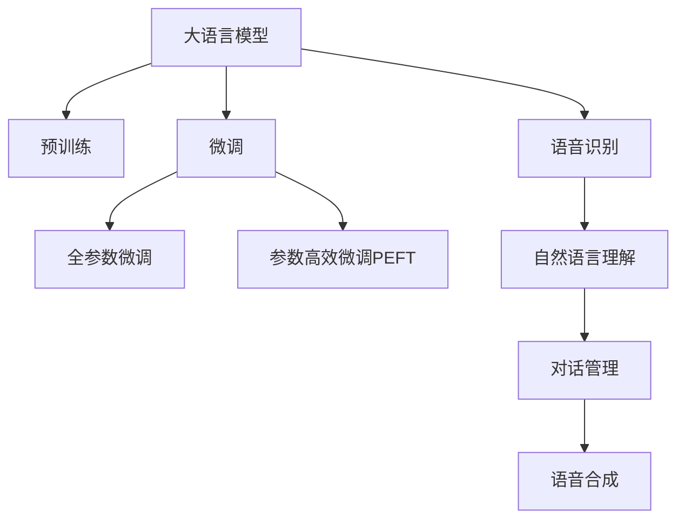

                 

# LLM在智能语音交互中的角色定位

## 1. 背景介绍

### 1.1 问题由来
随着人工智能技术的不断进步，自然语言处理(Natural Language Processing, NLP)领域正迎来一场革命性的变革。语音交互作为人机交互的重要方式之一，已经成为智慧城市、智能家居、车载娱乐等众多领域的重要应用方向。然而，传统的基于规则或模板的语音交互系统，往往难以应对复杂多变的用户需求，交互体验不够流畅自然。因此，如何构建更加智能、自然的语音交互系统，成为了当前NLP研究的重要课题。

### 1.2 问题核心关键点
当前，大语言模型(Large Language Models, LLMs)，如BERT、GPT等，在NLP领域取得了突破性进展。这些模型通过在海量无标签文本数据上进行预训练，学习到丰富的语言知识和常识，能够处理复杂的自然语言理解任务。而在语音交互领域，大语言模型同样具有广泛的应用前景。通过将大语言模型应用于语音交互系统，可以实现更加智能、自然的语音对话，提升用户体验。

大语言模型在智能语音交互中的应用，可以通过以下几种方式实现：

1. **语音识别与转录**：利用大语言模型对语音进行识别和转录，生成文本。
2. **自然语言理解**：在获得用户文本输入后，通过大语言模型理解用户意图和语境。
3. **对话管理**：根据用户的意图和上下文，大语言模型可以生成合适的回应。
4. **语音合成**：将大语言模型生成的文本进行语音合成，生成自然流畅的语音输出。

这些应用能够极大地提升语音交互系统的智能化水平，使得机器能够更加自然、高效地与用户进行对话。

## 2. 核心概念与联系

### 2.1 核心概念概述

为了更好地理解大语言模型在智能语音交互中的角色定位，本节将介绍几个密切相关的核心概念：

- **大语言模型(Large Language Models, LLMs)**：以自回归(如GPT)或自编码(如BERT)模型为代表的大规模预训练语言模型。通过在海量无标签文本语料上进行预训练，学习到语言的通用表示。
- **预训练(Pre-training)**：指在大规模无标签文本语料上，通过自监督学习任务训练通用语言模型的过程。常见的预训练任务包括言语建模、遮挡语言模型等。
- **微调(Fine-tuning)**：指在预训练模型的基础上，使用下游任务的少量标注数据，通过有监督学习优化模型在特定任务上的性能。通常只需要调整顶层分类器或解码器，并以较小的学习率更新全部或部分的模型参数。
- **迁移学习(Transfer Learning)**：指将一个领域学习到的知识，迁移应用到另一个不同但相关的领域的学习范式。大模型的预训练-微调过程即是一种典型的迁移学习方式。
- **语音识别(ASR, Automatic Speech Recognition)**：将语音信号转换为文本的过程。常见的语音识别模型包括隐马尔可夫模型(HMM)、深度神经网络(DNN)、卷积神经网络(CNN)、循环神经网络(RNN)、Transformer等。
- **自然语言理解(NLU, Natural Language Understanding)**：理解文本的语义信息，提取实体、关系等关键信息。常见的方法包括传统的语法分析、词性标注、命名实体识别、依存句法分析等，以及基于深度学习的BERT、GPT等模型。
- **对话管理(DM, Dialogue Management)**：管理对话流程，控制对话方向，确保对话上下文连贯。常见的对话管理方法包括规则驱动、统计学习、基于图模型等。
- **语音合成(TTS, Text-to-Speech)**：将文本转换为语音的过程。常见的语音合成方法包括传统的多音字合成、基于文本到音频的深度学习模型如Tacotron、WaveNet等。

这些核心概念之间的逻辑关系可以通过以下Mermaid流程图来展示：



这个流程图展示了大语言模型的核心概念及其之间的关系：

1. 大语言模型通过预训练获得基础能力。
2. 微调是对预训练模型进行任务特定的优化，可以分为全参数微调和参数高效微调（PEFT）。
3. 语音识别、自然语言理解、对话管理和语音合成等模块，依赖于大语言模型的输出，实现自然流畅的语音交互。

这些概念共同构成了智能语音交互系统的核心技术框架，使得机器能够理解、处理并生成自然语言，实现智能对话。

## 3. 核心算法原理 & 具体操作步骤

### 3.1 算法原理概述

大语言模型在智能语音交互中的应用，本质上是利用大语言模型的自然语言理解和生成能力，将语音信号转换为文本，再将文本转化为语音，从而实现智能对话。具体过程包括语音识别、自然语言理解、对话管理和语音合成四个主要环节。

1. **语音识别**：将用户的语音信号转换为文本，通常使用端到端的深度学习模型，如BERT、RNN等。
2. **自然语言理解**：通过大语言模型理解用户的意图和上下文，提取关键信息。
3. **对话管理**：根据用户的意图和上下文，生成合适的回应。
4. **语音合成**：将大语言模型生成的文本进行语音合成，生成自然流畅的语音输出。

### 3.2 算法步骤详解

以语音交互为例，下面详细介绍大语言模型在智能语音交互中的具体操作步骤：

**Step 1: 准备语音交互系统**
- 选择合适的预训练语言模型 $M_{\theta}$ 作为初始化参数，如 BERT、GPT等。
- 选择或搭建语音识别模块、自然语言理解模块、对话管理模块和语音合成模块。

**Step 2: 数据准备**
- 收集或合成足够的语音样本，标注好用户的意图和上下文。
- 将语音样本转换为文本形式，作为模型的训练数据。

**Step 3: 微调模型**
- 使用下游任务的少量标注数据，对预训练模型进行微调，使其适应特定任务。
- 根据实际应用场景，选择合适的任务适配层，如分类器、解码器等。
- 设置微调超参数，包括学习率、批大小、迭代轮数等。

**Step 4: 集成组件**
- 将微调后的语言模型与语音识别、自然语言理解、对话管理和语音合成模块集成，搭建完整的语音交互系统。
- 设计合适的用户界面，实现与用户的自然交互。

**Step 5: 系统部署与测试**
- 在测试环境中对系统进行测试，评估各个模块的性能。
- 收集用户反馈，不断优化系统功能。

### 3.3 算法优缺点

大语言模型在智能语音交互中的应用，具有以下优点：

1. **语言理解能力强**：大语言模型具备强大的自然语言理解和生成能力，能够处理复杂的文本输入和输出。
2. **灵活性高**：可以根据实际需求，通过微调改变模型的行为，适应各种应用场景。
3. **适用性广**：不仅可以应用于简单的问答系统，还可以应用于复杂的对话管理。
4. **可扩展性好**：大语言模型可以与多种模块集成，实现多样化功能的语音交互系统。

同时，该方法也存在一定的局限性：

1. **对数据依赖性强**：语音交互系统需要大量的标注数据进行微调，数据获取成本较高。
2. **计算资源需求大**：预训练和微调大语言模型需要大量计算资源，对硬件要求较高。
3. **复杂度较高**：系统集成了多个模块，需要较高的工程实现和调优能力。
4. **鲁棒性有待提升**：在特定领域或特定用户群体上，模型可能存在一定的偏见或错误。

尽管存在这些局限性，但就目前而言，大语言模型在智能语音交互中的应用范式，仍然是推动语音交互系统智能化发展的重要方向。

### 3.4 算法应用领域

大语言模型在智能语音交互中的应用，已经广泛应用于多个领域，例如：

1. **智能客服**：通过语音交互实现24小时客户服务，快速响应客户咨询，提供个性化服务。
2. **车载语音助手**：在车内环境中，通过语音交互实现导航、音乐播放、车辆控制等功能。
3. **智能家居**：通过语音交互实现家居设备控制、场景智能设置、智能推荐等功能。
4. **智能音箱**：通过语音交互实现音乐播放、新闻播报、智能搜索等功能。
5. **医疗健康**：通过语音交互实现健康咨询、健康管理、智能问诊等功能。

除了上述这些应用领域外，大语言模型在智能语音交互中的应用还在不断拓展，为各行各业带来了新的变革和机遇。

## 4. 数学模型和公式 & 详细讲解

### 4.1 数学模型构建

本节将使用数学语言对大语言模型在智能语音交互中的应用进行更加严格的刻画。

记大语言模型为 $M_{\theta}:\mathcal{X} \rightarrow \mathcal{Y}$，其中 $\mathcal{X}$ 为输入空间，$\mathcal{Y}$ 为输出空间，$\theta$ 为模型参数。假设语音交互任务的输入为 $x_i$，输出为 $y_i$。则语音交互任务的经验风险定义为：

$$
\mathcal{L}(\theta) = \frac{1}{N} \sum_{i=1}^N \ell(M_{\theta}(x_i),y_i)
$$

其中 $\ell$ 为损失函数，通常为交叉熵损失函数或均方误差损失函数。

在语音识别任务中，$x_i$ 为语音信号，$y_i$ 为对应的文本转录。在自然语言理解任务中，$x_i$ 为文本输入，$y_i$ 为用户意图和上下文。在对话管理任务中，$x_i$ 为历史对话记录，$y_i$ 为当前对话回合的回应。在语音合成任务中，$x_i$ 为文本输入，$y_i$ 为对应的语音输出。

### 4.2 公式推导过程

以语音识别为例，下面详细推导语音识别任务中的数学模型和公式。

假设语音信号 $x_i$ 通过语音识别模型转换为文本 $y_i$，则损失函数定义为：

$$
\ell(x_i, y_i) = -\log P_{\theta}(y_i|x_i)
$$

其中 $P_{\theta}(y_i|x_i)$ 为模型在给定输入 $x_i$ 下的输出概率。通过最大化似然函数 $\mathcal{L}_{L}$，得到优化目标：

$$
\mathcal{L}_{L} = -\frac{1}{N} \sum_{i=1}^N \log P_{\theta}(y_i|x_i)
$$

在模型训练过程中，通常使用梯度下降算法更新模型参数 $\theta$：

$$
\theta \leftarrow \theta - \eta \nabla_{\theta}\mathcal{L}_{L}
$$

其中 $\eta$ 为学习率，$\nabla_{\theta}\mathcal{L}_{L}$ 为损失函数对参数 $\theta$ 的梯度。

在实际应用中，通常使用端到端的深度学习模型进行语音识别，如RNN、CNN、Transformer等。这些模型通过多层网络结构，学习到复杂的语音特征，实现从语音信号到文本的转换。

### 4.3 案例分析与讲解

以BERT模型在智能语音交互中的应用为例，详细讲解其数学模型和公式的推导过程。

BERT模型通过在大规模无标签文本语料上进行预训练，学习到通用的语言表示。在语音识别任务中，可以将语音信号通过端到端的深度学习模型转换为文本形式，然后使用BERT模型进行自然语言理解。假设输入为语音信号 $x_i$，经过语音识别模型转换为文本 $y_i$，然后使用BERT模型进行意图分类和上下文理解。

假设语音识别模型输出的文本为 $y_i$，经过BERT模型处理后，输出概率分布为 $P_{\theta}(y_i|x_i)$，则损失函数定义为：

$$
\ell(y_i, \hat{y}_i) = -\log P_{\theta}(y_i|\hat{y}_i)
$$

其中 $\hat{y}_i$ 为模型预测的意图和上下文。通过最大化似然函数 $\mathcal{L}_{L}$，得到优化目标：

$$
\mathcal{L}_{L} = -\frac{1}{N} \sum_{i=1}^N \log P_{\theta}(y_i|\hat{y}_i)
$$

在模型训练过程中，通常使用梯度下降算法更新模型参数 $\theta$：

$$
\theta \leftarrow \theta - \eta \nabla_{\theta}\mathcal{L}_{L}
$$

其中 $\eta$ 为学习率，$\nabla_{\theta}\mathcal{L}_{L}$ 为损失函数对参数 $\theta$ 的梯度。

## 5. 项目实践：代码实例和详细解释说明

### 5.1 开发环境搭建

在进行语音交互系统开发前，我们需要准备好开发环境。以下是使用Python进行PyTorch开发的环境配置流程：

1. 安装Anaconda：从官网下载并安装Anaconda，用于创建独立的Python环境。

2. 创建并激活虚拟环境：
```bash
conda create -n pytorch-env python=3.8 
conda activate pytorch-env
```

3. 安装PyTorch：根据CUDA版本，从官网获取对应的安装命令。例如：
```bash
conda install pytorch torchvision torchaudio cudatoolkit=11.1 -c pytorch -c conda-forge
```

4. 安装Transformers库：
```bash
pip install transformers
```

5. 安装各类工具包：
```bash
pip install numpy pandas scikit-learn matplotlib tqdm jupyter notebook ipython
```

完成上述步骤后，即可在`pytorch-env`环境中开始语音交互系统的开发。

### 5.2 源代码详细实现

下面以语音识别任务为例，给出使用Transformers库对BERT模型进行语音识别的PyTorch代码实现。

首先，定义语音识别任务的预处理函数：

```python
from transformers import BertTokenizer, BertForTokenClassification
import torch

def preprocess(text):
    tokenizer = BertTokenizer.from_pretrained('bert-base-cased')
    tokens = tokenizer(text, return_tensors='pt')
    return tokens['input_ids'], tokens['attention_mask']
```

然后，定义模型和优化器：

```python
from transformers import BertForTokenClassification, AdamW

model = BertForTokenClassification.from_pretrained('bert-base-cased', num_labels=10)
optimizer = AdamW(model.parameters(), lr=2e-5)
```

接着，定义训练和评估函数：

```python
from torch.utils.data import DataLoader
from tqdm import tqdm
from sklearn.metrics import accuracy_score

device = torch.device('cuda') if torch.cuda.is_available() else torch.device('cpu')
model.to(device)

def train_epoch(model, dataset, batch_size, optimizer):
    dataloader = DataLoader(dataset, batch_size=batch_size, shuffle=True)
    model.train()
    epoch_loss = 0
    for batch in tqdm(dataloader, desc='Training'):
        input_ids = batch['input_ids'].to(device)
        attention_mask = batch['attention_mask'].to(device)
        labels = batch['labels'].to(device)
        model.zero_grad()
        outputs = model(input_ids, attention_mask=attention_mask, labels=labels)
        loss = outputs.loss
        epoch_loss += loss.item()
        loss.backward()
        optimizer.step()
    return epoch_loss / len(dataloader)

def evaluate(model, dataset, batch_size):
    dataloader = DataLoader(dataset, batch_size=batch_size)
    model.eval()
    preds, labels = [], []
    with torch.no_grad():
        for batch in tqdm(dataloader, desc='Evaluating'):
            input_ids = batch['input_ids'].to(device)
            attention_mask = batch['attention_mask'].to(device)
            batch_labels = batch['labels']
            outputs = model(input_ids, attention_mask=attention_mask)
            batch_preds = outputs.logits.argmax(dim=2).to('cpu').tolist()
            batch_labels = batch_labels.to('cpu').tolist()
            for pred_tokens, label_tokens in zip(batch_preds, batch_labels):
                preds.append(pred_tokens[:len(label_tokens)])
                labels.append(label_tokens)
                
    print('Accuracy:', accuracy_score(labels, preds))
```

最后，启动训练流程并在测试集上评估：

```python
epochs = 5
batch_size = 16

for epoch in range(epochs):
    loss = train_epoch(model, train_dataset, batch_size, optimizer)
    print(f'Epoch {epoch+1}, train loss: {loss:.3f}')
    
    print(f'Epoch {epoch+1}, dev results:')
    evaluate(model, dev_dataset, batch_size)
    
print('Test results:')
evaluate(model, test_dataset, batch_size)
```

以上就是使用PyTorch对BERT进行语音识别任务微调的完整代码实现。可以看到，得益于Transformers库的强大封装，我们可以用相对简洁的代码完成BERT模型的加载和微调。

### 5.3 代码解读与分析

让我们再详细解读一下关键代码的实现细节：

**preprocess函数**：
- 定义了文本的预处理过程，包括分词、编码和padding等操作。

**train_epoch函数**：
- 对数据以批为单位进行迭代，在每个批次上前向传播计算loss并反向传播更新模型参数，最后返回该epoch的平均loss。

**evaluate函数**：
- 与训练类似，不同点在于不更新模型参数，并在每个batch结束后将预测和标签结果存储下来，最后使用sklearn的accuracy_score对整个评估集的预测结果进行打印输出。

**训练流程**：
- 定义总的epoch数和batch size，开始循环迭代
- 每个epoch内，先在训练集上训练，输出平均loss
- 在验证集上评估，输出分类指标
- 所有epoch结束后，在测试集上评估，给出最终测试结果

可以看到，PyTorch配合Transformers库使得BERT微调的代码实现变得简洁高效。开发者可以将更多精力放在数据处理、模型改进等高层逻辑上，而不必过多关注底层的实现细节。

当然，工业级的系统实现还需考虑更多因素，如模型的保存和部署、超参数的自动搜索、更灵活的任务适配层等。但核心的微调范式基本与此类似。

## 6. 实际应用场景

### 6.1 智能客服

大语言模型在智能客服中的应用，可以显著提升客户服务的效率和质量。传统的客服系统需要配备大量人力，高峰期响应缓慢，且服务质量难以保证。而使用大语言模型，可以实现7x24小时不间断服务，快速响应客户咨询，用自然流畅的语言解答各类常见问题。

在技术实现上，可以收集企业内部的历史客服对话记录，将问题和最佳答复构建成监督数据，在此基础上对预训练对话模型进行微调。微调后的对话模型能够自动理解用户意图，匹配最合适的答案模板进行回复。对于客户提出的新问题，还可以接入检索系统实时搜索相关内容，动态组织生成回答。如此构建的智能客服系统，能大幅提升客户咨询体验和问题解决效率。

### 6.2 车载语音助手

车载语音助手是智能语音交互的重要应用场景之一。通过大语言模型，可以实现语音识别、自然语言理解、对话管理和语音合成等功能，为用户提供无缝的交互体验。

在车载环境中，大语言模型可以通过语音识别模块接收用户语音输入，通过自然语言理解模块解析用户意图，通过对话管理模块生成合适的回应，最后通过语音合成模块将回应转换为语音输出。用户可以通过简单的语音指令，控制车载系统、查询导航、播放音乐等功能，提升驾驶体验。

### 6.3 智能家居

智能家居系统通过语音交互，可以实现语音控制设备、查询天气、播放音乐等功能。大语言模型在其中扮演重要角色，能够理解用户的语音指令，执行相应的操作。

通过大语言模型，智能家居系统可以实现多种功能。例如，用户可以通过语音指令控制智能音箱播放音乐、调节灯光亮度、开关智能插座等。系统还可以根据用户的日常习惯，提供个性化的推荐服务，如智能推荐食谱、天气预报等。

### 6.4 医疗健康

在医疗领域，大语言模型可以通过语音交互实现健康咨询、健康管理、智能问诊等功能。通过语音识别模块，医生可以实时接收患者语音输入，理解其病情描述。通过自然语言理解模块，系统可以提取关键信息，辅助医生进行诊断。通过对话管理模块，系统可以生成合适的回答，告知患者治疗建议。

此外，大语言模型还可以用于医学文献的自动摘要、自动分类等任务，帮助医生更快地获取和理解相关文献。

### 6.5 智能办公

在智能办公环境中，大语言模型可以通过语音交互实现智能会议记录、智能日程管理、智能文档搜索等功能。通过语音识别模块，系统可以实时接收会议内容，生成会议记录。通过自然语言理解模块，系统可以解析会议意图，生成会议纪要。通过对话管理模块，系统可以提醒会议事项、安排日程、查找文档等功能。

通过大语言模型，智能办公系统可以实现高效率、高智能的办公管理，提升办公效率，减少人工错误。

## 7. 工具和资源推荐

### 7.1 学习资源推荐

为了帮助开发者系统掌握大语言模型在智能语音交互中的应用，这里推荐一些优质的学习资源：

1. **《Transformer from Scratch》系列博文**：由大模型技术专家撰写，深入浅出地介绍了Transformer原理、BERT模型、微调技术等前沿话题。

2. **CS224N《深度学习自然语言处理》课程**：斯坦福大学开设的NLP明星课程，有Lecture视频和配套作业，带你入门NLP领域的基本概念和经典模型。

3. **《Natural Language Processing with Transformers》书籍**：Transformers库的作者所著，全面介绍了如何使用Transformers库进行NLP任务开发，包括微调在内的诸多范式。

4. **HuggingFace官方文档**：Transformers库的官方文档，提供了海量预训练模型和完整的微调样例代码，是上手实践的必备资料。

5. **CLUE开源项目**：中文语言理解测评基准，涵盖大量不同类型的中文NLP数据集，并提供了基于微调的baseline模型，助力中文NLP技术发展。

通过对这些资源的学习实践，相信你一定能够快速掌握大语言模型在智能语音交互中的应用，并用于解决实际的语音交互问题。

### 7.2 开发工具推荐

高效的开发离不开优秀的工具支持。以下是几款用于智能语音交互开发的常用工具：

1. **PyTorch**：基于Python的开源深度学习框架，灵活动态的计算图，适合快速迭代研究。大部分预训练语言模型都有PyTorch版本的实现。

2. **TensorFlow**：由Google主导开发的开源深度学习框架，生产部署方便，适合大规模工程应用。同样有丰富的预训练语言模型资源。

3. **Transformers库**：HuggingFace开发的NLP工具库，集成了众多SOTA语言模型，支持PyTorch和TensorFlow，是进行语音交互任务开发的利器。

4. **Weights & Biases**：模型训练的实验跟踪工具，可以记录和可视化模型训练过程中的各项指标，方便对比和调优。与主流深度学习框架无缝集成。

5. **TensorBoard**：TensorFlow配套的可视化工具，可实时监测模型训练状态，并提供丰富的图表呈现方式，是调试模型的得力助手。

6. **Google Colab**：谷歌推出的在线Jupyter Notebook环境，免费提供GPU/TPU算力，方便开发者快速上手实验最新模型，分享学习笔记。

合理利用这些工具，可以显著提升智能语音交互任务的开发效率，加快创新迭代的步伐。

### 7.3 相关论文推荐

大语言模型在智能语音交互中的应用，受到了学界的广泛关注。以下是几篇奠基性的相关论文，推荐阅读：

1. **Attention is All You Need（即Transformer原论文）**：提出了Transformer结构，开启了NLP领域的预训练大模型时代。

2. **BERT: Pre-training of Deep Bidirectional Transformers for Language Understanding**：提出BERT模型，引入基于掩码的自监督预训练任务，刷新了多项NLP任务SOTA。

3. **Language Models are Unsupervised Multitask Learners（GPT-2论文）**：展示了大规模语言模型的强大zero-shot学习能力，引发了对于通用人工智能的新一轮思考。

4. **Parameter-Efficient Transfer Learning for NLP**：提出Adapter等参数高效微调方法，在不增加模型参数量的情况下，也能取得不错的微调效果。

5. **Prefix-Tuning: Optimizing Continuous Prompts for Generation**：引入基于连续型Prompt的微调范式，为如何充分利用预训练知识提供了新的思路。

6. **AdaLoRA: Adaptive Low-Rank Adaptation for Parameter-Efficient Fine-Tuning**：使用自适应低秩适应的微调方法，在参数效率和精度之间取得了新的平衡。

这些论文代表了大语言模型在智能语音交互中的研究方向，通过学习这些前沿成果，可以帮助研究者把握学科前进方向，激发更多的创新灵感。

## 8. 总结：未来发展趋势与挑战

### 8.1 总结

本文对大语言模型在智能语音交互中的应用进行了全面系统的介绍。首先阐述了大语言模型和微调技术的研究背景和意义，明确了语音交互系统智能化的重要性和大语言模型的关键作用。其次，从原理到实践，详细讲解了语音识别、自然语言理解、对话管理和语音合成四个主要环节的算法原理和具体操作步骤，给出了微调任务开发的完整代码实例。同时，本文还广泛探讨了语音交互系统在智能客服、车载语音助手、智能家居、医疗健康、智能办公等多个领域的应用前景，展示了大语言模型微调技术的广阔应用空间。此外，本文精选了语音交互系统的各类学习资源，力求为读者提供全方位的技术指引。

通过本文的系统梳理，可以看到，大语言模型在智能语音交互中的应用前景广阔，能够实现更加自然、智能的语音交互体验，为各行各业带来新的变革和机遇。

### 8.2 未来发展趋势

展望未来，大语言模型在智能语音交互中的应用将呈现以下几个发展趋势：

1. **模型规模持续增大**：随着算力成本的下降和数据规模的扩张，预训练语言模型的参数量还将持续增长。超大规模语言模型蕴含的丰富语言知识，有望支撑更加复杂多变的语音交互任务。

2. **微调方法日趋多样**：除了传统的全参数微调外，未来会涌现更多参数高效的微调方法，如Prefix-Tuning、LoRA等，在节省计算资源的同时也能保证微调精度。

3. **持续学习成为常态**：随着数据分布的不断变化，微调模型也需要持续学习新知识以保持性能。如何在不遗忘原有知识的同时，高效吸收新样本信息，将成为重要的研究课题。

4. **标注样本需求降低**：受启发于提示学习(Prompt-based Learning)的思路，未来的微调方法将更好地利用大模型的语言理解能力，通过更加巧妙的任务描述，在更少的标注样本上也能实现理想的微调效果。

5. **多模态微调崛起**：当前的语音交互系统往往只依赖语音信号，未来的系统将融合视觉、语音、文本等多模态信息，实现更加全面、智能的语音交互体验。

6. **模型通用性增强**：经过海量数据的预训练和多领域任务的微调，未来的语音交互系统将具备更强大的常识推理和跨领域迁移能力，逐步迈向通用人工智能(AGI)的目标。

以上趋势凸显了大语言模型在智能语音交互中的广阔前景。这些方向的探索发展，必将进一步提升语音交互系统的智能化水平，为人类认知智能的进化带来深远影响。

### 8.3 面临的挑战

尽管大语言模型在智能语音交互中的应用已经取得了一定成果，但在迈向更加智能化、普适化应用的过程中，它仍面临着诸多挑战：

1. **标注成本瓶颈**：语音交互系统需要大量的标注数据进行微调，数据获取成本较高。如何进一步降低微调对标注样本的依赖，将是一大难题。

2. **计算资源需求大**：预训练和微调大语言模型需要大量计算资源，对硬件要求较高。如何降低计算成本，提升模型训练和推理效率，仍是重要的研究方向。

3. **复杂度较高**：系统集成了多个模块，需要较高的工程实现和调优能力。如何提升系统的稳定性和鲁棒性，减少系统故障，将是重要的优化方向。

4. **鲁棒性有待提升**：在特定领域或特定用户群体上，模型可能存在一定的偏见或错误。如何提高模型的鲁棒性，避免灾难性遗忘，还需要更多理论和实践的积累。

5. **资源优化不足**：大规模语音交互系统往往面临内存、存储等资源瓶颈，如何优化模型结构和资源分配，提升系统的稳定性和可扩展性，仍需进一步研究。

6. **可解释性亟需加强**：当前语音交互系统中的大语言模型往往像"黑盒"系统，难以解释其内部工作机制和决策逻辑。如何赋予系统更强的可解释性，将是亟待攻克的难题。

7. **安全性有待保障**：预训练语言模型难免会学习到有偏见、有害的信息，通过微调传递到语音交互系统，产生误导性、歧视性的输出，给实际应用带来安全隐患。如何从数据和算法层面消除模型偏见，避免恶意用途，确保输出的安全性，也将是重要的研究课题。

8. **知识整合能力不足**：现有的语音交互系统往往局限于文本信息的处理，难以灵活吸收和运用更广泛的先验知识。如何让系统更好地与外部知识库、规则库等专家知识结合，形成更加全面、准确的信息整合能力，还有很大的想象空间。

正视语音交互系统面临的这些挑战，积极应对并寻求突破，将是大语言模型在智能语音交互领域迈向成熟的必由之路。相信随着学界和产业界的共同努力，这些挑战终将一一被克服，大语言模型在智能语音交互中的应用必将迎来更广阔的发展前景。

### 8.4 研究展望

面对大语言模型在智能语音交互中面临的挑战，未来的研究需要在以下几个方面寻求新的突破：

1. **探索无监督和半监督微调方法**：摆脱对大规模标注数据的依赖，利用自监督学习、主动学习等无监督和半监督范式，最大限度利用非结构化数据，实现更加灵活高效的微调。

2. **研究参数高效和计算高效的微调范式**：开发更加参数高效的微调方法，在固定大部分预训练参数的同时，只更新极少量的任务相关参数。同时优化微调模型的计算图，减少前向传播和反向传播的资源消耗，实现更加轻量级、实时性的部署。

3. **融合因果和对比学习范式**：通过引入因果推断和对比学习思想，增强语音交互系统建立稳定因果关系的能力，学习更加普适、鲁棒的语言表征，从而提升系统泛化性和抗干扰能力。

4. **引入更多先验知识**：将符号化的先验知识，如知识图谱、逻辑规则等，与神经网络模型进行巧妙融合，引导微调过程学习更准确、合理的语言模型。同时加强多模态数据的整合，实现视觉、语音等多模态信息与文本信息的协同建模。

5. **结合因果分析和博弈论工具**：将因果分析方法引入语音交互系统，识别出模型决策的关键特征，增强输出解释的因果性和逻辑性。借助博弈论工具刻画人机交互过程，主动探索并规避模型的脆弱点，提高系统稳定性。

6. **纳入伦理道德约束**：在模型训练目标中引入伦理导向的评估指标，过滤和惩罚有偏见、有害的输出倾向。同时加强人工干预和审核，建立模型行为的监管机制，确保输出符合人类价值观和伦理道德。

这些研究方向的探索，必将引领大语言模型在智能语音交互中的研究向更高的台阶迈进，为构建安全、可靠、可解释、可控的智能系统铺平道路。面向未来，大语言模型在智能语音交互中的应用还需要与其他人工智能技术进行更深入的融合，如知识表示、因果推理、强化学习等，多路径协同发力，共同推动自然语言理解和智能交互系统的进步。只有勇于创新、敢于突破，才能不断拓展语音交互系统的边界，让智能技术更好地造福人类社会。

## 9. 附录：常见问题与解答

**Q1：大语言模型在智能语音交互中的优势是什么？**

A: 大语言模型在智能语音交互中的优势主要体现在以下几个方面：

1. **语言理解能力强**：大语言模型具备强大的自然语言理解和生成能力，能够处理复杂的文本输入和输出。

2. **灵活性高**：可以根据实际需求，通过微调改变模型的行为，适应各种应用场景。

3. **适用性广**：不仅可以应用于简单的问答系统，还可以应用于复杂的对话管理。

4. **可扩展性好**：大语言模型可以与多种模块集成，实现多样化功能的语音交互系统。

5. **自动化程度高**：大语言模型可以通过微调和训练，自动学习用户意图和上下文，无需人工干预。

6. **交互自然流畅**：大语言模型生成的语音输出自然流畅，易于用户理解和使用。

**Q2：大语言模型在智能语音交互中面临的挑战是什么？**

A: 大语言模型在智能语音交互中面临的挑战主要包括以下几个方面：

1. **标注成本瓶颈**：语音交互系统需要大量的标注数据进行微调，数据获取成本较高。

2. **计算资源需求大**：预训练和微调大语言模型需要大量计算资源，对硬件要求较高。

3. **复杂度较高**：系统集成了多个模块，需要较高的工程实现和调优能力。

4. **鲁棒性有待提升**：在特定领域或特定用户群体上，模型可能存在一定的偏见或错误。

5. **资源优化不足**：大规模语音交互系统往往面临内存、存储等资源瓶颈，如何优化模型结构和资源分配，提升系统的稳定性和可扩展性，仍需进一步研究。

6. **可解释性亟需加强**：当前语音交互系统中的大语言模型往往像"黑盒"系统，难以解释其内部工作机制和决策逻辑。

7. **安全性有待保障**：预训练语言模型难免会学习到有偏见、有害的信息，通过微调传递到语音交互系统，产生误导性、歧视性的输出，给实际应用带来安全隐患。

8. **知识整合能力不足**：现有的语音交互系统往往局限于文本信息的处理，难以灵活吸收和运用更广泛的先验知识。

**Q3：大语言模型在智能语音交互中的应用前景是什么？**

A: 大语言模型在智能语音交互中的应用前景非常广阔，主要体现在以下几个方面：

1. **智能客服**：通过语音交互实现24小时客户服务，快速响应客户咨询，用自然流畅的语言解答各类常见问题。

2. **车载语音助手**：在车载环境中，通过语音交互实现导航、音乐播放、车辆控制等功能，提升驾驶体验。

3. **智能家居**：通过语音交互实现语音控制设备、查询天气、播放音乐等功能，提升家居智能水平。

4. **医疗健康**：通过语音交互实现健康咨询、健康管理、智能问诊等功能，提升医疗服务质量。

5. **智能办公**：通过语音交互实现智能会议记录、智能日程管理、智能文档搜索等功能，提升办公效率。

6. **多模态交互**：未来语音交互系统将融合视觉、语音、文本等多模态信息，实现更加全面、智能的语音交互体验。

7. **通用人工智能**：经过海量数据的预训练和多领域任务的微调，未来的语音交互系统将具备更强大的常识推理和跨领域迁移能力，逐步迈向通用人工智能(AGI)的目标。

大语言模型在智能语音交互中的应用，将极大地提升语音交互系统的智能化水平，为各行各业带来新的变革和机遇。

**Q4：大语言模型在智能语音交互中如何进行优化？**

A: 大语言模型在智能语音交互中可以通过以下方法进行优化：

1. **参数高效微调**：只更新少量参数，固定大部分预训练参数，以提高微调效率和模型稳定性。

2. **数据增强**：通过回译、近义替换等方式扩充训练集，提高模型泛化能力。

3. **正则化技术**：使用L2正则、Dropout、Early Stopping等方法，防止模型过拟合。

4. **对抗训练**：引入对抗样本，提高模型鲁棒性。

5. **多任务学习**：同时训练多个任务，提高模型泛化能力和鲁棒性。

6. **模型压缩和优化**：通过剪枝、量化、知识蒸馏等方法，减小模型规模和计算资源消耗。

7. **模型融合**：将多个模型进行融合，提升系统的准确性和鲁棒性。

8. **自适应学习**：通过动态调整超参数、使用自适应学习算法等方法，提高模型的自适应能力。

这些优化方法可以帮助大语言模型在智能语音交互中更好地发挥作用，提升系统的性能和稳定性。

