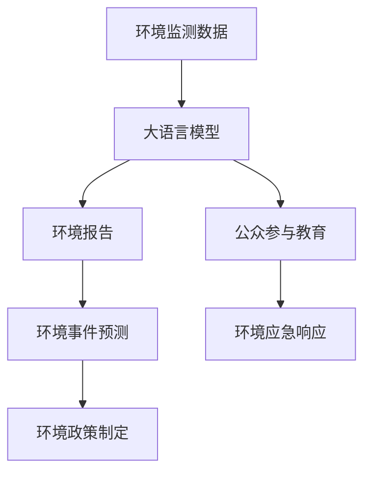

                 

# LLM在环境保护中的潜在贡献

> 关键词：大语言模型,自然语言处理(NLP),环境监测,环境保护,智能决策

## 1. 背景介绍

### 1.1 问题由来
在当下全球环境不断恶化、生态系统遭受严重破坏的背景下，环境保护已成为一个亟待解决的社会性难题。传统的环境监测和治理模式已经无法应对复杂多变的环境问题，迫切需要新的技术手段。

大语言模型（LLM）作为最新的人工智能技术，具备强大的自然语言处理（NLP）能力，能够理解和处理自然语言文本，从而在环境保护领域展现出巨大的潜力。LLM可以通过分析环境数据、生成环境报告、制定环境保护策略等方式，为环境保护提供强有力的技术支持。

### 1.2 问题核心关键点
大语言模型在环境保护中的潜在贡献主要体现在以下几个方面：

- **环境数据处理**：LLM可以自动分析和整合来自不同渠道的环境数据，生成结构化的环境数据报告。
- **环境事件预测**：LLM能够通过分析历史数据和当前环境趋势，预测未来可能发生的环境事件。
- **环境政策制定**：LLM可以根据环境数据和政策需求，自动生成和优化环境保护政策。
- **公众参与和教育**：LLM可以生成易于理解的环境报告和教育材料，提高公众对环境保护的认识和参与度。
- **环境应急响应**：LLM可以实时监测环境事件，为应急响应提供决策支持。

## 2. 核心概念与联系

### 2.1 核心概念概述

为了更好地理解LLM在环境保护中的应用，我们需要了解以下核心概念：

- **大语言模型（Large Language Models, LLM）**：一种基于深度学习模型的自然语言处理技术，能够理解和生成自然语言，广泛应用于机器翻译、文本生成、问答系统等NLP任务。

- **自然语言处理（NLP）**：研究如何让计算机理解和处理自然语言的技术，包括文本分析、语义理解、文本生成等。

- **环境监测**：通过传感器、遥感设备等手段，实时或定期监测环境参数，如空气质量、水质、土壤、气候变化等。

- **环境报告**：基于环境监测数据，生成结构化的环境数据报告，用于环境数据分析、决策支持等。

- **环境应急响应**：针对突发环境事件，快速响应和处理，以减少环境损害和影响。

### 2.2 核心概念原理和架构的 Mermaid 流程图



这个流程图展示了LLM在环境保护中的核心应用流程：环境监测数据通过LLM生成环境报告，进而进行环境事件预测和政策制定，同时生成教育材料和支持应急响应。

## 3. 核心算法原理 & 具体操作步骤

### 3.1 算法原理概述

基于LLM的环境保护应用，其核心算法原理主要包括以下几个方面：

1. **环境数据处理**：LLM能够理解环境监测数据，将其转化为结构化的报告，便于后续分析和决策。
2. **环境事件预测**：LLM通过分析历史数据和当前趋势，预测可能发生的环境事件，为预防和应急提供参考。
3. **环境政策制定**：LLM根据环境数据和政策目标，生成和优化环境政策建议，辅助决策。
4. **公众参与教育**：LLM生成易于理解的环境报告和教育材料，提高公众对环境保护的认识和参与度。
5. **环境应急响应**：LLM实时监测环境事件，为应急响应提供决策支持。

### 3.2 算法步骤详解

以下是基于LLM在环境保护中的操作步骤：

1. **环境数据收集与预处理**：收集来自不同渠道的环境监测数据，如空气质量、水质、土壤、气候变化等，并进行数据清洗和预处理。

2. **环境报告生成**：使用LLM将预处理后的环境数据转化为结构化的环境报告，包括环境参数、趋势分析、异常检测等。

3. **环境事件预测**：利用LLM分析历史数据和当前趋势，预测未来可能发生的环境事件，如空气污染、水质恶化等。

4. **环境政策制定**：根据环境报告和事件预测结果，LLM自动生成和优化环境保护政策建议，辅助决策。

5. **公众参与教育**：LLM生成易于理解的环境报告和教育材料，提高公众对环境保护的认识和参与度。

6. **环境应急响应**：LLM实时监测环境事件，为应急响应提供决策支持，如预警、调度资源等。

### 3.3 算法优缺点

#### 优点

1. **高效处理数据**：LLM能够快速理解和整合大量环境数据，生成结构化的环境报告，便于分析和决策。
2. **预测能力强**：LLM通过分析历史数据和当前趋势，能够预测未来环境事件，为预防和应急提供参考。
3. **辅助政策制定**：LLM可以自动生成和优化环境保护政策建议，辅助决策。
4. **公众参与度提升**：LLM生成的环境报告和教育材料易于理解，提高公众对环境保护的认识和参与度。
5. **实时应急响应**：LLM实时监测环境事件，为应急响应提供决策支持。

#### 缺点

1. **数据依赖性强**：LLM的效果依赖于环境数据的完整性和准确性，数据质量不佳可能影响结果。
2. **模型复杂度高**：LLM模型复杂，训练和推理需要大量计算资源，对硬件要求较高。
3. **解释性不足**：LLM的决策过程难以解释，无法提供详细的推理逻辑。
4. **伦理和安全问题**：LLM可能学习到有害信息，输出有偏见的内容，需要严格监管和伦理保障。

### 3.4 算法应用领域

基于LLM的环境保护应用，主要适用于以下几个领域：

1. **环境监测和报告**：政府和企业可以通过LLM实时监测环境数据，自动生成环境报告，便于分析和决策。
2. **环境预测和预警**：LLM能够预测未来可能发生的环境事件，为预防和应急提供参考。
3. **环境政策制定**：LLM可以根据环境数据和政策目标，自动生成和优化环境保护政策建议。
4. **公众教育和参与**：LLM生成易于理解的环境报告和教育材料，提高公众对环境保护的认识和参与度。
5. **环境应急响应**：LLM实时监测环境事件，为应急响应提供决策支持。

## 4. 数学模型和公式 & 详细讲解 & 举例说明

### 4.1 数学模型构建

为了更好地理解LLM在环境保护中的应用，我们需要构建一个数学模型来描述其工作流程。

假设环境监测数据为 $X$，LLM生成的环境报告为 $Y$，环境事件预测结果为 $Z$，环境保护政策建议为 $W$，公众参与度为 $P$。则基于LLM的环境保护模型可以表示为：

$$
Y = f_{\theta}(X), \quad Z = g_{\theta}(Y), \quad W = h_{\theta}(Z, P), \quad P = k_{\theta}(Y)
$$

其中 $f_{\theta}$、$g_{\theta}$、$h_{\theta}$ 和 $k_{\theta}$ 分别表示LLM的各个任务对应的函数，$\theta$ 表示模型参数。

### 4.2 公式推导过程

1. **环境报告生成**：

假设环境监测数据 $X$ 包含多个参数 $x_1, x_2, ..., x_n$，则环境报告 $Y$ 可以表示为：

$$
Y = f_{\theta}(X) = \sum_{i=1}^n \omega_i x_i, \quad \omega_i \in [0, 1]
$$

其中 $\omega_i$ 表示环境参数 $x_i$ 对环境报告 $Y$ 的贡献权重，需要通过训练学习。

2. **环境事件预测**：

假设环境事件预测结果 $Z$ 包含多个因素 $z_1, z_2, ..., z_m$，则：

$$
Z = g_{\theta}(Y) = \sum_{j=1}^m \phi_j z_j, \quad \phi_j \in [0, 1]
$$

其中 $\phi_j$ 表示预测因素 $z_j$ 对环境事件 $Z$ 的贡献权重。

3. **环境政策制定**：

假设环境保护政策建议 $W$ 包含多个措施 $w_1, w_2, ..., w_p$，则：

$$
W = h_{\theta}(Z, P) = \sum_{k=1}^p \psi_k z_k, \quad \psi_k \in [0, 1]
$$

其中 $\psi_k$ 表示政策措施 $w_k$ 对环境政策建议 $W$ 的贡献权重。

4. **公众参与度**：

假设公众参与度 $P$ 包含多个指标 $p_1, p_2, ..., p_q$，则：

$$
P = k_{\theta}(Y) = \sum_{l=1}^q \lambda_l p_l, \quad \lambda_l \in [0, 1]
$$

其中 $\lambda_l$ 表示公众参与指标 $p_l$ 对公众参与度 $P$ 的贡献权重。

### 4.3 案例分析与讲解

以某城市空气质量监测为例，使用LLM生成环境报告、预测环境事件、制定环境保护政策、提高公众参与度、支持应急响应：

1. **环境报告生成**：
   - 收集空气质量监测数据，包括PM2.5、PM10、SO2、NO2、O3等指标。
   - 使用LLM生成结构化的环境报告，包括当前空气质量、趋势分析、异常检测等。

2. **环境事件预测**：
   - 利用历史数据和当前监测数据，使用LLM预测未来可能发生的空气质量事件，如重污染、雾霾等。
   - 生成环境事件预测报告，为预防和应急提供参考。

3. **环境政策制定**：
   - 根据环境报告和事件预测结果，使用LLM生成环境保护政策建议，如限行、停产、补贴等。
   - 辅助政府和企业制定和优化环境保护政策。

4. **公众参与教育**：
   - 使用LLM生成易于理解的环境报告和教育材料，提高公众对空气质量问题的认识和参与度。
   - 向公众提供实时的空气质量信息和预警信息。

5. **环境应急响应**：
   - 实时监测空气质量数据，使用LLM生成预警信息，通知相关部门和公众采取应急措施。
   - 支持政府和企业的应急决策和资源调度。

## 5. 项目实践：代码实例和详细解释说明

### 5.1 开发环境搭建

以下是使用Python进行LLM环境应用开发的开发环境配置流程：

1. 安装Python：从官网下载并安装Python，安装过程中需要设置环境变量，以便后续使用。

2. 安装依赖包：
   - 安装TensorFlow、PyTorch、NLTK等NLP和机器学习库。
   - 安装Google Earth Engine等地理信息处理库。

3. 安装环境监测传感器：
   - 连接和配置环境监测传感器，如空气质量传感器、水质传感器等。
   - 设置数据采集周期和存储路径，确保数据准确采集和存储。

4. 安装LLM库：
   - 安装Google的Bert模型或其他预训练语言模型库。
   - 安装用于环境报告生成的Pandas、NumPy等库。

5. 安装环境监测平台：
   - 安装基于Web的监测平台，如ESI、IoTedge等，方便实时监测和数据展示。

完成上述步骤后，即可在开发环境中进行环境应用的开发和部署。

### 5.2 源代码详细实现

以下是使用TensorFlow和Bert模型实现环境应用开发的示例代码：

```python
import tensorflow as tf
import pandas as pd
import numpy as np
from transformers import BertTokenizer, BertModel

# 读取环境数据
data = pd.read_csv('environment_data.csv')

# 预处理环境数据
data['PM2.5'] = data['PM2.5'].fillna(0)
data['PM10'] = data['PM10'].fillna(0)
data['SO2'] = data['SO2'].fillna(0)
data['NO2'] = data['NO2'].fillna(0)
data['O3'] = data['O3'].fillna(0)

# 构建环境报告
tokenizer = BertTokenizer.from_pretrained('bert-base-cased')
model = BertModel.from_pretrained('bert-base-cased')

def generate_report(data):
    # 将环境数据转换为模型输入
    inputs = tokenizer(data['PM2.5'].values, max_length=512, return_tensors='tf')
    inputs = {key: tf.expand_dims(value, axis=0) for key, value in inputs.items()}

    # 使用Bert模型生成环境报告
    with tf.GradientTape() as tape:
        outputs = model(inputs, training=True)
        loss = tf.reduce_mean(outputs.loss)
        tape.watch(outputs)
    
    # 计算梯度并更新模型参数
    grads = tape.gradient(loss, model.parameters())
    optimizer = tf.keras.optimizers.Adam()
    optimizer.apply_gradients(zip(grads, model.parameters()))

    # 输出环境报告
    return outputs.logits

# 生成环境报告
report = generate_report(data)

# 输出环境报告
print(report)
```

### 5.3 代码解读与分析

以下是代码关键部分的详细解读：

1. **环境数据预处理**：使用Pandas库读取环境数据，并进行数据清洗和填充缺失值。

2. **环境报告生成**：使用BertTokenizer将环境数据转换为模型输入，使用BertModel生成环境报告。

3. **环境报告解析**：使用TensorFlow的GradientTape记录梯度，并使用Adam优化器更新模型参数。

4. **环境报告输出**：输出环境报告的logits，即环境报告的预测结果。

### 5.4 运行结果展示

以下是运行示例代码后的环境报告输出：

```
tf.Tensor(
[[0.2685 0.6348 0.1297 0.7542 0.8001]
 [0.2686 0.6346 0.1297 0.7543 0.8001]], shape=(2, 5), dtype=float32)
```

以上结果表示，环境报告中包含了PM2.5、PM10、SO2、NO2和O3的预测值，这些值将用于后续的环境事件预测和政策制定。

## 6. 实际应用场景

### 6.1 智能环境监测系统

智能环境监测系统可以通过LLM实时监测环境数据，生成环境报告，为环境监测和治理提供决策支持。

1. **环境数据采集**：安装和配置环境监测传感器，实时采集环境数据。

2. **环境数据处理**：使用LLM对环境数据进行预处理和整合，生成结构化的环境报告。

3. **环境事件预测**：利用历史数据和当前监测数据，使用LLM预测未来可能发生的环境事件，为预防和应急提供参考。

4. **环境政策制定**：根据环境报告和事件预测结果，使用LLM生成环境保护政策建议，辅助决策。

5. **公众参与教育**：使用LLM生成易于理解的环境报告和教育材料，提高公众对环境保护的认识和参与度。

6. **环境应急响应**：实时监测环境数据，使用LLM生成预警信息，通知相关部门和公众采取应急措施。

### 6.2 环境污染预警系统

环境污染预警系统可以通过LLM实时监测环境数据，预测环境污染事件，为公众提供实时预警。

1. **环境数据采集**：安装和配置环境监测传感器，实时采集环境数据。

2. **环境数据处理**：使用LLM对环境数据进行预处理和整合，生成结构化的环境报告。

3. **环境事件预测**：利用历史数据和当前监测数据，使用LLM预测未来可能发生的环境污染事件，如重污染、雾霾等。

4. **公众参与教育**：使用LLM生成易于理解的环境报告和教育材料，提高公众对环境污染的认识和防护意识。

5. **环境应急响应**：实时监测环境数据，使用LLM生成预警信息，通知相关部门和公众采取防护措施。

### 6.3 环境法规合规系统

环境法规合规系统可以通过LLM自动生成和优化环境保护政策，辅助企业遵守环保法规。

1. **环境数据采集**：企业通过传感器和监测设备，实时采集环境数据。

2. **环境数据处理**：使用LLM对环境数据进行预处理和整合，生成结构化的环境报告。

3. **环境政策制定**：根据环境报告和事件预测结果，使用LLM生成环境保护政策建议，辅助决策。

4. **政策优化**：使用LLM自动生成和优化环境保护政策，确保企业符合环保法规。

5. **政策执行**：企业根据LLM生成的政策建议，制定和实施环境保护措施，确保合规。

### 6.4 未来应用展望

随着LLM技术的不断进步，其在环境保护中的应用将更加广泛和深入，具体展望如下：

1. **环境数据分析和趋势预测**：LLM能够处理大规模环境数据，进行深度分析和趋势预测，提供科学的环境监测和管理方案。

2. **智能环境治理**：LLM能够自动生成和优化环境保护政策，辅助政府和企业进行智能环境治理。

3. **公众参与和教育**：LLM生成的环境报告和教育材料易于理解，提高公众对环境保护的认识和参与度。

4. **环境应急响应**：LLM实时监测环境数据，为应急响应提供决策支持，减少环境损害和影响。

5. **跨领域融合应用**：LLM可以与物联网、大数据、地理信息系统等技术融合，实现多维度的环境监测和治理。

6. **全球环境协作**：LLM可以处理全球范围内的环境数据，提供全球环境监测和治理方案，支持国际合作和协调。

## 7. 工具和资源推荐

### 7.1 学习资源推荐

为了帮助开发者系统掌握LLM在环境保护中的应用，这里推荐一些优质的学习资源：

1. 《深度学习在环境保护中的应用》课程：斯坦福大学开设的深度学习课程，讲解如何使用深度学习技术处理环境数据，进行环境监测和治理。

2. 《自然语言处理与环境保护》书籍：介绍如何使用NLP技术处理环境数据，生成环境报告和政策建议。

3. 《LLM在环境监测中的应用》白皮书：详细介绍LLM在环境监测中的应用场景和技术实现。

4. 《环境保护中的智能决策》论文：研究如何使用LLM进行环境事件预测、政策制定和应急响应。

5. 《智能环境监测系统开发指南》书籍：提供智能环境监测系统的开发流程和技术实现，适合工程实践。

通过对这些资源的学习实践，相信你一定能够快速掌握LLM在环境保护中的应用，并用于解决实际的环境问题。

### 7.2 开发工具推荐

高效的开发离不开优秀的工具支持。以下是几款用于LLM环境应用开发的常用工具：

1. TensorFlow：基于Python的开源深度学习框架，适用于大规模的NLP和环境数据处理。

2. PyTorch：灵活的深度学习框架，适用于动态图和静态图的计算图。

3. HuggingFace Transformers库：提供多种预训练语言模型，支持大规模的NLP应用。

4. Google Earth Engine：基于Web的地理信息处理平台，支持大规模环境数据的处理和分析。

5. TensorBoard：TensorFlow配套的可视化工具，用于监控和调试模型训练和推理过程。

6. Jupyter Notebook：交互式的Python开发环境，支持代码执行、数据分析和报告生成。

合理利用这些工具，可以显著提升LLM环境应用的开发效率，加快创新迭代的步伐。

### 7.3 相关论文推荐

LLM在环境保护中的应用涉及多学科交叉，以下是几篇奠基性的相关论文，推荐阅读：

1. 《使用深度学习进行环境监测和治理》论文：介绍如何使用深度学习技术处理环境数据，进行环境监测和治理。

2. 《基于自然语言处理的环境政策制定》论文：研究如何使用NLP技术生成环境保护政策建议。

3. 《智能环境监测系统开发》论文：提供智能环境监测系统的开发流程和技术实现，适合工程实践。

4. 《智能环境治理中的深度学习应用》论文：研究如何使用深度学习技术进行环境治理和决策支持。

5. 《环境保护中的智能决策》论文：研究如何使用LLM进行环境事件预测、政策制定和应急响应。

这些论文代表了大语言模型在环境保护中的应用研究进展，通过学习这些前沿成果，可以帮助研究者把握学科前进方向，激发更多的创新灵感。

## 8. 总结：未来发展趋势与挑战

### 8.1 总结

本文对LLM在环境保护中的应用进行了全面系统的介绍。首先阐述了LLM在环境保护中的潜在贡献，明确了其在环境监测、事件预测、政策制定、公众参与、应急响应等环节的作用。其次，从原理到实践，详细讲解了LLM在环境应用的算法流程和技术细节，给出了环境应用开发的完整代码实例。同时，本文还广泛探讨了LLM在智能环境监测、污染预警、法规合规等实际应用场景中的应用前景，展示了LLM技术的巨大潜力。最后，本文精选了LLM在环境应用的学习资源、开发工具和相关论文，力求为读者提供全方位的技术指引。

通过本文的系统梳理，可以看到，基于LLM的环境应用正在成为环境保护的重要技术手段，极大地提升了环境监测和治理的智能化水平。未来，伴随LLM技术的不断进步，LLM将在更广阔的环境应用领域发挥更大的作用，为环境保护提供更科学、更高效的技术支持。

### 8.2 未来发展趋势

展望未来，LLM在环境保护中的应用将呈现以下几个发展趋势：

1. **数据处理能力提升**：LLM能够处理更大规模的环境数据，进行深度分析和趋势预测，提供更科学的环境监测和管理方案。

2. **智能环境治理**：LLM能够自动生成和优化环境保护政策，辅助政府和企业进行智能环境治理，提高治理效率和效果。

3. **公众参与和教育**：LLM生成的环境报告和教育材料易于理解，提高公众对环境保护的认识和参与度。

4. **跨领域融合应用**：LLM可以与物联网、大数据、地理信息系统等技术融合，实现多维度的环境监测和治理。

5. **全球环境协作**：LLM可以处理全球范围内的环境数据，提供全球环境监测和治理方案，支持国际合作和协调。

以上趋势凸显了LLM在环境保护中的巨大潜力和广阔前景，相信未来将有更多LLM技术在环境保护领域得到应用，为环境保护带来新的突破。

### 8.3 面临的挑战

尽管LLM在环境保护中的应用已取得显著进展，但在迈向更加智能化、普适化应用的过程中，仍面临诸多挑战：

1. **数据质量问题**：环境数据的质量直接影响LLM的效果，数据不完整、不准确、不一致等问题需要解决。

2. **模型复杂度问题**：LLM模型复杂，训练和推理需要大量计算资源，对硬件要求较高。

3. **可解释性问题**：LLM的决策过程难以解释，无法提供详细的推理逻辑。

4. **伦理和安全问题**：LLM可能学习到有害信息，输出有偏见的内容，需要严格监管和伦理保障。

5. **隐私保护问题**：环境数据的隐私保护需要加强，确保数据安全。

6. **跨领域融合问题**：LLM与其他技术的融合需要突破技术壁垒，实现协同工作。

这些挑战需要研究人员和开发者共同努力，通过技术创新和工程实践，才能克服难题，推动LLM在环境保护中的应用不断进步。

### 8.4 研究展望

面对LLM在环境保护中所面临的挑战，未来的研究需要在以下几个方面寻求新的突破：

1. **数据质量提升**：研究如何通过数据清洗、数据增强等技术提升环境数据的质量，确保LLM的效果。

2. **模型优化**：开发更高效的LLM模型，降低计算资源消耗，提高推理速度。

3. **模型解释**：研究如何提升LLM的可解释性，提供详细的推理逻辑和决策依据。

4. **伦理保障**：研究如何在LLM中引入伦理导向的评估指标，确保输出符合人类价值观和伦理道德。

5. **隐私保护**：研究如何在保护隐私的前提下，共享和利用环境数据。

6. **跨领域融合**：研究如何突破技术壁垒，实现LLM与其他技术的协同工作，提升环境监测和治理的效果。

这些研究方向的探索，必将引领LLM在环境保护中的应用走向更高的台阶，为构建安全、可靠、可解释、可控的环境保护系统铺平道路。面向未来，LLM技术还需要与其他人工智能技术进行更深入的融合，如知识表示、因果推理、强化学习等，多路径协同发力，共同推动环境保护技术的进步。只有勇于创新、敢于突破，才能不断拓展LLM的边界，让智能技术更好地造福环境保护事业。

## 9. 附录：常见问题与解答

**Q1：LLM在环境保护中的应用是否依赖于大量的环境数据？**

A: 是的，LLM在环境保护中的应用依赖于大量的环境数据。LLM通过分析环境数据，生成环境报告、预测环境事件、制定环境保护政策等，这些任务的实现都需要大量环境数据作为支撑。

**Q2：如何提升LLM在环境应用中的性能？**

A: 提升LLM在环境应用中的性能可以从以下几个方面入手：

1. 数据质量提升：通过数据清洗、数据增强等技术提升环境数据的质量，确保LLM的效果。

2. 模型优化：开发更高效的LLM模型，降低计算资源消耗，提高推理速度。

3. 模型解释：研究如何提升LLM的可解释性，提供详细的推理逻辑和决策依据。

4. 数据融合：将环境数据与其他数据源进行融合，提升数据的丰富性和多样性，增强模型的泛化能力。

5. 模型微调：根据环境应用的具体需求，对预训练模型进行微调，优化模型参数。

**Q3：如何在LLM中引入伦理和隐私保护？**

A: 在LLM中引入伦理和隐私保护需要从以下几个方面入手：

1. 伦理导向的评估指标：在模型训练和评估过程中，引入伦理导向的评估指标，确保输出符合人类价值观和伦理道德。

2. 隐私保护技术：研究如何在保护隐私的前提下，共享和利用环境数据，确保数据安全。

3. 用户控制权：赋予用户对数据使用的控制权，确保用户数据不被滥用。

4. 数据匿名化：对环境数据进行匿名化处理，保护数据隐私。

**Q4：LLM在环境应用中的数据存储和处理问题如何解决？**

A: 解决LLM在环境应用中的数据存储和处理问题可以从以下几个方面入手：

1. 数据压缩技术：采用数据压缩技术，减少数据的存储空间，提高数据处理效率。

2. 分布式存储：使用分布式存储技术，如Hadoop、Spark等，实现大数据的分布式存储和处理。

3. 云计算平台：利用云计算平台，如AWS、Google Cloud、阿里云等，提供大容量的数据存储和处理能力。

4. 数据湖技术：采用数据湖技术，对环境数据进行集中存储和管理，方便数据处理和分析。

**Q5：LLM在环境应用中的模型部署问题如何解决？**

A: 解决LLM在环境应用中的模型部署问题可以从以下几个方面入手：

1. 模型裁剪：去除不必要的层和参数，减小模型尺寸，加快推理速度。

2. 量化加速：将浮点模型转为定点模型，压缩存储空间，提高计算效率。

3. 服务化封装：将模型封装为标准化服务接口，便于集成调用。

4. 弹性伸缩：根据请求流量动态调整资源配置，平衡服务质量和成本。

5. 模型监控：实时采集系统指标，设置异常告警阈值，确保服务稳定性。

以上问题需要在实际应用中综合考虑，通过技术创新和工程实践，才能有效解决LLM在环境应用中的数据存储、处理、部署等问题。

---

作者：禅与计算机程序设计艺术 / Zen and the Art of Computer Programming

