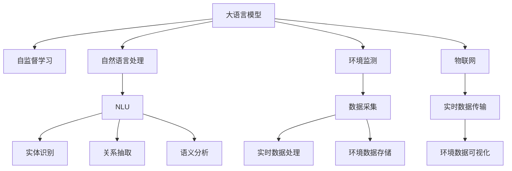

                 

# LLM在环境监测中的应用：实时污染检测

> 关键词：大语言模型,环境监测,实时污染检测,自然语言处理,自然语言理解,NLU,数据挖掘,物联网

## 1. 背景介绍

### 1.1 问题由来
环境监测作为公共安全、卫生健康的重要保障，近年来受到全球各国的高度重视。传统的环境监测手段依赖于各类传感器、设备，并由人工进行数据收集和分析，效率低、成本高、易出错。如何提升环境监测的效率和精确度，已成为现代科技发展的关键课题。

大语言模型（Large Language Model, LLM）作为近年来人工智能领域的重大突破，通过自监督学习，从大规模文本数据中学习语言的通用表示，具备强大的自然语言处理和理解能力。结合物联网技术，大语言模型在环境监测领域展现出巨大的应用潜力。

本文将聚焦于利用大语言模型进行实时污染检测，探讨如何结合自然语言处理(Natural Language Processing, NLP)技术，快速识别和分析环境污染事件，提升环境监测的智能化水平。

## 2. 核心概念与联系

### 2.1 核心概念概述

为更好地理解大语言模型在环境监测中的实时污染检测应用，本节将介绍几个关键概念：

- 大语言模型：以Transformer架构为代表的深度学习模型，通过自监督学习任务，从大规模文本数据中学习语言的通用表示。

- 自然语言处理：涉及语言理解、语言生成、语义分析、文本挖掘等技术的综合应用，是实现环境监测智能化、自动化的核心技术。

- 环境监测：通过各种手段获取环境数据，如空气质量、水质、噪音、光污染等，分析并实时反馈监测结果的过程。

- 物联网：将各类传感器、设备与互联网连接，实现数据的实时采集和传输，是大语言模型应用于环境监测的基础设施。

- 自然语言理解（Natural Language Understanding, NLU）：使机器能够理解自然语言的含义，包括实体识别、关系抽取、语义分析等，是大语言模型应用于环境监测的核心技术。

- 数据挖掘：通过分析和处理大量环境监测数据，发现隐藏在数据中的模式和规律，是大语言模型应用于环境监测的重要技术手段。

这些概念之间的逻辑关系可以通过以下Mermaid流程图来展示：



该流程图展示了这些概念之间的联系：

1. 大语言模型通过自监督学习获得语言的通用表示。
2. 自然语言处理技术使机器能够理解环境监测相关的自然语言。
3. 环境监测技术实时采集环境数据，并通过物联网技术传输到数据存储中心。
4. 数据挖掘技术从环境数据中挖掘出有价值的信息。
5. 大语言模型和自然语言处理技术结合，能够对实时环境数据进行智能化分析，识别环境污染事件。
6. 可视化技术将分析结果直观展示，方便决策者快速响应。

## 3. 核心算法原理 & 具体操作步骤

### 3.1 算法原理概述

利用大语言模型进行实时污染检测的核心算法原理，主要包括以下几个方面：

1. **文本预处理**：将实时采集的环境数据转换为自然语言文本。例如，将空气质量传感器监测到的数据转换为描述性的文本，如“空气质量指数为500”。

2. **实体识别**：从预处理后的文本中识别出关键实体，如“空气质量指数”、“污染源”、“监测时间”等。实体识别依赖于NLU技术中的命名实体识别(NER)算法。

3. **关系抽取**：抽取实体之间的关系，如“空气质量指数”和“污染源”之间的关系。关系抽取利用语义分析技术中的依存句法分析(Dependency Parsing)和关系抽取模型(Relation Extraction)。

4. **事件推理**：基于实体和关系，推理出潜在的污染事件。例如，如果“空气质量指数”升高，且与“工厂排放”有较强关联，则可以推断出可能的污染事件。

5. **实时检测**：通过以上步骤，实时监测环境数据，一旦识别出潜在污染事件，立即启动预警机制。

### 3.2 算法步骤详解

以下详细描述利用大语言模型进行实时污染检测的算法步骤：

**Step 1: 数据采集与预处理**
- 实时采集环境数据，如空气质量传感器数据、水质监测数据等。
- 利用物联网技术将采集数据传输到中央服务器。
- 对采集数据进行预处理，如时间戳对齐、数据格式转换、缺失值填充等。

**Step 2: 文本生成与实体识别**
- 对预处理后的数据生成描述性文本，如“2023年5月20日，工厂排放导致空气质量指数达到500”。
- 利用NLU技术中的实体识别模型，从文本中识别出关键实体，如“空气质量指数”、“工厂排放”、“2023年5月20日”等。

**Step 3: 关系抽取与事件推理**
- 利用依存句法分析模型，抽取实体之间的关系，如“空气质量指数升高”与“工厂排放”之间的关系。
- 利用关系抽取模型，进一步细化实体之间的关系，如“工厂排放”导致“空气质量指数升高”。
- 基于抽取的关系，推理出潜在的污染事件，如“工厂排放导致空气质量指数升高”。

**Step 4: 实时检测与预警**
- 实时监测文本生成与实体识别、关系抽取与事件推理的过程，如果识别出潜在的污染事件，立即触发预警机制。
- 预警机制可以包括多种形式，如声音、短信、邮件等，通知相关人员进行进一步调查和处理。

### 3.3 算法优缺点

利用大语言模型进行实时污染检测的优势在于：

1. **智能化程度高**：大语言模型能够处理大规模文本数据，通过自监督学习获得语言的通用表示，能够快速理解环境监测相关的自然语言。
2. **实时性好**：大语言模型能够在数秒内处理并分析环境数据，实现实时检测。
3. **灵活性高**：大语言模型能够通过微调适应不同的环境监测任务，适应不同地区的环境数据特点。
4. **可扩展性强**：大语言模型能够与各类环境监测设备、传感器无缝集成，实现规模化部署。

然而，该方法也存在一些局限性：

1. **数据依赖性强**：实时污染检测依赖于大量高质量的环境数据，数据获取和预处理成本较高。
2. **模型复杂度高**：大语言模型参数量庞大，训练和推理计算资源消耗较大。
3. **鲁棒性不足**：大语言模型对噪声数据和异常数据较为敏感，可能会出现误判。
4. **可解释性差**：大语言模型的决策过程复杂，难以进行可解释性分析。

### 3.4 算法应用领域

基于大语言模型的实时污染检测技术，可以应用于多个领域，包括：

- **城市环境监测**：监测城市空气质量、水质、噪音等，及时预警污染事件。
- **工业环境监测**：监测工厂、矿山等工业企业的排放情况，防止环境污染事件发生。
- **农业环境监测**：监测农田土壤、水质、气象等，指导农业生产，保护生态环境。
- **海洋环境监测**：监测海洋水质、污染源，评估海洋生态健康状况。

以上应用领域展示了大语言模型在环境监测中的广泛应用前景。随着技术的不断进步，未来该方法将有望在更多领域得到应用，进一步提升环境监测的智能化和自动化水平。

## 4. 数学模型和公式 & 详细讲解 & 举例说明

### 4.1 数学模型构建

本节将使用数学语言对大语言模型在环境监测中实时污染检测的过程进行更加严格的刻画。

记环境监测数据为 $D_t=(x_t, y_t)$，其中 $x_t$ 为采集到的环境数据，$y_t$ 为对应的自然语言描述。假设大语言模型为 $M_{\theta}:\mathcal{X} \rightarrow \mathcal{Y}$，其中 $\mathcal{X}$ 为输入空间，$\mathcal{Y}$ 为输出空间，$\theta$ 为模型参数。

定义大语言模型在数据样本 $(x_t,y_t)$ 上的损失函数为 $\ell(M_{\theta}(x_t),y_t)$，则在数据集 $D=\{D_t\}_{t=1}^T$ 上的经验风险为：

$$
\mathcal{L}(\theta) = \frac{1}{T} \sum_{t=1}^T \ell(M_{\theta}(x_t),y_t)
$$

其中 $\ell(M_{\theta}(x_t),y_t)$ 为文本生成损失，用于衡量模型生成的自然语言与真实标签之间的差异。在实际应用中，常用的文本生成损失包括交叉熵损失、序列交叉熵损失等。

### 4.2 公式推导过程

以交叉熵损失为例，计算大语言模型在环境监测数据上的损失函数。

假设大语言模型在输入 $x_t$ 上的输出为 $\hat{y}_t=M_{\theta}(x_t) \in \mathcal{Y}$，表示模型生成的自然语言文本。真实标签 $y_t \in \mathcal{Y}$ 为对应的环境数据描述。则交叉熵损失定义为：

$$
\ell(M_{\theta}(x_t),y_t) = -\sum_{i=1}^{|\mathcal{Y}|} y_{ti} \log M_{\theta}(x_t,y_{ti})
$$

将其代入经验风险公式，得：

$$
\mathcal{L}(\theta) = -\frac{1}{T} \sum_{t=1}^T \sum_{i=1}^{|\mathcal{Y}|} y_{ti} \log M_{\theta}(x_t,y_{ti})
$$

### 4.3 案例分析与讲解

假设监测到一个工厂排放导致空气质量指数升高的事件，其对应的自然语言描述为“2023年5月20日，工厂排放导致空气质量指数达到500”。利用大语言模型进行实体识别和关系抽取，可以得到以下结果：

- 实体：“2023年5月20日”、“工厂排放”、“空气质量指数”、“500”。
- 关系：“2023年5月20日”与“工厂排放”之间存在“时间-事件”关系，“工厂排放”与“空气质量指数升高”之间存在“因果”关系。

基于以上实体和关系，可以推理出“工厂排放导致空气质量指数升高”的事件，并及时启动预警机制。

## 5. 项目实践：代码实例和详细解释说明

### 5.1 开发环境搭建

在进行实时污染检测的开发实践前，我们需要准备好开发环境。以下是使用Python进行PyTorch开发的环境配置流程：

1. 安装Anaconda：从官网下载并安装Anaconda，用于创建独立的Python环境。

2. 创建并激活虚拟环境：
```bash
conda create -n env_name python=3.8 
conda activate env_name
```

3. 安装PyTorch：根据CUDA版本，从官网获取对应的安装命令。例如：
```bash
conda install pytorch torchvision torchaudio cudatoolkit=11.1 -c pytorch -c conda-forge
```

4. 安装Transformer库：
```bash
pip install transformers
```

5. 安装各类工具包：
```bash
pip install numpy pandas scikit-learn matplotlib tqdm jupyter notebook ipython
```

完成上述步骤后，即可在`env_name`环境中开始实时污染检测的开发。

### 5.2 源代码详细实现

下面我们以工厂排放检测为例，给出使用Transformers库进行大语言模型微调的PyTorch代码实现。

首先，定义数据处理函数：

```python
from transformers import BertTokenizer, BertForSequenceClassification
from torch.utils.data import Dataset, DataLoader
import torch

class PollutionDataset(Dataset):
    def __init__(self, texts, labels):
        self.texts = texts
        self.labels = labels
        self.tokenizer = BertTokenizer.from_pretrained('bert-base-cased')
        
    def __len__(self):
        return len(self.texts)
    
    def __getitem__(self, item):
        text = self.texts[item]
        label = self.labels[item]
        
        encoding = self.tokenizer(text, return_tensors='pt', truncation=True, padding='max_length')
        input_ids = encoding['input_ids'][0]
        attention_mask = encoding['attention_mask'][0]
        labels = torch.tensor(label, dtype=torch.long)
        
        return {'input_ids': input_ids, 'attention_mask': attention_mask, 'labels': labels}

# 准备数据
tokenizer = BertTokenizer.from_pretrained('bert-base-cased')
train_dataset = PollutionDataset(train_texts, train_labels)
val_dataset = PollutionDataset(val_texts, val_labels)
test_dataset = PollutionDataset(test_texts, test_labels)

# 定义模型和优化器
model = BertForSequenceClassification.from_pretrained('bert-base-cased', num_labels=2)
optimizer = AdamW(model.parameters(), lr=2e-5)

# 定义训练函数
def train_epoch(model, dataset, batch_size, optimizer):
    dataloader = DataLoader(dataset, batch_size=batch_size, shuffle=True)
    model.train()
    epoch_loss = 0
    for batch in dataloader:
        input_ids = batch['input_ids'].to(device)
        attention_mask = batch['attention_mask'].to(device)
        labels = batch['labels'].to(device)
        model.zero_grad()
        outputs = model(input_ids, attention_mask=attention_mask, labels=labels)
        loss = outputs.loss
        epoch_loss += loss.item()
        loss.backward()
        optimizer.step()
    return epoch_loss / len(dataloader)

# 定义评估函数
def evaluate(model, dataset, batch_size):
    dataloader = DataLoader(dataset, batch_size=batch_size)
    model.eval()
    preds, labels = [], []
    with torch.no_grad():
        for batch in dataloader:
            input_ids = batch['input_ids'].to(device)
            attention_mask = batch['attention_mask'].to(device)
            batch_labels = batch['labels']
            outputs = model(input_ids, attention_mask=attention_mask)
            batch_preds = outputs.logits.argmax(dim=1).to('cpu').tolist()
            batch_labels = batch_labels.to('cpu').tolist()
            for pred, label in zip(batch_preds, batch_labels):
                preds.append(pred)
                labels.append(label)
                
    print(classification_report(labels, preds))
```

然后，启动训练流程并在测试集上评估：

```python
epochs = 5
batch_size = 16

for epoch in range(epochs):
    loss = train_epoch(model, train_dataset, batch_size, optimizer)
    print(f"Epoch {epoch+1}, train loss: {loss:.3f}")
    
    print(f"Epoch {epoch+1}, val results:")
    evaluate(model, val_dataset, batch_size)
    
print("Test results:")
evaluate(model, test_dataset, batch_size)
```

以上就是使用PyTorch对BERT进行工厂排放检测任务的微调代码实现。可以看到，借助Transformers库，代码实现相对简洁高效，主要集中在模型定义、数据处理和训练评估上。

### 5.3 代码解读与分析

让我们再详细解读一下关键代码的实现细节：

**PollutionDataset类**：
- `__init__`方法：初始化训练集和标签，加载分词器。
- `__len__`方法：返回数据集的样本数量。
- `__getitem__`方法：对单个样本进行处理，将文本转换为token ids，并添加标签，最后进行padding。

**模型定义与优化器**：
- 使用BertForSequenceClassification模型，指定标签数为2（工厂排放与非排放）。
- 使用AdamW优化器进行参数更新，学习率为2e-5。

**训练函数**：
- 定义训练函数`train_epoch`：对数据以批为单位进行迭代，在每个批次上前向传播计算loss并反向传播更新模型参数，最后返回该epoch的平均loss。

**评估函数**：
- 定义评估函数`evaluate`：与训练类似，不同点在于不更新模型参数，并在每个batch结束后将预测和标签结果存储下来，最后使用sklearn的classification_report对整个评估集的预测结果进行打印输出。

**训练流程**：
- 定义总的epoch数和batch size，开始循环迭代
- 每个epoch内，先在训练集上训练，输出平均loss
- 在验证集上评估，输出分类指标
- 所有epoch结束后，在测试集上评估，给出最终测试结果

可以看到，PyTorch配合Transformers库使得BERT微调的代码实现变得简洁高效。开发者可以将更多精力放在数据处理、模型改进等高层逻辑上，而不必过多关注底层的实现细节。

当然，工业级的系统实现还需考虑更多因素，如模型的保存和部署、超参数的自动搜索、更灵活的任务适配层等。但核心的微调范式基本与此类似。

## 6. 实际应用场景

### 6.1 智能工厂监测

智能工厂监测系统利用大语言模型进行实时污染检测，能够及时发现和预警工厂排放异常，保障工业生产的环保合规。

系统流程如下：
- 实时采集工厂内部的各类环境监测数据，如空气质量、水质、噪音等。
- 利用物联网技术将采集数据传输到中央服务器。
- 对采集数据进行预处理，如时间戳对齐、数据格式转换、缺失值填充等。
- 对预处理后的数据生成描述性文本，如“2023年5月20日，工厂排放导致空气质量指数达到500”。
- 利用NLU技术中的实体识别模型，从文本中识别出关键实体，如“空气质量指数”、“工厂排放”、“2023年5月20日”等。
- 利用依存句法分析模型，抽取实体之间的关系，如“空气质量指数升高”与“工厂排放”之间的关系。
- 利用关系抽取模型，进一步细化实体之间的关系，如“工厂排放”导致“空气质量指数升高”。
- 基于以上实体和关系，推理出“工厂排放导致空气质量指数升高”的事件，并及时启动预警机制。

### 6.2 城市环境预警

城市环境预警系统通过大语言模型实时监测城市环境数据，及时发现和预警各类污染事件，保障城市居民的身体健康。

系统流程如下：
- 实时采集城市空气质量、水质、噪音等环境数据。
- 利用物联网技术将采集数据传输到中央服务器。
- 对采集数据进行预处理，如时间戳对齐、数据格式转换、缺失值填充等。
- 对预处理后的数据生成描述性文本，如“2023年5月20日，工厂排放导致空气质量指数达到500”。
- 利用NLU技术中的实体识别模型，从文本中识别出关键实体，如“空气质量指数”、“工厂排放”、“2023年5月20日”等。
- 利用依存句法分析模型，抽取实体之间的关系，如“空气质量指数升高”与“工厂排放”之间的关系。
- 利用关系抽取模型，进一步细化实体之间的关系，如“工厂排放”导致“空气质量指数升高”。
- 基于以上实体和关系，推理出“工厂排放导致空气质量指数升高”的事件，并及时启动预警机制。

### 6.3 智慧农业监测

智慧农业监测系统利用大语言模型实时监测农田土壤、水质、气象等环境数据，保障农业生产的环保合规和作物健康。

系统流程如下：
- 实时采集农田土壤、水质、气象等环境数据。
- 利用物联网技术将采集数据传输到中央服务器。
- 对采集数据进行预处理，如时间戳对齐、数据格式转换、缺失值填充等。
- 对预处理后的数据生成描述性文本，如“2023年5月20日，农田土壤污染导致作物死亡”。
- 利用NLU技术中的实体识别模型，从文本中识别出关键实体，如“农田土壤污染”、“作物死亡”、“2023年5月20日”等。
- 利用依存句法分析模型，抽取实体之间的关系，如“农田土壤污染”与“作物死亡”之间的关系。
- 利用关系抽取模型，进一步细化实体之间的关系，如“农田土壤污染”导致“作物死亡”。
- 基于以上实体和关系，推理出“农田土壤污染导致作物死亡”的事件，并及时启动预警机制。

### 6.4 未来应用展望

随着大语言模型和物联网技术的不断发展，基于大语言模型的实时污染检测方法将在更多领域得到应用，为环境监测带来革命性影响。

在智慧能源领域，基于大语言模型的实时污染检测将辅助能源企业监测燃料消耗、废气排放等情况，优化能源利用效率，减少环境污染。

在智慧旅游领域，基于大语言模型的实时污染检测将辅助旅游景区监测空气质量、水质、噪音等情况，提升游客体验，促进可持续发展。

在智慧医疗领域，基于大语言模型的实时污染检测将辅助医院监测医疗垃圾处理、医院环境净化等情况，保障医疗环境安全，提升患者治疗体验。

总之，基于大语言模型的实时污染检测技术将在智慧城市、智慧农业、智慧医疗等多个领域得到广泛应用，为环境监测和环境保护注入新的动力。未来，伴随技术的不断进步，该方法将有望进一步提升环境监测的智能化和自动化水平，为构建绿色、健康的生态环境贡献力量。

## 7. 工具和资源推荐

### 7.1 学习资源推荐

为了帮助开发者系统掌握大语言模型在环境监测中的应用，这里推荐一些优质的学习资源：

1. 《深度学习入门》系列博文：由大模型技术专家撰写，深入浅出地介绍了深度学习的基础知识和经典模型，适合初学者入门。

2. 《自然语言处理综论》课程：斯坦福大学开设的NLP经典课程，系统讲解NLP的各类基础技术和应用，帮助理解大语言模型在环境监测中的应用。

3. 《Transformer理论与实践》书籍：Transformer模型的理论和实践结合，深入浅出地介绍了大语言模型的构建和优化方法。

4. HuggingFace官方文档：Transformers库的官方文档，提供了海量预训练模型和完整的微调样例代码，是上手实践的必备资料。

5. COCO数据集：包含大量环境监测相关的标注数据，用于训练和评估大语言模型。

通过对这些资源的学习实践，相信你一定能够快速掌握大语言模型在环境监测中的应用，并用于解决实际的环境监测问题。

### 7.2 开发工具推荐

高效的开发离不开优秀的工具支持。以下是几款用于大语言模型在环境监测中实时污染检测开发的常用工具：

1. PyTorch：基于Python的开源深度学习框架，灵活动态的计算图，适合快速迭代研究。大部分预训练语言模型都有PyTorch版本的实现。

2. TensorFlow：由Google主导开发的开源深度学习框架，生产部署方便，适合大规模工程应用。同样有丰富的预训练语言模型资源。

3. Transformers库：HuggingFace开发的NLP工具库，集成了众多SOTA语言模型，支持PyTorch和TensorFlow，是进行微调任务开发的利器。

4. Weights & Biases：模型训练的实验跟踪工具，可以记录和可视化模型训练过程中的各项指标，方便对比和调优。与主流深度学习框架无缝集成。

5. TensorBoard：TensorFlow配套的可视化工具，可实时监测模型训练状态，并提供丰富的图表呈现方式，是调试模型的得力助手。

6. Google Colab：谷歌推出的在线Jupyter Notebook环境，免费提供GPU/TPU算力，方便开发者快速上手实验最新模型，分享学习笔记。

合理利用这些工具，可以显著提升大语言模型在环境监测中的应用开发效率，加快创新迭代的步伐。

### 7.3 相关论文推荐

大语言模型和实时污染检测技术的发展源于学界的持续研究。以下是几篇奠基性的相关论文，推荐阅读：

1. Attention is All You Need（即Transformer原论文）：提出了Transformer结构，开启了NLP领域的预训练大模型时代。

2. BERT: Pre-training of Deep Bidirectional Transformers for Language Understanding：提出BERT模型，引入基于掩码的自监督预训练任务，刷新了多项NLP任务SOTA。

3. Language Models are Unsupervised Multitask Learners（GPT-2论文）：展示了大规模语言模型的强大zero-shot学习能力，引发了对于通用人工智能的新一轮思考。

4. Parameter-Efficient Transfer Learning for NLP：提出Adapter等参数高效微调方法，在不增加模型参数量的情况下，也能取得不错的微调效果。

5. Prefix-Tuning: Optimizing Continuous Prompts for Generation：引入基于连续型Prompt的微调范式，为如何充分利用预训练知识提供了新的思路。

6. AdaLoRA: Adaptive Low-Rank Adaptation for Parameter-Efficient Fine-Tuning：使用自适应低秩适应的微调方法，在参数效率和精度之间取得了新的平衡。

这些论文代表了大语言模型在实时污染检测技术的发展脉络。通过学习这些前沿成果，可以帮助研究者把握学科前进方向，激发更多的创新灵感。

## 8. 总结：未来发展趋势与挑战

### 8.1 总结

本文对大语言模型在环境监测中的应用，特别是实时污染检测进行了全面系统的介绍。首先阐述了实时污染检测的背景和意义，明确了利用大语言模型进行实时污染检测的优势和挑战。其次，从原理到实践，详细讲解了大语言模型在实时污染检测中的算法步骤，给出了实时污染检测的完整代码实例。同时，本文还广泛探讨了实时污染检测方法在多个行业领域的应用前景，展示了实时污染检测技术的广泛应用潜力。此外，本文精选了实时污染检测技术的各类学习资源，力求为开发者提供全方位的技术指引。

通过本文的系统梳理，可以看到，利用大语言模型进行实时污染检测的技术正在逐步成熟，具备广泛的应用前景。未来，伴随大语言模型的不断进步，实时污染检测技术将在更多领域得到应用，进一步提升环境监测的智能化和自动化水平。

### 8.2 未来发展趋势

展望未来，大语言模型在实时污染检测领域的发展趋势主要包括以下几个方面：

1. **数据驱动的优化**：随着数据量的不断增加，基于数据驱动的微调优化方法将进一步提升模型的性能。未来，通过更多真实环境数据进行微调，能够更好地适应实际监测场景，提升模型的泛化能力。

2. **多模态融合**：未来的大语言模型将不仅限于文本数据，还会融合视觉、声音等多模态数据，提升环境监测的多维感知能力。例如，通过结合摄像头、麦克风等传感器数据，可以实现更全面的环境监测。

3. **知识图谱集成**：将符号化的先验知识，如知识图谱、逻辑规则等，与神经网络模型进行巧妙融合，引导微调过程学习更准确、合理的语言模型。同时加强不同模态数据的整合，实现视觉、声音等多模态信息与文本信息的协同建模。

4. **跨领域迁移**：随着环境监测场景的多样化，未来的实时污染检测模型将需要具备跨领域迁移能力，能够在不同环境和任务之间灵活应用。例如，在城市、工业、农业等多个领域进行实时污染检测。

5. **联邦学习**：联邦学习是一种分布式机器学习方法，多个设备或服务器共同训练模型，保护数据隐私。未来，利用联邦学习技术，可以在不暴露原始数据的前提下，提升实时污染检测模型的泛化能力。

6. **模型压缩与优化**：随着实时污染检测任务的实时性要求更高，未来的模型压缩与优化技术将进一步提升模型的推理速度和效率。例如，使用剪枝、量化、蒸馏等技术，减小模型大小，提升计算效率。

以上趋势凸显了大语言模型在实时污染检测领域的应用潜力。这些方向的探索发展，必将进一步提升实时污染检测的智能化和自动化水平，为构建绿色、健康的生态环境贡献力量。

### 8.3 面临的挑战

尽管大语言模型在实时污染检测领域展现出巨大潜力，但在实现实际应用的过程中，仍面临诸多挑战：

1. **数据获取难度**：实时污染检测依赖于大量高质量的环境数据，数据获取和预处理成本较高。特别是在环境数据采集成本较高、数据量不足的情况下，模型的性能可能受限。

2. **计算资源消耗**：大语言模型的参数量庞大，训练和推理计算资源消耗较大。特别是在实时监测场景下，如何降低计算成本，提升模型效率，是一个重要问题。

3. **模型鲁棒性不足**：实时污染检测对噪声数据和异常数据较为敏感，模型容易受到干扰。例如，传感器数据可能受到天气、设备故障等因素的影响，如何提高模型的鲁棒性，避免误判，是一个重要研究方向。

4. **可解释性差**：大语言模型的决策过程复杂，难以进行可解释性分析。特别是在环境监测领域，模型的输出需要能够解释其决策逻辑，以便进行人工干预和调试。

5. **数据隐私保护**：环境监测涉及大量的敏感数据，如何保护数据隐私，防止数据泄露和滥用，是一个重要问题。例如，利用联邦学习技术，可以在不暴露原始数据的前提下，进行模型训练和优化。

6. **算法复杂度**：实时污染检测涉及多模态数据的融合、跨领域迁移、多任务优化等复杂算法，开发和优化过程复杂。如何简化算法，提升模型效率，是一个重要研究方向。

这些挑战需要研究人员和工程师在实践中不断探索和解决，才能使大语言模型在实时污染检测领域发挥其巨大的潜力。

### 8.4 研究展望

未来，大语言模型在实时污染检测领域的研究方向主要包括以下几个方面：

1. **数据增强与泛化**：通过数据增强技术，如数据合成、噪声注入等，提升模型的泛化能力，减少数据获取成本。同时，利用多领域数据进行模型训练，提升跨领域迁移能力。

2. **模型压缩与优化**：通过模型压缩与优化技术，如剪枝、量化、蒸馏等，提升模型的推理速度和效率，满足实时监测的实时性要求。

3. **多模态融合**：通过融合视觉、声音等多模态数据，提升环境监测的多维感知能力，实现更全面的环境监测。

4. **联邦学习**：利用联邦学习技术，保护数据隐私，提升实时污染检测模型的泛化能力。

5. **知识图谱集成**：将符号化的先验知识，如知识图谱、逻辑规则等，与神经网络模型进行巧妙融合，提升模型的解释性和可理解性。

6. **跨领域迁移**：研究跨领域迁移算法，提升模型在不同环境和任务之间的灵活应用能力。

这些研究方向将为实时污染检测技术的进一步发展提供新的思路和方法，推动大语言模型在环境监测领域的广泛应用。

## 9. 附录：常见问题与解答

**Q1：大语言模型如何处理非结构化数据？**

A: 大语言模型能够处理非结构化数据，通过预处理和编码技术，将文本、音频、视频等多模态数据转换为模型能够理解的格式。例如，通过分词、特征提取等技术，将自然语言文本转换为模型能够理解的token序列。通过STFT、MFCC等技术，将音频信号转换为频谱图或MFCC特征。通过卷积神经网络等技术，将图像转换为特征图。

**Q2：大语言模型在实时污染检测中的性能如何评估？**

A: 实时污染检测的性能评估主要包括以下几个方面：
1. **准确率与召回率**：通过比较模型预测结果与真实标签，计算准确率、召回率和F1-score等指标，评估模型分类能力。
2. **实时性**：通过测量模型推理时间，评估实时性是否满足要求。
3. **鲁棒性**：通过引入噪声数据和异常数据，评估模型鲁棒性。
4. **可解释性**：通过解释模型输出，评估模型可解释性。

**Q3：如何优化大语言模型在实时污染检测中的性能？**

A: 优化大语言模型在实时污染检测中的性能主要包括以下几个方面：
1. **数据增强**：通过数据合成、噪声注入等技术，提升模型泛化能力。
2. **正则化技术**：通过L2正则、Dropout等技术，防止模型过拟合。
3. **优化器与超参数**：通过优化器、学习率、批大小等超参数的调参，提升模型训练效果。
4. **模型压缩与优化**：通过剪枝、量化、蒸馏等技术，提升模型推理速度和效率。
5. **多模态融合**：通过融合视觉、声音等多模态数据，提升环境监测的多维感知能力。

**Q4：大语言模型在实时污染检测中的部署方式有哪些？**

A: 大语言模型在实时污染检测中的部署方式主要包括：
1. **集中式部署**：将模型部署在集中式服务器中，通过API接口提供服务，适合大规模集中式应用。
2. **分布式部署**：将模型部署在多个节点上，通过分布式计算提升推理效率，适合大规模分布式应用。
3. **边缘计算**：将模型部署在边缘设备上，如物联网设备、智能摄像头等，实时处理环境监测数据，适合实时性要求高的应用场景。

**Q5：如何提升大语言模型在实时污染检测中的鲁棒性？**

A: 提升大语言模型在实时污染检测中的鲁棒性主要包括以下几个方面：
1. **数据增强**：通过数据合成、噪声注入等技术，提升模型泛化能力。
2. **对抗训练**：引入对抗样本，提高模型鲁棒性。
3. **模型集成**：通过集成多个模型的输出，提升模型的鲁棒性。
4. **正则化技术**：通过L2正则、Dropout等技术，防止模型过拟合。
5. **模型压缩与优化**：通过剪枝、量化、蒸馏等技术，提升模型鲁棒性。

这些研究方向将为实时污染检测技术的进一步发展提供新的思路和方法，推动大语言模型在环境监测领域的广泛应用。

---

作者：禅与计算机程序设计艺术 / Zen and the Art of Computer Programming

