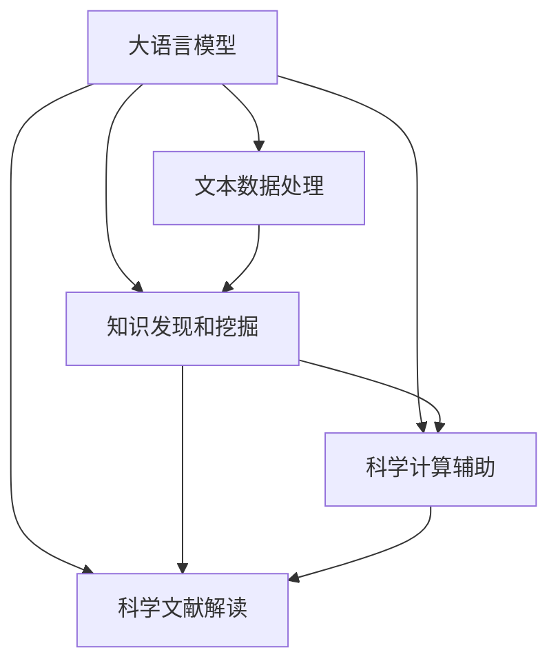

                 

# LLM在科学研究中的应用：加速科技创新

大语言模型（Large Language Model，LLM）作为人工智能领域的明星技术，在科学研究中展现出了广泛的应用前景和巨大的潜力。LLM在加速科技创新、推动知识发现和增强科学计算能力等方面，发挥着重要作用。本文将深入探讨LLM在科学研究中的核心概念、算法原理、具体操作步骤、实际应用场景以及未来发展方向，旨在为科研工作者和AI技术爱好者提供全面且深刻的洞察。

## 1. 背景介绍

### 1.1 问题由来

近年来，科学研究的复杂性和规模不断扩大，传统的人工处理方式已难以适应数据量激增的需求。科学研究涉及跨学科知识的应用、海量数据的高效处理、科学假设的验证等多个环节。而大语言模型凭借其强大的语言理解和生成能力，逐渐成为科研领域的新工具。LLM能够自动提取、整合和分析文本数据，挖掘隐含知识，辅助科学家进行科研创新。

### 1.2 问题核心关键点

大语言模型在科学研究中的应用主要体现在以下几个方面：

- 文本数据处理：自动提取、整理和标注文本数据，为科研工作提供高效的数据处理工具。
- 知识发现和挖掘：通过文本分析，发现潜在的科学问题、理论假设，促进科学研究的新思路和方向。
- 科学计算辅助：利用LLM生成代码、算法描述，加速科学计算和模拟。
- 科学文献解读：自动翻译、总结和推荐科学文献，为研究人员提供更全面的文献支持。

这些应用显著提高了科研工作的效率和创新性，为科学家提供了更为强大的技术支撑。

## 2. 核心概念与联系

### 2.1 核心概念概述

- **大语言模型（LLM）**：指基于深度学习架构，能够理解和生成人类自然语言的大型神经网络模型。BERT、GPT-3、T5等都是典型的LLM。
- **自然语言处理（NLP）**：涉及处理、分析、理解、生成自然语言的计算机技术。
- **文本挖掘（Text Mining）**：从文本数据中提取有用信息的过程，包括文本分类、信息抽取、情感分析等。
- **知识图谱（Knowledge Graph）**：表示实体间关系的图形结构，用于组织和检索知识。
- **科学计算（Scientific Computing）**：运用计算机处理科学问题的计算过程，包括数值计算、模拟仿真等。

这些核心概念共同构成了LLM在科学研究中的应用框架，展示了LLM如何通过高效处理和分析文本数据，辅助科研工作者进行数据驱动的创新探索。

### 2.2 核心概念原理和架构的 Mermaid 流程图



这个流程图展示了LLM在不同科学研究中的应用路径：

- 从大语言模型（A）出发，通过文本数据处理（B）、知识发现和挖掘（C）、科学计算辅助（D）以及科学文献解读（E）四个环节，最终促进科学研究的发展。

## 3. 核心算法原理 & 具体操作步骤

### 3.1 算法原理概述

LLM在科学研究中的应用主要基于监督学习和迁移学习的原理，通过在大规模无标签文本数据上进行预训练，学习通用的语言表示。这些模型在特定领域或任务的少量标注数据上进行微调，以获得针对该任务的高性能模型。

具体而言，LLM在科学研究中的应用可以概括为以下几个步骤：

1. **预训练**：在大规模语料库上训练模型，学习通用的语言表示。
2. **微调**：在特定领域的数据集上，对模型进行有监督训练，调整模型参数以适应该领域的特定任务。
3. **知识融合**：将模型生成的知识和信息与领域专家的先验知识进行融合，提升模型输出的科学性。
4. **推理与预测**：利用微调后的模型进行文本分析、数据挖掘等操作，辅助科学家进行科研创新。

### 3.2 算法步骤详解

#### 3.2.1 预训练步骤

1. **数据准备**：收集与科学研究相关的文本数据，如科学论文、专利文献、科研报告等。
2. **数据清洗**：清洗文本数据，去除噪声和无关信息，确保数据的质量和可用性。
3. **模型训练**：使用预训练的LLM架构，在大规模无标签数据集上进行训练，学习通用的语言表示。

#### 3.2.2 微调步骤

1. **数据准备**：收集特定领域的标注数据集，如科学问题、假设、实验结果等。
2. **模型初始化**：将预训练的模型作为初始化参数，开始微调过程。
3. **优化目标**：设定微调的优化目标，如分类准确率、均方误差等。
4. **训练过程**：使用微调数据集对模型进行训练，不断优化模型参数。

#### 3.2.3 知识融合步骤

1. **知识提取**：通过微调模型，提取科学文献中的关键信息，如方法、结论等。
2. **知识融合**：将模型提取的知识与领域专家的先验知识进行融合，提升模型输出的准确性和科学性。

#### 3.2.4 推理与预测步骤

1. **问题描述**：输入科学问题的自然语言描述，让模型理解问题的本质。
2. **信息生成**：模型生成可能的解决方案或理论假设。
3. **知识验证**：将生成的信息与领域专家的知识进行比对，验证其科学性。

### 3.3 算法优缺点

#### 3.3.1 优点

1. **高效数据处理**：LLM能够自动处理和分析大量文本数据，大大提升了科研数据的处理效率。
2. **多领域应用**：LLM适用于多种科研领域，如生物医学、物理化学、天文地理等。
3. **科学知识挖掘**：LLM能够挖掘文本中的隐含知识，辅助科研工作者发现新问题和新理论。
4. **跨学科合作**：LLM促进了不同学科之间的知识共享和协作，加速了科研创新的进程。

#### 3.3.2 缺点

1. **数据依赖性**：微调效果很大程度上依赖于标注数据的质量和数量，标注成本较高。
2. **模型复杂性**：大规模语言模型需要大量的计算资源，对算力和内存要求较高。
3. **知识偏见**：预训练数据中的偏见和误导信息可能影响模型的公正性和科学性。
4. **结果可解释性**：LLM生成的结果缺乏可解释性，难以理解其内部工作机制。

### 3.4 算法应用领域

LLM在科学研究中的应用领域广泛，涵盖以下几个方面：

1. **生物医学**：辅助药物研发、基因组分析、疾病预测等，通过处理大规模医学文献，提取重要信息和知识。
2. **物理化学**：支持材料科学、化学反应模拟、能源研究等，通过分析文本数据，发现新材料和新工艺。
3. **天文地理**：应用于天文观测、地理信息分析、环境监测等，通过挖掘文本信息，提取科研数据。
4. **社会科学**：协助社会学研究、历史研究、经济分析等，通过处理大量文献资料，提取关键信息和理论。

## 4. 数学模型和公式 & 详细讲解

### 4.1 数学模型构建

假设LLM的预训练模型为 $M_{\theta}$，其中 $\theta$ 为模型参数。给定科学研究领域的标注数据集 $D=\{(x_i, y_i)\}_{i=1}^N$，微调的目标是找到新的模型参数 $\hat{\theta}$，使得：

$$
\hat{\theta}=\mathop{\arg\min}_{\theta} \mathcal{L}(M_{\theta},D)
$$

其中 $\mathcal{L}$ 为针对特定科学研究任务设计的损失函数，用于衡量模型预测输出与真实标签之间的差异。常见的损失函数包括交叉熵损失、均方误差损失等。

### 4.2 公式推导过程

以分类任务为例，假设模型 $M_{\theta}$ 在输入 $x$ 上的输出为 $\hat{y}=M_{\theta}(x)$，表示样本属于类别的概率。真实标签 $y \in \{0,1\}$。则二分类交叉熵损失函数定义为：

$$
\ell(M_{\theta}(x),y) = -[y\log \hat{y} + (1-y)\log (1-\hat{y})]
$$

将其代入经验风险公式，得：

$$
\mathcal{L}(\theta) = -\frac{1}{N}\sum_{i=1}^N [y_i\log M_{\theta}(x_i)+(1-y_i)\log(1-M_{\theta}(x_i))]
$$

根据链式法则，损失函数对参数 $\theta_k$ 的梯度为：

$$
\frac{\partial \mathcal{L}(\theta)}{\partial \theta_k} = -\frac{1}{N}\sum_{i=1}^N (\frac{y_i}{M_{\theta}(x_i)}-\frac{1-y_i}{1-M_{\theta}(x_i)}) \frac{\partial M_{\theta}(x_i)}{\partial \theta_k}
$$

其中 $\frac{\partial M_{\theta}(x_i)}{\partial \theta_k}$ 可进一步递归展开，利用自动微分技术完成计算。

### 4.3 案例分析与讲解

以生物医学领域中的基因组分析为例，利用LLM进行科学研究：

1. **预训练**：在PubMed等医学文献库上预训练BERT模型，学习通用的语言表示。
2. **微调**：在特定基因组数据集上微调模型，调整顶层分类器，学习基因型与表型的关系。
3. **知识提取**：通过微调后的模型，提取基因组数据中的关键信息，如基因突变、基因表达等。
4. **知识验证**：将提取的信息与领域专家的先验知识进行比对，验证其科学性。

## 5. 项目实践：代码实例和详细解释说明

### 5.1 开发环境搭建

在进行LLM科学研究应用的实践前，我们需要准备好开发环境。以下是使用Python进行PyTorch开发的环境配置流程：

1. 安装Anaconda：从官网下载并安装Anaconda，用于创建独立的Python环境。

2. 创建并激活虚拟环境：
```bash
conda create -n pytorch-env python=3.8 
conda activate pytorch-env
```

3. 安装PyTorch：根据CUDA版本，从官网获取对应的安装命令。例如：
```bash
conda install pytorch torchvision torchaudio cudatoolkit=11.1 -c pytorch -c conda-forge
```

4. 安装Transformers库：
```bash
pip install transformers
```

5. 安装各类工具包：
```bash
pip install numpy pandas scikit-learn matplotlib tqdm jupyter notebook ipython
```

完成上述步骤后，即可在`pytorch-env`环境中开始科学研究应用的开发实践。

### 5.2 源代码详细实现

以下以基因组分析任务为例，给出使用Transformers库对BERT模型进行科学研究微调的PyTorch代码实现。

```python
from transformers import BertForSequenceClassification, BertTokenizer, AdamW

# 数据准备
train_dataset = ...
val_dataset = ...
test_dataset = ...

# 模型初始化
model = BertForSequenceClassification.from_pretrained('bert-base-cased', num_labels=num_labels)
tokenizer = BertTokenizer.from_pretrained('bert-base-cased')

# 定义损失函数和优化器
criterion = torch.nn.CrossEntropyLoss()
optimizer = AdamW(model.parameters(), lr=2e-5)

# 微调步骤
for epoch in range(num_epochs):
    model.train()
    for batch in train_loader:
        inputs, labels = batch
        inputs = tokenizer(inputs, return_tensors='pt')
        outputs = model(**inputs)
        loss = criterion(outputs.logits, labels)
        optimizer.zero_grad()
        loss.backward()
        optimizer.step()

    model.eval()
    for batch in val_loader:
        with torch.no_grad():
            inputs, labels = batch
            inputs = tokenizer(inputs, return_tensors='pt')
            outputs = model(**inputs)
            val_loss = criterion(outputs.logits, labels)

# 测试评估
model.eval()
with torch.no_grad():
    test_loss, test_acc = evaluate(model, test_loader)
```

### 5.3 代码解读与分析

让我们再详细解读一下关键代码的实现细节：

**数据准备**：
- `train_dataset`、`val_dataset`、`test_dataset`：分别表示训练集、验证集和测试集的数据集。

**模型初始化**：
- `BertForSequenceClassification.from_pretrained('bert-base-cased', num_labels=num_labels)`：使用预训练的BERT模型作为初始化参数，设置类别数为`num_labels`。
- `BertTokenizer.from_pretrained('bert-base-cased')`：使用预训练的BERT分词器，进行文本分词和编码。

**损失函数和优化器**：
- `torch.nn.CrossEntropyLoss()`：使用交叉熵损失函数，计算模型预测与真实标签之间的差异。
- `AdamW(model.parameters(), lr=2e-5)`：使用AdamW优化器，学习率为2e-5。

**微调步骤**：
- `model.train()`和`model.eval()`：在训练和评估模式下切换模型。
- `inputs, labels = batch`：从批次数据中提取输入和标签。
- `inputs = tokenizer(inputs, return_tensors='pt')`：使用分词器对输入进行编码。
- `outputs = model(**inputs)`：将编码后的输入输入模型，输出模型的预测。
- `loss = criterion(outputs.logits, labels)`：计算模型输出与真实标签之间的损失。
- `optimizer.zero_grad()`和`loss.backward()`：清空梯度，反向传播计算梯度。
- `optimizer.step()`：更新模型参数。

**测试评估**：
- `with torch.no_grad()`：在评估模式下禁用梯度计算。
- `test_loss, test_acc = evaluate(model, test_loader)`：使用自定义的评估函数对模型进行测试，计算损失和准确率。

**代码示例**：

```python
def evaluate(model, loader):
    model.eval()
    total_loss = 0
    total_correct = 0
    with torch.no_grad():
        for batch in loader:
            inputs, labels = batch
            inputs = tokenizer(inputs, return_tensors='pt')
            outputs = model(**inputs)
            loss = criterion(outputs.logits, labels)
            total_loss += loss.item()
            _, preds = outputs.logits.max(1)
            total_correct += (preds == labels).sum().item()
    return total_loss / len(loader), total_correct / len(loader.dataset)
```

## 6. 实际应用场景

### 6.1 生物医学研究

LLM在生物医学研究中的应用，主要体现在以下几个方面：

1. **基因组分析**：通过处理大规模的基因组数据，提取基因突变、基因表达等关键信息，辅助基因功能研究和新药开发。
2. **蛋白质结构预测**：利用LLM进行蛋白质序列的预测和分析，发现潜在功能区域和关键氨基酸。
3. **疾病预测与诊断**：结合医学文献和电子病历，分析患者症状和历史数据，预测疾病风险和诊断结果。

### 6.2 天文学研究

LLM在天文学研究中的应用，主要体现在以下几个方面：

1. **天体观测**：处理和分析天文观测数据，发现新天体和天文现象，辅助天文学家进行科研创新。
2. **宇宙学研究**：通过处理大量宇宙学数据，发现宇宙演化规律，推动宇宙学理论的发展。
3. **宇宙观测**：结合LLM和图像识别技术，分析天文图像，提取天体特征和运动轨迹。

### 6.3 社会科学研究

LLM在社会科学研究中的应用，主要体现在以下几个方面：

1. **历史研究**：处理和分析历史文献，发现历史事件和人物的关联，推动历史学研究。
2. **社会学研究**：分析社会数据，挖掘社会现象和规律，推动社会学理论的发展。
3. **经济分析**：结合LLM和数据挖掘技术，分析经济数据，预测经济趋势和波动。

## 7. 工具和资源推荐

### 7.1 学习资源推荐

为了帮助开发者系统掌握LLM在科学研究中的应用，这里推荐一些优质的学习资源：

1. 《Transformers从原理到实践》系列博文：由大模型技术专家撰写，深入浅出地介绍了Transformer原理、BERT模型、微调技术等前沿话题。

2. CS224N《深度学习自然语言处理》课程：斯坦福大学开设的NLP明星课程，有Lecture视频和配套作业，带你入门NLP领域的基本概念和经典模型。

3. 《Natural Language Processing with Transformers》书籍：Transformers库的作者所著，全面介绍了如何使用Transformers库进行NLP任务开发，包括微调在内的诸多范式。

4. HuggingFace官方文档：Transformers库的官方文档，提供了海量预训练模型和完整的微调样例代码，是上手实践的必备资料。

5. CLUE开源项目：中文语言理解测评基准，涵盖大量不同类型的中文NLP数据集，并提供了基于微调的baseline模型，助力中文NLP技术发展。

通过对这些资源的学习实践，相信你一定能够快速掌握LLM在科学研究中的应用精髓，并用于解决实际的NLP问题。

### 7.2 开发工具推荐

高效的开发离不开优秀的工具支持。以下是几款用于LLM科学研究应用的常用工具：

1. PyTorch：基于Python的开源深度学习框架，灵活动态的计算图，适合快速迭代研究。大部分预训练语言模型都有PyTorch版本的实现。

2. TensorFlow：由Google主导开发的开源深度学习框架，生产部署方便，适合大规模工程应用。同样有丰富的预训练语言模型资源。

3. Transformers库：HuggingFace开发的NLP工具库，集成了众多SOTA语言模型，支持PyTorch和TensorFlow，是进行科学研究应用的利器。

4. Weights & Biases：模型训练的实验跟踪工具，可以记录和可视化模型训练过程中的各项指标，方便对比和调优。与主流深度学习框架无缝集成。

5. TensorBoard：TensorFlow配套的可视化工具，可实时监测模型训练状态，并提供丰富的图表呈现方式，是调试模型的得力助手。

6. Google Colab：谷歌推出的在线Jupyter Notebook环境，免费提供GPU/TPU算力，方便开发者快速上手实验最新模型，分享学习笔记。

合理利用这些工具，可以显著提升LLM科学研究应用的开发效率，加快创新迭代的步伐。

### 7.3 相关论文推荐

LLM在科学研究中的应用源于学界的持续研究。以下是几篇奠基性的相关论文，推荐阅读：

1. Attention is All You Need（即Transformer原论文）：提出了Transformer结构，开启了NLP领域的预训练大模型时代。

2. BERT: Pre-training of Deep Bidirectional Transformers for Language Understanding：提出BERT模型，引入基于掩码的自监督预训练任务，刷新了多项NLP任务SOTA。

3. Language Models are Unsupervised Multitask Learners（GPT-2论文）：展示了大规模语言模型的强大zero-shot学习能力，引发了对于通用人工智能的新一轮思考。

4. Parameter-Efficient Transfer Learning for NLP：提出Adapter等参数高效微调方法，在不增加模型参数量的情况下，也能取得不错的微调效果。

5. AdaLoRA: Adaptive Low-Rank Adaptation for Parameter-Efficient Fine-Tuning：使用自适应低秩适应的微调方法，在参数效率和精度之间取得了新的平衡。

6. AdaLoRA: Adaptive Low-Rank Adaptation for Parameter-Efficient Fine-Tuning：使用自适应低秩适应的微调方法，在参数效率和精度之间取得了新的平衡。

这些论文代表了大语言模型微调技术的发展脉络。通过学习这些前沿成果，可以帮助研究者把握学科前进方向，激发更多的创新灵感。

## 8. 总结：未来发展趋势与挑战

### 8.1 总结

本文对基于大语言模型的科学研究应用进行了全面系统的介绍。首先阐述了LLM在科学研究中的背景和意义，明确了LLM在数据处理、知识发现、科学计算等方面的独特价值。其次，从原理到实践，详细讲解了LLM在科学研究中的应用流程，提供了微调任务开发的完整代码实例。同时，本文还广泛探讨了LLM在生物医学、天文学、社会科学等领域的实际应用场景，展示了LLM在科学研究中的广泛应用前景。

通过本文的系统梳理，可以看到，大语言模型在科学研究中的应用正在成为科研领域的新工具，极大地提高了科研工作的效率和创新性，为科学家提供了更为强大的技术支撑。未来，伴随LLM技术的不断演进，科学研究将迎来更加智能化、自动化、数据驱动的新时代。

### 8.2 未来发展趋势

展望未来，LLM在科学研究中的应用将呈现以下几个发展趋势：

1. **数据驱动的科学研究**：LLM能够自动处理和分析海量文本数据，为科学研究提供强大的数据驱动支持，推动数据密集型科学的发展。

2. **跨学科融合**：LLM促进了不同学科之间的知识共享和协作，推动跨学科研究的发展，提升科学研究的创新性和应用性。

3. **知识图谱与LLM结合**：LLM与知识图谱的结合，将为科学研究提供更加全面、准确的知识体系，辅助科学家进行创新探索。

4. **多模态融合**：结合图像、视频、声音等多模态数据，提升科学研究的准确性和全面性，推动多模态科学研究的发展。

5. **实时化、智能化**：LLM在科学研究中的应用将更加实时化、智能化，能够动态调整和优化模型参数，提升科研决策的准确性和效率。

6. **伦理、安全保障**：LLM在科学研究中的应用需要加强伦理和安全性的保障，确保数据和模型的公正性和安全性。

以上趋势凸显了LLM在科学研究中的广阔前景。这些方向的探索发展，将进一步推动科学研究向智能化、自动化、数据驱动方向迈进，为人类认知智能的进化带来深远影响。

### 8.3 面临的挑战

尽管LLM在科学研究中的应用已经取得了显著成效，但在实现大规模、多领域、智能化应用的过程中，仍面临诸多挑战：

1. **数据依赖性**：微调效果很大程度上依赖于标注数据的质量和数量，标注成本较高。如何进一步降低微调对标注样本的依赖，将是一大难题。

2. **知识偏见**：预训练数据中的偏见和误导信息可能影响模型的公正性和科学性。如何在数据和模型层面上消除偏见，确保科学研究的公正性和准确性，还需要更多研究和实践。

3. **结果可解释性**：LLM生成的结果缺乏可解释性，难以理解其内部工作机制。如何在保证性能的同时，赋予模型更强的可解释性，将是重要的研究方向。

4. **计算资源**：大规模语言模型需要大量的计算资源，对算力和内存要求较高。如何优化计算资源的使用，提高模型的计算效率，是未来研究的重点方向之一。

5. **伦理和安全性**：LLM在科学研究中的应用需要加强伦理和安全性保障，确保数据和模型的公正性和安全性。如何构建科学研究的伦理和安全框架，是未来研究的重要课题。

6. **多领域适应性**：LLM在不同领域的应用可能需要定制化的微调策略，如何在保持通用性的同时，提升多领域适应性，是未来研究的挑战之一。

### 8.4 研究展望

面对LLM在科学研究中所面临的挑战，未来的研究需要在以下几个方面寻求新的突破：

1. **数据增强与数据生成**：探索数据增强和数据生成技术，通过合成数据和迁移学习，降低标注数据的需求，提高模型的泛化能力。

2. **知识图谱与LLM融合**：将知识图谱与LLM结合，构建更为全面、准确的知识体系，提升科学研究的创新性和应用性。

3. **多模态融合**：结合图像、视频、声音等多模态数据，提升科学研究的准确性和全面性，推动多模态科学研究的发展。

4. **伦理和安全性**：构建科学研究的伦理和安全框架，确保数据和模型的公正性和安全性，推动伦理AI的发展。

5. **实时化、智能化**：推动LLM在科学研究中的应用实时化、智能化，动态调整和优化模型参数，提升科研决策的准确性和效率。

6. **模型优化与加速**：优化计算资源的使用，提高模型的计算效率，推动LLM在科学研究中的应用规模化、实时化。

这些研究方向将推动LLM在科学研究中的应用向更加智能化、自动化、数据驱动方向迈进，为人类认知智能的进化带来深远影响。面向未来，LLM在科学研究中的应用需要与其他人工智能技术进行更深入的融合，如知识表示、因果推理、强化学习等，多路径协同发力，共同推动科学研究的发展。只有勇于创新、敢于突破，才能不断拓展语言模型的边界，让智能技术更好地造福人类社会。

## 9. 附录：常见问题与解答

**Q1：什么是大语言模型？**

A: 大语言模型（LLM）指基于深度学习架构，能够理解和生成人类自然语言的大型神经网络模型。BERT、GPT-3、T5等都是典型的LLM。

**Q2：大语言模型在科学研究中的应用有哪些？**

A: 大语言模型在科学研究中的应用主要体现在以下几个方面：
- 文本数据处理：自动提取、整理和标注文本数据，为科研工作提供高效的数据处理工具。
- 知识发现和挖掘：通过文本分析，发现潜在的科学问题、理论假设，促进科学研究的新思路和方向。
- 科学计算辅助：利用LLM生成代码、算法描述，加速科学计算和模拟。
- 科学文献解读：自动翻译、总结和推荐科学文献，为研究人员提供更全面的文献支持。

**Q3：如何选择合适的学习率？**

A: 微调的学习率一般要比预训练时小1-2个数量级，如果使用过大的学习率，容易破坏预训练权重，导致过拟合。一般建议从1e-5开始调参，逐步减小学习率，直至收敛。也可以使用warmup策略，在开始阶段使用较小的学习率，再逐渐过渡到预设值。

**Q4：大语言模型在科学研究中面临哪些挑战？**

A: 大语言模型在科学研究中的应用仍面临诸多挑战：
- 数据依赖性：微调效果很大程度上依赖于标注数据的质量和数量，标注成本较高。
- 知识偏见：预训练数据中的偏见和误导信息可能影响模型的公正性和科学性。
- 结果可解释性：LLM生成的结果缺乏可解释性，难以理解其内部工作机制。
- 计算资源：大规模语言模型需要大量的计算资源，对算力和内存要求较高。
- 伦理和安全性：LLM在科学研究中的应用需要加强伦理和安全性保障，确保数据和模型的公正性和安全性。

**Q5：大语言模型在科学研究中如何提高泛化能力？**

A: 提高大语言模型在科学研究中的泛化能力，可以从以下几个方面进行：
- 数据增强：通过回译、近义替换等方式扩充训练集，增加数据的多样性。
- 正则化：使用L2正则、Dropout等技术，防止过拟合。
- 多模态融合：结合图像、视频、声音等多模态数据，提升模型的全面性和准确性。
- 知识图谱融合：将知识图谱与LLM结合，构建更为全面、准确的知识体系，提升模型的泛化能力。

通过以上方法，可以提高大语言模型在科学研究中的泛化能力，使其在不同领域和数据集上都能取得良好的表现。

---

作者：禅与计算机程序设计艺术 / Zen and the Art of Computer Programming

