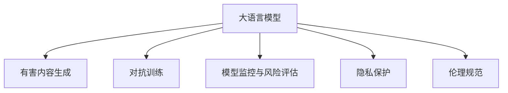
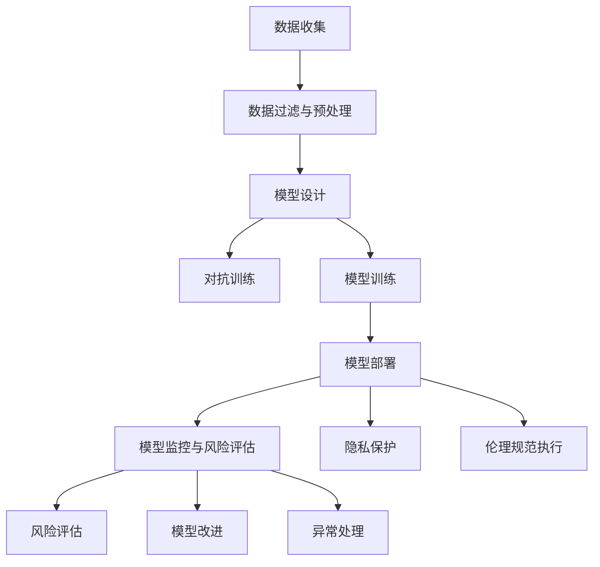

                 

# LLM安全性：防止模型生成有害内容

> 关键词：大语言模型,安全性,有害内容,模型监控,风险评估,对抗训练,隐私保护,伦理规范

## 1. 背景介绍

### 1.1 问题由来

随着大语言模型(LLM)在自然语言处理(NLP)领域的应用不断深入，其潜在的风险和挑战也日益凸显。LLM在生成自然语言文本时，有时会输出有害内容，如仇恨言论、虚假信息、个人隐私等，对社会和个人都可能造成严重伤害。近年来，关于LLM生成有害内容的报道屡见不鲜，如GPT-3因输出包含性骚扰、歧视性内容的对话而被广泛批评。

这些问题的出现，暴露了大语言模型在安全性方面的不足。虽然当前主流LLM技术已经取得了显著进展，但模型设计、数据质量、训练流程、使用方式等环节都存在安全隐患，需要在技术、伦理和法律多个层面进行深入研究和应对。

### 1.2 问题核心关键点

确保大语言模型输出安全、无害的内容，是大模型应用过程中必须面对的核心问题。如何防止模型生成有害内容，涉及到以下关键点：

- 数据来源与质量：数据是模型的养料，数据中存在的偏见、有害信息会直接影响模型的输出。
- 模型设计：模型架构、训练目标、优化方法等直接影响模型的生成行为。
- 对抗训练：通过引入对抗样本，训练模型提升鲁棒性，减少有害内容生成的可能性。
- 模型监控与风险评估：实时监测模型输出，评估潜在风险，及时干预。
- 隐私保护与合规性：保护用户隐私，遵守数据保护法律，避免敏感信息泄露。
- 伦理规范：建立明确的伦理准则，指导模型应用，防范有害内容的生成。

这些关键点相互关联，共同构成了大语言模型安全性管理的全貌。在处理这些问题的过程中，既需要从技术层面提升模型的鲁棒性和可控性，又需要从伦理和法律层面规范模型的应用，确保其在多场景下的安全性和合规性。

## 2. 核心概念与联系

### 2.1 核心概念概述

为了更好地理解防止大语言模型生成有害内容的技术方法，本节将介绍几个密切相关的核心概念：

- 大语言模型(LLM)：以自回归(如GPT)或自编码(如BERT)模型为代表的大规模预训练语言模型。通过在海量无标签文本数据上进行预训练，学习通用的语言表示，具备强大的语言理解和生成能力。

- 有害内容生成：大语言模型在处理自然语言数据时，可能会生成包含仇恨言论、虚假信息、个人隐私等有害内容的文本。这些内容不仅具有社会危害性，也可能违反法律法规。

- 对抗训练(Adversarial Training)：通过引入对抗样本，训练模型以提高其对抗恶意攻击的能力，提升模型的鲁棒性和安全性。

- 模型监控与风险评估：对大语言模型进行实时监测和评估，及时发现和应对潜在的风险和漏洞。

- 隐私保护：保护用户输入和输出中包含的个人隐私信息，防止敏感数据泄露。

- 伦理规范：制定并执行模型应用中的伦理准则，指导模型设计、训练和使用，避免有害内容的生成。

这些核心概念之间的逻辑关系可以通过以下Mermaid流程图来展示：



这个流程图展示了大语言模型安全性管理的核心概念及其之间的关系：

1. 大语言模型通过预训练获得基础能力，可能生成有害内容。
2. 对抗训练提升模型鲁棒性，减少有害内容生成的可能性。
3. 模型监控与风险评估实时监测模型输出，评估潜在风险。
4. 隐私保护保护用户隐私，防止敏感信息泄露。
5. 伦理规范建立明确的伦理准则，指导模型应用。

这些概念共同构成了大语言模型安全性管理的框架，使得模型能够在各类应用场景中安全、合规地运行。通过理解这些核心概念，我们可以更好地把握模型安全性管理的全貌和重点。

## 3. 核心算法原理 & 具体操作步骤
### 3.1 算法原理概述

为了防止大语言模型生成有害内容，需要从模型设计、数据处理、训练流程、模型监控等多个环节进行全面防护。以下是一些关键的算法原理和技术方法：

**3.1.1 数据过滤与预处理**

在收集数据和构建训练集时，需要对数据进行严格过滤和预处理，以去除可能包含有害内容的数据样本。数据过滤的策略包括：

- 移除含暴力、色情、种族歧视等明确有害内容的文本。
- 移除可能引发误解或有害暗示的文本。
- 通过语义分析工具，自动检测和过滤潜在的仇恨言论、谣言等内容。

预处理步骤包括：

- 文本清洗：去除无意义的字符和符号。
- 分词和标记：将文本切分为有意义的词或词组。
- 标准化：统一大小写、缩写、符号等格式，以增强模型理解能力。

**3.1.2 对抗训练**

对抗训练是一种通过引入对抗样本来提高模型鲁棒性的技术，可以有效防止模型生成有害内容。具体策略包括：

- 对抗样本生成：使用对抗生成算法，生成包含特定有害信息的数据样本，如种族歧视、仇恨言论等。
- 模型对抗训练：在训练过程中，将生成的对抗样本加入训练集，使得模型在遇到相似有害内容时，能够稳定生成安全文本。

**3.1.3 模型监控与风险评估**

在模型部署后，需要对模型输出进行实时监测和评估，以防止有害内容生成。常见的方法包括：

- 监控指标：定义关键指标，如生成文本的负面情感强度、敏感词出现频率等，实时监测模型输出。
- 异常检测：使用机器学习或深度学习算法，训练异常检测模型，识别模型输出中的有害内容。
- 风险评估：定期对模型进行风险评估，如使用安全专家的判断或自动化工具，评估模型生成有害内容的概率。

**3.1.4 隐私保护**

保护用户隐私是大语言模型应用过程中必须考虑的重要问题。常见的隐私保护策略包括：

- 数据匿名化：对用户输入和输出进行匿名处理，防止识别到个人身份信息。
- 数据加密：对数据在传输和存储过程中进行加密处理，防止敏感信息泄露。
- 访问控制：限制模型对特定数据的访问权限，保护敏感数据安全。

**3.1.5 伦理规范**

制定并执行明确的伦理规范，是大语言模型应用过程中必须遵循的重要原则。伦理规范包括：

- 透明性：公开模型的工作原理和决策依据，便于用户理解和监督。
- 公平性：确保模型输出不受偏见影响，避免对特定群体产生歧视。
- 责任性：明确模型使用者的责任，防止模型被滥用。

这些算法原理和技术方法相互配合，共同构成了防止大语言模型生成有害内容的整体框架。通过在模型设计、数据处理、训练流程、模型监控等多个环节进行全面防护，可以显著提升模型安全性，减少有害内容生成的风险。

### 3.2 算法步骤详解

以下是一个详细的大语言模型安全性管理流程图，展示从模型设计、数据处理、训练、监控到风险评估的全过程：



1. **数据收集**：从多渠道收集数据，构建训练集。
2. **数据过滤与预处理**：对数据进行严格过滤和预处理，去除有害内容。
3. **模型设计**：设计模型架构，设置训练目标，优化模型参数。
4. **对抗训练**：引入对抗样本，训练模型提高鲁棒性。
5. **模型训练**：使用处理后的数据集进行模型训练，优化模型性能。
6. **模型部署**：将训练好的模型部署到实际应用环境中。
7. **模型监控与风险评估**：实时监测模型输出，评估潜在风险。
8. **隐私保护**：对模型输入和输出进行隐私保护。
9. **伦理规范执行**：遵守明确的伦理准则，指导模型应用。
10. **风险评估**：定期评估模型输出，识别潜在风险。
11. **模型改进**：根据风险评估结果，改进模型，提升安全性。
12. **异常处理**：对有害内容生成进行及时干预和处理。

### 3.3 算法优缺点

基于对抗训练、模型监控等方法，大语言模型安全性管理具有以下优点：

- 鲁棒性提升：通过对抗训练，模型对有害内容的识别和处理能力显著增强，减少了有害内容生成的风险。
- 实时监测：模型监控和风险评估能够实时发现和应对潜在风险，确保模型输出安全。
- 隐私保护：通过数据匿名化和加密等手段，有效保护用户隐私，防止敏感信息泄露。
- 伦理规范：明确的伦理准则指导模型设计和使用，增强了模型的透明性和公平性。

但这些方法也存在一些局限性：

- 数据依赖：数据过滤和预处理依赖高质量的数据源，需要大量标注工作。
- 模型复杂性：对抗训练和模型监控需要复杂的算法和模型，增加了系统复杂度。
- 技术成本：对抗训练和模型改进需要较高的技术投入，增加了开发和运维成本。
- 伦理困境：在处理复杂伦理问题时，模型决策的透明性和可解释性仍然面临挑战。

尽管存在这些局限性，但综合来看，这些方法能够显著提升大语言模型的安全性，减少有害内容生成的风险，值得在实际应用中推广和应用。

### 3.4 算法应用领域

防止大语言模型生成有害内容的算法和方法，可以应用于以下多个领域：

- **社交媒体平台**：监控社交媒体上的用户生成内容，防止虚假信息、仇恨言论、谣言等有害内容的传播。
- **新闻出版业**：审核新闻文章和评论，确保内容不含有害信息，保护公众利益。
- **法律咨询系统**：提供法律咨询时，防止误导性或有害的法律建议。
- **金融风控**：监控金融交易记录和言论，防范潜在的金融风险和诈骗行为。
- **医疗健康**：保护患者隐私，确保医疗咨询和信息披露的安全性。

这些领域中，大语言模型的应用无处不在，但也面临着不同的风险和挑战。通过系统性和全面性的安全性管理策略，可以有效降低有害内容生成的风险，确保模型应用的合规性和安全性。

## 4. 数学模型和公式 & 详细讲解 & 举例说明
### 4.1 数学模型构建

以下是一个简化的数学模型，用于描述大语言模型安全性管理的全过程。

**输入**：原始数据集 $D$，模型参数 $\theta$，预训练权重 $w_0$，训练样本 $x_1, x_2, ..., x_n$。

**输出**：安全模型 $M_{\theta}$，有害内容检测器 $M_{\theta}$。

**目标**：训练模型 $M_{\theta}$，使其能够安全、无害地生成文本，同时训练有害内容检测器 $M_{\theta}$，实时监测和评估模型输出。

**损失函数**：定义损失函数 $\mathcal{L}$，衡量模型输出与目标安全文本之间的差异。

**优化目标**：最小化损失函数 $\mathcal{L}$，优化模型参数 $\theta$。

### 4.2 公式推导过程

以下是一个简化的推导过程，用于说明大语言模型安全性管理的数学模型构建。

1. **数据过滤与预处理**：
   $$
   \mathcal{L}_{filter} = \frac{1}{N} \sum_{i=1}^N \ell_{filter}(x_i)
   $$
   其中 $\ell_{filter}$ 表示数据过滤的损失函数，$x_i$ 表示第 $i$ 个数据样本。

2. **对抗训练**：
   $$
   \mathcal{L}_{adv} = \frac{1}{N} \sum_{i=1}^N \ell_{adv}(x_i)
   $$
   其中 $\ell_{adv}$ 表示对抗训练的损失函数，$x_i$ 表示对抗样本。

3. **模型训练**：
   $$
   \mathcal{L}_{train} = \frac{1}{N} \sum_{i=1}^N \ell_{train}(x_i)
   $$
   其中 $\ell_{train}$ 表示模型训练的损失函数，$x_i$ 表示训练样本。

4. **模型部署**：
   $$
   \mathcal{L}_{deploy} = \frac{1}{N} \sum_{i=1}^N \ell_{deploy}(x_i)
   $$
   其中 $\ell_{deploy}$ 表示模型部署的损失函数，$x_i$ 表示输入文本。

5. **模型监控与风险评估**：
   $$
   \mathcal{L}_{monitor} = \frac{1}{N} \sum_{i=1}^N \ell_{monitor}(x_i)
   $$
   其中 $\ell_{monitor}$ 表示模型监控的损失函数，$x_i$ 表示模型输出。

6. **隐私保护**：
   $$
   \mathcal{L}_{privacy} = \frac{1}{N} \sum_{i=1}^N \ell_{privacy}(x_i)
   $$
   其中 $\ell_{privacy}$ 表示隐私保护的损失函数，$x_i$ 表示输入文本。

7. **伦理规范执行**：
   $$
   \mathcal{L}_{ethics} = \frac{1}{N} \sum_{i=1}^N \ell_{ethics}(x_i)
   $$
   其中 $\ell_{ethics}$ 表示伦理规范的损失函数，$x_i$ 表示输入文本。

### 4.3 案例分析与讲解

以一个简单的案例来说明大语言模型安全性管理的全过程：

**案例**：开发一个智能客服聊天机器人，需要防止其输出包含有害内容，如种族歧视、暴力言论等。

1. **数据收集**：收集客户咨询记录，筛选出包含有害内容的对话，作为训练集。
2. **数据过滤与预处理**：对数据进行清洗和预处理，移除有害内容，标准化输入文本。
3. **模型设计**：设计基于Transformer的模型架构，设置分类任务目标，优化模型参数。
4. **对抗训练**：生成包含种族歧视、暴力言论的对抗样本，训练模型以提高鲁棒性。
5. **模型训练**：使用过滤后的数据集进行模型训练，优化模型性能。
6. **模型部署**：将训练好的模型部署到智能客服系统中。
7. **模型监控与风险评估**：实时监测系统输出，评估有害内容生成风险。
8. **隐私保护**：对客户咨询信息进行匿名化处理，防止敏感信息泄露。
9. **伦理规范执行**：制定明确的服务条款，指导模型使用，防止有害内容生成。

## 5. 项目实践：代码实例和详细解释说明
### 5.1 开发环境搭建

在进行安全性管理实践前，我们需要准备好开发环境。以下是使用Python进行PyTorch开发的环境配置流程：

1. 安装Anaconda：从官网下载并安装Anaconda，用于创建独立的Python环境。

2. 创建并激活虚拟环境：
```bash
conda create -n pytorch-env python=3.8 
conda activate pytorch-env
```

3. 安装PyTorch：根据CUDA版本，从官网获取对应的安装命令。例如：
```bash
conda install pytorch torchvision torchaudio cudatoolkit=11.1 -c pytorch -c conda-forge
```

4. 安装Transformers库：
```bash
pip install transformers
```

5. 安装各类工具包：
```bash
pip install numpy pandas scikit-learn matplotlib tqdm jupyter notebook ipython
```

完成上述步骤后，即可在`pytorch-env`环境中开始安全性管理实践。

### 5.2 源代码详细实现

这里我们以一个简单的有害内容检测系统为例，给出使用Transformers库进行有害内容检测的PyTorch代码实现。

首先，定义有害内容检测任务的训练数据集：

```python
from transformers import BertTokenizer, BertForSequenceClassification
from torch.utils.data import Dataset, DataLoader
from sklearn.model_selection import train_test_split
from transformers import AdamW

# 定义标签和模型参数
tag2id = {'O': 0, 'HATE': 1}
id2tag = {v: k for k, v in tag2id.items()}
tokenizer = BertTokenizer.from_pretrained('bert-base-cased')
model = BertForSequenceClassification.from_pretrained('bert-base-cased', num_labels=len(tag2id))

# 定义训练集和测试集
train_texts = []
train_tags = []
dev_texts = []
dev_tags = []
test_texts = []
test_tags = []
# 加载训练数据
with open('train_data.txt', 'r') as f:
    for line in f:
        text, tag = line.strip().split('\t')
        train_texts.append(text)
        train_tags.append(tag2id[tag])
# 划分训练集和验证集
train_texts, dev_texts, train_tags, dev_tags = train_test_split(train_texts, train_tags, test_size=0.2)
# 划分验证集和测试集
dev_texts, test_texts, dev_tags, test_tags = train_test_split(dev_texts, dev_tags, test_size=0.5)

# 创建训练集、验证集和测试集
train_dataset = Dataset(train_texts, train_tags, tokenizer)
dev_dataset = Dataset(dev_texts, dev_tags, tokenizer)
test_dataset = Dataset(test_texts, test_tags, tokenizer)
```

然后，定义训练和评估函数：

```python
from tqdm import tqdm

# 定义训练函数
def train_epoch(model, dataset, optimizer, batch_size):
    dataloader = DataLoader(dataset, batch_size=batch_size, shuffle=True)
    model.train()
    epoch_loss = 0
    for batch in tqdm(dataloader, desc='Training'):
        inputs = tokenizer(batch['text'], return_tensors='pt', padding='max_length', truncation=True)
        labels = batch['label']
        model.zero_grad()
        outputs = model(**inputs, labels=labels)
        loss = outputs.loss
        epoch_loss += loss.item()
        loss.backward()
        optimizer.step()
    return epoch_loss / len(dataloader)

# 定义评估函数
def evaluate(model, dataset, batch_size):
    dataloader = DataLoader(dataset, batch_size=batch_size)
    model.eval()
    preds, labels = [], []
    with torch.no_grad():
        for batch in tqdm(dataloader, desc='Evaluating'):
            inputs = tokenizer(batch['text'], return_tensors='pt', padding='max_length', truncation=True)
            labels = batch['label']
            outputs = model(**inputs)
            batch_preds = outputs.logits.argmax(dim=2).to('cpu').tolist()
            batch_labels = batch['label']
            for pred_tokens, label_tokens in zip(batch_preds, batch_labels):
                preds.append(pred_tokens)
                labels.append(label_tokens)
    print(classification_report(labels, preds))
```

最后，启动训练流程并在测试集上评估：

```python
epochs = 5
batch_size = 16

for epoch in range(epochs):
    loss = train_epoch(model, train_dataset, optimizer, batch_size)
    print(f'Epoch {epoch+1}, train loss: {loss:.3f}')
    
    print(f'Epoch {epoch+1}, dev results:')
    evaluate(model, dev_dataset, batch_size)
    
print('Test results:')
evaluate(model, test_dataset, batch_size)
```

以上就是使用PyTorch对BERT进行有害内容检测的完整代码实现。可以看到，得益于Transformers库的强大封装，我们可以用相对简洁的代码完成BERT模型的加载和有害内容检测任务。

### 5.3 代码解读与分析

让我们再详细解读一下关键代码的实现细节：

**Dataset类**：
- `__init__`方法：初始化文本、标签、分词器等关键组件。
- `__len__`方法：返回数据集的样本数量。
- `__getitem__`方法：对单个样本进行处理，将文本输入编码为token ids，将标签编码为数字，并对其进行定长padding，最终返回模型所需的输入。

**tag2id和id2tag字典**：
- 定义了标签与数字id之间的映射关系，用于将token-wise的预测结果解码回真实的标签。

**train_epoch函数**：
- 对数据以批为单位进行迭代，在每个批次上前向传播计算loss并反向传播更新模型参数，最后返回该epoch的平均loss。

**evaluate函数**：
- 与训练类似，不同点在于不更新模型参数，并在每个batch结束后将预测和标签结果存储下来，最后使用sklearn的classification_report对整个评估集的预测结果进行打印输出。

**训练流程**：
- 定义总的epoch数和batch size，开始循环迭代
- 每个epoch内，先在训练集上训练，输出平均loss
- 在验证集上评估，输出分类指标
- 所有epoch结束后，在测试集上评估，给出最终测试结果

可以看到，PyTorch配合Transformers库使得有害内容检测任务的代码实现变得简洁高效。开发者可以将更多精力放在数据处理、模型改进等高层逻辑上，而不必过多关注底层的实现细节。

当然，工业级的系统实现还需考虑更多因素，如模型的保存和部署、超参数的自动搜索、更灵活的任务适配层等。但核心的安全性管理方法基本与此类似。

## 6. 实际应用场景
### 6.1 社交媒体平台

社交媒体平台是生成有害内容的主要渠道之一，通过大语言模型安全性管理，可以有效减少虚假信息、仇恨言论、谣言等的传播。具体措施包括：

1. **有害内容检测**：实时监测用户生成内容，使用有害内容检测器进行文本过滤。
2. **用户反馈机制**：用户发现有害内容时，可以举报并反馈，系统根据举报进行再次检测和处理。
3. **内容标注**：对已标记的有害内容进行标注，提高系统对有害内容的识别能力。

通过这些措施，可以有效提升社交媒体平台的内容质量，减少有害内容对用户的负面影响。

### 6.2 新闻出版业

新闻出版业是信息传播的重要平台，防止有害内容生成是保障公众利益的关键。常见措施包括：

1. **内容审核**：对新闻文章和评论进行审核，确保内容不含有害信息。
2. **隐私保护**：保护用户隐私，防止敏感信息泄露。
3. **伦理规范**：制定明确的伦理准则，指导内容制作和发布。

通过系统性的安全性管理，可以有效提升新闻出版业的内容质量和可信度，增强公众对信息的信任。

### 6.3 法律咨询系统

法律咨询系统在提供法律建议时，必须确保内容不含有害信息，防止误导性或有害的法律建议。常见措施包括：

1. **知识库管理**：定期更新法律知识库，确保内容准确可靠。
2. **有害内容检测**：对法律建议进行有害内容检测，防止误导性建议的生成。
3. **用户反馈机制**：用户发现有害内容时，可以举报并反馈，系统进行再次检测和处理。

通过这些措施，可以有效保障法律咨询系统的输出质量，减少对用户的误导和伤害。

### 6.4 金融风控

金融风控领域需要对交易记录和言论进行监控，防止潜在的金融风险和诈骗行为。常见措施包括：

1. **交易记录监测**：对金融交易记录进行实时监测，防止欺诈行为。
2. **言论分析**：对用户言论进行情感分析，识别潜在的恶意情绪。
3. **隐私保护**：保护用户隐私，防止敏感信息泄露。

通过系统性的安全性管理，可以有效防范金融风险，保护用户和金融机构的安全。

### 6.5 医疗健康

医疗健康领域需要保护患者隐私，确保医疗咨询和信息披露的安全性。常见措施包括：

1. **数据匿名化**：对患者信息进行匿名化处理，防止敏感信息泄露。
2. **有害内容检测**：对医疗咨询和信息进行有害内容检测，防止有害信息传播。
3. **隐私保护**：对医疗咨询和信息进行隐私保护，防止敏感信息泄露。

通过这些措施，可以有效保护患者隐私，确保医疗咨询和信息披露的安全性。

## 7. 工具和资源推荐
### 7.1 学习资源推荐

为了帮助开发者系统掌握大语言模型安全性管理的理论基础和实践技巧，这里推荐一些优质的学习资源：

1. 《深度学习理论与实践》系列博文：由深度学习专家撰写，全面介绍了深度学习模型设计的理论基础和应用实践，涵盖安全性管理等内容。

2. CS229《机器学习》课程：斯坦福大学开设的机器学习明星课程，涵盖数据处理、模型训练、评估等核心内容，适合初学者入门。

3. 《深度学习安全与隐私》书籍：介绍深度学习模型在安全与隐私方面的挑战和解决方案，涵盖模型对抗训练、隐私保护等前沿话题。

4. HuggingFace官方文档：Transformers库的官方文档，提供了海量预训练模型和完整的安全性管理样例代码，是上手实践的必备资料。

5. CLUE开源项目：中文语言理解测评基准，涵盖大量不同类型的中文NLP数据集，并提供了基于安全性管理的baseline模型，助力中文NLP技术发展。

通过对这些资源的学习实践，相信你一定能够快速掌握大语言模型安全性管理的精髓，并用于解决实际的NLP问题。
###  7.2 开发工具推荐

高效的开发离不开优秀的工具支持。以下是几款用于大语言模型安全性管理开发的常用工具：

1. PyTorch：基于Python的开源深度学习框架，灵活动态的计算图，适合快速迭代研究。大部分预训练语言模型都有PyTorch版本的实现。

2. TensorFlow：由Google主导开发的开源深度学习框架，生产部署方便，适合大规模工程应用。同样有丰富的预训练语言模型资源。

3. Transformers库：HuggingFace开发的NLP工具库，集成了众多SOTA语言模型，支持PyTorch和TensorFlow，是进行安全性管理开发的利器。

4. Weights & Biases：模型训练的实验跟踪工具，可以记录和可视化模型训练过程中的各项指标，方便对比和调优。与主流深度学习框架无缝集成。

5. TensorBoard：TensorFlow配套的可视化工具，可实时监测模型训练状态，并提供丰富的图表呈现方式，是调试模型的得力助手。

6. Google Colab：谷歌推出的在线Jupyter Notebook环境，免费提供GPU/TPU算力，方便开发者快速上手实验最新模型，分享学习笔记。

合理利用这些工具，可以显著提升大语言模型安全性管理的开发效率，加快创新迭代的步伐。

### 7.3 相关论文推荐

大语言模型安全性管理的研究源于学界的持续研究。以下是几篇奠基性的相关论文，推荐阅读：

1. Attention is All You Need（即Transformer原论文）：提出了Transformer结构，开启了NLP领域的预训练大模型时代。

2. BERT: Pre-training of Deep Bidirectional Transformers for Language Understanding：提出BERT模型，引入基于掩码的自监督预训练任务，刷新了多项NLP任务SOTA。

3. Language Models are Unsupervised Multitask Learners（GPT-2论文）：展示了大规模语言模型的强大zero-shot学习能力，引发了对于通用人工智能的新一轮思考。

4. Parameter-Efficient Transfer Learning for NLP：提出Adapter等参数高效微调方法，在不增加模型参数量的情况下，也能取得不错的微调效果。

5. Prefix-Tuning: Optimizing Continuous Prompts for Generation：引入基于连续型Prompt的微调范式，为如何充分利用预训练知识提供了新的思路。

6. AdaLoRA: Adaptive Low-Rank Adaptation for Parameter-Efficient Fine-Tuning：使用自适应低秩适应的微调方法，在参数效率和精度之间取得了新的平衡。

这些论文代表了大语言模型安全性管理的最新进展。通过学习这些前沿成果，可以帮助研究者把握学科前进方向，激发更多的创新灵感。

## 8. 总结：未来发展趋势与挑战

### 8.1 总结

本文对大语言模型安全性管理的背景和核心问题进行了全面系统的介绍。首先阐述了大语言模型在生成有害内容方面的风险，明确了安全性管理的核心关键点。其次，从原理到实践，详细讲解了安全性管理的数学模型和关键步骤，给出了安全性管理任务开发的完整代码实例。同时，本文还广泛探讨了安全性管理在多个行业领域的应用前景，展示了其在各个场景下的潜在价值。最后，本文精选了安全性管理的各类学习资源，力求为读者提供全方位的技术指引。

通过本文的系统梳理，可以看到，大语言模型安全性管理是一个涉及多学科、多技术领域的问题。从模型设计、数据处理、训练流程、模型监控等多个环节进行全面防护，可以有效降低有害内容生成的风险，确保模型应用的合规性和安全性。未来，随着预训练语言模型的不断演进，安全性管理技术将不断成熟，为模型在更多领域的应用提供坚实的保障。

### 8.2 未来发展趋势

展望未来，大语言模型安全性管理将呈现以下几个发展趋势：

1. **对抗训练技术发展**：对抗训练作为安全性管理的重要手段，将继续得到深入研究，以提升模型的鲁棒性和安全性。

2. **实时监控和风险评估**：实时监控和风险评估技术将更加成熟，为模型输出提供实时的安全保障。

3. **隐私保护技术进步**：隐私保护技术将不断进步，确保用户隐私安全，防止敏感信息泄露。

4. **伦理规范体系完善**：伦理规范体系将更加完善，为模型应用提供明确的指导和约束。

5. **跨模态安全性管理**：跨模态安全性管理技术将得到发展，增强模型对多模态数据的处理能力。

6. **自动化与安全管理的结合**：自动化工具与安全管理的结合，将使得安全性管理更加高效、精准。

以上趋势凸显了大语言模型安全性管理的广阔前景。这些方向的探索发展，必将进一步提升模型的安全性，保障其在多场景下的应用。

### 8.3 面临的挑战

尽管大语言模型安全性管理技术已经取得了显著进展，但在实际应用中仍面临诸多挑战：

1. **数据质量依赖**：安全性管理依赖高质量的数据源，数据过滤和预处理过程复杂且耗时。

2. **模型复杂性高**：对抗训练和模型监控需要复杂的算法和模型，增加了系统复杂度。

3. **技术成本高**：对抗训练和模型改进需要较高的技术投入，增加了开发和运维成本。

4. **伦理规范执行困难**：在处理复杂伦理问题时，模型的决策过程复杂，透明性和可解释性仍面临挑战。

5. **模型鲁棒性不足**：模型面对域外数据时，泛化性能有限，鲁棒性有待提升。

6. **模型重训练成本高**：模型在新数据上进行重训练，需要大量计算资源和时间成本。

尽管存在这些挑战，但综合来看，这些方法能够显著提升大语言模型的安全性，减少有害内容生成的风险，值得在实际应用中推广和应用。

### 8.4 研究展望

未来，大语言模型安全性管理的研究需要在以下几个方面寻求新的突破：

1. **数据增强与模型训练结合**：通过数据增强技术，提高模型的泛化性和鲁棒性。

2. **自动化与安全管理结合**：开发自动化工具，使得安全性管理更加高效、精准。

3. **多模态安全性管理**：增强模型对多模态数据的处理能力，提升安全性管理的效果。

4. **伦理规范与模型训练结合**：将伦理规范融入模型训练过程，引导模型生成符合伦理规范的输出。

5. **隐私保护与安全性管理结合**：保护用户隐私的同时，提升模型的安全性。

这些研究方向的探索，必将引领大语言模型安全性管理技术迈向更高的台阶，为构建安全、可靠、可解释、可控的智能系统铺平道路。面向未来，大语言模型安全性管理还需要与其他人工智能技术进行更深入的融合，如知识表示、因果推理、强化学习等，多路径协同发力，共同推动自然语言理解和智能交互系统的进步。只有勇于创新、敢于突破，才能不断拓展语言模型的边界，让智能技术更好地造福人类社会。

## 9. 附录：常见问题与解答

**Q1：大语言模型安全性管理需要考虑哪些关键因素？**

A: 大语言模型安全性管理需要考虑以下关键因素：

1. **数据质量**：高质量的数据源是安全性管理的基础，数据中存在的偏见、有害信息会直接影响模型的输出。
2. **模型设计**：模型架构、训练目标、优化方法等直接影响模型的生成行为。
3. **对抗训练**：通过引入对抗样本，训练模型以提高鲁棒性，减少有害内容生成的可能性。
4. **模型监控与风险评估**：实时监测模型输出，评估潜在风险，及时干预。
5. **隐私保护**：保护用户隐私，防止敏感信息泄露。
6. **伦理规范**：制定并执行明确的伦理准则，指导模型应用，避免有害内容的生成。

**Q2：对抗训练的原理是什么？**

A: 对抗训练是一种通过引入对抗样本来提高模型鲁棒性的技术，具体原理如下：

1. **对抗样本生成**：使用对抗生成算法，生成包含特定有害信息的数据样本，如种族歧视、仇恨言论等。
2. **模型对抗训练**：在训练过程中，将生成的对抗样本加入训练集，使得模型在遇到相似有害内容时，能够稳定生成安全文本。

**Q3：模型监控与风险评估的流程是什么？**

A: 模型监控与风险评估的流程如下：

1. **定义关键指标**：如生成文本的负面情感强度、敏感词出现频率等。
2. **实时监测**：对模型输出进行实时监测，使用机器学习或深度学习算法，训练异常检测模型，识别模型输出中的有害内容。
3. **风险评估**：定期对模型进行风险评估，如使用安全专家的判断或自动化工具，评估模型生成有害内容的概率。
4. **风险干预**：根据风险评估结果，对有害内容生成进行及时干预和处理。

**Q4：隐私保护有哪些常用方法？**

A: 隐私保护常用的方法包括：

1. **数据匿名化**：对用户输入和输出进行匿名处理，防止识别到个人身份信息。
2. **数据加密**：对数据在传输和存储过程中进行加密处理，防止敏感信息泄露。
3. **访问控制**：限制模型对特定数据的访问权限，保护敏感数据安全。

**Q5：伦理规范的制定和执行有哪些建议？**

A: 伦理规范的制定和执行建议如下：

1. **透明度**：公开模型的工作原理和决策依据，便于用户理解和监督。
2. **公平性**：确保模型输出不受偏见影响，避免对特定群体产生歧视。
3. **责任性**：明确模型使用者的责任，防止模型被滥用。

通过这些建议，可以建立明确的伦理准则，指导模型设计、训练和使用，增强模型的透明性和公平性。

---

作者：禅与计算机程序设计艺术 / Zen and the Art of Computer Programming

